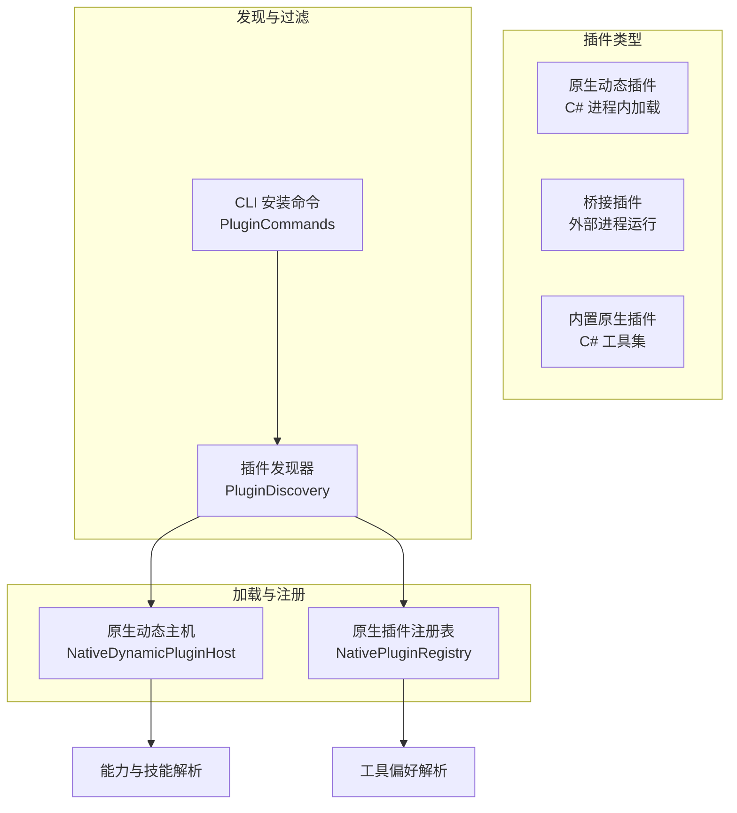
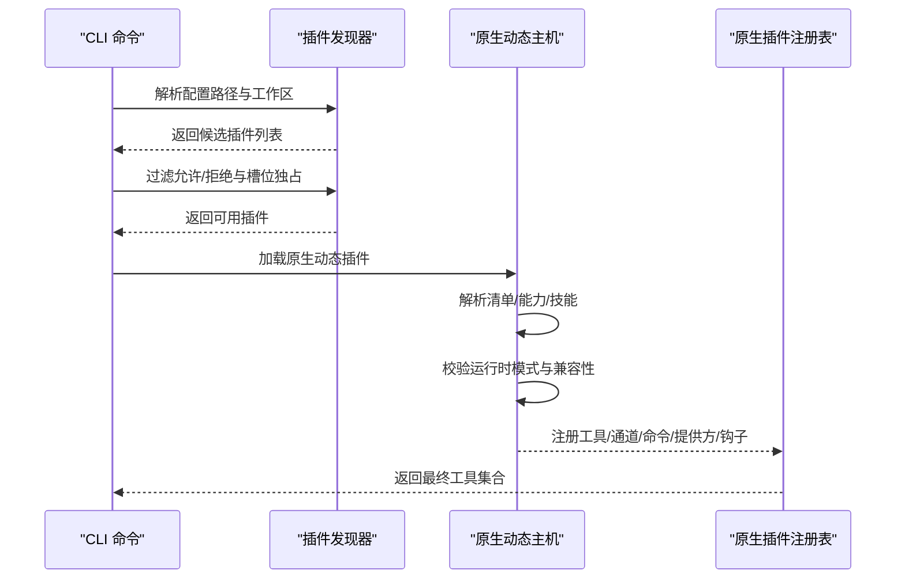
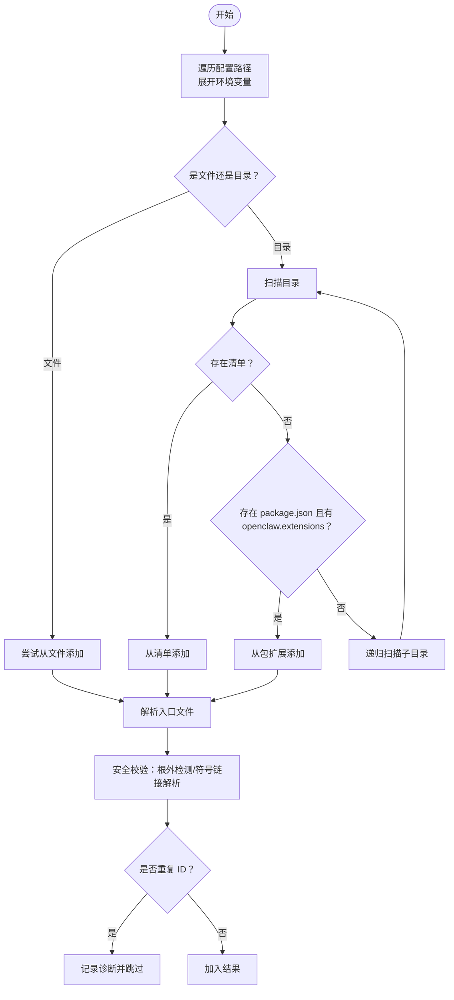
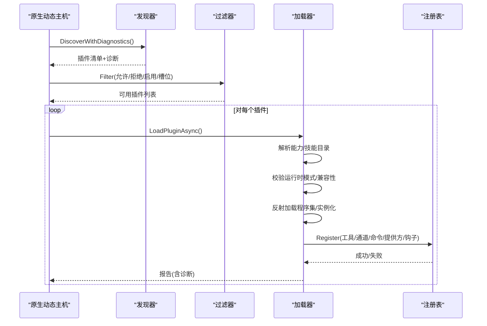
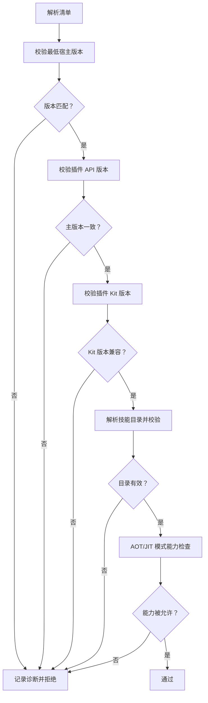
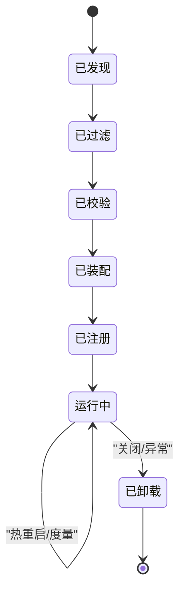
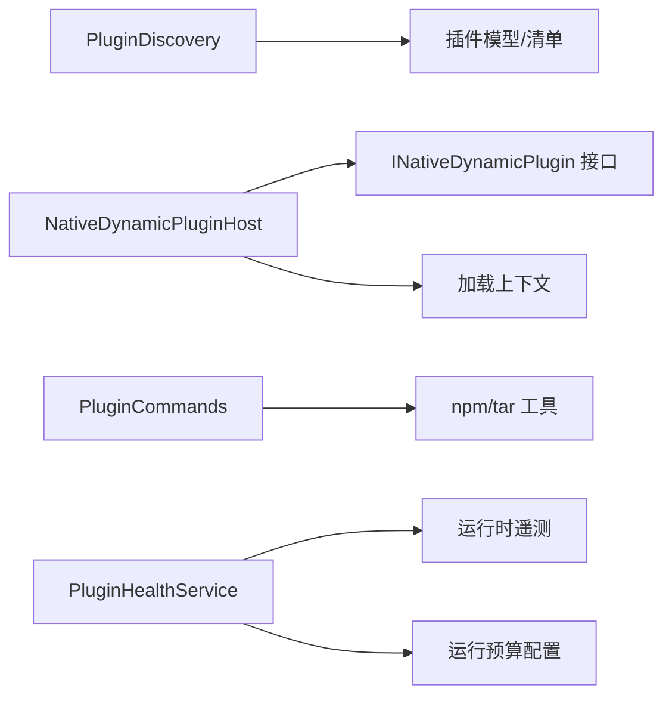

# 插件加载流程

<cite>
**本文档引用的文件**
- [NativeDynamicPluginHost.cs](file://src/OpenClaw.Agent/Plugins/NativeDynamicPluginHost.cs)
- [PluginDiscovery.cs](file://src/OpenClaw.Core/Plugins/PluginDiscovery.cs)
- [PluginCommands.cs](file://src/OpenClaw.Cli/PluginCommands.cs)
- [NativePluginRegistry.cs](file://src/OpenClaw.Agent/Plugins/NativePluginRegistry.cs)
- [INativeDynamicPlugin.cs](file://src/OpenClaw.PluginKit/INativeDynamicPlugin.cs)
- [RuntimeDiscovery.cs](file://src/OpenClaw.Agent/Plugins/RuntimeDiscovery.cs)
- [openclaw.native-plugin.json](file://src/OpenClaw.Plugins.EmploymentCoachWorkflow/openclaw.native-plugin.json)
- [PluginBridgeIntegrationTests.cs](file://src/OpenClaw.Tests/PluginBridgeIntegrationTests.cs)
- [OperatorRuntimeServicesTests.cs](file://src/OpenClaw.Tests/OperatorRuntimeServicesTests.cs)
- [PluginHealthService.cs](file://src/OpenClaw.Gateway/PluginHealthService.cs)
</cite>

## 目录
1. [简介](#简介)
2. [项目结构](#项目结构)
3. [核心组件](#核心组件)
4. [架构总览](#架构总览)
5. [详细组件分析](#详细组件分析)
6. [依赖关系分析](#依赖关系分析)
7. [性能考虑](#性能考虑)
8. [故障排除指南](#故障排除指南)
9. [结论](#结论)
10. [附录](#附录)

## 简介
本文件系统化阐述插件加载流程，覆盖插件发现机制、加载顺序控制、依赖解析与初始化过程；详述插件目录扫描、清单文件解析、能力声明验证与兼容性检查；并包含生命周期管理、热重载机制、错误恢复策略与性能优化建议。同时提供开发者调试指南、常见问题排查与性能监控方法。

## 项目结构
插件系统由三类插件构成：
- 原生动态插件（C#）：通过清单声明能力与技能目录，按需加载到进程内。
- 桥接插件（Node/Go等）：通过桥接进程运行，支持热重启与运行时度量。
- 内置原生插件（C#）：基于配置启用工具集，作为首选或备选来源。

图示来源
- [PluginDiscovery.cs:22-63](file://src/OpenClaw.Core/Plugins/PluginDiscovery.cs#L22-L63)
- [NativeDynamicPluginHost.cs:64-169](file://src/OpenClaw.Agent/Plugins/NativeDynamicPluginHost.cs#L64-L169)
- [NativePluginRegistry.cs:13-120](file://src/OpenClaw.Agent/Plugins/NativePluginRegistry.cs#L13-L120)
- [PluginCommands.cs:39-317](file://src/OpenClaw.Cli/PluginCommands.cs#L39-L317)

章节来源
- [PluginDiscovery.cs:22-63](file://src/OpenClaw.Core/Plugins/PluginDiscovery.cs#L22-L63)
- [PluginCommands.cs:39-317](file://src/OpenClaw.Cli/PluginCommands.cs#L39-L317)

## 核心组件
- 插件发现器：负责从标准路径与配置路径扫描插件，解析清单与入口文件，执行安全校验与重复检测。
- 原生动态插件主机：负责原生动态插件的发现、过滤、清单校验、能力与技能解析、装配与注册，并在AOT/JIT运行模式下进行能力限制。
- 原生插件注册表：管理内置原生工具，处理重复名称冲突与工具偏好解析。
- CLI 插件命令：提供安装、卸载、列出、搜索插件的能力，支持 npm 包与本地源安装。
- 运行时发现器：辅助定位 Node.js 等外部运行时可执行文件。
- 健康服务：基于预算与诊断信息评估插件健康状态，触发重启与告警。

章节来源
- [PluginDiscovery.cs:11-632](file://src/OpenClaw.Core/Plugins/PluginDiscovery.cs#L11-L632)
- [NativeDynamicPluginHost.cs:19-908](file://src/OpenClaw.Agent/Plugins/NativeDynamicPluginHost.cs#L19-L908)
- [NativePluginRegistry.cs:13-265](file://src/OpenClaw.Agent/Plugins/NativePluginRegistry.cs#L13-L265)
- [PluginCommands.cs:14-792](file://src/OpenClaw.Cli/PluginCommands.cs#L14-L792)
- [RuntimeDiscovery.cs:8-115](file://src/OpenClaw.Agent/Plugins/RuntimeDiscovery.cs#L8-L115)
- [PluginHealthService.cs:306-340](file://src/OpenClaw.Gateway/PluginHealthService.cs#L306-L340)

## 架构总览
插件加载遵循“发现—过滤—校验—装配—注册—运行”的闭环流程。不同类型的插件采用不同的加载路径与运行边界，确保安全与性能。

图示来源
- [PluginDiscovery.cs:22-105](file://src/OpenClaw.Core/Plugins/PluginDiscovery.cs#L22-L105)
- [NativeDynamicPluginHost.cs:64-169](file://src/OpenClaw.Agent/Plugins/NativeDynamicPluginHost.cs#L64-L169)
- [NativePluginRegistry.cs:137-233](file://src/OpenClaw.Agent/Plugins/NativePluginRegistry.cs#L137-L233)

## 详细组件分析

### 插件发现机制
- 路径优先级：配置路径 → 工作区扩展 → 全局扩展 → 内置打包（遵循 OpenClaw 规范）。
- 清单解析：支持 openclaw.plugin.json 与 package.json 的 openclaw.extensions。
- 入口文件解析：优先 index.ts/js/mjs，其次 package.json 中的 extensions 列表，最后回退到根目录唯一脚本。
- 安全校验：禁止入口或技能目录位于插件根之外；对符号链接进行深度解析与逃逸检测。
- 重复检测：同一插件 ID 只保留首次发现项，后续重复项记录诊断并跳过。

图示来源
- [PluginDiscovery.cs:28-154](file://src/OpenClaw.Core/Plugins/PluginDiscovery.cs#L28-L154)
- [PluginDiscovery.cs:183-286](file://src/OpenClaw.Core/Plugins/PluginDiscovery.cs#L183-L286)
- [PluginDiscovery.cs:288-431](file://src/OpenClaw.Core/Plugins/PluginDiscovery.cs#L288-L431)
- [PluginDiscovery.cs:503-631](file://src/OpenClaw.Core/Plugins/PluginDiscovery.cs#L503-L631)

章节来源
- [PluginDiscovery.cs:22-105](file://src/OpenClaw.Core/Plugins/PluginDiscovery.cs#L22-L105)
- [PluginDiscovery.cs:183-286](file://src/OpenClaw.Core/Plugins/PluginDiscovery.cs#L183-L286)
- [PluginDiscovery.cs:288-431](file://src/OpenClaw.Core/Plugins/PluginDiscovery.cs#L288-L431)
- [PluginDiscovery.cs:503-631](file://src/OpenClaw.Core/Plugins/PluginDiscovery.cs#L503-L631)

### 原生动态插件加载与初始化
- 发现阶段：支持从清单文件与工作区/全局目录扫描，解析 openclaw.native-plugin.json。
- 过滤阶段：根据允许/拒绝列表、每插件启用状态与槽位独占规则筛选。
- 运行时模式校验：在 AOT 模式下阻止需要 JIT 的原生动态插件；记录诊断并抛出异常。
- 装配阶段：创建独立的加载上下文，反射加载程序集，验证插件 Kit 版本，实例化插件类型并调用注册接口。
- 注册阶段：收集工具、通道、命令、提供方、内存提供方与钩子，合并技能目录，生成加载报告。
- 错误恢复：失败时回滚已启动的服务与上下文，清理增量状态，保证幂等性。

图示来源
- [NativeDynamicPluginHost.cs:64-169](file://src/OpenClaw.Agent/Plugins/NativeDynamicPluginHost.cs#L64-L169)
- [NativeDynamicPluginHost.cs:210-345](file://src/OpenClaw.Agent/Plugins/NativeDynamicPluginHost.cs#L210-L345)
- [NativeDynamicPluginHost.cs:451-467](file://src/OpenClaw.Agent/Plugins/NativeDynamicPluginHost.cs#L451-L467)
- [INativeDynamicPlugin.cs:11-46](file://src/OpenClaw.PluginKit/INativeDynamicPlugin.cs#L11-L46)

章节来源
- [NativeDynamicPluginHost.cs:64-169](file://src/OpenClaw.Agent/Plugins/NativeDynamicPluginHost.cs#L64-L169)
- [NativeDynamicPluginHost.cs:210-345](file://src/OpenClaw.Agent/Plugins/NativeDynamicPluginHost.cs#L210-L345)
- [NativeDynamicPluginHost.cs:451-467](file://src/OpenClaw.Agent/Plugins/NativeDynamicPluginHost.cs#L451-L467)
- [INativeDynamicPlugin.cs:11-46](file://src/OpenClaw.PluginKit/INativeDynamicPlugin.cs#L11-L46)

### 能力声明验证与兼容性检查
- 最低宿主版本与插件 API 版本校验：确保插件目标的 API 主版本与宿主兼容。
- 插件 Kit 版本校验：防止不兼容的插件 Kit 引用导致运行时异常。
- 技能目录校验：确保技能目录在插件根内且存在，否则记录诊断。
- 运行时模式限制：AOT 模式下禁止需要 JIT 的能力，生成明确的诊断与错误消息。

图示来源
- [NativeDynamicPluginHost.cs:700-782](file://src/OpenClaw.Agent/Plugins/NativeDynamicPluginHost.cs#L700-L782)
- [NativeDynamicPluginHost.cs:398-436](file://src/OpenClaw.Agent/Plugins/NativeDynamicPluginHost.cs#L398-L436)
- [NativeDynamicPluginHost.cs:88-130](file://src/OpenClaw.Agent/Plugins/NativeDynamicPluginHost.cs#L88-L130)

章节来源
- [NativeDynamicPluginHost.cs:700-782](file://src/OpenClaw.Agent/Plugins/NativeDynamicPluginHost.cs#L700-L782)
- [NativeDynamicPluginHost.cs:398-436](file://src/OpenClaw.Agent/Plugins/NativeDynamicPluginHost.cs#L398-L436)
- [NativeDynamicPluginHost.cs:88-130](file://src/OpenClaw.Agent/Plugins/NativeDynamicPluginHost.cs#L88-L130)

### 生命周期管理与热重载
- 原生动态插件：通过独立加载上下文实现卸载，释放服务与适配器资源；支持重启计数查询与内存快照获取。
- 桥接插件：通过桥接进程与传输层实现热重启与度量统计，测试覆盖了重启后工具可用性与重启指标更新。
- 健康服务：依据预算（最大重启次数、工作集上限、兼容性错误数）评估插件健康状况并触发策略。

图示来源
- [NativeDynamicPluginHost.cs:656-698](file://src/OpenClaw.Agent/Plugins/NativeDynamicPluginHost.cs#L656-L698)
- [PluginBridgeIntegrationTests.cs:1482-1508](file://src/OpenClaw.Tests/PluginBridgeIntegrationTests.cs#L1482-L1508)
- [PluginHealthService.cs:306-340](file://src/OpenClaw.Gateway/PluginHealthService.cs#L306-L340)

章节来源
- [NativeDynamicPluginHost.cs:656-698](file://src/OpenClaw.Agent/Plugins/NativeDynamicPluginHost.cs#L656-L698)
- [PluginBridgeIntegrationTests.cs:1482-1508](file://src/OpenClaw.Tests/PluginBridgeIntegrationTests.cs#L1482-L1508)
- [PluginHealthService.cs:306-340](file://src/OpenClaw.Gateway/PluginHealthService.cs#L306-L340)

### 错误恢复策略
- 失败回滚：捕获异常后清理已启动的服务与加载上下文，回退到加载前状态，避免泄漏。
- 结构化日志：将诊断信息以结构化日志输出，便于审计与排障。
- 报告聚合：统一生成加载报告，包含插件 ID、入口路径、运行时模式、能力、诊断与错误详情。

章节来源
- [NativeDynamicPluginHost.cs:332-370](file://src/OpenClaw.Agent/Plugins/NativeDynamicPluginHost.cs#L332-L370)
- [NativeDynamicPluginHost.cs:171-188](file://src/OpenClaw.Agent/Plugins/NativeDynamicPluginHost.cs#L171-L188)
- [NativeDynamicPluginHost.cs:288-330](file://src/OpenClaw.Agent/Plugins/NativeDynamicPluginHost.cs#L288-L330)

### 性能优化
- 路径解析优化：使用真实路径解析与符号链接深度限制，减少无效 IO。
- 并发与取消：加载过程支持取消令牌，避免长时间阻塞。
- 资源回收：在卸载时主动释放服务与适配器，降低内存占用。
- 预算控制：通过健康服务的预算参数限制重启与内存使用，保障系统稳定性。

章节来源
- [PluginDiscovery.cs:539-605](file://src/OpenClaw.Core/Plugins/PluginDiscovery.cs#L539-L605)
- [NativeDynamicPluginHost.cs:134-135](file://src/OpenClaw.Agent/Plugins/NativeDynamicPluginHost.cs#L134-L135)
- [PluginHealthService.cs:306-318](file://src/OpenClaw.Gateway/PluginHealthService.cs#L306-L318)

## 依赖关系分析
- 插件发现器依赖 JSON 上下文解析清单，依赖文件系统 API 扫描与解析路径。
- 原生动态主机依赖插件 Kit 接口定义，依赖加载上下文隔离与反射加载。
- CLI 插件命令依赖 npm 与 tar 工具链，负责安装与验证插件包。
- 健康服务依赖运行时遥测源与预算配置，用于评估与治理插件行为。

图示来源
- [PluginDiscovery.cs:11-632](file://src/OpenClaw.Core/Plugins/PluginDiscovery.cs#L11-L632)
- [NativeDynamicPluginHost.cs:19-908](file://src/OpenClaw.Agent/Plugins/NativeDynamicPluginHost.cs#L19-L908)
- [PluginCommands.cs:14-792](file://src/OpenClaw.Cli/PluginCommands.cs#L14-L792)
- [PluginHealthService.cs:306-340](file://src/OpenClaw.Gateway/PluginHealthService.cs#L306-L340)

章节来源
- [PluginDiscovery.cs:11-632](file://src/OpenClaw.Core/Plugins/PluginDiscovery.cs#L11-L632)
- [NativeDynamicPluginHost.cs:19-908](file://src/OpenClaw.Agent/Plugins/NativeDynamicPluginHost.cs#L19-L908)
- [PluginCommands.cs:14-792](file://src/OpenClaw.Cli/PluginCommands.cs#L14-L792)
- [PluginHealthService.cs:306-340](file://src/OpenClaw.Gateway/PluginHealthService.cs#L306-L340)

## 性能考虑
- I/O 与扫描：优先使用已知清单与入口路径，减少目录递归扫描范围。
- 反射与加载：尽量复用加载上下文，避免频繁卸载/重新加载。
- 诊断与日志：结构化诊断有助于快速定位瓶颈，避免冗余日志输出。
- 预算与节流：合理设置重启与内存预算，防止插件抖动影响整体性能。

## 故障排除指南
- 清单解析失败：检查 openclaw.plugin.json 或 openclaw.native-plugin.json 是否符合预期格式。
- 入口文件不在根内：确认入口相对路径解析后仍处于插件根目录内。
- 技能目录缺失或越界：核对清单中的 skills 字段与实际目录是否存在且位于根内。
- 运行时模式限制：AOT 模式下禁止需要 JIT 的能力，需调整插件能力声明或切换运行模式。
- 重复插件 ID：同一 ID 多次出现时仅保留首个，后续重复会被跳过并记录诊断。
- 配置校验失败：当配置不符合 schema 时会阻止加载，检查配置枚举值与必填字段。

章节来源
- [PluginDiscovery.cs:193-277](file://src/OpenClaw.Core/Plugins/PluginDiscovery.cs#L193-L277)
- [NativeDynamicPluginHost.cs:534-625](file://src/OpenClaw.Agent/Plugins/NativeDynamicPluginHost.cs#L534-L625)
- [NativeDynamicPluginHost.cs:88-130](file://src/OpenClaw.Agent/Plugins/NativeDynamicPluginHost.cs#L88-L130)
- [PluginBridgeIntegrationTests.cs:441-608](file://src/OpenClaw.Tests/PluginBridgeIntegrationTests.cs#L441-L608)

## 结论
插件系统通过严格的发现、过滤、校验与装配流程，结合运行时模式限制与健康治理，实现了安全、可控与可观测的插件加载体验。开发者可通过 CLI 快速安装与验证插件，借助结构化诊断与健康服务持续优化插件质量与系统稳定性。

## 附录
- 开发者调试要点
  - 使用 CLI 列出与搜索插件，核对信任级别与声明表面。
  - 关注结构化诊断日志，定位清单、入口、技能与配置问题。
  - 在 AOT 模式下避免声明需要 JIT 的能力。
- 常见问题
  - 插件未加载：检查允许/拒绝列表、槽位独占与每插件启用状态。
  - 工具名冲突：原生动态插件注册时会跳过重复名称并记录诊断。
  - 桥接插件重启：确认传输层与重启指标，观察重启后工具可用性。
- 性能监控
  - 启用健康服务预算，关注重启次数、工作集与兼容性错误阈值。
  - 通过遥测源获取插件运行时指标，结合日志进行根因分析。

章节来源
- [PluginCommands.cs:275-317](file://src/OpenClaw.Cli/PluginCommands.cs#L275-L317)
- [NativePluginRegistry.cs:74-104](file://src/OpenClaw.Agent/Plugins/NativePluginRegistry.cs#L74-L104)
- [PluginHealthService.cs:306-340](file://src/OpenClaw.Gateway/PluginHealthService.cs#L306-L340)