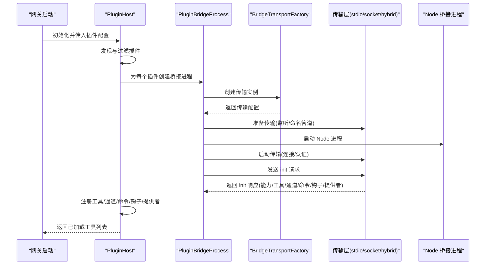
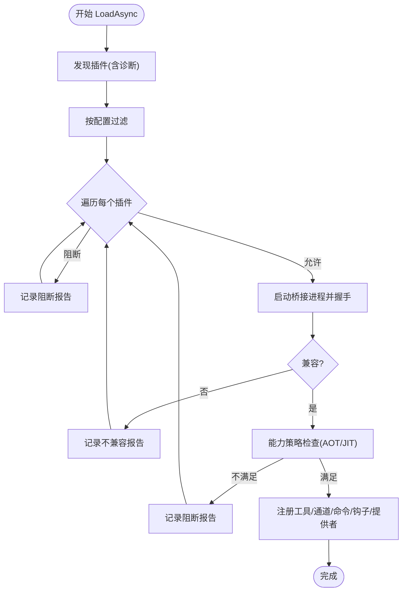
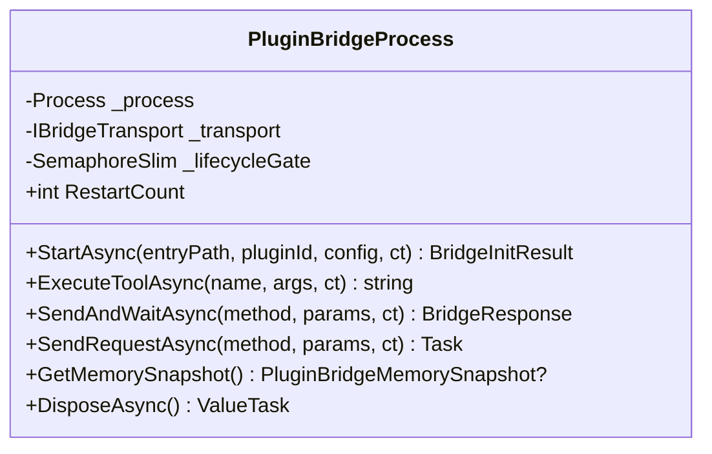
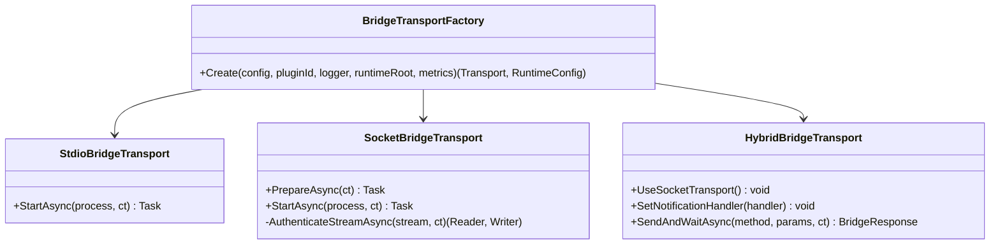
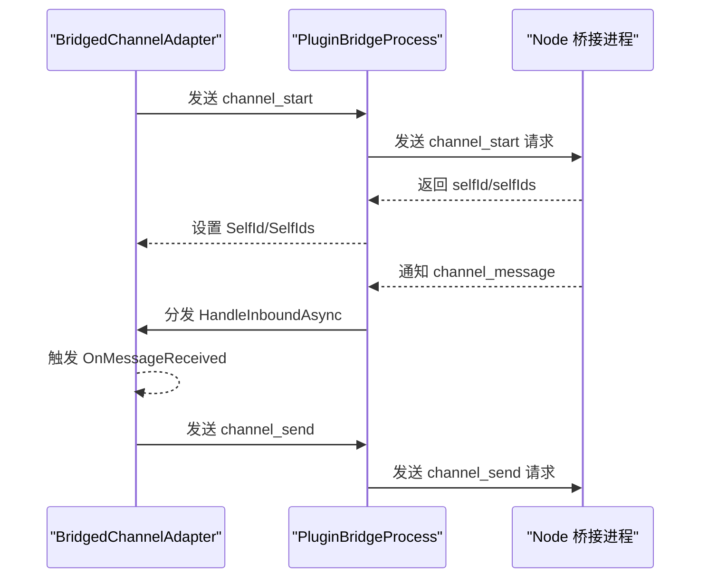
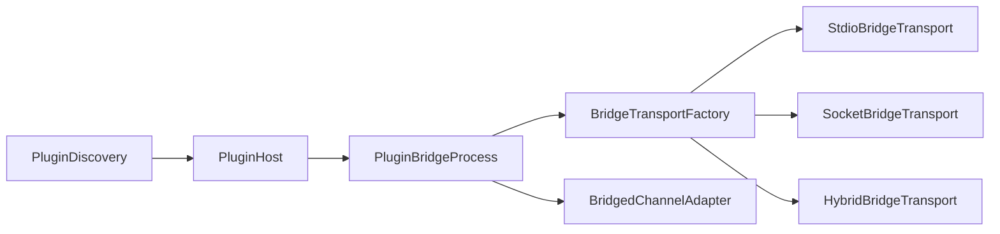

# 桥接插件

<cite>
**本文引用的文件**   
- [PluginHost.cs](file://src/OpenClaw.Agent/Plugins/PluginHost.cs)
- [PluginBridgeProcess.cs](file://src/OpenClaw.Agent/Plugins/PluginBridgeProcess.cs)
- [BridgedChannelAdapter.cs](file://src/OpenClaw.Agent/Plugins/BridgedChannelAdapter.cs)
- [BridgeTransportFactory.cs](file://src/OpenClaw.Agent/Plugins/BridgeTransportFactory.cs)
- [SocketBridgeTransport.cs](file://src/OpenClaw.Agent/Plugins/SocketBridgeTransport.cs)
- [StdioBridgeTransport.cs](file://src/OpenClaw.Agent/Plugins/StdioBridgeTransport.cs)
- [HybridBridgeTransport.cs](file://src/OpenClaw.Agent/Plugins/HybridBridgeTransport.cs)
- [PluginDiscovery.cs](file://src/OpenClaw.Core/Plugins/PluginDiscovery.cs)
- [RuntimeInitializationExtensions.CompositionStages.cs](file://src/OpenClaw.Gateway/Composition/RuntimeInitializationExtensions.CompositionStages.cs)
- [PluginBridgeIntegrationTests.cs](file://src/OpenClaw.Tests/PluginBridgeIntegrationTests.cs)
- [PluginHealthService.cs](file://src/OpenClaw.Gateway/PluginHealthService.cs)
- [OperatorRuntimeServicesTests.cs](file://src/OpenClaw.Tests/OperatorRuntimeServicesTests.cs)
- [SocketBridgeTransportTests.cs](file://src/OpenClaw.Tests/SocketBridgeTransportTests.cs)
- [Program.cs](file://src/OpenClaw.WhatsApp.BaileysWorker/Program.cs)
</cite>

## 目录
1. [简介](#简介)
2. [项目结构](#项目结构)
3. [核心组件](#核心组件)
4. [架构总览](#架构总览)
5. [详细组件分析](#详细组件分析)
6. [依赖关系分析](#依赖关系分析)
7. [性能考量](#性能考量)
8. [故障排查指南](#故障排查指南)
9. [结论](#结论)
10. [附录：桥接协议与开发指南](#附录桥接协议与开发指南)

## 简介
本文件面向桥接插件系统（TypeScript/JavaScript 插件通过 Node.js 桥接）的技术文档，覆盖从初始化到运行期的全链路机制，包括：
- PluginHost 的初始化与插件加载流程
- 工具注册、命令注册、事件钩子、通道适配器与提供者注册
- 通道适配器集成与消息分发
- 生命周期管理、错误处理策略、性能监控与安全控制
- 桥接协议规范、消息传递格式、异步通信模式与超时处理
- 开发指南、调试技巧与最佳实践

## 项目结构
桥接插件系统由“宿主侧”和“桥接侧”两部分组成：
- 宿主侧（.NET）：负责插件发现、过滤、加载、生命周期管理、通道适配器注册、命令转发等
- 桥接侧（Node.js）：在独立进程中运行，承载插件逻辑并通过本地 IPC 与宿主交互

```mermaid
graph TB
subgraph "宿主侧(.NET)"
PH["PluginHost<br/>插件主机"]
PB["PluginBridgeProcess<br/>桥接进程"]
BCA["BridgedChannelAdapter<br/>桥接通道适配器"]
TF["BridgeTransportFactory<br/>传输工厂"]
ST["StdioBridgeTransport"]
SO["SocketBridgeTransport"]
HY["HybridBridgeTransport"]
PD["PluginDiscovery<br/>插件发现"]
end
subgraph "桥接侧(Node.js)"
BR["Node 桥接脚本<br/>插件进程"]
end
PD --> PH
PH --> PB
TF --> ST
TF --> SO
TF --> HY
PB <- --> ST
PB <- --> SO
PB <- --> HY
PB --> BR
PH --> BCA
BCA --> PB
```

图示来源
- [PluginHost.cs:95-179](file://src/OpenClaw.Agent/Plugins/PluginHost.cs#L95-L179)
- [PluginBridgeProcess.cs:91-112](file://src/OpenClaw.Agent/Plugins/PluginBridgeProcess.cs#L91-L112)
- [BridgeTransportFactory.cs:11-45](file://src/OpenClaw.Agent/Plugins/BridgeTransportFactory.cs#L11-L45)
- [StdioBridgeTransport.cs:1-25](file://src/OpenClaw.Agent/Plugins/StdioBridgeTransport.cs#L1-L25)
- [SocketBridgeTransport.cs:1-292](file://src/OpenClaw.Agent/Plugins/SocketBridgeTransport.cs#L1-L292)
- [HybridBridgeTransport.cs:1-91](file://src/OpenClaw.Agent/Plugins/HybridBridgeTransport.cs#L1-L91)
- [PluginDiscovery.cs:22-63](file://src/OpenClaw.Core/Plugins/PluginDiscovery.cs#L22-L63)

章节来源
- [RuntimeInitializationExtensions.CompositionStages.cs:178-202](file://src/OpenClaw.Gateway/Composition/RuntimeInitializationExtensions.CompositionStages.cs#L178-L202)
- [PluginHost.cs:95-179](file://src/OpenClaw.Agent/Plugins/PluginHost.cs#L95-L179)

## 核心组件
- PluginHost：负责插件发现、过滤、逐个加载、注册工具/通道/命令/钩子/提供者，并生成加载报告；维护每个插件对应的桥接进程实例
- PluginBridgeProcess：管理 Node.js 子进程生命周期、重启策略、请求/响应与通知的传输；封装不同传输模式（stdio/socket/hybrid）
- BridgedChannelAdapter：将插件注册的通道适配为统一接口，负责入站消息与认证事件分发、出站消息发送与状态管理
- BridgeTransportFactory：根据配置选择并创建传输层（stdio/socket/hybrid），并生成运行时传输配置
- 传输层实现：StdioBridgeTransport、SocketBridgeTransport、HybridBridgeTransport
- PluginDiscovery：按约定扫描文件系统，解析 openclaw.plugin.json/package.json/openclaw.extensions，构建插件清单

章节来源
- [PluginHost.cs:14-90](file://src/OpenClaw.Agent/Plugins/PluginHost.cs#L14-L90)
- [PluginBridgeProcess.cs:16-61](file://src/OpenClaw.Agent/Plugins/PluginBridgeProcess.cs#L16-L61)
- [BridgedChannelAdapter.cs:13-44](file://src/OpenClaw.Agent/Plugins/BridgedChannelAdapter.cs#L13-L44)
- [BridgeTransportFactory.cs:7-55](file://src/OpenClaw.Agent/Plugins/BridgeTransportFactory.cs#L7-L55)
- [PluginDiscovery.cs:11-63](file://src/OpenClaw.Core/Plugins/PluginDiscovery.cs#L11-L63)

## 架构总览
桥接插件系统采用“进程隔离 + 本地 IPC”的设计，确保插件崩溃不影响宿主稳定性，并通过多模式传输提升可靠性与性能。



图示来源
- [RuntimeInitializationExtensions.CompositionStages.cs:178-202](file://src/OpenClaw.Gateway/Composition/RuntimeInitializationExtensions.CompositionStages.cs#L178-L202)
- [PluginHost.cs:95-179](file://src/OpenClaw.Agent/Plugins/PluginHost.cs#L95-L179)
- [PluginBridgeProcess.cs:271-313](file://src/OpenClaw.Agent/Plugins/PluginBridgeProcess.cs#L271-L313)
- [BridgeTransportFactory.cs:11-45](file://src/OpenClaw.Agent/Plugins/BridgeTransportFactory.cs#L11-L45)

## 详细组件分析

### 组件一：PluginHost（插件主机）
职责与行为
- 发现与过滤：基于配置扫描路径、工作区、全局目录，解析清单与入口文件，执行允许/拒绝/启用/槽位排他性过滤
- 加载与兼容性校验：对每个插件启动独立 Node 进程，执行初始化握手，收集诊断信息，判定是否兼容
- 能力策略：依据运行态（AOT/JIT）与插件声明的能力，决定是否允许加载
- 注册与报告：注册工具、通道、命令、事件钩子、提供者；汇总加载报告与诊断
- 清理与释放：释放所有桥接进程与资源



图示来源
- [PluginHost.cs:95-396](file://src/OpenClaw.Agent/Plugins/PluginHost.cs#L95-L396)

章节来源
- [PluginHost.cs:95-396](file://src/OpenClaw.Agent/Plugins/PluginHost.cs#L95-L396)

### 组件二：PluginBridgeProcess（桥接进程）
职责与行为
- 生命周期管理：启动/重启/退出监控；失败重试与指数回退；内存快照采集
- 传输抽象：将请求/响应/通知统一封装，委托具体传输层（stdio/socket/hybrid）
- 异步通信：提供 SendAndWaitAsync/SendRequestAsync/ExecuteToolAsync 等方法
- 进程守护：进程异常退出自动重启；支持外部进程启动（可选）



图示来源
- [PluginBridgeProcess.cs:16-61](file://src/OpenClaw.Agent/Plugins/PluginBridgeProcess.cs#L16-L61)

章节来源
- [PluginBridgeProcess.cs:91-313](file://src/OpenClaw.Agent/Plugins/PluginBridgeProcess.cs#L91-L313)

### 组件三：传输层（Factory/Stdio/Socket/Hybrid）
职责与行为
- BridgeTransportFactory：根据配置选择传输模式，生成运行时传输配置（含套接字路径、鉴权令牌等）
- StdioBridgeTransport：使用标准输入输出流进行通信，适合引导阶段或简单场景
- SocketBridgeTransport：Unix 域套接字（类 Unix）或命名管道（Windows）进行本地 IPC，具备鉴权与安全限制
- HybridBridgeTransport：引导阶段用 stdio，稳定后切换 socket；若 socket 失败则回退 stdio



图示来源
- [BridgeTransportFactory.cs:7-55](file://src/OpenClaw.Agent/Plugins/BridgeTransportFactory.cs#L7-L55)
- [StdioBridgeTransport.cs:1-25](file://src/OpenClaw.Agent/Plugins/StdioBridgeTransport.cs#L1-L25)
- [SocketBridgeTransport.cs:15-46](file://src/OpenClaw.Agent/Plugins/SocketBridgeTransport.cs#L15-L46)
- [HybridBridgeTransport.cs:12-31](file://src/OpenClaw.Agent/Plugins/HybridBridgeTransport.cs#L12-L31)

章节来源
- [BridgeTransportFactory.cs:11-87](file://src/OpenClaw.Agent/Plugins/BridgeTransportFactory.cs#L11-L87)
- [SocketBridgeTransport.cs:48-137](file://src/OpenClaw.Agent/Plugins/SocketBridgeTransport.cs#L48-L137)
- [HybridBridgeTransport.cs:33-83](file://src/OpenClaw.Agent/Plugins/HybridBridgeTransport.cs#L33-L83)

### 组件四：BridgedChannelAdapter（桥接通道适配器）
职责与行为
- 入站消息：接收来自桥接的通知，解析为统一的 InboundMessage 并分发给订阅者
- 出站消息：将 OutboundMessage 转换为桥接请求，支持文本、媒体标记、会话上下文等
- 认证事件：接收并分发渠道认证事件（如二维码登录）
- 重启控制：支持通道级重启，更新自标识集合



图示来源
- [BridgedChannelAdapter.cs:46-83](file://src/OpenClaw.Agent/Plugins/BridgedChannelAdapter.cs#L46-L83)
- [BridgedChannelAdapter.cs:214-300](file://src/OpenClaw.Agent/Plugins/BridgedChannelAdapter.cs#L214-L300)
- [BridgedChannelAdapter.cs:85-131](file://src/OpenClaw.Agent/Plugins/BridgedChannelAdapter.cs#L85-L131)

章节来源
- [BridgedChannelAdapter.cs:13-380](file://src/OpenClaw.Agent/Plugins/BridgedChannelAdapter.cs#L13-L380)

### 组件五：插件发现与过滤（PluginDiscovery）
职责与行为
- 扫描顺序：配置路径 → 工作区扩展 → 全局扩展 → 内置扩展
- 解析清单：openclaw.plugin.json、package.json 中的 openclaw.extensions 字段
- 过滤规则：deny/allow/enable/slot 排他
- 安全约束：路径解析与符号链接防护，防止越界访问

章节来源
- [PluginDiscovery.cs:22-105](file://src/OpenClaw.Core/Plugins/PluginDiscovery.cs#L22-L105)
- [PluginDiscovery.cs:183-286](file://src/OpenClaw.Core/Plugins/PluginDiscovery.cs#L183-L286)
- [PluginDiscovery.cs:433-501](file://src/OpenClaw.Core/Plugins/PluginDiscovery.cs#L433-L501)

## 依赖关系分析
- PluginHost 依赖 PluginBridgeProcess（一个插件对应一个桥接进程）
- PluginBridgeProcess 依赖传输层（Factory -> Stdio/Socket/Hybrid）
- BridgedChannelAdapter 依赖 PluginBridgeProcess（用于请求/通知）
- PluginHost 依赖 PluginDiscovery（发现与过滤）
- 网关启动阶段通过 CompositionStages 将桥接工具/通道/命令注册到系统



图示来源
- [PluginHost.cs:14-90](file://src/OpenClaw.Agent/Plugins/PluginHost.cs#L14-L90)
- [PluginBridgeProcess.cs:16-61](file://src/OpenClaw.Agent/Plugins/PluginBridgeProcess.cs#L16-L61)
- [BridgeTransportFactory.cs:7-55](file://src/OpenClaw.Agent/Plugins/BridgeTransportFactory.cs#L7-L55)
- [BridgedChannelAdapter.cs:13-44](file://src/OpenClaw.Agent/Plugins/BridgedChannelAdapter.cs#L13-L44)
- [PluginDiscovery.cs:11-63](file://src/OpenClaw.Core/Plugins/PluginDiscovery.cs#L11-L63)

章节来源
- [RuntimeInitializationExtensions.CompositionStages.cs:283-315](file://src/OpenClaw.Gateway/Composition/RuntimeInitializationExtensions.CompositionStages.cs#L283-L315)

## 性能考量
- 进程隔离与资源限制：每个插件独立进程，便于资源统计与限制
- 传输模式选择：hybrid 在稳定期使用 socket 提升吞吐，stdio 作为回退保障
- 重启策略：指数回退与最大尝试次数，避免雪崩式重试
- 内存监控：桥接进程内存快照可用于健康服务策略
- 日志与指标：传输层记录认证失败、重启尝试/失败计数，便于观测

章节来源
- [PluginBridgeProcess.cs:214-269](file://src/OpenClaw.Agent/Plugins/PluginBridgeProcess.cs#L214-L269)
- [SocketBridgeTransport.cs:185-257](file://src/OpenClaw.Agent/Plugins/SocketBridgeTransport.cs#L185-L257)
- [PluginHealthService.cs:240-273](file://src/OpenClaw.Gateway/PluginHealthService.cs#L240-L273)
- [OperatorRuntimeServicesTests.cs:204-254](file://src/OpenClaw.Tests/OperatorRuntimeServicesTests.cs#L204-L254)

## 故障排查指南
常见问题与定位要点
- Node.js 可执行文件缺失：启动时会抛出异常提示安装 Node.js 并确保在 PATH 中
- 传输认证失败：Socket 传输要求严格的令牌认证，失败会记录日志并增加认证失败指标
- 进程意外退出：退出监控触发自动重启；可通过 RestartCount 与内存快照观察
- 插件不兼容：检查 init 返回的诊断信息与能力策略（AOT/JIT）
- 通道事件未到达：确认通知处理器已设置，且适配器 OnMessageReceived 订阅有效

章节来源
- [PluginBridgeProcess.cs:320-342](file://src/OpenClaw.Agent/Plugins/PluginBridgeProcess.cs#L320-L342)
- [SocketBridgeTransport.cs:185-257](file://src/OpenClaw.Agent/Plugins/SocketBridgeTransport.cs#L185-L257)
- [SocketBridgeTransportTests.cs:14-39](file://src/OpenClaw.Tests/SocketBridgeTransportTests.cs#L14-L39)
- [PluginHost.cs:212-272](file://src/OpenClaw.Agent/Plugins/PluginHost.cs#L212-L272)

## 结论
桥接插件系统通过“进程隔离 + 本地 IPC + 多模式传输”的组合，在保证稳定性的同时兼顾性能与可观测性。宿主侧以 PluginHost 为核心编排插件生命周期与注册，传输层提供灵活可靠的通信方式，通道适配器统一了消息模型。配合健康策略与诊断报告，系统能够有效应对插件异常与资源约束。

## 附录：桥接协议与开发指南

### 桥接协议规范与消息传递
- 传输模式
  - stdio：标准输入输出流，适合引导与回退
  - socket：Unix 域套接字或 Windows 命名管道，带鉴权令牌
  - hybrid：引导用 stdio，稳定后切换 socket，失败回退 stdio
- 鉴权机制
  - socket 传输要求客户端在连接后立即发送包含类型与令牌的认证行，服务端进行固定时间比较验证
- 方法与参数
  - init：宿主向插件发起初始化握手，携带入口路径、插件 ID、配置与传输运行时信息
  - execute：执行工具调用，返回内容数组或原始结果
  - channel_start/channel_stop/channel_send/channel_typing/channel_read_receipt/channel_react：通道控制与消息发送
  - command_execute：命令执行（由宿主转发）
  - shutdown：优雅关闭
- 通知
  - channel_message：入站消息
  - channel_auth_event：认证事件（如二维码）
  - channel_typing/channel_receipt/channel_reaction：辅助事件

章节来源
- [BridgeTransportFactory.cs:11-55](file://src/OpenClaw.Agent/Plugins/BridgeTransportFactory.cs#L11-L55)
- [SocketBridgeTransport.cs:199-257](file://src/OpenClaw.Agent/Plugins/SocketBridgeTransport.cs#L199-L257)
- [PluginBridgeProcess.cs:288-304](file://src/OpenClaw.Agent/Plugins/PluginBridgeProcess.cs#L288-L304)
- [BridgedChannelAdapter.cs:214-300](file://src/OpenClaw.Agent/Plugins/BridgedChannelAdapter.cs#L214-L300)
- [Program.cs:75-87](file://src/OpenClaw.WhatsApp.BaileysWorker/Program.cs#L75-L87)

### 异步通信与超时处理
- 宿主侧：SendAndWaitAsync 提供等待响应的能力；hybrid 传输在 socket 失败时自动回退 stdio
- 进程侧：桥接进程在退出时触发自动重启；重启采用指数回退策略
- 传输侧：socket 传输在连接阶段设置超时；认证失败计入指标并拒绝连接

章节来源
- [HybridBridgeTransport.cs:65-83](file://src/OpenClaw.Agent/Plugins/HybridBridgeTransport.cs#L65-L83)
- [PluginBridgeProcess.cs:214-269](file://src/OpenClaw.Agent/Plugins/PluginBridgeProcess.cs#L214-L269)
- [SocketBridgeTransport.cs:91-137](file://src/OpenClaw.Agent/Plugins/SocketBridgeTransport.cs#L91-L137)

### 生命周期管理
- 发现阶段：扫描文件系统，解析清单与入口
- 过滤阶段：应用 allow/deny/enable/slot 策略
- 加载阶段：启动 Node 进程，握手，注册能力
- 运行阶段：工具/通道/命令/钩子/提供者可用
- 关闭阶段：发送 shutdown，清理传输与进程

章节来源
- [PluginHost.cs:95-179](file://src/OpenClaw.Agent/Plugins/PluginHost.cs#L95-L179)
- [PluginBridgeProcess.cs:170-204](file://src/OpenClaw.Agent/Plugins/PluginBridgeProcess.cs#L170-L204)

### 错误处理与安全控制
- 运行态策略：AOT 模式下禁止需要 JIT 的能力；不满足则记录阻断原因
- 文件系统安全：路径解析与符号链接防护，防止越界
- 传输安全：socket 传输强制鉴权，失败记录指标并拒绝连接
- 健康策略：基于重启次数、内存快照与兼容性错误数的自动封禁

章节来源
- [PluginHost.cs:232-272](file://src/OpenClaw.Agent/Plugins/PluginHost.cs#L232-L272)
- [PluginDiscovery.cs:503-533](file://src/OpenClaw.Core/Plugins/PluginDiscovery.cs#L503-L533)
- [SocketBridgeTransport.cs:185-257](file://src/OpenClaw.Agent/Plugins/SocketBridgeTransport.cs#L185-L257)
- [PluginHealthService.cs:240-273](file://src/OpenClaw.Gateway/PluginHealthService.cs#L240-L273)

### 开发指南与最佳实践
- 插件清单与入口
  - 使用 openclaw.plugin.json 或 package.json 的 openclaw.extensions
  - 入口文件优先 index.ts/js/mjs，或在 package.json 中声明
- 能力声明与运行态
  - 明确声明所需能力；在 AOT 模式下避免使用需要 JIT 的特性
- 传输与鉴权
  - 默认使用 hybrid 模式；socket 模式需确保本地 IPC 权限与令牌一致
- 命令与通道
  - 命名避免冲突；通道事件处理需健壮，注意空值与异常
- 调试与测试
  - 利用测试用例中的桥接进程测量内存占用与重启行为
  - 通过日志与指标定位认证失败、重启失败等问题

章节来源
- [PluginDiscovery.cs:183-286](file://src/OpenClaw.Core/Plugins/PluginDiscovery.cs#L183-L286)
- [PluginBridgeIntegrationTests.cs:1482-1508](file://src/OpenClaw.Tests/PluginBridgeIntegrationTests.cs#L1482-L1508)
- [SocketBridgeTransportTests.cs:14-39](file://src/OpenClaw.Tests/SocketBridgeTransportTests.cs#L14-L39)