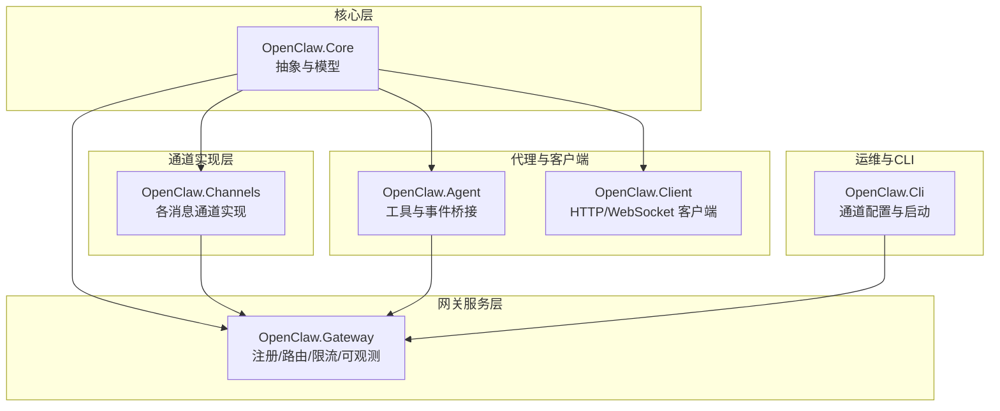
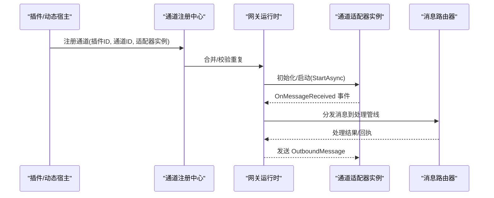
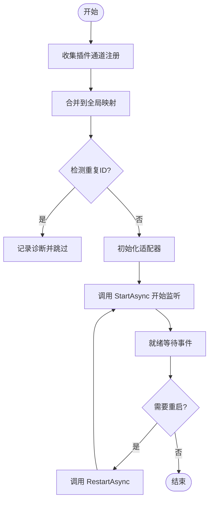
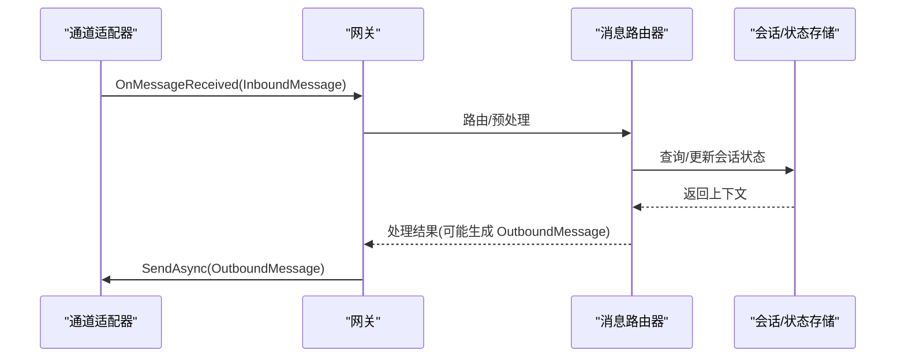
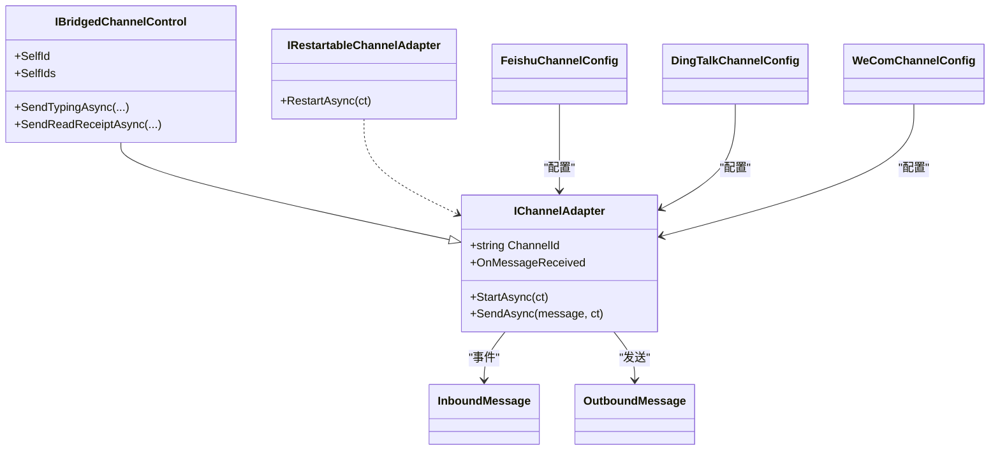

# 通道适配器集成

<cite>
**本文档引用的文件**
- [IChannelAdapter.cs](file://src/OpenClaw.Core/Abstractions/IChannelAdapter.cs)
- [IBridgedChannelControl.cs](file://src/OpenClaw.Core/Abstractions/IBridgedChannelControl.cs)
- [IRestartableChannelAdapter.cs](file://src/OpenClaw.Core/Abstractions/IRestartableChannelAdapter.cs)
- [Messages.cs](file://src/OpenClaw.Core/Models/Messages.cs)
- [KingcrabChannelConfigs.cs](file://src/OpenClaw.Core/Models/KingcrabChannelConfigs.cs)
- [OpenClaw.Channels.csproj](file://src/OpenClaw.Channels/OpenClaw.Channels.csproj)
- [RuntimeInitializationExtensions.CompositionStages.cs](file://src/OpenClaw.Gateway/Composition/RuntimeInitializationExtensions.CompositionStages.cs)
- [FeishuChannel.cs](file://src/OpenClaw.Channels/FeishuChannel.cs)
- [DingTalkChannel.cs](file://src/OpenClaw.Channels/DingTalkChannel.cs)
- [WeComChannel.cs](file://src/OpenClaw.Channels/WeComChannel.cs)
- [WhatsAppBridgeChannel.cs](file://src/OpenClaw.Channels/WhatsAppBridgeChannel.cs)
- [ChannelSetupCommand.cs](file://src/OpenClaw.Cli/ChannelSetupCommand.cs)
- [GatewayConfigFile.cs](file://src/OpenClaw.Core/Setup/GatewayConfigFile.cs)
- [ChannelReadinessEvaluator.cs](file://src/OpenClaw.Gateway/ChannelReadinessEvaluator.cs)
- [ChannelAuthEventStore.cs](file://src/OpenClaw.Gateway/ChannelAuthEventStore.cs)
- [ActorRateLimitService.cs](file://src/OpenClaw.Gateway/ActorRateLimitService.cs)
- [TwilioSmsChannel.cs](file://src/OpenClaw.Channels/TwilioSmsChannel.cs)
- [TwilioSmsClient.cs](file://src/OpenClaw.Channels/TwilioSmsClient.cs)
- [EmailChannel.cs](file://src/OpenClaw.Channels/EmailChannel.cs)
- [TelegramChannel.cs](file://src/OpenClaw.Channels/TelegramChannel.cs)
- [DiscordChannel.cs](file://src/OpenClaw.Channels/DiscordChannel.cs)
- [SlackChannel.cs](file://src/OpenClaw.Channels/SlackChannel.cs)
- [TeamsChannel.cs](file://src/OpenClaw.Channels/TeamsChannel.cs)
- [SignalChannel.cs](file://src/OpenClaw.Channels/SignalChannel.cs)
- [CronChannel.cs](file://src/OpenClaw.Channels/CronChannel.cs)
- [WebSocketChannel.cs](file://src/OpenClaw.Channels/WebSocketChannel.cs)
- [FeishuMessageDedup.cs](file://src/OpenClaw.Channels/FeishuMessageDedup.cs)
- [MqttEventBridge.cs](file://src/OpenClaw.Agent/Integrations/MqttEventBridge.cs)
- [HomeAssistantEventBridge.cs](file://src/OpenClaw.Agent/Integrations/HomeAssistantEventBridge.cs)
- [MqttTool.cs](file://src/OpenClaw.Agent/Tools/MqttTool.cs)
- [MqttPublishTool.cs](file://src/OpenClaw.Agent/Tools/MqttPublishTool.cs)
- [MqttClientFactory.cs](file://src/OpenClaw.Agent/Tools/MqttClientFactory.cs)
- [MqttMessageCache.cs](file://src/OpenClaw.Agent/Tools/MqttMessageCache.cs)
- [OpenClaw.Agent.csproj](file://src/OpenClaw.Agent/OpenClaw.Agent.csproj)
- [OpenClaw.Gateway.csproj](file://src/OpenClaw.Gateway/OpenClaw.Gateway.csproj)
- [OpenClaw.Core.csproj](file://src/OpenClaw.Core/OpenClaw.Core.csproj)
</cite>

## 目录
1. [简介](#简介)
2. [项目结构](#项目结构)
3. [核心组件](#核心组件)
4. [架构总览](#架构总览)
5. [详细组件分析](#详细组件分析)
6. [依赖关系分析](#依赖关系分析)
7. [性能考虑](#性能考虑)
8. [故障排查指南](#故障排查指南)
9. [结论](#结论)
10. [附录](#附录)

## 简介
本文件面向通道适配器集成的开发者与运维人员，系统性阐述桥接通道的注册流程、消息路由机制、状态同步与事件处理；详解通道配置管理、连接池维护、负载均衡与故障转移策略；覆盖通道生命周期管理、性能监控、错误恢复与安全控制，并提供开发指南、调试方法与运维最佳实践。内容基于仓库中的核心抽象、模型定义、具体通道实现与网关集成逻辑进行归纳总结。

## 项目结构
项目采用多项目分层组织，核心能力由以下模块构成：
- OpenClaw.Core：核心抽象、数据模型、安全与中间件等基础能力
- OpenClaw.Channels：各类消息通道的具体实现（如飞书、钉钉、企业微信、WhatsApp 桥接等）
- OpenClaw.Gateway：网关服务端，负责通道注册、路由、限流、可观测性与运行时生命周期管理
- OpenClaw.Agent：代理侧工具与事件桥接，支持 MQTT、Home Assistant 等集成
- OpenClaw.Cli：命令行工具，提供通道初始化与配置设置能力
- OpenClaw.Client：客户端 SDK，支持 HTTP 与 WebSocket 客户端

**图表来源**
- [OpenClaw.Core.csproj:1-24](file://src/OpenClaw.Core/OpenClaw.Core.csproj#L1-L24)
- [OpenClaw.Channels.csproj:1-14](file://src/OpenClaw.Channels/OpenClaw.Channels.csproj#L1-L14)
- [OpenClaw.Gateway.csproj](file://src/OpenClaw.Gateway/OpenClaw.Gateway.csproj)
- [OpenClaw.Agent.csproj](file://src/OpenClaw.Agent/OpenClaw.Agent.csproj)

**章节来源**
- [OpenClaw.Core.csproj:1-24](file://src/OpenClaw.Core/OpenClaw.Core.csproj#L1-L24)
- [OpenClaw.Channels.csproj:1-14](file://src/OpenClaw.Channels/OpenClaw.Channels.csproj#L1-L14)

## 核心组件
本节聚焦通道适配器的核心接口与数据模型，它们是所有通道实现的基础契约。

- 通道适配器接口 IChannelAdapter
  - 负责启动监听、发送消息、接收消息事件
  - 要求 AOT 兼容与低分配设计
- 桥接通道控制接口 IBridgedChannelControl
  - 在 IChannelAdapter 基础上扩展打字状态、已读回执等桥接能力
- 可重启通道接口 IRestartableChannelAdapter
  - 支持运行时重连或重启
- 消息模型 InboundMessage/OutboundMessage
  - 统一入站/出站消息结构，支持会话、自动化、群组、媒体等字段
- 金 crab 特定通道配置 KingcrabChannelConfigs
  - 飞书、钉钉、企业微信等通道的配置类型，支持热重载与策略控制

**章节来源**
- [IChannelAdapter.cs:1-22](file://src/OpenClaw.Core/Abstractions/IChannelAdapter.cs#L1-L22)
- [IBridgedChannelControl.cs:1-12](file://src/OpenClaw.Core/Abstractions/IBridgedChannelControl.cs#L1-L12)
- [IRestartableChannelAdapter.cs:1-10](file://src/OpenClaw.Core/Abstractions/IRestartableChannelAdapter.cs#L1-L10)
- [Messages.cs:1-62](file://src/OpenClaw.Core/Models/Messages.cs#L1-L62)
- [KingcrabChannelConfigs.cs:1-126](file://src/OpenClaw.Core/Models/KingcrabChannelConfigs.cs#L1-L126)

## 架构总览
通道适配器集成的整体架构围绕“抽象契约 + 多实现 + 网关编排”展开。通道实现通过插件或静态注册进入网关，网关负责统一的生命周期管理、路由与可观测性。

**图表来源**
- [RuntimeInitializationExtensions.CompositionStages.cs:283-315](file://src/OpenClaw.Gateway/Composition/RuntimeInitializationExtensions.CompositionStages.cs#L283-L315)
- [IChannelAdapter.cs:1-22](file://src/OpenClaw.Core/Abstractions/IChannelAdapter.cs#L1-L22)

**章节来源**
- [RuntimeInitializationExtensions.CompositionStages.cs:283-315](file://src/OpenClaw.Gateway/Composition/RuntimeInitializationExtensions.CompositionStages.cs#L283-L315)

## 详细组件分析

### 通道注册与生命周期
- 注册流程
  - 插件或动态宿主通过 ChannelRegistrations 提供通道 ID 与适配器实例
  - 网关在组合阶段合并注册，检测重复并记录诊断信息
- 生命周期
  - 适配器实现需支持 StartAsync 启动监听、可选 RestartAsync 重连
  - 适配器需实现异步释放以清理资源

**图表来源**
- [RuntimeInitializationExtensions.CompositionStages.cs:283-315](file://src/OpenClaw.Gateway/Composition/RuntimeInitializationExtensions.CompositionStages.cs#L283-L315)
- [IRestartableChannelAdapter.cs:1-10](file://src/OpenClaw.Core/Abstractions/IRestartableChannelAdapter.cs#L1-L10)

**章节来源**
- [RuntimeInitializationExtensions.CompositionStages.cs:283-315](file://src/OpenClaw.Gateway/Composition/RuntimeInitializationExtensions.CompositionStages.cs#L283-L315)
- [IRestartableChannelAdapter.cs:1-10](file://src/OpenClaw.Core/Abstractions/IRestartableChannelAdapter.cs#L1-L10)

### 消息路由机制
- 入站消息处理
  - 适配器通过 OnMessageReceived 事件上报 InboundMessage
  - 网关根据 ChannelId/AccountId/SessionId 等上下文进行路由与会话管理
- 出站消息发送
  - 网关将 OutboundMessage 交由对应适配器的 SendAsync 实现
  - 对于桥接通道，可使用 IBridgedChannelControl 的扩展能力（如打字、已读）

**图表来源**
- [IChannelAdapter.cs:1-22](file://src/OpenClaw.Core/Abstractions/IChannelAdapter.cs#L1-L22)
- [IBridgedChannelControl.cs:1-12](file://src/OpenClaw.Core/Abstractions/IBridgedChannelControl.cs#L1-L12)
- [Messages.cs:1-62](file://src/OpenClaw.Core/Models/Messages.cs#L1-L62)

**章节来源**
- [IChannelAdapter.cs:1-22](file://src/OpenClaw.Core/Abstractions/IChannelAdapter.cs#L1-L22)
- [IBridgedChannelControl.cs:1-12](file://src/OpenClaw.Core/Abstractions/IBridgedChannelControl.cs#L1-L12)
- [Messages.cs:1-62](file://src/OpenClaw.Core/Models/Messages.cs#L1-L62)

### 状态同步与事件处理
- 状态同步
  - 通过会话存储与状态映射实现跨适配器的状态一致性
  - 对桥接通道支持打字状态与已读回执，提升交互体验
- 事件处理
  - 适配器以事件驱动方式上报消息到达
  - 网关集中处理事件并触发后续动作（工具调用、自动化、通知等）

**章节来源**
- [IBridgedChannelControl.cs:1-12](file://src/OpenClaw.Core/Abstractions/IBridgedChannelControl.cs#L1-L12)
- [ChannelAuthEventStore.cs](file://src/OpenClaw.Gateway/ChannelAuthEventStore.cs)

### 通道配置管理
- 金 crab 通道配置
  - 飞书、钉钉、企业微信等通道均提供独立配置类，支持启用开关、凭证引用、群策略、白名单、字符限制、@提及要求、媒体暴露等
  - 配置支持热重载，修改后通道自动重连
- 通用配置
  - InboundMessage/OutboundMessage 字段覆盖会话、自动化、群组、媒体等场景

**章节来源**
- [KingcrabChannelConfigs.cs:1-126](file://src/OpenClaw.Core/Models/KingcrabChannelConfigs.cs#L1-L126)
- [Messages.cs:1-62](file://src/OpenClaw.Core/Models/Messages.cs#L1-L62)

### 连接池维护、负载均衡与故障转移
- 连接池与长连接
  - 部分通道（如飞书、企业微信）采用 WebSocket 长连接，减少握手开销
- 负载均衡
  - 通过多实例部署与上游反向代理实现横向扩展
- 故障转移
  - 适配器实现可结合 IRestartableChannelAdapter 提供运行时重连
  - 网关侧 ActorRateLimitService 提供速率限制与隔离，避免级联故障

**章节来源**
- [KingcrabChannelConfigs.cs:1-126](file://src/OpenClaw.Core/Models/KingcrabChannelConfigs.cs#L1-L126)
- [IRestartableChannelAdapter.cs:1-10](file://src/OpenClaw.Core/Abstractions/IRestartableChannelAdapter.cs#L1-L10)
- [ActorRateLimitService.cs](file://src/OpenClaw.Gateway/ActorRateLimitService.cs)

### 通道开发指南
- 实现步骤
  - 实现 IChannelAdapter 接口，提供 StartAsync、SendAsync、OnMessageReceived
  - 如需桥接能力，实现 IBridgedChannelControl
  - 在插件或宿主中通过 ChannelRegistrations 注册通道
- 配置与凭证
  - 使用配置类定义通道参数，优先使用密钥引用（如 env:VAR_NAME）
  - 启用热重载策略，确保配置变更后自动重连
- 性能与安全
  - 遵循 AOT 兼容与低分配原则
  - 实施输入验证、速率限制与访问控制

**章节来源**
- [IChannelAdapter.cs:1-22](file://src/OpenClaw.Core/Abstractions/IChannelAdapter.cs#L1-L22)
- [IBridgedChannelControl.cs:1-12](file://src/OpenClaw.Core/Abstractions/IBridgedChannelControl.cs#L1-L12)
- [RuntimeInitializationExtensions.CompositionStages.cs:283-315](file://src/OpenClaw.Gateway/Composition/RuntimeInitializationExtensions.CompositionStages.cs#L283-L315)

### 调试方法与运维最佳实践
- 调试
  - 使用 OnMessageReceived 事件与日志定位消息流转问题
  - 通过 ChannelReadinessEvaluator 检查通道健康度
  - 使用 CLI 的通道设置命令进行快速验证
- 运维
  - 启用热重载配置，避免停机变更
  - 结合 ActorRateLimitService 控制并发与速率
  - 定期检查通道认证事件存储，识别异常登录与重放攻击

**章节来源**
- [ChannelReadinessEvaluator.cs](file://src/OpenClaw.Gateway/ChannelReadinessEvaluator.cs)
- [ChannelSetupCommand.cs](file://src/OpenClaw.Cli/ChannelSetupCommand.cs)
- [ChannelAuthEventStore.cs](file://src/OpenClaw.Gateway/ChannelAuthEventStore.cs)
- [ActorRateLimitService.cs](file://src/OpenClaw.Gateway/ActorRateLimitService.cs)

## 依赖关系分析
通道适配器依赖关系主要体现在核心抽象、通道实现与网关编排之间：

**图表来源**
- [IChannelAdapter.cs:1-22](file://src/OpenClaw.Core/Abstractions/IChannelAdapter.cs#L1-L22)
- [IBridgedChannelControl.cs:1-12](file://src/OpenClaw.Core/Abstractions/IBridgedChannelControl.cs#L1-L12)
- [IRestartableChannelAdapter.cs:1-10](file://src/OpenClaw.Core/Abstractions/IRestartableChannelAdapter.cs#L1-L10)
- [Messages.cs:1-62](file://src/OpenClaw.Core/Models/Messages.cs#L1-L62)
- [KingcrabChannelConfigs.cs:1-126](file://src/OpenClaw.Core/Models/KingcrabChannelConfigs.cs#L1-L126)

**章节来源**
- [IChannelAdapter.cs:1-22](file://src/OpenClaw.Core/Abstractions/IChannelAdapter.cs#L1-L22)
- [IBridgedChannelControl.cs:1-12](file://src/OpenClaw.Core/Abstractions/IBridgedChannelControl.cs#L1-L12)
- [IRestartableChannelAdapter.cs:1-10](file://src/OpenClaw.Core/Abstractions/IRestartableChannelAdapter.cs#L1-L10)
- [Messages.cs:1-62](file://src/OpenClaw.Core/Models/Messages.cs#L1-L62)
- [KingcrabChannelConfigs.cs:1-126](file://src/OpenClaw.Core/Models/KingcrabChannelConfigs.cs#L1-L126)

## 性能考虑
- AOT 与低分配
  - 适配器实现需满足 AOT 兼容与低分配要求，减少 GC 压力
- 连接复用
  - 优先采用长连接（如 WebSocket），降低握手与鉴权成本
- 速率限制
  - 使用 ActorRateLimitService 控制并发与速率，避免下游拥塞
- 缓存与去重
  - 对入站消息进行去重（如飞书消息去重）与缓存，减少重复处理
- 监控与告警
  - 结合网关可观测性指标，建立延迟、吞吐量与错误率监控

[本节为通用性能建议，无需特定文件来源]

## 故障排查指南
- 通道无法启动
  - 检查配置是否正确加载与热重载是否生效
  - 查看注册阶段重复 ID 诊断信息
- 消息不达或重复
  - 核对 OnMessageReceived 事件是否触发
  - 检查去重策略与消息缓存
- 认证失败或频繁重连
  - 校验凭证引用与环境变量
  - 关注认证事件存储中的异常登录记录
- 限流导致发送失败
  - 调整 ActorRateLimitService 配置
  - 优化批量发送与退避策略

**章节来源**
- [RuntimeInitializationExtensions.CompositionStages.cs:283-315](file://src/OpenClaw.Gateway/Composition/RuntimeInitializationExtensions.CompositionStages.cs#L283-L315)
- [FeishuMessageDedup.cs](file://src/OpenClaw.Channels/FeishuMessageDedup.cs)
- [ChannelAuthEventStore.cs](file://src/OpenClaw.Gateway/ChannelAuthEventStore.cs)
- [ActorRateLimitService.cs](file://src/OpenClaw.Gateway/ActorRateLimitService.cs)

## 结论
通道适配器集成以清晰的抽象契约为核心，通过统一的网关编排实现多通道的注册、路由、状态同步与事件处理。借助配置热重载、长连接与限流策略，系统在保证性能的同时具备良好的可维护性与可扩展性。遵循本文档的开发与运维实践，可有效提升通道集成的稳定性与效率。

[本节为总结性内容，无需特定文件来源]

## 附录

### 通道实现一览（按类别）
- 金 crab 通道
  - 飞书：[FeishuChannel.cs](file://src/OpenClaw.Channels/FeishuChannel.cs)
  - 钉钉：[DingTalkChannel.cs](file://src/OpenClaw.Channels/DingTalkChannel.cs)
  - 企业微信：[WeComChannel.cs](file://src/OpenClaw.Channels/WeComChannel.cs)
  - WhatsApp 桥接：[WhatsAppBridgeChannel.cs](file://src/OpenClaw.Channels/WhatsAppBridgeChannel.cs)
- 即时通讯通道
  - 短信（Twilio）：[TwilioSmsChannel.cs](file://src/OpenClaw.Channels/TwilioSmsChannel.cs)，[TwilioSmsClient.cs](file://src/OpenClaw.Channels/TwilioSmsClient.cs)
  - 邮件：[EmailChannel.cs](file://src/OpenClaw.Channels/EmailChannel.cs)
  - Telegram：[TelegramChannel.cs](file://src/OpenClaw.Channels/TelegramChannel.cs)
  - Discord：[DiscordChannel.cs](file://src/OpenClaw.Channels/DiscordChannel.cs)
  - Slack：[SlackChannel.cs](file://src/OpenClaw.Channels/SlackChannel.cs)
  - Teams：[TeamsChannel.cs](file://src/OpenClaw.Channels/TeamsChannel.cs)
  - Signal：[SignalChannel.cs](file://src/OpenClaw.Channels/SignalChannel.cs)
- 其他通道
  - 定时任务：[CronChannel.cs](file://src/OpenClaw.Channels/CronChannel.cs)
  - WebSocket：[WebSocketChannel.cs](file://src/OpenClaw.Channels/WebSocketChannel.cs)

**章节来源**
- [FeishuChannel.cs](file://src/OpenClaw.Channels/FeishuChannel.cs)
- [DingTalkChannel.cs](file://src/OpenClaw.Channels/DingTalkChannel.cs)
- [WeComChannel.cs](file://src/OpenClaw.Channels/WeComChannel.cs)
- [WhatsAppBridgeChannel.cs](file://src/OpenClaw.Channels/WhatsAppBridgeChannel.cs)
- [TwilioSmsChannel.cs](file://src/OpenClaw.Channels/TwilioSmsChannel.cs)
- [TwilioSmsClient.cs](file://src/OpenClaw.Channels/TwilioSmsClient.cs)
- [EmailChannel.cs](file://src/OpenClaw.Channels/EmailChannel.cs)
- [TelegramChannel.cs](file://src/OpenClaw.Channels/TelegramChannel.cs)
- [DiscordChannel.cs](file://src/OpenClaw.Channels/DiscordChannel.cs)
- [SlackChannel.cs](file://src/OpenClaw.Channels/SlackChannel.cs)
- [TeamsChannel.cs](file://src/OpenClaw.Channels/TeamsChannel.cs)
- [SignalChannel.cs](file://src/OpenClaw.Channels/SignalChannel.cs)
- [CronChannel.cs](file://src/OpenClaw.Channels/CronChannel.cs)
- [WebSocketChannel.cs](file://src/OpenClaw.Channels/WebSocketChannel.cs)

### 代理侧集成（MQTT 与 Home Assistant）
- MQTT 事件桥接与工具
  - 事件桥接：[MqttEventBridge.cs](file://src/OpenClaw.Agent/Integrations/MqttEventBridge.cs)
  - 工具集：[MqttTool.cs](file://src/OpenClaw.Agent/Tools/MqttTool.cs)，[MqttPublishTool.cs](file://src/OpenClaw.Agent/Tools/MqttPublishTool.cs)
  - 客户端工厂与缓存：[MqttClientFactory.cs](file://src/OpenClaw.Agent/Tools/MqttClientFactory.cs)，[MqttMessageCache.cs](file://src/OpenClaw.Agent/Tools/MqttMessageCache.cs)
- Home Assistant 事件桥接
  - [HomeAssistantEventBridge.cs](file://src/OpenClaw.Agent/Integrations/HomeAssistantEventBridge.cs)

**章节来源**
- [MqttEventBridge.cs](file://src/OpenClaw.Agent/Integrations/MqttEventBridge.cs)
- [MqttTool.cs](file://src/OpenClaw.Agent/Tools/MqttTool.cs)
- [MqttPublishTool.cs](file://src/OpenClaw.Agent/Tools/MqttPublishTool.cs)
- [MqttClientFactory.cs](file://src/OpenClaw.Agent/Tools/MqttClientFactory.cs)
- [MqttMessageCache.cs](file://src/OpenClaw.Agent/Tools/MqttMessageCache.cs)
- [HomeAssistantEventBridge.cs](file://src/OpenClaw.Agent/Integrations/HomeAssistantEventBridge.cs)