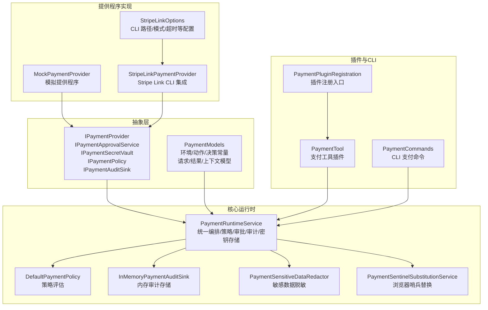
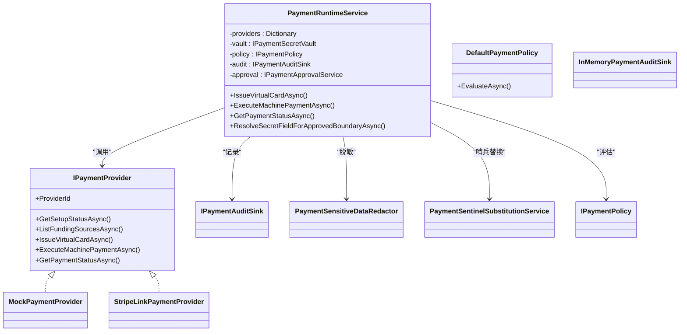
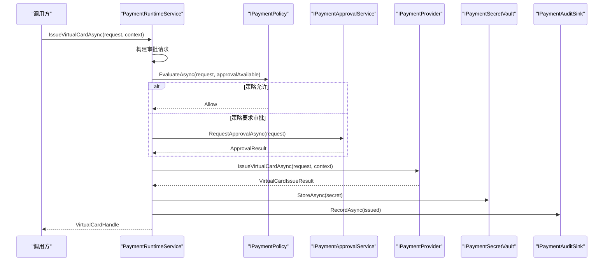
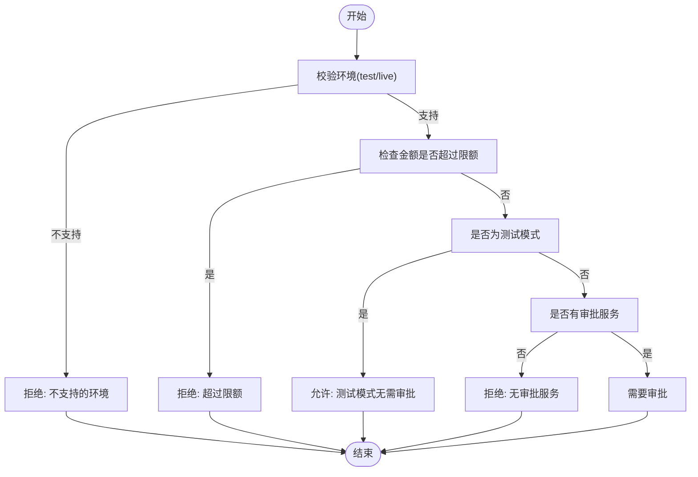
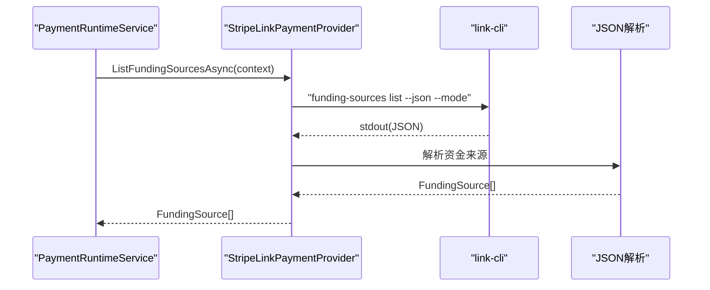
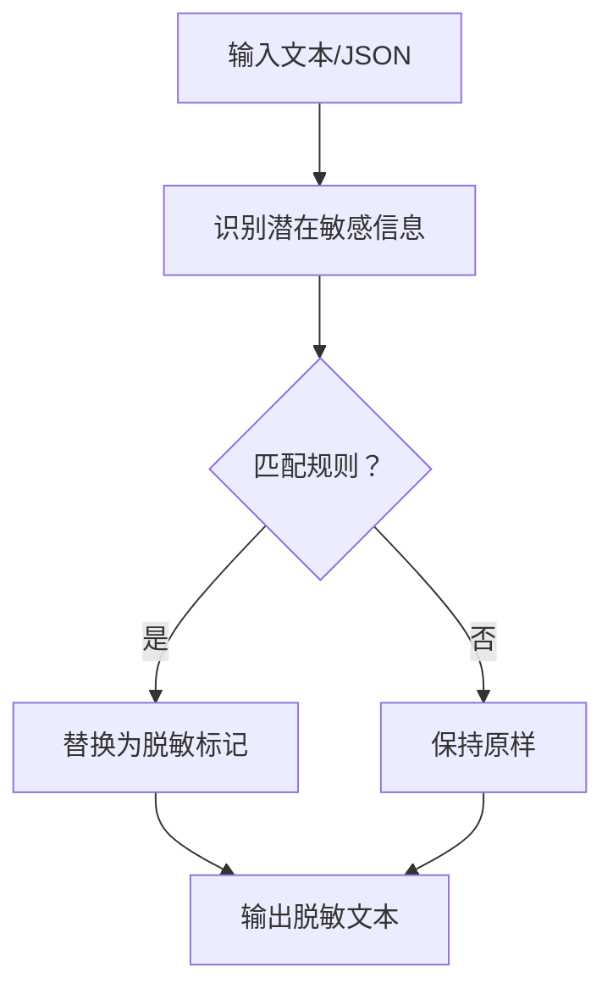
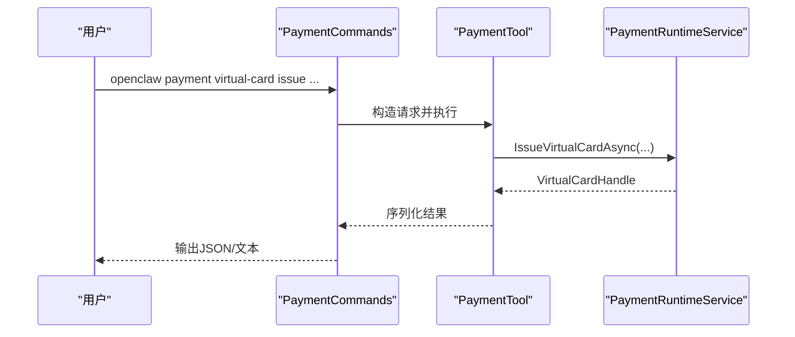
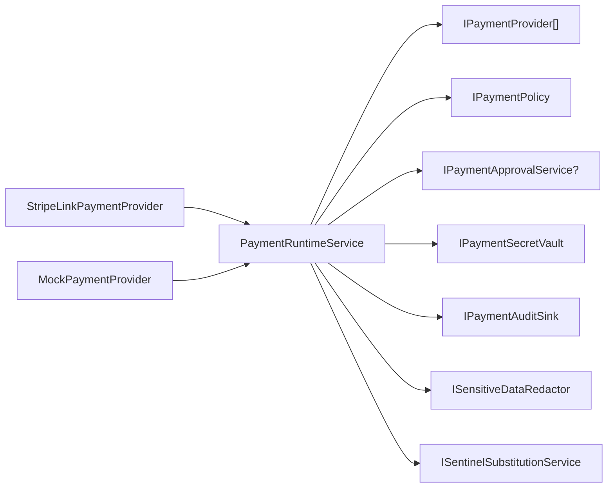

# 支付系统

<cite>
**本文引用的文件**
- [PaymentInterfaces.cs](file://src/OpenClaw.Payments.Abstractions/PaymentInterfaces.cs)
- [PaymentModels.cs](file://src/OpenClaw.Payments.Abstractions/PaymentModels.cs)
- [PaymentRuntimeService.cs](file://src/OpenClaw.Payments.Core/PaymentRuntimeService.cs)
- [PaymentServiceCollectionExtensions.cs](file://src/OpenClaw.Payments.Core/PaymentServiceCollectionExtensions.cs)
- [DefaultPaymentPolicy.cs](file://src/OpenClaw.Payments.Core/DefaultPaymentPolicy.cs)
- [MockPaymentProvider.cs](file://src/OpenClaw.Payments.Core/MockPaymentProvider.cs)
- [PaymentAuditSinks.cs](file://src/OpenClaw.Payments.Core/PaymentAuditSinks.cs)
- [PaymentSensitiveDataRedactor.cs](file://src/OpenClaw.Payments.Core/PaymentSensitiveDataRedactor.cs)
- [PaymentSentinelSubstitutionService.cs](file://src/OpenClaw.Payments.Core/PaymentSentinelSubstitutionService.cs)
- [StripeLinkPaymentProvider.cs](file://src/OpenClaw.Payments.StripeLink/StripeLinkPaymentProvider.cs)
- [StripeLinkOptions.cs](file://src/OpenClaw.Payments.StripeLink/StripeLinkOptions.cs)
- [PaymentPluginRegistration.cs](file://src/OpenClaw.Plugins.Payment/PaymentPluginRegistration.cs)
- [PaymentTool.cs](file://src/OpenClaw.Plugins.Payment/PaymentTool.cs)
- [PaymentCommands.cs](file://src/OpenClaw.Cli/PaymentCommands.cs)
</cite>

## 目录
1. [简介](#简介)
2. [项目结构](#项目结构)
3. [核心组件](#核心组件)
4. [架构总览](#架构总览)
5. [详细组件分析](#详细组件分析)
6. [依赖关系分析](#依赖关系分析)
7. [性能考量](#性能考量)
8. [故障排除指南](#故障排除指南)
9. [结论](#结论)
10. [附录](#附录)

## 简介
本技术文档面向支付系统，涵盖架构概览、Stripe Link 集成、支付流程管理与安全控制机制。重点说明支付提供程序的注册与扩展、支付审批流程、审计日志与敏感数据保护，并提供支付配置示例、安全最佳实践与故障排除指南。同时给出支付相关的 CLI 命令与工具接口说明，帮助开发者快速集成与运维。

## 项目结构
支付系统由“抽象层”“核心运行时”“提供程序实现”“插件与CLI”等模块组成，采用分层与接口隔离设计，便于替换与扩展支付提供程序（如 Stripe Link）。

图表来源
- [PaymentInterfaces.cs:1-60](file://src/OpenClaw.Payments.Abstractions/PaymentInterfaces.cs#L1-L60)
- [PaymentModels.cs:6-46](file://src/OpenClaw.Payments.Abstractions/PaymentModels.cs#L6-L46)
- [PaymentRuntimeService.cs:5-33](file://src/OpenClaw.Payments.Core/PaymentRuntimeService.cs#L5-L33)
- [DefaultPaymentPolicy.cs:5-19](file://src/OpenClaw.Payments.Core/DefaultPaymentPolicy.cs#L5-L19)
- [PaymentAuditSinks.cs:6-18](file://src/OpenClaw.Payments.Core/PaymentAuditSinks.cs#L6-L18)
- [PaymentSensitiveDataRedactor.cs:8-30](file://src/OpenClaw.Payments.Core/PaymentSensitiveDataRedactor.cs#L8-L30)
- [PaymentSentinelSubstitutionService.cs:8-19](file://src/OpenClaw.Payments.Core/PaymentSentinelSubstitutionService.cs#L8-L19)
- [MockPaymentProvider.cs:6-18](file://src/OpenClaw.Payments.Core/MockPaymentProvider.cs#L6-L18)
- [StripeLinkPaymentProvider.cs:6-17](file://src/OpenClaw.Payments.StripeLink/StripeLinkPaymentProvider.cs#L6-L17)
- [StripeLinkOptions.cs:3-11](file://src/OpenClaw.Payments.StripeLink/StripeLinkOptions.cs#L3-L11)
- [PaymentPluginRegistration.cs:6-13](file://src/OpenClaw.Plugins.Payment/PaymentPluginRegistration.cs#L6-L13)
- [PaymentTool.cs:8-19](file://src/OpenClaw.Plugins.Payment/PaymentTool.cs#L8-L19)
- [PaymentCommands.cs:6-26](file://src/OpenClaw.Cli/PaymentCommands.cs#L6-L26)

章节来源
- [PaymentInterfaces.cs:1-60](file://src/OpenClaw.Payments.Abstractions/PaymentInterfaces.cs#L1-L60)
- [PaymentModels.cs:6-46](file://src/OpenClaw.Payments.Abstractions/PaymentModels.cs#L6-L46)
- [PaymentRuntimeService.cs:5-33](file://src/OpenClaw.Payments.Core/PaymentRuntimeService.cs#L5-L33)
- [StripeLinkPaymentProvider.cs:6-17](file://src/OpenClaw.Payments.StripeLink/StripeLinkPaymentProvider.cs#L6-L17)
- [PaymentPluginRegistration.cs:6-13](file://src/OpenClaw.Plugins.Payment/PaymentPluginRegistration.cs#L6-L13)
- [PaymentTool.cs:8-19](file://src/OpenClaw.Plugins.Payment/PaymentTool.cs#L8-L19)
- [PaymentCommands.cs:6-26](file://src/OpenClaw.Cli/PaymentCommands.cs#L6-L26)

## 核心组件
- 抽象接口与模型：定义支付提供程序、审批、密钥存储、策略、审计、哨兵替换等契约与数据模型。
- 运行时服务：统一编排支付生命周期，负责策略评估、审批请求、密钥存储、审计记录与错误处理。
- 提供程序实现：Mock 与 Stripe Link，分别用于本地测试与真实支付通道。
- 审计与安全：内存审计存储、敏感数据脱敏、浏览器哨兵替换服务。
- 插件与CLI：通过插件暴露支付能力，通过CLI执行支付命令。

章节来源
- [PaymentInterfaces.cs:3-60](file://src/OpenClaw.Payments.Abstractions/PaymentInterfaces.cs#L3-L60)
- [PaymentModels.cs:70-400](file://src/OpenClaw.Payments.Abstractions/PaymentModels.cs#L70-L400)
- [PaymentRuntimeService.cs:5-425](file://src/OpenClaw.Payments.Core/PaymentRuntimeService.cs#L5-L425)
- [DefaultPaymentPolicy.cs:5-59](file://src/OpenClaw.Payments.Core/DefaultPaymentPolicy.cs#L5-L59)
- [MockPaymentProvider.cs:6-165](file://src/OpenClaw.Payments.Core/MockPaymentProvider.cs#L6-L165)
- [StripeLinkPaymentProvider.cs:6-286](file://src/OpenClaw.Payments.StripeLink/StripeLinkPaymentProvider.cs#L6-L286)
- [PaymentAuditSinks.cs:6-18](file://src/OpenClaw.Payments.Core/PaymentAuditSinks.cs#L6-L18)
- [PaymentSensitiveDataRedactor.cs:8-88](file://src/OpenClaw.Payments.Core/PaymentSensitiveDataRedactor.cs#L8-L88)
- [PaymentSentinelSubstitutionService.cs:8-119](file://src/OpenClaw.Payments.Core/PaymentSentinelSubstitutionService.cs#L8-L119)
- [PaymentPluginRegistration.cs:6-13](file://src/OpenClaw.Plugins.Payment/PaymentPluginRegistration.cs#L6-L13)
- [PaymentTool.cs:8-181](file://src/OpenClaw.Plugins.Payment/PaymentTool.cs#L8-L181)
- [PaymentCommands.cs:6-206](file://src/OpenClaw.Cli/PaymentCommands.cs#L6-L206)

## 架构总览
支付系统采用“接口隔离 + 统一运行时 + 多提供程序”的架构。运行时服务聚合多个提供程序，依据策略决定是否需要审批；审批通过后调用具体提供程序执行支付操作，并在过程中进行审计与敏感数据保护。

图表来源
- [PaymentInterfaces.cs:3-60](file://src/OpenClaw.Payments.Abstractions/PaymentInterfaces.cs#L3-L60)
- [PaymentRuntimeService.cs:5-425](file://src/OpenClaw.Payments.Core/PaymentRuntimeService.cs#L5-L425)
- [DefaultPaymentPolicy.cs:5-59](file://src/OpenClaw.Payments.Core/DefaultPaymentPolicy.cs#L5-L59)
- [MockPaymentProvider.cs:6-165](file://src/OpenClaw.Payments.Core/MockPaymentProvider.cs#L6-L165)
- [StripeLinkPaymentProvider.cs:6-286](file://src/OpenClaw.Payments.StripeLink/StripeLinkPaymentProvider.cs#L6-L286)
- [PaymentAuditSinks.cs:6-18](file://src/OpenClaw.Payments.Core/PaymentAuditSinks.cs#L6-L18)
- [PaymentSensitiveDataRedactor.cs:8-88](file://src/OpenClaw.Payments.Core/PaymentSensitiveDataRedactor.cs#L8-L88)
- [PaymentSentinelSubstitutionService.cs:8-119](file://src/OpenClaw.Payments.Core/PaymentSentinelSubstitutionService.cs#L8-L119)

## 详细组件分析

### 支付运行时服务（PaymentRuntimeService）
- 职责：统一编排支付生命周期，包括虚拟卡签发、机器支付执行、状态查询、审批与策略评估、密钥存储与审计。
- 关键流程：
  - 虚拟卡签发：构建审批请求 → 策略评估或审批 → 调用提供程序 → 存储密钥 → 记录审计事件。
  - 机器支付：构建审批请求 → 策略评估或审批 → 调用提供程序 → 可选存储一次性授权密钥 → 记录审计事件。
  - 状态查询：调用提供程序 → 记录审计事件。
  - 浏览器哨兵替换：校验上下文 → 审批或策略 → 解析密钥字段 → 记录审计事件。
- 错误处理：对策略拒绝、审批失败、提供程序异常进行审计记录与异常抛出。

图表来源
- [PaymentRuntimeService.cs:46-114](file://src/OpenClaw.Payments.Core/PaymentRuntimeService.cs#L46-L114)
- [PaymentRuntimeService.cs:269-334](file://src/OpenClaw.Payments.Core/PaymentRuntimeService.cs#L269-L334)
- [PaymentInterfaces.cs:27-30](file://src/OpenClaw.Payments.Abstractions/PaymentInterfaces.cs#L27-L30)
- [PaymentInterfaces.cs:39-42](file://src/OpenClaw.Payments.Abstractions/PaymentInterfaces.cs#L39-L42)

章节来源
- [PaymentRuntimeService.cs:5-425](file://src/OpenClaw.Payments.Core/PaymentRuntimeService.cs#L5-L425)

### 默认支付策略（DefaultPaymentPolicy）
- 行为规则：
  - 环境校验：不支持的环境直接拒绝。
  - 限额控制：超过最大限额则拒绝。
  - 测试模式：默认允许无需审批。
  - 生产模式：若无审批服务则可拒绝或要求审批。
- 决策输出：允许/拒绝/需要审批。

图表来源
- [DefaultPaymentPolicy.cs:21-51](file://src/OpenClaw.Payments.Core/DefaultPaymentPolicy.cs#L21-L51)

章节来源
- [DefaultPaymentPolicy.cs:5-59](file://src/OpenClaw.Payments.Core/DefaultPaymentPolicy.cs#L5-L59)

### Stripe Link 提供程序（StripeLinkPaymentProvider）
- 功能：通过 link-cli 执行支付相关操作，包括版本检测、资金来源列表、虚拟卡签发、机器支付执行与状态查询。
- 数据解析：解析 link-cli 输出的 JSON，构造统一模型返回。
- 配置：通过 StripeLinkOptions 指定 CLI 路径、工作目录、环境变量、超时与模式（test/live）。

图表来源
- [StripeLinkPaymentProvider.cs:70-77](file://src/OpenClaw.Payments.StripeLink/StripeLinkPaymentProvider.cs#L70-L77)
- [StripeLinkOptions.cs:3-11](file://src/OpenClaw.Payments.StripeLink/StripeLinkOptions.cs#L3-L11)

章节来源
- [StripeLinkPaymentProvider.cs:6-286](file://src/OpenClaw.Payments.StripeLink/StripeLinkPaymentProvider.cs#L6-L286)
- [StripeLinkOptions.cs:3-11](file://src/OpenClaw.Payments.StripeLink/StripeLinkOptions.cs#L3-L11)

### 模拟提供程序（MockPaymentProvider）
- 用途：本地开发与测试，提供确定性行为与可预测的响应。
- 能力：设置状态、列出资金来源、签发虚拟卡、执行机器支付、查询状态。

章节来源
- [MockPaymentProvider.cs:6-165](file://src/OpenClaw.Payments.Core/MockPaymentProvider.cs#L6-L165)

### 审计与敏感数据保护
- 审计：InMemoryPaymentAuditSink 将审计事件入队，支持快照查看。
- 敏感数据脱敏：识别并替换 PAN、CVV、授权头、令牌等敏感字段。
- 哨兵替换：在浏览器填充场景中，按需替换模板中的支付哨兵占位符，受审批与策略约束。

图表来源
- [PaymentSensitiveDataRedactor.cs:32-50](file://src/OpenClaw.Payments.Core/PaymentSensitiveDataRedactor.cs#L32-L50)

章节来源
- [PaymentAuditSinks.cs:6-18](file://src/OpenClaw.Payments.Core/PaymentAuditSinks.cs#L6-L18)
- [PaymentSensitiveDataRedactor.cs:8-88](file://src/OpenClaw.Payments.Core/PaymentSensitiveDataRedactor.cs#L8-L88)
- [PaymentSentinelSubstitutionService.cs:21-86](file://src/OpenClaw.Payments.Core/PaymentSentinelSubstitutionService.cs#L21-L86)

### 支付插件与CLI
- 插件注册：通过 PaymentPluginRegistration 创建 PaymentTool 并绑定到指定提供程序与环境。
- 支付工具：封装支付动作（设置状态、列出资金来源、签发虚拟卡、执行机器支付、查询状态），并对结果进行序列化输出。
- CLI 命令：openclaw payment 支持 setup、funding list、virtual-card issue、execute、status 等子命令，支持 --yes 强制确认生产模式。

图表来源
- [PaymentCommands.cs:31-66](file://src/OpenClaw.Cli/PaymentCommands.cs#L31-L66)
- [PaymentTool.cs:52-104](file://src/OpenClaw.Plugins.Payment/PaymentTool.cs#L52-L104)
- [PaymentRuntimeService.cs:46-114](file://src/OpenClaw.Payments.Core/PaymentRuntimeService.cs#L46-L114)

章节来源
- [PaymentPluginRegistration.cs:6-13](file://src/OpenClaw.Plugins.Payment/PaymentPluginRegistration.cs#L6-L13)
- [PaymentTool.cs:8-181](file://src/OpenClaw.Plugins.Payment/PaymentTool.cs#L8-L181)
- [PaymentCommands.cs:6-206](file://src/OpenClaw.Cli/PaymentCommands.cs#L6-L206)

## 依赖关系分析
- 运行时服务依赖于提供程序集合、策略、审批服务、密钥存储与审计。
- 提供程序实现依赖于外部 CLI 或外部支付服务。
- 插件与CLI通过运行时服务访问支付能力。
- 安全组件（脱敏、哨兵替换）贯穿运行时服务的关键路径。

图表来源
- [PaymentRuntimeService.cs:5-425](file://src/OpenClaw.Payments.Core/PaymentRuntimeService.cs#L5-L425)
- [StripeLinkPaymentProvider.cs:6-286](file://src/OpenClaw.Payments.StripeLink/StripeLinkPaymentProvider.cs#L6-L286)
- [MockPaymentProvider.cs:6-165](file://src/OpenClaw.Payments.Core/MockPaymentProvider.cs#L6-L165)

章节来源
- [PaymentRuntimeService.cs:5-425](file://src/OpenClaw.Payments.Core/PaymentRuntimeService.cs#L5-L425)

## 性能考量
- 异步优先：所有提供程序方法与运行时服务均使用 ValueTask/async 设计，避免阻塞。
- 最小序列化：使用源生成的 JsonSerializerContext，减少序列化开销。
- 缓存与重试：运行时服务未内置缓存，建议在上层网关或客户端进行幂等与结果缓存。
- CLI 调用：Stripe Link CLI 的超时与工作目录应合理配置，避免长时间阻塞。

## 故障排除指南
- 策略拒绝：当策略拒绝时会抛出 PaymentPolicyDeniedException，检查环境、金额上限与审批服务配置。
- 审批失败：若未注册审批服务且生产模式需要审批，将被拒绝；可通过 --yes 仅跳过交互，仍受策略与审批约束。
- 提供程序未注册：运行时服务无法解析提供程序 ID 时会抛出异常，检查提供程序注册与默认 ID。
- CLI 问题（Stripe Link）：link-cli 未安装或启动失败时，设置状态显示未安装；检查 CLI 路径、权限与环境变量。
- 审计缺失：内存审计存储仅在进程内有效，生产环境建议替换为持久化审计存储。

章节来源
- [PaymentRuntimeService.cs:269-334](file://src/OpenClaw.Payments.Core/PaymentRuntimeService.cs#L269-L334)
- [PaymentRuntimeService.cs:336-343](file://src/OpenClaw.Payments.Core/PaymentRuntimeService.cs#L336-L343)
- [StripeLinkPaymentProvider.cs:19-68](file://src/OpenClaw.Payments.StripeLink/StripeLinkPaymentProvider.cs#L19-L68)
- [PaymentAuditSinks.cs:6-18](file://src/OpenClaw.Payments.Core/PaymentAuditSinks.cs#L6-L18)

## 结论
该支付系统以清晰的接口与运行时为核心，结合策略、审批与审计，确保支付流程可控、可观测与可扩展。Stripe Link 提供程序通过 CLI 实现与真实通道对接，同时保留 Mock 提供程序用于本地开发。通过插件与 CLI，系统具备良好的集成与运维体验。

## 附录

### 支付配置示例（依赖注入）
- 注册支付核心服务与默认提供程序、策略、审计与脱敏器，可自定义默认提供程序 ID、环境、密钥有效期、是否允许测试模式无需审批、是否禁止无审批服务的生产模式、最大生产金额等。

章节来源
- [PaymentServiceCollectionExtensions.cs:10-41](file://src/OpenClaw.Payments.Core/PaymentServiceCollectionExtensions.cs#L10-L41)

### 支付相关 API 与集成要点
- 支付工具（插件）参数要点：
  - action：必填，取值包括 setup_status、list_funding_sources、issue_virtual_card、execute_machine_payment、get_payment_status。
  - environment：可选，test/live，默认 test。
  - 其他参数根据 action 选择性传入（如 merchant、amount_minor、currency、funding_source_id、valid_minutes、challenge_id、resource_url 等）。
- CLI 命令要点：
  - money-moving 命令默认 test 模式，生产模式需 --environment live --yes。
  - 输出为白名单安全元数据，不包含原始敏感信息。

章节来源
- [PaymentTool.cs:26-50](file://src/OpenClaw.Plugins.Payment/PaymentTool.cs#L26-L50)
- [PaymentTool.cs:78-86](file://src/OpenClaw.Plugins.Payment/PaymentTool.cs#L78-L86)
- [PaymentCommands.cs:186-204](file://src/OpenClaw.Cli/PaymentCommands.cs#L186-L204)

### 安全最佳实践
- 环境与限额：生产模式必须受策略限制，设置合理的最大金额与审批要求。
- 审计与日志：启用持久化审计存储，定期审查审计事件。
- 敏感数据：使用脱敏器与哨兵替换，避免在日志与输出中泄露敏感信息。
- 密钥存储：使用专用密钥存储（如 Vault）而非内存存储，设置合理的 TTL 与一次性使用策略。
- 审批流程：生产模式必须经过审批或策略允许，避免自动化绕过。

章节来源
- [DefaultPaymentPolicy.cs:21-51](file://src/OpenClaw.Payments.Core/DefaultPaymentPolicy.cs#L21-L51)
- [PaymentRuntimeService.cs:74-83](file://src/OpenClaw.Payments.Core/PaymentRuntimeService.cs#L74-L83)
- [PaymentRuntimeService.cs:151-160](file://src/OpenClaw.Payments.Core/PaymentRuntimeService.cs#L151-L160)
- [PaymentSensitiveDataRedactor.cs:32-50](file://src/OpenClaw.Payments.Core/PaymentSensitiveDataRedactor.cs#L32-L50)
- [PaymentSentinelSubstitutionService.cs:21-86](file://src/OpenClaw.Payments.Core/PaymentSentinelSubstitutionService.cs#L21-L86)