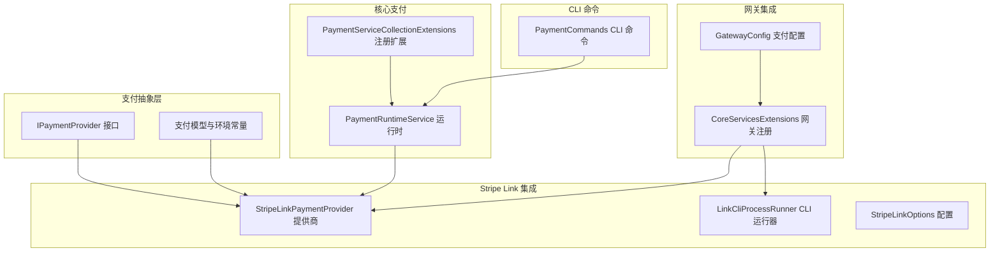
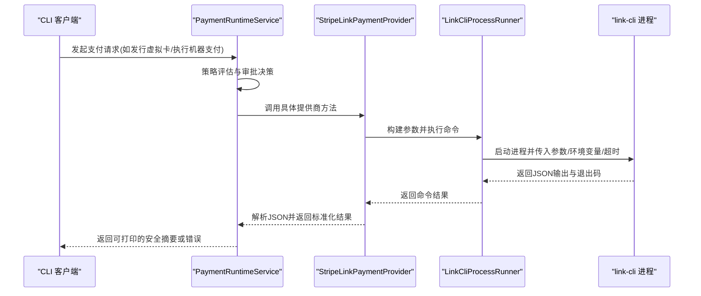
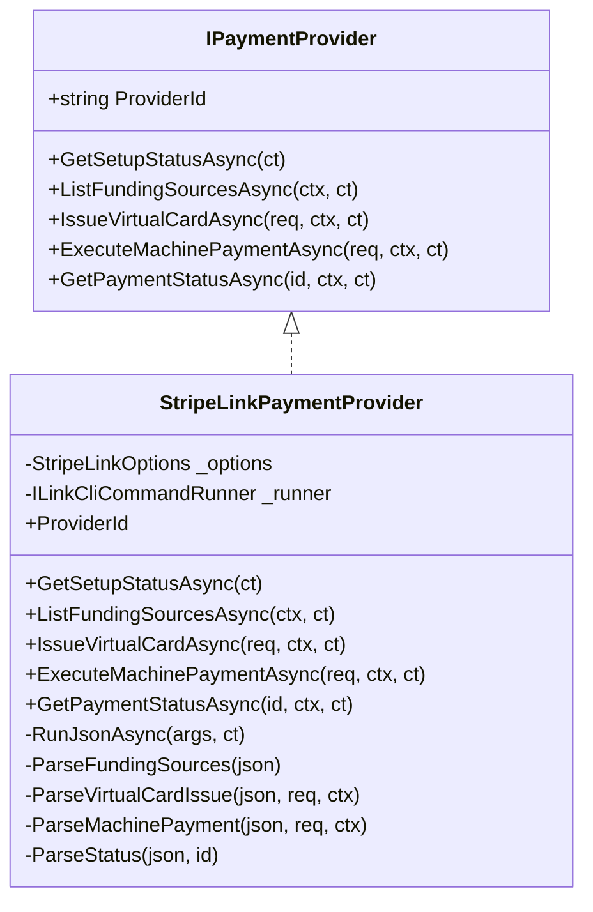
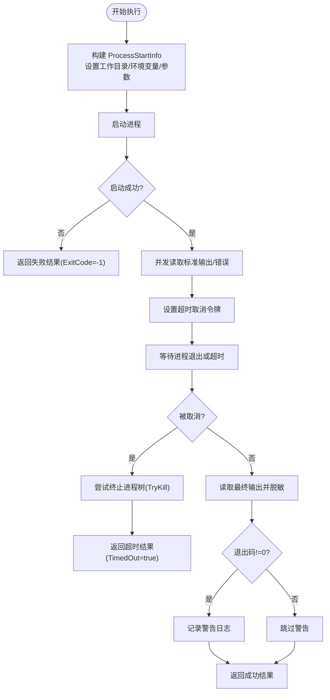
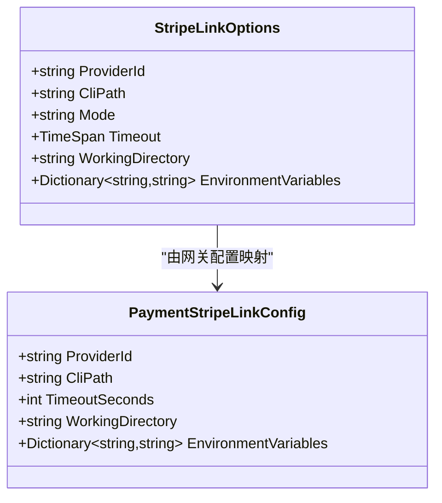
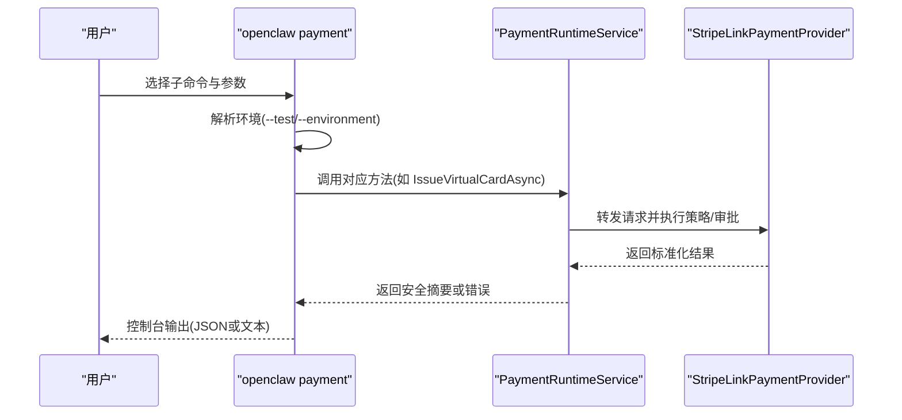
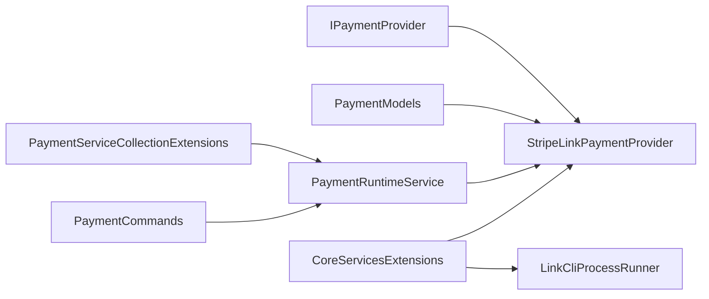

# Stripe Link 集成

<cite>
**本文档引用的文件**
- [StripeLinkPaymentProvider.cs](file://src/OpenClaw.Payments.StripeLink/StripeLinkPaymentProvider.cs)
- [LinkCliCommandRunner.cs](file://src/OpenClaw.Payments.StripeLink/LinkCliCommandRunner.cs)
- [StripeLinkOptions.cs](file://src/OpenClaw.Payments.StripeLink/StripeLinkOptions.cs)
- [PaymentInterfaces.cs](file://src/OpenClaw.Payments.Abstractions/PaymentInterfaces.cs)
- [PaymentModels.cs](file://src/OpenClaw.Payments.Abstractions/PaymentModels.cs)
- [PaymentRuntimeService.cs](file://src/OpenClaw.Payments.Core/PaymentRuntimeService.cs)
- [PaymentServiceCollectionExtensions.cs](file://src/OpenClaw.Payments.Core/PaymentServiceCollectionExtensions.cs)
- [CoreServicesExtensions.cs](file://src/OpenClaw.Gateway/Composition/CoreServicesExtensions.cs)
- [PaymentCommands.cs](file://src/OpenClaw.Cli/PaymentCommands.cs)
- [GatewayConfig.cs](file://src/OpenClaw.Core/Models/GatewayConfig.cs)
</cite>

## 目录
1. [简介](#简介)
2. [项目结构](#项目结构)
3. [核心组件](#核心组件)
4. [架构总览](#架构总览)
5. [详细组件分析](#详细组件分析)
6. [依赖关系分析](#依赖关系分析)
7. [性能考虑](#性能考虑)
8. [故障排除指南](#故障排除指南)
9. [结论](#结论)
10. [附录](#附录)

## 简介
本文件面向需要在系统中集成 Stripe Link 支付能力的开发者与运维人员，系统性阐述 Stripe Link 支付提供商的实现原理、CLI 命令封装机制、环境配置管理，以及关键流程如支付状态检查、资金来源查询、虚拟卡发行、机器支付执行等。文档同时覆盖 CLI 交互流程、错误处理策略、调试方法，并提供配置示例与集成步骤。

## 项目结构
Stripe Link 集成由以下模块协同完成：
- 支付抽象层：定义统一的支付接口与数据模型
- 核心支付运行时：提供策略、审批、审计与密钥保管等通用能力
- Stripe Link 提供商：基于 link-cli 的命令行封装，负责与 Stripe Link 交互
- 网关集成：在网关启动阶段注册提供商与 CLI 运行器
- CLI 命令：提供命令行工具入口，便于本地测试与自动化

**图表来源**
- [PaymentInterfaces.cs:3-25](file://src/OpenClaw.Payments.Abstractions/PaymentInterfaces.cs#L3-L25)
- [PaymentModels.cs:6-46](file://src/OpenClaw.Payments.Abstractions/PaymentModels.cs#L6-L46)
- [PaymentRuntimeService.cs:5-425](file://src/OpenClaw.Payments.Core/PaymentRuntimeService.cs#L5-L425)
- [PaymentServiceCollectionExtensions.cs:8-41](file://src/OpenClaw.Payments.Core/PaymentServiceCollectionExtensions.cs#L8-L41)
- [StripeLinkPaymentProvider.cs:6-15](file://src/OpenClaw.Payments.StripeLink/StripeLinkPaymentProvider.cs#L6-L15)
- [LinkCliCommandRunner.cs:26-34](file://src/OpenClaw.Payments.StripeLink/LinkCliCommandRunner.cs#L26-L34)
- [StripeLinkOptions.cs:3-11](file://src/OpenClaw.Payments.StripeLink/StripeLinkOptions.cs#L3-L11)
- [CoreServicesExtensions.cs:65-77](file://src/OpenClaw.Gateway/Composition/CoreServicesExtensions.cs#L65-L77)
- [GatewayConfig.cs:520-527](file://src/OpenClaw.Core/Models/GatewayConfig.cs#L520-L527)
- [PaymentCommands.cs:12-105](file://src/OpenClaw.Cli/PaymentCommands.cs#L12-L105)

**章节来源**
- [PaymentInterfaces.cs:3-25](file://src/OpenClaw.Payments.Abstractions/PaymentInterfaces.cs#L3-L25)
- [PaymentModels.cs:6-46](file://src/OpenClaw.Payments.Abstractions/PaymentModels.cs#L6-L46)
- [PaymentRuntimeService.cs:5-425](file://src/OpenClaw.Payments.Core/PaymentRuntimeService.cs#L5-L425)
- [PaymentServiceCollectionExtensions.cs:8-41](file://src/OpenClaw.Payments.Core/PaymentServiceCollectionExtensions.cs#L8-L41)
- [StripeLinkPaymentProvider.cs:6-15](file://src/OpenClaw.Payments.StripeLink/StripeLinkPaymentProvider.cs#L6-L15)
- [LinkCliCommandRunner.cs:26-34](file://src/OpenClaw.Payments.StripeLink/LinkCliCommandRunner.cs#L26-L34)
- [StripeLinkOptions.cs:3-11](file://src/OpenClaw.Payments.StripeLink/StripeLinkOptions.cs#L3-L11)
- [CoreServicesExtensions.cs:65-77](file://src/OpenClaw.Gateway/Composition/CoreServicesExtensions.cs#L65-L77)
- [GatewayConfig.cs:520-527](file://src/OpenClaw.Core/Models/GatewayConfig.cs#L520-L527)
- [PaymentCommands.cs:12-105](file://src/OpenClaw.Cli/PaymentCommands.cs#L12-L105)

## 核心组件
- StripeLinkPaymentProvider：实现 IPaymentProvider，封装 link-cli 命令调用，负责版本检测、资金来源列表、虚拟卡发行、机器支付执行与支付状态查询。
- LinkCliProcessRunner：实现 ILinkCliCommandRunner，负责进程启动、参数注入、超时控制、标准输出/错误读取与敏感信息脱敏。
- StripeLinkOptions：提供提供商标识、CLI 路径、运行模式(test/live)、超时时间、工作目录与环境变量等配置项。
- PaymentRuntimeService：统一的支付运行时，负责策略评估、审批请求、密钥保管、审计记录与跨提供商路由。
- CoreServicesExtensions：在网关启动时按配置注册 Stripe Link 提供商与 CLI 运行器。
- PaymentCommands：CLI 命令入口，支持 setup、funding list、virtual-card issue、execute、status 等子命令。

**章节来源**
- [StripeLinkPaymentProvider.cs:6-15](file://src/OpenClaw.Payments.StripeLink/StripeLinkPaymentProvider.cs#L6-L15)
- [LinkCliCommandRunner.cs:15-34](file://src/OpenClaw.Payments.StripeLink/LinkCliCommandRunner.cs#L15-L34)
- [StripeLinkOptions.cs:3-11](file://src/OpenClaw.Payments.StripeLink/StripeLinkOptions.cs#L3-L11)
- [PaymentRuntimeService.cs:5-425](file://src/OpenClaw.Payments.Core/PaymentRuntimeService.cs#L5-L425)
- [CoreServicesExtensions.cs:65-77](file://src/OpenClaw.Gateway/Composition/CoreServicesExtensions.cs#L65-L77)
- [PaymentCommands.cs:12-105](file://src/OpenClaw.Cli/PaymentCommands.cs#L12-L105)

## 架构总览
Stripe Link 集成采用“抽象接口 + 运行时编排 + 具体提供商”的分层设计。客户端通过 PaymentCommands 或运行时服务发起支付请求，运行时根据策略与审批决定是否放行；放行后由 StripeLinkPaymentProvider 将请求转换为 link-cli 命令并执行，解析 JSON 输出生成标准化结果。

**图表来源**
- [PaymentCommands.cs:32-104](file://src/OpenClaw.Cli/PaymentCommands.cs#L32-L104)
- [PaymentRuntimeService.cs:46-176](file://src/OpenClaw.Payments.Core/PaymentRuntimeService.cs#L46-L176)
- [StripeLinkPaymentProvider.cs:79-129](file://src/OpenClaw.Payments.StripeLink/StripeLinkPaymentProvider.cs#L79-L129)
- [LinkCliCommandRunner.cs:36-114](file://src/OpenClaw.Payments.StripeLink/LinkCliCommandRunner.cs#L36-L114)

## 详细组件分析

### StripeLinkPaymentProvider 组件分析
- 角色定位：实现 IPaymentProvider，作为 link-cli 的适配层，负责命令构建、参数拼装、输出解析与异常转换。
- 关键方法：
  - GetSetupStatusAsync：通过 --version 检测 link-cli 是否可用，返回安装状态与版本信息。
  - ListFundingSourcesAsync：调用 funding-sources list --json，解析资金来源列表。
  - IssueVirtualCardAsync：调用 virtual-card issue --json，构建参数包括商户名、金额、币种、资金来源等。
  - ExecuteMachinePaymentAsync：调用 machine-payment execute --json，构建挑战参数(金额、币种、可选挑战ID/资源URL)。
  - GetPaymentStatusAsync：调用 status --json，解析支付状态。
- 输出解析：使用 System.Text.Json 解析 link-cli 输出，兼容多种字段命名风格，确保健壮性。

**图表来源**
- [PaymentInterfaces.cs:3-25](file://src/OpenClaw.Payments.Abstractions/PaymentInterfaces.cs#L3-L25)
- [StripeLinkPaymentProvider.cs:6-286](file://src/OpenClaw.Payments.StripeLink/StripeLinkPaymentProvider.cs#L6-L286)

**章节来源**
- [StripeLinkPaymentProvider.cs:19-138](file://src/OpenClaw.Payments.StripeLink/StripeLinkPaymentProvider.cs#L19-L138)
- [PaymentInterfaces.cs:3-25](file://src/OpenClaw.Payments.Abstractions/PaymentInterfaces.cs#L3-L25)

### LinkCliCommandRunner 组件分析
- 角色定位：抽象 link-cli 的进程执行，屏蔽平台差异与安全细节。
- 关键特性：
  - 进程启动：设置 FileName、重定向输出、隐藏窗口、工作目录与环境变量。
  - 参数注入：遍历参数列表添加到 ArgumentList。
  - 超时控制：基于 CancellationTokenSource.CancelAfter 实现硬超时，必要时递归终止进程树。
  - 敏感信息脱敏：使用 PaymentSensitiveDataRedactor 对 stdout/stderr 进行脱敏。
  - 错误处理：捕获进程启动失败、Win32 异常、文件未找到等异常，返回标准化结果。
  - 日志记录：对非零退出码进行警告日志记录，便于诊断。

**图表来源**
- [LinkCliCommandRunner.cs:36-114](file://src/OpenClaw.Payments.StripeLink/LinkCliCommandRunner.cs#L36-L114)

**章节来源**
- [LinkCliCommandRunner.cs:26-170](file://src/OpenClaw.Payments.StripeLink/LinkCliCommandRunner.cs#L26-L170)

### StripeLinkOptions 配置分析
- 配置项：
  - ProviderId：提供商标识，默认 "stripe-link"
  - CliPath：link-cli 可执行文件路径，默认 "link-cli"
  - Mode：运行模式，默认 "test"，支持 "test"/"live"
  - Timeout：默认 30 秒，用于限制 CLI 执行时间
  - WorkingDirectory：工作目录，可为空
  - EnvironmentVariables：环境变量字典，键值对传递给 CLI 进程
- 网关集成：CoreServicesExtensions 从 GatewayConfig 中读取配置并实例化 StripeLinkOptions，随后注册为 IPaymentProvider。

**图表来源**
- [StripeLinkOptions.cs:3-11](file://src/OpenClaw.Payments.StripeLink/StripeLinkOptions.cs#L3-L11)
- [GatewayConfig.cs:520-527](file://src/OpenClaw.Core/Models/GatewayConfig.cs#L520-L527)
- [CoreServicesExtensions.cs:68-76](file://src/OpenClaw.Gateway/Composition/CoreServicesExtensions.cs#L68-L76)

**章节来源**
- [StripeLinkOptions.cs:3-11](file://src/OpenClaw.Payments.StripeLink/StripeLinkOptions.cs#L3-L11)
- [GatewayConfig.cs:520-527](file://src/OpenClaw.Core/Models/GatewayConfig.cs#L520-L527)
- [CoreServicesExtensions.cs:65-77](file://src/OpenClaw.Gateway/Composition/CoreServicesExtensions.cs#L65-L77)

### CLI 命令封装与交互流程
- 命令入口：PaymentCommands 根据子命令构建请求对象，调用运行时服务并格式化输出。
- 子命令：
  - setup：获取提供商安装与版本状态
  - funding list：列出可用资金来源
  - virtual-card issue：发行虚拟卡，支持 --merchant/--amount-minor/--currency/--funding-source 等
  - execute：执行机器支付，支持 --resource-url/--challenge-id/--protocol 等
  - status：查询支付状态
- 环境解析：支持 --test 与 --environment live，Live 模式需 --yes 明确确认。

**图表来源**
- [PaymentCommands.cs:12-105](file://src/OpenClaw.Cli/PaymentCommands.cs#L12-L105)
- [PaymentRuntimeService.cs:46-176](file://src/OpenClaw.Payments.Core/PaymentRuntimeService.cs#L46-L176)
- [StripeLinkPaymentProvider.cs:79-138](file://src/OpenClaw.Payments.StripeLink/StripeLinkPaymentProvider.cs#L79-L138)

**章节来源**
- [PaymentCommands.cs:12-206](file://src/OpenClaw.Cli/PaymentCommands.cs#L12-L206)
- [PaymentRuntimeService.cs:46-176](file://src/OpenClaw.Payments.Core/PaymentRuntimeService.cs#L46-L176)

## 依赖关系分析
- 抽象与实现解耦：IPaymentProvider 与 StripeLinkPaymentProvider 通过接口隔离，便于替换其他提供商。
- 运行时编排：PaymentRuntimeService 统一处理策略、审批、审计与密钥保管，StripeLinkPaymentProvider 仅关注 CLI 交互。
- 网关集成：CoreServicesExtensions 在启动时按配置动态注册 Stripe Link 提供商与 CLI 运行器。
- CLI 与运行时：PaymentCommands 通过 OpenClawHttpClient 调用运行时服务，形成闭环。

**图表来源**
- [PaymentInterfaces.cs:3-25](file://src/OpenClaw.Payments.Abstractions/PaymentInterfaces.cs#L3-L25)
- [PaymentModels.cs:6-46](file://src/OpenClaw.Payments.Abstractions/PaymentModels.cs#L6-L46)
- [PaymentServiceCollectionExtensions.cs:8-41](file://src/OpenClaw.Payments.Core/PaymentServiceCollectionExtensions.cs#L8-L41)
- [PaymentRuntimeService.cs:5-425](file://src/OpenClaw.Payments.Core/PaymentRuntimeService.cs#L5-L425)
- [CoreServicesExtensions.cs:65-77](file://src/OpenClaw.Gateway/Composition/CoreServicesExtensions.cs#L65-L77)
- [StripeLinkPaymentProvider.cs:6-15](file://src/OpenClaw.Payments.StripeLink/StripeLinkPaymentProvider.cs#L6-L15)
- [LinkCliCommandRunner.cs:26-34](file://src/OpenClaw.Payments.StripeLink/LinkCliCommandRunner.cs#L26-L34)
- [PaymentCommands.cs:12-105](file://src/OpenClaw.Cli/PaymentCommands.cs#L12-L105)

**章节来源**
- [PaymentInterfaces.cs:3-25](file://src/OpenClaw.Payments.Abstractions/PaymentInterfaces.cs#L3-L25)
- [PaymentModels.cs:6-46](file://src/OpenClaw.Payments.Abstractions/PaymentModels.cs#L6-L46)
- [PaymentServiceCollectionExtensions.cs:8-41](file://src/OpenClaw.Payments.Core/PaymentServiceCollectionExtensions.cs#L8-L41)
- [PaymentRuntimeService.cs:5-425](file://src/OpenClaw.Payments.Core/PaymentRuntimeService.cs#L5-L425)
- [CoreServicesExtensions.cs:65-77](file://src/OpenClaw.Gateway/Composition/CoreServicesExtensions.cs#L65-L77)
- [StripeLinkPaymentProvider.cs:6-15](file://src/OpenClaw.Payments.StripeLink/StripeLinkPaymentProvider.cs#L6-L15)
- [LinkCliCommandRunner.cs:26-34](file://src/OpenClaw.Payments.StripeLink/LinkCliCommandRunner.cs#L26-L34)
- [PaymentCommands.cs:12-105](file://src/OpenClaw.Cli/PaymentCommands.cs#L12-L105)

## 性能考虑
- 超时控制：通过 StripeLinkOptions.Timeout 与 LinkCliProcessRunner 的超时机制避免长时间阻塞，建议根据网络与链路状况调整。
- 并发与异步：所有支付操作均采用 ValueTask/async/await，避免阻塞线程。
- 输出解析：使用流式读取与一次性脱敏，减少内存占用与敏感信息泄露风险。
- 审计与密钥：运行时集中处理审计与密钥保管，避免提供商内部重复逻辑。

## 故障排除指南
- link-cli 未找到或无法启动
  - 现象：GetSetupStatusAsync 返回 Installed=false，Message 包含 stderr
  - 处理：检查 CliPath 与 WorkingDirectory，确认 link-cli 已安装且可执行
- 命令执行超时
  - 现象：LinkCliCommandResult.TimedOut=true
  - 处理：增大 Timeout，检查网络与服务器响应；必要时优化 link-cli 配置
- 非零退出码
  - 现象：Provider 方法抛出异常，包含 stderr
  - 处理：查看 stderr 获取具体错误；确认参数完整性与权限
- Live 模式未确认
  - 现象：CLI 抛出异常要求 --yes
  - 处理：Live 模式必须显式确认，确保策略与审批已生效
- 审批拒绝
  - 现象：PaymentRuntimeService 抛出 PaymentPolicyDeniedException
  - 处理：检查策略配置与审批服务，必要时提升额度或增加审批渠道

**章节来源**
- [StripeLinkPaymentProvider.cs:29-48](file://src/OpenClaw.Payments.StripeLink/StripeLinkPaymentProvider.cs#L29-L48)
- [LinkCliCommandRunner.cs:86-113](file://src/OpenClaw.Payments.StripeLink/LinkCliCommandRunner.cs#L86-L113)
- [PaymentRuntimeService.cs:269-334](file://src/OpenClaw.Payments.Core/PaymentRuntimeService.cs#L269-L334)
- [PaymentCommands.cs:114-118](file://src/OpenClaw.Cli/PaymentCommands.cs#L114-L118)

## 结论
Stripe Link 集成通过清晰的分层设计实现了与 link-cli 的稳定对接：抽象接口保证了可替换性，运行时服务提供了策略、审批与审计的统一入口，CLI 运行器屏蔽了平台差异并强化了安全性。该方案易于扩展与维护，适合在生产环境中进行支付自动化与合规管理。

## 附录

### 集成步骤
- 网关配置
  - 设置 Payments.Provider 为 "stripe-link"
  - 配置 Payments.StripeLink.CliPath、TimeoutSeconds、WorkingDirectory、EnvironmentVariables
  - 确认 Payments.Environment 为 "test" 或 "live"
- 启动网关
  - CoreServicesExtensions 将自动注册 ILinkCliCommandRunner 与 StripeLinkPaymentProvider
- CLI 使用
  - 使用 openclaw payment 子命令进行测试与执行，注意 Live 模式需 --yes

**章节来源**
- [CoreServicesExtensions.cs:65-77](file://src/OpenClaw.Gateway/Composition/CoreServicesExtensions.cs#L65-L77)
- [GatewayConfig.cs:520-527](file://src/OpenClaw.Core/Models/GatewayConfig.cs#L520-L527)
- [PaymentCommands.cs:186-204](file://src/OpenClaw.Cli/PaymentCommands.cs#L186-L204)