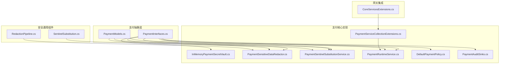
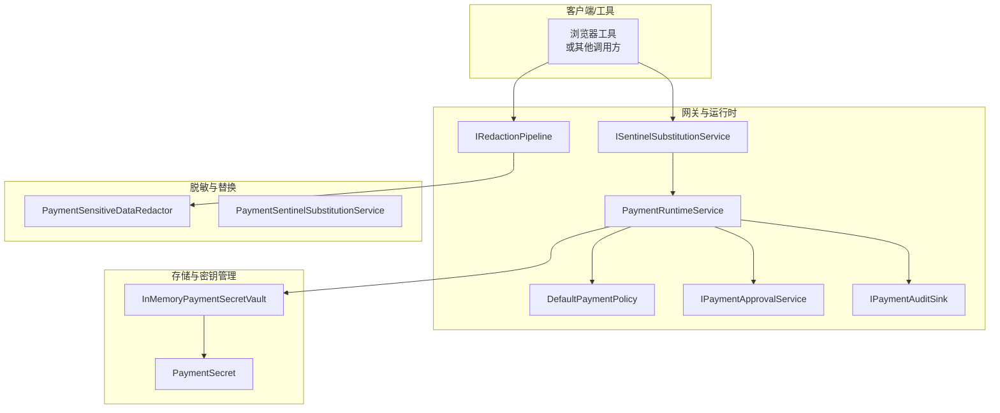
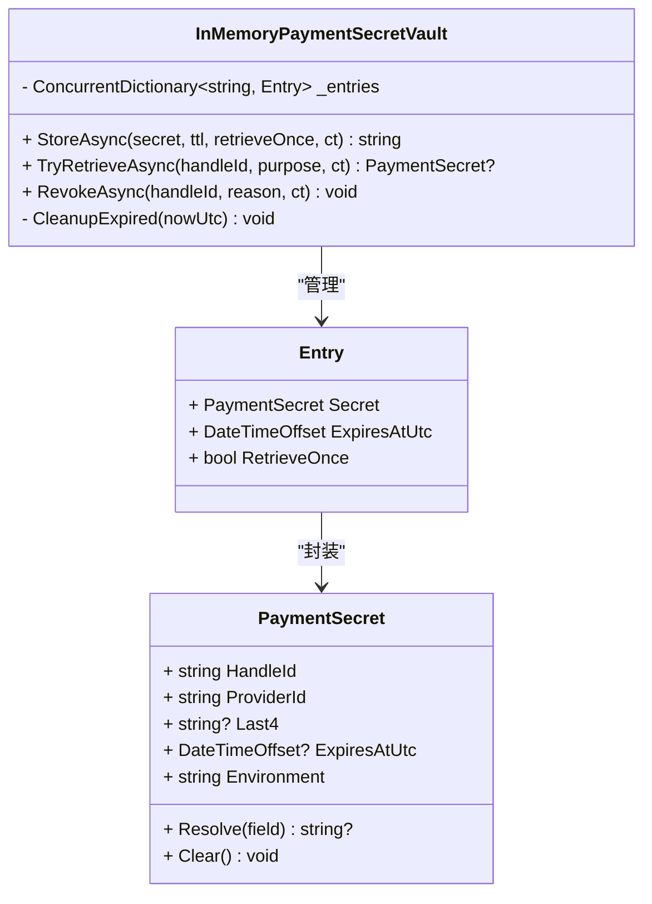
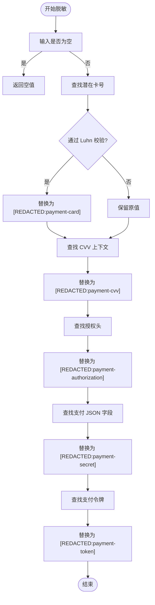
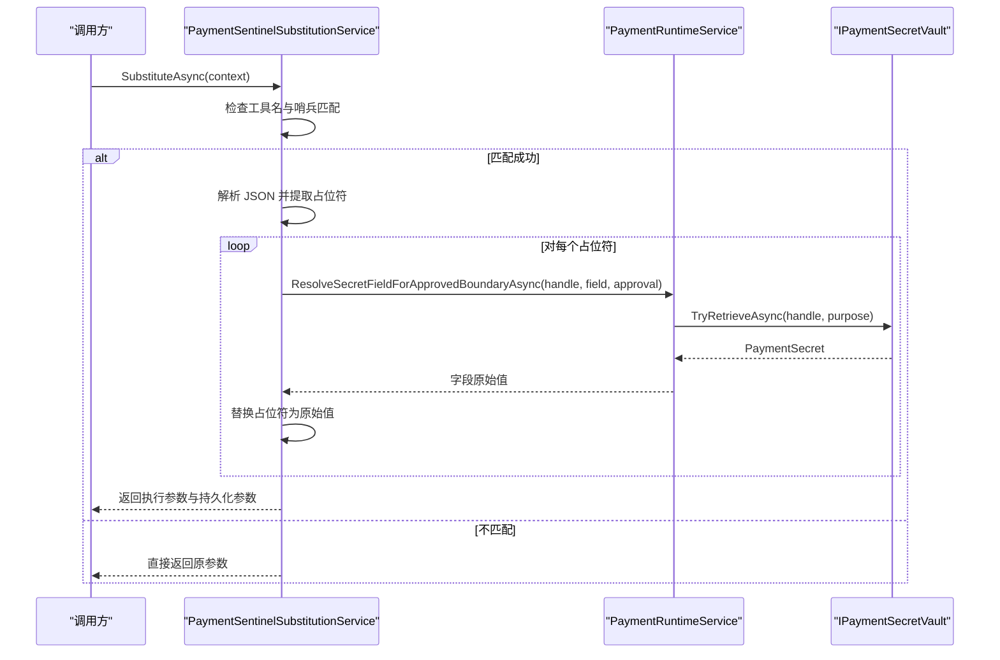
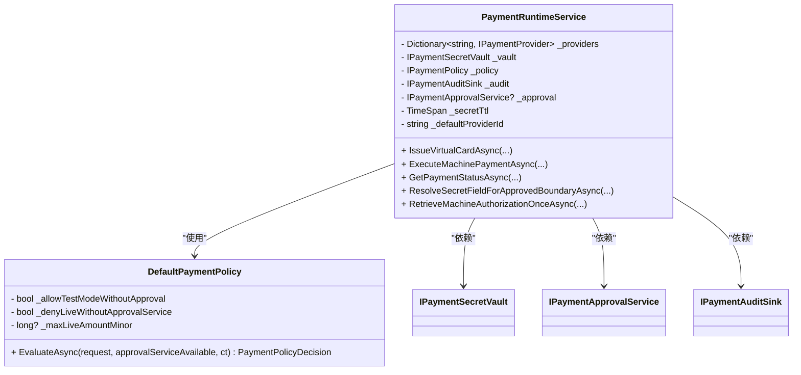
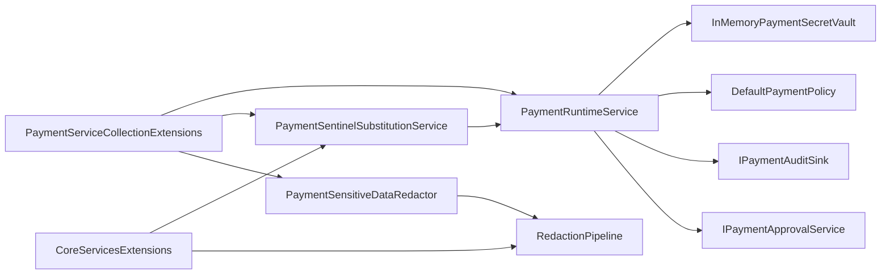

# 安全存储机制

<cite>
**本文档引用的文件**
- [InMemoryPaymentSecretVault.cs](file://src/OpenClaw.Payments.Core/InMemoryPaymentSecretVault.cs)
- [PaymentSensitiveDataRedactor.cs](file://src/OpenClaw.Payments.Core/PaymentSensitiveDataRedactor.cs)
- [PaymentSentinelSubstitutionService.cs](file://src/OpenClaw.Payments.Core/PaymentSentinelSubstitutionService.cs)
- [PaymentRuntimeService.cs](file://src/OpenClaw.Payments.Core/PaymentRuntimeService.cs)
- [DefaultPaymentPolicy.cs](file://src/OpenClaw.Payments.Core/DefaultPaymentPolicy.cs)
- [PaymentServiceCollectionExtensions.cs](file://src/OpenClaw.Payments.Core/PaymentServiceCollectionExtensions.cs)
- [PaymentInterfaces.cs](file://src/OpenClaw.Payments.Abstractions/PaymentInterfaces.cs)
- [PaymentModels.cs](file://src/OpenClaw.Payments.Abstractions/PaymentModels.cs)
- [RedactionPipeline.cs](file://src/OpenClaw.Core/Security/RedactionPipeline.cs)
- [SentinelSubstitution.cs](file://src/OpenClaw.Core/SentinelSubstitution.cs)
- [PaymentAuditSinks.cs](file://src/OpenClaw.Payments.Core/PaymentAuditSinks.cs)
- [CoreServicesExtensions.cs](file://src/OpenClaw.Gateway/Composition/CoreServicesExtensions.cs)
- [PaymentRuntimeTests.cs](file://src/OpenClaw.Tests/PaymentRuntimeTests.cs)
</cite>

## 目录
1. [简介](#简介)
2. [项目结构](#项目结构)
3. [核心组件](#核心组件)
4. [架构概览](#架构概览)
5. [详细组件分析](#详细组件分析)
6. [依赖关系分析](#依赖关系分析)
7. [性能考虑](#性能考虑)
8. [故障排除指南](#故障排除指南)
9. [结论](#结论)
10. [附录](#附录)

## 简介
本文件针对支付敏感数据的安全存储机制进行全面技术文档化，涵盖以下关键方面：
- 支付敏感数据的存储策略与加密机制
- 访问控制与审批流程
- InMemoryPaymentSecretVault 的安全设计、密钥管理与生命周期控制
- PaymentSensitiveDataRedactor 的数据脱敏算法、规则配置与实时处理
- PaymentSentinelSubstitutionService 的敏感词替换机制、策略配置与性能优化
- 安全架构图、数据流图、威胁模型分析
- 安全配置指南、合规性要求与审计跟踪
- 与外部密钥管理服务的集成方式与备份恢复策略

## 项目结构
安全存储机制主要分布在以下模块：
- 支付抽象层（Payments.Abstractions）：定义支付接口、模型与枚举
- 支付核心实现（Payments.Core）：实现密钥保险库、脱敏器、哨兵替换服务、运行时服务与策略
- 安全通用组件（Core.Security）：通用脱敏管道与哨兵替换基础设施
- 网关集成（Gateway）：服务注册与运行时装配
- 测试（Tests）：行为验证与边界条件测试

**图表来源**
- [PaymentInterfaces.cs:1-60](file://src/OpenClaw.Payments.Abstractions/PaymentInterfaces.cs#L1-L60)
- [PaymentModels.cs:1-400](file://src/OpenClaw.Payments.Abstractions/PaymentModels.cs#L1-L400)
- [InMemoryPaymentSecretVault.cs:1-73](file://src/OpenClaw.Payments.Core/InMemoryPaymentSecretVault.cs#L1-L73)
- [PaymentSensitiveDataRedactor.cs:1-88](file://src/OpenClaw.Payments.Core/PaymentSensitiveDataRedactor.cs#L1-L88)
- [PaymentSentinelSubstitutionService.cs:1-119](file://src/OpenClaw.Payments.Core/PaymentSentinelSubstitutionService.cs#L1-L119)
- [PaymentRuntimeService.cs:1-433](file://src/OpenClaw.Payments.Core/PaymentRuntimeService.cs#L1-L433)
- [DefaultPaymentPolicy.cs:1-60](file://src/OpenClaw.Payments.Core/DefaultPaymentPolicy.cs#L1-L60)
- [PaymentAuditSinks.cs:1-19](file://src/OpenClaw.Payments.Core/PaymentAuditSinks.cs#L1-L19)
- [RedactionPipeline.cs:1-111](file://src/OpenClaw.Core/Security/RedactionPipeline.cs#L1-L111)
- [SentinelSubstitution.cs:1-37](file://src/OpenClaw.Core/SentinelSubstitution.cs#L1-L37)
- [CoreServicesExtensions.cs:77-98](file://src/OpenClaw.Gateway/Composition/CoreServicesExtensions.cs#L77-L98)

**章节来源**
- [PaymentInterfaces.cs:1-60](file://src/OpenClaw.Payments.Abstractions/PaymentInterfaces.cs#L1-L60)
- [PaymentModels.cs:1-400](file://src/OpenClaw.Payments.Abstractions/PaymentModels.cs#L1-L400)
- [CoreServicesExtensions.cs:77-98](file://src/OpenClaw.Gateway/Composition/CoreServicesExtensions.cs#L77-L98)

## 核心组件
本节概述安全存储机制的核心组件及其职责：
- InMemoryPaymentSecretVault：内存型支付密钥保险库，支持过期清理、一次性提取与撤销
- PaymentSensitiveDataRedactor：支付敏感数据脱敏器，基于正则表达式识别并替换敏感字段
- PaymentSentinelSubstitutionService：支付哨兵替换服务，仅在浏览器填充场景解析并替换占位符
- PaymentRuntimeService：支付运行时服务，协调保险库、策略、审批与审计
- DefaultPaymentPolicy：默认支付策略，控制测试/生产模式与金额上限
- RedactionPipeline：通用脱敏管道，串联多个脱敏器对会话进行批量脱敏
- SentinelSubstitution：通用哨兵替换基础设施，定义上下文与结果结构

**章节来源**
- [InMemoryPaymentSecretVault.cs:1-73](file://src/OpenClaw.Payments.Core/InMemoryPaymentSecretVault.cs#L1-L73)
- [PaymentSensitiveDataRedactor.cs:1-88](file://src/OpenClaw.Payments.Core/PaymentSensitiveDataRedactor.cs#L1-L88)
- [PaymentSentinelSubstitutionService.cs:1-119](file://src/OpenClaw.Payments.Core/PaymentSentinelSubstitutionService.cs#L1-L119)
- [PaymentRuntimeService.cs:1-433](file://src/OpenClaw.Payments.Core/PaymentRuntimeService.cs#L1-L433)
- [DefaultPaymentPolicy.cs:1-60](file://src/OpenClaw.Payments.Core/DefaultPaymentPolicy.cs#L1-L60)
- [RedactionPipeline.cs:1-111](file://src/OpenClaw.Core/Security/RedactionPipeline.cs#L1-L111)
- [SentinelSubstitution.cs:1-37](file://src/OpenClaw.Core/SentinelSubstitution.cs#L1-L37)

## 架构概览
下图展示支付敏感数据在系统中的存储、处理与访问控制的整体架构：

**图表来源**
- [PaymentRuntimeService.cs:1-433](file://src/OpenClaw.Payments.Core/PaymentRuntimeService.cs#L1-L433)
- [DefaultPaymentPolicy.cs:1-60](file://src/OpenClaw.Payments.Core/DefaultPaymentPolicy.cs#L1-L60)
- [InMemoryPaymentSecretVault.cs:1-73](file://src/OpenClaw.Payments.Core/InMemoryPaymentSecretVault.cs#L1-L73)
- [PaymentSensitiveDataRedactor.cs:1-88](file://src/OpenClaw.Payments.Core/PaymentSensitiveDataRedactor.cs#L1-L88)
- [PaymentSentinelSubstitutionService.cs:1-119](file://src/OpenClaw.Payments.Core/PaymentSentinelSubstitutionService.cs#L1-L119)
- [RedactionPipeline.cs:1-111](file://src/OpenClaw.Core/Security/RedactionPipeline.cs#L1-L111)
- [SentinelSubstitution.cs:1-37](file://src/OpenClaw.Core/SentinelSubstitution.cs#L1-L37)

## 详细组件分析

### InMemoryPaymentSecretVault 安全设计与生命周期控制
- 设计要点
  - 内存存储：使用并发字典存储密钥条目，避免持久化风险
  - 过期清理：自动清理已过期条目，并清空敏感字段
  - 一次性提取：支持 retrieveOnce 标记，首次提取后即移除条目
  - 撤销机制：支持按 handleId 主动撤销并清空敏感字段
- 生命周期控制
  - 存储：根据 TTL 计算过期时间，默认最小 TTL 保护
  - 提取：检查过期与一次性标记，返回或移除条目
  - 清理：启动时与每次提取前清理过期条目
- 安全属性
  - 敏感字段在撤销与过期时被清空，降低泄露风险
  - handleId 作为唯一标识，避免直接暴露原始密钥

**图表来源**
- [InMemoryPaymentSecretVault.cs:1-73](file://src/OpenClaw.Payments.Core/InMemoryPaymentSecretVault.cs#L1-L73)
- [PaymentModels.cs:279-362](file://src/OpenClaw.Payments.Abstractions/PaymentModels.cs#L279-L362)

**章节来源**
- [InMemoryPaymentSecretVault.cs:1-73](file://src/OpenClaw.Payments.Core/InMemoryPaymentSecretVault.cs#L1-L73)
- [PaymentModels.cs:279-362](file://src/OpenClaw.Payments.Abstractions/PaymentModels.cs#L279-L362)

### PaymentSensitiveDataRedactor 脱敏算法与规则配置
- 脱敏算法
  - PAN 识别：匹配 13-19 位数字序列，剔除非数字字符后进行 Luhn 校验
  - CVV 上下文：识别包含 CVV/CVC 的键值对并替换
  - 授权头：识别 Authorization: Payment 模式并替换令牌
  - JSON 字段：识别常见支付字段（如 pan、cvv、paymentToken 等）并替换
  - 令牌模式：识别 spt/payment/paytok/machinepay 前缀的令牌并替换
- 实时处理
  - 单次遍历：通过正则链路一次性完成多种模式的替换
  - Luhn 校验：确保仅对可能有效的卡号进行替换
- 规则配置
  - 正则表达式可扩展，便于新增字段与模式
  - 通过 RedactionPipeline 将多个脱敏器组合使用

**图表来源**
- [PaymentSensitiveDataRedactor.cs:1-88](file://src/OpenClaw.Payments.Core/PaymentSensitiveDataRedactor.cs#L1-L88)

**章节来源**
- [PaymentSensitiveDataRedactor.cs:1-88](file://src/OpenClaw.Payments.Core/PaymentSensitiveDataRedactor.cs#L1-L88)
- [RedactionPipeline.cs:1-111](file://src/OpenClaw.Core/Security/RedactionPipeline.cs#L1-L111)

### PaymentSentinelSubstitutionService 替换机制与策略
- 替换机制
  - 仅在工具名为 browser 且参数 JSON 包含支付哨兵占位符时触发
  - 严格限制在浏览器填充动作（action=fill）中解析
  - 解析 {{payment.vcard:<handle>:<field>}} 并替换为实际字段值
- 策略配置
  - 支持字段：pan、cvv、exp_month、exp_year、exp_mm_yy、exp_mm_yyyy、postal_code
  - 环境与提供商标识：从上下文继承或从密钥对象推断
  - 审批边界：替换前强制执行策略评估与审批
- 性能优化
  - 仅在匹配到哨兵时才解析 JSON，避免不必要的开销
  - 使用流式 JSON 写入替换特定属性，减少对象重建成本

**图表来源**
- [PaymentSentinelSubstitutionService.cs:1-119](file://src/OpenClaw.Payments.Core/PaymentSentinelSubstitutionService.cs#L1-L119)
- [PaymentRuntimeService.cs:201-264](file://src/OpenClaw.Payments.Core/PaymentRuntimeService.cs#L201-L264)

**章节来源**
- [PaymentSentinelSubstitutionService.cs:1-119](file://src/OpenClaw.Payments.Core/PaymentSentinelSubstitutionService.cs#L1-L119)
- [SentinelSubstitution.cs:1-37](file://src/OpenClaw.Core/SentinelSubstitution.cs#L1-L37)

### 支付运行时服务与策略控制
- 运行时职责
  - 协调提供者、保险库、策略、审批与审计
  - 在关键操作前后记录审计事件
  - 控制密钥 TTL 与一次性提取
- 策略控制
  - 默认策略支持测试模式免审批、生产模式限额与审批要求
  - CLI 确认模式支持非交互式批准
- 审批流程
  - 对于需要审批的操作，先评估策略再请求审批
  - 审批结果影响后续操作执行

**图表来源**
- [PaymentRuntimeService.cs:1-433](file://src/OpenClaw.Payments.Core/PaymentRuntimeService.cs#L1-L433)
- [DefaultPaymentPolicy.cs:1-60](file://src/OpenClaw.Payments.Core/DefaultPaymentPolicy.cs#L1-L60)

**章节来源**
- [PaymentRuntimeService.cs:1-433](file://src/OpenClaw.Payments.Core/PaymentRuntimeService.cs#L1-L433)
- [DefaultPaymentPolicy.cs:1-60](file://src/OpenClaw.Payments.Core/DefaultPaymentPolicy.cs#L1-L60)

## 依赖关系分析
- 组件耦合
  - PaymentRuntimeService 依赖 IPaymentSecretVault、IPaymentPolicy、IPaymentApprovalService、IPaymentAuditSink
  - PaymentSentinelSubstitutionService 依赖 PaymentRuntimeService 以解析密钥字段
  - RedactionPipeline 依赖 ISensitiveDataRedactor，PaymentSensitiveDataRedactor 实现该接口
- 外部依赖
  - 网关通过 CoreServicesExtensions 注册 ISentinelSubstitutionService，按配置启用或禁用
  - PaymentServiceCollectionExtensions 注册支付运行时与哨兵替换服务

**图表来源**
- [PaymentServiceCollectionExtensions.cs:29-42](file://src/OpenClaw.Payments.Core/PaymentServiceCollectionExtensions.cs#L29-L42)
- [CoreServicesExtensions.cs:77-98](file://src/OpenClaw.Gateway/Composition/CoreServicesExtensions.cs#L77-L98)

**章节来源**
- [PaymentServiceCollectionExtensions.cs:29-42](file://src/OpenClaw.Payments.Core/PaymentServiceCollectionExtensions.cs#L29-L42)
- [CoreServicesExtensions.cs:77-98](file://src/OpenClaw.Gateway/Composition/CoreServicesExtensions.cs#L77-L98)

## 性能考虑
- 正则表达式编译：所有敏感模式均使用 RegexOptions.Compiled，提升匹配性能
- 最小化 JSON 解析：哨兵替换仅在匹配到占位符时解析 JSON，避免无谓开销
- 流式 JSON 写入：替换特定属性时使用流式写入，减少对象重建与内存分配
- 并发访问：保险库使用并发字典，支持高并发下的安全读写
- 过期清理：定期清理过期条目，防止内存膨胀

[本节为一般性指导，无需具体文件分析]

## 故障排除指南
- 哨兵替换未生效
  - 确认工具名为 browser 且参数 JSON 包含 {{payment.vcard:...}} 占位符
  - 确认 action 为 fill，否则会抛出异常
- 密钥无法提取
  - 检查 handleId 是否有效、是否过期或已被撤销
  - 若 retrieveOnce 为 true，首次提取后条目会被移除
- 脱敏不彻底
  - 确认 RedactionPipeline 已注册 PaymentSensitiveDataRedactor
  - 检查自定义脱敏器是否正确实现 ISensitiveDataRedactor
- 审批拒绝
  - 检查 DefaultPaymentPolicy 配置与金额上限
  - 确认已注册 IPaymentApprovalService 或使用 CLI 确认模式

**章节来源**
- [PaymentSentinelSubstitutionService.cs:21-86](file://src/OpenClaw.Payments.Core/PaymentSentinelSubstitutionService.cs#L21-L86)
- [InMemoryPaymentSecretVault.cs:34-54](file://src/OpenClaw.Payments.Core/InMemoryPaymentSecretVault.cs#L34-L54)
- [RedactionPipeline.cs:21-94](file://src/OpenClaw.Core/Security/RedactionPipeline.cs#L21-L94)
- [DefaultPaymentPolicy.cs:21-51](file://src/OpenClaw.Payments.Core/DefaultPaymentPolicy.cs#L21-L51)

## 结论
本安全存储机制通过“内存保险库 + 策略审批 + 多层脱敏 + 哨兵替换”的组合，实现了对支付敏感数据的最小暴露与最大安全保障。InMemoryPaymentSecretVault 提供了受控的生命周期管理，PaymentSensitiveDataRedactor 与 RedactionPipeline 确保数据在存储与传输过程中的脱敏，PaymentSentinelSubstitutionService 则在执行边界精确替换敏感字段，配合 PaymentRuntimeService 与 DefaultPaymentPolicy 形成闭环的访问控制与审计追踪。

[本节为总结性内容，无需具体文件分析]

## 附录

### 安全配置指南
- 启用与禁用支付功能
  - 通过 CoreServicesExtensions 条件注册 ISentinelSubstitutionService，按配置启用或使用 Noop 实现
- 审计导出
  - 使用 AdminObservabilityService 导出 operator-audit、runtime-events、approval-history 等审计文件
- 会话脱敏
  - 在保存会话前通过 RedactionPipeline 对历史消息进行批量脱敏

**章节来源**
- [CoreServicesExtensions.cs:77-98](file://src/OpenClaw.Gateway/Composition/CoreServicesExtensions.cs#L77-L98)
- [AdminObservabilityService.cs:252-283](file://src/OpenClaw.Gateway/AdminObservabilityService.cs#L252-L283)
- [RedactionPipeline.cs:21-94](file://src/OpenClaw.Core/Security/RedactionPipeline.cs#L21-L94)

### 合规性要求
- 数据最小化：仅在执行边界暴露原始字段，其余场景使用占位符或脱敏文本
- 审批与记录：所有资金相关操作均需策略评估与审批，并记录审计事件
- 令牌不可序列化：PaymentSecret 明确禁止序列化，防止意外落盘

**章节来源**
- [PaymentModels.cs:364-371](file://src/OpenClaw.Payments.Abstractions/PaymentModels.cs#L364-L371)
- [PaymentRuntimeService.cs:269-334](file://src/OpenClaw.Payments.Core/PaymentRuntimeService.cs#L269-L334)

### 审计跟踪
- 审计事件类型
  - approval_requested、policy_denied、approval_granted、virtual_card_issued、machine_payment_attempted、machine_payment_completed 等
- 存储与查询
  - InMemoryPaymentAuditSink 提供快照与追加写入能力
  - OperatorAuditStore 支持查询与哈希校验

**章节来源**
- [PaymentRuntimeService.cs:271-330](file://src/OpenClaw.Payments.Core/PaymentRuntimeService.cs#L271-L330)
- [PaymentAuditSinks.cs:1-19](file://src/OpenClaw.Payments.Core/PaymentAuditSinks.cs#L1-L19)
- [OperatorAuditStore.cs:69-103](file://src/OpenClaw.Gateway/OperatorAuditStore.cs#L69-L103)

### 外部密钥管理服务集成与备份恢复
- 集成方式
  - 通过实现 IPaymentSecretVault 接口，替换 InMemoryPaymentSecretVault 以对接外部 KMS/密钥保管库
  - 保持现有 PaymentRuntimeService 与脱敏/替换逻辑不变
- 备份恢复
  - 建议在外部保险库中启用密钥版本与轮换策略
  - 审计日志可用于故障排查与合规审计

[本节为概念性内容，无需具体文件分析]

### 威胁模型与缓解
- 威胁
  - 内存泄露、未授权访问、令牌滥用、会话明文存储
- 缓解
  - 内存保险库 + 过期清理 + 一次性提取
  - 策略审批 + 审计记录
  - 多层脱敏与哨兵替换
  - 严格的动作边界控制（仅浏览器填充）

[本节为概念性内容，无需具体文件分析]