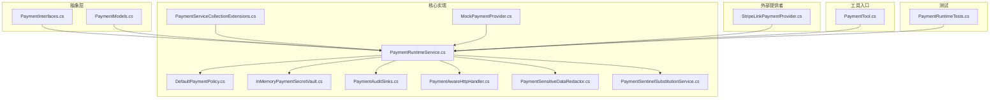
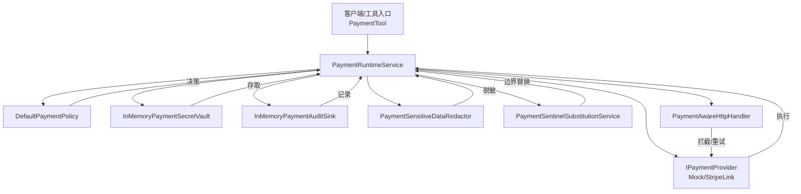
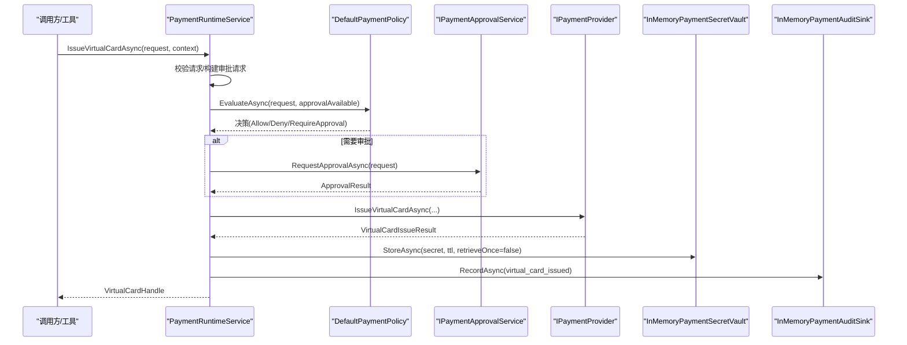
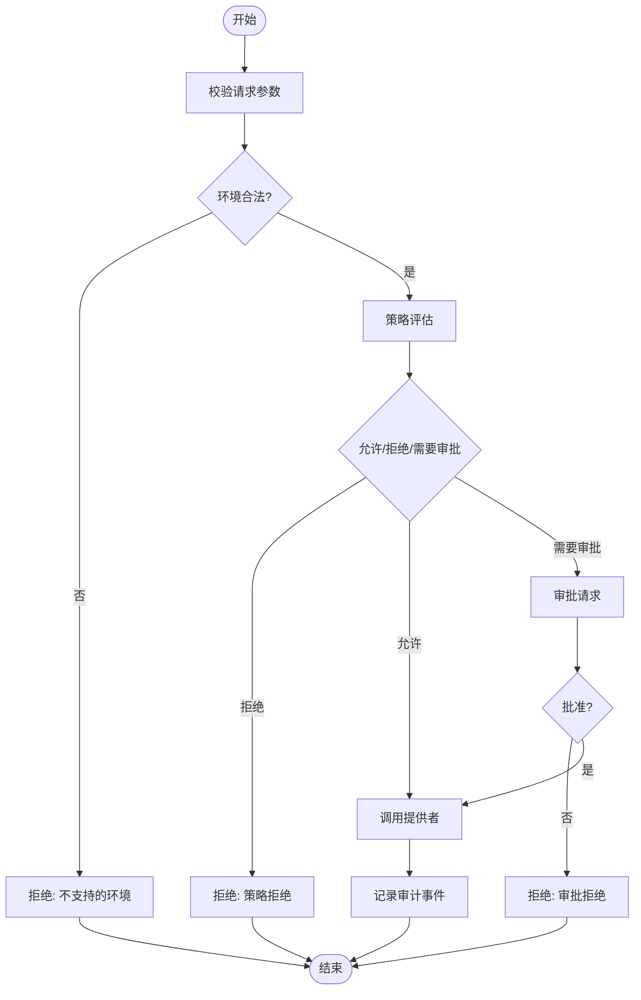
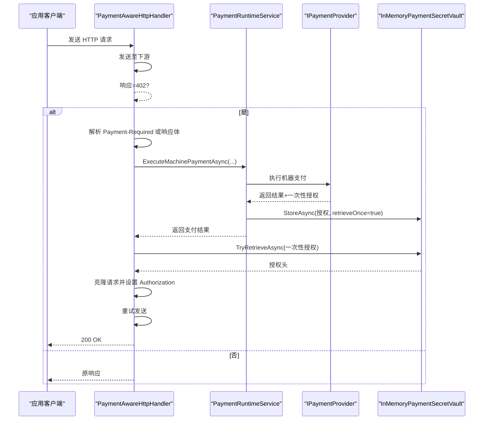
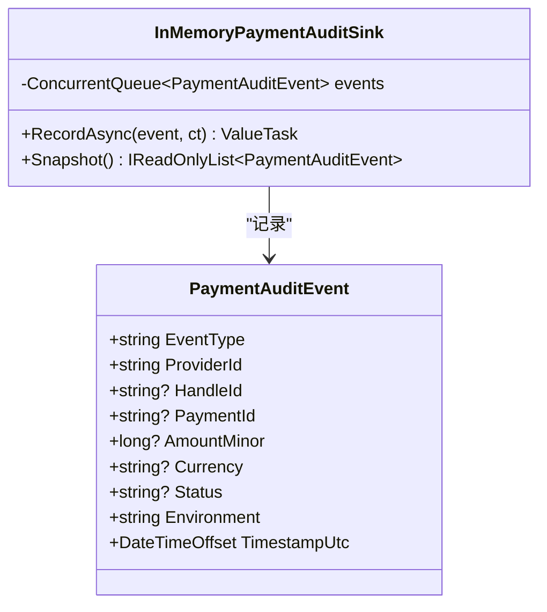
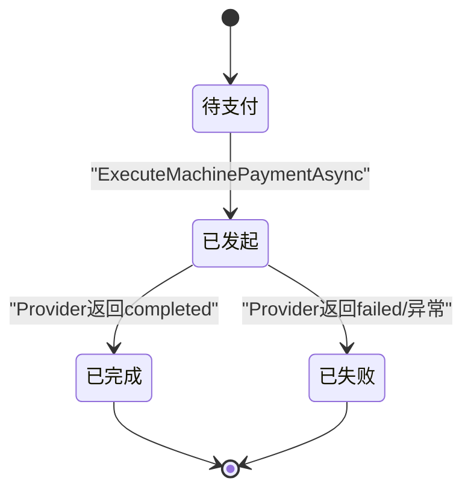
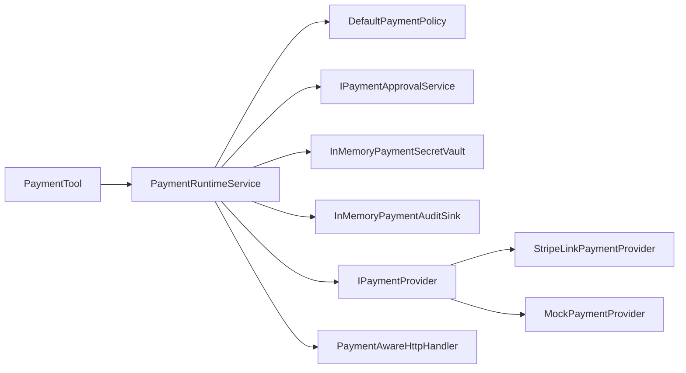
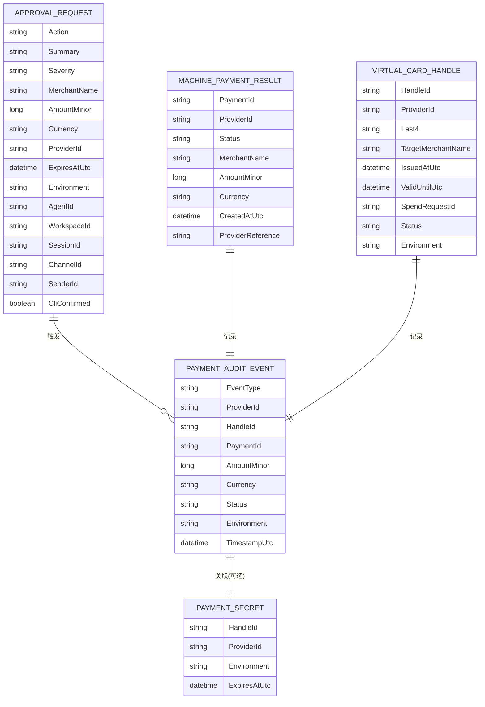

# 支付处理流程

<cite>
**本文引用的文件**
- [PaymentInterfaces.cs](file://src/OpenClaw.Payments.Abstractions/PaymentInterfaces.cs)
- [PaymentModels.cs](file://src/OpenClaw.Payments.Abstractions/PaymentModels.cs)
- [PaymentRuntimeService.cs](file://src/OpenClaw.Payments.Core/PaymentRuntimeService.cs)
- [PaymentAwareHttpHandler.cs](file://src/OpenClaw.Payments.Core/PaymentAwareHttpHandler.cs)
- [PaymentAuditSinks.cs](file://src/OpenClaw.Payments.Core/PaymentAuditSinks.cs)
- [DefaultPaymentPolicy.cs](file://src/OpenClaw.Payments.Core/DefaultPaymentPolicy.cs)
- [InMemoryPaymentSecretVault.cs](file://src/OpenClaw.Payments.Core/InMemoryPaymentSecretVault.cs)
- [MockPaymentProvider.cs](file://src/OpenClaw.Payments.Core/MockPaymentProvider.cs)
- [PaymentSensitiveDataRedactor.cs](file://src/OpenClaw.Payments.Core/PaymentSensitiveDataRedactor.cs)
- [PaymentSentinelSubstitutionService.cs](file://src/OpenClaw.Payments.Core/PaymentSentinelSubstitutionService.cs)
- [PaymentServiceCollectionExtensions.cs](file://src/OpenClaw.Payments.Core/PaymentServiceCollectionExtensions.cs)
- [StripeLinkPaymentProvider.cs](file://src/OpenClaw.Payments.StripeLink/StripeLinkPaymentProvider.cs)
- [PaymentTool.cs](file://src/OpenClaw.Plugins.Payment/PaymentTool.cs)
- [PaymentRuntimeTests.cs](file://src/OpenClaw.Tests/PaymentRuntimeTests.cs)
</cite>

## 目录
1. [简介](#简介)
2. [项目结构](#项目结构)
3. [核心组件](#核心组件)
4. [架构总览](#架构总览)
5. [详细组件分析](#详细组件分析)
6. [依赖关系分析](#依赖关系分析)
7. [性能考虑](#性能考虑)
8. [故障排查指南](#故障排查指南)
9. [结论](#结论)
10. [附录](#附录)

## 简介
本文件系统性阐述支付处理流程在 OpenClaw 中的实现与使用，覆盖从支付请求到执行、状态查询的完整生命周期；解释 PaymentRuntimeService 的调度与并发控制、资源管理；详述支付请求的验证、审批与执行顺序；说明 PaymentAwareHttpHandler 的 HTTP 拦截机制、支付头信息处理与请求重写策略；并给出支付审计日志的记录格式、存储策略与查询接口。文档同时包含流程图、状态机图、错误恢复机制、流程配置示例、性能监控指标与异常处理最佳实践。

## 项目结构
支付相关能力分布在三个主要工程中：
- OpenClaw.Payments.Abstractions：定义支付领域模型、接口契约与 JSON 序列化上下文
- OpenClaw.Payments.Core：支付运行时核心（调度、策略、审计、密钥保管、HTTP 拦截器等）
- OpenClaw.Payments.StripeLink：Stripe Link 支付提供者实现
- OpenClaw.Plugins.Payment：支付工具入口（面向插件/CLI 的统一调用接口）
- OpenClaw.Tests：支付相关行为测试，验证流程正确性与边界条件

图表来源
- [PaymentInterfaces.cs:1-60](file://src/OpenClaw.Payments.Abstractions/PaymentInterfaces.cs#L1-L60)
- [PaymentModels.cs:1-400](file://src/OpenClaw.Payments.Abstractions/PaymentModels.cs#L1-L400)
- [PaymentRuntimeService.cs:1-433](file://src/OpenClaw.Payments.Core/PaymentRuntimeService.cs#L1-L433)
- [DefaultPaymentPolicy.cs:1-60](file://src/OpenClaw.Payments.Core/DefaultPaymentPolicy.cs#L1-L60)
- [InMemoryPaymentSecretVault.cs:1-73](file://src/OpenClaw.Payments.Core/InMemoryPaymentSecretVault.cs#L1-L73)
- [PaymentAuditSinks.cs:1-19](file://src/OpenClaw.Payments.Core/PaymentAuditSinks.cs#L1-L19)
- [PaymentAwareHttpHandler.cs:1-172](file://src/OpenClaw.Payments.Core/PaymentAwareHttpHandler.cs#L1-L172)
- [PaymentSensitiveDataRedactor.cs:1-88](file://src/OpenClaw.Payments.Core/PaymentSensitiveDataRedactor.cs#L1-L88)
- [PaymentSentinelSubstitutionService.cs:1-119](file://src/OpenClaw.Payments.Core/PaymentSentinelSubstitutionService.cs#L1-L119)
- [PaymentServiceCollectionExtensions.cs:1-43](file://src/OpenClaw.Payments.Core/PaymentServiceCollectionExtensions.cs#L1-L43)
- [MockPaymentProvider.cs:1-165](file://src/OpenClaw.Payments.Core/MockPaymentProvider.cs#L1-L165)
- [StripeLinkPaymentProvider.cs:1-286](file://src/OpenClaw.Payments.StripeLink/StripeLinkPaymentProvider.cs#L1-L286)
- [PaymentTool.cs:1-181](file://src/OpenClaw.Plugins.Payment/PaymentTool.cs#L1-L181)
- [PaymentRuntimeTests.cs:1-415](file://src/OpenClaw.Tests/PaymentRuntimeTests.cs#L1-L415)

章节来源
- [PaymentInterfaces.cs:1-60](file://src/OpenClaw.Payments.Abstractions/PaymentInterfaces.cs#L1-L60)
- [PaymentModels.cs:1-400](file://src/OpenClaw.Payments.Abstractions/PaymentModels.cs#L1-L400)
- [PaymentRuntimeService.cs:1-433](file://src/OpenClaw.Payments.Core/PaymentRuntimeService.cs#L1-L433)
- [PaymentServiceCollectionExtensions.cs:1-43](file://src/OpenClaw.Payments.Core/PaymentServiceCollectionExtensions.cs#L1-L43)

## 核心组件
- PaymentRuntimeService：支付运行时核心，负责路由到具体提供者、策略评估、审批、密钥保管、审计记录、状态查询与浏览器哨兵替换
- DefaultPaymentPolicy：默认策略，支持测试/生产环境、限额、是否需要审批服务
- InMemoryPaymentSecretVault：内存密钥保管，支持一次性取回、过期清理、撤销
- PaymentAwareHttpHandler：HTTP 拦截器，自动处理 402 挑战、触发机器支付、注入授权头并重试
- PaymentAuditSinks：审计事件存储（内存队列快照）
- PaymentSensitiveDataRedactor：敏感数据脱敏（卡号、CVV、授权头、令牌等）
- PaymentSentinelSubstitutionService：浏览器填充场景的哨兵替换（仅在执行边界生效，持久化保持占位）
- MockPaymentProvider/StripeLinkPaymentProvider：支付提供者实现（模拟与真实 CLI 集成）
- PaymentTool：统一的支付工具入口，屏蔽底层细节，输出安全结果

章节来源
- [PaymentRuntimeService.cs:1-433](file://src/OpenClaw.Payments.Core/PaymentRuntimeService.cs#L1-L433)
- [DefaultPaymentPolicy.cs:1-60](file://src/OpenClaw.Payments.Core/DefaultPaymentPolicy.cs#L1-L60)
- [InMemoryPaymentSecretVault.cs:1-73](file://src/OpenClaw.Payments.Core/InMemoryPaymentSecretVault.cs#L1-L73)
- [PaymentAwareHttpHandler.cs:1-172](file://src/OpenClaw.Payments.Core/PaymentAwareHttpHandler.cs#L1-L172)
- [PaymentAuditSinks.cs:1-19](file://src/OpenClaw.Payments.Core/PaymentAuditSinks.cs#L1-L19)
- [PaymentSensitiveDataRedactor.cs:1-88](file://src/OpenClaw.Payments.Core/PaymentSensitiveDataRedactor.cs#L1-L88)
- [PaymentSentinelSubstitutionService.cs:1-119](file://src/OpenClaw.Payments.Core/PaymentSentinelSubstitutionService.cs#L1-L119)
- [MockPaymentProvider.cs:1-165](file://src/OpenClaw.Payments.Core/MockPaymentProvider.cs#L1-L165)
- [StripeLinkPaymentProvider.cs:1-286](file://src/OpenClaw.Payments.StripeLink/StripeLinkPaymentProvider.cs#L1-L286)
- [PaymentTool.cs:1-181](file://src/OpenClaw.Plugins.Payment/PaymentTool.cs#L1-L181)

## 架构总览
支付处理采用“运行时 + 提供者 + 策略 + 审计 + 密钥保管”的分层设计。PaymentRuntimeService 作为编排中心，根据请求动作与提供者 ID 调度到具体实现；策略决定是否需要审批；密钥保管确保敏感信息不出界；HTTP 拦截器实现异步挑战-支付-重试的透明流程；审计贯穿全流程。

图表来源
- [PaymentRuntimeService.cs:1-433](file://src/OpenClaw.Payments.Core/PaymentRuntimeService.cs#L1-L433)
- [DefaultPaymentPolicy.cs:1-60](file://src/OpenClaw.Payments.Core/DefaultPaymentPolicy.cs#L1-L60)
- [InMemoryPaymentSecretVault.cs:1-73](file://src/OpenClaw.Payments.Core/InMemoryPaymentSecretVault.cs#L1-L73)
- [PaymentAuditSinks.cs:1-19](file://src/OpenClaw.Payments.Core/PaymentAuditSinks.cs#L1-L19)
- [PaymentSensitiveDataRedactor.cs:1-88](file://src/OpenClaw.Payments.Core/PaymentSensitiveDataRedactor.cs#L1-L88)
- [PaymentSentinelSubstitutionService.cs:1-119](file://src/OpenClaw.Payments.Core/PaymentSentinelSubstitutionService.cs#L1-L119)
- [PaymentAwareHttpHandler.cs:1-172](file://src/OpenClaw.Payments.Core/PaymentAwareHttpHandler.cs#L1-L172)
- [MockPaymentProvider.cs:1-165](file://src/OpenClaw.Payments.Core/MockPaymentProvider.cs#L1-L165)
- [StripeLinkPaymentProvider.cs:1-286](file://src/OpenClaw.Payments.StripeLink/StripeLinkPaymentProvider.cs#L1-L286)
- [PaymentTool.cs:1-181](file://src/OpenClaw.Plugins.Payment/PaymentTool.cs#L1-L181)

## 详细组件分析

### PaymentRuntimeService 调度与并发控制
- 多提供者注册与解析：通过构造函数收集所有 IPaymentProvider，按 ProviderId 查找
- 上下文归一化：统一环境（test/live）与可选 CLI 确认标记
- 并发与资源管理：
  - 使用字典缓存提供者实例，避免重复构建
  - 秘钥 TTL 计算基于有效截止时间或默认值，防止资源泄漏
  - 审计事件异步记录，不阻塞主流程
- 关键流程：
  - 虚拟卡签发：校验请求 → 构建审批请求 → 策略评估/审批 → 调用提供者 → 存入密钥保管 → 记录审计
  - 机器支付：校验请求 → 构建审批请求 → 策略评估/审批 → 记录尝试 → 调用提供者 → 可选一次性授权密钥 → 记录完成/失败
  - 状态查询：调用提供者 → 记录审计
  - 浏览器哨兵替换：从保管取出密钥 → 审批/策略 → 替换执行参数（持久化仍保留占位）

图表来源
- [PaymentRuntimeService.cs:46-114](file://src/OpenClaw.Payments.Core/PaymentRuntimeService.cs#L46-L114)
- [DefaultPaymentPolicy.cs:21-51](file://src/OpenClaw.Payments.Core/DefaultPaymentPolicy.cs#L21-L51)
- [MockPaymentProvider.cs:47-98](file://src/OpenClaw.Payments.Core/MockPaymentProvider.cs#L47-L98)
- [InMemoryPaymentSecretVault.cs:18-32](file://src/OpenClaw.Payments.Core/InMemoryPaymentSecretVault.cs#L18-L32)
- [PaymentAuditSinks.cs:12-17](file://src/OpenClaw.Payments.Core/PaymentAuditSinks.cs#L12-L17)

章节来源
- [PaymentRuntimeService.cs:1-433](file://src/OpenClaw.Payments.Core/PaymentRuntimeService.cs#L1-L433)
- [DefaultPaymentPolicy.cs:1-60](file://src/OpenClaw.Payments.Core/DefaultPaymentPolicy.cs#L1-L60)
- [InMemoryPaymentSecretVault.cs:1-73](file://src/OpenClaw.Payments.Core/InMemoryPaymentSecretVault.cs#L1-L73)
- [PaymentAuditSinks.cs:1-19](file://src/OpenClaw.Payments.Core/PaymentAuditSinks.cs#L1-L19)

### 支付请求验证、审批与执行顺序
- 请求验证：
  - 虚拟卡：商户名必填、金额>0、币种必填
  - 机器支付：金额>0、币种必填
- 审批与策略：
  - 环境必须为 test/live；未知环境直接拒绝
  - 测试模式可按策略放行；生产模式超过限额或无审批服务则拒绝
  - CLI 确认可绕过交互式审批
- 执行顺序：
  - 先策略评估，再审批（如需），后调用提供者，最后审计记录

图表来源
- [PaymentRuntimeService.cs:269-334](file://src/OpenClaw.Payments.Core/PaymentRuntimeService.cs#L269-L334)
- [DefaultPaymentPolicy.cs:21-51](file://src/OpenClaw.Payments.Core/DefaultPaymentPolicy.cs#L21-L51)
- [PaymentRuntimeService.cs:362-378](file://src/OpenClaw.Payments.Core/PaymentRuntimeService.cs#L362-L378)

章节来源
- [PaymentRuntimeService.cs:269-378](file://src/OpenClaw.Payments.Core/PaymentRuntimeService.cs#L269-L378)
- [DefaultPaymentPolicy.cs:1-60](file://src/OpenClaw.Payments.Core/DefaultPaymentPolicy.cs#L1-L60)

### PaymentAwareHttpHandler 的 HTTP 拦截机制
- 拦截条件：响应状态码为 402（Payment Required）
- 挑战解析：优先读取 HTTP 头 Payment-Required，其次读取响应体，解析协议、金额、货币、商户等
- 自动支付与重试：构造 MachinePaymentRequest → 触发 PaymentRuntimeService 执行 → 从保管取回一次性授权 → 克隆原始请求并设置 Authorization → 重新发送
- 请求内容保护：先缓冲原始请求体，确保重试时内容一致

图表来源
- [PaymentAwareHttpHandler.cs:25-63](file://src/OpenClaw.Payments.Core/PaymentAwareHttpHandler.cs#L25-L63)
- [PaymentRuntimeService.cs:116-176](file://src/OpenClaw.Payments.Core/PaymentRuntimeService.cs#L116-L176)
- [InMemoryPaymentSecretVault.cs:34-54](file://src/OpenClaw.Payments.Core/InMemoryPaymentSecretVault.cs#L34-L54)

章节来源
- [PaymentAwareHttpHandler.cs:1-172](file://src/OpenClaw.Payments.Core/PaymentAwareHttpHandler.cs#L1-L172)
- [PaymentRuntimeService.cs:116-176](file://src/OpenClaw.Payments.Core/PaymentRuntimeService.cs#L116-L176)
- [InMemoryPaymentSecretVault.cs:1-73](file://src/OpenClaw.Payments.Core/InMemoryPaymentSecretVault.cs#L1-L73)

### 支付审计日志
- 记录字段：事件类型、提供者、交易标识、金额、货币、状态、决策、原因、环境、时间戳等
- 存储策略：内存队列（InMemoryPaymentAuditSink），支持快照读取
- 查询接口：Snapshot() 返回只读列表，便于测试与诊断

图表来源
- [PaymentAuditSinks.cs:1-19](file://src/OpenClaw.Payments.Core/PaymentAuditSinks.cs#L1-L19)
- [PaymentModels.cs:247-264](file://src/OpenClaw.Payments.Abstractions/PaymentModels.cs#L247-L264)

章节来源
- [PaymentAuditSinks.cs:1-19](file://src/OpenClaw.Payments.Core/PaymentAuditSinks.cs#L1-L19)
- [PaymentModels.cs:247-264](file://src/OpenClaw.Payments.Abstractions/PaymentModels.cs#L247-L264)

### 支付状态机（简化）

图表来源
- [PaymentRuntimeService.cs:162-175](file://src/OpenClaw.Payments.Core/PaymentRuntimeService.cs#L162-L175)
- [MockPaymentProvider.cs:100-148](file://src/OpenClaw.Payments.Core/MockPaymentProvider.cs#L100-L148)

章节来源
- [PaymentRuntimeService.cs:162-175](file://src/OpenClaw.Payments.Core/PaymentRuntimeService.cs#L162-L175)
- [MockPaymentProvider.cs:100-148](file://src/OpenClaw.Payments.Core/MockPaymentProvider.cs#L100-L148)

### 错误恢复机制
- 策略拒绝：抛出 PaymentPolicyDeniedException，审计记录拒绝原因
- 审批缺失：当需要审批但未注册审批服务时拒绝
- 402 挑战：由 PaymentAwareHttpHandler 自动处理并重试
- 密钥失效/撤销：TryRetrieveAsync 返回空，触发重试或提示用户重新授权
- 异常处理最佳实践：
  - 在工具层捕获 PaymentPolicyDeniedException 并返回标准化错误
  - 对外部 CLI/网络异常进行降级与重试策略（结合超时与取消令牌）
  - 审计事件在异常路径也要落盘，保证可观测性

章节来源
- [PaymentRuntimeService.cs:269-334](file://src/OpenClaw.Payments.Core/PaymentRuntimeService.cs#L269-L334)
- [PaymentRuntimeTests.cs:112-124](file://src/OpenClaw.Tests/PaymentRuntimeTests.cs#L112-L124)

## 依赖关系分析
- 组件耦合：
  - PaymentRuntimeService 依赖策略、审批、密钥保管、审计、提供者接口
  - PaymentAwareHttpHandler 依赖 PaymentRuntimeService 与提供者接口
  - PaymentTool 依赖 PaymentRuntimeService，面向上层工具/插件
- 外部集成：
  - StripeLinkPaymentProvider 通过 CLI 与外部系统交互
  - MockPaymentProvider 提供确定性行为用于测试与演示

图表来源
- [PaymentTool.cs:1-181](file://src/OpenClaw.Plugins.Payment/PaymentTool.cs#L1-L181)
- [PaymentRuntimeService.cs:1-433](file://src/OpenClaw.Payments.Core/PaymentRuntimeService.cs#L1-L433)
- [DefaultPaymentPolicy.cs:1-60](file://src/OpenClaw.Payments.Core/DefaultPaymentPolicy.cs#L1-L60)
- [InMemoryPaymentSecretVault.cs:1-73](file://src/OpenClaw.Payments.Core/InMemoryPaymentSecretVault.cs#L1-L73)
- [PaymentAuditSinks.cs:1-19](file://src/OpenClaw.Payments.Core/PaymentAuditSinks.cs#L1-L19)
- [StripeLinkPaymentProvider.cs:1-286](file://src/OpenClaw.Payments.StripeLink/StripeLinkPaymentProvider.cs#L1-L286)
- [MockPaymentProvider.cs:1-165](file://src/OpenClaw.Payments.Core/MockPaymentProvider.cs#L1-L165)
- [PaymentAwareHttpHandler.cs:1-172](file://src/OpenClaw.Payments.Core/PaymentAwareHttpHandler.cs#L1-L172)

章节来源
- [PaymentTool.cs:1-181](file://src/OpenClaw.Plugins.Payment/PaymentTool.cs#L1-L181)
- [PaymentRuntimeService.cs:1-433](file://src/OpenClaw.Payments.Core/PaymentRuntimeService.cs#L1-L433)
- [StripeLinkPaymentProvider.cs:1-286](file://src/OpenClaw.Payments.StripeLink/StripeLinkPaymentProvider.cs#L1-L286)
- [MockPaymentProvider.cs:1-165](file://src/OpenClaw.Payments.Core/MockPaymentProvider.cs#L1-L165)

## 性能考虑
- 异步与非阻塞：所有对外调用均采用 ValueTask/async，避免阻塞线程
- 缓存与复用：提供者字典缓存、JSON 上下文预生成
- 资源最小化：一次性授权密钥 TTL 极短，减少暴露窗口
- 审计与脱敏：审计事件异步记录，敏感数据脱敏后持久化
- 监控建议指标：
  - 支付请求数、成功率、失败率、平均/95 分位延迟
  - 审批请求通过率、拒绝率
  - 密钥保管命中率、过期清理数量
  - HTTP 挑战触发次数、重试次数

[本节为通用指导，无需特定文件来源]

## 故障排查指南
- 常见问题定位：
  - 策略拒绝：检查环境、限额、审批服务可用性
  - 审批失败：确认审批服务注册与交互流程
  - 402 挑战：检查 Payment-Required 头/体解析是否正确
  - 授权缺失：确认一次性授权是否成功存入并被取回
- 诊断手段：
  - 读取审计快照（InMemoryPaymentAuditSink.Snapshot）
  - 使用 PaymentRuntimeTests 中的行为断言作为参考
  - 检查 PaymentSensitiveDataRedactor 是否正确脱敏

章节来源
- [PaymentAuditSinks.cs:1-19](file://src/OpenClaw.Payments.Core/PaymentAuditSinks.cs#L1-L19)
- [PaymentRuntimeTests.cs:1-415](file://src/OpenClaw.Tests/PaymentRuntimeTests.cs#L1-L415)
- [PaymentSensitiveDataRedactor.cs:1-88](file://src/OpenClaw.Payments.Core/PaymentSensitiveDataRedactor.cs#L1-L88)

## 结论
该支付子系统通过清晰的分层与契约，实现了从请求验证、策略审批、提供者执行到审计与密钥管理的闭环。PaymentRuntimeService 作为编排核心，配合 HTTP 拦截器与哨兵替换，提供了端到端的自动化支付体验。通过可插拔的提供者与可配置的策略，系统既满足测试场景，又可扩展至真实支付通道。

[本节为总结，无需特定文件来源]

## 附录

### 支付流程配置示例
- 注册支付核心服务（默认 mock 提供者、内存密钥保管、内存审计、默认策略）
  - 通过 AddOpenClawPaymentCore 进行一次性配置
  - 可指定默认提供者 ID、环境、密钥 TTL、策略开关（测试免审、生产免审、最大限额）
- 在网关或服务启动时调用上述扩展方法，即可获得 PaymentRuntimeService 实例

章节来源
- [PaymentServiceCollectionExtensions.cs:10-41](file://src/OpenClaw.Payments.Core/PaymentServiceCollectionExtensions.cs#L10-L41)

### 数据模型概览

图表来源
- [PaymentModels.cs:247-264](file://src/OpenClaw.Payments.Abstractions/PaymentModels.cs#L247-L264)
- [PaymentModels.cs:165-176](file://src/OpenClaw.Payments.Abstractions/PaymentModels.cs#L165-L176)
- [PaymentModels.cs:124-135](file://src/OpenClaw.Payments.Abstractions/PaymentModels.cs#L124-L135)
- [PaymentModels.cs:280-362](file://src/OpenClaw.Payments.Abstractions/PaymentModels.cs#L280-L362)

### 异常处理最佳实践清单
- 在工具层捕获 PaymentPolicyDeniedException 并返回标准化错误
- 对外部 CLI/网络异常进行降级与重试策略
- 审计事件在异常路径也要落盘，保证可观测性
- 对于一次性授权密钥，严格限制 TTL 与取回次数

章节来源
- [PaymentTool.cs:88-104](file://src/OpenClaw.Plugins.Payment/PaymentTool.cs#L88-L104)
- [PaymentRuntimeService.cs:269-334](file://src/OpenClaw.Payments.Core/PaymentRuntimeService.cs#L269-L334)
- [InMemoryPaymentSecretVault.cs:34-54](file://src/OpenClaw.Payments.Core/InMemoryPaymentSecretVault.cs#L34-L54)