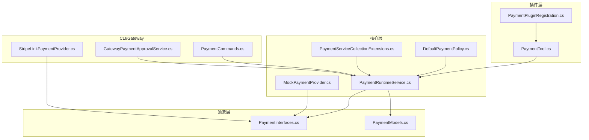
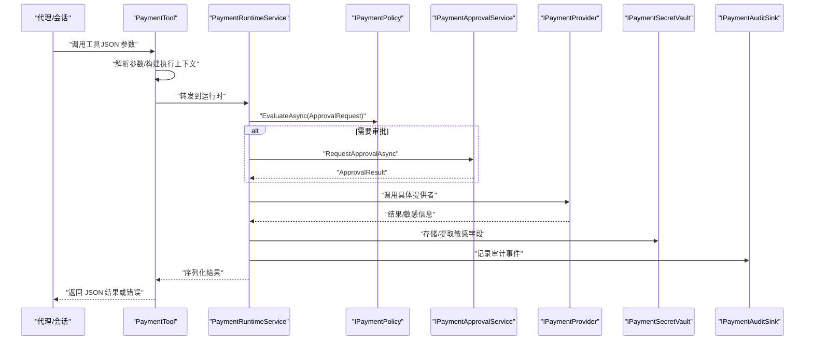
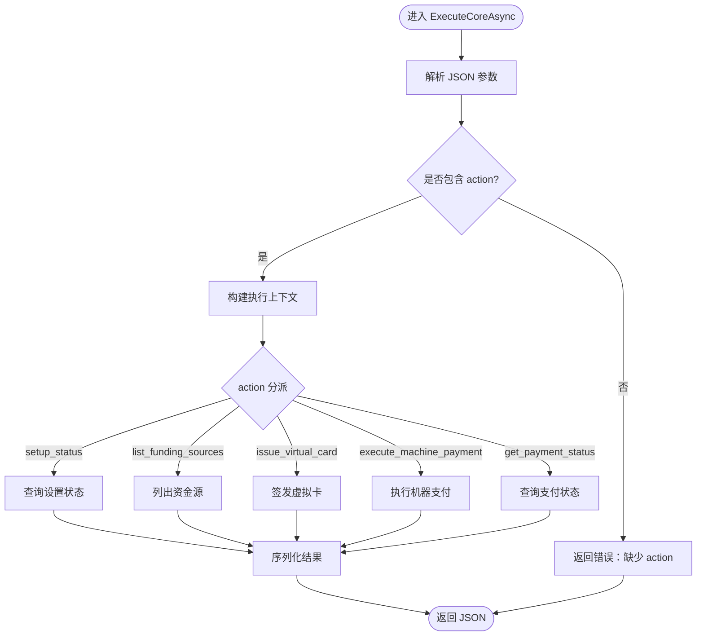
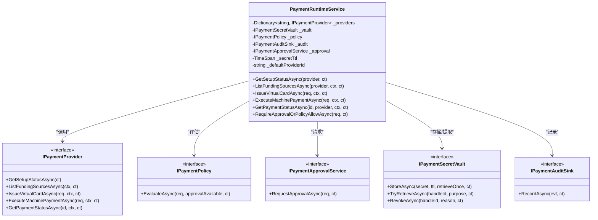
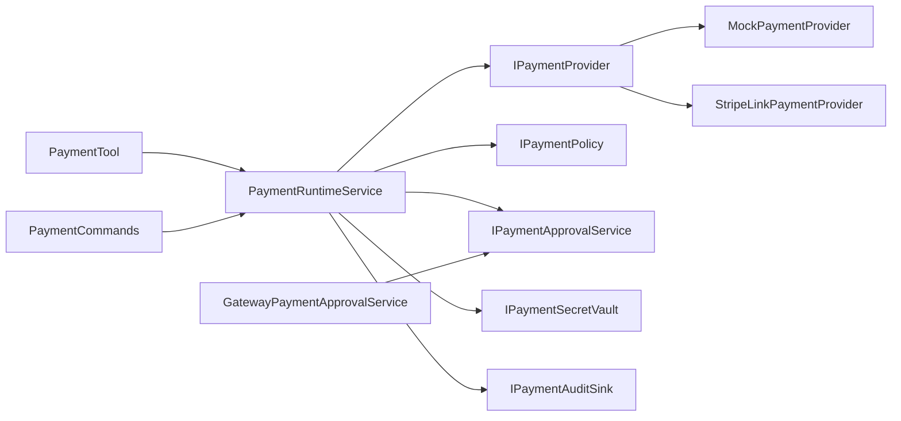

# 支付工具集成

<cite>
**本文引用的文件**   
- [PaymentTool.cs](file://src/OpenClaw.Plugins.Payment/PaymentTool.cs)
- [PaymentPluginRegistration.cs](file://src/OpenClaw.Plugins.Payment/PaymentPluginRegistration.cs)
- [PaymentInterfaces.cs](file://src/OpenClaw.Payments.Abstractions/PaymentInterfaces.cs)
- [PaymentModels.cs](file://src/OpenClaw.Payments.Abstractions/PaymentModels.cs)
- [PaymentRuntimeService.cs](file://src/OpenClaw.Payments.Core/PaymentRuntimeService.cs)
- [MockPaymentProvider.cs](file://src/OpenClaw.Payments.Core/MockPaymentProvider.cs)
- [DefaultPaymentPolicy.cs](file://src/OpenClaw.Payments.Core/DefaultPaymentPolicy.cs)
- [PaymentServiceCollectionExtensions.cs](file://src/OpenClaw.Payments.Core/PaymentServiceCollectionExtensions.cs)
- [StripeLinkPaymentProvider.cs](file://src/OpenClaw.Payments.StripeLink/StripeLinkPaymentProvider.cs)
- [PaymentCommands.cs](file://src/OpenClaw.Cli/PaymentCommands.cs)
- [GatewayPaymentApprovalService.cs](file://src/OpenClaw.Gateway/GatewayPaymentApprovalService.cs)
</cite>

## 目录
1. [简介](#简介)
2. [项目结构](#项目结构)
3. [核心组件](#核心组件)
4. [架构总览](#架构总览)
5. [组件详解](#组件详解)
6. [依赖关系分析](#依赖关系分析)
7. [性能考量](#性能考量)
8. [故障排查指南](#故障排查指南)
9. [结论](#结论)
10. [附录](#附录)

## 简介
本文件面向支付工具集成场景，系统性阐述 PaymentTool 的工具实现、参数定义、执行逻辑与安全策略；详述工具注册机制、插件集成方式与生命周期管理；文档化支付工具的输入输出格式、错误处理与返回值规范；解释工具在代理运行时中的调用方式、上下文传递与权限控制；并提供工具开发指南、API 参考、使用示例、配置选项、性能优化建议与调试方法，以及与工具治理系统的集成、审批流程与审计要求。

## 项目结构
支付能力由“抽象层（Abstractions）—核心层（Core）—插件层（Plugins）—CLI/Gateway 集成”构成，形成清晰的分层与职责边界：
- 抽象层：定义支付接口、模型与 JSON 序列化上下文
- 核心层：运行时服务、策略、默认提供者与 DI 扩展
- 插件层：原生工具实现与工厂
- CLI/Gateway：命令行与网关侧的审批与调用桥接

图表来源
- [PaymentTool.cs:1-181](file://src/OpenClaw.Plugins.Payment/PaymentTool.cs#L1-L181)
- [PaymentPluginRegistration.cs:1-14](file://src/OpenClaw.Plugins.Payment/PaymentPluginRegistration.cs#L1-L14)
- [PaymentInterfaces.cs:1-60](file://src/OpenClaw.Payments.Abstractions/PaymentInterfaces.cs#L1-L60)
- [PaymentModels.cs:1-400](file://src/OpenClaw.Payments.Abstractions/PaymentModels.cs#L1-L400)
- [PaymentRuntimeService.cs:1-433](file://src/OpenClaw.Payments.Core/PaymentRuntimeService.cs#L1-L433)
- [DefaultPaymentPolicy.cs:1-60](file://src/OpenClaw.Payments.Core/DefaultPaymentPolicy.cs#L1-L60)
- [MockPaymentProvider.cs:1-165](file://src/OpenClaw.Payments.Core/MockPaymentProvider.cs#L1-L165)
- [PaymentServiceCollectionExtensions.cs:1-43](file://src/OpenClaw.Payments.Core/PaymentServiceCollectionExtensions.cs#L1-L43)
- [PaymentCommands.cs:1-206](file://src/OpenClaw.Cli/PaymentCommands.cs#L1-L206)
- [GatewayPaymentApprovalService.cs:1-104](file://src/OpenClaw.Gateway/GatewayPaymentApprovalService.cs#L1-L104)
- [StripeLinkPaymentProvider.cs:1-286](file://src/OpenClaw.Payments.StripeLink/StripeLinkPaymentProvider.cs#L1-L286)

章节来源
- [PaymentTool.cs:1-181](file://src/OpenClaw.Plugins.Payment/PaymentTool.cs#L1-L181)
- [PaymentPluginRegistration.cs:1-14](file://src/OpenClaw.Plugins.Payment/PaymentPluginRegistration.cs#L1-L14)
- [PaymentInterfaces.cs:1-60](file://src/OpenClaw.Payments.Abstractions/PaymentInterfaces.cs#L1-L60)
- [PaymentModels.cs:1-400](file://src/OpenClaw.Payments.Abstractions/PaymentModels.cs#L1-L400)
- [PaymentRuntimeService.cs:1-433](file://src/OpenClaw.Payments.Core/PaymentRuntimeService.cs#L1-L433)
- [DefaultPaymentPolicy.cs:1-60](file://src/OpenClaw.Payments.Core/DefaultPaymentPolicy.cs#L1-L60)
- [MockPaymentProvider.cs:1-165](file://src/OpenClaw.Payments.Core/MockPaymentProvider.cs#L1-L165)
- [PaymentServiceCollectionExtensions.cs:1-43](file://src/OpenClaw.Payments.Core/PaymentServiceCollectionExtensions.cs#L1-L43)
- [PaymentCommands.cs:1-206](file://src/OpenClaw.Cli/PaymentCommands.cs#L1-L206)
- [GatewayPaymentApprovalService.cs:1-104](file://src/OpenClaw.Gateway/GatewayPaymentApprovalService.cs#L1-L104)
- [StripeLinkPaymentProvider.cs:1-286](file://src/OpenClaw.Payments.StripeLink/StripeLinkPaymentProvider.cs#L1-L286)

## 核心组件
- 工具实现：PaymentTool 实现 IToolWithContext，负责解析参数、构建执行上下文、路由到 PaymentRuntimeService 并序列化结果
- 运行时服务：PaymentRuntimeService 负责策略评估、审批请求、调用具体提供者、审计记录与密钥保管
- 提供者接口与模型：IPaymentProvider 定义统一能力；PaymentModels 定义环境、动作、资金源、虚拟卡、机器支付、状态等数据模型
- 默认策略：DefaultPaymentPolicy 基于环境与金额阈值进行策略判定
- 注册与扩展：通过 PaymentServiceCollectionExtensions 注册核心服务；PaymentPluginRegistration 工厂创建 PaymentTool
- CLI 与网关：PaymentCommands 提供命令行入口；GatewayPaymentApprovalService 将支付审批接入工具治理

章节来源
- [PaymentTool.cs:8-181](file://src/OpenClaw.Plugins.Payment/PaymentTool.cs#L8-L181)
- [PaymentRuntimeService.cs:5-433](file://src/OpenClaw.Payments.Core/PaymentRuntimeService.cs#L5-L433)
- [PaymentInterfaces.cs:3-60](file://src/OpenClaw.Payments.Abstractions/PaymentInterfaces.cs#L3-L60)
- [PaymentModels.cs:6-400](file://src/OpenClaw.Payments.Abstractions/PaymentModels.cs#L6-L400)
- [DefaultPaymentPolicy.cs:5-60](file://src/OpenClaw.Payments.Core/DefaultPaymentPolicy.cs#L5-L60)
- [PaymentServiceCollectionExtensions.cs:8-43](file://src/OpenClaw.Payments.Core/PaymentServiceCollectionExtensions.cs#L8-L43)
- [PaymentPluginRegistration.cs:6-14](file://src/OpenClaw.Plugins.Payment/PaymentPluginRegistration.cs#L6-L14)
- [PaymentCommands.cs:6-206](file://src/OpenClaw.Cli/PaymentCommands.cs#L6-L206)
- [GatewayPaymentApprovalService.cs:8-104](file://src/OpenClaw.Gateway/GatewayPaymentApprovalService.cs#L8-L104)

## 架构总览
支付工具在代理运行时中以“工具调用 → 上下文构建 → 策略评估 → 审批决策 → 提供者执行 → 审计记录”的闭环工作流运行。

图表来源
- [PaymentTool.cs:52-104](file://src/OpenClaw.Plugins.Payment/PaymentTool.cs#L52-L104)
- [PaymentRuntimeService.cs:269-334](file://src/OpenClaw.Payments.Core/PaymentRuntimeService.cs#L269-L334)
- [DefaultPaymentPolicy.cs:21-51](file://src/OpenClaw.Payments.Core/DefaultPaymentPolicy.cs#L21-L51)
- [GatewayPaymentApprovalService.cs:27-102](file://src/OpenClaw.Gateway/GatewayPaymentApprovalService.cs#L27-L102)
- [PaymentInterfaces.cs:3-60](file://src/OpenClaw.Payments.Abstractions/PaymentInterfaces.cs#L3-L60)

## 组件详解

### PaymentTool：工具实现与参数定义
- 名称与描述：工具名为固定标识，描述强调“设置状态、资金源列表、虚拟卡签发、机器支付、状态查询”，且结果不包含原始卡号或授权密钥
- 参数模式：通过 JSON Schema 定义 action 必填，支持 provider、environment、funding_source_id、merchant、merchant_url、amount_minor、currency、purpose、valid_minutes、payment_id、resource_url、challenge_id、protocol 等字段
- 执行逻辑：
  - 解析 JSON，读取 action
  - 构建 PaymentExecutionContext（携带会话、通道、发送者、关联 ID、环境）
  - 分派到不同动作：setup_status、list_funding_sources、issue_virtual_card、execute_machine_payment、get_payment_status
  - 使用强类型 JSON 上下文序列化结果；异常映射为标准化错误对象（含错误码）

图表来源
- [PaymentTool.cs:58-104](file://src/OpenClaw.Plugins.Payment/PaymentTool.cs#L58-L104)
- [PaymentTool.cs:26-50](file://src/OpenClaw.Plugins.Payment/PaymentTool.cs#L26-L50)

章节来源
- [PaymentTool.cs:8-181](file://src/OpenClaw.Plugins.Payment/PaymentTool.cs#L8-L181)

### PaymentRuntimeService：运行时与策略/审批/审计
- 依赖注入：提供者集合、密钥保险库、策略、审计、可选审批服务、默认提供者 ID、密钥 TTL
- 动作实现：
  - IssueVirtualCardAsync：校验请求、构建审批请求、策略评估/审批、调用提供者、存储密钥、记录审计
  - ExecuteMachinePaymentAsync：校验请求、构建审批请求、策略评估/审批、调用提供者、存储一次性授权密钥、记录审计
  - GetPaymentStatusAsync：调用提供者并记录审计
  - ResolveSecretFieldForApprovedBoundaryAsync：边界场景下的密钥字段替换（带审批）
- 审批与策略：
  - RequireApprovalOrPolicyAllowAsync：先策略评估，再根据可用性决定直接允许、CLI 确认或调用审批服务
  - 记录丰富审计事件，覆盖批准请求、策略拒绝、审批通过/拒绝、操作尝试与完成/失败
- 环境与上下文归一化：NormalizeContext 将环境规范化

图表来源
- [PaymentRuntimeService.cs:5-433](file://src/OpenClaw.Payments.Core/PaymentRuntimeService.cs#L5-L433)
- [PaymentInterfaces.cs:3-60](file://src/OpenClaw.Payments.Abstractions/PaymentInterfaces.cs#L3-L60)

章节来源
- [PaymentRuntimeService.cs:5-433](file://src/OpenClaw.Payments.Core/PaymentRuntimeService.cs#L5-L433)

### 模型与接口：环境、动作、资金源、虚拟卡、机器支付、状态
- 环境与动作：提供常量与归一化工具（test/live），动作枚举（setup_status、list_funding_sources、issue_virtual_card、execute_machine_payment、get_payment_status、browser_sentinel_fill）
- 数据模型：PaymentSetupStatus、FundingSource、VirtualCardRequest/Handle/IssueResult、MachinePaymentChallenge/Request/Result/ProviderResult、PaymentStatus、ApprovalRequest/Result、PaymentExecutionContext、PaymentAuditEvent、PaymentSecret 及其 JSON 上下文
- 安全模型：PaymentSecret 支持按字段解析与清理；提供 JSON 转换器禁止反序列化/序列化，避免误用

章节来源
- [PaymentModels.cs:6-400](file://src/OpenClaw.Payments.Abstractions/PaymentModels.cs#L6-L400)

### 默认策略与提供者
- DefaultPaymentPolicy：支持测试免审、限额控制、无审批服务时的限制策略
- MockPaymentProvider：提供确定性行为的本地模拟，便于开发与测试
- StripeLinkPaymentProvider：通过 CLI 与外部系统交互，解析标准 JSON 输出

章节来源
- [DefaultPaymentPolicy.cs:5-60](file://src/OpenClaw.Payments.Core/DefaultPaymentPolicy.cs#L5-L60)
- [MockPaymentProvider.cs:6-165](file://src/OpenClaw.Payments.Core/MockPaymentProvider.cs#L6-L165)
- [StripeLinkPaymentProvider.cs:6-286](file://src/OpenClaw.Payments.StripeLink/StripeLinkPaymentProvider.cs#L6-L286)

### 工具注册与生命周期
- PaymentPluginRegistration：工厂方法创建 PaymentTool，注入 PaymentRuntimeService、默认提供者 ID、环境
- PaymentServiceCollectionExtensions：注册核心服务（策略、审计、密钥保险库、运行时、哨兵替换服务），并可配置默认提供者、环境、密钥 TTL、策略开关与最大限额

章节来源
- [PaymentPluginRegistration.cs:6-14](file://src/OpenClaw.Plugins.Payment/PaymentPluginRegistration.cs#L6-L14)
- [PaymentServiceCollectionExtensions.cs:8-43](file://src/OpenClaw.Payments.Core/PaymentServiceCollectionExtensions.cs#L8-L43)

### CLI 与网关：调用方式、上下文传递、权限控制
- PaymentCommands：命令行入口，支持 setup、funding list、virtual-card issue、execute、status；自动解析 --environment/--test/--yes/--json 等；对 live 操作强制 --yes
- GatewayPaymentApprovalService：将支付审批接入工具治理，构造 ApprovalRequest，等待 ToolApprovalService 决策，并记录审计与治理账本

章节来源
- [PaymentCommands.cs:6-206](file://src/OpenClaw.Cli/PaymentCommands.cs#L6-L206)
- [GatewayPaymentApprovalService.cs:8-104](file://src/OpenClaw.Gateway/GatewayPaymentApprovalService.cs#L8-L104)

## 依赖关系分析
- PaymentTool 依赖 PaymentRuntimeService 与 PaymentJsonContext
- PaymentRuntimeService 依赖 IPaymentProvider、IPaymentPolicy、IPaymentApprovalService、IPaymentSecretVault、IPaymentAuditSink
- 提供者实现（Mock/StripeLink）实现 IPaymentProvider
- CLI 与网关通过 HTTP 客户端与运行时交互，审批通过网关审批服务

图表来源
- [PaymentTool.cs:10-181](file://src/OpenClaw.Plugins.Payment/PaymentTool.cs#L10-L181)
- [PaymentRuntimeService.cs:7-433](file://src/OpenClaw.Payments.Core/PaymentRuntimeService.cs#L7-L433)
- [MockPaymentProvider.cs:6-165](file://src/OpenClaw.Payments.Core/MockPaymentProvider.cs#L6-L165)
- [StripeLinkPaymentProvider.cs:6-286](file://src/OpenClaw.Payments.StripeLink/StripeLinkPaymentProvider.cs#L6-L286)
- [PaymentCommands.cs:107-112](file://src/OpenClaw.Cli/PaymentCommands.cs#L107-L112)
- [GatewayPaymentApprovalService.cs:15-25](file://src/OpenClaw.Gateway/GatewayPaymentApprovalService.cs#L15-L25)

章节来源
- [PaymentTool.cs:10-181](file://src/OpenClaw.Plugins.Payment/PaymentTool.cs#L10-L181)
- [PaymentRuntimeService.cs:7-433](file://src/OpenClaw.Payments.Core/PaymentRuntimeService.cs#L7-L433)
- [MockPaymentProvider.cs:6-165](file://src/OpenClaw.Payments.Core/MockPaymentProvider.cs#L6-L165)
- [StripeLinkPaymentProvider.cs:6-286](file://src/OpenClaw.Payments.StripeLink/StripeLinkPaymentProvider.cs#L6-L286)
- [PaymentCommands.cs:107-112](file://src/OpenClaw.Cli/PaymentCommands.cs#L107-L112)
- [GatewayPaymentApprovalService.cs:15-25](file://src/OpenClaw.Gateway/GatewayPaymentApprovalService.cs#L15-L25)

## 性能考量
- 异步优先：所有关键路径采用 ValueTask/async，避免阻塞
- 最小序列化开销：使用强类型 JSON 上下文，减少反射与装箱
- 审计与策略前置：在调用提供者前完成策略与审批，减少无效外部调用
- 密钥 TTL 优化：按有效期动态调整密钥保存时间，降低冗余存储
- 环境归一化：统一环境参数，避免重复判断

## 故障排查指南
- 参数错误：工具内部对缺失字段、非法数值抛出错误并返回标准化错误对象
- 策略拒绝：当策略拒绝或审批未通过时，抛出特定异常并记录审计事件
- 外部提供者失败：提供者实现捕获非零退出码并抛出异常，确保上层可观测
- 审计追踪：所有关键事件均有审计记录，便于回溯与合规检查

章节来源
- [PaymentTool.cs:88-104](file://src/OpenClaw.Plugins.Payment/PaymentTool.cs#L88-L104)
- [PaymentRuntimeService.cs:269-334](file://src/OpenClaw.Payments.Core/PaymentRuntimeService.cs#L269-L334)
- [StripeLinkPaymentProvider.cs:79-138](file://src/OpenClaw.Payments.StripeLink/StripeLinkPaymentProvider.cs#L79-L138)

## 结论
该支付工具集成以清晰的分层设计与严格的策略/审批/审计闭环为核心，既满足开发测试需求（Mock 提供者），也支持生产级集成（Stripe Link）。通过统一的工具接口与运行时服务，实现了跨提供者的可插拔能力与一致的安全与可观测性。

## 附录

### 工具 API 参考
- 工具名称：payment
- 参数（JSON Schema 关键字段）
  - action：必填，取值范围见动作枚举
  - provider：可选，默认提供者 ID
  - environment：可选，test/live
  - 其他字段详见参数模式定义
- 返回值
  - 成功：对应动作的结果对象（如设置状态、资金源列表、虚拟卡句柄、机器支付结果、支付状态）
  - 错误：包含 status、code、message 的错误对象

章节来源
- [PaymentTool.cs:26-50](file://src/OpenClaw.Plugins.Payment/PaymentTool.cs#L26-L50)
- [PaymentModels.cs:48-56](file://src/OpenClaw.Payments.Abstractions/PaymentModels.cs#L48-L56)

### 使用示例（基于 CLI）
- 查询设置状态：openclaw payment setup [--provider <id>] [--json]
- 列出资金源：openclaw payment funding list [--provider <id>] [--test|--environment live] [--json]
- 签发虚拟卡：openclaw payment virtual-card issue --merchant <name> --amount-minor <n> [--currency USD] [--funding-source <id>] [--provider <id>] [--test|--environment live] [--yes] [--json]
- 执行机器支付：openclaw payment execute --amount-minor <n> [--merchant <name>] [--resource-url <url>] [--currency USD] [--provider <id>] [--test|--environment live] [--yes] [--json]
- 查询支付状态：openclaw payment status --id <payment-or-handle-id> [--provider <id>] [--json]

章节来源
- [PaymentCommands.cs:186-204](file://src/OpenClaw.Cli/PaymentCommands.cs#L186-L204)

### 配置选项
- DI 注册（核心）
  - defaultProviderId：默认提供者 ID
  - environment：默认环境（test/live）
  - secretTtl：密钥默认 TTL
  - allowTestModeWithoutApproval：测试模式是否免审
  - denyLiveWithoutApprovalService：无审批服务时是否拒绝
  - maxLiveAmountMinor：最大限额（分）
  - mockProviderId、mockFundingDisplay：Mock 提供者显示名
- CLI 环境变量
  - OPENCLAW_BASE_URL：默认网关地址
  - OPENCLAW_AUTH_TOKEN：认证令牌

章节来源
- [PaymentServiceCollectionExtensions.cs:10-41](file://src/OpenClaw.Payments.Core/PaymentServiceCollectionExtensions.cs#L10-L41)
- [PaymentCommands.cs:8-11](file://src/OpenClaw.Cli/PaymentCommands.cs#L8-L11)

### 开发指南
- 新增提供者：实现 IPaymentProvider 接口并在 DI 中注册
- 自定义策略：实现 IPaymentPolicy 并替换默认策略
- 审批集成：实现 IPaymentApprovalService 或复用网关审批服务
- 安全注意：始终使用 PaymentSecret 字段解析与清理，避免直接序列化/反序列化

章节来源
- [PaymentInterfaces.cs:3-60](file://src/OpenClaw.Payments.Abstractions/PaymentInterfaces.cs#L3-L60)
- [PaymentRuntimeService.cs:269-334](file://src/OpenClaw.Payments.Core/PaymentRuntimeService.cs#L269-L334)
- [GatewayPaymentApprovalService.cs:27-102](file://src/OpenClaw.Gateway/GatewayPaymentApprovalService.cs#L27-L102)

### 与工具治理系统的集成
- 审批流程：通过 GatewayPaymentApprovalService 将支付审批纳入工具治理，支持超时、审计与治理账本记录
- 审计要求：运行时记录丰富的审计事件，覆盖策略、审批、操作尝试与完成/失败

章节来源
- [GatewayPaymentApprovalService.cs:27-102](file://src/OpenClaw.Gateway/GatewayPaymentApprovalService.cs#L27-L102)
- [PaymentRuntimeService.cs:84-113](file://src/OpenClaw.Payments.Core/PaymentRuntimeService.cs#L84-L113)
- [PaymentRuntimeService.cs:135-175](file://src/OpenClaw.Payments.Core/PaymentRuntimeService.cs#L135-L175)
- [PaymentRuntimeService.cs:187-198](file://src/OpenClaw.Payments.Core/PaymentRuntimeService.cs#L187-L198)