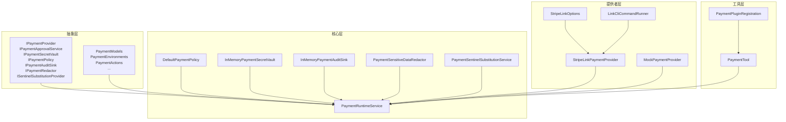
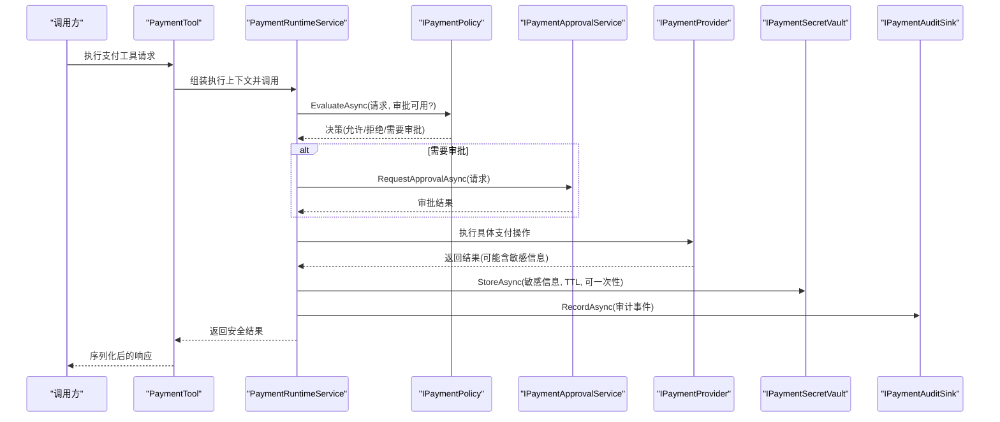
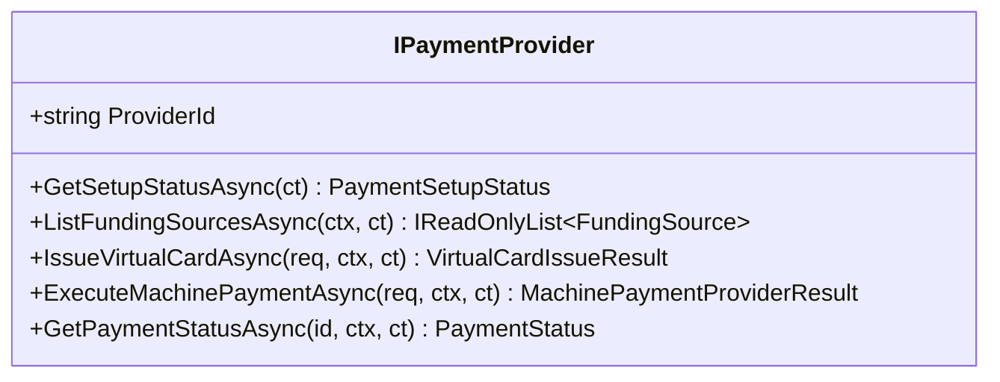
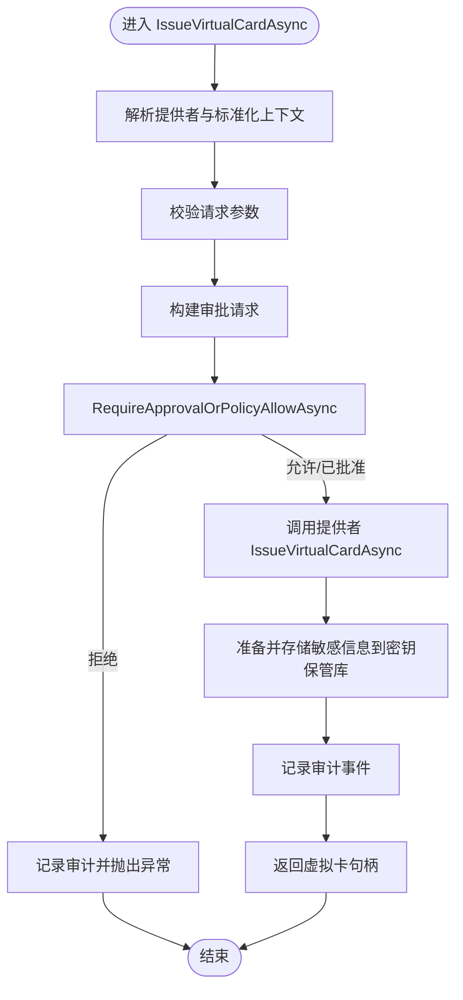
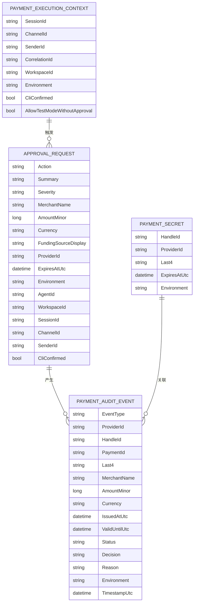
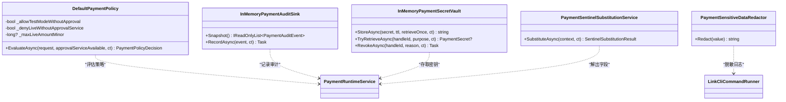
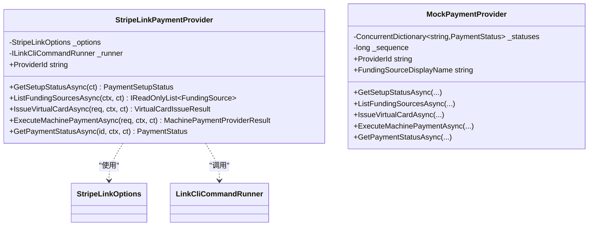
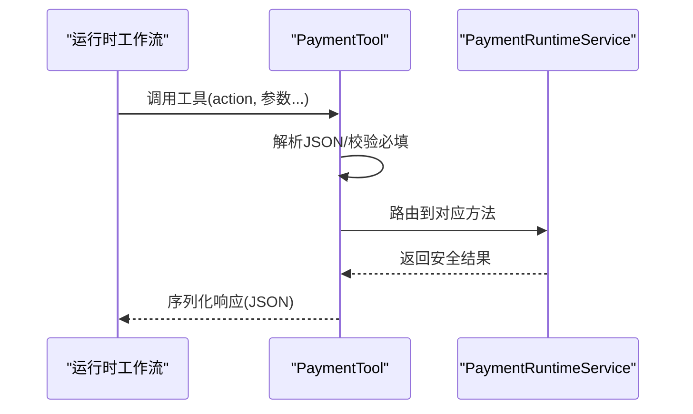
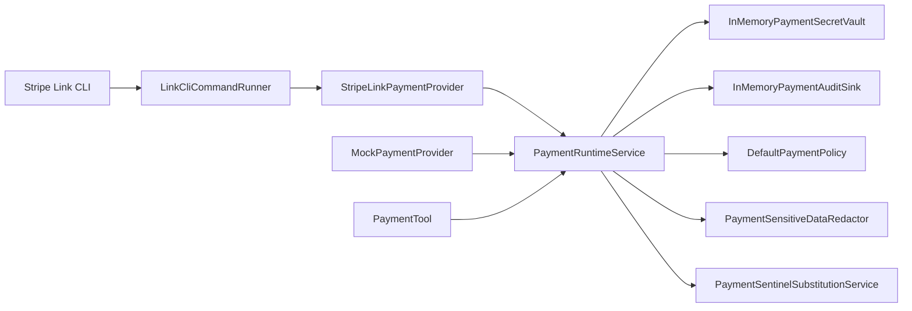

# 支付架构设计

<cite>
**本文档引用的文件**
- [PaymentInterfaces.cs](file://src/OpenClaw.Payments.Abstractions/PaymentInterfaces.cs)
- [PaymentModels.cs](file://src/OpenClaw.Payments.Abstractions/PaymentModels.cs)
- [PaymentRuntimeService.cs](file://src/OpenClaw.Payments.Core/PaymentRuntimeService.cs)
- [PaymentServiceCollectionExtensions.cs](file://src/OpenClaw.Payments.Core/PaymentServiceCollectionExtensions.cs)
- [DefaultPaymentPolicy.cs](file://src/OpenClaw.Payments.Core/DefaultPaymentPolicy.cs)
- [MockPaymentProvider.cs](file://src/OpenClaw.Payments.Core/MockPaymentProvider.cs)
- [InMemoryPaymentSecretVault.cs](file://src/OpenClaw.Payments.Core/InMemoryPaymentSecretVault.cs)
- [PaymentAuditSinks.cs](file://src/OpenClaw.Payments.Core/PaymentAuditSinks.cs)
- [PaymentSensitiveDataRedactor.cs](file://src/OpenClaw.Payments.Core/PaymentSensitiveDataRedactor.cs)
- [PaymentSentinelSubstitutionService.cs](file://src/OpenClaw.Payments.Core/PaymentSentinelSubstitutionService.cs)
- [StripeLinkPaymentProvider.cs](file://src/OpenClaw.Payments.StripeLink/StripeLinkPaymentProvider.cs)
- [StripeLinkOptions.cs](file://src/OpenClaw.Payments.StripeLink/StripeLinkOptions.cs)
- [LinkCliCommandRunner.cs](file://src/OpenClaw.Payments.StripeLink/LinkCliCommandRunner.cs)
- [PaymentTool.cs](file://src/OpenClaw.Plugins.Payment/PaymentTool.cs)
- [PaymentPluginRegistration.cs](file://src/OpenClaw.Plugins.Payment/PaymentPluginRegistration.cs)
</cite>

## 目录
1. [引言](#引言)
2. [项目结构](#项目结构)
3. [核心组件](#核心组件)
4. [架构总览](#架构总览)
5. [详细组件分析](#详细组件分析)
6. [依赖分析](#依赖分析)
7. [性能考虑](#性能考虑)
8. [故障排除指南](#故障排除指南)
9. [结论](#结论)
10. [附录](#附录)

## 引言
本文件系统性阐述支付架构的设计与实现，覆盖整体架构、核心接口、服务注册与扩展点、分层设计与依赖注入、配置管理、生命周期与错误处理、性能优化以及未来扩展方向。重点围绕以下目标展开：
- 明确支付系统的边界与职责分离（抽象层、核心运行时、具体提供者、工具集成）。
- 解释 IPaymentProvider 接口的设计理念与契约。
- 描述 PaymentRuntimeService 的服务架构与控制流。
- 文档化支付模型的数据结构与序列化上下文。
- 总结策略与安全扩展点（策略评估、审批、审计、敏感数据脱敏、哨兵替换）。

## 项目结构
支付子系统由三层构成：
- 抽象层：定义支付领域接口与数据模型，确保上层不依赖具体实现。
- 核心层：提供运行时服务、策略、审计、密钥保管库、哨兵替换等通用能力。
- 提供者层：具体支付提供商实现（如 Stripe Link），通过 CLI 集成真实支付能力。
- 工具层：将支付能力以插件工具形式暴露给运行时工作流。

**图表来源**
- [PaymentInterfaces.cs:1-60](file://src/OpenClaw.Payments.Abstractions/PaymentInterfaces.cs#L1-L60)
- [PaymentModels.cs:1-400](file://src/OpenClaw.Payments.Abstractions/PaymentModels.cs#L1-L400)
- [PaymentRuntimeService.cs:1-433](file://src/OpenClaw.Payments.Core/PaymentRuntimeService.cs#L1-L433)
- [DefaultPaymentPolicy.cs:1-60](file://src/OpenClaw.Payments.Core/DefaultPaymentPolicy.cs#L1-L60)
- [InMemoryPaymentSecretVault.cs:1-73](file://src/OpenClaw.Payments.Core/InMemoryPaymentSecretVault.cs#L1-L73)
- [PaymentAuditSinks.cs:1-19](file://src/OpenClaw.Payments.Core/PaymentAuditSinks.cs#L1-L19)
- [PaymentSensitiveDataRedactor.cs:1-88](file://src/OpenClaw.Payments.Core/PaymentSensitiveDataRedactor.cs#L1-L88)
- [PaymentSentinelSubstitutionService.cs:1-119](file://src/OpenClaw.Payments.Core/PaymentSentinelSubstitutionService.cs#L1-L119)
- [StripeLinkPaymentProvider.cs:1-286](file://src/OpenClaw.Payments.StripeLink/StripeLinkPaymentProvider.cs#L1-L286)
- [StripeLinkOptions.cs:1-12](file://src/OpenClaw.Payments.StripeLink/StripeLinkOptions.cs#L1-L12)
- [LinkCliCommandRunner.cs:1-170](file://src/OpenClaw.Payments.StripeLink/LinkCliCommandRunner.cs#L1-L170)
- [PaymentTool.cs:1-181](file://src/OpenClaw.Plugins.Payment/PaymentTool.cs#L1-L181)
- [PaymentPluginRegistration.cs:1-14](file://src/OpenClaw.Plugins.Payment/PaymentPluginRegistration.cs#L1-L14)

**章节来源**
- [PaymentInterfaces.cs:1-60](file://src/OpenClaw.Payments.Abstractions/PaymentInterfaces.cs#L1-L60)
- [PaymentModels.cs:1-400](file://src/OpenClaw.Payments.Abstractions/PaymentModels.cs#L1-L400)

## 核心组件
- 抽象接口族：定义支付能力边界与交互契约，包括提供者、审批、密钥保管、策略、审计、脱敏与哨兵替换。
- 数据模型：统一的环境、动作、决策、执行上下文、审计事件与敏感数据结构，并提供 JSON 序列化上下文。
- 运行时服务：聚合提供者、策略、审批、审计与密钥保管，协调业务流程并记录审计事件。
- 策略与安全：默认策略评估器、敏感数据脱敏器、哨兵替换服务、内存审计与密钥保管。
- 提供者实现：Mock 提供者用于测试与演示；Stripe Link 提供者通过 CLI 调用真实支付能力。
- 工具集成：将支付能力封装为可被运行时调用的工具，屏蔽底层细节。

**章节来源**
- [PaymentRuntimeService.cs:1-433](file://src/OpenClaw.Payments.Core/PaymentRuntimeService.cs#L1-L433)
- [DefaultPaymentPolicy.cs:1-60](file://src/OpenClaw.Payments.Core/DefaultPaymentPolicy.cs#L1-L60)
- [MockPaymentProvider.cs:1-165](file://src/OpenClaw.Payments.Core/MockPaymentProvider.cs#L1-L165)
- [StripeLinkPaymentProvider.cs:1-286](file://src/OpenClaw.Payments.StripeLink/StripeLinkPaymentProvider.cs#L1-L286)
- [PaymentTool.cs:1-181](file://src/OpenClaw.Plugins.Payment/PaymentTool.cs#L1-L181)

## 架构总览
支付架构采用“抽象-核心-提供者-工具”的分层设计，通过依赖注入在启动阶段完成服务注册与装配。运行时服务作为编排中心，负责：
- 选择提供者并标准化执行上下文。
- 基于策略与审批进行访问控制。
- 将敏感信息安全地存入密钥保管库并按需取出。
- 记录审计事件，支持后续合规与追踪。
- 通过哨兵替换服务在浏览器填充场景中按需解出受控字段。

**图表来源**
- [PaymentTool.cs:52-104](file://src/OpenClaw.Plugins.Payment/PaymentTool.cs#L52-L104)
- [PaymentRuntimeService.cs:269-334](file://src/OpenClaw.Payments.Core/PaymentRuntimeService.cs#L269-L334)
- [DefaultPaymentPolicy.cs:21-51](file://src/OpenClaw.Payments.Core/DefaultPaymentPolicy.cs#L21-L51)
- [StripeLinkPaymentProvider.cs:79-138](file://src/OpenClaw.Payments.StripeLink/StripeLinkPaymentProvider.cs#L79-L138)
- [InMemoryPaymentSecretVault.cs:18-54](file://src/OpenClaw.Payments.Core/InMemoryPaymentSecretVault.cs#L18-L54)
- [PaymentAuditSinks.cs:12-17](file://src/OpenClaw.Payments.Core/PaymentAuditSinks.cs#L12-L17)

## 详细组件分析

### IPaymentProvider 接口设计
- 设计理念：以最小必要方法集描述支付能力，包括设置状态查询、资金来源列表、虚拟卡签发、机器支付执行与支付状态查询。
- 关键约束：所有方法均返回异步值类型，便于在多提供者与外部系统间保持一致的并发模型。
- 扩展点：通过 ProviderId 标识提供者，支持多提供者并存与动态选择。

**图表来源**
- [PaymentInterfaces.cs:3-25](file://src/OpenClaw.Payments.Abstractions/PaymentInterfaces.cs#L3-L25)

**章节来源**
- [PaymentInterfaces.cs:3-25](file://src/OpenClaw.Payments.Abstractions/PaymentInterfaces.cs#L3-L25)

### PaymentRuntimeService 服务架构
- 职责边界：集中编排支付流程，协调策略、审批、提供者与审计。
- 依赖注入：构造函数注入提供者集合、密钥保管库、策略、审计与可选审批服务。
- 控制流：
  - 解析提供者与标准化执行上下文。
  - 对高风险操作（签发虚拟卡、机器支付）进行策略评估与审批。
  - 将敏感信息写入密钥保管库，按 TTL 与一次性策略管理。
  - 记录审计事件，保证可追溯性。
- 错误处理：对策略拒绝抛出专用异常；对 CLI 失败或解析失败进行包装与审计。

**图表来源**
- [PaymentRuntimeService.cs:46-114](file://src/OpenClaw.Payments.Core/PaymentRuntimeService.cs#L46-L114)

**章节来源**
- [PaymentRuntimeService.cs:1-433](file://src/OpenClaw.Payments.Core/PaymentRuntimeService.cs#L1-L433)

### 支付模型数据结构
- 环境与动作：统一的环境规范化、动作常量与决策种类，确保跨模块一致性。
- 执行上下文：携带会话、通道、发送者、关联 ID、工作区、环境与 CLI 确认标记。
- 审计事件：记录事件类型、提供者、金额、货币、状态、决策与时间戳。
- 敏感数据：PaymentSecret 支持字段级解析与一次性清除，避免明文泄露。
- 序列化：使用源生成的 JSON 上下文，减少运行时反射开销。

**图表来源**
- [PaymentModels.cs:235-245](file://src/OpenClaw.Payments.Abstractions/PaymentModels.cs#L235-L245)
- [PaymentModels.cs:207-225](file://src/OpenClaw.Payments.Abstractions/PaymentModels.cs#L207-L225)
- [PaymentModels.cs:280-362](file://src/OpenClaw.Payments.Abstractions/PaymentModels.cs#L280-L362)
- [PaymentModels.cs:247-264](file://src/OpenClaw.Payments.Abstractions/PaymentModels.cs#L247-L264)

**章节来源**
- [PaymentModels.cs:1-400](file://src/OpenClaw.Payments.Abstractions/PaymentModels.cs#L1-L400)

### 策略与安全扩展点
- 默认策略：根据环境、限额与审批可用性决定是否允许或需要审批。
- 审批服务：可选接口，支持交互式或 CLI 非交互式确认。
- 审计：内存审计队列，支持快照与异步记录。
- 密钥保管：内存实现，支持一次性取回与过期清理。
- 脱敏：正则识别卡号、CVV、授权头、令牌等敏感字段并替换。
- 哨兵替换：在浏览器填充场景中按需解出受控字段，严格审计与审批。

**图表来源**
- [DefaultPaymentPolicy.cs:5-59](file://src/OpenClaw.Payments.Core/DefaultPaymentPolicy.cs#L5-L59)
- [PaymentSensitiveDataRedactor.cs:8-87](file://src/OpenClaw.Payments.Core/PaymentSensitiveDataRedactor.cs#L8-L87)
- [PaymentAuditSinks.cs:6-18](file://src/OpenClaw.Payments.Core/PaymentAuditSinks.cs#L6-L18)
- [InMemoryPaymentSecretVault.cs:7-72](file://src/OpenClaw.Payments.Core/InMemoryPaymentSecretVault.cs#L7-L72)
- [PaymentSentinelSubstitutionService.cs:8-118](file://src/OpenClaw.Payments.Core/PaymentSentinelSubstitutionService.cs#L8-L118)
- [LinkCliCommandRunner.cs:26-169](file://src/OpenClaw.Payments.StripeLink/LinkCliCommandRunner.cs#L26-L169)

**章节来源**
- [DefaultPaymentPolicy.cs:1-60](file://src/OpenClaw.Payments.Core/DefaultPaymentPolicy.cs#L1-L60)
- [PaymentSensitiveDataRedactor.cs:1-88](file://src/OpenClaw.Payments.Core/PaymentSensitiveDataRedactor.cs#L1-L88)
- [PaymentAuditSinks.cs:1-19](file://src/OpenClaw.Payments.Core/PaymentAuditSinks.cs#L1-L19)
- [InMemoryPaymentSecretVault.cs:1-73](file://src/OpenClaw.Payments.Core/InMemoryPaymentSecretVault.cs#L1-L73)
- [PaymentSentinelSubstitutionService.cs:1-119](file://src/OpenClaw.Payments.Core/PaymentSentinelSubstitutionService.cs#L1-L119)
- [LinkCliCommandRunner.cs:1-170](file://src/OpenClaw.Payments.StripeLink/LinkCliCommandRunner.cs#L1-L170)

### 提供者实现：Stripe Link 与 Mock
- Stripe Link：通过 CLI 与外部系统交互，解析 JSON 输出并映射为内部模型；支持资金来源列表、虚拟卡签发、机器支付与状态查询。
- Mock：提供确定性行为，便于测试与演示，内置状态机模拟支付生命周期。

**图表来源**
- [StripeLinkPaymentProvider.cs:6-285](file://src/OpenClaw.Payments.StripeLink/StripeLinkPaymentProvider.cs#L6-L285)
- [StripeLinkOptions.cs:3-11](file://src/OpenClaw.Payments.StripeLink/StripeLinkOptions.cs#L3-L11)
- [LinkCliCommandRunner.cs:26-169](file://src/OpenClaw.Payments.StripeLink/LinkCliCommandRunner.cs#L26-L169)
- [MockPaymentProvider.cs:6-164](file://src/OpenClaw.Payments.Core/MockPaymentProvider.cs#L6-L164)

**章节来源**
- [StripeLinkPaymentProvider.cs:1-286](file://src/OpenClaw.Payments.StripeLink/StripeLinkPaymentProvider.cs#L1-L286)
- [MockPaymentProvider.cs:1-165](file://src/OpenClaw.Payments.Core/MockPaymentProvider.cs#L1-L165)
- [StripeLinkOptions.cs:1-12](file://src/OpenClaw.Payments.StripeLink/StripeLinkOptions.cs#L1-L12)
- [LinkCliCommandRunner.cs:1-170](file://src/OpenClaw.Payments.StripeLink/LinkCliCommandRunner.cs#L1-L170)

### 工具集成：PaymentTool
- 角色定位：将 PaymentRuntimeService 暴露为运行时工具，屏蔽内部复杂性。
- 参数模型：基于 JSON Schema 定义 action、provider、environment、资金来源、商户、金额、货币、有效期、支付 ID、资源 URL、挑战 ID、协议等。
- 执行流程：解析参数、组装执行上下文、路由到对应运行时方法、序列化安全输出、捕获策略拒绝、JSON/格式/参数异常并转换为标准错误响应。

**图表来源**
- [PaymentTool.cs:52-104](file://src/OpenClaw.Plugins.Payment/PaymentTool.cs#L52-L104)
- [PaymentRuntimeService.cs:37-199](file://src/OpenClaw.Payments.Core/PaymentRuntimeService.cs#L37-L199)

**章节来源**
- [PaymentTool.cs:1-181](file://src/OpenClaw.Plugins.Payment/PaymentTool.cs#L1-L181)
- [PaymentPluginRegistration.cs:1-14](file://src/OpenClaw.Plugins.Payment/PaymentPluginRegistration.cs#L1-L14)

## 依赖分析
- 分层耦合：抽象层与核心层低耦合，核心层通过接口依赖提供者与安全组件；提供者层与工具层独立于核心层。
- 服务注册：通过扩展方法集中注册密钥保管、审计、策略、默认提供者与运行时服务，支持自定义默认提供者与环境。
- 外部依赖：Stripe Link CLI 作为外部系统集成点，通过命令行进程运行与 JSON 输出解析。

**图表来源**
- [PaymentServiceCollectionExtensions.cs:10-41](file://src/OpenClaw.Payments.Core/PaymentServiceCollectionExtensions.cs#L10-L41)
- [StripeLinkPaymentProvider.cs:6-285](file://src/OpenClaw.Payments.StripeLink/StripeLinkPaymentProvider.cs#L6-L285)
- [LinkCliCommandRunner.cs:26-169](file://src/OpenClaw.Payments.StripeLink/LinkCliCommandRunner.cs#L26-L169)
- [PaymentRuntimeService.cs:5-33](file://src/OpenClaw.Payments.Core/PaymentRuntimeService.cs#L5-L33)
- [PaymentTool.cs:8-19](file://src/OpenClaw.Plugins.Payment/PaymentTool.cs#L8-L19)

**章节来源**
- [PaymentServiceCollectionExtensions.cs:1-43](file://src/OpenClaw.Payments.Core/PaymentServiceCollectionExtensions.cs#L1-L43)

## 性能考虑
- 异步与并发：接口与运行时均采用 ValueTask/async，避免阻塞线程，提升吞吐。
- 序列化优化：使用源生成 JSON 上下文，减少反射与装箱。
- 内存管理：密钥保管库采用并发字典与一次性取回，降低内存驻留；过期自动清理。
- CLI 调用：超时控制与日志脱敏，避免长时间阻塞与敏感信息泄露。
- 策略评估：轻量正则与常量时间判断，避免复杂计算。

[本节为通用性能建议，无需特定文件引用]

## 故障排除指南
- 策略拒绝：当策略拒绝时抛出专用异常，检查环境、限额与审批可用性配置。
- CLI 失败：查看 LinkCLI 运行结果与脱敏日志，确认可执行路径、工作目录与环境变量。
- 审计事件：通过内存审计快照定位失败事件与原因。
- 密钥取回：确认句柄存在、未过期且符合一次性策略；必要时撤销后重试。
- 工具参数：核对 action、金额、货币等必填项，避免 JSON/格式异常。

**章节来源**
- [PaymentRuntimeService.cs:269-334](file://src/OpenClaw.Payments.Core/PaymentRuntimeService.cs#L269-L334)
- [LinkCliCommandRunner.cs:36-114](file://src/OpenClaw.Payments.StripeLink/LinkCliCommandRunner.cs#L36-L114)
- [PaymentAuditSinks.cs:10-17](file://src/OpenClaw.Payments.Core/PaymentAuditSinks.cs#L10-L17)
- [InMemoryPaymentSecretVault.cs:34-62](file://src/OpenClaw.Payments.Core/InMemoryPaymentSecretVault.cs#L34-L62)
- [PaymentTool.cs:88-104](file://src/OpenClaw.Plugins.Payment/PaymentTool.cs#L88-L104)

## 结论
该支付架构通过清晰的分层与接口抽象，实现了可插拔、可审计、可扩展的支付能力。运行时服务承担编排职责，结合策略、审批、审计与密钥管理形成闭环。提供者层通过 CLI 与外部系统解耦，工具层将能力以统一方式暴露。未来可在以下方向演进：
- 多提供者负载均衡与故障转移。
- 审计与密钥保管的持久化实现。
- 更丰富的审批与治理策略。
- 浏览器填充场景的更细粒度权限控制。

[本节为总结性内容，无需特定文件引用]

## 附录
- 配置管理：通过服务注册扩展方法与选项对象（如 StripeLinkOptions）集中管理默认提供者、环境、TTL 与 CLI 行为。
- 生命周期：运行时服务在容器中单例注册，提供者与安全组件按需注入；工具在每次调用时解析参数并调用运行时。
- 错误处理：策略拒绝、CLI 失败、参数错误与 JSON 解析异常均有明确的错误码与消息，便于上层处理。

**章节来源**
- [PaymentServiceCollectionExtensions.cs:10-41](file://src/OpenClaw.Payments.Core/PaymentServiceCollectionExtensions.cs#L10-L41)
- [StripeLinkOptions.cs:3-11](file://src/OpenClaw.Payments.StripeLink/StripeLinkOptions.cs#L3-L11)
- [PaymentRuntimeService.cs:15-33](file://src/OpenClaw.Payments.Core/PaymentRuntimeService.cs#L15-L33)
- [PaymentTool.cs:52-104](file://src/OpenClaw.Plugins.Payment/PaymentTool.cs#L52-L104)