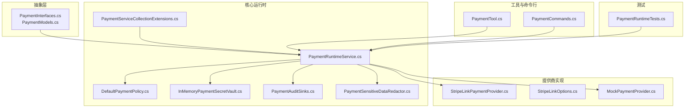
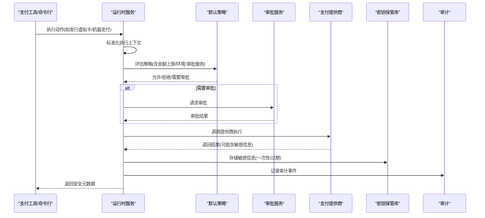
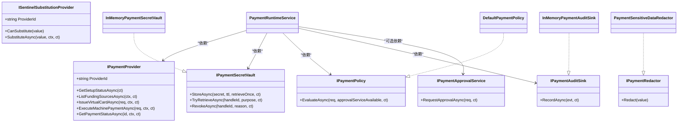
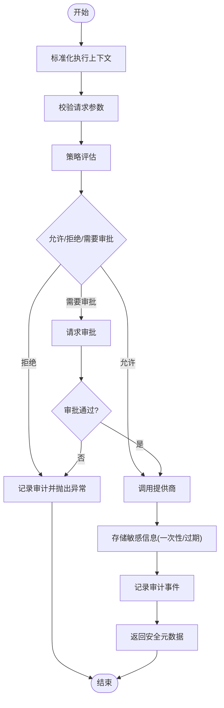
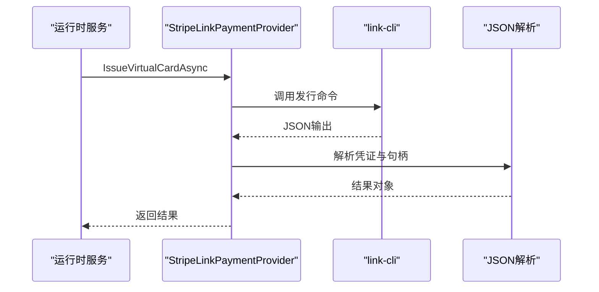
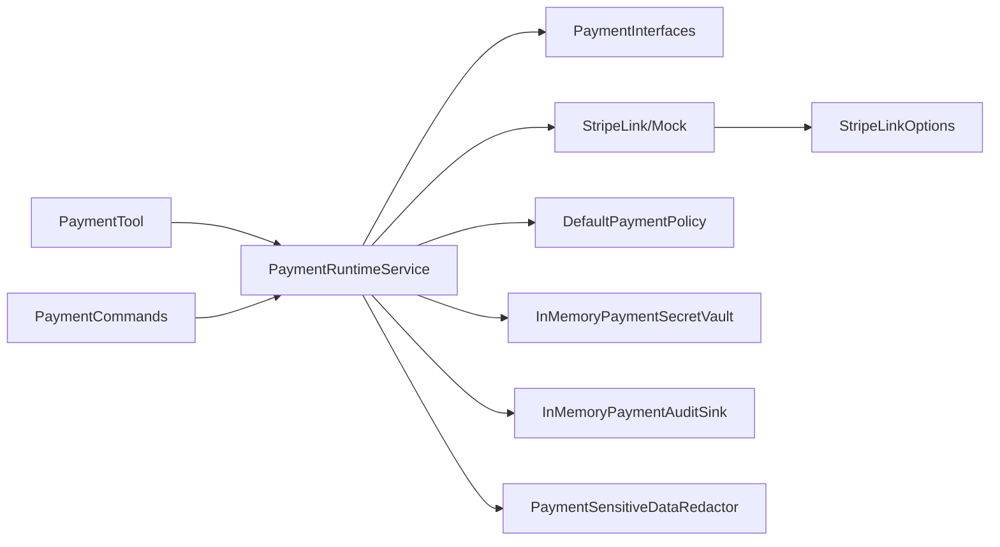

# 支付系统集成

<cite>
**本文档引用的文件**
- [PaymentInterfaces.cs](file://src/OpenClaw.Payments.Abstractions/PaymentInterfaces.cs)
- [PaymentModels.cs](file://src/OpenClaw.Payments.Abstractions/PaymentModels.cs)
- [PaymentRuntimeService.cs](file://src/OpenClaw.Payments.Core/PaymentRuntimeService.cs)
- [PaymentServiceCollectionExtensions.cs](file://src/OpenClaw.Payments.Core/PaymentServiceCollectionExtensions.cs)
- [DefaultPaymentPolicy.cs](file://src/OpenClaw.Payments.Core/DefaultPaymentPolicy.cs)
- [InMemoryPaymentSecretVault.cs](file://src/OpenClaw.Payments.Core/InMemoryPaymentSecretVault.cs)
- [MockPaymentProvider.cs](file://src/OpenClaw.Payments.Core/MockPaymentProvider.cs)
- [PaymentAuditSinks.cs](file://src/OpenClaw.Payments.Core/PaymentAuditSinks.cs)
- [PaymentSensitiveDataRedactor.cs](file://src/OpenClaw.Payments.Core/PaymentSensitiveDataRedactor.cs)
- [StripeLinkPaymentProvider.cs](file://src/OpenClaw.Payments.StripeLink/StripeLinkPaymentProvider.cs)
- [StripeLinkOptions.cs](file://src/OpenClaw.Payments.StripeLink/StripeLinkOptions.cs)
- [PaymentTool.cs](file://src/OpenClaw.Plugins.Payment/PaymentTool.cs)
- [PaymentCommands.cs](file://src/OpenClaw.Cli/PaymentCommands.cs)
- [PaymentRuntimeTests.cs](file://src/OpenClaw.Tests/PaymentRuntimeTests.cs)
</cite>

## 目录
1. [简介](#简介)
2. [项目结构](#项目结构)
3. [核心组件](#核心组件)
4. [架构总览](#架构总览)
5. [详细组件分析](#详细组件分析)
6. [依赖关系分析](#依赖关系分析)
7. [性能考虑](#性能考虑)
8. [故障排除指南](#故障排除指南)
9. [结论](#结论)
10. [附录](#附录)

## 简介
本文件为支付系统集成的技术文档，面向需要在代理运行时中集成支付能力的开发者与运维人员。文档涵盖支付架构设计、Stripe Link 集成、支付处理流程、安全存储机制、支付工具实现、审批流程、审计日志、接口设计与回调处理、状态同步、安全策略与合规要求、配置指南、测试方法、故障排除、开发示例、集成最佳实践以及性能优化建议。

## 项目结构
支付相关代码分布在多个命名空间与项目中：
- 抽象层：定义支付接口、模型与序列化上下文
- 核心运行时：统一调度、策略评估、审批、审计、密钥保管与敏感数据脱敏
- 提供商实现：Stripe Link CLI 集成与模拟提供商
- 工具与命令行：支付工具与 CLI 命令
- 测试：覆盖安全、策略、流程与边界条件

**图表来源**
- [PaymentInterfaces.cs:1-60](file://src/OpenClaw.Payments.Abstractions/PaymentInterfaces.cs#L1-L60)
- [PaymentModels.cs:1-400](file://src/OpenClaw.Payments.Abstractions/PaymentModels.cs#L1-L400)
- [PaymentRuntimeService.cs:1-433](file://src/OpenClaw.Payments.Core/PaymentRuntimeService.cs#L1-L433)
- [DefaultPaymentPolicy.cs:1-60](file://src/OpenClaw.Payments.Core/DefaultPaymentPolicy.cs#L1-L60)
- [InMemoryPaymentSecretVault.cs:1-73](file://src/OpenClaw.Payments.Core/InMemoryPaymentSecretVault.cs#L1-L73)
- [PaymentAuditSinks.cs:1-19](file://src/OpenClaw.Payments.Core/PaymentAuditSinks.cs#L1-L19)
- [PaymentSensitiveDataRedactor.cs:1-88](file://src/OpenClaw.Payments.Core/PaymentSensitiveDataRedactor.cs#L1-L88)
- [StripeLinkPaymentProvider.cs:1-286](file://src/OpenClaw.Payments.StripeLink/StripeLinkPaymentProvider.cs#L1-L286)
- [StripeLinkOptions.cs:1-12](file://src/OpenClaw.Payments.StripeLink/StripeLinkOptions.cs#L1-L12)
- [MockPaymentProvider.cs:1-165](file://src/OpenClaw.Payments.Core/MockPaymentProvider.cs#L1-L165)
- [PaymentTool.cs:1-181](file://src/OpenClaw.Plugins.Payment/PaymentTool.cs#L1-L181)
- [PaymentCommands.cs:1-206](file://src/OpenClaw.Cli/PaymentCommands.cs#L1-L206)
- [PaymentRuntimeTests.cs:1-415](file://src/OpenClaw.Tests/PaymentRuntimeTests.cs#L1-L415)

**章节来源**
- [PaymentInterfaces.cs:1-60](file://src/OpenClaw.Payments.Abstractions/PaymentInterfaces.cs#L1-L60)
- [PaymentModels.cs:1-400](file://src/OpenClaw.Payments.Abstractions/PaymentModels.cs#L1-L400)

## 核心组件
- 支付接口与模型：定义提供商、审批、密钥保管、策略、审计、敏感数据脱敏等抽象与数据结构
- 运行时服务：统一编排支付生命周期，执行策略评估、审批请求、密钥存储与检索、审计记录
- 默认策略：基于环境、金额上限、审批服务可用性进行决策
- 密钥保管：内存型密钥保管库，支持一次性取回、过期清理与撤销
- 审计：内存型审计事件队列，支持快照与异步记录
- 敏感数据脱敏：正则识别并替换卡号、CVV、授权令牌等敏感字段
- 提供商实现：Stripe Link CLI 适配器与模拟提供商
- 工具与命令行：支付工具与 CLI 命令封装，暴露统一动作接口

**章节来源**
- [PaymentRuntimeService.cs:1-433](file://src/OpenClaw.Payments.Core/PaymentRuntimeService.cs#L1-L433)
- [DefaultPaymentPolicy.cs:1-60](file://src/OpenClaw.Payments.Core/DefaultPaymentPolicy.cs#L1-L60)
- [InMemoryPaymentSecretVault.cs:1-73](file://src/OpenClaw.Payments.Core/InMemoryPaymentSecretVault.cs#L1-L73)
- [PaymentAuditSinks.cs:1-19](file://src/OpenClaw.Payments.Core/PaymentAuditSinks.cs#L1-L19)
- [PaymentSensitiveDataRedactor.cs:1-88](file://src/OpenClaw.Payments.Core/PaymentSensitiveDataRedactor.cs#L1-L88)
- [StripeLinkPaymentProvider.cs:1-286](file://src/OpenClaw.Payments.StripeLink/StripeLinkPaymentProvider.cs#L1-L286)
- [MockPaymentProvider.cs:1-165](file://src/OpenClaw.Payments.Core/MockPaymentProvider.cs#L1-L165)
- [PaymentTool.cs:1-181](file://src/OpenClaw.Plugins.Payment/PaymentTool.cs#L1-L181)
- [PaymentCommands.cs:1-206](file://src/OpenClaw.Cli/PaymentCommands.cs#L1-L206)

## 架构总览
支付系统采用“抽象接口 + 运行时编排 + 多提供商实现”的分层架构。运行时服务作为中枢，负责：
- 解析与标准化执行上下文（环境）
- 调用策略评估决定是否需要审批
- 触发审批或直接放行
- 调用具体提供商执行操作
- 将敏感信息存入密钥保管库并按需一次性取回
- 记录审计事件
- 对外输出安全元数据

**图表来源**
- [PaymentRuntimeService.cs:1-433](file://src/OpenClaw.Payments.Core/PaymentRuntimeService.cs#L1-L433)
- [DefaultPaymentPolicy.cs:1-60](file://src/OpenClaw.Payments.Core/DefaultPaymentPolicy.cs#L1-L60)
- [StripeLinkPaymentProvider.cs:1-286](file://src/OpenClaw.Payments.StripeLink/StripeLinkPaymentProvider.cs#L1-L286)
- [InMemoryPaymentSecretVault.cs:1-73](file://src/OpenClaw.Payments.Core/InMemoryPaymentSecretVault.cs#L1-L73)
- [PaymentAuditSinks.cs:1-19](file://src/OpenClaw.Payments.Core/PaymentAuditSinks.cs#L1-L19)

## 详细组件分析

### 支付接口与模型
- 接口族：提供商、审批、密钥保管、策略、审计、脱敏、哨兵替换
- 模型族：设置状态、资金来源、买家资料、虚拟卡请求/凭证、机器支付挑战/结果、支付状态、策略决策、审批请求/结果、执行上下文、审计事件、敏感数据字段枚举、JSON 序列化上下文

**图表来源**
- [PaymentInterfaces.cs:1-60](file://src/OpenClaw.Payments.Abstractions/PaymentInterfaces.cs#L1-L60)
- [PaymentRuntimeService.cs:1-433](file://src/OpenClaw.Payments.Core/PaymentRuntimeService.cs#L1-L433)
- [DefaultPaymentPolicy.cs:1-60](file://src/OpenClaw.Payments.Core/DefaultPaymentPolicy.cs#L1-L60)
- [InMemoryPaymentSecretVault.cs:1-73](file://src/OpenClaw.Payments.Core/InMemoryPaymentSecretVault.cs#L1-L73)
- [PaymentAuditSinks.cs:1-19](file://src/OpenClaw.Payments.Core/PaymentAuditSinks.cs#L1-L19)
- [PaymentSensitiveDataRedactor.cs:1-88](file://src/OpenClaw.Payments.Core/PaymentSensitiveDataRedactor.cs#L1-L88)

**章节来源**
- [PaymentInterfaces.cs:1-60](file://src/OpenClaw.Payments.Abstractions/PaymentInterfaces.cs#L1-L60)
- [PaymentModels.cs:1-400](file://src/OpenClaw.Payments.Abstractions/PaymentModels.cs#L1-L400)

### 运行时服务（PaymentRuntimeService）
- 统一入口：提供设置状态查询、资金来源列表、虚拟卡发行、机器支付执行、支付状态查询
- 策略与审批：先策略评估，再根据结果决定是否需要审批；支持 CLI 确认的免交互模式
- 安全存储：对提供商返回的敏感信息进行标准化后存入密钥保管库，支持一次性取回与过期清理
- 审计：对关键事件进行审计记录，包括批准请求/授予/拒绝、发行成功/失败、状态检查、哨兵替换尝试/批准/拒绝等
- 上下文标准化：确保环境规范化，避免跨环境误判

**图表来源**
- [PaymentRuntimeService.cs:1-433](file://src/OpenClaw.Payments.Core/PaymentRuntimeService.cs#L1-L433)

**章节来源**
- [PaymentRuntimeService.cs:1-433](file://src/OpenClaw.Payments.Core/PaymentRuntimeService.cs#L1-L433)

### 默认策略（DefaultPaymentPolicy）
- 环境校验：仅允许 test/live
- 金额上限：live 场景可配置最大金额，超限直接拒绝
- 测试放行：test 场景可配置是否无需审批直接放行
- live 审批：若未注册审批服务且策略禁止，则拒绝 live

**章节来源**
- [DefaultPaymentPolicy.cs:1-60](file://src/OpenClaw.Payments.Core/DefaultPaymentPolicy.cs#L1-L60)

### 密钥保管（InMemoryPaymentSecretVault）
- 存储：以 handleId 为键，保存 PaymentSecret 及过期时间、一次性取回标记
- 取回：支持一次性取回（取后即删）与持久取回（保留），自动清理过期项
- 撤销：按 handleId 清理并清空敏感内容

**章节来源**
- [InMemoryPaymentSecretVault.cs:1-73](file://src/OpenClaw.Payments.Core/InMemoryPaymentSecretVault.cs#L1-L73)

### 审计（InMemoryPaymentAuditSink）
- 内存队列：记录所有审计事件，支持快照读取
- 异步记录：不阻塞主流程

**章节来源**
- [PaymentAuditSinks.cs:1-19](file://src/OpenClaw.Payments.Core/PaymentAuditSinks.cs#L1-L19)

### 敏感数据脱敏（PaymentSensitiveDataRedactor）
- 正则识别：卡号候选、CVV 字段、授权头、JSON 字段、支付令牌
- Luhn 校验：过滤非真实卡号
- 替换策略：统一替换为占位符，避免泄露

**章节来源**
- [PaymentSensitiveDataRedactor.cs:1-88](file://src/OpenClaw.Payments.Core/PaymentSensitiveDataRedactor.cs#L1-L88)

### Stripe Link 提供商（StripeLinkPaymentProvider）
- CLI 集成：通过 link-cli 执行命令，解析 JSON 输出
- 设置状态：检测 CLI 是否可用与版本
- 资金来源：列出可用资金来源
- 虚拟卡：发行虚拟卡并返回凭证与句柄
- 机器支付：执行支付并返回结果与可选授权凭据
- 状态查询：查询支付状态

**图表来源**
- [StripeLinkPaymentProvider.cs:1-286](file://src/OpenClaw.Payments.StripeLink/StripeLinkPaymentProvider.cs#L1-L286)

**章节来源**
- [StripeLinkPaymentProvider.cs:1-286](file://src/OpenClaw.Payments.StripeLink/StripeLinkPaymentProvider.cs#L1-L286)
- [StripeLinkOptions.cs:1-12](file://src/OpenClaw.Payments.StripeLink/StripeLinkOptions.cs#L1-L12)

### 模拟提供商（MockPaymentProvider）
- 确定性行为：用于测试与演示，生成确定序号的支付 ID、状态
- 虚拟卡：返回固定资金来源显示名与模拟卡号
- 机器支付：返回完成状态与模拟授权凭据

**章节来源**
- [MockPaymentProvider.cs:1-165](file://src/OpenClaw.Payments.Core/MockPaymentProvider.cs#L1-L165)

### 支付工具（PaymentTool）
- 动作封装：统一暴露 setup_status、list_funding_sources、issue_virtual_card、execute_machine_payment、get_payment_status
- 参数校验：严格校验必填与数值范围
- 输出安全：仅返回安全元数据，不泄露原始敏感信息
- 上下文注入：从工具执行上下文提取会话、通道、发送者、关联 ID 等

**章节来源**
- [PaymentTool.cs:1-181](file://src/OpenClaw.Plugins.Payment/PaymentTool.cs#L1-L181)

### CLI 命令（PaymentCommands）
- 命令集：setup、funding list、virtual-card issue、execute、status
- 环境控制：支持 --test 与 --environment live，live 需 --yes 确认
- 输出格式：支持 JSON 与文本两种输出
- 与网关交互：通过 HTTP 客户端调用网关支付端点

**章节来源**
- [PaymentCommands.cs:1-206](file://src/OpenClaw.Cli/PaymentCommands.cs#L1-L206)

## 依赖关系分析
- 运行时服务依赖抽象接口，通过 DI 注册提供商、策略、审批、密钥保管与审计
- Stripe Link 提供商依赖 CLI 运行器，解析 link-cli 输出
- PaymentTool 与 PaymentCommands 通过运行时服务访问支付能力
- 测试覆盖策略、密钥保管、哨兵替换、HTTP 处理器等关键路径

**图表来源**
- [PaymentRuntimeService.cs:1-433](file://src/OpenClaw.Payments.Core/PaymentRuntimeService.cs#L1-L433)
- [PaymentServiceCollectionExtensions.cs:1-43](file://src/OpenClaw.Payments.Core/PaymentServiceCollectionExtensions.cs#L1-L43)
- [StripeLinkPaymentProvider.cs:1-286](file://src/OpenClaw.Payments.StripeLink/StripeLinkPaymentProvider.cs#L1-L286)
- [StripeLinkOptions.cs:1-12](file://src/OpenClaw.Payments.StripeLink/StripeLinkOptions.cs#L1-L12)
- [PaymentTool.cs:1-181](file://src/OpenClaw.Plugins.Payment/PaymentTool.cs#L1-L181)
- [PaymentCommands.cs:1-206](file://src/OpenClaw.Cli/PaymentCommands.cs#L1-L206)

**章节来源**
- [PaymentServiceCollectionExtensions.cs:1-43](file://src/OpenClaw.Payments.Core/PaymentServiceCollectionExtensions.cs#L1-L43)

## 性能考虑
- 运行时服务内部使用字典缓存提供商实例，查找复杂度 O(1)
- 密钥保管库使用并发字典，支持高并发下的存储与取回
- 审计使用队列，避免阻塞主流程
- CLI 调用设置超时，防止长时间阻塞
- 建议：
  - 在生产环境替换内存型密钥保管库为持久化实现
  - 合理设置密钥 TTL，平衡安全性与可用性
  - 对高频查询的状态接口增加本地缓存
  - 审计事件落地到持久化存储，避免内存溢出

[本节为通用性能指导，不涉及特定文件分析]

## 故障排除指南
- CLI 缺失导致 Stripe Link 不可用：检查 link-cli 是否安装与可执行，确认工作目录与环境变量
- 审批被拒：检查策略配置（test 放行、live 审批要求、金额上限），确认审批服务是否注册
- 虚拟卡/授权凭据无法取回：确认 handleId 是否正确、是否已过期、是否为一次性取回
- 审计缺失：确认审计服务已注册，检查异步记录是否被取消
- 脱敏不生效：确认脱敏管道已启用，检查输入文本是否包含敏感字段

**章节来源**
- [PaymentRuntimeTests.cs:1-415](file://src/OpenClaw.Tests/PaymentRuntimeTests.cs#L1-L415)
- [StripeLinkPaymentProvider.cs:1-286](file://src/OpenClaw.Payments.StripeLink/StripeLinkPaymentProvider.cs#L1-L286)
- [DefaultPaymentPolicy.cs:1-60](file://src/OpenClaw.Payments.Core/DefaultPaymentPolicy.cs#L1-L60)
- [InMemoryPaymentSecretVault.cs:1-73](file://src/OpenClaw.Payments.Core/InMemoryPaymentSecretVault.cs#L1-L73)
- [PaymentAuditSinks.cs:1-19](file://src/OpenClaw.Payments.Core/PaymentAuditSinks.cs#L1-L19)
- [PaymentSensitiveDataRedactor.cs:1-88](file://src/OpenClaw.Payments.Core/PaymentSensitiveDataRedactor.cs#L1-L88)

## 结论
该支付系统通过清晰的抽象与运行时编排，实现了可插拔的提供商架构、严格的策略与审批控制、安全的密钥存储与脱敏、完善的审计记录，并提供了工具与 CLI 的统一接入点。结合测试覆盖与可观测性，能够满足从开发到生产的多场景需求。建议在生产环境中完善持久化与安全加固，并持续优化性能与可观测性。

[本节为总结性内容，不涉及特定文件分析]

## 附录

### 支付接口设计要点
- 动作枚举：setup_status、list_funding_sources、issue_virtual_card、execute_machine_payment、get_payment_status
- 执行上下文：包含会话、通道、发送者、关联 ID、环境、CLI 确认标志等
- 审批请求：包含严重级别、商户名、金额、货币、提供商 ID、过期时间、环境、来源标识等

**章节来源**
- [PaymentModels.cs:48-245](file://src/OpenClaw.Payments.Abstractions/PaymentModels.cs#L48-L245)

### 回调处理与状态同步
- 状态查询：通过提供商接口获取最新状态，运行时服务记录审计事件
- 机密授权：机器支付返回的授权凭据按一次性策略存入密钥保管库，随后可取回一次

**章节来源**
- [PaymentRuntimeService.cs:116-199](file://src/OpenClaw.Payments.Core/PaymentRuntimeService.cs#L116-L199)
- [StripeLinkPaymentProvider.cs:105-138](file://src/OpenClaw.Payments.StripeLink/StripeLinkPaymentProvider.cs#L105-L138)

### 安全策略与合规
- 环境隔离：test/live 环境严格区分，live 必须审批
- 金额上限：可通过策略配置限制单笔金额
- 最小披露：对外仅返回安全元数据，不泄露原始敏感信息
- 脱敏与撤销：对日志与存储进行脱敏，密钥保管库支持撤销与过期清理
- 审计留痕：关键事件均有审计记录，便于合规追溯

**章节来源**
- [DefaultPaymentPolicy.cs:1-60](file://src/OpenClaw.Payments.Core/DefaultPaymentPolicy.cs#L1-L60)
- [PaymentSensitiveDataRedactor.cs:1-88](file://src/OpenClaw.Payments.Core/PaymentSensitiveDataRedactor.cs#L1-L88)
- [InMemoryPaymentSecretVault.cs:1-73](file://src/OpenClaw.Payments.Core/InMemoryPaymentSecretVault.cs#L1-L73)
- [PaymentAuditSinks.cs:1-19](file://src/OpenClaw.Payments.Core/PaymentAuditSinks.cs#L1-L19)

### 配置指南
- DI 注册：通过扩展方法注册提供商、策略、审批、密钥保管、审计与运行时服务
- Stripe Link：配置 CLI 路径、工作目录、环境变量、超时与模式(test/live)
- 策略参数：允许 test 放行、禁止无审批的 live、最大金额限制、模拟提供商显示名

**章节来源**
- [PaymentServiceCollectionExtensions.cs:1-43](file://src/OpenClaw.Payments.Core/PaymentServiceCollectionExtensions.cs#L1-L43)
- [StripeLinkOptions.cs:1-12](file://src/OpenClaw.Payments.StripeLink/StripeLinkOptions.cs#L1-L12)

### 测试方法
- 单元测试覆盖：脱敏、密钥保管（一次性/过期/撤销）、虚拟卡/机器支付安全输出、策略拒绝、哨兵替换、HTTP 处理器不泄露授权头、文件存储脱敏
- 行为验证：CLI 参数传递、JSON 解析健壮性、错误处理与异常传播

**章节来源**
- [PaymentRuntimeTests.cs:1-415](file://src/OpenClaw.Tests/PaymentRuntimeTests.cs#L1-L415)

### 集成最佳实践
- 使用运行时服务作为单一入口，避免绕过策略与审计
- 在生产环境替换内存型密钥保管库为持久化实现
- 为 CLI 提供商配置正确的环境变量与工作目录
- 对外部输出进行脱敏，避免敏感信息泄露
- 为审批服务提供明确的 SLA 与重试策略

[本节为通用最佳实践，不涉及特定文件分析]

### 开发示例
- 发行虚拟卡：构造虚拟卡请求，调用运行时服务，仅接收安全元数据
- 机器支付：构造挑战请求，调用运行时服务，取回一次性授权凭据用于后续请求
- CLI 使用：通过 openclaw payment 命令进行测试与 live 支付（需 --yes）

**章节来源**
- [PaymentTool.cs:52-104](file://src/OpenClaw.Plugins.Payment/PaymentTool.cs#L52-L104)
- [PaymentCommands.cs:32-104](file://src/OpenClaw.Cli/PaymentCommands.cs#L32-L104)