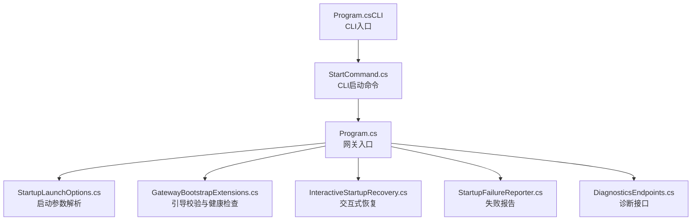
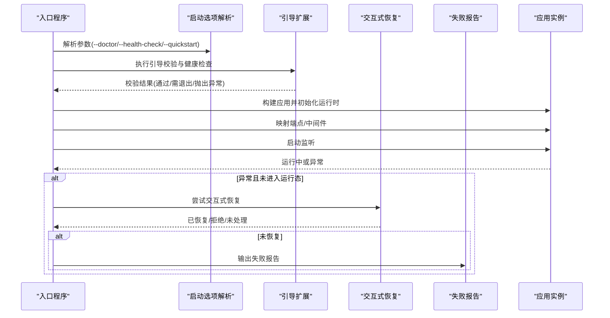
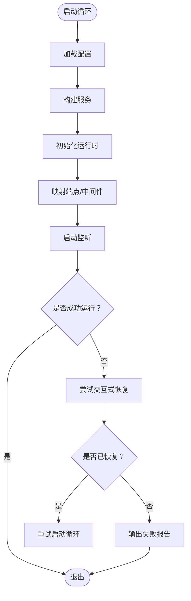
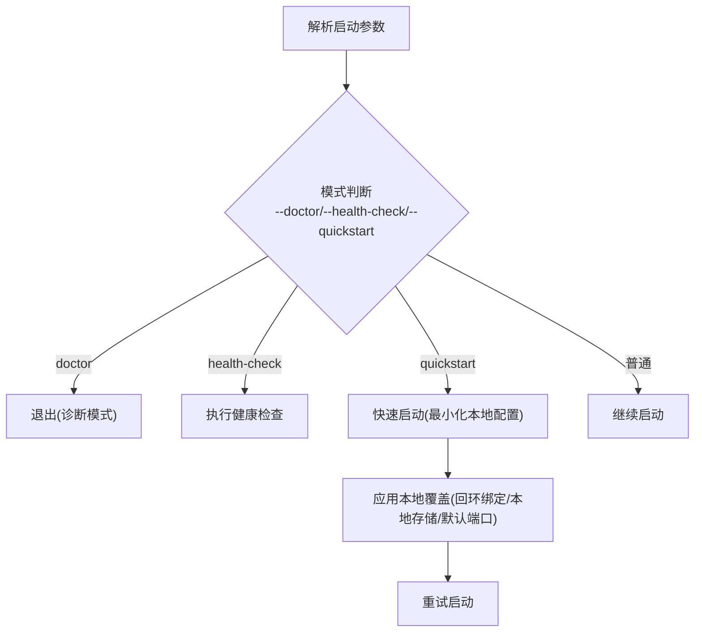
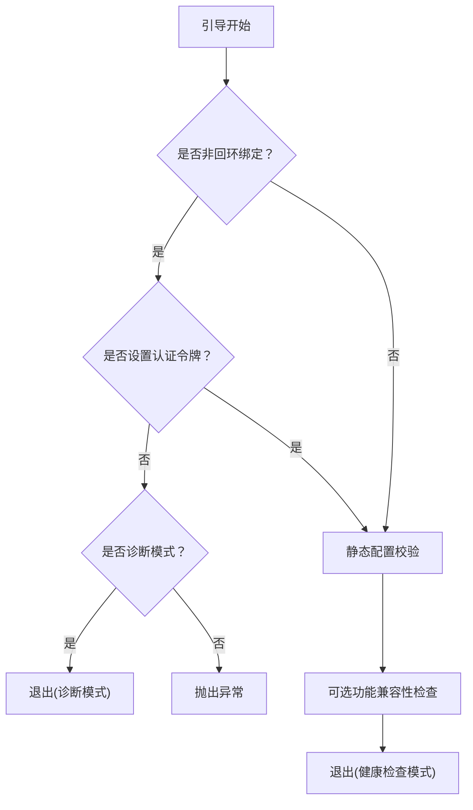
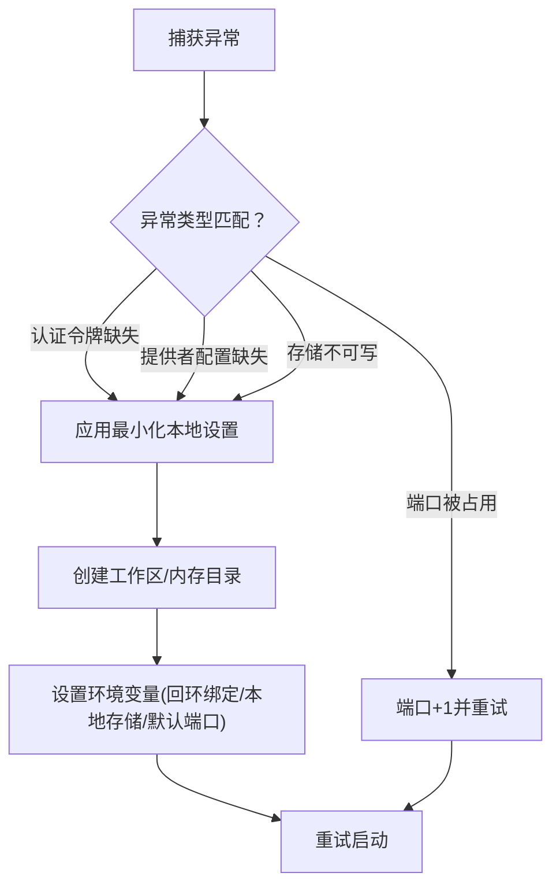
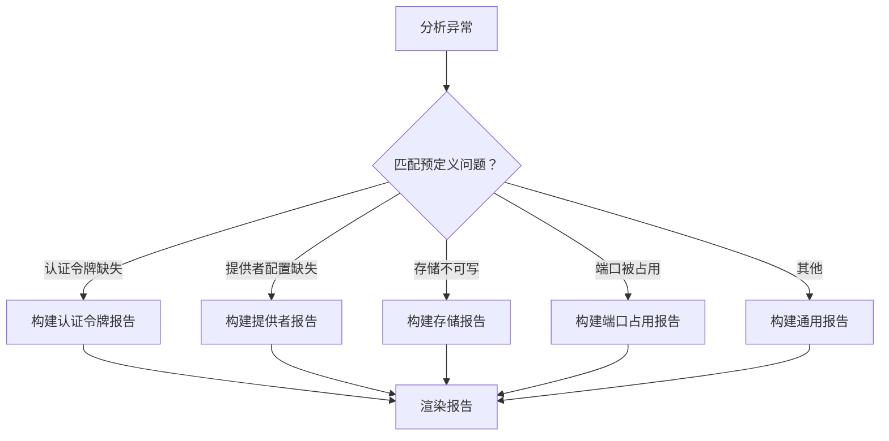
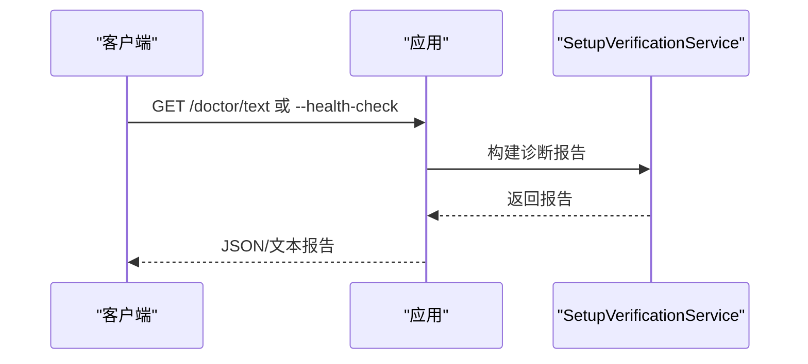
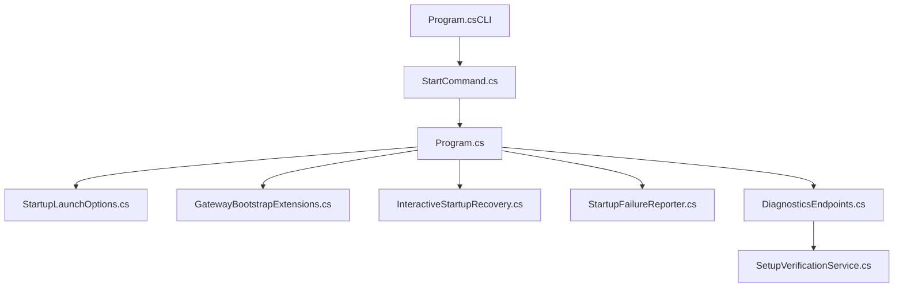

# 启动问题

<cite>
**本文引用的文件**
- [Program.cs](file://src/OpenClaw.Gateway/Program.cs)
- [StartupFailureReporter.cs](file://src/OpenClaw.Gateway/Bootstrap/StartupFailureReporter.cs)
- [InteractiveStartupRecovery.cs](file://src/OpenClaw.Gateway/Bootstrap/InteractiveStartupRecovery.cs)
- [StartupLaunchOptions.cs](file://src/OpenClaw.Gateway/Bootstrap/StartupLaunchOptions.cs)
- [GatewayBootstrapExtensions.cs](file://src/OpenClaw.Gateway/Bootstrap/GatewayBootstrapExtensions.cs)
- [SetupVerificationService.cs](file://src/OpenClaw.Core/Validation/SetupVerificationService.cs)
- [DiagnosticsEndpoints.cs](file://src/OpenClaw.Gateway/Endpoints/DiagnosticsEndpoints.cs)
- [StartCommand.cs](file://src/OpenClaw.Cli/StartCommand.cs)
- [Program.cs（CLI）](file://src/OpenClaw.Cli/Program.cs)
- [GatewayConfig.cs](file://src/OpenClaw.Core/Models/GatewayConfig.cs)
- [launchSettings.json](file://Kingcrab.AppHost/Properties/launchSettings.json)
- [appsettings.json](file://Kingcrab.AppHost/appsettings.json)
- [appsettings.Development.json](file://Kingcrab.AppHost/appsettings.Development.json)
</cite>

## 目录
1. [简介](#简介)
2. [项目结构](#项目结构)
3. [核心组件](#核心组件)
4. [架构总览](#架构总览)
5. [详细组件分析](#详细组件分析)
6. [依赖关系分析](#依赖关系分析)
7. [性能考虑](#性能考虑)
8. [故障排除指南](#故障排除指南)
9. [结论](#结论)
10. [附录](#附录)

## 简介
本指南聚焦于 OpenClaw.NET 的启动问题排查与修复，覆盖配置错误、依赖缺失、端口占用、存储权限、认证令牌缺失等常见启动失败场景。文档提供日志分析技巧、错误信息解读、自动恢复机制说明，并给出启动命令示例与配置验证步骤，帮助开发者快速定位并解决问题。

## 项目结构
OpenClaw.NET 的启动流程由网关入口程序驱动，结合启动选项解析、引导阶段校验、交互式恢复与失败报告机制，形成“启动-校验-恢复-报告”的闭环。关键位置如下：
- 网关入口：负责加载配置、构建服务、初始化运行时、映射端点并启动监听。
- 引导扩展：在启动前进行健康检查、非回环绑定安全校验、配置静态校验等。
- 交互式恢复：针对可恢复的启动异常，提供最小化本地设置重试能力。
- 失败报告：对不可恢复异常生成结构化报告，指导修复路径。
- CLI 启动命令：封装启动流程，支持引导设置与直接启动。

图表来源
- [Program.cs:1-124](file://src/OpenClaw.Gateway/Program.cs#L1-L124)
- [StartupLaunchOptions.cs:1-122](file://src/OpenClaw.Gateway/Bootstrap/StartupLaunchOptions.cs#L1-L122)
- [GatewayBootstrapExtensions.cs:33-69](file://src/OpenClaw.Gateway/Bootstrap/GatewayBootstrapExtensions.cs#L33-L69)
- [InteractiveStartupRecovery.cs:1-336](file://src/OpenClaw.Gateway/Bootstrap/InteractiveStartupRecovery.cs#L1-L336)
- [StartupFailureReporter.cs:1-332](file://src/OpenClaw.Gateway/Bootstrap/StartupFailureReporter.cs#L1-L332)
- [DiagnosticsEndpoints.cs:156-183](file://src/OpenClaw.Gateway/Endpoints/DiagnosticsEndpoints.cs#L156-L183)
- [StartCommand.cs:1-110](file://src/OpenClaw.Cli/StartCommand.cs#L1-L110)
- [Program.cs（CLI）:1-800](file://src/OpenClaw.Cli/Program.cs#L1-L800)

章节来源
- [Program.cs:1-124](file://src/OpenClaw.Gateway/Program.cs#L1-L124)
- [StartupLaunchOptions.cs:1-122](file://src/OpenClaw.Gateway/Bootstrap/StartupLaunchOptions.cs#L1-L122)
- [GatewayBootstrapExtensions.cs:33-69](file://src/OpenClaw.Gateway/Bootstrap/GatewayBootstrapExtensions.cs#L33-L69)
- [InteractiveStartupRecovery.cs:1-336](file://src/OpenClaw.Gateway/Bootstrap/InteractiveStartupRecovery.cs#L1-L336)
- [StartupFailureReporter.cs:1-332](file://src/OpenClaw.Gateway/Bootstrap/StartupFailureReporter.cs#L1-L332)
- [DiagnosticsEndpoints.cs:156-183](file://src/OpenClaw.Gateway/Endpoints/DiagnosticsEndpoints.cs#L156-L183)
- [StartCommand.cs:1-110](file://src/OpenClaw.Cli/StartCommand.cs#L1-L110)
- [Program.cs（CLI）:1-800](file://src/OpenClaw.Cli/Program.cs#L1-L800)

## 核心组件
- 启动入口与循环：网关入口在启动失败且未进入运行态时，通过交互式恢复尝试最小化本地设置后重试；若仍失败则输出失败报告并退出。
- 启动选项解析：解析 --doctor、--health-check、--quickstart 等模式，以及外部配置路径覆盖逻辑。
- 引导校验：非回环绑定强制要求认证令牌；进行配置静态校验与可选功能兼容性检查；可执行健康检查模式。
- 交互式恢复：针对认证令牌缺失、模型提供者配置缺失、存储路径不可写、端口被占用等异常，提供最小化本地设置并重试的能力。
- 失败报告：根据异常类型生成标题、摘要、详情与修复建议，包含环境变量、绑定地址、端口、存储路径、提供者与模型等上下文。
- 诊断接口：提供 /doctor/text 文档化诊断报告，包含配置、工作区、安全态势、浏览器能力、操作员就绪度、模型医生、提供商探针等检查项。
- CLI 启动命令：封装启动流程，支持无配置时引导设置，或直接启动已存在的配置。

章节来源
- [Program.cs:42-123](file://src/OpenClaw.Gateway/Program.cs#L42-L123)
- [StartupLaunchOptions.cs:57-121](file://src/OpenClaw.Gateway/Bootstrap/StartupLaunchOptions.cs#L57-L121)
- [GatewayBootstrapExtensions.cs:33-69](file://src/OpenClaw.Gateway/Bootstrap/GatewayBootstrapExtensions.cs#L33-L69)
- [InteractiveStartupRecovery.cs:72-150](file://src/OpenClaw.Gateway/Bootstrap/InteractiveStartupRecovery.cs#L72-L150)
- [StartupFailureReporter.cs:20-80](file://src/OpenClaw.Gateway/Bootstrap/StartupFailureReporter.cs#L20-L80)
- [DiagnosticsEndpoints.cs:156-183](file://src/OpenClaw.Gateway/Endpoints/DiagnosticsEndpoints.cs#L156-L183)
- [StartCommand.cs:9-96](file://src/OpenClaw.Cli/StartCommand.cs#L9-L96)

## 架构总览
下图展示启动阶段的关键交互：入口程序解析启动选项，执行引导校验，构建应用并初始化运行时，映射端点，最后启动监听。异常发生时，进入交互式恢复或失败报告流程。

图表来源
- [Program.cs:42-123](file://src/OpenClaw.Gateway/Program.cs#L42-L123)
- [GatewayBootstrapExtensions.cs:33-69](file://src/OpenClaw.Gateway/Bootstrap/GatewayBootstrapExtensions.cs#L33-L69)
- [InteractiveStartupRecovery.cs:72-150](file://src/OpenClaw.Gateway/Bootstrap/InteractiveStartupRecovery.cs#L72-L150)
- [StartupFailureReporter.cs:7-18](file://src/OpenClaw.Gateway/Bootstrap/StartupFailureReporter.cs#L7-L18)

## 详细组件分析

### 组件A：启动入口与异常恢复
- 入口程序在每次循环中加载配置、构建服务、初始化运行时、映射端点并启动监听。
- 若异常发生在启动完成之前，进入交互式恢复；若不可恢复，则输出失败报告并设置退出码。

图表来源
- [Program.cs:42-123](file://src/OpenClaw.Gateway/Program.cs#L42-L123)
- [InteractiveStartupRecovery.cs:72-150](file://src/OpenClaw.Gateway/Bootstrap/InteractiveStartupRecovery.cs#L72-L150)
- [StartupFailureReporter.cs:7-18](file://src/OpenClaw.Gateway/Bootstrap/StartupFailureReporter.cs#L7-L18)

章节来源
- [Program.cs:42-123](file://src/OpenClaw.Gateway/Program.cs#L42-L123)

### 组件B：启动选项解析与快速启动
- 支持 --doctor、--health-check、--quickstart 模式组合校验与外部配置路径覆盖。
- 快速启动仅在交互式终端可用，会应用最小化本地配置并重试启动。

图表来源
- [StartupLaunchOptions.cs:57-121](file://src/OpenClaw.Gateway/Bootstrap/StartupLaunchOptions.cs#L57-L121)
- [InteractiveStartupRecovery.cs:17-70](file://src/OpenClaw.Gateway/Bootstrap/InteractiveStartupRecovery.cs#L17-L70)

章节来源
- [StartupLaunchOptions.cs:57-121](file://src/OpenClaw.Gateway/Bootstrap/StartupLaunchOptions.cs#L57-L121)
- [InteractiveStartupRecovery.cs:17-70](file://src/OpenClaw.Gateway/Bootstrap/InteractiveStartupRecovery.cs#L17-L70)

### 组件C：引导校验与健康检查
- 非回环绑定必须设置认证令牌；否则在诊断模式下直接退出，在普通模式下抛出异常。
- 执行配置静态校验与可选功能兼容性检查；健康检查模式直接返回退出码。

图表来源
- [GatewayBootstrapExtensions.cs:33-69](file://src/OpenClaw.Gateway/Bootstrap/GatewayBootstrapExtensions.cs#L33-L69)

章节来源
- [GatewayBootstrapExtensions.cs:33-69](file://src/OpenClaw.Gateway/Bootstrap/GatewayBootstrapExtensions.cs#L33-L69)

### 组件D：交互式恢复与自动修复
- 针对认证令牌缺失、模型提供者配置缺失、存储路径不可写、端口被占用等异常，提供最小化本地设置并重试。
- 自动选择端口、提示输入 API Key/Endpoint、确保工作区与内存目录存在。

图表来源
- [InteractiveStartupRecovery.cs:72-150](file://src/OpenClaw.Gateway/Bootstrap/InteractiveStartupRecovery.cs#L72-L150)
- [StartupFailureReporter.cs:276-282](file://src/OpenClaw.Gateway/Bootstrap/StartupFailureReporter.cs#L276-L282)

章节来源
- [InteractiveStartupRecovery.cs:72-150](file://src/OpenClaw.Gateway/Bootstrap/InteractiveStartupRecovery.cs#L72-L150)
- [StartupFailureReporter.cs:276-282](file://src/OpenClaw.Gateway/Bootstrap/StartupFailureReporter.cs#L276-L282)

### 组件E：失败报告与修复建议
- 根据异常消息特征识别具体问题，生成标题、摘要、详情与修复建议。
- 包含环境变量、绑定地址、端口、存储路径、提供者与模型等上下文信息。

图表来源
- [StartupFailureReporter.cs:52-80](file://src/OpenClaw.Gateway/Bootstrap/StartupFailureReporter.cs#L52-L80)
- [StartupFailureReporter.cs:82-266](file://src/OpenClaw.Gateway/Bootstrap/StartupFailureReporter.cs#L82-L266)

章节来源
- [StartupFailureReporter.cs:52-80](file://src/OpenClaw.Gateway/Bootstrap/StartupFailureReporter.cs#L52-L80)
- [StartupFailureReporter.cs:82-266](file://src/OpenClaw.Gateway/Bootstrap/StartupFailureReporter.cs#L82-L266)

### 组件F：诊断接口与健康检查
- 提供 /doctor/text 接口输出结构化诊断报告，包含配置、工作区、安全态势、浏览器能力、操作员就绪度、模型医生、提供商探针等。
- 健康检查模式直接返回退出码，便于自动化集成。

图表来源
- [DiagnosticsEndpoints.cs:156-183](file://src/OpenClaw.Gateway/Endpoints/DiagnosticsEndpoints.cs#L156-L183)
- [GatewayBootstrapExtensions.cs:38-46](file://src/OpenClaw.Gateway/Bootstrap/GatewayBootstrapExtensions.cs#L38-L46)

章节来源
- [DiagnosticsEndpoints.cs:156-183](file://src/OpenClaw.Gateway/Endpoints/DiagnosticsEndpoints.cs#L156-L183)
- [GatewayBootstrapExtensions.cs:38-46](file://src/OpenClaw.Gateway/Bootstrap/GatewayBootstrapExtensions.cs#L38-L46)

## 依赖关系分析
- 启动入口依赖启动选项解析、引导扩展、交互式恢复与失败报告模块。
- 诊断接口依赖 SetupVerificationService 进行静态与动态检查。
- CLI 启动命令封装入口程序，提供用户友好的启动体验。

图表来源
- [Program.cs:1-124](file://src/OpenClaw.Gateway/Program.cs#L1-L124)
- [StartupLaunchOptions.cs:1-122](file://src/OpenClaw.Gateway/Bootstrap/StartupLaunchOptions.cs#L1-L122)
- [GatewayBootstrapExtensions.cs:33-69](file://src/OpenClaw.Gateway/Bootstrap/GatewayBootstrapExtensions.cs#L33-L69)
- [InteractiveStartupRecovery.cs:1-336](file://src/OpenClaw.Gateway/Bootstrap/InteractiveStartupRecovery.cs#L1-L336)
- [StartupFailureReporter.cs:1-332](file://src/OpenClaw.Gateway/Bootstrap/StartupFailureReporter.cs#L1-L332)
- [DiagnosticsEndpoints.cs:156-183](file://src/OpenClaw.Gateway/Endpoints/DiagnosticsEndpoints.cs#L156-L183)
- [SetupVerificationService.cs:1-356](file://src/OpenClaw.Core/Validation/SetupVerificationService.cs#L1-L356)
- [StartCommand.cs:1-110](file://src/OpenClaw.Cli/StartCommand.cs#L1-L110)
- [Program.cs（CLI）:1-800](file://src/OpenClaw.Cli/Program.cs#L1-L800)

章节来源
- [Program.cs:1-124](file://src/OpenClaw.Gateway/Program.cs#L1-L124)
- [StartupLaunchOptions.cs:1-122](file://src/OpenClaw.Gateway/Bootstrap/StartupLaunchOptions.cs#L1-L122)
- [GatewayBootstrapExtensions.cs:33-69](file://src/OpenClaw.Gateway/Bootstrap/GatewayBootstrapExtensions.cs#L33-L69)
- [InteractiveStartupRecovery.cs:1-336](file://src/OpenClaw.Gateway/Bootstrap/InteractiveStartupRecovery.cs#L1-L336)
- [StartupFailureReporter.cs:1-332](file://src/OpenClaw.Gateway/Bootstrap/StartupFailureReporter.cs#L1-L332)
- [DiagnosticsEndpoints.cs:156-183](file://src/OpenClaw.Gateway/Endpoints/DiagnosticsEndpoints.cs#L156-L183)
- [SetupVerificationService.cs:1-356](file://src/OpenClaw.Core/Validation/SetupVerificationService.cs#L1-L356)
- [StartCommand.cs:1-110](file://src/OpenClaw.Cli/StartCommand.cs#L1-L110)
- [Program.cs（CLI）:1-800](file://src/OpenClaw.Cli/Program.cs#L1-L800)

## 性能考虑
- 启动阶段避免不必要的 I/O 与网络请求，优先使用内存中的配置与缓存。
- 交互式恢复仅在异常发生时触发，正常启动不引入额外开销。
- 健康检查与诊断报告用于一次性评估，不参与常规运行时性能监控。

## 故障排除指南

### 一、启动失败的常见原因与诊断
- 认证令牌缺失（非回环绑定）
  - 现象：启动时报“需要认证令牌”类错误。
  - 诊断：查看失败报告中的“绑定地址”、“当前环境”等上下文。
  - 修复：设置认证令牌或改为回环绑定；开发环境可设置为 Development。
  - 参考
    - [StartupFailureReporter.cs:82-111](file://src/OpenClaw.Gateway/Bootstrap/StartupFailureReporter.cs#L82-L111)
    - [GatewayBootstrapExtensions.cs:48-63](file://src/OpenClaw.Gateway/Bootstrap/GatewayBootstrapExtensions.cs#L48-L63)

- 模型提供者配置缺失
  - 现象：缺少 API Key 或 Endpoint，或提供者不可用。
  - 诊断：失败报告中包含“提供者”、“模型”、“底层错误”等细节。
  - 修复：设置 API Key 或 Endpoint；确认插件已启用。
  - 参考
    - [StartupFailureReporter.cs:155-208](file://src/OpenClaw.Gateway/Bootstrap/StartupFailureReporter.cs#L155-L208)

- 存储路径不可写
  - 现象：存储根目录或 SQLite 数据库路径不可写或只读文件系统。
  - 诊断：失败报告中包含“存储路径”、“底层错误”等。
  - 修复：设置可写目录，确保目录存在或可创建；生产环境可切换到 Development。
  - 参考
    - [StartupFailureReporter.cs:113-153](file://src/OpenClaw.Gateway/Bootstrap/StartupFailureReporter.cs#L113-L153)
    - [GatewayConfig.cs:175-227](file://src/OpenClaw.Core/Models/GatewayConfig.cs#L175-L227)

- 端口被占用
  - 现象：Kestrel 绑定失败，提示端口已被占用。
  - 诊断：失败报告中包含“绑定地址”、“端口”、“底层错误”。
  - 修复：停止占用进程或更改端口；交互式恢复可自动尝试下一个端口。
  - 参考
    - [StartupFailureReporter.cs:210-233](file://src/OpenClaw.Gateway/Bootstrap/StartupFailureReporter.cs#L210-L233)
    - [SetupVerificationService.cs:1140-1172](file://src/OpenClaw.Core/Validation/SetupVerificationService.cs#L1140-L1172)

- 通用启动异常
  - 现象：未识别的异常导致启动失败。
  - 诊断：失败报告中包含“异常类型”、“消息”、“环境”、“端口”等。
  - 修复：根据报告建议修正配置后重试。
  - 参考
    - [StartupFailureReporter.cs:235-266](file://src/OpenClaw.Gateway/Bootstrap/StartupFailureReporter.cs#L235-L266)

### 二、启动日志分析技巧与错误信息解读
- 关注失败报告中的“标题”、“摘要”、“详情”和“建议修复”四部分，逐条核对上下文键值。
- 结合诊断接口输出的 JSON 报告，定位静态配置错误、工作区路径、安全策略、提供商探针等。
- 使用健康检查模式快速判断端口占用与基本连通性。
- 参考
  - [StartupFailureReporter.cs:20-50](file://src/OpenClaw.Gateway/Bootstrap/StartupFailureReporter.cs#L20-L50)
  - [DiagnosticsEndpoints.cs:156-183](file://src/OpenClaw.Gateway/Endpoints/DiagnosticsEndpoints.cs#L156-L183)
  - [GatewayBootstrapExtensions.cs:38-46](file://src/OpenClaw.Gateway/Bootstrap/GatewayBootstrapExtensions.cs#L38-L46)

### 三、自动恢复机制
- 交互式恢复在以下条件满足时自动应用最小化本地设置并重试：
  - 非回环绑定但未设置认证令牌
  - 缺少模型提供者 API Key 或 Endpoint
  - 存储路径不可写
  - 端口被占用
- 恢复流程包括：提示输入 API Key/Endpoint、创建工作区与内存目录、设置环境变量、重试启动。
- 参考
  - [InteractiveStartupRecovery.cs:72-150](file://src/OpenClaw.Gateway/Bootstrap/InteractiveStartupRecovery.cs#L72-L150)
  - [StartupFailureReporter.cs:296-306](file://src/OpenClaw.Gateway/Bootstrap/StartupFailureReporter.cs#L296-L306)

### 四、启动命令示例与配置验证步骤
- 直接启动（推荐）
  - 使用 CLI 启动命令：openclaw start
  - 若无配置，将引导设置；有配置则直接启动。
  - 参考
    - [StartCommand.cs:9-96](file://src/OpenClaw.Cli/StartCommand.cs#L9-L96)
    - [Program.cs（CLI）:702-718](file://src/OpenClaw.Cli/Program.cs#L702-L718)

- 快速启动（最小化本地设置）
  - 在交互式终端中使用：dotnet run --project src/OpenClaw.Gateway -c Release -- --quickstart
  - 应用回环绑定、本地存储与默认端口，无需持久化。
  - 参考
    - [Program.cs（CLI）:204-208](file://src/OpenClaw.Cli/Program.cs#L204-L208)
    - [InteractiveStartupRecovery.cs:17-70](file://src/OpenClaw.Gateway/Bootstrap/InteractiveStartupRecovery.cs#L17-L70)

- 诊断模式与健康检查
  - 诊断模式：dotnet run --project src/OpenClaw.Gateway -c Release -- --doctor
  - 健康检查：dotnet run --project src/OpenClaw.Gateway -c Release -- --health-check
  - 参考
    - [GatewayBootstrapExtensions.cs:38-46](file://src/OpenClaw.Gateway/Bootstrap/GatewayBootstrapExtensions.cs#L38-L46)

- 配置验证步骤
  - 使用 openclaw setup verify 检查配置与静态校验。
  - 使用 /doctor/text 获取结构化诊断报告。
  - 参考
    - [Program.cs（CLI）:374-395](file://src/OpenClaw.Cli/Program.cs#L374-L395)
    - [DiagnosticsEndpoints.cs:156-183](file://src/OpenClaw.Gateway/Endpoints/DiagnosticsEndpoints.cs#L156-L183)

### 五、环境与配置要点
- 开发环境变量
  - ASPNETCORE_ENVIRONMENT 设置为 Development 可使用仓库本地默认值。
  - 参考
    - [launchSettings.json:10-15](file://Kingcrab.AppHost/Properties/launchSettings.json#L10-L15)
    - [appsettings.json:2-8](file://Kingcrab.AppHost/appsettings.json#L2-L8)
    - [appsettings.Development.json:2-8](file://Kingcrab.AppHost/appsettings.Development.json#L2-L8)

- 关键配置项
  - 绑定地址与端口：OpenClaw__BindAddress、OpenClaw__Port
  - 认证令牌：OPENCLAW_AUTH_TOKEN
  - 存储路径：OpenClaw__Memory__StoragePath、OpenClaw__Memory__Sqlite__DbPath、OpenClaw__Memory__Retention__ArchivePath
  - 提供者与模型：OpenClaw:Llm:Provider、OpenClaw:Llm:Model、MODEL_PROVIDER_KEY、MODEL_PROVIDER_ENDPOINT
  - 参考
    - [GatewayConfig.cs:11-12](file://src/OpenClaw.Core/Models/GatewayConfig.cs#L11-L12)
    - [InteractiveStartupRecovery.cs:204-218](file://src/OpenClaw.Gateway/Bootstrap/InteractiveStartupRecovery.cs#L204-L218)

## 结论
通过启动选项解析、引导校验、交互式恢复与失败报告机制，OpenClaw.NET 能够在多种启动异常场景下提供清晰的诊断与修复路径。建议在开发阶段使用快速启动与诊断模式，在生产阶段严格遵循非回环绑定的安全策略并完善配置验证流程。

## 附录
- 相关实现文件路径
  - [Program.cs:1-124](file://src/OpenClaw.Gateway/Program.cs#L1-L124)
  - [StartupLaunchOptions.cs:1-122](file://src/OpenClaw.Gateway/Bootstrap/StartupLaunchOptions.cs#L1-L122)
  - [GatewayBootstrapExtensions.cs:33-69](file://src/OpenClaw.Gateway/Bootstrap/GatewayBootstrapExtensions.cs#L33-L69)
  - [InteractiveStartupRecovery.cs:1-336](file://src/OpenClaw.Gateway/Bootstrap/InteractiveStartupRecovery.cs#L1-L336)
  - [StartupFailureReporter.cs:1-332](file://src/OpenClaw.Gateway/Bootstrap/StartupFailureReporter.cs#L1-L332)
  - [DiagnosticsEndpoints.cs:156-183](file://src/OpenClaw.Gateway/Endpoints/DiagnosticsEndpoints.cs#L156-L183)
  - [StartCommand.cs:1-110](file://src/OpenClaw.Cli/StartCommand.cs#L1-L110)
  - [Program.cs（CLI）:1-800](file://src/OpenClaw.Cli/Program.cs#L1-L800)
  - [GatewayConfig.cs:1-800](file://src/OpenClaw.Core/Models/GatewayConfig.cs#L1-L800)
  - [launchSettings.json:1-32](file://Kingcrab.AppHost/Properties/launchSettings.json#L1-L32)
  - [appsettings.json:1-10](file://Kingcrab.AppHost/appsettings.json#L1-L10)
  - [appsettings.Development.json:1-9](file://Kingcrab.AppHost/appsettings.Development.json#L1-L9)