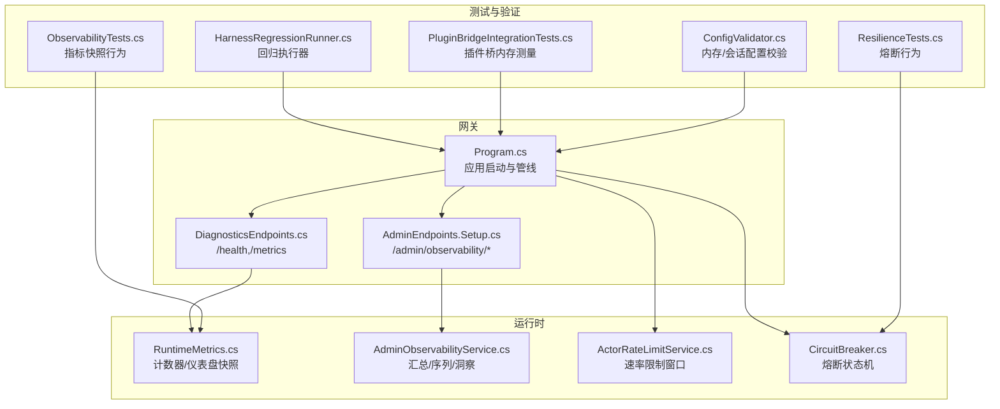
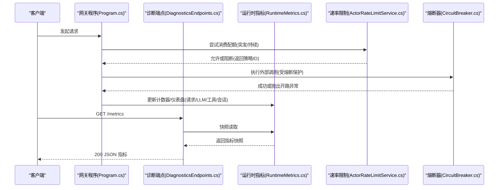
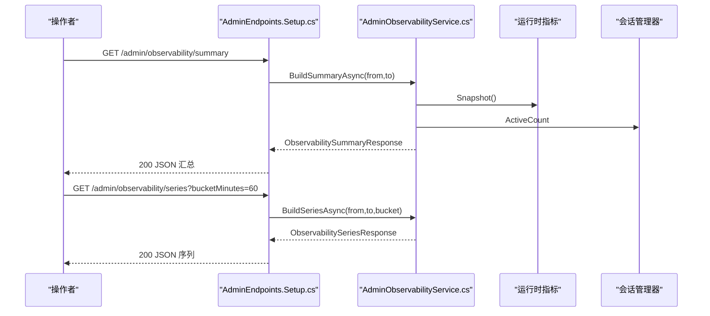
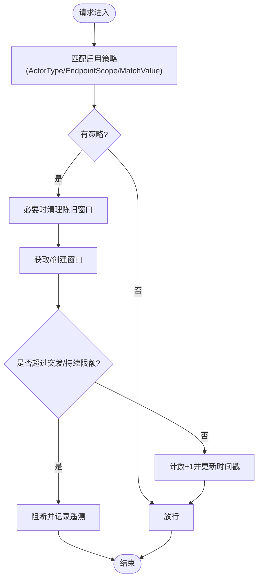
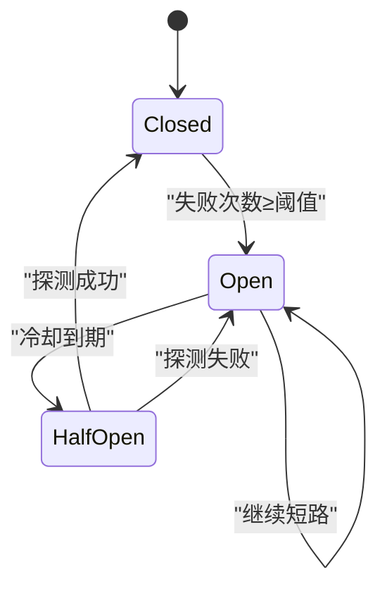
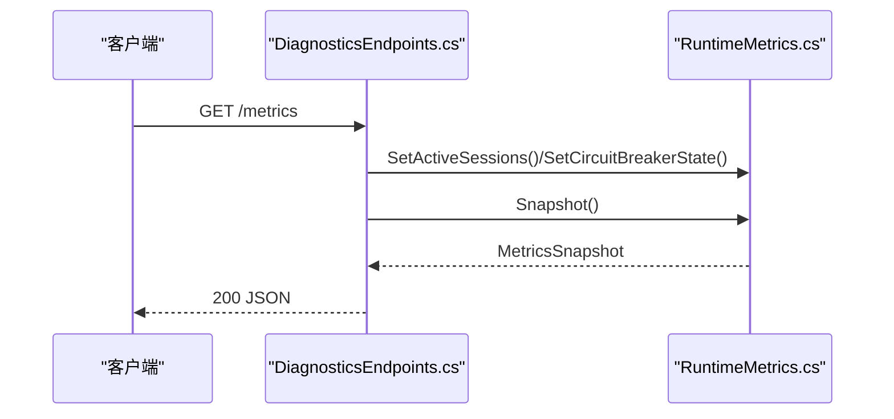
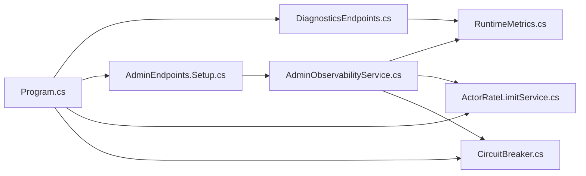

# 性能问题

<cite>
**本文引用的文件**
- [RuntimeMetrics.cs](file://src/OpenClaw.Core/Observability/RuntimeMetrics.cs)
- [AdminObservabilityService.cs](file://src/OpenClaw.Gateway/AdminObservabilityService.cs)
- [ActorRateLimitService.cs](file://src/OpenClaw.Gateway/ActorRateLimitService.cs)
- [DiagnosticsEndpoints.cs](file://src/OpenClaw.Gateway/Endpoints/DiagnosticsEndpoints.cs)
- [AdminEndpoints.Setup.cs](file://src/OpenClaw.Gateway/Endpoints/AdminEndpoints.Setup.cs)
- [Program.cs](file://src/OpenClaw.Gateway/Program.cs)
- [ObservabilityTests.cs](file://src/OpenClaw.Tests/ObservabilityTests.cs)
- [PluginBridgeIntegrationTests.cs](file://src/OpenClaw.Tests/PluginBridgeIntegrationTests.cs)
- [HarnessRegressionRunner.cs](file://src/OpenClaw.Testing/HarnessRegressionRunner.cs)
- [ResilienceTests.cs](file://src/OpenClaw.Tests/ResilienceTests.cs)
- [CircuitBreaker.cs](file://src/OpenClaw.Agent/CircuitBreaker.cs)
- [ConfigValidator.cs](file://src/OpenClaw.Core/Validation/ConfigValidator.cs)
</cite>

## 目录
1. [简介](#简介)
2. [项目结构](#项目结构)
3. [核心组件](#核心组件)
4. [架构总览](#架构总览)
5. [详细组件分析](#详细组件分析)
6. [依赖关系分析](#依赖关系分析)
7. [性能考量](#性能考量)
8. [故障排除指南](#故障排除指南)
9. [结论](#结论)
10. [附录](#附录)

## 简介
本指南面向 OpenClaw.NET 的性能问题排查与优化，聚焦高延迟、内存占用过高、CPU 使用率异常以及吞吐量下降等典型症状。文档基于仓库中的可观测性指标、限流与熔断机制、健康与指标端点、回归测试框架与配置校验等能力，提供系统化的诊断流程、瓶颈识别方法与调优策略，并给出可操作的基准测试与优化案例路径。

## 项目结构
OpenClaw.NET 的性能相关能力主要分布在以下模块：
- 核心可观测性：运行时指标（计数器/仪表盘）、快照导出与聚合
- 网关端点：健康检查、指标暴露、管理员可观测性接口
- 运行时保护：速率限制、熔断器、会话与内存保留策略
- 测试与回归：回归执行器、性能回归场景、插件桥进程内存测量
- 启动与服务组合：应用启动、中间件管线、端点映射

图表来源
- [Program.cs:47-98](file://src/OpenClaw.Gateway/Program.cs#L47-L98)
- [DiagnosticsEndpoints.cs:51-80](file://src/OpenClaw.Gateway/Endpoints/DiagnosticsEndpoints.cs#L51-L80)
- [AdminEndpoints.Setup.cs:224-269](file://src/OpenClaw.Gateway/Endpoints/AdminEndpoints.Setup.cs#L224-L269)
- [RuntimeMetrics.cs:10-251](file://src/OpenClaw.Core/Observability/RuntimeMetrics.cs#L10-L251)
- [AdminObservabilityService.cs:117-227](file://src/OpenClaw.Gateway/AdminObservabilityService.cs#L117-L227)
- [ActorRateLimitService.cs:92-148](file://src/OpenClaw.Gateway/ActorRateLimitService.cs#L92-L148)
- [CircuitBreaker.cs:15-208](file://src/OpenClaw.Agent/CircuitBreaker.cs#L15-L208)
- [HarnessRegressionRunner.cs:18-68](file://src/OpenClaw.Testing/HarnessRegressionRunner.cs#L18-L68)
- [PluginBridgeIntegrationTests.cs:80-90](file://src/OpenClaw.Tests/PluginBridgeIntegrationTests.cs#L80-L90)
- [ObservabilityTests.cs:105-204](file://src/OpenClaw.Tests/ObservabilityTests.cs#L105-L204)
- [ResilienceTests.cs:16-147](file://src/OpenClaw.Tests/ResilienceTests.cs#L16-L147)
- [ConfigValidator.cs:96-114](file://src/OpenClaw.Core/Validation/ConfigValidator.cs#L96-L114)

章节来源
- [Program.cs:47-98](file://src/OpenClaw.Gateway/Program.cs#L47-L98)
- [DiagnosticsEndpoints.cs:51-80](file://src/OpenClaw.Gateway/Endpoints/DiagnosticsEndpoints.cs#L51-L80)
- [AdminEndpoints.Setup.cs:224-269](file://src/OpenClaw.Gateway/Endpoints/AdminEndpoints.Setup.cs#L224-L269)

## 核心组件
- 运行时指标（RuntimeMetrics）：提供线程安全的计数器与仪表盘值，支持快照用于健康与指标端点输出。
- 管理员可观测性服务（AdminObservabilityService）：构建汇总卡片、时间序列与审计导出，辅助定位瓶颈与异常。
- 速率限制服务（ActorRateLimitService）：按策略对请求进行突发/持续限流，避免过载。
- 熔断器（CircuitBreaker）：对外部服务失败进行快速短路，降低级联故障风险。
- 健康与指标端点：/health 与 /metrics 提供即时状态与指标快照。
- 回归测试框架（HarnessRegressionRunner）：统一执行回归场景，记录耗时与结果，支撑性能基线。
- 插件桥内存测量：通过集成测试对子进程内存占用进行量化评估。
- 配置校验（ConfigValidator）：对内存压缩阈值、会话并发等关键参数进行约束。

章节来源
- [RuntimeMetrics.cs:10-251](file://src/OpenClaw.Core/Observability/RuntimeMetrics.cs#L10-L251)
- [AdminObservabilityService.cs:117-227](file://src/OpenClaw.Gateway/AdminObservabilityService.cs#L117-L227)
- [ActorRateLimitService.cs:92-148](file://src/OpenClaw.Gateway/ActorRateLimitService.cs#L92-L148)
- [CircuitBreaker.cs:15-208](file://src/OpenClaw.Agent/CircuitBreaker.cs#L15-L208)
- [DiagnosticsEndpoints.cs:51-80](file://src/OpenClaw.Gateway/Endpoints/DiagnosticsEndpoints.cs#L51-L80)
- [HarnessRegressionRunner.cs:18-68](file://src/OpenClaw.Testing/HarnessRegressionRunner.cs#L18-L68)
- [PluginBridgeIntegrationTests.cs:80-90](file://src/OpenClaw.Tests/PluginBridgeIntegrationTests.cs#L80-L90)
- [ConfigValidator.cs:96-114](file://src/OpenClaw.Core/Validation/ConfigValidator.cs#L96-L114)

## 架构总览
下图展示从请求进入网关到运行时指标更新与可观测性输出的关键路径，以及与速率限制、熔断器的交互。

图表来源
- [Program.cs:89-96](file://src/OpenClaw.Gateway/Program.cs#L89-L96)
- [DiagnosticsEndpoints.cs:68-76](file://src/OpenClaw.Gateway/Endpoints/DiagnosticsEndpoints.cs#L68-L76)
- [RuntimeMetrics.cs:129-187](file://src/OpenClaw.Core/Observability/RuntimeMetrics.cs#L129-L187)
- [ActorRateLimitService.cs:92-148](file://src/OpenClaw.Gateway/ActorRateLimitService.cs#L92-L148)
- [CircuitBreaker.cs:91-147](file://src/OpenClaw.Agent/CircuitBreaker.cs#L91-L147)

## 详细组件分析

### 组件A：运行时指标（RuntimeMetrics）
- 数据结构与复杂度
  - 计数器与仪表盘均采用无锁原子操作，快照为结构体以避免分配，适合高频读写场景。
  - 读取与写入均为 O(1)，快照复制为 O(N)（N 为指标项数量）。
- 关键能力
  - 增量计数：请求、LLM 调用、工具调用、错误/超时/重试、会话相关、沙箱租约、内存检索命中/压缩、提示缓存读写等。
  - 仪表盘值：活跃会话数、熔断器状态、保留进程数、最近一次保留任务时长与成功标志等。
- 错误处理与边界
  - 快照读取保证一致性；部分计数器可能在 AOT 场景下避免分配。
- 性能影响
  - 高频写入的计数器建议配合批量采样或降采样策略，避免过度写入导致 CPU 抖动。

```mermaid
classDiagram
class RuntimeMetrics {
+long TotalRequests
+long TotalLlmCalls
+long TotalInputTokens
+long TotalOutputTokens
+long TotalToolCalls
+long TotalToolFailures
+long TotalToolTimeouts
+long TotalLlmRetries
+long TotalLlmErrors
+long SessionEvictions
+long SessionCapacityRejects
+long EstimatedTokenAdmissionRejects
+long BrowserCancellationResets
+long PluginBridgeAuthFailures
+long PluginBridgeRestartAttempts
+long PluginBridgeRestartFailures
+long SandboxLeaseCreates
+long SandboxLeaseReuses
+long SandboxLeaseRecoveries
+long RetentionSweepRuns
+long RetentionSweepFailures
+long RetentionArchivedItems
+long RetentionDeletedItems
+long RetentionSkippedProtectedSessions
+long OperatorAuditWriteFailures
+long RuntimeEventWriteFailures
+long SessionCacheHits
+long SessionCacheMisses
+long MemoryRecallSearches
+long MemoryRecallHits
+long MemoryCompactions
+long PromptCacheReads
+long PromptCacheWrites
+long PromptCacheWarmRuns
+long PromptCacheWarmSkips
+long PromptCacheWarmFailures
+long PulseRuns
+long PulseSkips
+long PulseAlerts
+long PulseOkSuppressed
+long PulseErrors
+int ActiveSessions
+int CircuitBreakerState
+int RetainedProcesses
+long RetentionLastRunAtUnixSeconds
+long RetentionLastRunDurationMs
+int RetentionLastRunSucceeded
+long PulseLastRunDurationMs
+IncrementRequests()
+IncrementLlmCalls()
+AddInputTokens(n)
+AddOutputTokens(n)
+IncrementToolCalls()
+IncrementToolFailures()
+IncrementToolTimeouts()
+IncrementLlmRetries()
+IncrementLlmErrors()
+IncrementSessionEvictions()
+IncrementSessionCapacityRejects()
+IncrementEstimatedTokenAdmissionRejects()
+IncrementBrowserCancellationResets()
+IncrementPluginBridgeAuthFailures()
+IncrementPluginBridgeRestartAttempts()
+IncrementPluginBridgeRestartFailures()
+IncrementSandboxLeaseCreates()
+IncrementSandboxLeaseReuses()
+IncrementSandboxLeaseRecoveries()
+IncrementRetentionSweepRuns()
+IncrementRetentionSweepFailures()
+AddRetentionArchivedItems(n)
+AddRetentionDeletedItems(n)
+AddRetentionSkippedProtectedSessions(n)
+IncrementOperatorAuditWriteFailures()
+IncrementRuntimeEventWriteFailures()
+IncrementSessionCacheHits()
+IncrementSessionCacheMisses()
+IncrementMemoryRecallSearches()
+AddMemoryRecallHits(n)
+IncrementMemoryCompactions()
+AddPromptCacheReads(n)
+AddPromptCacheWrites(n)
+IncrementPromptCacheWarmRuns()
+IncrementPromptCacheWarmSkips()
+IncrementPromptCacheWarmFailures()
+IncrementPulseRuns()
+IncrementPulseSkips()
+IncrementPulseAlerts()
+IncrementPulseOkSuppressed()
+IncrementPulseErrors()
+SetActiveSessions(count)
+SetCircuitBreakerState(state)
+SetRetainedProcesses(count)
+SetRetentionLast(runAtUtc, durationMs, succeeded)
+Snapshot() MetricsSnapshot
}
```

图表来源
- [RuntimeMetrics.cs:10-251](file://src/OpenClaw.Core/Observability/RuntimeMetrics.cs#L10-L251)

章节来源
- [RuntimeMetrics.cs:10-251](file://src/OpenClaw.Core/Observability/RuntimeMetrics.cs#L10-L251)
- [ObservabilityTests.cs:105-204](file://src/OpenClaw.Tests/ObservabilityTests.cs#L105-L204)

### 组件B：管理员可观测性服务（AdminObservabilityService）
- 功能要点
  - 构建汇总卡片（审批决策、自动化失败、提供方错误、死信、通道漂移、操作者动作）。
  - 生成时间序列（按桶分钟聚合），包含审批、自动化、提供方错误/重试、运行时事件、死信、活动会话、通道漂移、操作者动作。
  - 导出审计包与轨迹数据，便于离线分析。
- 瓶颈识别
  - 时间序列聚合与文件写入可能成为 IO 热点；可通过调整桶大小与并行度缓解。
  - 大范围导出会占用磁盘与网络带宽，建议分时段与增量导出。

图表来源
- [AdminEndpoints.Setup.cs:224-269](file://src/OpenClaw.Gateway/Endpoints/AdminEndpoints.Setup.cs#L224-L269)
- [AdminObservabilityService.cs:117-227](file://src/OpenClaw.Gateway/AdminObservabilityService.cs#L117-L227)

章节来源
- [AdminObservabilityService.cs:117-227](file://src/OpenClaw.Gateway/AdminObservabilityService.cs#L117-L227)
- [AdminEndpoints.Setup.cs:224-269](file://src/OpenClaw.Gateway/Endpoints/AdminEndpoints.Setup.cs#L224-L269)

### 组件C：速率限制服务（ActorRateLimitService）
- 工作原理
  - 基于策略字典与窗口状态（突发/持续）进行配额消费，支持按 Actor 类型与匹配值隔离。
  - 定期清理陈旧窗口，避免内存膨胀。
- 瓶颈识别
  - 窗口字典增长过快可能导致 GC 压力；可通过更严格的匹配值与更短窗口周期控制。
  - 高并发下的锁竞争可能成为热点，建议结合限流策略与降级。

图表来源
- [ActorRateLimitService.cs:92-148](file://src/OpenClaw.Gateway/ActorRateLimitService.cs#L92-L148)
- [ActorRateLimitService.cs:195-242](file://src/OpenClaw.Gateway/ActorRateLimitService.cs#L195-L242)

章节来源
- [ActorRateLimitService.cs:92-148](file://src/OpenClaw.Gateway/ActorRateLimitService.cs#L92-L148)
- [ActorRateLimitService.cs:195-242](file://src/OpenClaw.Gateway/ActorRateLimitService.cs#L195-L242)

### 组件D：熔断器（CircuitBreaker）
- 状态机
  - Closed：正常放行；累计失败达到阈值后打开。
  - Open：短路所有请求，冷却后进入 HalfOpen 探针。
  - HalfOpen：允许单个探测请求，成功则关闭，失败则重新打开并指数退避。
- 性能影响
  - 在外部服务不稳定时显著减少下游压力；失败过多时指数退避延长恢复时间。

图表来源
- [CircuitBreaker.cs:15-208](file://src/OpenClaw.Agent/CircuitBreaker.cs#L15-L208)

章节来源
- [CircuitBreaker.cs:15-208](file://src/OpenClaw.Agent/CircuitBreaker.cs#L15-L208)
- [ResilienceTests.cs:16-147](file://src/OpenClaw.Tests/ResilienceTests.cs#L16-L147)

### 组件E：健康与指标端点
- /health：简单健康检查，返回就绪状态与运行时。
- /metrics：返回当前运行时指标快照，包含请求总量、LLM/工具调用、错误/超时/重试、会话、沙箱、内存检索、提示缓存、脉冲等。
- 与运行时指标联动：端点调用前更新活跃会话与熔断器状态。

图表来源
- [DiagnosticsEndpoints.cs:68-76](file://src/OpenClaw.Gateway/Endpoints/DiagnosticsEndpoints.cs#L68-L76)
- [RuntimeMetrics.cs:179-187](file://src/OpenClaw.Core/Observability/RuntimeMetrics.cs#L179-L187)

章节来源
- [DiagnosticsEndpoints.cs:51-80](file://src/OpenClaw.Gateway/Endpoints/DiagnosticsEndpoints.cs#L51-L80)
- [RuntimeMetrics.cs:179-187](file://src/OpenClaw.Core/Observability/RuntimeMetrics.cs#L179-L187)

### 组件F：回归测试与基准测试
- 回归执行器（HarnessRegressionRunner）：统一收集场景结果、统计耗时、生成报告，可用于性能回归基线。
- 插件桥内存测量（PluginBridgeIntegrationTests）：对 JS/TS 插件桥子进程工作集与私有内存进行量化，辅助定位桥接层内存问题。

章节来源
- [HarnessRegressionRunner.cs:18-68](file://src/OpenClaw.Testing/HarnessRegressionRunner.cs#L18-L68)
- [PluginBridgeIntegrationTests.cs:80-90](file://src/OpenClaw.Tests/PluginBridgeIntegrationTests.cs#L80-L90)

## 依赖关系分析
- 网关启动与管线负责注册可观测性、服务与端点；运行时指标在端点中被读取与更新。
- 速率限制与熔断器作为运行时保护组件，贯穿请求处理链路。
- 管理员可观测性服务依赖运行时指标与会话管理器，生成聚合视图与导出数据。

图表来源
- [Program.cs:66-96](file://src/OpenClaw.Gateway/Program.cs#L66-L96)
- [DiagnosticsEndpoints.cs:68-76](file://src/OpenClaw.Gateway/Endpoints/DiagnosticsEndpoints.cs#L68-L76)
- [AdminEndpoints.Setup.cs:224-269](file://src/OpenClaw.Gateway/Endpoints/AdminEndpoints.Setup.cs#L224-L269)
- [RuntimeMetrics.cs:10-251](file://src/OpenClaw.Core/Observability/RuntimeMetrics.cs#L10-L251)
- [AdminObservabilityService.cs:117-227](file://src/OpenClaw.Gateway/AdminObservabilityService.cs#L117-L227)
- [ActorRateLimitService.cs:92-148](file://src/OpenClaw.Gateway/ActorRateLimitService.cs#L92-L148)
- [CircuitBreaker.cs:15-208](file://src/OpenClaw.Agent/CircuitBreaker.cs#L15-L208)

章节来源
- [Program.cs:66-96](file://src/OpenClaw.Gateway/Program.cs#L66-L96)
- [AdminObservabilityService.cs:117-227](file://src/OpenClaw.Gateway/AdminObservabilityService.cs#L117-L227)

## 性能考量
- 指标采集频率与粒度：高频快照读取对 CPU 有一定压力，建议在生产环境适当降低采集频率或使用批量导出。
- 速率限制与熔断：合理设置突发/持续限额与冷却时间，避免误伤正常流量；熔断退避应与上游 SLA 协调。
- 内存与会话：根据配置校验规则调整内存压缩阈值、最大历史轮次与会话并发上限，防止内存回收风暴。
- IO 与导出：管理员可观测性导出与序列化可能产生 IO 峰值，建议分时段与增量导出。

## 故障排除指南

### 一、高延迟
- 诊断步骤
  - 通过 /metrics 观察 LLM 请求与工具调用的平均耗时趋势，关注 TotalLlmCalls、TotalToolCalls、TotalLlmErrors、TotalToolTimeouts。
  - 结合 /admin/observability/series 查看 Provider Errors/Retries 与 Active Sessions 的变化，判断是否存在上游不稳定或会话堆积。
  - 检查熔断器状态（CircuitBreakerState）是否处于 Open 或 HalfOpen，确认外部服务健康状况。
- 可能原因
  - 外部模型服务不稳定或超时。
  - 会话过多导致资源争用。
  - 速率限制策略过于严格，导致排队与抖动。
- 优化策略
  - 调整熔断阈值与冷却时间，平衡保护与可用性。
  - 优化工具调用超时与重试策略，减少无效重试。
  - 适度放宽速率限制策略，或引入更细粒度的 Actor 隔离。

章节来源
- [DiagnosticsEndpoints.cs:68-76](file://src/OpenClaw.Gateway/Endpoints/DiagnosticsEndpoints.cs#L68-L76)
- [AdminEndpoints.Setup.cs:250-262](file://src/OpenClaw.Gateway/Endpoints/AdminEndpoints.Setup.cs#L250-L262)
- [RuntimeMetrics.cs:129-187](file://src/OpenClaw.Core/Observability/RuntimeMetrics.cs#L129-L187)
- [CircuitBreaker.cs:91-147](file://src/OpenClaw.Agent/CircuitBreaker.cs#L91-L147)

### 二、内存占用过高
- 诊断步骤
  - 使用 /metrics 观察 SessionCacheMisses、MemoryRecallSearches/MemoryRecallHits、MemoryCompactions、RetentionSweepRuns/RetentionSweepFailures。
  - 对比插件桥子进程工作集与私有内存（参考插件桥集成测试）。
- 可能原因
  - 会话缓存未命中频繁，导致重复加载与重建。
  - 内存检索命中率低，压缩阈值不当。
  - 保留策略执行失败或间隔过短，造成碎片与回收压力。
- 优化策略
  - 调整内存配置（压缩阈值、保留间隔、会话 TTL），确保压缩阈值大于最大历史轮次且小于压缩保持近期数。
  - 优化会话缓存命中（预热、复用），减少不必要的重建。
  - 增加保留任务的容错与重试，避免失败累积。

章节来源
- [RuntimeMetrics.cs:157-177](file://src/OpenClaw.Core/Observability/RuntimeMetrics.cs#L157-L177)
- [PluginBridgeIntegrationTests.cs:80-90](file://src/OpenClaw.Tests/PluginBridgeIntegrationTests.cs#L80-L90)
- [ConfigValidator.cs:96-114](file://src/OpenClaw.Core/Validation/ConfigValidator.cs#L96-L114)

### 三、CPU 使用率异常
- 诊断步骤
  - 观察 ActiveSessions、PulseRuns/PulseErrors、OperatorAuditWriteFailures/RuntimeEventWriteFailures。
  - 检查速率限制窗口清理频率（PruneInterval）是否过高导致频繁扫描。
- 可能原因
  - 会话过多导致脉冲与事件写入压力增大。
  - 速率限制窗口清理过于频繁，GC 压力上升。
- 优化策略
  - 控制并发会话上限，避免脉冲与事件写入峰值。
  - 调整速率限制策略与清理周期，减少陈旧窗口扫描。

章节来源
- [RuntimeMetrics.cs:179-187](file://src/OpenClaw.Core/Observability/RuntimeMetrics.cs#L179-L187)
- [ActorRateLimitService.cs:195-201](file://src/OpenClaw.Gateway/ActorRateLimitService.cs#L195-L201)

### 四、吞吐量下降
- 诊断步骤
  - 对比 TotalRequests、TotalLlmCalls、TotalToolCalls 与 TotalLlmErrors/TotalToolFailures/TotalToolTimeouts。
  - 检查 SessionCapacityRejects、EstimatedTokenAdmissionRejects，确认是否因容量或令牌准入限制导致拒绝。
- 可能原因
  - 外部服务错误/超时增多，导致整体吞吐下降。
  - 会话容量或令牌准入策略收紧。
- 优化策略
  - 放宽速率限制策略或提升外部服务稳定性。
  - 调整会话容量与令牌准入阈值，确保与业务峰值匹配。

章节来源
- [RuntimeMetrics.cs:129-187](file://src/OpenClaw.Core/Observability/RuntimeMetrics.cs#L129-L187)
- [ActorRateLimitService.cs:92-148](file://src/OpenClaw.Gateway/ActorRateLimitService.cs#L92-L148)

### 五、性能监控工具与使用
- 指标端点
  - /metrics：获取当前指标快照，包含请求、LLM、工具、会话、沙箱、内存检索、提示缓存、脉冲等。
  - /health：快速健康检查。
- 管理员可观测性
  - /admin/observability/summary：汇总卡片，快速定位异常维度。
  - /admin/observability/series：时间序列，按桶分钟聚合，适合趋势分析。
  - /admin/insights：提供提供方与工具使用概览。
- 使用建议
  - 将 /metrics 与 /admin/observability/series 作为日常巡检的“仪表盘”，设定告警阈值。
  - 对异常时段进行审计导出与轨迹回放，定位具体会话与工具调用。

章节来源
- [DiagnosticsEndpoints.cs:51-80](file://src/OpenClaw.Gateway/Endpoints/DiagnosticsEndpoints.cs#L51-L80)
- [AdminEndpoints.Setup.cs:224-269](file://src/OpenClaw.Gateway/Endpoints/AdminEndpoints.Setup.cs#L224-L269)
- [AdminObservabilityService.cs:117-227](file://src/OpenClaw.Gateway/AdminObservabilityService.cs#L117-L227)

### 六、瓶颈识别技术
- 指标关联分析：将错误/超时/重试与会话数、缓存命中率、保留任务执行情况关联，定位瓶颈来源。
- 时间序列对比：对比不同时间段的序列，识别异常波动与周期性问题。
- 导出与回放：利用审计导出与轨迹回放，还原问题发生时的完整上下文。

章节来源
- [AdminObservabilityService.cs:170-227](file://src/OpenClaw.Gateway/AdminObservabilityService.cs#L170-L227)

### 七、性能调优策略
- 速率限制
  - 为不同 Actor 类型与端点范围设置差异化策略，避免全局一刀切。
  - 引入更细粒度的匹配值，减少误伤。
- 熔断与退避
  - 根据上游 SLA 调整阈值与冷却时间，避免过度保护或恢复过慢。
  - 指数退避上限与最小冷却时间需与业务容忍度一致。
- 内存与会话
  - 依据配置校验规则调整压缩阈值与保留策略，确保压缩与回收效率。
  - 控制并发会话上限，避免脉冲与事件写入峰值。
- 导出与序列化
  - 分时段与增量导出，避免一次性大体量数据写入与传输。

章节来源
- [ActorRateLimitService.cs:92-148](file://src/OpenClaw.Gateway/ActorRateLimitService.cs#L92-L148)
- [CircuitBreaker.cs:202-207](file://src/OpenClaw.Agent/CircuitBreaker.cs#L202-L207)
- [ConfigValidator.cs:96-114](file://src/OpenClaw.Core/Validation/ConfigValidator.cs#L96-L114)
- [AdminObservabilityService.cs:170-227](file://src/OpenClaw.Gateway/AdminObservabilityService.cs#L170-L227)

### 八、性能基准测试与优化案例
- 回归测试框架
  - 使用回归执行器统一执行场景，记录耗时与结果，形成性能基线。
  - 通过严格模式与推荐项，指导修复与优化。
- 插件桥内存测量
  - 通过集成测试对子进程内存占用进行量化，识别桥接层内存问题并制定优化方案。
- 优化案例路径
  - 案例A：插件桥内存异常
    - 步骤：运行插件桥集成测试，观察子进程工作集与私有内存；定位异常范围；优化桥接实现或升级依赖版本；回归测试验证。
    - 参考：插件桥集成测试路径与断言范围。
  - 案例B：会话并发导致吞吐下降
    - 步骤：对比 TotalRequests 与 ActiveSessions；检查 SessionCapacityRejects；调整会话容量与速率限制策略；回归测试验证。
    - 参考：运行时指标与速率限制服务。

章节来源
- [HarnessRegressionRunner.cs:18-68](file://src/OpenClaw.Testing/HarnessRegressionRunner.cs#L18-L68)
- [PluginBridgeIntegrationTests.cs:80-90](file://src/OpenClaw.Tests/PluginBridgeIntegrationTests.cs#L80-L90)
- [RuntimeMetrics.cs:129-187](file://src/OpenClaw.Core/Observability/RuntimeMetrics.cs#L129-L187)
- [ActorRateLimitService.cs:92-148](file://src/OpenClaw.Gateway/ActorRateLimitService.cs#L92-L148)

## 结论
OpenClaw.NET 提供了完善的可观测性与运行时保护能力，能够有效支撑性能问题的诊断与优化。通过健康与指标端点、管理员可观测性服务、速率限制与熔断器，结合回归测试与内存测量，可以系统性地定位瓶颈、制定调优策略并验证效果。建议在生产环境中建立常态化的巡检与基线维护机制，持续优化系统性能与稳定性。

## 附录
- 常用端点
  - /health：健康检查
  - /metrics：指标快照
  - /admin/observability/summary：汇总卡片
  - /admin/observability/series：时间序列
  - /admin/insights：使用洞察
- 关键指标速览
  - 请求/LLM/工具：TotalRequests、TotalLlmCalls、TotalToolCalls
  - 错误/超时/重试：TotalLlmErrors、TotalToolTimeouts、TotalLlmRetries
  - 会话：ActiveSessions、SessionEvictions、SessionCapacityRejects
  - 内存：MemoryRecallSearches、MemoryRecallHits、MemoryCompactions
  - 提示缓存：PromptCacheReads、PromptCacheWrites、PromptCacheWarmRuns
  - 脉冲：PulseRuns、PulseErrors