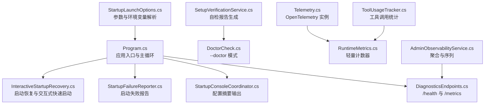
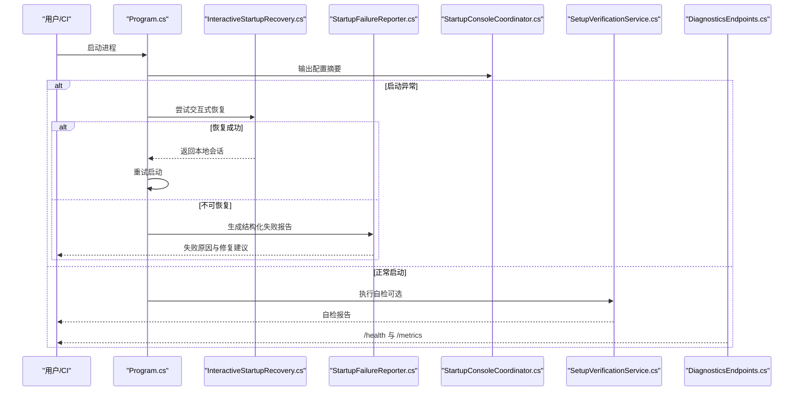
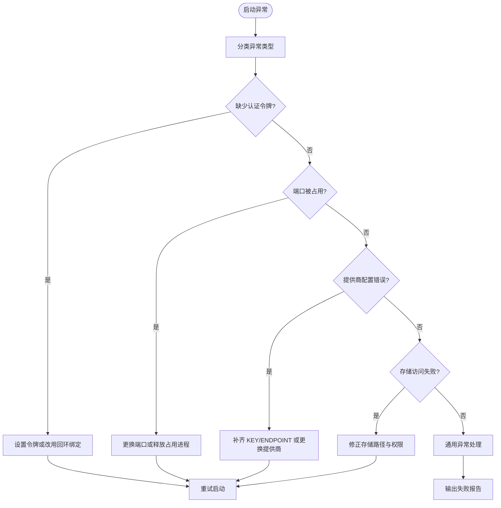
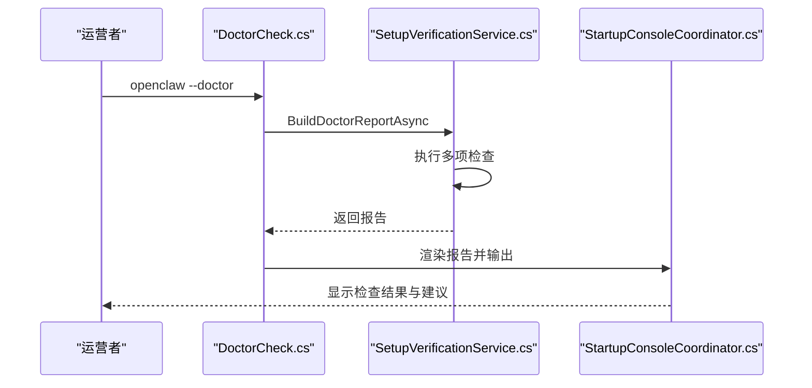
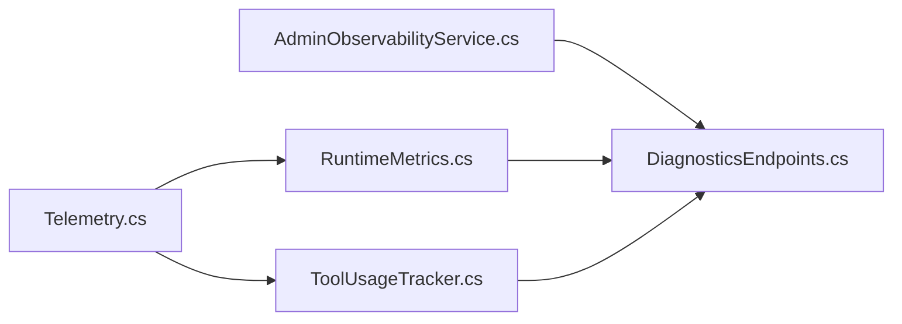
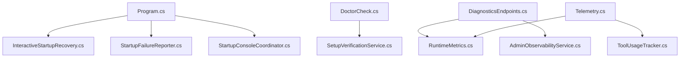

# 故障排除

<cite>
**本文引用的文件**
- [Program.cs](file://src/OpenClaw.Gateway/Program.cs)
- [StartupFailureReporter.cs](file://src/OpenClaw.Gateway/Bootstrap/StartupFailureReporter.cs)
- [InteractiveStartupRecovery.cs](file://src/OpenClaw.Gateway/Bootstrap/InteractiveStartupRecovery.cs)
- [StartupLaunchOptions.cs](file://src/OpenClaw.Gateway/Bootstrap/StartupLaunchOptions.cs)
- [StartupConsoleCoordinator.cs](file://src/OpenClaw.Gateway/Bootstrap/StartupConsoleCoordinator.cs)
- [DoctorCheck.cs](file://src/OpenClaw.Core/Validation/DoctorCheck.cs)
- [SetupVerificationService.cs](file://src/OpenClaw.Core/Validation/SetupVerificationService.cs)
- [ConfigurationDiagnostics.cs](file://src/OpenClaw.Core/Models/ConfigurationDiagnostics.cs)
- [Telemetry.cs](file://src/OpenClaw.Core/Observability/Telemetry.cs)
- [RuntimeMetrics.cs](file://src/OpenClaw.Core/Observability/RuntimeMetrics.cs)
- [ToolUsageTracker.cs](file://src/OpenClaw.Core/Observability/ToolUsageTracker.cs)
- [AdminObservabilityService.cs](file://src/OpenClaw.Gateway/AdminObservabilityService.cs)
- [DiagnosticsEndpoints.cs](file://src/OpenClaw.Gateway/Endpoints/DiagnosticsEndpoints.cs)
- [appsettings.Development.json](file://Kingcrab.AppHost/appsettings.Development.json)
- [appsettings.json](file://Kingcrab.AppHost/appsettings.json)
- [GatewayLlmExecutionService.cs](file://src/OpenClaw.Gateway/GatewayLlmExecutionService.cs)
- [show-errors.ps1](file://scripts/migration/show-errors.ps1)
</cite>

## 目录
1. [简介](#简介)
2. [项目结构](#项目结构)
3. [核心组件](#核心组件)
4. [架构总览](#架构总览)
5. [详细组件分析](#详细组件分析)
6. [依赖关系分析](#依赖关系分析)
7. [性能考虑](#性能考虑)
8. [故障排除指南](#故障排除指南)
9. [结论](#结论)
10. [附录](#附录)

## 简介
本指南面向 OpenClaw.NET 运营商与运维人员，提供系统化的故障排除流程与方法，覆盖启动失败、运行时错误、性能问题与集成故障等场景。内容包括：
- 启动阶段：快速诊断与自动恢复、交互式快速启动、配置来源与环境变量解析
- 运行阶段：可观测性指标、日志配置、健康检查与指标导出
- 性能问题：工具执行耗时、令牌统计、会话与保留策略监控
- 集成故障：LLM 提供商错误分类、通道与 MCP 服务器状态、浏览器工具可用性

## 项目结构
OpenClaw.NET 的故障排除能力由“启动诊断 + 运行时可观测 + 健康与指标端点”三部分组成：
- 启动阶段：Program 负责主循环与异常捕获；InteractiveStartupRecovery 提供交互式本地恢复；StartupFailureReporter 输出结构化失败报告
- 运行阶段：Telemetry/Metrics/ToolUsageTracker 提供指标与追踪；DiagnosticsEndpoints 暴露健康与指标接口；AdminObservabilityService 提供仪表盘级聚合
- 配置与诊断：StartupLaunchOptions 解析参数与环境变量；StartupConsoleCoordinator 输出配置摘要；SetupVerificationService/DoctorCheck 提供自检能力

**图表来源**
- [Program.cs:1-124](file://src/OpenClaw.Gateway/Program.cs#L1-L124)
- [InteractiveStartupRecovery.cs:1-336](file://src/OpenClaw.Gateway/Bootstrap/InteractiveStartupRecovery.cs#L1-L336)
- [StartupFailureReporter.cs:1-283](file://src/OpenClaw.Gateway/Bootstrap/StartupFailureReporter.cs#L1-L283)
- [StartupConsoleCoordinator.cs:1-40](file://src/OpenClaw.Gateway/Bootstrap/StartupConsoleCoordinator.cs#L1-L40)
- [DiagnosticsEndpoints.cs:51-80](file://src/OpenClaw.Gateway/Endpoints/DiagnosticsEndpoints.cs#L51-L80)
- [StartupLaunchOptions.cs:1-122](file://src/OpenClaw.Gateway/Bootstrap/StartupLaunchOptions.cs#L1-L122)
- [SetupVerificationService.cs:1-800](file://src/OpenClaw.Core/Validation/SetupVerificationService.cs#L1-L800)
- [DoctorCheck.cs:1-39](file://src/OpenClaw.Core/Validation/DoctorCheck.cs#L1-L39)
- [Telemetry.cs:1-54](file://src/OpenClaw.Core/Observability/Telemetry.cs#L1-L54)
- [RuntimeMetrics.cs:1-312](file://src/OpenClaw.Core/Observability/RuntimeMetrics.cs#L1-L312)
- [ToolUsageTracker.cs:1-59](file://src/OpenClaw.Core/Observability/ToolUsageTracker.cs#L1-L59)
- [AdminObservabilityService.cs:160-200](file://src/OpenClaw.Gateway/AdminObservabilityService.cs#L160-L200)

**章节来源**
- [Program.cs:1-124](file://src/OpenClaw.Gateway/Program.cs#L1-L124)
- [StartupLaunchOptions.cs:1-122](file://src/OpenClaw.Gateway/Bootstrap/StartupLaunchOptions.cs#L1-L122)
- [StartupConsoleCoordinator.cs:1-40](file://src/OpenClaw.Gateway/Bootstrap/StartupConsoleCoordinator.cs#L1-L40)
- [SetupVerificationService.cs:1-800](file://src/OpenClaw.Core/Validation/SetupVerificationService.cs#L1-L800)
- [DoctorCheck.cs:1-39](file://src/OpenClaw.Core/Validation/DoctorCheck.cs#L1-L39)
- [Telemetry.cs:1-54](file://src/OpenClaw.Core/Observability/Telemetry.cs#L1-L54)
- [RuntimeMetrics.cs:1-312](file://src/OpenClaw.Core/Observability/RuntimeMetrics.cs#L1-L312)
- [ToolUsageTracker.cs:1-59](file://src/OpenClaw.Core/Observability/ToolUsageTracker.cs#L1-L59)
- [AdminObservabilityService.cs:160-200](file://src/OpenClaw.Gateway/AdminObservabilityService.cs#L160-L200)
- [DiagnosticsEndpoints.cs:51-80](file://src/OpenClaw.Gateway/Endpoints/DiagnosticsEndpoints.cs#L51-L80)

## 核心组件
- 启动恢复与交互式快速启动
  - 通过 InteractiveStartupRecovery 在启动异常时提示并应用最小化本地配置（回环绑定、文件内存、可写工作区），支持端口冲突自动调整与 API Key/Endpoint 交互输入
- 启动失败报告
  - StartupFailureReporter 将异常归类为端口占用、认证令牌缺失、提供商配置错误、存储访问权限等问题，并给出修复建议
- 自检与诊断
  - DoctorCheck 与 SetupVerificationService 组合执行配置、工作区、安全姿态、模型选择、插件与 MCP、浏览器工具、存储空间等检查，输出结构化报告
- 可观测性
  - Telemetry 提供集中式 ActivitySource 与 Meter；RuntimeMetrics 提供轻量计数器与快照；ToolUsageTracker 记录工具调用次数、失败与超时；AdminObservabilityService 聚合审批、自动化、通道漂移等指标
- 健康与指标端点
  - DiagnosticsEndpoints 暴露 /health 与 /metrics，支持操作员授权访问，返回运行时指标快照

**章节来源**
- [InteractiveStartupRecovery.cs:1-336](file://src/OpenClaw.Gateway/Bootstrap/InteractiveStartupRecovery.cs#L1-L336)
- [StartupFailureReporter.cs:1-283](file://src/OpenClaw.Gateway/Bootstrap/StartupFailureReporter.cs#L1-L283)
- [DoctorCheck.cs:1-39](file://src/OpenClaw.Core/Validation/DoctorCheck.cs#L1-L39)
- [SetupVerificationService.cs:1-800](file://src/OpenClaw.Core/Validation/SetupVerificationService.cs#L1-L800)
- [Telemetry.cs:1-54](file://src/OpenClaw.Core/Observability/Telemetry.cs#L1-L54)
- [RuntimeMetrics.cs:1-312](file://src/OpenClaw.Core/Observability/RuntimeMetrics.cs#L1-L312)
- [ToolUsageTracker.cs:1-59](file://src/OpenClaw.Core/Observability/ToolUsageTracker.cs#L1-L59)
- [AdminObservabilityService.cs:160-200](file://src/OpenClaw.Gateway/AdminObservabilityService.cs#L160-L200)
- [DiagnosticsEndpoints.cs:51-80](file://src/OpenClaw.Gateway/Endpoints/DiagnosticsEndpoints.cs#L51-L80)

## 架构总览
下图展示启动到运行的关键路径与诊断组件协作关系。

**图表来源**
- [Program.cs:1-124](file://src/OpenClaw.Gateway/Program.cs#L1-L124)
- [InteractiveStartupRecovery.cs:1-336](file://src/OpenClaw.Gateway/Bootstrap/InteractiveStartupRecovery.cs#L1-L336)
- [StartupFailureReporter.cs:1-283](file://src/OpenClaw.Gateway/Bootstrap/StartupFailureReporter.cs#L1-L283)
- [StartupConsoleCoordinator.cs:1-40](file://src/OpenClaw.Gateway/Bootstrap/StartupConsoleCoordinator.cs#L1-L40)
- [SetupVerificationService.cs:1-800](file://src/OpenClaw.Core/Validation/SetupVerificationService.cs#L1-L800)
- [DiagnosticsEndpoints.cs:51-80](file://src/OpenClaw.Gateway/Endpoints/DiagnosticsEndpoints.cs#L51-L80)

## 详细组件分析

### 启动失败报告与恢复
- 失败分类
  - 认证令牌：当绑定非回环地址且未设置令牌时，引导设置令牌或改为回环绑定
  - 端口占用：识别 AddressInUseException 或相关消息，建议更换端口
  - 提供商配置：缺失 KEY/ENDPOINT 或不支持的提供商，引导检查凭据与端点
  - 存储访问：只读文件系统、权限不足、路径不可访问，引导修正存储路径与权限
- 恢复流程
  - InteractiveStartupRecovery 支持 Quickstart 与 Recovery 两种模式：前者仅本次有效，后者允许交互输入关键参数后重试

**图表来源**
- [StartupFailureReporter.cs:52-283](file://src/OpenClaw.Gateway/Bootstrap/StartupFailureReporter.cs#L52-L283)
- [InteractiveStartupRecovery.cs:296-336](file://src/OpenClaw.Gateway/Bootstrap/InteractiveStartupRecovery.cs#L296-L336)

**章节来源**
- [StartupFailureReporter.cs:1-283](file://src/OpenClaw.Gateway/Bootstrap/StartupFailureReporter.cs#L1-L283)
- [InteractiveStartupRecovery.cs:1-336](file://src/OpenClaw.Gateway/Bootstrap/InteractiveStartupRecovery.cs#L1-L336)

### 自检与诊断（--doctor）
- 检查范围
  - 配置静态校验、配置源诊断、提示缓存兼容性、模型配置一致性、工作区就绪、文件系统根策略、安全姿态、浏览器工具可用性、运营者就绪度、模型医生、插件运行时与依赖、MCP 服务器、通道、OpenSandbox、存储可写与空间
- 报告渲染
  - DoctorCheck.RunAsync 调用 SetupVerificationService.BuildDoctorReportAsync 并渲染文本报告，输出总体状态与推荐下一步动作

**图表来源**
- [DoctorCheck.cs:1-39](file://src/OpenClaw.Core/Validation/DoctorCheck.cs#L1-L39)
- [SetupVerificationService.cs:83-164](file://src/OpenClaw.Core/Validation/SetupVerificationService.cs#L83-L164)
- [StartupConsoleCoordinator.cs:15-37](file://src/OpenClaw.Gateway/Bootstrap/StartupConsoleCoordinator.cs#L15-L37)

**章节来源**
- [DoctorCheck.cs:1-39](file://src/OpenClaw.Core/Validation/DoctorCheck.cs#L1-L39)
- [SetupVerificationService.cs:1-800](file://src/OpenClaw.Core/Validation/SetupVerificationService.cs#L1-L800)
- [ConfigurationDiagnostics.cs:1-16](file://src/OpenClaw.Core/Models/ConfigurationDiagnostics.cs#L1-L16)
- [StartupConsoleCoordinator.cs:1-40](file://src/OpenClaw.Gateway/Bootstrap/StartupConsoleCoordinator.cs#L1-L40)

### 可观测性与指标
- 指标体系
  - Telemetry：集中式 ActivitySource 与 Meter，注册工具执行时延直方图、限流计数器、待审批队列深度等
  - RuntimeMetrics：轻量计数器与快照，涵盖请求、LLM 调用、工具调用、会话、保留、脉冲等
  - ToolUsageTracker：按工具维度统计调用次数、失败、超时与总耗时
  - AdminObservabilityService：聚合审批生命周期、自动化运行、通道就绪度、活跃会话等
- 指标端点
  - /health：健康状态与运行时长
  - /metrics：运行时指标快照
  - /metrics/providers：按路由聚合的提供商错误与重试

**图表来源**
- [Telemetry.cs:1-54](file://src/OpenClaw.Core/Observability/Telemetry.cs#L1-L54)
- [RuntimeMetrics.cs:1-312](file://src/OpenClaw.Core/Observability/RuntimeMetrics.cs#L1-L312)
- [ToolUsageTracker.cs:1-59](file://src/OpenClaw.Core/Observability/ToolUsageTracker.cs#L1-L59)
- [AdminObservabilityService.cs:160-200](file://src/OpenClaw.Gateway/AdminObservabilityService.cs#L160-L200)
- [DiagnosticsEndpoints.cs:51-80](file://src/OpenClaw.Gateway/Endpoints/DiagnosticsEndpoints.cs#L51-L80)

**章节来源**
- [Telemetry.cs:1-54](file://src/OpenClaw.Core/Observability/Telemetry.cs#L1-L54)
- [RuntimeMetrics.cs:1-312](file://src/OpenClaw.Core/Observability/RuntimeMetrics.cs#L1-L312)
- [ToolUsageTracker.cs:1-59](file://src/OpenClaw.Core/Observability/ToolUsageTracker.cs#L1-L59)
- [AdminObservabilityService.cs:160-200](file://src/OpenClaw.Gateway/AdminObservabilityService.cs#L160-L200)
- [DiagnosticsEndpoints.cs:51-80](file://src/OpenClaw.Gateway/Endpoints/DiagnosticsEndpoints.cs#L51-L80)

### 日志配置与分析
- 默认日志级别
  - Development 与 AppHost 默认日志级别为 Information，ASP.NET Core 降为 Warning，便于聚焦关键事件
- 日志分析技巧
  - 使用脚本过滤特定错误：如迁移脚本中的错误行提取，可用于定位编译或构建期问题
  - 结合启动失败报告与自检报告，定位配置源与环境变量冲突

**章节来源**
- [appsettings.Development.json:1-8](file://Kingcrab.AppHost/appsettings.Development.json#L1-L8)
- [appsettings.json:1-9](file://Kingcrab.AppHost/appsettings.json#L1-L9)
- [show-errors.ps1:35-48](file://scripts/migration/show-errors.ps1#L35-L48)

## 依赖关系分析
- 组件耦合
  - Program 依赖启动恢复与失败报告模块；DoctorCheck 依赖 SetupVerificationService；指标端点依赖 RuntimeMetrics 与 AdminObservabilityService
- 关键依赖链
  - 启动异常 → InteractiveStartupRecovery → StartupFailureReporter → 用户反馈
  - --doctor → SetupVerificationService → DoctorCheck → 控制台输出
  - 运行时 → Telemetry/RuntimeMetrics/ToolUsageTracker → /metrics

**图表来源**
- [Program.cs:1-124](file://src/OpenClaw.Gateway/Program.cs#L1-L124)
- [InteractiveStartupRecovery.cs:1-336](file://src/OpenClaw.Gateway/Bootstrap/InteractiveStartupRecovery.cs#L1-L336)
- [StartupFailureReporter.cs:1-283](file://src/OpenClaw.Gateway/Bootstrap/StartupFailureReporter.cs#L1-L283)
- [StartupConsoleCoordinator.cs:1-40](file://src/OpenClaw.Gateway/Bootstrap/StartupConsoleCoordinator.cs#L1-L40)
- [DoctorCheck.cs:1-39](file://src/OpenClaw.Core/Validation/DoctorCheck.cs#L1-L39)
- [SetupVerificationService.cs:1-800](file://src/OpenClaw.Core/Validation/SetupVerificationService.cs#L1-L800)
- [DiagnosticsEndpoints.cs:51-80](file://src/OpenClaw.Gateway/Endpoints/DiagnosticsEndpoints.cs#L51-L80)
- [RuntimeMetrics.cs:1-312](file://src/OpenClaw.Core/Observability/RuntimeMetrics.cs#L1-L312)
- [AdminObservabilityService.cs:160-200](file://src/OpenClaw.Gateway/AdminObservabilityService.cs#L160-L200)
- [Telemetry.cs:1-54](file://src/OpenClaw.Core/Observability/Telemetry.cs#L1-L54)
- [ToolUsageTracker.cs:1-59](file://src/OpenClaw.Core/Observability/ToolUsageTracker.cs#L1-L59)

**章节来源**
- [Program.cs:1-124](file://src/OpenClaw.Gateway/Program.cs#L1-L124)
- [SetupVerificationService.cs:1-800](file://src/OpenClaw.Core/Validation/SetupVerificationService.cs#L1-L800)
- [DiagnosticsEndpoints.cs:51-80](file://src/OpenClaw.Gateway/Endpoints/DiagnosticsEndpoints.cs#L51-L80)

## 性能考虑
- 工具执行性能
  - 使用 ToolUsageTracker 记录每个工具的调用次数、失败与超时，结合 Telemetry 的直方图进行耗时分析
- LLM 与令牌统计
  - RuntimeMetrics 提供输入/输出令牌、重试与错误计数，辅助评估成本与稳定性
- 会话与保留
  - 监控会话缓存命中、保留清理运行次数与失败数，避免内存压力导致的性能退化

[本节为通用指导，无需具体文件来源]

## 故障排除指南

### 启动失败
- 现象
  - 应用在启动阶段退出，控制台显示失败原因
- 排查步骤
  1) 查看启动失败报告：程序捕获异常后调用 StartupFailureReporter 输出结构化报告，包含标题、摘要、详情与建议修复项
  2) 端口占用：若提示端口被占用，尝试更换端口或释放占用进程
  3) 认证令牌：绑定非回环地址需设置认证令牌，否则改为回环绑定
  4) 提供商配置：检查 MODEL_PROVIDER_KEY 与 MODEL_PROVIDER_ENDPOINT 是否正确
  5) 存储访问：确认 Memory.StoragePath 可写且无只读/权限问题
  6) 交互式恢复：在交互终端中选择“应用最小本地设置”，系统会自动创建工作区与内存目录并重试启动
- 修复建议
  - 修改环境变量或配置文件，确保端口未被占用、令牌已设置、提供商凭据完整、存储路径可写
  - 使用 --quickstart 或 --doctor 辅助快速验证与修复

**章节来源**
- [Program.cs:99-123](file://src/OpenClaw.Gateway/Program.cs#L99-L123)
- [StartupFailureReporter.cs:52-283](file://src/OpenClaw.Gateway/Bootstrap/StartupFailureReporter.cs#L52-L283)
- [InteractiveStartupRecovery.cs:72-150](file://src/OpenClaw.Gateway/Bootstrap/InteractiveStartupRecovery.cs#L72-L150)

### 运行时错误
- 现象
  - 应用已启动但出现功能异常或服务不可用
- 排查步骤
  1) 健康检查：访问 /health，确认返回 ready；若 503，则检查会话管理器初始化与资源可用性
  2) 指标快照：访问 /metrics 获取当前运行时指标，关注工具调用失败、超时、LLM 错误与重试
  3) 审批与自动化：通过 AdminObservabilityService 聚合的序列查看审批生命周期与自动化运行状态
  4) LLM 错误分类：GatewayLlmExecutionService 对提供商错误进行分类与标记，便于定位上游问题
- 修复建议
  - 优化工具调用策略、增加超时与重试配置、检查提供商配额与网络连通性
  - 调整会话容量与保留策略，减少内存压力

**章节来源**
- [DiagnosticsEndpoints.cs:51-80](file://src/OpenClaw.Gateway/Endpoints/DiagnosticsEndpoints.cs#L51-L80)
- [RuntimeMetrics.cs:1-312](file://src/OpenClaw.Core/Observability/RuntimeMetrics.cs#L1-L312)
- [AdminObservabilityService.cs:160-200](file://src/OpenClaw.Gateway/AdminObservabilityService.cs#L160-L200)
- [GatewayLlmExecutionService.cs:816-849](file://src/OpenClaw.Gateway/GatewayLlmExecutionService.cs#L816-L849)

### 性能问题
- 现象
  - 工具执行缓慢、会话卡顿、令牌消耗异常
- 排查步骤
  1) 工具耗时：通过 ToolUsageTracker 的 Snapshot 按调用次数排序，识别慢工具
  2) 指标趋势：使用 /metrics/providers 观察提供商错误与重试趋势，定位瓶颈
  3) 会话与保留：关注会话缓存命中率与保留清理失败数
- 修复建议
  - 优化工具实现、增加并发限制、启用缓存与预热、调整保留策略

**章节来源**
- [ToolUsageTracker.cs:1-59](file://src/OpenClaw.Core/Observability/ToolUsageTracker.cs#L1-L59)
- [DiagnosticsEndpoints.cs:78-80](file://src/OpenClaw.Gateway/Endpoints/DiagnosticsEndpoints.cs#L78-L80)
- [RuntimeMetrics.cs:1-312](file://src/OpenClaw.Core/Observability/RuntimeMetrics.cs#L1-L312)

### 集成故障
- 现象
  - 通道不通、MCP 服务器不可达、浏览器工具不可用
- 排查步骤
  1) 通道与 MCP：DoctorCheck 会检查通道与 MCP 服务器配置，关注是否启用、URL 是否有效
  2) 浏览器工具：检查浏览器工具是否启用、执行后端是否可用、是否需要沙箱或非本地执行
  3) 插件与 Node.js：若启用桥接插件，需确保 Node.js 可用
- 修复建议
  - 修正通道与 MCP 配置、启用合适的执行后端、安装 Node.js 或禁用桥接插件

**章节来源**
- [SetupVerificationService.cs:774-802](file://src/OpenClaw.Core/Validation/SetupVerificationService.cs#L774-L802)
- [SetupVerificationService.cs:540-580](file://src/OpenClaw.Core/Validation/SetupVerificationService.cs#L540-L580)
- [SetupVerificationService.cs:739-772](file://src/OpenClaw.Core/Validation/SetupVerificationService.cs#L739-L772)

### 调试工具与日志配置
- 调试工具
  - --doctor：执行全面自检，输出检查项、警告与建议
  - --quickstart：交互式最小化本地配置，快速验证
  - /health 与 /metrics：运行时健康与指标查询
- 日志配置
  - Development 与 AppHost 默认日志级别为 Information，ASP.NET Core 为 Warning
  - 使用脚本过滤错误行，辅助定位构建或迁移问题

**章节来源**
- [StartupLaunchOptions.cs:57-88](file://src/OpenClaw.Gateway/Bootstrap/StartupLaunchOptions.cs#L57-L88)
- [DoctorCheck.cs:1-39](file://src/OpenClaw.Core/Validation/DoctorCheck.cs#L1-L39)
- [DiagnosticsEndpoints.cs:51-80](file://src/OpenClaw.Gateway/Endpoints/DiagnosticsEndpoints.cs#L51-L80)
- [appsettings.Development.json:1-8](file://Kingcrab.AppHost/appsettings.Development.json#L1-L8)
- [appsettings.json:1-9](file://Kingcrab.AppHost/appsettings.json#L1-L9)
- [show-errors.ps1:35-48](file://scripts/migration/show-errors.ps1#L35-L48)

## 结论
通过启动阶段的交互式恢复与失败报告、运行阶段的可观测性指标与健康端点、以及全面的自检能力，OpenClaw.NET 提供了从诊断到修复的一体化故障排除方案。建议在日常运维中结合 --doctor 与 /metrics 定期巡检，遇到启动问题优先使用 --quickstart 快速验证，再逐步收敛到生产配置。

[本节为总结，无需具体文件来源]

## 附录

### 常见错误信息与修复对照
- “必须设置认证令牌”
  - 修复：设置 OPENCLAW_AUTH_TOKEN 或改为回环绑定
- “端口已被占用”
  - 修复：更换端口或释放占用进程
- “必须设置 PROVIDER_KEY/ENDPOINT”
  - 修复：补齐凭据或端点
- “存储路径不可访问/只读”
  - 修复：修正路径权限或存储介质

**章节来源**
- [StartupFailureReporter.cs:61-74](file://src/OpenClaw.Gateway/Bootstrap/StartupFailureReporter.cs#L61-L74)
- [InteractiveStartupRecovery.cs:111-116](file://src/OpenClaw.Gateway/Bootstrap/InteractiveStartupRecovery.cs#L111-L116)