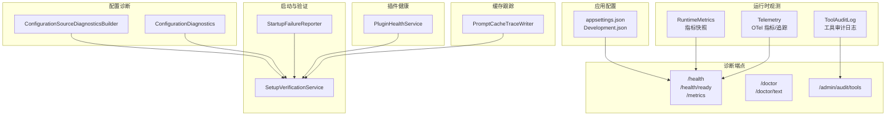
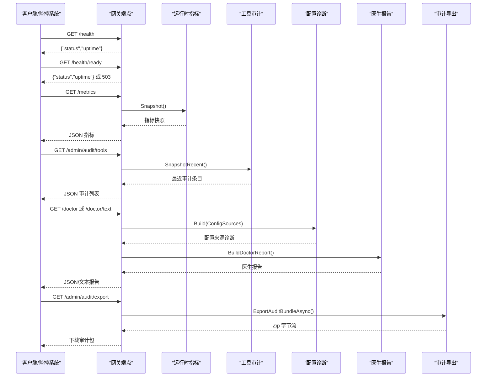
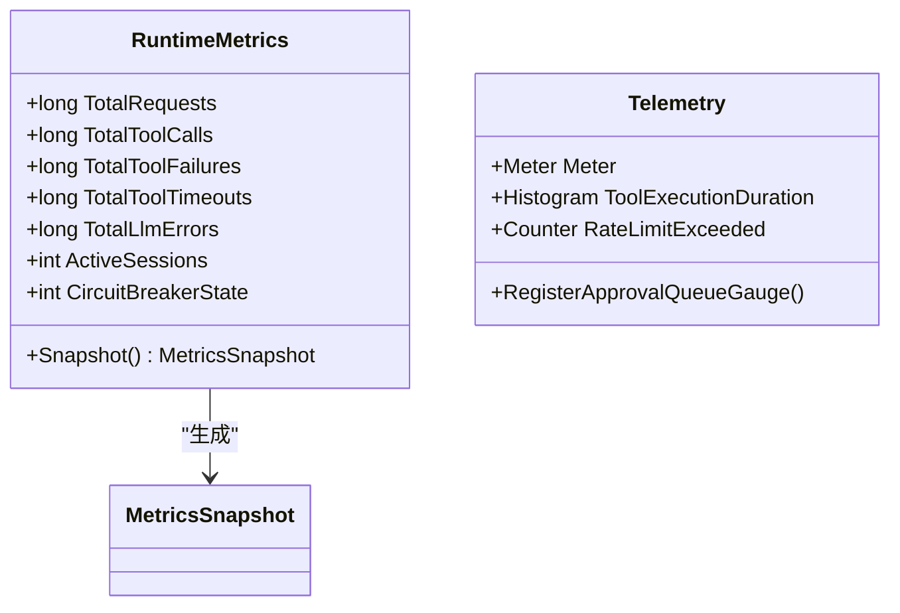
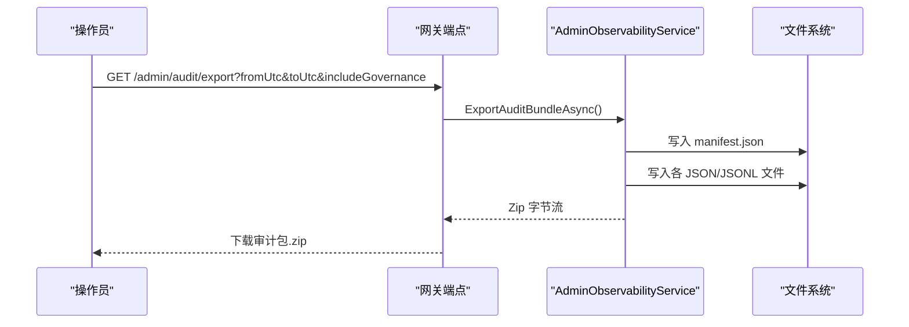
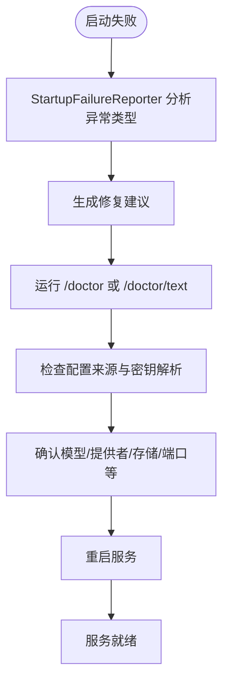
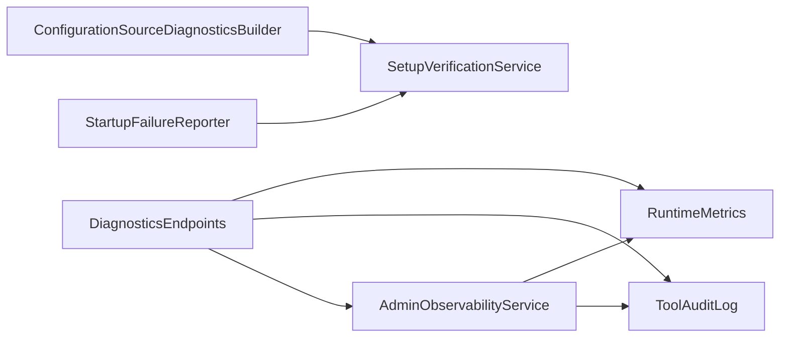

# 日志和诊断

<cite>
**本文引用的文件**
- [appsettings.json](file://Kingcrab.AppHost/appsettings.json)
- [appsettings.Development.json](file://Kingcrab.AppHost/appsettings.Development.json)
- [DiagnosticsEndpoints.cs](file://src/OpenClaw.Gateway/Endpoints/DiagnosticsEndpoints.cs)
- [AdminObservabilityService.cs](file://src/OpenClaw.Gateway/AdminObservabilityService.cs)
- [RuntimeMetrics.cs](file://src/OpenClaw.Core/Observability/RuntimeMetrics.cs)
- [Telemetry.cs](file://src/OpenClaw.Core/Observability/Telemetry.cs)
- [ToolAuditLog.cs](file://src/OpenClaw.Core/Observability/ToolAuditLog.cs)
- [ConfigurationSourceDiagnosticsBuilder.cs](file://src/OpenClaw.Gateway/Bootstrap/ConfigurationSourceDiagnosticsBuilder.cs)
- [ConfigurationDiagnostics.cs](file://src/OpenClaw.Core/Models/ConfigurationDiagnostics.cs)
- [SetupVerificationService.cs](file://src/OpenClaw.Core/Validation/SetupVerificationService.cs)
- [GatewayLlmExecutionService.cs](file://src/OpenClaw.Gateway/GatewayLlmExecutionService.cs)
- [StartupFailureReporter.cs](file://src/OpenClaw.Gateway/Bootstrap/StartupFailureReporter.cs)
- [PluginHealthService.cs](file://src/OpenClaw.Gateway/PluginHealthService.cs)
- [PromptCacheTraceWriter.cs](file://src/OpenClaw.Gateway/PromptCaching/PromptCacheTraceWriter.cs)
- [OpenClawToolExecutorTests.cs](file://src/OpenClaw.Tests/OpenClawToolExecutorTests.cs)
</cite>

## 目录
1. [简介](#简介)
2. [项目结构](#项目结构)
3. [核心组件](#核心组件)
4. [架构总览](#架构总览)
5. [详细组件分析](#详细组件分析)
6. [依赖关系分析](#依赖关系分析)
7. [性能考量](#性能考量)
8. [故障排查指南](#故障排查指南)
9. [结论](#结论)
10. [附录](#附录)

## 简介
本指南面向 OpenClaw.NET 的运维与开发人员，系统性介绍日志与诊断体系：包括日志配置与级别、运行时指标与告警、内置诊断工具与导出能力、日志查询与分析技巧，以及性能分析与调试方法。文档以代码为依据，辅以可视化图示，帮助快速定位问题并建立可操作的监控与告警实践。

## 项目结构
围绕日志与诊断的关键模块分布如下：
- 配置与日志级别：应用启动配置中的 Logging 节点控制默认与子系统的日志级别。
- 运行时指标：RuntimeMetrics 提供轻量级计数器与仪表快照；Telemetry 提供 OpenTelemetry 指标与追踪源。
- 诊断端点：/health、/metrics、/doctor、/admin/audit/tools 等端点提供健康检查、指标导出与审计查看。
- 审计与导出：ToolAuditLog 记录工具调用审计；AdminObservabilityService 支持审计包导出与轨迹导出。
- 配置诊断：ConfigurationSourceDiagnosticsBuilder 解析配置来源与密钥解析状态，辅助定位配置问题。
- 启动诊断：StartupFailureReporter 分析启动失败原因并给出修复建议；SetupVerificationService 生成“医生报告”。
- 插件健康：PluginHealthService 基于预算与遥测评估插件健康度。
- 缓存跟踪：PromptCacheTraceWriter 提供提示词缓存命中/未命中等跟踪输出。

图表来源
- [appsettings.json:1-9](file://Kingcrab.AppHost/appsettings.json#L1-L9)
- [appsettings.Development.json:1-8](file://Kingcrab.AppHost/appsettings.Development.json#L1-L8)
- [DiagnosticsEndpoints.cs:32-191](file://src/OpenClaw.Gateway/Endpoints/DiagnosticsEndpoints.cs#L32-L191)
- [RuntimeMetrics.cs:10-251](file://src/OpenClaw.Core/Observability/RuntimeMetrics.cs#L10-L251)
- [Telemetry.cs:9-53](file://src/OpenClaw.Core/Observability/Telemetry.cs#L9-L53)
- [ToolAuditLog.cs:39-114](file://src/OpenClaw.Core/Observability/ToolAuditLog.cs#L39-L114)
- [ConfigurationSourceDiagnosticsBuilder.cs:13-86](file://src/OpenClaw.Gateway/Bootstrap/ConfigurationSourceDiagnosticsBuilder.cs#L13-L86)
- [ConfigurationDiagnostics.cs:3-15](file://src/OpenClaw.Core/Models/ConfigurationDiagnostics.cs#L3-L15)
- [SetupVerificationService.cs:83-164](file://src/OpenClaw.Core/Validation/SetupVerificationService.cs#L83-L164)
- [StartupFailureReporter.cs:20-50](file://src/OpenClaw.Gateway/Bootstrap/StartupFailureReporter.cs#L20-L50)
- [PluginHealthService.cs:306-340](file://src/OpenClaw.Gateway/PluginHealthService.cs#L306-L340)
- [PromptCacheTraceWriter.cs:66-92](file://src/OpenClaw.Gateway/PromptCaching/PromptCacheTraceWriter.cs#L66-L92)

章节来源
- [appsettings.json:1-9](file://Kingcrab.AppHost/appsettings.json#L1-L9)
- [appsettings.Development.json:1-8](file://Kingcrab.AppHost/appsettings.Development.json#L1-L8)
- [DiagnosticsEndpoints.cs:18-192](file://src/OpenClaw.Gateway/Endpoints/DiagnosticsEndpoints.cs#L18-L192)

## 核心组件
- 日志配置与级别
  - 默认级别与子系统级别在 appsettings 中集中定义，便于按环境调整。
  - 开发环境与生产环境分别提供默认日志级别，避免过度噪声。
- 运行时指标
  - RuntimeMetrics 提供线程安全的计数器与仪表（如请求总量、工具调用失败/超时、会话缓存命中/缺失、提示词缓存读写等），支持快照导出。
  - Telemetry 提供 OpenTelemetry 指标与活动源，包含工具执行时长直方图、限流触发计数、审批队列深度等可观测指标。
- 审计与导出
  - ToolAuditLog 记录工具调用关键元数据（耗时、是否失败/超时、治理策略结果等），并维护最近条目缓冲，支持 JSON Lines 文件落盘。
  - AdminObservabilityService 支持导出审计包（Zip 包含多类 JSON/JSONL 文件）与会话轨迹（Trajectory）导出，便于离线分析与合规审计。
- 配置诊断
  - ConfigurationSourceDiagnosticsBuilder 解析配置来源（文件、环境变量、命令行、内存覆盖），并描述密钥引用解析状态，辅助定位配置错误。
- 启动与验证
  - StartupFailureReporter 将常见启动失败归类并给出修复建议（如鉴权令牌、端口占用、存储权限、模型提供者配置等）。
  - SetupVerificationService 构建“医生报告”，涵盖配置、工作区、安全基线、浏览器能力、操作员就绪度、模型选择、插件运行时与依赖、通道与 MCP、OpenSandbox、TailScale 等检查项。
- 插件健康
  - PluginHealthService 基于重启次数、内存快照、兼容性诊断数量等预算约束评估插件健康度，并支持隔离与阻断。
- 缓存跟踪
  - PromptCacheTraceWriter 在启用时输出提示词缓存命中/未命中等跟踪信息，支持通过环境变量或配置开关控制输出路径与内容。

章节来源
- [RuntimeMetrics.cs:10-311](file://src/OpenClaw.Core/Observability/RuntimeMetrics.cs#L10-L311)
- [Telemetry.cs:9-53](file://src/OpenClaw.Core/Observability/Telemetry.cs#L9-L53)
- [ToolAuditLog.cs:39-124](file://src/OpenClaw.Core/Observability/ToolAuditLog.cs#L39-L124)
- [AdminObservabilityService.cs:229-307](file://src/OpenClaw.Gateway/AdminObservabilityService.cs#L229-L307)
- [ConfigurationSourceDiagnosticsBuilder.cs:13-161](file://src/OpenClaw.Gateway/Bootstrap/ConfigurationSourceDiagnosticsBuilder.cs#L13-L161)
- [SetupVerificationService.cs:83-164](file://src/OpenClaw.Core/Validation/SetupVerificationService.cs#L83-L164)
- [StartupFailureReporter.cs:52-282](file://src/OpenClaw.Gateway/Bootstrap/StartupFailureReporter.cs#L52-L282)
- [PluginHealthService.cs:306-340](file://src/OpenClaw.Gateway/PluginHealthService.cs#L306-L340)
- [PromptCacheTraceWriter.cs:66-92](file://src/OpenClaw.Gateway/PromptCaching/PromptCacheTraceWriter.cs#L66-L92)

## 架构总览
下图展示诊断与日志相关组件之间的交互关系，包括配置来源、健康检查、指标采集、审计记录与导出流程。

图表来源
- [DiagnosticsEndpoints.cs:32-191](file://src/OpenClaw.Gateway/Endpoints/DiagnosticsEndpoints.cs#L32-L191)
- [AdminObservabilityService.cs:229-307](file://src/OpenClaw.Gateway/AdminObservabilityService.cs#L229-L307)
- [RuntimeMetrics.cs:192-250](file://src/OpenClaw.Core/Observability/RuntimeMetrics.cs#L192-L250)
- [ToolAuditLog.cs:97-114](file://src/OpenClaw.Core/Observability/ToolAuditLog.cs#L97-L114)
- [ConfigurationSourceDiagnosticsBuilder.cs:13-86](file://src/OpenClaw.Gateway/Bootstrap/ConfigurationSourceDiagnosticsBuilder.cs#L13-L86)
- [SetupVerificationService.cs:83-164](file://src/OpenClaw.Core/Validation/SetupVerificationService.cs#L83-L164)

## 详细组件分析

### 日志配置与级别
- 配置位置
  - 生产环境：appsettings.json
  - 开发环境：appsettings.Development.json
- 关键点
  - 默认级别与子系统级别（如 Aspire.Hosting.Dcp、Microsoft.AspNetCore）可按需调整，避免噪音或遗漏重要信息。
  - 变更后需重启服务以生效；CI/CD 中建议通过环境变量或配置挂载覆盖。
- 实践建议
  - 生产环境默认 Information，关键子系统 Warning；开发环境可适度降低到 Debug/Trace 以提升可见性。
  - 对第三方库（如 Aspire.Hosting.Dcp）单独降噪，聚焦业务日志。

章节来源
- [appsettings.json:2-8](file://Kingcrab.AppHost/appsettings.json#L2-L8)
- [appsettings.Development.json:2-7](file://Kingcrab.AppHost/appsettings.Development.json#L2-L7)

### 运行时指标与告警
- 指标来源
  - RuntimeMetrics：计数器（单调递增）与仪表（当前值），支持快照导出。
  - Telemetry：OpenTelemetry 指标（直方图、计数器、可观测仪表），用于外部监控系统集成。
- 关键指标说明（节选）
  - 请求总量、LLM 调用次数、输入/输出 token、工具调用次数、失败/超时、会话缓存命中/缺失、提示词缓存读写、脉冲运行统计、保留策略执行状态等。
- 告警阈值建议（示例）
  - 工具失败率：连续 5 分钟平均超过 5%
  - LLM 错误率：单次峰值超过 10%
  - 会话缓存缺失率：超过 30%
  - 提示词缓存未命中率：超过 50%
  - 脉冲告警数：单次运行超过 10 条
  - 进程超时/历史清理异常：单次运行超过 5 次
- 导出与消费
  - 通过 /metrics 获取 JSON 快照，结合外部监控系统（Prometheus/Grafana）建立仪表板与告警规则。

图表来源
- [RuntimeMetrics.cs:10-311](file://src/OpenClaw.Core/Observability/RuntimeMetrics.cs#L10-L311)
- [Telemetry.cs:9-53](file://src/OpenClaw.Core/Observability/Telemetry.cs#L9-L53)

章节来源
- [RuntimeMetrics.cs:10-311](file://src/OpenClaw.Core/Observability/RuntimeMetrics.cs#L10-L311)
- [Telemetry.cs:9-53](file://src/OpenClaw.Core/Observability/Telemetry.cs#L9-L53)
- [DiagnosticsEndpoints.cs:68-93](file://src/OpenClaw.Gateway/Endpoints/DiagnosticsEndpoints.cs#L68-L93)

### 审计与导出
- 工具审计
  - ToolAuditLog 记录工具调用关键字段（耗时、失败/超时、治理策略结果等），并维护最近条目缓冲；可选落盘至 JSON Lines 文件。
  - 通过 /admin/audit/tools 获取最近条目，支持限制返回数量。
- 审计包导出
  - AdminObservabilityService 支持导出包含多类 JSON/JSONL 文件的压缩包（操作员审计、运行时事件、审批历史、提供者使用、死信、会话元数据等），并生成清单文件。
  - 通过 /admin/audit/export 下载审计包，支持选择时间范围与是否包含治理数据。
- 轨迹导出
  - 支持导出会话轨迹（消息、工具调用、结果、证据、治理记录等）为 JSON Lines，便于离线复盘与合规审计。
  - 可匿名化处理敏感信息。

图表来源
- [AdminObservabilityService.cs:229-307](file://src/OpenClaw.Gateway/AdminObservabilityService.cs#L229-L307)
- [DiagnosticsEndpoints.cs:267-291](file://src/OpenClaw.Gateway/Endpoints/AdminEndpoints.Setup.cs#L267-L291)

章节来源
- [ToolAuditLog.cs:39-124](file://src/OpenClaw.Core/Observability/ToolAuditLog.cs#L39-L124)
- [DiagnosticsEndpoints.cs:95-104](file://src/OpenClaw.Gateway/Endpoints/DiagnosticsEndpoints.cs#L95-L104)
- [AdminObservabilityService.cs:229-307](file://src/OpenClaw.Gateway/AdminObservabilityService.cs#L229-L307)
- [AdminEndpoints.Setup.cs:267-291](file://src/OpenClaw.Gateway/Endpoints/AdminEndpoints.Setup.cs#L267-L291)

### 配置诊断与启动诊断
- 配置诊断
  - ConfigurationSourceDiagnosticsBuilder 解析配置来源与密钥解析状态，输出键、有效值与来源描述，辅助定位配置错误与密钥未解析问题。
- 启动诊断
  - StartupFailureReporter 将常见启动失败归类（鉴权令牌、端口占用、存储权限、模型提供者配置等），并给出修复建议。
  - SetupVerificationService 构建“医生报告”，涵盖配置、工作区、安全基线、浏览器能力、操作员就绪度、模型选择、插件运行时与依赖、通道与 MCP、OpenSandbox、TailScale 等检查项。
- 使用建议
  - 启动失败时优先查看 StartupFailureReporter 输出与 /doctor 文本报告。
  - 配置变更后，先运行 doctor 文本报告核验，再上线。

图表来源
- [StartupFailureReporter.cs:52-282](file://src/OpenClaw.Gateway/Bootstrap/StartupFailureReporter.cs#L52-L282)
- [SetupVerificationService.cs:83-164](file://src/OpenClaw.Core/Validation/SetupVerificationService.cs#L83-L164)
- [ConfigurationSourceDiagnosticsBuilder.cs:13-86](file://src/OpenClaw.Gateway/Bootstrap/ConfigurationSourceDiagnosticsBuilder.cs#L13-L86)

章节来源
- [ConfigurationSourceDiagnosticsBuilder.cs:13-161](file://src/OpenClaw.Gateway/Bootstrap/ConfigurationSourceDiagnosticsBuilder.cs#L13-L161)
- [ConfigurationDiagnostics.cs:3-15](file://src/OpenClaw.Core/Models/ConfigurationDiagnostics.cs#L3-L15)
- [StartupFailureReporter.cs:52-282](file://src/OpenClaw.Gateway/Bootstrap/StartupFailureReporter.cs#L52-L282)
- [SetupVerificationService.cs:83-164](file://src/OpenClaw.Core/Validation/SetupVerificationService.cs#L83-L164)

### 插件健康与资源预算
- 评估维度
  - 重启次数、工作集内存、兼容性诊断错误数量等。
- 预算与隔离
  - 超过预算将被标记为隔离或阻断，防止影响主系统稳定性。
- 建议
  - 结合 /metrics 中的插件桥相关指标与 PluginHealthService 报告，定期审查插件健康度。

章节来源
- [PluginHealthService.cs:306-340](file://src/OpenClaw.Gateway/PluginHealthService.cs#L306-L340)

### 缓存跟踪与性能分析
- 提示词缓存跟踪
  - 通过环境变量或配置开关控制缓存跟踪的启用、提示内容包含与输出路径，默认输出到 logs/cache-trace.jsonl。
- 性能分析
  - 结合 Telemetry 的工具执行时长直方图与 RuntimeMetrics 的工具调用失败/超时统计，定位热点工具与异常行为。
- 建议
  - 在压测或高负载场景开启缓存跟踪，配合 /metrics 观察缓存命中率变化。

章节来源
- [PromptCacheTraceWriter.cs:66-92](file://src/OpenClaw.Gateway/PromptCaching/PromptCacheTraceWriter.cs#L66-L92)
- [Telemetry.cs:26-40](file://src/OpenClaw.Core/Observability/Telemetry.cs#L26-L40)
- [RuntimeMetrics.cs:10-311](file://src/OpenClaw.Core/Observability/RuntimeMetrics.cs#L10-L311)

## 依赖关系分析
- 组件耦合
  - DiagnosticsEndpoints 依赖运行时指标与审计日志；AdminObservabilityService 依赖运行时存储与策略服务；配置诊断与启动诊断相互补充。
- 外部依赖
  - OpenTelemetry 指标与追踪；JSON 序列化上下文；文件系统（审计日志与导出包）。
- 循环依赖
  - 当前设计采用服务注入与只读快照，未见循环依赖迹象。

图表来源
- [DiagnosticsEndpoints.cs:18-192](file://src/OpenClaw.Gateway/Endpoints/DiagnosticsEndpoints.cs#L18-L192)
- [AdminObservabilityService.cs:16-53](file://src/OpenClaw.Gateway/AdminObservabilityService.cs#L16-L53)
- [ConfigurationSourceDiagnosticsBuilder.cs:13-86](file://src/OpenClaw.Gateway/Bootstrap/ConfigurationSourceDiagnosticsBuilder.cs#L13-L86)
- [SetupVerificationService.cs:83-164](file://src/OpenClaw.Core/Validation/SetupVerificationService.cs#L83-L164)
- [StartupFailureReporter.cs:20-50](file://src/OpenClaw.Gateway/Bootstrap/StartupFailureReporter.cs#L20-L50)

章节来源
- [DiagnosticsEndpoints.cs:18-192](file://src/OpenClaw.Gateway/Endpoints/DiagnosticsEndpoints.cs#L18-L192)
- [AdminObservabilityService.cs:16-53](file://src/OpenClaw.Gateway/AdminObservabilityService.cs#L16-L53)
- [ConfigurationSourceDiagnosticsBuilder.cs:13-86](file://src/OpenClaw.Gateway/Bootstrap/ConfigurationSourceDiagnosticsBuilder.cs#L13-L86)
- [SetupVerificationService.cs:83-164](file://src/OpenClaw.Core/Validation/SetupVerificationService.cs#L83-L164)
- [StartupFailureReporter.cs:20-50](file://src/OpenClaw.Gateway/Bootstrap/StartupFailureReporter.cs#L20-L50)

## 性能考量
- 指标采集开销
  - RuntimeMetrics 使用无锁计数与易变读取，快照为结构体，AOT 场景友好。
  - Telemetry 指标直方图与可观测仪表应按需启用，避免过多标签导致指标基数膨胀。
- 审计日志
  - ToolAuditLog 采用追加写与最近缓冲，避免频繁打开/关闭文件；落盘失败会记录警告但不影响主流程。
- 导出与压缩
  - 审计包导出使用内存流与 ZIP 归档，注意内存占用与磁盘空间；建议分时段导出并清理历史包。

章节来源
- [RuntimeMetrics.cs:10-311](file://src/OpenClaw.Core/Observability/RuntimeMetrics.cs#L10-L311)
- [ToolAuditLog.cs:39-114](file://src/OpenClaw.Core/Observability/ToolAuditLog.cs#L39-L114)
- [AdminObservabilityService.cs:229-307](file://src/OpenClaw.Gateway/AdminObservabilityService.cs#L229-L307)

## 故障排查指南
- 健康检查
  - /health：受操作员认证保护，返回服务状态与运行时。
  - /health/ready：不泄露配置，仅检查会话管理器可用性，返回 503 表示未就绪。
- 指标分析
  - /metrics 返回当前指标快照，结合告警阈值判断异常类别（工具失败、LLM 错误、缓存命中率低等）。
- 审计与轨迹
  - /admin/audit/tools 查看最近工具调用审计；/admin/audit/export 下载审计包；/admin/trajectory/export 导出会话轨迹。
- 配置与启动
  - /doctor 与 /doctor/text 生成医生报告；StartupFailureReporter 提供启动失败分类与修复建议。
- 提供者错误分类
  - GatewayLlmExecutionService 提供提供者运行时失败分类逻辑，可用于日志中附加分类信息以便检索。

章节来源
- [DiagnosticsEndpoints.cs:32-191](file://src/OpenClaw.Gateway/Endpoints/DiagnosticsEndpoints.cs#L32-L191)
- [AdminObservabilityService.cs:229-307](file://src/OpenClaw.Gateway/AdminObservabilityService.cs#L229-L307)
- [StartupFailureReporter.cs:52-282](file://src/OpenClaw.Gateway/Bootstrap/StartupFailureReporter.cs#L52-L282)
- [GatewayLlmExecutionService.cs:841-849](file://src/OpenClaw.Gateway/GatewayLlmExecutionService.cs#L841-L849)

## 结论
OpenClaw.NET 的日志与诊断体系以“可观测性 + 可操作性”为核心目标：通过清晰的日志级别配置、全面的运行时指标、完善的审计与导出能力、以及系统化的启动与配置诊断，帮助团队在开发、测试与生产环境中快速定位问题、建立稳定可靠的监控与告警闭环。建议结合本文提供的阈值建议与查询技巧，持续优化观测策略与响应流程。

## 附录

### 日志查询与分析技巧
- 时间范围筛选
  - 使用 /admin/audit/export 与 /admin/trajectory/export 的时间参数限定分析窗口。
- 审计字段过滤
  - 通过工具名、会话 ID、通道 ID、发送者 ID 等字段进行过滤与聚合。
- 轨迹复盘
  - 使用导出的 JSON Lines 轨迹文件，在本地或分析平台进行时间轴回放与关联分析。

章节来源
- [AdminObservabilityService.cs:309-380](file://src/OpenClaw.Gateway/AdminObservabilityService.cs#L309-L380)

### 性能分析工具与调试技巧
- 指标与直方图
  - 结合 Telemetry 的工具执行时长直方图与 RuntimeMetrics 的失败/超时统计，定位热点工具与异常行为。
- 缓存跟踪
  - 开启提示词缓存跟踪，观察命中/未命中比例与输出路径，优化提示词与缓存策略。
- 测试辅助
  - 使用测试中的 ListLogger 模式捕获日志消息，验证日志格式与级别。

章节来源
- [Telemetry.cs:26-40](file://src/OpenClaw.Core/Observability/Telemetry.cs#L26-L40)
- [PromptCacheTraceWriter.cs:66-92](file://src/OpenClaw.Gateway/PromptCaching/PromptCacheTraceWriter.cs#L66-L92)
- [OpenClawToolExecutorTests.cs:397-412](file://src/OpenClaw.Tests/OpenClawToolExecutorTests.cs#L397-L412)