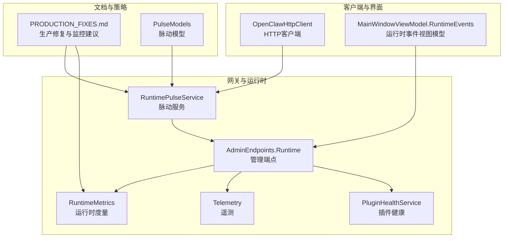
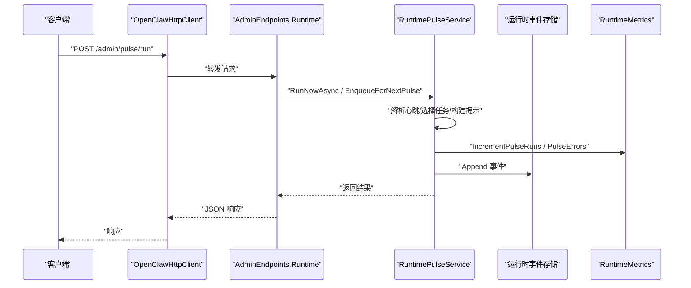
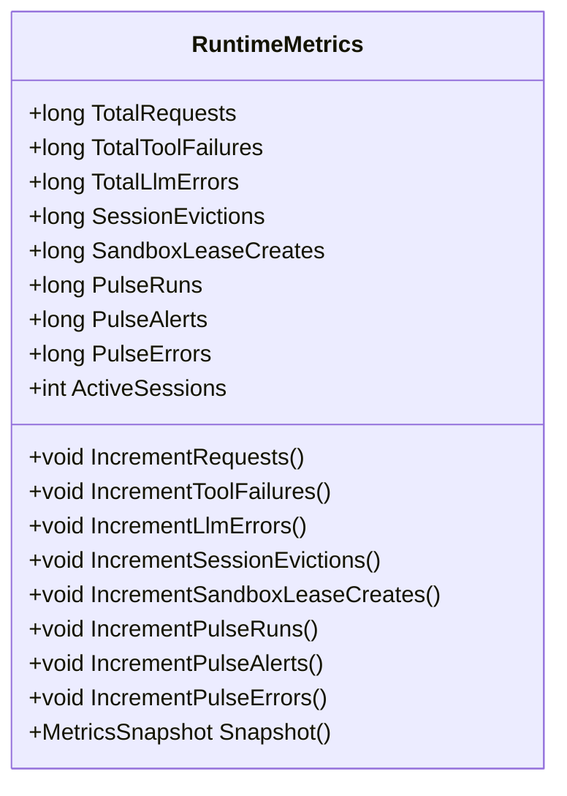
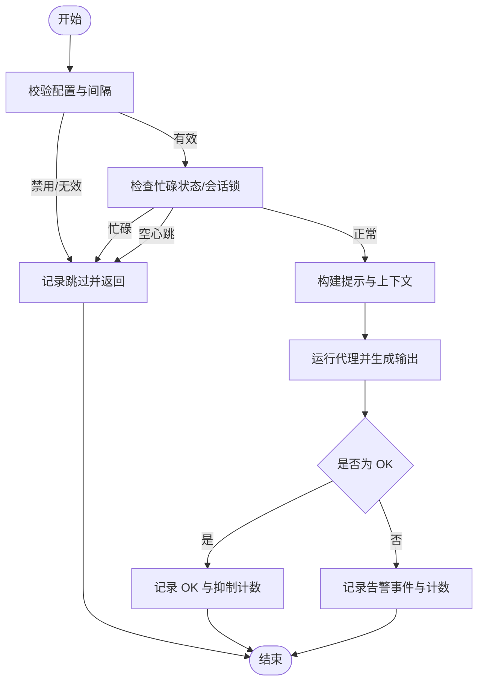
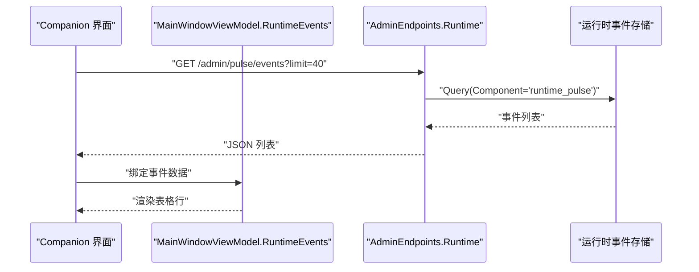
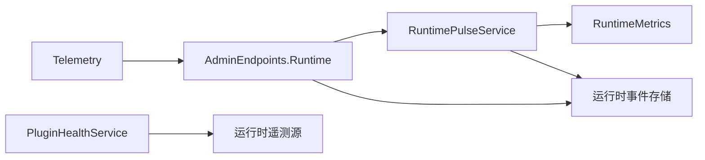

# 运行时错误

<cite>
**本文引用的文件**   
- [RuntimeMetrics.cs](file://src/OpenClaw.Core/Observability/RuntimeMetrics.cs)
- [RuntimePulseService.cs](file://src/OpenClaw.Gateway/RuntimePulseService.cs)
- [AdminEndpoints.Runtime.cs](file://src/OpenClaw.Gateway/Endpoints/AdminEndpoints.Runtime.cs)
- [Telemetry.cs](file://src/OpenClaw.Core/Observability/Telemetry.cs)
- [PluginHealthService.cs](file://src/OpenClaw.Gateway/PluginHealthService.cs)
- [PRODUCTION_FIXES.md](file://docs/PRODUCTION_FIXES.md)
- [OpenClawHttpClient.cs](file://src/OpenClaw.Client/OpenClawHttpClient.cs)
- [PulseModels.cs](file://src/OpenClaw.Core/Models/PulseModels.cs)
- [MainWindowViewModel.RuntimeEvents.cs](file://src/OpenClaw.Companion/ViewModels/MainWindowViewModel.RuntimeEvents.cs)
</cite>

## 目录
1. [简介](#简介)
2. [项目结构](#项目结构)
3. [核心组件](#核心组件)
4. [架构总览](#架构总览)
5. [详细组件分析](#详细组件分析)
6. [依赖关系分析](#依赖关系分析)
7. [性能考量](#性能考量)
8. [故障排除指南](#故障排除指南)
9. [结论](#结论)
10. [附录](#附录)

## 简介
本指南聚焦于 OpenClaw.NET 在运行时可能遇到的异常与稳定性问题，覆盖常见运行时异常、内存泄漏、死锁与资源争用的识别与解决路径，并结合项目内置的可观测性设施（运行时事件、脉动服务、遥测指标、度量计数器）提供系统化的排查流程。文档同时给出错误日志分析、堆栈跟踪解读与性能监控指标使用建议，并附带错误代码对照与修复步骤。

## 项目结构
围绕运行时错误与可观测性的关键目录与文件如下：
- 观测与度量：RuntimeMetrics、Telemetry、RuntimePulseService、AdminEndpoints.Runtime
- 运行时事件与界面：MainWindowViewModel.RuntimeEvents
- 插件健康与资源限制：PluginHealthService
- 生产修复与监控建议：PRODUCTION_FIXES.md
- 客户端与模型：OpenClawHttpClient、PulseModels

**图表来源**
- [RuntimePulseService.cs:16-853](file://src/OpenClaw.Gateway/RuntimePulseService.cs#L16-L853)
- [AdminEndpoints.Runtime.cs:227-294](file://src/OpenClaw.Gateway/Endpoints/AdminEndpoints.Runtime.cs#L227-L294)
- [RuntimeMetrics.cs:10-312](file://src/OpenClaw.Core/Observability/RuntimeMetrics.cs#L10-L312)
- [Telemetry.cs:9-54](file://src/OpenClaw.Core/Observability/Telemetry.cs#L9-L54)
- [PluginHealthService.cs:306-340](file://src/OpenClaw.Gateway/PluginHealthService.cs#L306-L340)
- [OpenClawHttpClient.cs:953-976](file://src/OpenClaw.Client/OpenClawHttpClient.cs#L953-L976)
- [MainWindowViewModel.RuntimeEvents.cs:105-145](file://src/OpenClaw.Companion/ViewModels/MainWindowViewModel.RuntimeEvents.cs#L105-L145)
- [PRODUCTION_FIXES.md:188-198](file://docs/PRODUCTION_FIXES.md#L188-L198)
- [PulseModels.cs:32-69](file://src/OpenClaw.Core/Models/PulseModels.cs#L32-L69)

**章节来源**
- [RuntimePulseService.cs:16-853](file://src/OpenClaw.Gateway/RuntimePulseService.cs#L16-L853)
- [AdminEndpoints.Runtime.cs:227-294](file://src/OpenClaw.Gateway/Endpoints/AdminEndpoints.Runtime.cs#L227-L294)
- [RuntimeMetrics.cs:10-312](file://src/OpenClaw.Core/Observability/RuntimeMetrics.cs#L10-L312)
- [Telemetry.cs:9-54](file://src/OpenClaw.Core/Observability/Telemetry.cs#L9-L54)
- [PluginHealthService.cs:306-340](file://src/OpenClaw.Gateway/PluginHealthService.cs#L306-L340)
- [OpenClawHttpClient.cs:953-976](file://src/OpenClaw.Client/OpenClawHttpClient.cs#L953-L976)
- [MainWindowViewModel.RuntimeEvents.cs:105-145](file://src/OpenClaw.Companion/ViewModels/MainWindowViewModel.RuntimeEvents.cs#L105-L145)
- [PRODUCTION_FIXES.md:188-198](file://docs/PRODUCTION_FIXES.md#L188-L198)
- [PulseModels.cs:32-69](file://src/OpenClaw.Core/Models/PulseModels.cs#L32-L69)

## 核心组件
- 运行时度量计数器（RuntimeMetrics）
  - 提供线程安全的计数器与仪表（gauge），用于请求总量、工具调用失败/超时、LLM 重试/错误、会话驱逐/容量拒绝、沙箱租约、保留进程、脉动运行/跳过/告警/错误等指标快照。
  - 通过原子操作实现无锁增量，适合高并发场景。
- 脉动服务（RuntimePulseService）
  - 周期性或手动触发的“心跳”检查与告警机制，支持任务解析、上下文注入、隔离会话、轻量上下文模式、可见性控制与跳过原因记录。
  - 内置对空心跳文件、忙碌状态、活跃时段、会话锁占用等的跳过逻辑，并将结果写入运行时事件。
- 管理端点（AdminEndpoints.Runtime）
  - 暴露 /admin/pulse/* 与 /admin/events 等端点，支持查询脉动状态、事件列表、手动触发脉动、启用/禁用脉动等。
- 遥测（Telemetry）
  - 提供 OpenTelemetry 的 ActivitySource 与 Meter，注册工具执行时延直方图、速率限制超限计数器与审批队列深度可观测性。
- 插件健康（PluginHealthService）
  - 基于预算的插件运行时健康评估，包括重启次数、工作集、兼容性诊断等，支持隔离与阻断策略。
- 运行时事件（MainWindowViewModel.RuntimeEvents）
  - 将运行时事件转换为表格行，便于在 Companion 界面查看事件详情与原始 JSON。

**章节来源**
- [RuntimeMetrics.cs:10-312](file://src/OpenClaw.Core/Observability/RuntimeMetrics.cs#L10-L312)
- [RuntimePulseService.cs:16-853](file://src/OpenClaw.Gateway/RuntimePulseService.cs#L16-L853)
- [AdminEndpoints.Runtime.cs:227-294](file://src/OpenClaw.Gateway/Endpoints/AdminEndpoints.Runtime.cs#L227-L294)
- [Telemetry.cs:9-54](file://src/OpenClaw.Core/Observability/Telemetry.cs#L9-L54)
- [PluginHealthService.cs:306-340](file://src/OpenClaw.Gateway/PluginHealthService.cs#L306-L340)
- [MainWindowViewModel.RuntimeEvents.cs:105-145](file://src/OpenClaw.Companion/ViewModels/MainWindowViewModel.RuntimeEvents.cs#L105-L145)

## 架构总览
下图展示运行时错误相关的组件交互：客户端通过 HTTP 客户端调用网关端点；网关端点委托脉动服务执行检查；脉动服务读取心跳文件、构建提示并运行代理；期间通过运行时度量与遥测进行观测；最终将事件写入运行时事件存储并通过管理端点暴露。

**图表来源**
- [OpenClawHttpClient.cs:953-976](file://src/OpenClaw.Client/OpenClawHttpClient.cs#L953-L976)
- [AdminEndpoints.Runtime.cs:250-268](file://src/OpenClaw.Gateway/Endpoints/AdminEndpoints.Runtime.cs#L250-L268)
- [RuntimePulseService.cs:89-299](file://src/OpenClaw.Gateway/RuntimePulseService.cs#L89-L299)
- [RuntimeMetrics.cs:173-178](file://src/OpenClaw.Core/Observability/RuntimeMetrics.cs#L173-L178)

## 详细组件分析

### 组件一：运行时度量计数器（RuntimeMetrics）
- 计数器类型
  - 单调递增计数器：TotalRequests、TotalToolFailures、TotalLlmErrors、SessionEvictions、SandboxLeaseCreates 等。
  - 仪表（gauge）：ActiveSessions、CircuitBreakerState、RetainedProcesses 等。
- 并发与性能
  - 使用 Interlocked 与 Volatile 实现无锁读写，避免锁竞争。
  - 提供快照结构体（MetricsSnapshot）用于序列化输出，减少 GC 压力。
- 典型用途
  - 识别工具/LLM 失败与超时趋势、会话容量拒绝、沙箱租约异常、脉动运行/跳过/告警/错误统计。

**图表来源**
- [RuntimeMetrics.cs:10-312](file://src/OpenClaw.Core/Observability/RuntimeMetrics.cs#L10-L312)

**章节来源**
- [RuntimeMetrics.cs:10-312](file://src/OpenClaw.Core/Observability/RuntimeMetrics.cs#L10-L312)

### 组件二：脉动服务（RuntimePulseService）
- 功能要点
  - 支持周期调度与手动触发；解析 HEARTBEAT.md 中的任务块；根据活跃时段与忙碌状态决定是否跳过；可隔离会话与轻量上下文。
  - 对异常进行捕获并记录到运行时事件，同时更新脉动状态与指标。
- 关键行为
  - 空心跳文件、忙碌状态、会话锁占用、模型不可用等场景下的跳过与记录。
  - 成功返回“OK”（抑制可见交付）或产生告警事件。
- 与管理端点集成
  - /admin/pulse/status、/admin/pulse/events、/admin/pulse/run、/admin/pulse/enable/disable 等端点。

**图表来源**
- [RuntimePulseService.cs:136-299](file://src/OpenClaw.Gateway/RuntimePulseService.cs#L136-L299)

**章节来源**
- [RuntimePulseService.cs:16-853](file://src/OpenClaw.Gateway/RuntimePulseService.cs#L16-L853)
- [AdminEndpoints.Runtime.cs:227-294](file://src/OpenClaw.Gateway/Endpoints/AdminEndpoints.Runtime.cs#L227-L294)
- [PulseModels.cs:32-69](file://src/OpenClaw.Core/Models/PulseModels.cs#L32-L69)

### 组件三：管理端点与事件查询（AdminEndpoints.Runtime 与 MainWindowViewModel.RuntimeEvents）
- 管理端点
  - /admin/pulse/status：获取脉动状态（启用、间隔、最近运行时间、告警数量等）。
  - /admin/pulse/events：按组件过滤查询运行时事件。
  - /admin/pulse/run：手动触发脉动或排队下次心跳文本。
  - /admin/events：通用运行时事件查询。
- 运行时事件视图模型
  - 将运行时事件条目映射为表格行，包含时间戳、组件、动作、严重级别、摘要与原始 JSON，便于诊断。

**图表来源**
- [AdminEndpoints.Runtime.cs:236-248](file://src/OpenClaw.Gateway/Endpoints/AdminEndpoints.Runtime.cs#L236-L248)
- [MainWindowViewModel.RuntimeEvents.cs:105-145](file://src/OpenClaw.Companion/ViewModels/MainWindowViewModel.RuntimeEvents.cs#L105-L145)

**章节来源**
- [AdminEndpoints.Runtime.cs:227-294](file://src/OpenClaw.Gateway/Endpoints/AdminEndpoints.Runtime.cs#L227-L294)
- [MainWindowViewModel.RuntimeEvents.cs:105-145](file://src/OpenClaw.Companion/ViewModels/MainWindowViewModel.RuntimeEvents.cs#L105-L145)

### 组件四：遥测与指标（Telemetry）
- 指标
  - 工具执行时延直方图（openclaw.tool.execution.duration）
  - 速率限制超限计数器（openclaw.ratelimit.exceeded）
  - 审批队列深度可观测性（openclaw.approval.queue.depth）
- 用途
  - 结合外部监控系统（如 OTLP 导出器）进行可视化与告警。

**章节来源**
- [Telemetry.cs:9-54](file://src/OpenClaw.Core/Observability/Telemetry.cs#L9-L54)

### 组件五：插件健康与资源限制（PluginHealthService）
- 健康评估
  - 基于预算的重启次数、工作集、兼容性诊断错误数量等维度进行违规检测。
  - 可隔离与阻断不合规插件，防止资源耗尽与稳定性风险。
- 与运行时集成
  - 从运行时遥测源获取重启计数与内存快照，辅助决策。

**章节来源**
- [PluginHealthService.cs:306-340](file://src/OpenClaw.Gateway/PluginHealthService.cs#L306-L340)

## 依赖关系分析
- 脉动服务依赖运行时度量与事件存储，用于记录运行/跳过/告警/错误与持久化状态。
- 管理端点依赖脉动服务与运行时事件存储，提供查询与控制能力。
- 遥测作为独立模块，被其他组件间接使用以暴露指标。
- 插件健康服务与运行时遥测源耦合，形成资源约束闭环。

**图表来源**
- [RuntimePulseService.cs:16-853](file://src/OpenClaw.Gateway/RuntimePulseService.cs#L16-L853)
- [AdminEndpoints.Runtime.cs:227-294](file://src/OpenClaw.Gateway/Endpoints/AdminEndpoints.Runtime.cs#L227-L294)
- [Telemetry.cs:9-54](file://src/OpenClaw.Core/Observability/Telemetry.cs#L9-L54)
- [PluginHealthService.cs:306-340](file://src/OpenClaw.Gateway/PluginHealthService.cs#L306-L340)

**章节来源**
- [RuntimePulseService.cs:16-853](file://src/OpenClaw.Gateway/RuntimePulseService.cs#L16-L853)
- [AdminEndpoints.Runtime.cs:227-294](file://src/OpenClaw.Gateway/Endpoints/AdminEndpoints.Runtime.cs#L227-L294)
- [Telemetry.cs:9-54](file://src/OpenClaw.Core/Observability/Telemetry.cs#L9-L54)
- [PluginHealthService.cs:306-340](file://src/OpenClaw.Gateway/PluginHealthService.cs#L306-L340)

## 性能考量
- 锁竞争优化
  - 运行时度量采用原子操作与易失读写，避免锁竞争。
  - 速率窗口替换为无锁实现，显著降低高负载下的竞争。
- I/O 与持久化
  - 会话持久化增加重试与指数退避，提升可靠性。
  - 原子写入（临时文件+重命名）避免损坏。
- 资源限制
  - 插件健康预算（重启次数、工作集、兼容性错误数）防止资源耗尽。
  - 请求大小限制（如 WebSocket、SMS Webhook）防止内存压力。

**章节来源**
- [RuntimeMetrics.cs:10-312](file://src/OpenClaw.Core/Observability/RuntimeMetrics.cs#L10-L312)
- [PRODUCTION_FIXES.md:160-166](file://docs/PRODUCTION_FIXES.md#L160-L166)

## 故障排除指南

### 一、常见运行时异常与定位
- 现象
  - 脉动服务在运行时抛出异常（如模型/提供者不可用、IO 异常等）。
- 定位步骤
  1) 通过管理端点查询脉动状态与事件：
     - GET /admin/pulse/status
     - GET /admin/pulse/events?limit=40
  2) 查看最近一次脉动运行结果与跳过原因。
  3) 若出现“模型不可用”或“错误”，检查 LLM 提供者路由与电路状态。
- 修复建议
  - 重置提供者电路：POST /admin/providers/{providerId}/circuit/reset
  - 启用/禁用脉动：POST /admin/pulse/enable | /admin/pulse/disable
  - 手动触发脉动：POST /admin/pulse/run

**章节来源**
- [AdminEndpoints.Runtime.cs:227-294](file://src/OpenClaw.Gateway/Endpoints/AdminEndpoints.Runtime.cs#L227-L294)
- [RuntimePulseService.cs:282-294](file://src/OpenClaw.Gateway/RuntimePulseService.cs#L282-L294)

### 二、内存泄漏与资源争用
- 现象
  - 会话锁累积导致内存增长；或存在长时间占用的锁。
- 定位步骤
  1) 监控会话锁数量与运行时事件中的“跳过”原因（如“busy”）。
  2) 检查是否存在长时间未释放的会话锁。
- 修复建议
  - 生产修复已实现：会话锁的最后使用时间追踪与孤儿锁清理阈值（2小时）。
  - 建议设置监控告警：会话锁数量超过阈值（如 >1000）立即告警。

**章节来源**
- [PRODUCTION_FIXES.md:32-46](file://docs/PRODUCTION_FIXES.md#L32-L46)
- [PRODUCTION_FIXES.md:188-193](file://docs/PRODUCTION_FIXES.md#L188-L193)

### 三、死锁与资源争用
- 现象
  - 脉动服务因会话锁占用而跳过运行；或后台服务等待事件导致延迟。
- 定位步骤
  1) 通过脉动状态查看“LastSkipReason”与“NextRunAtUtc”。
  2) 检查运行时事件中“busy”类跳过事件。
- 修复建议
  - 优化业务逻辑，缩短会话锁持有时间。
  - 使用隔离会话与轻量上下文模式（PulseConfig.IsolatedSession/LightContext）降低锁竞争。

**章节来源**
- [RuntimePulseService.cs:154-155](file://src/OpenClaw.Gateway/RuntimePulseService.cs#L154-L155)
- [PulseModels.cs:32-69](file://src/OpenClaw.Core/Models/PulseModels.cs#L32-L69)

### 四、错误日志分析与堆栈跟踪解读
- 日志来源
  - 脉动服务内部对异常进行捕获并记录运行时事件，同时增加脉动错误计数。
  - 运行时事件视图模型提供原始 JSON，便于深入分析。
- 分析要点
  - 关注“RunStarted/RunCompleted/Alert/OkSuppressed/Error/Skipped”等动作。
  - 结合“LastResult/RecentAlerts/LastSkipReason”判断最近运行状态。
- 建议
  - 将运行时事件导出到日志系统，建立基于严重级别的告警。

**章节来源**
- [RuntimePulseService.cs:288-294](file://src/OpenClaw.Gateway/RuntimePulseService.cs#L288-L294)
- [MainWindowViewModel.RuntimeEvents.cs:105-145](file://src/OpenClaw.Companion/ViewModels/MainWindowViewModel.RuntimeEvents.cs#L105-L145)

### 五、性能监控指标使用
- 关键指标
  - 脉动：PulseRuns、PulseAlerts、PulseErrors、PulseSkips、PulseLastRunDurationMs
  - 会话：ActiveSessions、SessionEvictions、SessionCapacityRejects
  - 工具/LLM：TotalToolFailures、TotalToolTimeouts、TotalLlmErrors、TotalLlmRetries
  - 插件桥：PluginBridgeAuthFailures、PluginBridgeRestartAttempts/Failures
  - 沙箱：SandboxLeaseCreates/Reuses/Recoveries
- 建议
  - 设置阈值告警：脉动错误/告警持续上升、会话驱逐/容量拒绝激增、插件重启失败率升高。
  - 结合遥测直方图观察工具执行时延分布。

**章节来源**
- [RuntimeMetrics.cs:173-178](file://src/OpenClaw.Core/Observability/RuntimeMetrics.cs#L173-L178)
- [Telemetry.cs:28-40](file://src/OpenClaw.Core/Observability/Telemetry.cs#L28-L40)

### 六、错误代码对照与修复步骤
- 跳过原因（PulseSkipReasons）
  - Disabled：配置禁用或间隔无效
  - VisibilityDisabled：完全关闭可见性
  - OutsideActiveHours：不在活跃时段
  - Busy：会话锁占用或运行中
  - EmptyHeartbeatFile：心跳文件为空或仅含非到期任务
  - NoSession：无法解析可用会话 ID
  - ModelUnavailable：模型/提供者不可用
  - DeliveryBlocked：目标未接入但保留了告警
  - Error：其他异常
- 修复步骤
  - 修改 HEARTBEAT.md 或任务定义，确保有到期任务且内容有效。
  - 调整 PulseConfig 的活跃时段、间隔与可见性。
  - 重置提供者电路或更换模型配置。
  - 启用/禁用脉动以恢复或暂停自动检查。

**章节来源**
- [RuntimePulseService.cs:140-146](file://src/OpenClaw.Gateway/RuntimePulseService.cs#L140-L146)
- [RuntimePulseService.cs:154-155](file://src/OpenClaw.Gateway/RuntimePulseService.cs#L154-L155)
- [RuntimePulseService.cs:158-166](file://src/OpenClaw.Gateway/RuntimePulseService.cs#L158-L166)
- [RuntimePulseService.cs:171-172](file://src/OpenClaw.Gateway/RuntimePulseService.cs#L171-L172)
- [RuntimePulseService.cs:282-287](file://src/OpenClaw.Gateway/RuntimePulseService.cs#L282-L287)

## 结论
通过将脉动服务、运行时事件、运行时度量与遥测指标有机结合，OpenClaw.NET 能够对运行时异常、内存泄漏、死锁与资源争用等问题进行快速定位与缓解。建议在生产环境中启用上述监控与告警策略，并结合脉动服务的可见性与跳过原因，持续优化系统稳定性与性能。

## 附录
- 监控建议（来自生产修复文档）
  - 跟踪会话锁数量：超过阈值（如 >1000）告警
  - 监控持久化失败：重试耗尽时告警
  - 观察速率限制命中：可能指示攻击或误配置
  - 跟踪优雅停机时间：正常应 <5s

**章节来源**
- [PRODUCTION_FIXES.md:188-193](file://docs/PRODUCTION_FIXES.md#L188-L193)