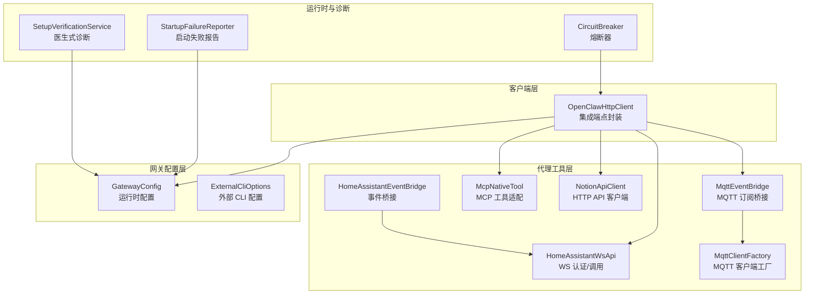
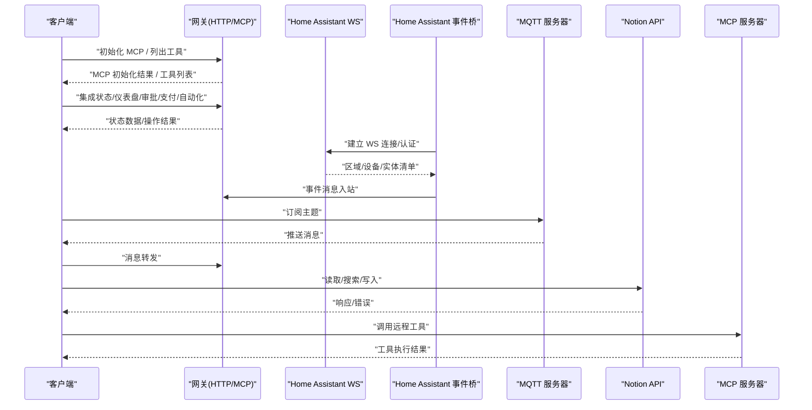
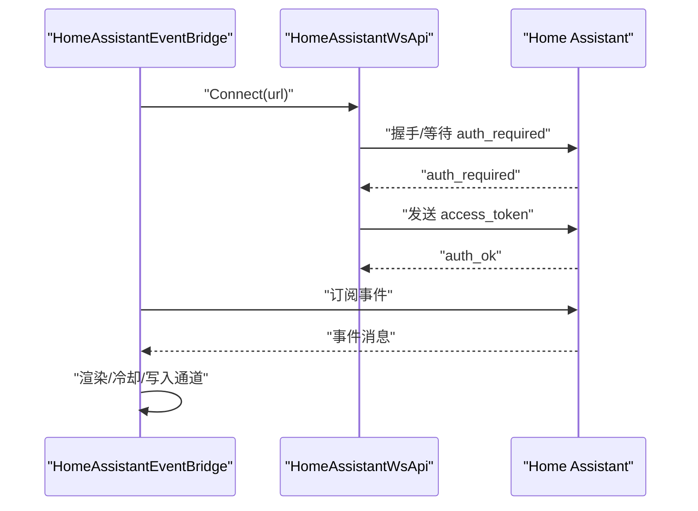
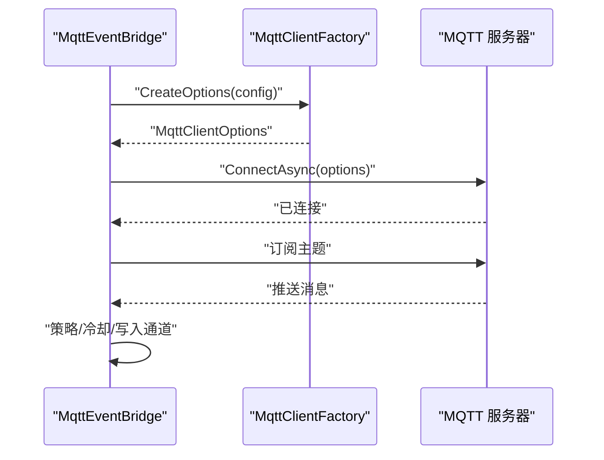
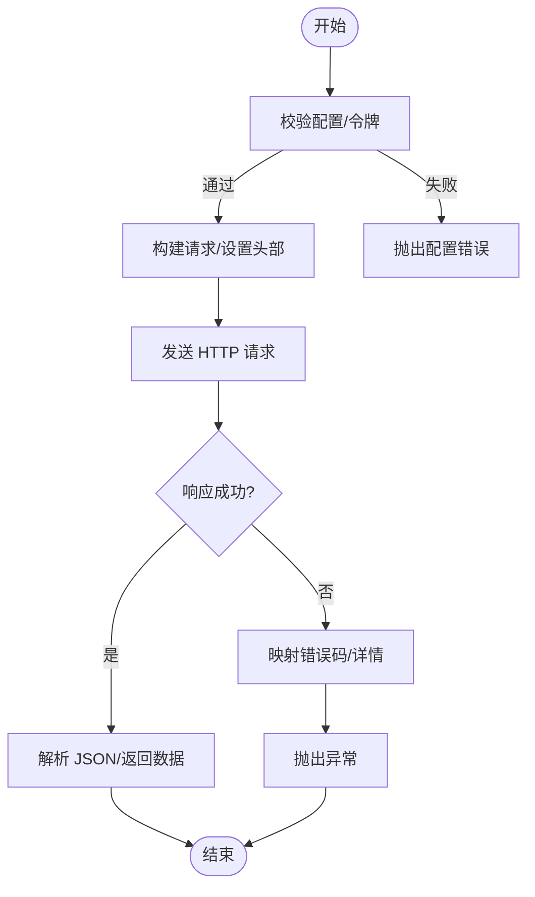
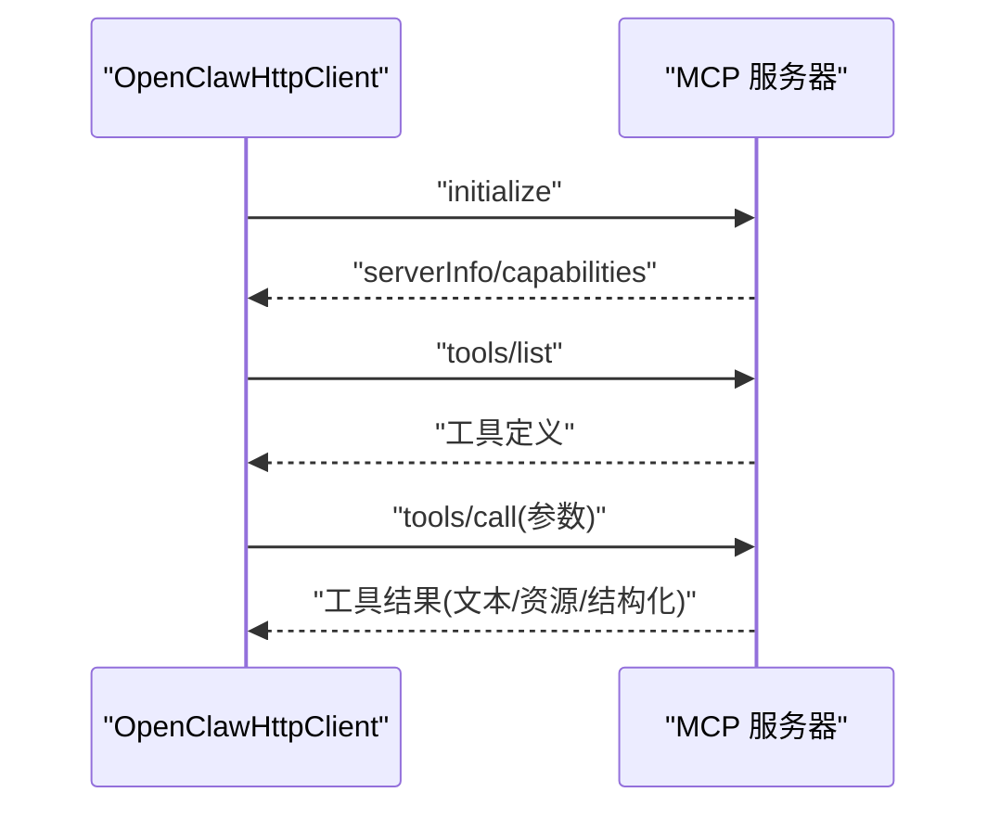
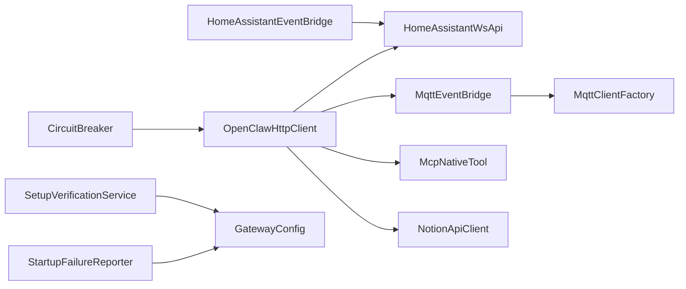

# 集成问题

<cite>
**本文档引用的文件**
- [HomeAssistantEventBridge.cs](file://src/OpenClaw.Agent/Integrations/HomeAssistantEventBridge.cs)
- [MqttEventBridge.cs](file://src/OpenClaw.Agent/Integrations/MqttEventBridge.cs)
- [HomeAssistantWsApi.cs](file://src/OpenClaw.Agent/Tools/HomeAssistantWsApi.cs)
- [MqttClientFactory.cs](file://src/OpenClaw.Agent/Tools/MqttClientFactory.cs)
- [NotionApiClient.cs](file://src/OpenClaw.Agent/Tools/NotionApiClient.cs)
- [OpenClawHttpClient.cs](file://src/OpenClaw.Client/OpenClawHttpClient.cs)
- [GatewayConfig.cs](file://src/OpenClaw.Core/Models/GatewayConfig.cs)
- [IntegrationApiModels.cs](file://src/OpenClaw.Core/Models/IntegrationApiModels.cs)
- [SetupVerificationService.cs](file://src/OpenClaw.Core/Validation/SetupVerificationService.cs)
- [StartupFailureReporter.cs](file://src/OpenClaw.Gateway/Bootstrap/StartupFailureReporter.cs)
- [CircuitBreaker.cs](file://src/OpenClaw.Agent/CircuitBreaker.cs)
- [ExternalCliModels.cs](file://src/OpenClaw.Core/Models/ExternalCliModels.cs)
- [McpNativeTool.cs](file://src/OpenClaw.Agent/Tools/McpNativeTool.cs)
- [GatewayAdminEndpointTests.cs](file://src/OpenClaw.Tests/GatewayAdminEndpointTests.cs)
</cite>

## 目录
1. [简介](#简介)
2. [项目结构](#项目结构)
3. [核心组件](#核心组件)
4. [架构总览](#架构总览)
5. [详细组件分析](#详细组件分析)
6. [依赖关系分析](#依赖关系分析)
7. [性能考量](#性能考量)
8. [故障排除指南](#故障排除指南)
9. [结论](#结论)

## 简介
本指南聚焦于 OpenClaw.NET 在集成第三方服务（如 Home Assistant、MQTT、Notion、MCP 服务器）时的常见问题与排障方法。内容覆盖网络连接、API 通信、外部系统交互、配置验证与连接测试技巧，并提供具体错误场景与解决步骤，帮助快速定位与修复集成问题。

## 项目结构
OpenClaw.NET 将集成能力分布在多个层次：
- 客户端层：负责与网关进行 HTTP/MCP 通信，封装集成端点与请求模型。
- 代理工具层：封装对第三方系统的访问（如 Home Assistant WebSocket、MQTT、Notion HTTP）。
- 网关配置层：集中管理运行时配置（端口、鉴权、通道、支付、外部 CLI 等）。
- 运行时与诊断：提供启动失败报告、健康检查、端口占用检测、医生式诊断等能力。

图示来源
- [OpenClawHttpClient.cs:82-137](file://src/OpenClaw.Client/OpenClawHttpClient.cs#L82-L137)
- [HomeAssistantEventBridge.cs:61-114](file://src/OpenClaw.Agent/Integrations/HomeAssistantEventBridge.cs#L61-L114)
- [HomeAssistantWsApi.cs:33-106](file://src/OpenClaw.Agent/Tools/HomeAssistantWsApi.cs#L33-L106)
- [MqttEventBridge.cs:58-103](file://src/OpenClaw.Agent/Integrations/MqttEventBridge.cs#L58-L103)
- [MqttClientFactory.cs:12-33](file://src/OpenClaw.Agent/Tools/MqttClientFactory.cs#L12-L33)
- [NotionApiClient.cs:25-54](file://src/OpenClaw.Agent/Tools/NotionApiClient.cs#L25-L54)
- [GatewayConfig.cs:9-80](file://src/OpenClaw.Core/Models/GatewayConfig.cs#L9-L80)
- [ExternalCliModels.cs:6-17](file://src/OpenClaw.Core/Models/ExternalCliModels.cs#L6-L17)
- [SetupVerificationService.cs:46-356](file://src/OpenClaw.Core/Validation/SetupVerificationService.cs#L46-L356)
- [StartupFailureReporter.cs:256-283](file://src/OpenClaw.Gateway/Bootstrap/StartupFailureReporter.cs#L256-L283)
- [CircuitBreaker.cs:108-208](file://src/OpenClaw.Agent/CircuitBreaker.cs#L108-L208)

章节来源
- [OpenClawHttpClient.cs:82-137](file://src/OpenClaw.Client/OpenClawHttpClient.cs#L82-L137)
- [GatewayConfig.cs:9-80](file://src/OpenClaw.Core/Models/GatewayConfig.cs#L9-L80)

## 核心组件
- OpenClawHttpClient：封装网关集成端点（认证、集成仪表盘、集成状态、审批、支付、自动化等），支持 MCP 初始化与工具列表查询。
- HomeAssistantWsApi：通过 WebSocket 与 Home Assistant 交互，完成区域/设备/实体清单查询与认证。
- HomeAssistantEventBridge：后台服务，订阅 Home Assistant 事件并通过通道转发消息。
- MqttEventBridge：后台服务，连接 MQTT 服务器，按主题订阅并转发消息。
- MqttClientFactory：构建 MQTT 客户端与连接选项（用户名/密码、TLS、协议版本）。
- NotionApiClient：基于 HTTP 的 Notion API 客户端，支持页面/数据库读取、搜索、追加/替换内容等。
- GatewayConfig：集中配置（端口、鉴权、通道、支付、外部 CLI、本地推理等）。
- SetupVerificationService：运行时诊断与健康检查，包括配置静态校验、存储可写性、端口可用性、提供商探活等。
- StartupFailureReporter：启动失败原因归因（存储权限、端口占用等）。
- CircuitBreaker：对外部服务调用的熔断保护。
- ExternalCliModels：外部 CLI 连接器/命令/预设的配置与模型定义。
- McpNativeTool：将远程 MCP 工具适配为本地工具，统一参数解析与响应格式化。

章节来源
- [OpenClawHttpClient.cs:82-137](file://src/OpenClaw.Client/OpenClawHttpClient.cs#L82-L137)
- [HomeAssistantWsApi.cs:33-106](file://src/OpenClaw.Agent/Tools/HomeAssistantWsApi.cs#L33-L106)
- [HomeAssistantEventBridge.cs:61-114](file://src/OpenClaw.Agent/Integrations/HomeAssistantEventBridge.cs#L61-L114)
- [MqttEventBridge.cs:58-103](file://src/OpenClaw.Agent/Integrations/MqttEventBridge.cs#L58-L103)
- [MqttClientFactory.cs:12-33](file://src/OpenClaw.Agent/Tools/MqttClientFactory.cs#L12-L33)
- [NotionApiClient.cs:25-54](file://src/OpenClaw.Agent/Tools/NotionApiClient.cs#L25-L54)
- [GatewayConfig.cs:9-80](file://src/OpenClaw.Core/Models/GatewayConfig.cs#L9-L80)
- [SetupVerificationService.cs:46-356](file://src/OpenClaw.Core/Validation/SetupVerificationService.cs#L46-L356)
- [StartupFailureReporter.cs:256-283](file://src/OpenClaw.Gateway/Bootstrap/StartupFailureReporter.cs#L256-L283)
- [CircuitBreaker.cs:108-208](file://src/OpenClaw.Agent/CircuitBreaker.cs#L108-L208)
- [ExternalCliModels.cs:6-17](file://src/OpenClaw.Core/Models/ExternalCliModels.cs#L6-L17)
- [McpNativeTool.cs:20-70](file://src/OpenClaw.Agent/Tools/McpNativeTool.cs#L20-L70)

## 架构总览
下图展示客户端与各第三方集成点之间的交互路径与关键控制流。

图示来源
- [OpenClawHttpClient.cs:262-280](file://src/OpenClaw.Client/OpenClawHttpClient.cs#L262-L280)
- [HomeAssistantEventBridge.cs:61-114](file://src/OpenClaw.Agent/Integrations/HomeAssistantEventBridge.cs#L61-L114)
- [HomeAssistantWsApi.cs:33-106](file://src/OpenClaw.Agent/Tools/HomeAssistantWsApi.cs#L33-L106)
- [MqttEventBridge.cs:58-103](file://src/OpenClaw.Agent/Integrations/MqttEventBridge.cs#L58-L103)
- [NotionApiClient.cs:716-743](file://src/OpenClaw.Agent/Tools/NotionApiClient.cs#L716-L743)
- [McpNativeTool.cs:20-70](file://src/OpenClaw.Agent/Tools/McpNativeTool.cs#L20-L70)

## 详细组件分析

### Home Assistant 集成
- WebSocket 认证与调用：连接后等待 auth_required，发送 access_token，校验 auth_ok；随后发起工具调用并等待 result，校验 success 与 result 字段。
- 事件桥接：连接后订阅事件类型，过滤实体 ID，应用冷却策略，将事件渲染为文本消息写入入站通道。

图示来源
- [HomeAssistantEventBridge.cs:61-114](file://src/OpenClaw.Agent/Integrations/HomeAssistantEventBridge.cs#L61-L114)
- [HomeAssistantWsApi.cs:33-106](file://src/OpenClaw.Agent/Tools/HomeAssistantWsApi.cs#L33-L106)

章节来源
- [HomeAssistantEventBridge.cs:61-114](file://src/OpenClaw.Agent/Integrations/HomeAssistantEventBridge.cs#L61-L114)
- [HomeAssistantWsApi.cs:33-106](file://src/OpenClaw.Agent/Tools/HomeAssistantWsApi.cs#L33-L106)

### MQTT 集成
- 客户端工厂：根据配置构造 MQTT 客户端（主机/端口、协议版本、TLS、凭证）。
- 事件桥接：连接后按订阅规则订阅主题，应用策略与冷却，将消息写入通道。

图示来源
- [MqttEventBridge.cs:58-103](file://src/OpenClaw.Agent/Integrations/MqttEventBridge.cs#L58-L103)
- [MqttClientFactory.cs:12-33](file://src/OpenClaw.Agent/Tools/MqttClientFactory.cs#L12-L33)

章节来源
- [MqttEventBridge.cs:58-103](file://src/OpenClaw.Agent/Integrations/MqttEventBridge.cs#L58-L103)
- [MqttClientFactory.cs:12-33](file://src/OpenClaw.Agent/Tools/MqttClientFactory.cs#L12-L33)

### Notion 集成
- HTTP 客户端：设置 Bearer Token、Notion 版本头，限制默认页/数据库白名单，超时控制。
- 错误处理：针对 401/403、404、429、5xx 等返回码给出明确提示与细节。

图示来源
- [NotionApiClient.cs:25-54](file://src/OpenClaw.Agent/Tools/NotionApiClient.cs#L25-L54)
- [NotionApiClient.cs:745-783](file://src/OpenClaw.Agent/Tools/NotionApiClient.cs#L745-L783)

章节来源
- [NotionApiClient.cs:25-54](file://src/OpenClaw.Agent/Tools/NotionApiClient.cs#L25-L54)
- [NotionApiClient.cs:745-783](file://src/OpenClaw.Agent/Tools/NotionApiClient.cs#L745-L783)

### MCP 工具集成
- 客户端封装：支持 initialize、tools/list、resources/* 等方法。
- 本地工具适配：将远程 MCP 工具参数序列化为字典，调用远程工具，格式化文本/结构化内容。

图示来源
- [OpenClawHttpClient.cs:262-280](file://src/OpenClaw.Client/OpenClawHttpClient.cs#L262-L280)
- [McpNativeTool.cs:20-70](file://src/OpenClaw.Agent/Tools/McpNativeTool.cs#L20-L70)
- [GatewayAdminEndpointTests.cs:5973-6001](file://src/OpenClaw.Tests/GatewayAdminEndpointTests.cs#L5973-L6001)

章节来源
- [OpenClawHttpClient.cs:262-280](file://src/OpenClaw.Client/OpenClawHttpClient.cs#L262-L280)
- [McpNativeTool.cs:20-70](file://src/OpenClaw.Agent/Tools/McpNativeTool.cs#L20-L70)
- [GatewayAdminEndpointTests.cs:5973-6001](file://src/OpenClaw.Tests/GatewayAdminEndpointTests.cs#L5973-L6001)

## 依赖关系分析
- 组件耦合：事件桥接依赖配置与安全解析器；HTTP 客户端依赖配置与安全解析器；MCP 工具依赖 MCP 客户端。
- 外部依赖：Home Assistant WS、MQTT 服务器、Notion API、MCP 服务器。
- 诊断与容错：熔断器用于保护外部调用；医生式诊断与启动失败报告辅助定位问题。

图示来源
- [HomeAssistantEventBridge.cs:61-114](file://src/OpenClaw.Agent/Integrations/HomeAssistantEventBridge.cs#L61-L114)
- [HomeAssistantWsApi.cs:33-106](file://src/OpenClaw.Agent/Tools/HomeAssistantWsApi.cs#L33-L106)
- [MqttEventBridge.cs:58-103](file://src/OpenClaw.Agent/Integrations/MqttEventBridge.cs#L58-L103)
- [MqttClientFactory.cs:12-33](file://src/OpenClaw.Agent/Tools/MqttClientFactory.cs#L12-L33)
- [OpenClawHttpClient.cs:262-280](file://src/OpenClaw.Client/OpenClawHttpClient.cs#L262-L280)
- [McpNativeTool.cs:20-70](file://src/OpenClaw.Agent/Tools/McpNativeTool.cs#L20-L70)
- [NotionApiClient.cs:25-54](file://src/OpenClaw.Agent/Tools/NotionApiClient.cs#L25-L54)
- [SetupVerificationService.cs:46-356](file://src/OpenClaw.Core/Validation/SetupVerificationService.cs#L46-L356)
- [StartupFailureReporter.cs:256-283](file://src/OpenClaw.Gateway/Bootstrap/StartupFailureReporter.cs#L256-L283)
- [CircuitBreaker.cs:108-208](file://src/OpenClaw.Agent/CircuitBreaker.cs#L108-L208)

章节来源
- [GatewayConfig.cs:9-80](file://src/OpenClaw.Core/Models/GatewayConfig.cs#L9-L80)
- [ExternalCliModels.cs:6-17](file://src/OpenClaw.Core/Models/ExternalCliModels.cs#L6-L17)

## 性能考量
- 超时与重试：HTTP 客户端与工具调用具备默认超时与重试策略，避免长时间阻塞。
- 冷却与限流：事件桥接采用全局/规则级冷却，防止风暴式事件冲击。
- 熔断保护：对外部服务失败累积进行熔断，降低级联故障风险。
- 资源限制：MQTT 最大负载、JSON 解析分块、分页查询等减少内存与带宽压力。

## 故障排除指南

### 通用诊断步骤
- 配置静态校验：确认 GatewayConfig 中关键字段（端口、鉴权、通道、外部 CLI、本地推理等）合法。
- 医生式诊断：运行 SetupVerificationService，检查配置、工作区、安全基线、浏览器能力、提供商探活、存储可写与空间、端口可用性、Tailscale 服务可达性等。
- 启动失败归因：若启动异常退出，参考 StartupFailureReporter 的错误分类（只读文件系统、权限拒绝、地址已被占用等）。

章节来源
- [SetupVerificationService.cs:46-356](file://src/OpenClaw.Core/Validation/SetupVerificationService.cs#L46-L356)
- [StartupFailureReporter.cs:256-283](file://src/OpenClaw.Gateway/Bootstrap/StartupFailureReporter.cs#L256-L283)

### Home Assistant 集成问题
- 现象：无法连接或认证失败。
- 排查要点：
  - BaseUrl 格式与协议（http/https → ws/wss）是否正确。
  - TokenRef 是否解析到有效令牌。
  - 首包类型是否为 auth_required，认证返回是否为 auth_ok。
  - 事件订阅是否成功，事件类型是否为空或非法。
- 连接测试技巧：
  - 手动使用浏览器或 curl 验证 WS 地址与鉴权。
  - 在事件桥接中启用更详细日志，观察握手与订阅阶段。
- 常见错误与解决：
  - 首包非 auth_required：检查 HA 服务状态与 WS 端点。
  - 认证失败：核对 access_token 来源与权限范围。
  - 订阅失败：确认事件类型存在且未被策略过滤。

章节来源
- [HomeAssistantEventBridge.cs:61-114](file://src/OpenClaw.Agent/Integrations/HomeAssistantEventBridge.cs#L61-L114)
- [HomeAssistantWsApi.cs:33-106](file://src/OpenClaw.Agent/Tools/HomeAssistantWsApi.cs#L33-L106)

### MQTT 集成问题
- 现象：无法连接、无法订阅、消息不达。
- 排查要点：
  - 主机/端口/TLS/凭证配置是否正确。
  - 订阅主题是否匹配通配符规则，是否被策略允许。
  - QoS 设置是否在 0-2 范围内。
  - 最大负载限制与冷却策略是否导致消息丢弃。
- 连接测试技巧：
  - 使用 mosquitto_sub/mqttjs 等工具独立验证连接与订阅。
  - 检查防火墙与网络 ACL。
- 常见错误与解决：
  - 连接被拒：检查用户名/密码与 TLS 配置。
  - 订阅失败：修正主题通配符与策略白名单。
  - 消息未转发：检查冷却阈值与最大负载截断。

章节来源
- [MqttEventBridge.cs:58-103](file://src/OpenClaw.Agent/Integrations/MqttEventBridge.cs#L58-L103)
- [MqttClientFactory.cs:12-33](file://src/OpenClaw.Agent/Tools/MqttClientFactory.cs#L12-L33)

### Notion 集成问题
- 现象：401/403、404、429、5xx。
- 排查要点：
  - Bearer Token 是否配置并解析成功。
  - 默认页/数据库白名单是否包含目标资源。
  - 请求路径与资源 ID 是否正确。
- 连接测试技巧：
  - 使用 curl 直接调用 Notion API，比对响应与错误信息。
  - 分步测试：先读取页面元数据，再读取块内容。
- 常见错误与解决：
  - 401/403：确认集成已共享页面/数据库，令牌有效。
  - 404：核对 page_id/database_id。
  - 429：降低请求频率或增加退避。
  - 5xx：稍后重试或检查 Notion 服务状态。

章节来源
- [NotionApiClient.cs:25-54](file://src/OpenClaw.Agent/Tools/NotionApiClient.cs#L25-L54)
- [NotionApiClient.cs:745-783](file://src/OpenClaw.Agent/Tools/NotionApiClient.cs#L745-L783)

### MCP 工具集成问题
- 现象：MCP 初始化失败、工具列表为空、工具调用报错。
- 排查要点：
  - 协议版本与 capabilities 是否匹配。
  - 远程 MCP 服务器可达且返回 serverInfo。
  - 工具参数 JSON 结构是否为对象。
- 连接测试技巧：
  - 使用测试用例验证 initialize 与 tools/list 流程。
  - 在客户端侧打印请求/响应 JSON，核对字段。
- 常见错误与解决：
  - 初始化失败：确认协议版本与客户端信息。
  - 参数无效：确保 arguments 为对象，键值类型正确。
  - 工具调用异常：检查远程工具实现与返回内容。

章节来源
- [OpenClawHttpClient.cs:262-280](file://src/OpenClaw.Client/OpenClawHttpClient.cs#L262-L280)
- [McpNativeTool.cs:20-70](file://src/OpenClaw.Agent/Tools/McpNativeTool.cs#L20-L70)
- [GatewayAdminEndpointTests.cs:5973-6001](file://src/OpenClaw.Tests/GatewayAdminEndpointTests.cs#L5973-L6001)

### 外部 CLI 集成问题
- 现象：命令不可用、鉴权失败、输出过大、超时。
- 排查要点：
  - 连接器是否启用，可执行文件是否存在。
  - 命令参数是否满足必填与模式约束。
  - 输出格式与大小限制是否合理。
- 常见错误与解决：
  - 可执行文件未找到：修正路径或安装依赖。
  - 参数不合法：按参数定义调整。
  - 输出截断：降低一次性输出或分页读取。

章节来源
- [ExternalCliModels.cs:6-17](file://src/OpenClaw.Core/Models/ExternalCliModels.cs#L6-L17)

### 网络与端口问题
- 现象：启动失败、端口占用、权限不足。
- 排查要点：
  - 医生式诊断是否报告端口不可用或存储不可写。
  - 启动失败报告是否指向只读文件系统或地址已被占用。
- 常见错误与解决：
  - 端口占用：更换端口或释放占用进程。
  - 权限不足：提升权限或修改存储路径。

章节来源
- [SetupVerificationService.cs:112-128](file://src/OpenClaw.Core/Validation/SetupVerificationService.cs#L112-L128)
- [StartupFailureReporter.cs:256-283](file://src/OpenClaw.Gateway/Bootstrap/StartupFailureReporter.cs#L256-L283)

### 外部系统交互与熔断
- 现象：外部服务不稳定导致调用失败或超时。
- 排查要点：
  - CircuitBreaker 是否处于 Open/HalfOpen 状态。
  - 失败阈值与冷却时间是否合理。
- 常见错误与解决：
  - 短路请求：等待冷却期或优化上游服务。
  - 失败计数未清零：确保成功调用触发 Reset。

章节来源
- [CircuitBreaker.cs:108-208](file://src/OpenClaw.Agent/CircuitBreaker.cs#L108-L208)

## 结论
通过系统化的诊断流程（配置校验、医生式检查、启动失败归因）、针对第三方服务的连接测试技巧以及熔断与冷却等容错机制，可显著提升 OpenClaw.NET 的集成稳定性与可维护性。建议在生产环境中持续运行健康检查与日志审计，结合外部 CLI 与 MCP 工具的审批与脱敏策略，确保集成链路的安全与可靠。