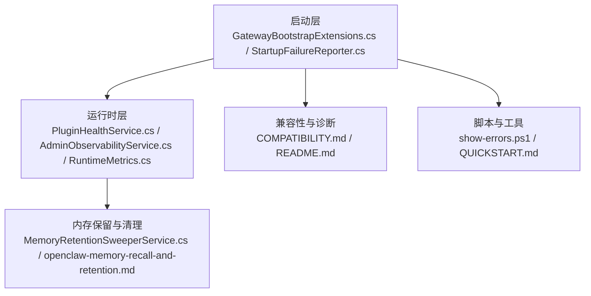
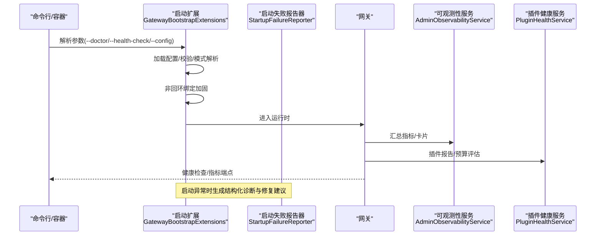
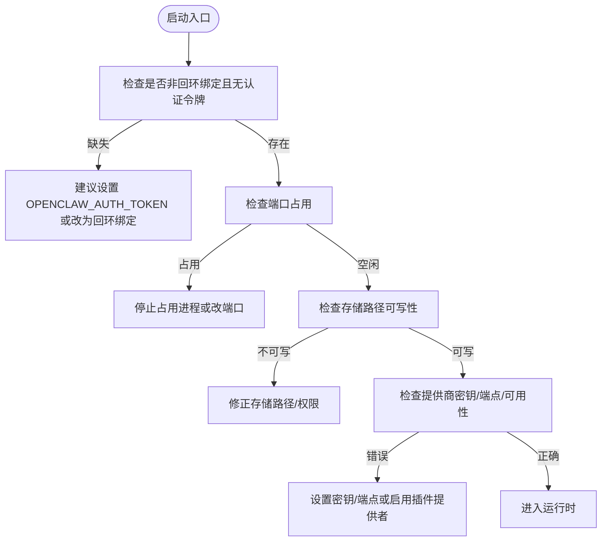
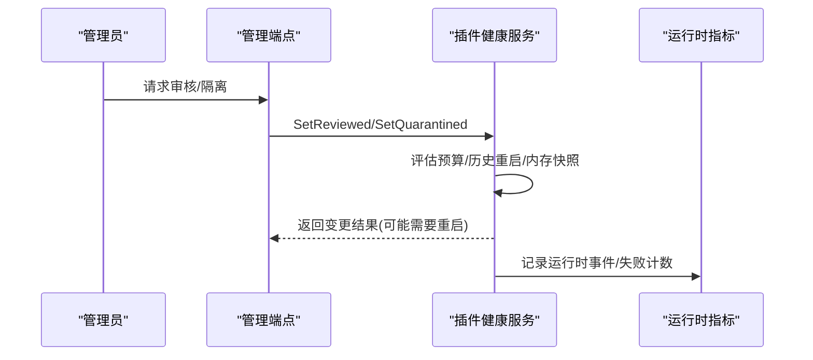
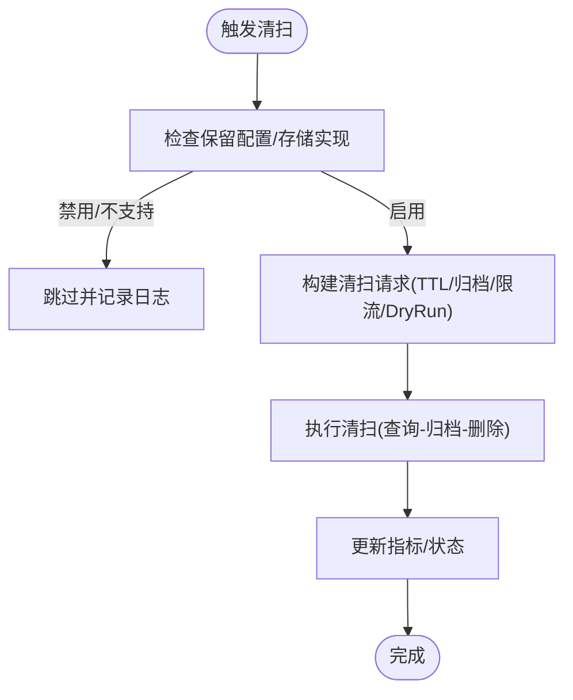
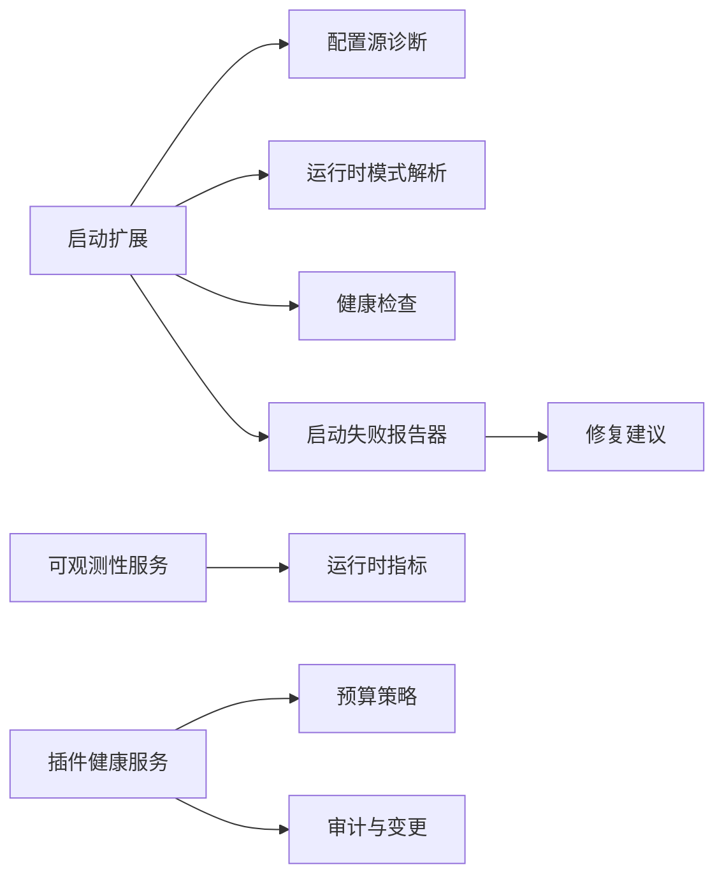

# 故障排除和常见问题

<cite>
**本文引用的文件**
- [README.md](file://README.md)
- [QUICKSTART.md](file://QUICKSTART.md)
- [StartupFailureReporter.cs](file://src/OpenClaw.Gateway/Bootstrap/StartupFailureReporter.cs)
- [GatewayBootstrapExtensions.cs](file://src/OpenClaw.Gateway/Bootstrap/GatewayBootstrapExtensions.cs)
- [COMPATIBILITY.md](file://docs/COMPATIBILITY.md)
- [PRODUCTION_FIXES.md](file://docs/PRODUCTION_FIXES.md)
- [PluginHealthService.cs](file://src/OpenClaw.Gateway/PluginHealthService.cs)
- [AdminEndpoints.PluginsAndChannels.cs](file://src/OpenClaw.Gateway/Endpoints/AdminEndpoints.PluginsAndChannels.cs)
- [AdminObservabilityService.cs](file://src/OpenClaw.Gateway/AdminObservabilityService.cs)
- [RuntimeMetrics.cs](file://src/OpenClaw.Core/Observability/RuntimeMetrics.cs)
- [openclaw-memory-recall-and-retention.md](file://docs/openclaw-memory-recall-and-retention.md)
- [MemoryRetentionSweeperService.cs](file://src/OpenClaw.Gateway/Extensions/MemoryRetentionSweeperService.cs)
- [MemoryRetentionModels.cs](file://src/OpenClaw.Core/Models/MemoryRetentionModels.cs)
- [show-errors.ps1](file://scripts/migration/show-errors.ps1)
- [OperatorRuntimeServicesTests.cs](file://src/OpenClaw.Tests/OperatorRuntimeServicesTests.cs)
- [GatewayAdminEndpointTests.cs](file://src/OpenClaw.Tests/GatewayAdminEndpointTests.cs)
</cite>

## 目录
1. [简介](#简介)
2. [项目结构](#项目结构)
3. [核心组件](#核心组件)
4. [架构总览](#架构总览)
5. [详细组件分析](#详细组件分析)
6. [依赖关系分析](#依赖关系分析)
7. [性能注意事项](#性能注意事项)
8. [故障排除指南](#故障排除指南)
9. [结论](#结论)
10. [附录](#附录)

## 简介
本文件面向运维与开发人员，系统化梳理 OpenClaw.NET 在启动失败、配置错误、性能问题、兼容性问题等方面的故障排除方法，并提供日志分析、错误代码解读、调试工具使用、生产环境应急响应与回滚策略、以及内存泄漏与并发问题的高级排查手段。文档同时给出社区支持渠道与问题报告模板建议，帮助快速定位与解决问题。

## 项目结构
从故障排除视角，以下模块与路径最为关键：
- 启动层：负责配置加载、校验、模式解析、健康检查与诊断报告
- 运行时层：负责可观测性指标、插件健康与配额、内存保留与清理
- 文档与脚本：提供兼容性矩阵、生产修复清单、迁移与构建脚本

图表来源
- [GatewayBootstrapExtensions.cs:18-135](file://src/OpenClaw.Gateway/Bootstrap/GatewayBootstrapExtensions.cs#L18-L135)
- [StartupFailureReporter.cs:52-80](file://src/OpenClaw.Gateway/Bootstrap/StartupFailureReporter.cs#L52-L80)
- [PluginHealthService.cs:240-273](file://src/OpenClaw.Gateway/PluginHealthService.cs#L240-L273)
- [AdminObservabilityService.cs:117-229](file://src/OpenClaw.Gateway/AdminObservabilityService.cs#L117-L229)
- [RuntimeMetrics.cs:84-185](file://src/OpenClaw.Core/Observability/RuntimeMetrics.cs#L84-L185)
- [openclaw-memory-recall-and-retention.md:159-182](file://docs/openclaw-memory-recall-and-retention.md#L159-L182)
- [MemoryRetentionSweeperService.cs:98-210](file://src/OpenClaw.Gateway/Extensions/MemoryRetentionSweeperService.cs#L98-L210)
- [COMPATIBILITY.md:1-131](file://docs/COMPATIBILITY.md#L1-L131)
- [QUICKSTART.md:1-190](file://QUICKSTART.md#L1-L190)
- [show-errors.ps1:35-48](file://scripts/migration/show-errors.ps1#L35-L48)

章节来源
- [GatewayBootstrapExtensions.cs:18-135](file://src/OpenClaw.Gateway/Bootstrap/GatewayBootstrapExtensions.cs#L18-L135)
- [StartupFailureReporter.cs:52-80](file://src/OpenClaw.Gateway/Bootstrap/StartupFailureReporter.cs#L52-L80)
- [COMPATIBILITY.md:1-131](file://docs/COMPATIBILITY.md#L1-L131)

## 核心组件
- 启动失败报告器：对认证缺失、端口占用、存储不可写、提供商配置错误等进行分类诊断与建议
- 启动扩展：加载配置、执行 doctor 检查、强制公网绑定加固、健康检查
- 插件健康服务：基于重启次数、工作集、兼容性错误的自动隔离与审计
- 可观测性服务：汇总审批、自动化、通道就绪度、提供者路由与错误重试等指标
- 内存保留与清理：按 TTL 清理会话与分支，支持 DryRun、归档与限流
- 兼容性矩阵：明确 AOT/JIT 能力边界与失败码，避免部分加载

章节来源
- [StartupFailureReporter.cs:52-266](file://src/OpenClaw.Gateway/Bootstrap/StartupFailureReporter.cs#L52-L266)
- [GatewayBootstrapExtensions.cs:65-120](file://src/OpenClaw.Gateway/Bootstrap/GatewayBootstrapExtensions.cs#L65-L120)
- [PluginHealthService.cs:240-340](file://src/OpenClaw.Gateway/PluginHealthService.cs#L240-L340)
- [AdminObservabilityService.cs:117-229](file://src/OpenClaw.Gateway/AdminObservabilityService.cs#L117-L229)
- [openclaw-memory-recall-and-retention.md:159-182](file://docs/openclaw-memory-recall-and-retention.md#L159-L182)
- [MemoryRetentionSweeperService.cs:98-210](file://src/OpenClaw.Gateway/Extensions/MemoryRetentionSweeperService.cs#L98-L210)
- [COMPATIBILITY.md:11-60](file://docs/COMPATIBILITY.md#L11-L60)

## 架构总览
启动与运行时的关键交互如下：

图表来源
- [GatewayBootstrapExtensions.cs:38-135](file://src/OpenClaw.Gateway/Bootstrap/GatewayBootstrapExtensions.cs#L38-L135)
- [StartupFailureReporter.cs:20-50](file://src/OpenClaw.Gateway/Bootstrap/StartupFailureReporter.cs#L20-L50)
- [AdminObservabilityService.cs:117-229](file://src/OpenClaw.Gateway/AdminObservabilityService.cs#L117-L229)
- [PluginHealthService.cs:240-273](file://src/OpenClaw.Gateway/PluginHealthService.cs#L240-L273)

## 详细组件分析

### 启动失败诊断与修复
- 认证令牌缺失（非回环绑定）
  - 现象：启动时报错要求设置 OPENCLAW_AUTH_TOKEN
  - 处理：本地回环绑定或设置强随机令牌；生产环境需显式覆盖默认
  - 参考：[StartupFailureReporter.cs:82-111](file://src/OpenClaw.Gateway/Bootstrap/StartupFailureReporter.cs#L82-L111)
- 端口占用
  - 现象：AddressInUseException 或“地址已被占用”
  - 处理：停止占用进程或调整端口
  - 参考：[StartupFailureReporter.cs:210-233](file://src/OpenClaw.Gateway/Bootstrap/StartupFailureReporter.cs#L210-L233)
- 存储路径不可写/只读文件系统
  - 现象：Memory.StoragePath 或权限拒绝
  - 处理：确保目录存在且可写，必要时切换到开发环境默认
  - 参考：[StartupFailureReporter.cs:113-153](file://src/OpenClaw.Gateway/Bootstrap/StartupFailureReporter.cs#L113-L153)
- 提供商配置错误
  - 现象：缺少密钥/端点或不受支持的提供商
  - 处理：设置 MODEL_PROVIDER_KEY/ENDPOINT，确认内置或插件提供者可用
  - 参考：[StartupFailureReporter.cs:155-208](file://src/OpenClaw.Gateway/Bootstrap/StartupFailureReporter.cs#L155-L208)
- doctor 检查与健康检查
  - 使用 --doctor 快速发现配置问题；--health-check 用于轻量探测
  - 参考：[GatewayBootstrapExtensions.cs:38-118](file://src/OpenClaw.Gateway/Bootstrap/GatewayBootstrapExtensions.cs#L38-L118)

图表来源
- [StartupFailureReporter.cs:52-208](file://src/OpenClaw.Gateway/Bootstrap/StartupFailureReporter.cs#L52-L208)
- [GatewayBootstrapExtensions.cs:48-105](file://src/OpenClaw.Gateway/Bootstrap/GatewayBootstrapExtensions.cs#L48-L105)

章节来源
- [StartupFailureReporter.cs:52-266](file://src/OpenClaw.Gateway/Bootstrap/StartupFailureReporter.cs#L52-L266)
- [GatewayBootstrapExtensions.cs:38-118](file://src/OpenClaw.Gateway/Bootstrap/GatewayBootstrapExtensions.cs#L38-L118)

### 配置错误与兼容性问题
- 兼容性矩阵与失败码
  - AOT/JIT 能力差异明确，不支持的桥接表面以结构化诊断快速失败
  - 支持的桥接能力包括 registerTool/registerService，JIT 才支持 registerChannel/registerCommand/registerProvider/api.on
  - 参考：[COMPATIBILITY.md:11-60](file://docs/COMPATIBILITY.md#L11-L60)
- 公网绑定安全加固
  - 非回环绑定必须设置认证令牌；默认拒绝高危配置（如通配根目录、允许 shell、启用插件桥、原始密钥引用）
  - 参考：[README.md:300-313](file://README.md#L300-L313)
- Doctor 检查
  - --doctor 输出配置源、运行时模式、通道就绪度、插件诊断等，便于快速定位
  - 参考：[GatewayBootstrapExtensions.cs:107-118](file://src/OpenClaw.Gateway/Bootstrap/GatewayBootstrapExtensions.cs#L107-L118)

章节来源
- [COMPATIBILITY.md:11-60](file://docs/COMPATIBILITY.md#L11-L60)
- [README.md:300-313](file://README.md#L300-L313)
- [GatewayBootstrapExtensions.cs:107-118](file://src/OpenClaw.Gateway/Bootstrap/GatewayBootstrapExtensions.cs#L107-L118)

### 性能问题与资源限制
- 锁竞争与速率限制
  - 生产修复中将锁对象替换为无锁/低锁操作，显著降低高负载下的争用
  - 参考：[PRODUCTION_FIXES.md:99-113](file://docs/PRODUCTION_FIXES.md#L99-L113)
- 优雅关闭与 CPU 浪费
  - 替换 spin-wait 为事件等待，缩短关闭耗时
  - 参考：[PRODUCTION_FIXES.md:83-96](file://docs/PRODUCTION_FIXES.md#L83-L96)
- 会话持久化重试
  - I/O 失败采用指数退避重试，保留取消语义
  - 参考：[PRODUCTION_FIXES.md:116-129](file://docs/PRODUCTION_FIXES.md#L116-L129)
- 指标与监控
  - 运行时计数器涵盖会话容量拒绝、插件桥重启、进程生命周期、保留清理等
  - 参考：[RuntimeMetrics.cs:84-185](file://src/OpenClaw.Core/Observability/RuntimeMetrics.cs#L84-L185)

章节来源
- [PRODUCTION_FIXES.md:99-129](file://docs/PRODUCTION_FIXES.md#L99-L129)
- [RuntimeMetrics.cs:84-185](file://src/OpenClaw.Core/Observability/RuntimeMetrics.cs#L84-L185)

### 内存泄漏检测与并发问题
- 会话锁孤儿清理
  - 未使用锁超过阈值强制清理，防止长期活跃导致的内存泄漏
  - 参考：[PRODUCTION_FIXES.md:32-43](file://docs/PRODUCTION_FIXES.md#L32-L43)
- WebSocket 输入验证
  - JSON 解析后限制文本长度，防止内存压力攻击
  - 参考：[PRODUCTION_FIXES.md:49-62](file://docs/PRODUCTION_FIXES.md#L49-L62)
- 并发控制与无锁优化
  - Interlocked 操作替代锁，减少高并发争用
  - 参考：[PRODUCTION_FIXES.md:99-113](file://docs/PRODUCTION_FIXES.md#L99-L113)

章节来源
- [PRODUCTION_FIXES.md:32-62](file://docs/PRODUCTION_FIXES.md#L32-L62)
- [PRODUCTION_FIXES.md:99-113](file://docs/PRODUCTION_FIXES.md#L99-L113)

### 插件健康与自动隔离
- 预算策略
  - 基于重启次数、工作集、兼容性错误数量的自动隔离
  - 参考：[PluginHealthService.cs:240-340](file://src/OpenClaw.Gateway/PluginHealthService.cs#L240-L340)
- 管理端操作
  - 审核、隔离、解除隔离等管理接口，支持 CSRF 保护与审计记录
  - 参考：[AdminEndpoints.PluginsAndChannels.cs:208-252](file://src/OpenClaw.Gateway/Endpoints/AdminEndpoints.PluginsAndChannels.cs#L208-L252)
- 测试用例验证
  - 包含预算触发、隔离状态、持久化等场景的回归测试
  - 参考：[OperatorRuntimeServicesTests.cs:200-254](file://src/OpencLAW.Tests/OperatorRuntimeServicesTests.cs#L200-L254)

图表来源
- [AdminEndpoints.PluginsAndChannels.cs:208-252](file://src/OpenClaw.Gateway/Endpoints/AdminEndpoints.PluginsAndChannels.cs#L208-L252)
- [PluginHealthService.cs:240-340](file://src/OpenClaw.Gateway/PluginHealthService.cs#L240-L340)
- [RuntimeMetrics.cs:84-185](file://src/OpenClaw.Core/Observability/RuntimeMetrics.cs#L84-L185)

章节来源
- [PluginHealthService.cs:240-340](file://src/OpenClaw.Gateway/PluginHealthService.cs#L240-L340)
- [AdminEndpoints.PluginsAndChannels.cs:208-252](file://src/OpenClaw.Gateway/Endpoints/AdminEndpoints.PluginsAndChannels.cs#L208-L252)
- [OperatorRuntimeServicesTests.cs:200-254](file://src/OpencLAW.Tests/OperatorRuntimeServicesTests.cs#L200-L254)

### 内存保留与清理
- TTL 与归档
  - 会话与分支按 TTL 清理，支持 DryRun 预演，归档路径按日期分区
  - 参考：[openclaw-memory-recall-and-retention.md:159-182](file://docs/openclaw-memory-recall-and-retention.md#L159-L182)
- 清扫服务
  - 支持定时与手动清扫，异常时记录错误并更新指标
  - 参考：[MemoryRetentionSweeperService.cs:98-210](file://src/OpenClaw.Gateway/Extensions/MemoryRetentionSweeperService.cs#L98-L210)
- 数据模型
  - 清扫请求/结果包含时间戳、归档统计、删除统计、限流标志
  - 参考：[MemoryRetentionModels.cs:7-37](file://src/OpenClaw.Core/Models/MemoryRetentionModels.cs#L7-L37)

图表来源
- [MemoryRetentionSweeperService.cs:98-210](file://src/OpenClaw.Gateway/Extensions/MemoryRetentionSweeperService.cs#L98-L210)
- [openclaw-memory-recall-and-retention.md:159-182](file://docs/openclaw-memory-recall-and-retention.md#L159-L182)
- [MemoryRetentionModels.cs:7-37](file://src/OpenClaw.Core/Models/MemoryRetentionModels.cs#L7-L37)

章节来源
- [openclaw-memory-recall-and-retention.md:159-182](file://docs/openclaw-memory-recall-and-retention.md#L159-L182)
- [MemoryRetentionSweeperService.cs:98-210](file://src/OpenClaw.Gateway/Extensions/MemoryRetentionSweeperService.cs#L98-L210)
- [MemoryRetentionModels.cs:7-37](file://src/OpenClaw.Core/Models/MemoryRetentionModels.cs#L7-L37)

### 日志分析与调试工具
- 结构化日志与追踪
  - 关键事件包含关联 ID，便于跨服务串联
  - 参考：[README.md:630-650](file://README.md#L630-L650)
- 健康检查与指标端点
  - /health 与 /metrics 用于快速判断运行状态与计数器
  - 参考：[README.md:620-630](file://README.md#L620-L630)
- Doctor 报告
  - --doctor 输出配置源、运行时模式、通道就绪度、插件诊断
  - 参考：[GatewayBootstrapExtensions.cs:107-118](file://src/OpenClaw.Gateway/Bootstrap/GatewayBootstrapExtensions.cs#L107-L118)
- 构建错误统计脚本
  - PowerShell 脚本统计唯一编译错误，辅助迁移与回归
  - 参考：[show-errors.ps1:35-48](file://scripts/migration/show-errors.ps1#L35-L48)

章节来源
- [README.md:620-650](file://README.md#L620-L650)
- [GatewayBootstrapExtensions.cs:107-118](file://src/OpenClaw.Gateway/Bootstrap/GatewayBootstrapExtensions.cs#L107-L118)
- [show-errors.ps1:35-48](file://scripts/migration/show-errors.ps1#L35-L48)

## 依赖关系分析
- 启动层依赖配置源诊断与运行时模式解析，失败时通过报告器输出结构化建议
- 运行时层依赖可观测性与插件健康服务，形成闭环：指标驱动决策，健康策略保障稳定性
- 文档与脚本为诊断与修复提供依据与工具

图表来源
- [GatewayBootstrapExtensions.cs:65-120](file://src/OpenClaw.Gateway/Bootstrap/GatewayBootstrapExtensions.cs#L65-L120)
- [StartupFailureReporter.cs:52-80](file://src/OpenClaw.Gateway/Bootstrap/StartupFailureReporter.cs#L52-L80)
- [AdminObservabilityService.cs:117-229](file://src/OpenClaw.Gateway/AdminObservabilityService.cs#L117-L229)
- [PluginHealthService.cs:240-340](file://src/OpenClaw.Gateway/PluginHealthService.cs#L240-L340)

章节来源
- [GatewayBootstrapExtensions.cs:65-120](file://src/OpenClaw.Gateway/Bootstrap/GatewayBootstrapExtensions.cs#L65-L120)
- [StartupFailureReporter.cs:52-80](file://src/OpenClaw.Gateway/Bootstrap/StartupFailureReporter.cs#L52-L80)
- [AdminObservabilityService.cs:117-229](file://src/OpenClaw.Gateway/AdminObservabilityService.cs#L117-L229)
- [PluginHealthService.cs:240-340](file://src/OpenClaw.Gateway/PluginHealthService.cs#L240-L340)

## 性能注意事项
- 减少锁争用：优先使用无锁/低锁实现
- 降低 CPU 空转：优雅关闭使用事件等待而非轮询
- I/O 稳定性：会话持久化失败采用指数退避重试
- 观测先行：通过 /metrics 与运行时指标持续监控瓶颈

[本节为通用指导，无需列出章节来源]

## 故障排除指南

### 启动失败
- 步骤
  - 使用 --doctor 快速定位配置问题
  - 若为非回环绑定，检查 OPENCLAW_AUTH_TOKEN 设置
  - 如端口被占用，停止占用进程或调整端口
  - 若存储路径不可写，修正路径或权限
  - 若提供商配置错误，设置 MODEL_PROVIDER_KEY/ENDPOINT 或启用插件提供者
- 参考
  - [GatewayBootstrapExtensions.cs:48-118](file://src/OpenClaw.Gateway/Bootstrap/GatewayBootstrapExtensions.cs#L48-L118)
  - [StartupFailureReporter.cs:82-208](file://src/OpenClaw.Gateway/Bootstrap/StartupFailureReporter.cs#L82-L208)

章节来源
- [GatewayBootstrapExtensions.cs:48-118](file://src/OpenClaw.Gateway/Bootstrap/GatewayBootstrapExtensions.cs#L48-L118)
- [StartupFailureReporter.cs:82-208](file://src/OpenClaw.Gateway/Bootstrap/StartupFailureReporter.cs#L82-L208)

### 配置错误
- 建议
  - 使用 --doctor 获取配置源与诊断
  - 对照兼容性矩阵，确认 AOT/JIT 能力边界
  - 生产部署前执行公网绑定加固检查
- 参考
  - [GatewayBootstrapExtensions.cs:107-118](file://src/OpenClaw.Gateway/Bootstrap/GatewayBootstrapExtensions.cs#L107-L118)
  - [COMPATIBILITY.md:11-60](file://docs/COMPATIBILITY.md#L11-L60)
  - [README.md:300-313](file://README.md#L300-L313)

章节来源
- [GatewayBootstrapExtensions.cs:107-118](file://src/OpenClaw.Gateway/Bootstrap/GatewayBootstrapExtensions.cs#L107-L118)
- [COMPATIBILITY.md:11-60](file://docs/COMPATIBILITY.md#L11-L60)
- [README.md:300-313](file://README.md#L300-L313)

### 性能问题
- 建议
  - 查看 /metrics 与运行时指标，识别瓶颈
  - 应用生产修复中的无锁优化与事件等待
  - 对高负载场景启用速率限制与连接数限制
- 参考
  - [RuntimeMetrics.cs:84-185](file://src/OpenClaw.Core/Observability/RuntimeMetrics.cs#L84-L185)
  - [PRODUCTION_FIXES.md:99-129](file://docs/PRODUCTION_FIXES.md#L99-L129)
  - [README.md:517-529](file://README.md#L517-L529)

章节来源
- [RuntimeMetrics.cs:84-185](file://src/OpenClaw.Core/Observability/RuntimeMetrics.cs#L84-L185)
- [PRODUCTION_FIXES.md:99-129](file://docs/PRODUCTION_FIXES.md#L99-L129)
- [README.md:517-529](file://README.md#L517-L529)

### 兼容性问题
- 建议
  - 明确当前运行时模式（aot/jit/auto），选择合适能力
  - 对于不支持的桥接表面，使用替代方案或升级到 JIT 模式
- 参考
  - [COMPATIBILITY.md:11-60](file://docs/COMPATIBILITY.md#L11-L60)
  - [README.md:60-71](file://README.md#L60-L71)

章节来源
- [COMPATIBILITY.md:11-60](file://docs/COMPATIBILITY.md#L11-L60)
- [README.md:60-71](file://README.md#L60-L71)

### 插件健康与隔离
- 建议
  - 当插件频繁重启或内存超限，查看预算违规并考虑隔离
  - 使用管理端点进行审核、隔离与解除隔离
- 参考
  - [PluginHealthService.cs:240-340](file://src/OpenClaw.Gateway/PluginHealthService.cs#L240-L340)
  - [AdminEndpoints.PluginsAndChannels.cs:208-252](file://src/OpenClaw.Gateway/Endpoints/AdminEndpoints.PluginsAndChannels.cs#L208-L252)

章节来源
- [PluginHealthService.cs:240-340](file://src/OpenClaw.Gateway/PluginHealthService.cs#L240-L340)
- [AdminEndpoints.PluginsAndChannels.cs:208-252](file://src/OpenClaw.Gateway/Endpoints/AdminEndpoints.PluginsAndChannels.cs#L208-L252)

### 内存保留与清理
- 建议
  - 启用保留清理并设置合理 TTL；先使用 DryRun 验证影响
  - 监控清扫失败与归档路径权限
- 参考
  - [openclaw-memory-recall-and-retention.md:159-182](file://docs/openclaw-memory-recall-and-retention.md#L159-L182)
  - [MemoryRetentionSweeperService.cs:98-210](file://src/OpenClaw.Gateway/Extensions/MemoryRetentionSweeperService.cs#L98-L210)

章节来源
- [openclaw-memory-recall-and-retention.md:159-182](file://docs/openclaw-memory-recall-and-retention.md#L159-L182)
- [MemoryRetentionSweeperService.cs:98-210](file://src/OpenClaw.Gateway/Extensions/MemoryRetentionSweeperService.cs#L98-L210)

### 日志分析与调试
- 建议
  - 使用 /health 与 /metrics 快速判断状态
  - 通过 Doctor 报告与结构化日志定位问题
  - 使用 show-errors.ps1 统计构建错误
- 参考
  - [README.md:620-650](file://README.md#L620-L650)
  - [GatewayBootstrapExtensions.cs:107-118](file://src/OpenClaw.Gateway/Bootstrap/GatewayBootstrapExtensions.cs#L107-L118)
  - [show-errors.ps1:35-48](file://scripts/migration/show-errors.ps1#L35-L48)

章节来源
- [README.md:620-650](file://README.md#L620-L650)
- [GatewayBootstrapExtensions.cs:107-118](file://src/OpenClaw.Gateway/Bootstrap/GatewayBootstrapExtensions.cs#L107-L118)
- [show-errors.ps1:35-48](file://scripts/migration/show-errors.ps1#L35-L48)

### 生产环境应急响应与回滚
- 建议
  - 保持镜像标签固定，启用 TLS 与反向代理
  - 使用健康检查与指标端点进行快速止损
  - 发生重大问题时回滚到上一个稳定版本
- 参考
  - [README.md:517-529](file://README.md#L517-L529)
  - [README.md:405-431](file://README.md#L405-L431)

章节来源
- [README.md:517-529](file://README.md#L517-L529)
- [README.md:405-431](file://README.md#L405-L431)

## 结论
通过结构化的启动诊断、兼容性矩阵、插件健康策略、可观测性指标与内存保留清理，OpenClaw.NET 提供了从入门到生产的完整故障排除路径。建议在生产部署前完成 doctor 检查与公网绑定加固，在运行期持续监控指标与日志，并利用 DryRun 与审计端点进行安全变更。

[本节为总结，无需列出章节来源]

## 附录

### 社区支持与问题报告
- 快速开始与使用参考
  - [QUICKSTART.md:1-190](file://QUICKSTART.md#L1-L190)
  - [README.md:125-246](file://README.md#L125-L246)
- 问题报告模板建议
  - 环境信息：操作系统、.NET 版本、运行时模式、是否公网绑定
  - 配置摘要：关键配置片段（脱敏敏感字段）、--doctor 输出
  - 复现步骤：最小复现步骤、命令行参数
  - 日志与指标：/health 与 /metrics 输出、关键日志片段
  - 期望与实际：预期行为与实际行为对比
- 贡献指南
  - 参考仓库贡献入口与安全审查需求
  - [README.md:658-670](file://README.md#L658-L670)

章节来源
- [QUICKSTART.md:1-190](file://QUICKSTART.md#L1-L190)
- [README.md:125-246](file://README.md#L125-L246)
- [README.md:658-670](file://README.md#L658-L670)