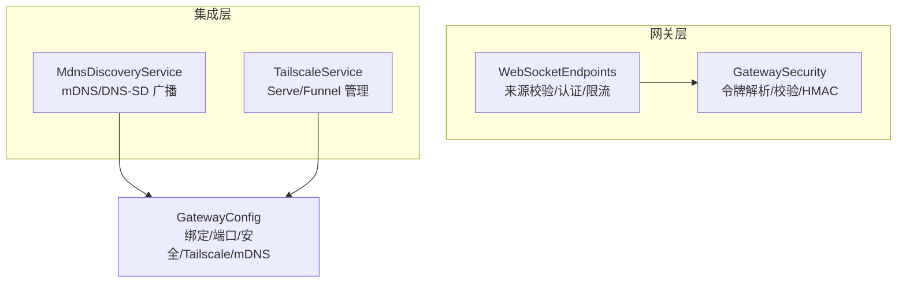
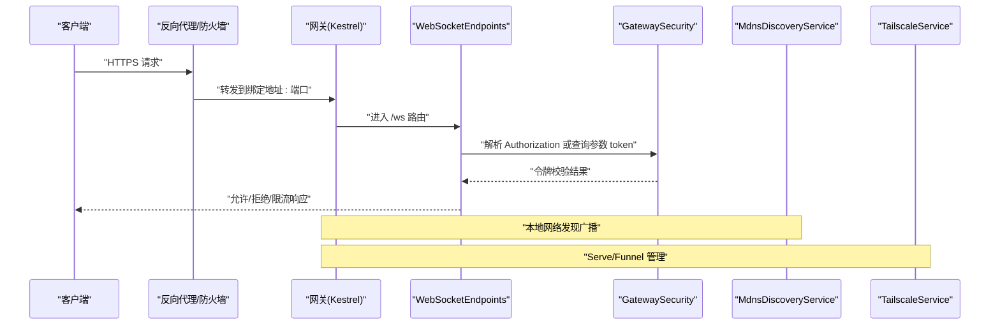
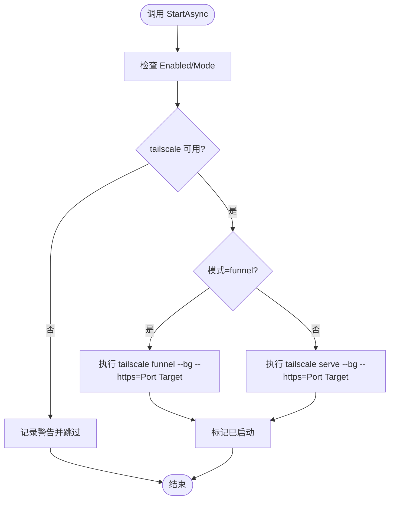
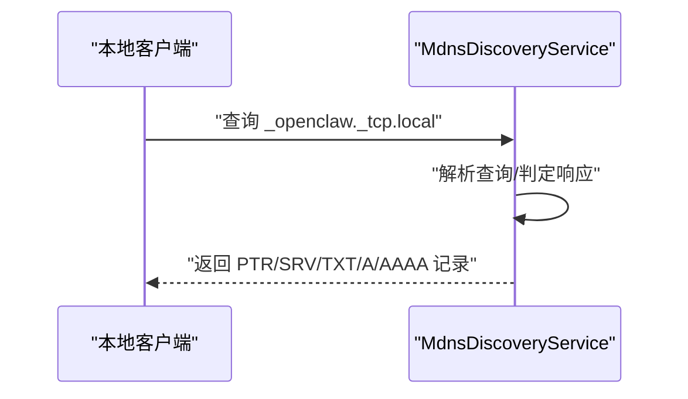
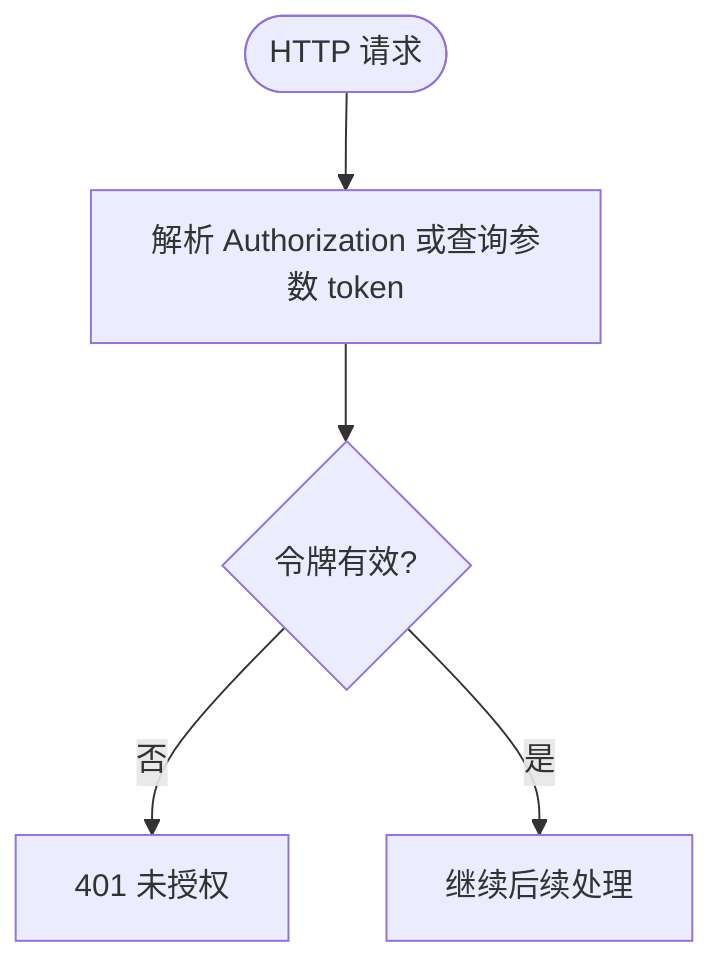
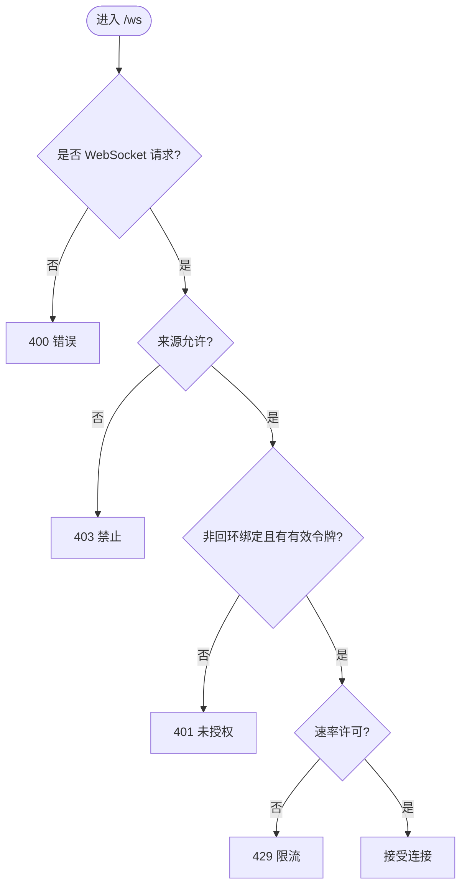
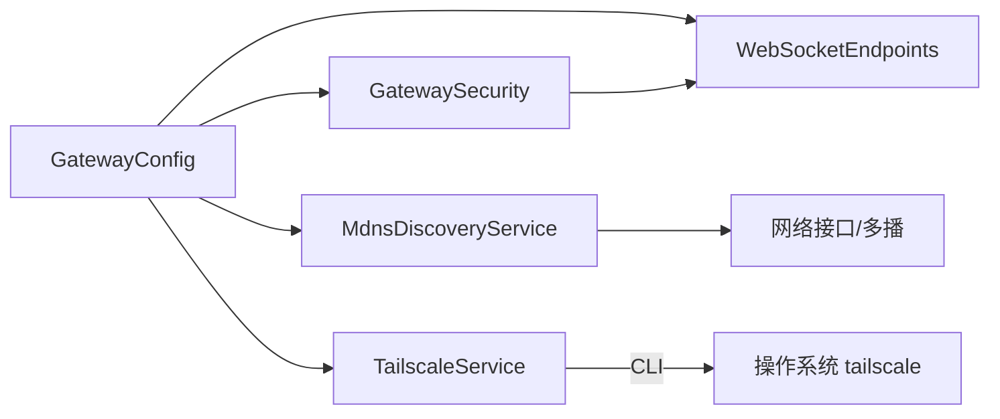

# 网络问题

<cite>
**本文引用的文件**
- [TailscaleService.cs](file://src/OpenClaw.Gateway/Integrations/TailscaleService.cs)
- [MdnsDiscoveryService.cs](file://src/OpenClaw.Gateway/Integrations/MdnsDiscoveryService.cs)
- [GatewaySecurity.cs](file://src/OpenClaw.Gateway/GatewaySecurity.cs)
- [WebSocketEndpoints.cs](file://src/OpenClaw.Gateway/Endpoints/WebSocketEndpoints.cs)
- [GatewayConfig.cs](file://src/OpenClaw.Core/Models/GatewayConfig.cs)
- [TailscaleServeAdvisor.cs](file://src/OpenClaw.Core/Validation/TailscaleServeAdvisor.cs)
- [README.md](file://README.md)
- [GatewayRuntimeLifecycleTests.cs](file://src/OpenClaw.Tests/GatewayRuntimeLifecycleTests.cs)
- [MdnsDiscoveryServiceTests.cs](file://src/OpenClaw.Tests/MdnsDiscoveryServiceTests.cs)
</cite>

## 目录
1. [简介](#简介)
2. [项目结构与网络相关模块](#项目结构与网络相关模块)
3. [核心组件](#核心组件)
4. [架构总览](#架构总览)
5. [详细组件分析](#详细组件分析)
6. [依赖关系分析](#依赖关系分析)
7. [性能考量](#性能考量)
8. [故障排除指南](#故障排除指南)
9. [结论](#结论)
10. [附录：检查清单与应急预案](#附录检查清单与应急预案)

## 简介
本文件面向 OpenClaw.NET 在实际部署与运行中遇到的网络问题，提供系统化的诊断与解决方法。重点覆盖以下方面：
- 网络连接失败、证书错误与认证问题的定位与修复
- TailscaleService 的网络发现与连接管理机制
- GatewaySecurity 的网络安全策略与访问控制配置
- SSL/TLS 证书、防火墙与代理配置检查清单
- DNS 解析、路由与连接超时的处理
- 不同网络环境（内网、外网、云环境）的特殊配置
- 网络监控、连接状态检查与流量分析
- 灾难恢复与网络故障切换的应急预案

## 项目结构与网络相关模块
OpenClaw.NET 将网络能力分布在多个层次：
- 网关启动与安全：GatewaySecurity 提供令牌解析与校验；WebSocketEndpoints 进行来源校验与速率限制
- 本地网络发现：MdnsDiscoveryService 基于 mDNS/DNS-SD 广播服务实例
- 外网穿透与零信任：TailscaleService 调用 tailscale CLI 实现 Serve/Funnel
- 配置模型：GatewayConfig 定义绑定地址、端口、安全策略、Tailscale 与 mDNS 配置
- 辅助诊断：TailscaleServeAdvisor 提供 Tailscale Serve 模式识别与本地 URL 推导

**图表来源**
- [WebSocketEndpoints.cs:63-118](file://src/OpenClaw.Gateway/Endpoints/WebSocketEndpoints.cs#L63-L118)
- [GatewaySecurity.cs:13-37](file://src/OpenClaw.Gateway/GatewaySecurity.cs#L13-L37)
- [MdnsDiscoveryService.cs:54-104](file://src/OpenClaw.Gateway/Integrations/MdnsDiscoveryService.cs#L54-L104)
- [TailscaleService.cs:35-84](file://src/OpenClaw.Gateway/Integrations/TailscaleService.cs#L35-L84)
- [GatewayConfig.cs:11-12](file://src/OpenClaw.Core/Models/GatewayConfig.cs#L11-L12)

**章节来源**
- [GatewayConfig.cs:11-12](file://src/OpenClaw.Core/Models/GatewayConfig.cs#L11-L12)
- [GatewayConfig.cs:863-897](file://src/OpenClaw.Core/Models/GatewayConfig.cs#L863-L897)

## 核心组件
- TailscaleService：负责在启用时通过 tailscale CLI 启动 Serve 或 Funnel，并在释放时停止
- MdnsDiscoveryService：在 IPv4/IPv6 多播组上响应查询，广播服务实例与地址信息
- GatewaySecurity：统一解析 Authorization Bearer 与可选查询参数 token，提供固定时间比较与 HMAC 校验
- WebSocketEndpoints：对 WebSocket 请求进行来源校验、非回环绑定下的认证校验与速率限制
- GatewayConfig：集中承载绑定地址、端口、安全策略、Tailscale 与 mDNS 配置项
- TailscaleServeAdvisor：识别 Tailscale Serve 模式并生成本地 URL

**章节来源**
- [TailscaleService.cs:10-33](file://src/OpenClaw.Gateway/Integrations/TailscaleService.cs#L10-L33)
- [MdnsDiscoveryService.cs:14-52](file://src/OpenClaw.Gateway/Integrations/MdnsDiscoveryService.cs#L14-L52)
- [GatewaySecurity.cs:8-37](file://src/OpenClaw.Gateway/GatewaySecurity.cs#L8-L37)
- [WebSocketEndpoints.cs:13-94](file://src/OpenClaw.Gateway/Endpoints/WebSocketEndpoints.cs#L13-L94)
- [GatewayConfig.cs:863-897](file://src/OpenClaw.Core/Models/GatewayConfig.cs#L863-L897)
- [TailscaleServeAdvisor.cs:23-30](file://src/OpenClaw.Core/Validation/TailscaleServeAdvisor.cs#L23-L30)

## 架构总览
下图展示从客户端到网关的关键网络交互路径，以及安全与发现组件的协作：

**图表来源**
- [WebSocketEndpoints.cs:18-94](file://src/OpenClaw.Gateway/Endpoints/WebSocketEndpoints.cs#L18-L94)
- [GatewaySecurity.cs:13-37](file://src/OpenClaw.Gateway/GatewaySecurity.cs#L13-L37)
- [MdnsDiscoveryService.cs:54-104](file://src/OpenClaw.Gateway/Integrations/MdnsDiscoveryService.cs#L54-L104)
- [TailscaleService.cs:35-84](file://src/OpenClaw.Gateway/Integrations/TailscaleService.cs#L35-L84)

## 详细组件分析

### TailscaleService：网络穿透与连接管理
- 启停流程
  - StartAsync：若未启用或模式为 off 则跳过；否则检查 tailscale 可用性后执行 serve/funnel 命令
  - DisposeAsync：停止已启动的 Serve/Funnel
- 关键行为
  - 模式选择：serve 用于本地 HTTPS 转发，funnel 用于公网入口
  - 端口映射：默认 443，可通过配置覆盖
  - 生命周期门控：使用信号量确保幂等启停
- 典型问题
  - tailscale 命令不可用或权限不足
  - 端口占用或防火墙阻断
  - 非预期重复启动导致资源泄漏

**图表来源**
- [TailscaleService.cs:35-84](file://src/OpenClaw.Gateway/Integrations/TailscaleService.cs#L35-L84)
- [TailscaleService.cs:118-148](file://src/OpenClaw.Gateway/Integrations/TailscaleService.cs#L118-L148)

**章节来源**
- [TailscaleService.cs:35-116](file://src/OpenClaw.Gateway/Integrations/TailscaleService.cs#L35-L116)
- [GatewayRuntimeLifecycleTests.cs:236-271](file://src/OpenClaw.Tests/GatewayRuntimeLifecycleTests.cs#L236-L271)

### MdnsDiscoveryService：本地网络发现与广播
- 功能要点
  - 同时监听 IPv4/IPv6 多播组，响应 PTR/SRV/TXT/A/AAAA 查询
  - 广播服务类型、实例名、主机名、端口与认证需求
  - 缓存本机可用地址，定期刷新
- 关键流程
  - Start：尝试启动 IPv4/IPv6 监听器，记录成功族别
  - ListenLoop：接收查询、解析、判定是否响应、构建响应包并发送
  - Dispose：取消任务、等待完成、释放资源
- 典型问题
  - 多播加入失败（权限/接口状态）
  - 地址过滤导致广播为空（回环/链路本地/站点本地被排除）

**图表来源**
- [MdnsDiscoveryService.cs:172-208](file://src/OpenClaw.Gateway/Integrations/MdnsDiscoveryService.cs#L172-L208)
- [MdnsDiscoveryService.cs:260-291](file://src/OpenClaw.Gateway/Integrations/MdnsDiscoveryService.cs#L260-L291)

**章节来源**
- [MdnsDiscoveryService.cs:54-104](file://src/OpenClaw.Gateway/Integrations/MdnsDiscoveryService.cs#L54-L104)
- [MdnsDiscoveryService.cs:172-208](file://src/OpenClaw.Gateway/Integrations/MdnsDiscoveryService.cs#L172-L208)
- [MdnsDiscoveryServiceTests.cs:36-64](file://src/OpenClaw.Tests/MdnsDiscoveryServiceTests.cs#L36-L64)

### GatewaySecurity：认证与签名验证
- 令牌解析
  - Authorization: Bearer 优先
  - 可选查询参数 token（需开启 AllowQueryStringToken）
- 安全校验
  - 固定时间比较避免时序攻击
  - HMAC-SHA256 签名解析与校验（支持带前缀与十六进制解码）
- 使用场景
  - WebSocketEndpoints 在非回环绑定时强制校验令牌
  - 支持组织策略快照中的引导令牌与账户令牌

**图表来源**
- [WebSocketEndpoints.cs:96-118](file://src/OpenClaw.Gateway/Endpoints/WebSocketEndpoints.cs#L96-L118)
- [GatewaySecurity.cs:13-37](file://src/OpenClaw.Gateway/GatewaySecurity.cs#L13-L37)

**章节来源**
- [GatewaySecurity.cs:13-37](file://src/OpenClaw.Gateway/GatewaySecurity.cs#L13-L37)
- [GatewaySecurity.cs:39-76](file://src/OpenClaw.Gateway/GatewaySecurity.cs#L39-L76)
- [WebSocketEndpoints.cs:96-118](file://src/OpenClaw.Gateway/Endpoints/WebSocketEndpoints.cs#L96-L118)

### WebSocketEndpoints：来源校验与速率限制
- 来源校验
  - 若存在 Origin，则必须与当前请求的 scheme/host/port 匹配
- 认证校验
  - 非回环绑定时，必须提供有效令牌（Bearer 或查询参数）
- 速率限制
  - 基于 IP 的桶消费，防止滥用

**图表来源**
- [WebSocketEndpoints.cs:63-94](file://src/OpenClaw.Gateway/Endpoints/WebSocketEndpoints.cs#L63-L94)

**章节来源**
- [WebSocketEndpoints.cs:63-94](file://src/OpenClaw.Gateway/Endpoints/WebSocketEndpoints.cs#L63-L94)

## 依赖关系分析
- 配置驱动
  - GatewayConfig 决定绑定地址、端口、安全策略、Tailscale 与 mDNS 行为
- 组件耦合
  - WebSocketEndpoints 依赖 GatewaySecurity 与组织策略服务
  - MdnsDiscoveryService 与 TailscaleService 独立运行，均受 GatewayConfig 影响
- 外部依赖
  - TailscaleService 依赖系统 tailscale CLI
  - mDNS 依赖系统多播与网络接口状态

**图表来源**
- [GatewayConfig.cs:863-897](file://src/OpenClaw.Core/Models/GatewayConfig.cs#L863-L897)
- [WebSocketEndpoints.cs:96-118](file://src/OpenClaw.Gateway/Endpoints/WebSocketEndpoints.cs#L96-L118)
- [GatewaySecurity.cs:13-37](file://src/OpenClaw.Gateway/GatewaySecurity.cs#L13-L37)
- [MdnsDiscoveryService.cs:54-104](file://src/OpenClaw.Gateway/Integrations/MdnsDiscoveryService.cs#L54-L104)
- [TailscaleService.cs:35-84](file://src/OpenClaw.Gateway/Integrations/TailscaleService.cs#L35-L84)

**章节来源**
- [GatewayConfig.cs:863-897](file://src/OpenClaw.Core/Models/GatewayConfig.cs#L863-L897)

## 性能考量
- mDNS 广播
  - 地址缓存 TTL 降低频繁扫描开销
  - 多族监听（IPv4/IPv6）可能增加资源占用，建议按需启用
- Tailscale
  - Serve/Funnel 会引入额外进程与网络栈，注意端口占用与系统资源
- WebSocket
  - 速率限制与连接数限制可防止资源耗尽
- 反向代理与转发头
  - 启用 KnownProxies 与 ForwardedHeaders 时，注意代理链长度与可信度

[本节为通用指导，无需列出具体文件来源]

## 故障排除指南

### 一、网络连接失败
- 症状
  - 客户端无法建立到网关的连接
- 诊断步骤
  - 检查绑定地址与端口：确认 GatewayConfig 中 BindAddress 与 Port 设置
  - 验证防火墙/安全组：放行目标端口
  - 检查反向代理：若使用 Nginx/Caddy/Cloudflare，确认转发规则与协议
  - 验证 mDNS 是否正常：查看本地网络是否能解析服务
- 快速定位
  - 使用 netstat/ss 检查端口占用
  - 使用 curl/wget 测试 HTTP/HTTPS 可达性
  - 查看网关日志中 mDNS 启动与监听族别

**章节来源**
- [GatewayConfig.cs:11-12](file://src/OpenClaw.Core/Models/GatewayConfig.cs#L11-L12)
- [MdnsDiscoveryService.cs:54-104](file://src/OpenClaw.Gateway/Integrations/MdnsDiscoveryService.cs#L54-L104)

### 二、证书错误（TLS/SSL）
- 症状
  - 浏览器提示证书不匹配、不受信或中间人拦截
- 诊断与修复
  - 反向代理前置：将 TLS 终止于 Nginx/Caddy/Cloudflare，网关使用 HTTP
  - 直接 Kestrel：正确配置 HTTPS 端点与证书文件
  - 代理信任：启用 TrustForwardedHeaders 并配置 KnownProxies
- 参考
  - 项目文档明确支持两种 TLS 方案与代理信任设置

**章节来源**
- [README.md:293-298](file://README.md#L293-L298)

### 三、认证问题（401/403）
- 症状
  - 非回环绑定时访问被拒绝
- 诊断与修复
  - 确认 Authorization: Bearer 令牌或查询参数 token（需开启 AllowQueryStringToken）
  - 检查组织策略中的引导令牌与账户令牌配置
  - 校验来源 Origin 与当前请求一致
- 速率限制
  - 若触发 429，检查客户端重试策略与速率限制阈值

**章节来源**
- [WebSocketEndpoints.cs:96-118](file://src/OpenClaw.Gateway/Endpoints/WebSocketEndpoints.cs#L96-L118)
- [GatewaySecurity.cs:13-37](file://src/OpenClaw.Gateway/GatewaySecurity.cs#L13-L37)

### 四、DNS 解析与路由错误
- 症状
  - 无法通过本地域名或服务发现找到网关
- 诊断与修复
  - 检查 mDNS 服务是否启动（IPv4/IPv6）
  - 确认服务类型与实例名符合预期
  - 验证本机地址过滤逻辑（排除回环/链路本地/站点本地）
- 单元测试参考
  - 验证实例响应包含 A/AAAA 记录与 TXT 标签

**章节来源**
- [MdnsDiscoveryService.cs:260-291](file://src/OpenClaw.Gateway/Integrations/MdnsDiscoveryService.cs#L260-L291)
- [MdnsDiscoveryServiceTests.cs:36-64](file://src/OpenClaw.Tests/MdnsDiscoveryServiceTests.cs#L36-L64)

### 五、连接超时
- 症状
  - 请求长时间无响应或被中断
- 诊断与修复
  - 检查上游代理超时设置
  - 网关侧 WebSocket 与工具执行超时配置
  - Tailscale 出站策略与网络质量

**章节来源**
- [GatewayConfig.cs:386-393](file://src/OpenClaw.Core/Models/GatewayConfig.cs#L386-L393)

### 六、不同网络环境的特殊配置
- 内网
  - 启用 mDNS 发现，便于自动发现
  - 绑定 127.0.0.1 或局域网地址，关闭公网暴露
- 外网/云
  - 使用 Tailscale Serve/Funnel 或反向代理 + 证书
  - 强制非回环绑定时必须配置 AuthToken 或组织策略令牌
  - 启用 TrustForwardedHeaders 与 KnownProxies

**章节来源**
- [README.md:277-298](file://README.md#L277-L298)
- [GatewayConfig.cs:855-861](file://src/OpenClaw.Core/Models/GatewayConfig.cs#L855-L861)

### 七、SSL/TLS、防火墙与代理检查清单
- SSL/TLS
  - 选择反向代理前置或 Kestrel 直接托管
  - 正确配置证书路径与私钥权限
- 防火墙
  - 开放网关端口与 mDNS 多播端口
  - 限制来源白名单
- 代理
  - 设置 ForwardedHeaders 与 KnownProxies
  - 校验代理链长度与可信度

**章节来源**
- [README.md:293-298](file://README.md#L293-L298)

### 八、网络监控、连接状态与流量分析
- 连接状态
  - 通过网关日志观察 mDNS 启动族别与 Tailscale 启停事件
  - 使用系统工具（ss/netstat）查看监听与连接
- 流量分析
  - 反向代理日志（Nginx/Caddy）记录请求/响应与错误码
  - WebSocket 层面可结合网关内部指标与仪表盘

**章节来源**
- [MdnsDiscoveryService.cs:96-103](file://src/OpenClaw.Gateway/Integrations/MdnsDiscoveryService.cs#L96-L103)
- [TailscaleService.cs:61-68](file://src/OpenClaw.Gateway/Integrations/TailscaleService.cs#L61-L68)

## 结论
OpenClaw.NET 的网络体系以配置为中心，结合 mDNS 本地发现、Tailscale 零信任穿透与严格的网关安全策略，形成从内网到公网的完整连通方案。针对常见问题，建议优先核对配置、证书与认证，再逐步排查网络与代理层面的问题。

[本节为总结性内容，无需列出具体文件来源]

## 附录：检查清单与应急预案

### 检查清单
- 基础连通性
  - 端口开放、防火墙放行、路由可达
- 证书与代理
  - 反向代理前置 TLS 或 Kestrel 直接托管
  - 反向代理信任与转发头配置
- 认证与来源
  - 非回环绑定时提供有效令牌
  - 来源 Origin 与当前请求一致
- 本地发现
  - mDNS 服务已启动，广播记录完整
- 外网穿透
  - Tailscale 已安装并可用
  - Serve/Funnel 模式与端口配置正确

### 应急预案
- 短期应急
  - 降级为本地回环绑定，临时关闭非必要插件
  - 切换到反向代理直连模式，绕过 Tailscale
- 长期恢复
  - 修复证书与代理链
  - 重新配置 Tailscale 与 mDNS
  - 校验组织策略与令牌分发

**章节来源**
- [README.md:277-298](file://README.md#L277-L298)
- [TailscaleService.cs:35-84](file://src/OpenClaw.Gateway/Integrations/TailscaleService.cs#L35-L84)
- [MdnsDiscoveryService.cs:54-104](file://src/OpenClaw.Gateway/Integrations/MdnsDiscoveryService.cs#L54-L104)