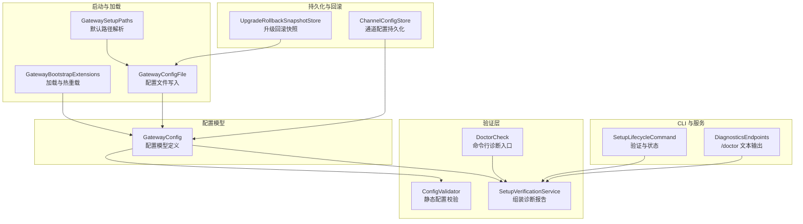
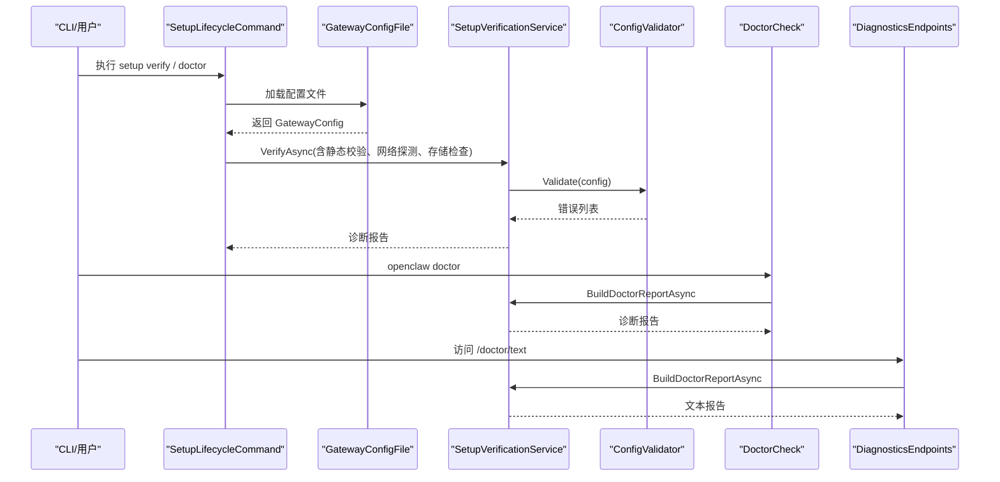
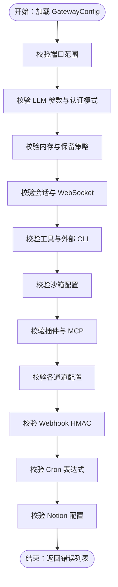
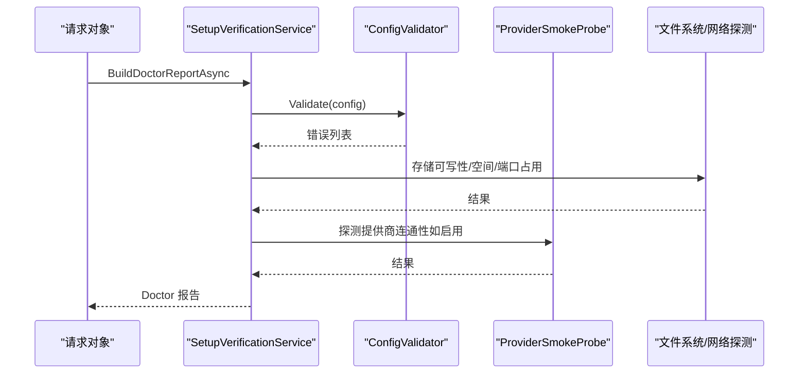
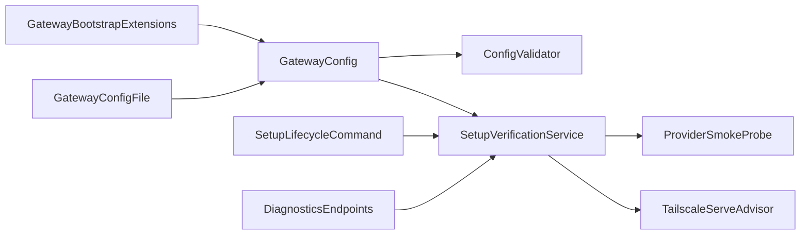

# 配置问题

<cite>
**本文引用的文件**
- [ConfigValidator.cs](file://src/OpenClaw.Core/Validation/ConfigValidator.cs)
- [SetupVerificationService.cs](file://src/OpenClaw.Core/Validation/SetupVerificationService.cs)
- [DoctorCheck.cs](file://src/OpenClaw.Core/Validation/DoctorCheck.cs)
- [GatewayConfig.cs](file://src/OpenClaw.Core/Models/GatewayConfig.cs)
- [GatewayBootstrapExtensions.cs](file://src/OpenClaw.Gateway/Bootstrap/GatewayBootstrapExtensions.cs)
- [GatewayConfigFile.cs](file://src/OpenClaw.Core/Setup/GatewayConfigFile.cs)
- [GatewaySetupPaths.cs](file://src/OpenClaw.Core/Setup/GatewaySetupPaths.cs)
- [SetupLifecycleCommand.cs](file://src/OpenClaw.Cli/SetupLifecycleCommand.cs)
- [UpgradeRollbackSnapshotStore.cs](file://src/OpenClaw.Core/Setup/UpgradeRollbackSnapshotStore.cs)
- [UpgradeCommands.cs](file://src/OpenClaw.Cli/UpgradeCommands.cs)
- [ChannelConfigStore.cs](file://src/OpenClaw.Gateway/Channels/ChannelConfigStore.cs)
- [DiagnosticsEndpoints.cs](file://src/OpenClaw.Gateway/Endpoints/DiagnosticsEndpoints.cs)
- [ConfigValidatorTests.cs](file://src/OpenClaw.Tests/ConfigValidatorTests.cs)
- [SetupCommandTests.cs](file://src/OpenClaw.Tests/SetupCommandTests.cs)
</cite>

## 目录
1. [简介](#简介)
2. [项目结构](#项目结构)
3. [核心组件](#核心组件)
4. [架构总览](#架构总览)
5. [详细组件分析](#详细组件分析)
6. [依赖关系分析](#依赖关系分析)
7. [性能考虑](#性能考虑)
8. [故障排除指南](#故障排除指南)
9. [结论](#结论)
10. [附录](#附录)

## 简介
本指南聚焦于 OpenClaw.NET 的配置问题与故障排除，围绕以下目标展开：
- 解释配置文件验证失败的常见原因与修复方法，涵盖模型提供商配置、API 密钥设置、端点配置等。
- 深入说明 ConfigValidator 如何进行静态校验，以及 SetupVerificationService 的验证流程与诊断输出。
- 提供环境变量、JSON 配置文件格式与路径设置的检查清单。
- 介绍配置热更新、回滚与备份策略。
- 对比开发、测试、生产等不同环境的配置差异与注意事项。
- 提供配置模板与示例，帮助快速正确设置各项参数。

## 项目结构
OpenClaw.NET 将配置验证与诊断能力分布在多个模块中：
- 核心验证：ConfigValidator 负责静态配置校验；SetupVerificationService 组装诊断报告；DoctorCheck 提供命令行诊断入口。
- 配置模型：GatewayConfig 定义所有可配置项的结构与默认值。
- 启动与加载：GatewayBootstrapExtensions 负责从 JSON 文件与环境变量加载配置，并支持热重载。
- 配置持久化与回滚：GatewayConfigFile、UpgradeRollbackSnapshotStore、ChannelConfigStore 等负责配置写入、升级回滚与通道配置持久化。
- CLI 与服务集成：SetupLifecycleCommand、DiagnosticsEndpoints 将验证与诊断能力暴露给 CLI 与网关内部。

图表来源
- [ConfigValidator.cs:35-405](file://src/OpenClaw.Core/Validation/ConfigValidator.cs#L35-L405)
- [SetupVerificationService.cs:60-164](file://src/OpenClaw.Core/Validation/SetupVerificationService.cs#L60-L164)
- [DoctorCheck.cs:11-37](file://src/OpenClaw.Core/Validation/DoctorCheck.cs#L11-L37)
- [GatewayConfig.cs:9-80](file://src/OpenClaw.Core/Models/GatewayConfig.cs#L9-L80)
- [GatewayBootstrapExtensions.cs:174-182](file://src/OpenClaw.Gateway/Bootstrap/GatewayBootstrapExtensions.cs#L174-L182)
- [GatewayConfigFile.cs:30-44](file://src/OpenClaw.Core/Setup/GatewayConfigFile.cs#L30-L44)
- [GatewaySetupPaths.cs:1-31](file://src/OpenClaw.Core/Setup/GatewaySetupPaths.cs#L1-L31)
- [UpgradeRollbackSnapshotStore.cs:103-144](file://src/OpenClaw.Core/Setup/UpgradeRollbackSnapshotStore.cs#L103-L144)
- [ChannelConfigStore.cs:37-94](file://src/OpenClaw.Gateway/Channels/ChannelConfigStore.cs#L37-L94)
- [SetupLifecycleCommand.cs:41-732](file://src/OpenClaw.Cli/SetupLifecycleCommand.cs#L41-L732)
- [DiagnosticsEndpoints.cs:182-193](file://src/OpenClaw.Gateway/Endpoints/DiagnosticsEndpoints.cs#L182-L193)

章节来源
- [GatewayBootstrapExtensions.cs:174-182](file://src/OpenClaw.Gateway/Bootstrap/GatewayBootstrapExtensions.cs#L174-L182)
- [GatewayConfig.cs:9-80](file://src/OpenClaw.Core/Models/GatewayConfig.cs#L9-L80)

## 核心组件
- ConfigValidator：对 GatewayConfig 进行全面的静态校验，覆盖端口、LLM 提供商与认证模式、内存与保留策略、会话与连接限制、工具与沙箱、插件与通道、定时任务、Webhook 等。
- SetupVerificationService：将静态校验、运行时状态、组织策略、提供商连通性探测、存储可用性与空间、端口占用、Tailscale Serve 状态等整合为诊断报告。
- DoctorCheck：提供命令行 --doctor 模式，直接输出诊断文本。
- GatewayConfig：集中定义所有配置项的结构、默认值与约束。
- GatewayBootstrapExtensions：从 JSON 文件与环境变量加载配置，支持通过 --config 参数与环境变量 OPENCLAW_CONFIG_PATH 注入自定义路径，并启用 reloadOnChange。
- GatewayConfigFile：将配置写入 JSON 文件，确保目录存在与缩进格式化。
- UpgradeRollbackSnapshotStore：在升级前保存快照，失败时可回滚。
- ChannelConfigStore：持久化通道配置到磁盘，便于容器重启后恢复。
- SetupLifecycleCommand 与 DiagnosticsEndpoints：将验证与诊断能力暴露给 CLI 与网关内部接口。

章节来源
- [ConfigValidator.cs:35-405](file://src/OpenClaw.Core/Validation/ConfigValidator.cs#L35-L405)
- [SetupVerificationService.cs:60-164](file://src/OpenClaw.Core/Validation/SetupVerificationService.cs#L60-L164)
- [DoctorCheck.cs:11-37](file://src/OpenClaw.Core/Validation/DoctorCheck.cs#L11-L37)
- [GatewayConfig.cs:9-80](file://src/OpenClaw.Core/Models/GatewayConfig.cs#L9-L80)
- [GatewayBootstrapExtensions.cs:174-182](file://src/OpenClaw.Gateway/Bootstrap/GatewayBootstrapExtensions.cs#L174-L182)
- [GatewayConfigFile.cs:30-44](file://src/OpenClaw.Core/Setup/GatewayConfigFile.cs#L30-L44)
- [UpgradeRollbackSnapshotStore.cs:103-144](file://src/OpenClaw.Core/Setup/UpgradeRollbackSnapshotStore.cs#L103-L144)
- [ChannelConfigStore.cs:37-94](file://src/OpenClaw.Gateway/Channels/ChannelConfigStore.cs#L37-L94)
- [SetupLifecycleCommand.cs:41-732](file://src/OpenClaw.Cli/SetupLifecycleCommand.cs#L41-L732)
- [DiagnosticsEndpoints.cs:182-193](file://src/OpenClaw.Gateway/Endpoints/DiagnosticsEndpoints.cs#L182-L193)

## 架构总览
下图展示配置验证与诊断在系统中的交互关系：

图表来源
- [SetupLifecycleCommand.cs:41-732](file://src/OpenClaw.Cli/SetupLifecycleCommand.cs#L41-L732)
- [GatewayConfigFile.cs:30-44](file://src/OpenClaw.Core/Setup/GatewayConfigFile.cs#L30-L44)
- [SetupVerificationService.cs:60-164](file://src/OpenClaw.Core/Validation/SetupVerificationService.cs#L60-L164)
- [ConfigValidator.cs:35-405](file://src/OpenClaw.Core/Validation/ConfigValidator.cs#L35-L405)
- [DoctorCheck.cs:11-37](file://src/OpenClaw.Core/Validation/DoctorCheck.cs#L11-L37)
- [DiagnosticsEndpoints.cs:182-193](file://src/OpenClaw.Gateway/Endpoints/DiagnosticsEndpoints.cs#L182-L193)

## 详细组件分析

### ConfigValidator 静态校验
- 端口范围与 LLM 基础参数校验：端口必须在 1-65535；模型、最大令牌数、温度、超时、重试次数、熔断阈值与冷却时间等均有明确范围。
- 本地推理与提示缓存：端口、上下文大小、启动超时、推理预算等有最小值要求；提示缓存方言与 keep-warm 设置需与提供商兼容。
- 内存与保留策略：内存提供者必须为 file/sqlite/mempalace；存储路径必填；压缩阈值需大于最大历史轮次；保留策略的间隔、TTL、归档保留等有最小值。
- 会话与 WebSocket：并发会话与超时、消息大小与连接上限等有最小值。
- 工具与外部 CLI：工作区仅限模式需绝对路径且根目录非空；允许读写根目录不得混用通配符与显式路径。
- 沙箱：当使用 OpenSandbox 时，端点必填；针对工具的沙箱模式与模板需满足约束。
- 插件与 MCP：MCP 服务器在 http 传输时需绝对 URL，在 stdio 传输时需命令；动态原生插件需 JIT 运行时。
- 通道：各通道的签名验证、密钥引用、类型与策略均有限制。
- Webhook：HMAC 校验开启时必须提供密钥。
- Cron：表达式需合法，字段范围正确。
- Notion：启用时需提供令牌与至少一个默认或允许的目标页面/数据库。

图表来源
- [ConfigValidator.cs:35-405](file://src/OpenClaw.Core/Validation/ConfigValidator.cs#L35-L405)

章节来源
- [ConfigValidator.cs:35-405](file://src/OpenClaw.Core/Validation/ConfigValidator.cs#L35-L405)
- [ConfigValidatorTests.cs:10-641](file://src/OpenClaw.Tests/ConfigValidatorTests.cs#L10-L641)

### SetupVerificationService 验证流程与诊断
- 输入：GatewayConfig、运行时状态、组织策略、操作员账户数量、离线模式、提供商探测注册表、配置源诊断、Tailscale Serve 状态等。
- 步骤：
  - 静态配置校验（调用 ConfigValidator）。
  - 配置源诊断（显示生效的绑定地址、存储路径、提供商与密钥来源等）。
  - 提示缓存兼容性检查。
  - 模型配置一致性检查（默认配置、回退配置、路由引用）。
  - 工作区就绪性与文件系统根策略检查。
  - 安全姿态检查（公共绑定下的安全策略）。
  - 浏览器工具可用性检查。
  - 操作员就绪度检查。
  - 模型医生检查。
  - 插件运行时与依赖检查。
  - MCP 服务器可达性检查。
  - 存储可写性与剩余空间检查。
  - 可选端口占用检查。
  - 可选提供商连通性探测（离线模式跳过）。
- 输出：按类别汇总的 DoctorCheckItem 列表，生成推荐下一步操作。

图表来源
- [SetupVerificationService.cs:83-164](file://src/OpenClaw.Core/Validation/SetupVerificationService.cs#L83-L164)
- [SetupVerificationService.cs:323-348](file://src/OpenClaw.Core/Validation/SetupVerificationService.cs#L323-L348)

章节来源
- [SetupVerificationService.cs:60-164](file://src/OpenClaw.Core/Validation/SetupVerificationService.cs#L60-L164)
- [SetupVerificationService.cs:323-348](file://src/OpenClaw.Core/Validation/SetupVerificationService.cs#L323-L348)

### DoctorCheck 命令行诊断
- 通过 openclaw doctor 直接运行诊断，输出文本报告，包含失败、警告、跳过与通过的检查项及建议。

章节来源
- [DoctorCheck.cs:11-37](file://src/OpenClaw.Core/Validation/DoctorCheck.cs#L11-L37)

### 配置加载与热更新
- 通过 --config 参数或环境变量 OPENCLAW_CONFIG_PATH 指定配置文件路径，GatewayBootstrapExtensions 会将其作为 JSON 文件加入配置源，并启用 reloadOnChange 实现热更新。
- 支持将配置写入 JSON 文件，确保目录存在与格式化缩进。

章节来源
- [GatewayBootstrapExtensions.cs:174-182](file://src/OpenClaw.Gateway/Bootstrap/GatewayBootstrapExtensions.cs#L174-L182)
- [GatewayConfigFile.cs:30-44](file://src/OpenClaw.Core/Setup/GatewayConfigFile.cs#L30-L44)

### 配置回滚与备份
- 升级前保存快照，失败时可回滚至上一稳定版本。
- 通道配置持久化到磁盘，容器重启后可恢复。

章节来源
- [UpgradeRollbackSnapshotStore.cs:103-144](file://src/OpenClaw.Core/Setup/UpgradeRollbackSnapshotStore.cs#L103-L144)
- [ChannelConfigStore.cs:37-94](file://src/OpenClaw.Gateway/Channels/ChannelConfigStore.cs#L37-L94)

## 依赖关系分析
- ConfigValidator 依赖 GatewayConfig 的结构定义与内置常量（如内置 LLM 提供商集合）。
- SetupVerificationService 依赖 ConfigValidator、ProviderSmokeProbe、TailscaleServeAdvisor、浏览器工具能力评估、存储与网络探测等。
- GatewayBootstrapExtensions 依赖 GatewayConfigFile 与环境变量解析。
- CLI 与网关端点通过 SetupLifecycleCommand 与 DiagnosticsEndpoints 调用 SetupVerificationService。

图表来源
- [GatewayConfig.cs:9-80](file://src/OpenClaw.Core/Models/GatewayConfig.cs#L9-L80)
- [ConfigValidator.cs:16-33](file://src/OpenClaw.Core/Validation/ConfigValidator.cs#L16-L33)
- [SetupVerificationService.cs:46-58](file://src/OpenClaw.Core/Validation/SetupVerificationService.cs#L46-L58)
- [GatewayBootstrapExtensions.cs:174-182](file://src/OpenClaw.Gateway/Bootstrap/GatewayBootstrapExtensions.cs#L174-L182)
- [GatewayConfigFile.cs:30-44](file://src/OpenClaw.Core/Setup/GatewayConfigFile.cs#L30-L44)
- [SetupLifecycleCommand.cs:41-732](file://src/OpenClaw.Cli/SetupLifecycleCommand.cs#L41-L732)
- [DiagnosticsEndpoints.cs:182-193](file://src/OpenClaw.Gateway/Endpoints/DiagnosticsEndpoints.cs#L182-L193)

章节来源
- [SetupVerificationService.cs:46-58](file://src/OpenClaw.Core/Validation/SetupVerificationService.cs#L46-L58)
- [GatewayBootstrapExtensions.cs:174-182](file://src/OpenClaw.Gateway/Bootstrap/GatewayBootstrapExtensions.cs#L174-L182)

## 性能考虑
- 静态校验复杂度主要取决于配置项数量与嵌套层级，通常为 O(n)。
- 提供商探测与网络连通性探测可能引入外部 I/O，应避免在高频路径重复执行。
- 存储空间与端口占用检查为轻量级系统调用，影响较小。
- 热更新通过 reloadOnChange 实现，建议在生产环境谨慎使用，避免频繁变更导致的抖动。

## 故障排除指南

### 通用检查清单
- 环境变量
  - OPENCLAW_CONFIG_PATH：指定配置文件路径（支持 ~ 展开与环境变量替换）。
  - 各通道与提供商的密钥引用：如 TELEGRAM_BOT_TOKEN、SLACK_BOT_TOKEN、SLACK_SIGNING_SECRET、WHATSAPP_APP_SECRET、TEAMS_APP_ID/APP_PASSWORD/TENANT_ID、DISCORD_BOT_TOKEN/APPLICATION_ID/PUBLIC_KEY 等。
  - 工作区路径：OPENCLAW_WORKSPACE。
- JSON 配置文件
  - 使用 GatewayConfigFile 写入的格式，确保目录存在、缩进一致。
  - 关键字段：bindAddress、port、llm.provider/model/apiKey/endpoint/authMode、memory.storagePath、tooling.workspaceOnly/workspaceRoot、plugins.mcp.servers.*.transport/url/command、channels.*.enabled/token/secret 等。
- 路径设置
  - 绝对路径：workspaceRoot、memory.storagePath、plugins.native.mqtt.host/port、plugins.native.email.smtp/imap 等。
  - 通配符与显式路径不能混用：allowedReadRoots/allowedWriteRoots。
- 端口与网络
  - 端口必须在 1-65535，且未被占用。
  - 公共绑定（0.0.0.0）需配合安全策略（信任转发头、请求者匹配、浏览器会话安全等）。
- 提示缓存与提供商
  - 动态/兼容型提供商需显式设置提示缓存方言（Dialect），keep-warm 仅部分提供商支持。
  - Aperture 在 bearer 模式下需提供 Endpoint 或 ApiKey；tailnet-identity 仅支持特定提供商。
- 沙箱与工具
  - OpenSandbox：启用时必须提供有效绝对 URL 的 endpoint；针对沙箱工具需设置模板。
  - 工具执行超时、并行执行、审批策略等需根据场景调整。
- 插件与 MCP
  - MCP 服务器在 http 传输时需绝对 URL；stdio 传输时需命令。
  - 动态原生插件需 JIT 运行时。
- 通道与 Webhook
  - 各通道签名验证开启时需提供密钥或引用。
  - Webhook HMAC 开启时必须提供密钥。
- Cron 与工作流
  - Cron 表达式需合法；工作流启用时必须提供后端配置与绝对 URL。

章节来源
- [GatewayBootstrapExtensions.cs:174-182](file://src/OpenClaw.Gateway/Bootstrap/GatewayBootstrapExtensions.cs#L174-L182)
- [GatewayConfigFile.cs:30-44](file://src/OpenClaw.Core/Setup/GatewayConfigFile.cs#L30-L44)
- [GatewayConfig.cs:534-772](file://src/OpenClaw.Core/Models/GatewayConfig.cs#L534-L772)
- [ConfigValidator.cs:35-405](file://src/OpenClaw.Core/Validation/ConfigValidator.cs#L35-L405)
- [SetupVerificationService.cs:1140-1179](file://src/OpenClaw.Core/Validation/SetupVerificationService.cs#L1140-L1179)

### 常见配置错误与修复
- LLM 提供商与认证模式不匹配
  - 现象：提示“不支持的内置提供商”或“tailnet-identity 不受支持”。
  - 修复：选择受支持的提供商；若使用 tailnet-identity，请确认提供商为 aperture 或 openai-compatible。
- Aperture 配置缺失
  - 现象：未设置 Endpoint 或 ApiKey。
  - 修复：当 AuthMode 非 tailnet-identity 时，必须提供 ApiKey；Endpoint 必须为绝对 http(s) URL。
- Webhook HMAC 校验
  - 现象：ValidateHmac=true 但未配置 Secret。
  - 修复：设置对应端点的 Secret。
- 通道签名验证
  - 现象：ValidateSignature=true 但未提供密钥或引用为空。
  - 修复：为相应通道设置密钥或引用。
- 工作区仅限模式
  - 现象：WorkspaceOnly=true 但 workspaceRoot 为空或非绝对路径。
  - 修复：设置绝对路径的工作区根目录。
- 文件系统根策略
  - 现象：AllowedReadRoots/AllowedWriteRoots 混用通配符与显式路径。
  - 修复：要么全部使用通配符，要么全部使用绝对路径。
- 沙箱配置
  - 现象：OpenSandbox 启用但 endpoint 缺失或无效；沙箱工具未设置模板。
  - 修复：提供有效绝对 URL 的 endpoint；为沙箱工具设置模板。
- 插件与 MCP
  - 现象：MCP http 服务器未提供 URL；stdio 服务器未提供命令。
  - 修复：按传输方式补齐必要字段。
- Cron 表达式
  - 现象：表达式非法或步长为 0。
  - 修复：使用合法 Cron 表达式，步长 ≥ 1。
- Notion 集成
  - 现象：启用时未提供令牌或未配置任何默认/允许的目标。
  - 修复：提供 ApiKeyRef 并至少设置一个默认或允许的页面/数据库 ID。

章节来源
- [ConfigValidatorTests.cs:10-641](file://src/OpenClaw.Tests/ConfigValidatorTests.cs#L10-L641)
- [ConfigValidator.cs:724-748](file://src/OpenClaw.Core/Validation/ConfigValidator.cs#L724-L748)
- [ConfigValidator.cs:879-919](file://src/OpenClaw.Core/Validation/ConfigValidator.cs#L879-L919)

### 配置热更新、回滚与备份
- 热更新
  - 通过 GatewayBootstrapExtensions 的 reloadOnChange 实现；修改配置文件后自动重新加载。
- 回滚
  - 升级前保存快照，失败时使用 UpgradeCommands 回滚至上一稳定版本。
- 备份
  - 通道配置持久化到磁盘，容器重启后可恢复；升级回滚快照用于整体配置回滚。

章节来源
- [GatewayBootstrapExtensions.cs:174-182](file://src/OpenClaw.Gateway/Bootstrap/GatewayBootstrapExtensions.cs#L174-L182)
- [UpgradeRollbackSnapshotStore.cs:103-144](file://src/OpenClaw.Core/Setup/UpgradeRollbackSnapshotStore.cs#L103-L144)
- [UpgradeCommands.cs:109-142](file://src/OpenClaw.Cli/UpgradeCommands.cs#L109-L142)
- [ChannelConfigStore.cs:37-94](file://src/OpenClaw.Gateway/Channels/ChannelConfigStore.cs#L37-L94)

### 不同环境的配置差异与注意事项
- 开发环境
  - 绑定地址：127.0.0.1；端口自定义；可禁用严格公共绑定策略；允许更多工具与浏览器工具。
- 测试环境
  - 绑定地址：127.0.0.1 或受限网络；启用必要的审批与工具限制；使用测试凭据。
- 生产环境
  - 绑定地址：0.0.0.0 时需严格安全策略（信任转发头、请求者匹配、浏览器会话安全、禁用桥接插件等）；启用 TLS 终结与反向代理；提供稳定的存储与网络连通性；定期进行提供商连通性探测与存储空间检查。

章节来源
- [SetupCommandTests.cs:88-143](file://src/OpenClaw.Tests/SetupCommandTests.cs#L88-L143)
- [SetupVerificationService.cs:481-538](file://src/OpenClaw.Core/Validation/SetupVerificationService.cs#L481-L538)

### 配置模板与示例
- 基础模板要点
  - bindAddress、port、authToken（可选）、llm.provider/model/apiKey/endpoint/authMode、memory.provider/storagePath、tooling.workspaceOnly/workspaceRoot、plugins.mcp.servers.*.transport/url/command、channels.*.enabled/token/secret、webhooks.endpoints.*.validateHmac/secret、cron.jobs.*.cronExpression/prompt、workflows.enabled/backends.*.baseUrl/pollIntervalSeconds/timeoutSeconds。
- 示例参考
  - 本地/公共/嵌入式/OLLAMA 等预设配置由 SetupCommandTests 展示，可据此生成符合场景的配置文件。

章节来源
- [SetupCommandTests.cs:24-86](file://src/OpenClaw.Tests/SetupCommandTests.cs#L24-L86)
- [SetupCommandTests.cs:88-143](file://src/OpenClaw.Tests/SetupCommandTests.cs#L88-L143)
- [SetupCommandTests.cs:145-196](file://src/OpenClaw.Tests/SetupCommandTests.cs#L145-L196)
- [SetupCommandTests.cs:198-256](file://src/OpenClaw.Tests/SetupCommandTests.cs#L198-L256)
- [SetupCommandTests.cs:258-311](file://src/OpenClaw.Tests/SetupCommandTests.cs#L258-L311)
- [SetupCommandTests.cs:313-337](file://src/OpenClaw.Tests/SetupCommandTests.cs#L313-L337)
- [SetupCommandTests.cs:339-394](file://src/OpenClaw.Tests/SetupCommandTests.cs#L339-L394)
- [SetupCommandTests.cs:396-465](file://src/OpenClaw.Tests/SetupCommandTests.cs#L396-L465)
- [SetupCommandTests.cs:467-515](file://src/OpenClaw.Tests/SetupCommandTests.cs#L467-L515)
- [SetupCommandTests.cs:517-561](file://src/OpenClaw.Tests/SetupCommandTests.cs#L517-L561)
- [SetupCommandTests.cs:563-589](file://src/OpenClaw.Tests/SetupCommandTests.cs#L563-L589)
- [SetupCommandTests.cs:591-642](file://src/OpenClaw.Tests/SetupCommandTests.cs#L591-L642)
- [SetupCommandTests.cs:644-703](file://src/OpenClaw.Tests/SetupCommandTests.cs#L644-L703)
- [SetupCommandTests.cs:705-757](file://src/OpenClaw.Tests/SetupCommandTests.cs#L705-L757)
- [SetupCommandTests.cs:759-833](file://src/OpenClaw.Tests/SetupCommandTests.cs#L759-L833)

## 结论
- OpenClaw.NET 的配置验证体系以 ConfigValidator 为核心，结合 SetupVerificationService 的综合诊断，能够快速定位配置问题。
- 通过环境变量与 JSON 文件的灵活组合，配合热更新、回滚与备份机制，可在不同环境中实现稳健的配置管理。
- 建议在生产环境遵循严格的公共绑定安全策略，并定期使用 --doctor 与 setup verify 进行健康检查。

## 附录
- 命令行入口
  - openclaw doctor：输出诊断文本。
  - openclaw setup verify：执行完整验证并输出报告。
  - openclaw setup status：查看上次验证状态与来源。
- 网关端点
  - /doctor/text：输出诊断文本。

章节来源
- [DoctorCheck.cs:11-37](file://src/OpenClaw.Core/Validation/DoctorCheck.cs#L11-L37)
- [SetupLifecycleCommand.cs:41-732](file://src/OpenClaw.Cli/SetupLifecycleCommand.cs#L41-L732)
- [DiagnosticsEndpoints.cs:182-193](file://src/OpenClaw.Gateway/Endpoints/DiagnosticsEndpoints.cs#L182-L193)