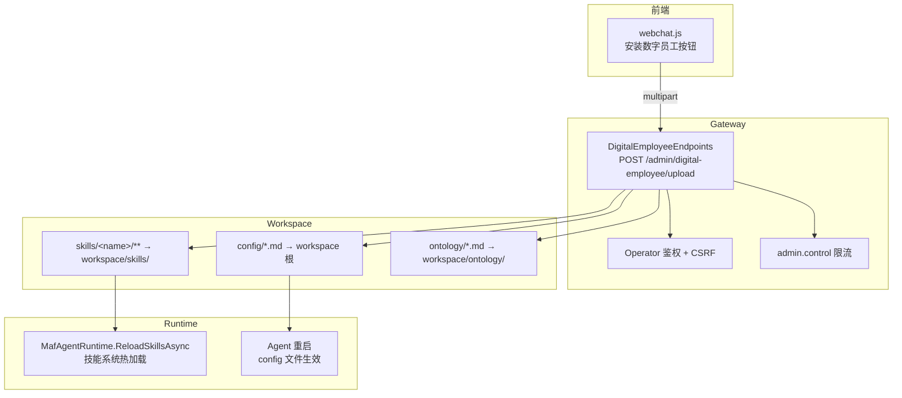
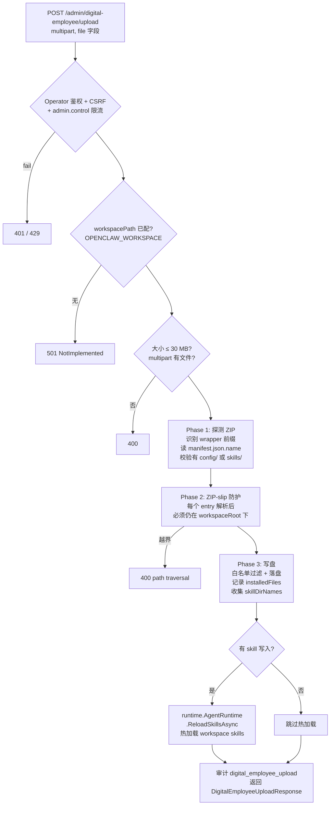

# 数字员工

<cite>
**本文引用的主要源码与设计文档**
- [src/OpenClaw.Gateway/Endpoints/DigitalEmployeeEndpoints.cs](file://src/OpenClaw.Gateway/Endpoints/DigitalEmployeeEndpoints.cs)（端点实现，权威来源）
- [src/OpenClaw.Core/Models/AdminApiModels.cs](file://src/OpenClaw.Core/Models/AdminApiModels.cs)（`DigitalEmployeeUploadResponse`）
- [src/OpenClaw.Core/Models/Session.cs](file://src/OpenClaw.Core/Models/Session.cs)（`CoreJsonContext` JSON 源生成注册）
- [src/OpenClaw.Gateway/wwwroot/webchat.js](file://src/OpenClaw.Gateway/wwwroot/webchat.js)（前端"安装数字员工"按钮）
- [docs/digital-employee-template.md](file://docs/digital-employee-template.md)（设计与模板规范）
- [docs/schemas/digital-employee-manifest.schema.json](file://docs/schemas/digital-employee-manifest.schema.json)（manifest JSON Schema）
- [src/OpenClaw.Plugins.EmploymentCoachWorkflow/](file://src/OpenClaw.Plugins.EmploymentCoachWorkflow/)（典型生产者）
</cite>

## 目录

1. [简介](#简介)
2. [模块边界与项目结构](#模块边界与项目结构)
3. [ZIP 包结构](#zip-包结构)
4. [上传端点 4 阶段流程](#上传端点-4-阶段流程)
5. [安全防护](#安全防护)
6. [落盘规则与生效时机](#落盘规则与生效时机)
7. [响应模型与错误码](#响应模型与错误码)
8. [manifest.json Schema](#manifestjson-schema)
9. [与技能系统/本体切片的关系](#与技能系统本体切片的关系)
10. [当前实现状态](#当前实现状态)
11. [扩展阅读](#扩展阅读)

---

## 简介

**数字员工（Digital Employee）** 是一种**ZIP 形式的可分发工作区资产包**，将一个 Agent 的"人格 + 记忆 + 能力"打包成一份归档，由 Gateway 的 `POST /admin/digital-employee/upload` 端点接收并解压到当前 workspace。它一次性把以下三类内容投递到运行环境：

- **配置类**（`config/`）：人格 / 身份 / 工具约束 / 记忆草稿
- **能力类**（`skills/`）：可热加载的 SkillKit 包
- **本体类**（`ontology/`）：领域语义素材

> 与"技能系统"对比：技能系统聚焦**单一能力**的离线打包与运行时加载；数字员工是**多能力 + 多配置**的整体投递层，**借用**技能系统的热加载入口（`MafAgentRuntime.ReloadSkillsAsync`）。

---

## 模块边界与项目结构



| 项目 | 职责 | 关键文件 |
|---|---|---|
| `OpenClaw.Gateway/Endpoints` | 端点实现 | [DigitalEmployeeEndpoints.cs](file://src/OpenClaw.Gateway/Endpoints/DigitalEmployeeEndpoints.cs) |
| `OpenClaw.Core.Models` | 响应 DTO | [AdminApiModels.cs](file://src/OpenClaw.Core/Models/AdminApiModels.cs#L278-L290) |
| `OpenClaw.Gateway/wwwroot` | 前端入口 | [webchat.js](file://src/OpenClaw.Gateway/wwwroot/webchat.js#L3202) |
| `docs/` | 设计与 Schema | [digital-employee-template.md](file://docs/digital-employee-template.md) / [digital-employee-manifest.schema.json](file://docs/schemas/digital-employee-manifest.schema.json) |
| `OpenClaw.Plugins.EmploymentCoachWorkflow` | 典型生产者插件 | [项目目录](file://src/OpenClaw.Plugins.EmploymentCoachWorkflow/) |

---

## ZIP 包结构

支持顶层有一个**可选的包装目录**（如 `my-employee/`）。识别的有效结构：

```
[wrapper/]
├── manifest.json           只读 name 字段（包名），不写盘
├── config/
│   ├── AGENTS.md           ┐
│   ├── SOUL.md             │ 仅这 4 个白名单文件会被解出
│   ├── IDENTITY.md         │ 直接落到 workspace 根
│   └── MEMORY.md           ┘
├── skills/
│   └── <skill-name>/**     skill 目录名必须匹配 ^[a-zA-Z0-9][a-zA-Z0-9_\-.]{0,63}$
│                           整个子树落到 workspace/skills/<skill-name>/
└── ontology/
    └── *.md                只接受顶层 .md，落到 workspace/ontology/
```

> **注意**：源码 [`MapEntryToWorkspaceRelative`](file://src/OpenClaw.Gateway/Endpoints/DigitalEmployeeEndpoints.cs#L234-L268) 是**唯一权威**。`docs/digital-employee-template.md` L27 写的 `.json` 是设计文档历史笔误，实际代码 [L263](file://src/OpenClaw.Gateway/Endpoints/DigitalEmployeeEndpoints.cs#L263) 校验 `.md` 后缀。

### 严格丢弃规则

| 输入 | 行为 |
|---|---|
| `config/` 下不在白名单的文件 | 静默丢弃 |
| `config/<dir>/...`（带子目录） | 静默丢弃 |
| `skills/<bad-name>/...`（名称不合规） | 静默丢弃 |
| `ontology/<sub>/foo.md` 或 `ontology/foo.txt` | 静默丢弃 |
| 任何其他顶层目录 | 不解出 |
| `manifest.json` 自身 | 不解出（仅读 `name` 字段） |

---

## 上传端点 4 阶段流程



阶段对应源码：

| 阶段 | 行号 | 关键调用 |
|---|---|---|
| 鉴权 + 限流 | [#L42-L50](file://src/OpenClaw.Gateway/Endpoints/DigitalEmployeeEndpoints.cs#L42-L50) | `EndpointHelpers.AuthorizeOperatorRequest` + `TryConsumeOperatorRateLimit` |
| 缓冲 ZIP 到内存 | [#L73-L87](file://src/OpenClaw.Gateway/Endpoints/DigitalEmployeeEndpoints.cs#L73-L87) | `MemoryStream` + `CopyToAsync` |
| Phase 1：探测 + 读 manifest | [#L89-L139](file://src/OpenClaw.Gateway/Endpoints/DigitalEmployeeEndpoints.cs#L89-L139) | `ZipArchive` + 顶层组件分析 + `JsonDocument.ParseAsync` |
| Phase 2：ZIP-slip 校验 | [#L141-L166](file://src/OpenClaw.Gateway/Endpoints/DigitalEmployeeEndpoints.cs#L141-L166) | `Path.GetFullPath` + 前缀比对 |
| Phase 3：写盘 + 收集 skill 名 | [#L168-L204](file://src/OpenClaw.Gateway/Endpoints/DigitalEmployeeEndpoints.cs#L168-L204) | 顺序解压 + `installedFiles` / `skillDirNames` |
| 热加载 | [#L206-L212](file://src/OpenClaw.Gateway/Endpoints/DigitalEmployeeEndpoints.cs#L206-L212) | `runtime.AgentRuntime.ReloadSkillsAsync(ctx.RequestAborted)` |
| 审计 + 返回 | [#L214-L226](file://src/OpenClaw.Gateway/Endpoints/DigitalEmployeeEndpoints.cs#L214-L226) | `AppendAudit` + `DigitalEmployeeUploadResponse` |

---

## 安全防护

| 项 | 实现 | 行号 |
|---|---|---|
| **鉴权** | Operator 身份 + 强制 CSRF token | [#L42](file://src/OpenClaw.Gateway/Endpoints/DigitalEmployeeEndpoints.cs#L42)（`requireCsrf: true`） |
| **限流** | `admin.control` 策略 → 429 | [#L46](file://src/OpenClaw.Gateway/Endpoints/DigitalEmployeeEndpoints.cs#L46) |
| **大小** | 硬上限 30 MB | [#L13](file://src/OpenClaw.Gateway/Endpoints/DigitalEmployeeEndpoints.cs#L13) `MaxUploadBytes = 30 * 1024 * 1024` |
| **ZIP-slip** | `Path.GetFullPath` 规范化后校验前缀 | [#L141-L158](file://src/OpenClaw.Gateway/Endpoints/DigitalEmployeeEndpoints.cs#L141-L158) |
| **配置白名单** | `AllowedConfigFiles` 写死 4 文件 | [#L16-L17](file://src/OpenClaw.Gateway/Endpoints/DigitalEmployeeEndpoints.cs#L16-L17) |
| **Skill 名校验** | 正则 `^[a-zA-Z0-9][a-zA-Z0-9_\-.]{0,63}$` | [#L254](file://src/OpenClaw.Gateway/Endpoints/DigitalEmployeeEndpoints.cs#L254) |
| **Ontology 限制** | 仅顶层 `.md` | [#L259-L264](file://src/OpenClaw.Gateway/Endpoints/DigitalEmployeeEndpoints.cs#L259-L264) |
| **manifest 隔离** | 仅读 `name`，不写盘 | [#L110-L118](file://src/OpenClaw.Gateway/Endpoints/DigitalEmployeeEndpoints.cs#L110-L118) |

---

## 落盘规则与生效时机

| 内容类型 | 落点 | 生效时机 |
|---|---|---|
| `skills/<name>/**` | `workspace/skills/<name>/` | **立即热加载** ([`ReloadSkillsAsync`](file://src/OpenClaw.Agent/MafAgentRuntime.cs#L181)) |
| `ontology/*.md` | `workspace/ontology/` | 由本体加载器按其自身策略读取 |
| `config/{AGENTS,SOUL,IDENTITY,MEMORY}.md` | workspace 根 | **下次 Agent 重启才生效** |
| `manifest.json` | 不写盘 | 仅 `name` 字段用于响应回显 + 审计 |

---

## 响应模型与错误码

### 成功响应 [`DigitalEmployeeUploadResponse`](file://src/OpenClaw.Core/Models/AdminApiModels.cs#L278-L290)

| 字段 | 含义 |
|---|---|
| `Success` | 是否成功 |
| `Error` | 失败原因（成功时为空） |
| `Name` | `manifest.json` 的 `name` |
| `SkillsInstalled` | 本次安装/更新的 skill 目录数 |
| `InstalledFiles` | 本次写入的 workspace 相对路径列表（正斜杠） |
| `TotalSkillsLoaded` | 热加载后 workspace 当前总 skill 数 |

JSON 源生成注册：[`Session.cs#L1101`](file://src/OpenClaw.Core/Models/Session.cs#L1101) `CoreJsonContext`。

### 错误响应

所有错误均以 `{ Success = false, Error = "<原因>" }` 形式返回：

| HTTP | 触发条件 |
|---|---|
| `401 Unauthorized` | Operator 鉴权或 CSRF 失败 |
| `429 Too Many Requests` | 命中 `admin.control` 限流 |
| `501 Not Implemented` | `OPENCLAW_WORKSPACE` 未配置 |
| `400 Bad Request` | 未携带文件 / 超过 30 MB / ZIP 损坏 / 不含 `config/` 或 `skills/` / 命中 ZIP-slip |
| `500 Internal Server Error` | 解压阶段异常（落盘失败等） |

---

## manifest.json Schema

JSON Schema：[`docs/schemas/digital-employee-manifest.schema.json`](file://docs/schemas/digital-employee-manifest.schema.json)（draft-2020-12）。

| 字段 | 类型 | 必填 | 后端读取 | 说明 |
|---|---|:---:|:---:|---|
| `name` | string (1-128) | ✅ | ✅ 回显 + 审计 | 包名 |
| `version` | SemVer string | ❌ | ❌ | 仅供人工/CI |
| `author` | string (1-256) | ❌ | ❌ | 作者/组织 |
| `description` | string (≤2048) | ❌ | ❌ | 一句话简述 |
| 其他自定义字段 | any | ❌ | ❌ | `additionalProperties: true` 允许扩展 |

### 最小示例

```json
{ "name": "demo-employee" }
```

### 推荐示例

```json
{
  "$schema": "https://openclaw.dev/schemas/digital-employee-manifest.schema.json",
  "name": "hr-coach",
  "version": "1.2.0",
  "author": "OpenClaw Team <devs@openclaw.dev>",
  "description": "面向 HR 场景的对话教练，含简历筛选与面试问答两组 skill。"
}
```

---

## 与技能系统/本体切片的关系

数字员工是**投递层**，技能系统与本体切片是**承载内容**：

| 维度 | 数字员工 | 技能系统 | 本体切片 |
|---|---|---|---|
| 形态 | ZIP 包 + 上传端点 | Skill 目录 / SkillKit 包 | `*.slice.json` / `*.projection.json` |
| 入口 | `POST /admin/digital-employee/upload` | `SkillLoader.LoadAll` | `SkillProjectionResolver.ResolveForRequest` |
| 作用范围 | 整个 workspace（多 skill + 配置 + 本体） | 单个 skill 能力 | per-request 任务域裁决 |
| 生效时机 | skill 立即热加载、config 重启生效 | 启动 / 热重载触发 | 每次请求执行时 |
| 关键交互 | 写入 `workspace/skills/` 后调用 `ReloadSkillsAsync` | 由 workspace 源加载（[`SkillSource.Workspace`](file://src/OpenClaw.Core/Skills/SkillModels.cs#L140-L147)） | 通过 `SkillDefinition.ProjectionContracts` 绑定 |

详见 [技能系统](../技能系统/技能系统.md) / [本体切片](../本体切片/本体切片.md)。

---

## 当前实现状态

| 能力 | 状态 | 位置 |
|---|---|---|
| 上传端点（4 阶段） | ✅ 已落地 | [DigitalEmployeeEndpoints.cs](file://src/OpenClaw.Gateway/Endpoints/DigitalEmployeeEndpoints.cs) |
| Operator 鉴权 + CSRF | ✅ 已落地 | [#L42](file://src/OpenClaw.Gateway/Endpoints/DigitalEmployeeEndpoints.cs#L42) |
| `admin.control` 限流 | ✅ 已落地 | [#L46](file://src/OpenClaw.Gateway/Endpoints/DigitalEmployeeEndpoints.cs#L46) |
| 30 MB 上限 | ✅ 已落地 | [#L13](file://src/OpenClaw.Gateway/Endpoints/DigitalEmployeeEndpoints.cs#L13) |
| ZIP-slip 防护 | ✅ 已落地 | [#L141-L166](file://src/OpenClaw.Gateway/Endpoints/DigitalEmployeeEndpoints.cs#L141-L166) |
| Skill 热加载（无需重启） | ✅ 已落地 | [#L206-L212](file://src/OpenClaw.Gateway/Endpoints/DigitalEmployeeEndpoints.cs#L206-L212) |
| 审计日志（`digital_employee_upload`） | ✅ 已落地 | [#L214-L215](file://src/OpenClaw.Gateway/Endpoints/DigitalEmployeeEndpoints.cs#L214-L215) + [#L280-L299](file://src/OpenClaw.Gateway/Endpoints/DigitalEmployeeEndpoints.cs#L280-L299) |
| 前端入口（webchat） | ✅ 已落地 | [webchat.js#L3202](file://src/OpenClaw.Gateway/wwwroot/webchat.js#L3202) |
| `manifest.json` JSON Schema | ✅ 已落地 | [docs/schemas/digital-employee-manifest.schema.json](file://docs/schemas/digital-employee-manifest.schema.json) |
| 后端 manifest 字段读取 | ⚠️ 仅 `name`（其余字段保留给上游/CI） | [#L116-L117](file://src/OpenClaw.Gateway/Endpoints/DigitalEmployeeEndpoints.cs#L116-L117) |

---

## 扩展阅读

- 上一层导航：[网关服务 / 端点路由和API](../网关服务/端点路由和API.md)
- 邻近主题：[技能系统](../技能系统/技能系统.md) / [本体切片](../本体切片/本体切片.md)
- 设计与模板规范：[docs/digital-employee-template.md](file://docs/digital-employee-template.md)
- JSON Schema：[docs/schemas/digital-employee-manifest.schema.json](file://docs/schemas/digital-employee-manifest.schema.json)
- 典型生产者：[OpenClaw.Plugins.EmploymentCoachWorkflow](file://src/OpenClaw.Plugins.EmploymentCoachWorkflow/)（含可参照的 `skills/` 目录）
- 客户端审计 cite：[客户端库 / HTTP 客户端 / 集成 API / 操作员审计](../客户端库/HTTP%20客户端/集成%20API/操作员审计.md)
