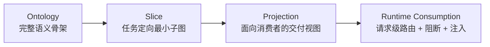
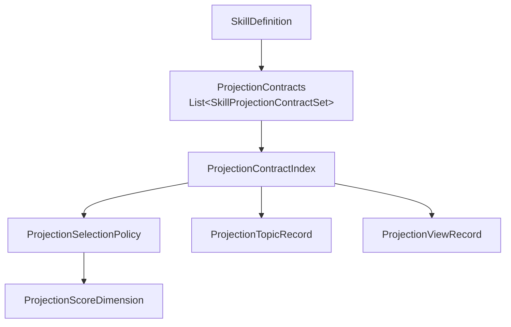
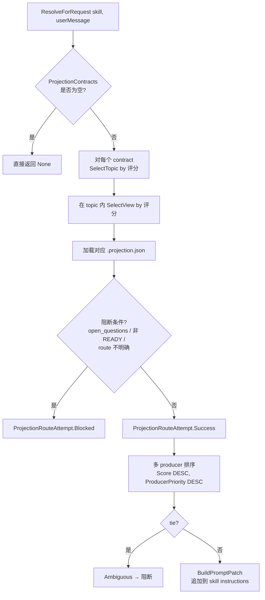
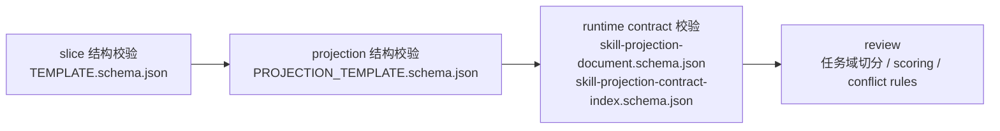
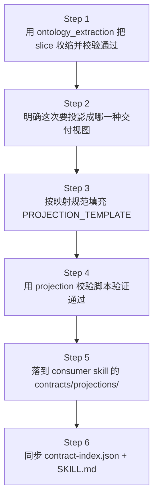

# 本体切片

<cite>
**本文引用的文件**
- [docs/ontology-slice-projection-summary.md](file://docs/ontology-slice-projection-summary.md)
- [docs/ontology_extraction-slice-to-skill-method.md](file://docs/ontology_extraction-slice-to-skill-method.md)
- [docs/ontology_extraction-first-skill-practical-template.md](file://docs/ontology_extraction-first-skill-practical-template.md)
- [docs/skill-projection-contracts-design.md](file://docs/skill-projection-contracts-design.md)
- [docs/skill-projection-contracts-schema.md](file://docs/skill-projection-contracts-schema.md)
- [docs/skill-projection-schema-migration-checklist.md](file://docs/skill-projection-schema-migration-checklist.md)
- [docs/skillloader-loadall-analysis.md](file://docs/skillloader-loadall-analysis.md)
- [docs/skill-projection-document.schema.json](file://docs/skill-projection-document.schema.json)
- [docs/skill-projection-contract-index.schema.json](file://docs/skill-projection-contract-index.schema.json)
- [scripts/validate-ontology-slice.py](file://scripts/validate-ontology-slice.py)
- [scripts/validate-ontology-projection.py](file://scripts/validate-ontology-projection.py)
- [scripts/validate-skill-projection-document.py](file://scripts/validate-skill-projection-document.py)
- [scripts/validate-skill-projection-contract-index.py](file://scripts/validate-skill-projection-contract-index.py)
- [SkillProjectionModels.cs](file://src/OpenClaw.Core/Models/SkillProjectionModels.cs)
- [SkillProjectionResolver.cs](file://src/OpenClaw.Core/Skills/SkillProjectionResolver.cs)
- [SkillProjectionArtifactTerms.cs](file://src/OpenClaw.Core/Skills/SkillProjectionArtifactTerms.cs)
- [SkillModels.cs](file://src/OpenClaw.Core/Skills/SkillModels.cs)
- [MafAgentRuntime.cs](file://src/OpenClaw.Agent/MafAgentRuntime.cs)
- [DigitalEmployeeEndpoints.cs](file://src/OpenClaw.Gateway/Endpoints/DigitalEmployeeEndpoints.cs)
</cite>

## 目录
1. [简介](#简介)
2. [概念分层](#概念分层)
3. [仓库内文档与脚本布局](#仓库内文档与脚本布局)
4. [Slice 与 Projection 的产物形态](#slice-与-projection-的产物形态)
5. [Runtime 接线：从 contracts 到 prompt patch](#runtime-接线从-contracts-到-prompt-patch)
6. [校验入口与诊断状态](#校验入口与诊断状态)
7. [与数字员工模板的关系](#与数字员工模板的关系)
8. [推荐方法路径](#推荐方法路径)
9. [当前实现状态与未落地项](#当前实现状态与未落地项)
10. [扩展阅读](#扩展阅读)

---

## 简介

本体切片（Ontology Slice）是仓库内一条已逐步成型的**语义治理主线**：把面向任务的最小语义子图，从知识整理产物演进为可被 Skill Runtime 发现、路由、阻断、注入到 prompt 的正式控制面输入。

它要解决的不是"如何描述完整领域本体"，而是三个工程问题：

- 如何从复杂材料中**抽取当前任务真正需要的最小语义子图**；
- 如何把这份子图**稳定交付**给某个具体业务 Skill；
- 如何让业务 Skill 在运行时**按用户请求动态选**任务域、选交付视图、加载 projection，并在不安全时**阻断而非猜测**。

> 本主题在 repowiki 中此前没有独立目录，相关知识此前散落在 `docs/`、`scripts/` 与若干代码模型中。本文档把它们整合为可索引的入口。

---

## 概念分层

整个体系分四层，各层职责严格不重叠：



| 层 | 产物 | 关键产出 | 主要职责 |
|---|---|---|---|
| **Ontology** | 领域知识体 | concepts / relations / constraints / 术语边界 | 提供稳定语义基础 |
| **Slice** | 最小可验证子图 | `*.slice.json` + `sources` | 任务定向地收缩范围 |
| **Projection** | 面向消费者的契约 | `*.projection.json` + `contract-index.json` | 把 slice 投影成 4 类交付视图之一 |
| **Runtime** | prompt patch | `SkillProjectionResolver` 输出 | 在每个 turn 选择并注入 |

### Slice 必须保留的 4 类信息

- `concepts`：业务对象、状态、类型、术语边界
- `relations`：必须保留的对象间关系
- `constraints`：会改变实现/判断/生成结果的规则
- `sources`：结论来源与可信度

判断标准是反向的：**少一项是否会让当前任务无法判断**——若不会，就不应纳入 slice。

### 4 类常见交付视图（Projection View）

| view | 适用场景 |
|---|---|
| `domain-model` | 实现对象、领域结构、运行时对象模型 |
| `json-schema` | 结构校验、字段约束、机器可检验契约 |
| `prompt-constraint` | 收缩模型用词、推理路径、禁止假设 |
| `workflow-contract` | 步骤关系、生命周期流转、执行编排 |

---

## 仓库内文档与脚本布局

本仓库的本体切片主线由 4 类文件构成。

### 1. 设计与方法论文档（`docs/`）

| 文件 | 用途 |
|---|---|
| [docs/ontology-slice-projection-summary.md](file://docs/ontology-slice-projection-summary.md) | **总览**：从 ontology 到 runtime 的治理化落地总结 |
| [docs/ontology_extraction-slice-to-skill-method.md](file://docs/ontology_extraction-slice-to-skill-method.md) | **方法论**：从 ontology_extraction 到业务 Skill 的端到端流程 |
| [docs/ontology_extraction-first-skill-practical-template.md](file://docs/ontology_extraction-first-skill-practical-template.md) | **实操模板**：为新业务 Skill 落第一份 slice/projection |
| [docs/ontology_slice_projection_guide.html](file://docs/ontology_slice_projection_guide.html) | HTML 版导引 |
| [docs/skill-projection-contracts-design.md](file://docs/skill-projection-contracts-design.md) | runtime contract 设计 |
| [docs/skill-projection-contracts-schema.md](file://docs/skill-projection-contracts-schema.md) | runtime contract schema 说明 |
| [docs/skill-projection-schema-migration-checklist.md](file://docs/skill-projection-schema-migration-checklist.md) | producer/runtime schema 边界迁移清单 |
| [docs/skillloader-loadall-analysis.md](file://docs/skillloader-loadall-analysis.md) | SkillLoader.LoadAll 深度解析 |

### 2. JSON Schema 契约（`docs/`）

| Schema | 校验目标 |
|---|---|
| [docs/skill-projection-document.schema.json](file://docs/skill-projection-document.schema.json) | `*.projection.json` 单文档 |
| [docs/skill-projection-contract-index.schema.json](file://docs/skill-projection-contract-index.schema.json) | `contract-index.json` 路由入口 |

### 3. 仓库根校验脚本（`scripts/`）

| 脚本 | 校验对象 | 何时使用 |
|---|---|---|
| [scripts/validate-ontology-slice.py](file://scripts/validate-ontology-slice.py) | producer 侧 slice | 仓库根目录入口 |
| [scripts/validate-ontology-projection.py](file://scripts/validate-ontology-projection.py) | producer 侧 projection 草案 | 仓库根目录入口 |
| [scripts/validate-skill-projection-document.py](file://scripts/validate-skill-projection-document.py) | consumer 落盘的 `*.projection.json` | runtime contract 校验 |
| [scripts/validate-skill-projection-contract-index.py](file://scripts/validate-skill-projection-contract-index.py) | consumer 的 `contract-index.json` | runtime contract 校验 |

> 注：`ontology_extraction` 技能根目录另有同名 `validate-slice.py`、`validate-projection.py`，作为 producer 侧的就近入口。

### 4. Producer / Consumer 真实示例

- **Producer**（`ontology_extraction` skill）：
  - producer skill 自身当前未在本仓库以独立目录形式落地；producer 侧的就近校验入口已由 `scripts/` 提供：[scripts/validate-ontology-slice.py](file://scripts/validate-ontology-slice.py)、[scripts/validate-ontology-projection.py](file://scripts/validate-ontology-projection.py)
  - 模板（`TEMPLATE.json` + `TEMPLATE.schema.json`、`PROJECTION_TEMPLATE.json` + `.schema.json`）与样例（`examples/{ready,warning,invalid}`）随 producer skill 在外部仓库维护，不在本仓内
- **Consumer**（`software-developer` skill）：
  - [src/OpenClaw.Gateway/skills/software-developer/contracts/projections/ontology_extraction/contract-index.json](file://src/OpenClaw.Gateway/skills/software-developer/contracts/projections/ontology_extraction/contract-index.json)
  - 真实 4 视图主题示例：`memory-session.{domain-model,json-schema,prompt-constraint,workflow-contract}.projection.json`

---

## Slice 与 Projection 的产物形态

### Slice 文件骨架

```jsonc
{
  "$schema": "…/TEMPLATE.schema.json",
  "topic": "memory-session",
  "concepts":   [ /* 业务对象、状态、术语 */ ],
  "relations":  [ /* 对象间必须保留的关系 */ ],
  "constraints":[ /* 会改变实现的规则 */ ],
  "sources":    [ /* 结论来源 */ ],
  "open_questions": [],   // 显式悬而未决项
  "ambiguities":   [],
  "uncertainties": []
}
```

### Projection 文件骨架

```jsonc
{
  "$schema": "…/skill-projection-document.schema.json",
  "projection_version": "1.x",
  "projection": {
    "projection_type": "domain-model | json-schema | prompt-constraint | workflow-contract",
    "target_format":   "...",
    "target_runtime":  "...",
    "source_slice":    "memory-session.slice.json"
  },
  "concept_mappings":    [ /* slice.concepts → 输出 */ ],
  "relation_mappings":   [ /* slice.relations → 输出 */ ],
  "constraint_mappings": [ /* slice.constraints → 输出 */ ],
  "prompt_projection":   { /* 术语边界、禁止假设、澄清要求、推理路径 */ },
  "delivery_artifacts":  [ /* 真正交付物 */ ],
  "dropped_items":       [ /* 显式说明丢弃了哪些 */ ],
  "open_questions":      [ /* 不能消费的悬而未决项 */ ]
}
```

> **核心原则**：显式映射，不做隐式继承。slice 中保留的关键概念不应在 projection 里"无痕消失"；不能消费的关系/约束要明确落到 `dropped_items` 或 `open_questions`。

### Contract Index 路由入口

`contract-index.json` 是 consumer 侧**唯一**的机器入口，承担：

- `producer / consumer` 元数据
- 任务域（topic）与交付视图（view）评分
- topic / view 的组织关系
- default selection policy
- 冲突处理规则
- producer priority

---

## Runtime 接线：从 contracts 到 prompt patch

### 数据模型

[SkillProjectionModels.cs](file://src/OpenClaw.Core/Models/SkillProjectionModels.cs) 定义了 runtime 侧的全部模型：



`SkillDefinition` 通过 [ProjectionContracts](file://src/OpenClaw.Core/Skills/SkillModels.cs#L128) 字段（kingcrab-only 扩展）持有该 skill 绑定的所有 projection 契约。

### 解析流程

[SkillProjectionResolver.ResolveForRequest](file://src/OpenClaw.Core/Skills/SkillProjectionResolver.cs#L12) 是请求级解析的入口。每个 turn 的处理顺序：



### 实际接线点

[MafAgentRuntime.cs](file://src/OpenClaw.Agent/MafAgentRuntime.cs#L1032-L1043) 在 maf 推理路径中调用：

```csharp
var resolution = SkillProjectionResolver.ResolveForRequest(skill, userMessage, _logger ?? NullLogger.Instance);
…
var patch = SkillProjectionResolver.BuildPromptPatch(resolution);
```

### 阻断条件清单

按 [docs/skill-projection-contracts-design.md](file://docs/skill-projection-contracts-design.md) 的设计，runtime 应**阻断而非猜测**的情况：

- topic 选择不明确
- 交付视图选择不明确
- projection 文件缺失或解析失败
- 视图状态不是 `READY`
- 存在 `open_questions` 且策略要求阻断
- 多 producer 之间出现 `Score = ProducerPriority` 的同分歧义

---

## 校验入口与诊断状态

### 状态三档（结构 + 质量分离）

| 状态 | 含义 | runtime 行为 |
|---|---|---|
| `READY`   | 结构合法 + 质量审核通过 | 可路由，可消费 |
| `WARNING` | 结构合法 + 存在改进项     | 可路由，记录告警 |
| `FAIL`    | 结构非法 / 不可用       | 不进入路由 |

### Discovery Diagnostics（设计稿）

| 状态 | 含义 |
|---|---|
| `none` | 未发现任何 contract |
| `bound` | 发现且全部解析成功 |
| `partial` | 发现部分但有未解析项 |
| `parse-failed` | 发现但解析失败 |
| `enumeration-failed` | 目录枚举失败 |

### 校验顺序（先结构、后质量）



仓库根目录推荐入口：

```bash
# producer 侧
python scripts/validate-ontology-slice.py        <slice.json>
python scripts/validate-ontology-projection.py   <projection.json>

# runtime contract（consumer 落盘后）
python scripts/validate-skill-projection-document.py        <topic.view.projection.json>
python scripts/validate-skill-projection-contract-index.py  <contract-index.json>
```

---

## 与数字员工模板的关系

数字员工模板 ZIP 包通过 [DigitalEmployeeEndpoints.cs](file://src/OpenClaw.Gateway/Endpoints/DigitalEmployeeEndpoints.cs) 上传时，**只接受顶层 `.md` 形式的 ontology 文件**：

```
[wrapper/]
└── ontology/
    └── *.md          仅接受顶层 .md，落到 workspace/ontology/
```

由 [MapEntryToWorkspaceRelative](file://src/OpenClaw.Gateway/Endpoints/DigitalEmployeeEndpoints.cs#L234) 实施静默丢弃：

| 输入 | 行为 |
|---|---|
| `ontology/foo.md` | ✅ 落盘到 `workspace/ontology/foo.md` |
| `ontology/sub/foo.md` | ❌ 静默丢弃（拒绝子目录） |
| `ontology/foo.txt` | ❌ 静默丢弃（仅 `.md`） |

> 注意范围差异：数字员工 ZIP 中的 `ontology/*.md` 是**人类可读的本体说明**，不是本主题中讲到的 `*.slice.json` / `*.projection.json` 结构化产物。后者落点在 skill 目录的 `contracts/projections/<producer>/`，由 `skills/<name>/**` 整子树带入。

---

## 推荐方法路径

迁移到新业务 Skill 时，**严格按下面顺序**推进，不要先在 consumer 侧补 projection：



每步跳过的代价：

| 跳过 | 代价 |
|---|---|
| Step 1 | 结构看起来完整，但没有可靠来源支撑（伪契约） |
| Step 2 | 4 类视图要求混在一起，谁都不好用 |
| Step 3 | 复制模板改名字，无法解释保留/丢弃决策 |
| Step 4 | 大量 "看起来像 contract、runtime 读不稳" 的文件 |
| Step 5 | 即使合法，仍只是 producer 侧资产 |

---

## 当前实现状态与未落地项

| 能力 | 状态 | 位置 |
|---|---|---|
| 4 类交付视图概念 | ✅ 已落地 | docs/ + producer 模板 |
| Slice / Projection schema | ✅ 已落地 | docs/*.schema.json |
| 仓库根校验脚本 | ✅ 已落地 | scripts/validate-*.py |
| `SkillDefinition.ProjectionContracts` 字段 | ✅ 已落地 | [SkillModels.cs#L128](file://src/OpenClaw.Core/Skills/SkillModels.cs#L128) |
| Runtime 模型 | ✅ 已落地 | [SkillProjectionModels.cs](file://src/OpenClaw.Core/Models/SkillProjectionModels.cs) |
| `ResolveForRequest` + `BuildPromptPatch` | ✅ 已落地 | [SkillProjectionResolver.cs](file://src/OpenClaw.Core/Skills/SkillProjectionResolver.cs) |
| Maf runtime 接线 | ✅ 已落地 | [MafAgentRuntime.cs#L1032-L1043](file://src/OpenClaw.Agent/MafAgentRuntime.cs#L1032-L1043) |
| Producer 示例（`ontology_extraction`） | ✅ 已落地 | EmploymentCoachWorkflow/skills/ |
| Consumer 示例（`software-developer`） | ✅ 已落地 | Gateway/skills/software-developer/contracts/projections/ |
| **SkillLoader 自动发现 `contracts/projections/**/contract-index.json`** | ✅ 已落地（commit `42caa44`） | [SkillLoader.cs#L302](file://src/OpenClaw.Core/Skills/SkillLoader.cs#L302) 调用 `TryLoadProjectionContracts`；[SkillLoader.cs#L418-L525](file://src/OpenClaw.Core/Skills/SkillLoader.cs#L418-L525) 实现递归扫描 |
| Discovery diagnostics（none/bound/partial/parse-failed/enumeration-failed）| ✅ 已落地 | [SkillLoader.cs#L513-L524](file://src/OpenClaw.Core/Skills/SkillLoader.cs#L513-L524) 返回 `SkillProjectionDiscovery` 状态对象 |
| 端到端回归测试 | ✅ 已落地 | [SkillTests.cs#L517-L611](file://src/OpenClaw.Tests/SkillTests.cs#L517-L611) 验证 contract-index.json 自动绑定 |

> 现状：`SkillLoader.LoadAll` 在加载每个 skill 目录时，会对其 `contracts/projections/` 子树递归扫描所有 `contract-index.json` 文件，解析后写入 `SkillDefinition.ProjectionContracts`，并通过 `ProjectionDiscovery` 暴露发现状态供诊断。`docs/skillloader-loadall-analysis.md` 早期描述的"自动发现"已不再是设计稿。

---

## 扩展阅读

- 上一层导航：[网关服务 / 端点路由和 API](../网关服务/端点路由和API.md)
- 数字员工端点源码：[DigitalEmployeeEndpoints.cs](file://src/OpenClaw.Gateway/Endpoints/DigitalEmployeeEndpoints.cs)
- 校验脚本入口：仓库根 `scripts/` 目录（详见本文 §6 校验入口与诊断状态）
- 设计稿全文（仓库内）：[docs/ontology-slice-projection-summary.md](file://docs/ontology-slice-projection-summary.md)
- 方法论全文（仓库内）：[docs/ontology_extraction-slice-to-skill-method.md](file://docs/ontology_extraction-slice-to-skill-method.md)
- Patent 资料（含术语主表）：[docs/patent/patent-terminology-master-table.md](file://docs/patent/patent-terminology-master-table.md)
