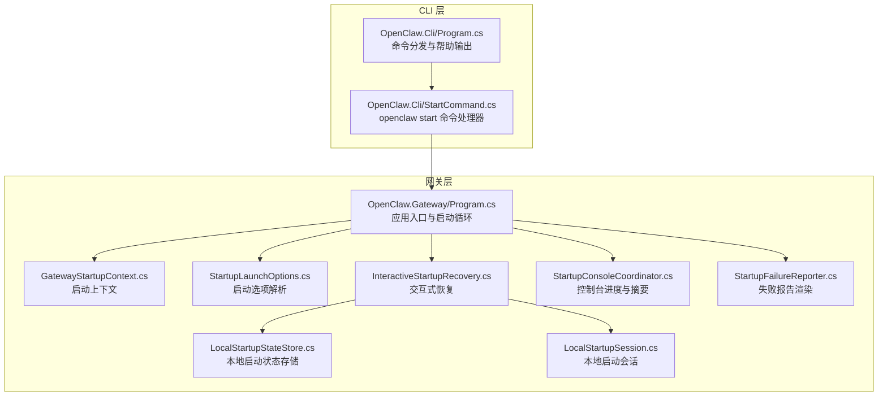
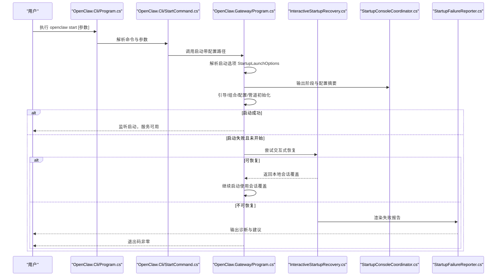
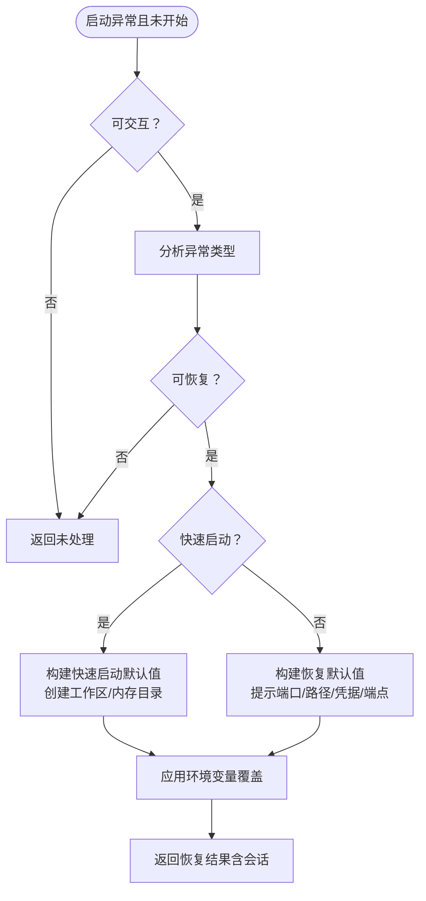
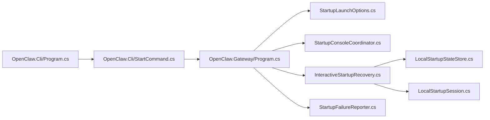

# 启动架构

<cite>
**本文引用的文件**
- [Program.cs](file://src/OpenClaw.Gateway/Program.cs)
- [StartupLaunchOptions.cs](file://src/OpenClaw.Gateway/Bootstrap/StartupLaunchOptions.cs)
- [InteractiveStartupRecovery.cs](file://src/OpenClaw.Gateway/Bootstrap/InteractiveStartupRecovery.cs)
- [StartupConsoleCoordinator.cs](file://src/OpenClaw.Gateway/Bootstrap/StartupConsoleCoordinator.cs)
- [StartupFailureReporter.cs](file://src/OpenClaw.Gateway/Bootstrap/StartupFailureReporter.cs)
- [GatewayStartupContext.cs](file://src/OpenClaw.Gateway/Bootstrap/GatewayStartupContext.cs)
- [LocalStartupStateStore.cs](file://src/OpenClaw.Gateway/Bootstrap/LocalStartupStateStore.cs)
- [LocalStartupSession.cs](file://src/OpenClaw.Gateway/Bootstrap/LocalStartupSession.cs)
- [Program.cs](file://src/OpenClaw.Cli/Program.cs)
- [StartCommand.cs](file://src/OpenClaw.Cli/StartCommand.cs)
</cite>

## 目录
1. [简介](#简介)
2. [项目结构](#项目结构)
3. [核心组件](#核心组件)
4. [架构总览](#架构总览)
5. [详细组件分析](#详细组件分析)
6. [依赖关系分析](#依赖关系分析)
7. [性能考量](#性能考量)
8. [故障排查指南](#故障排查指南)
9. [结论](#结论)
10. [附录](#附录)

## 简介
本文件系统性阐述 OpenClaw.NET 的启动架构与流程，聚焦于四阶段模型：Bootstrap（引导阶段）、Composition（组合阶段）、Profiles（配置阶段）、Pipeline（管道阶段）。文档覆盖启动参数解析、配置来源与合并、安全与健康检查、启动失败恢复机制、交互式启动协调器工作原理，并提供启动流程图与错误处理策略，帮助开发者与运维人员快速理解并高效排障。

## 项目结构
OpenClaw.NET 的启动入口位于网关应用与 CLI 工具两个维度：
- 网关入口：在网关应用中完成配置加载、服务注册、运行时初始化与监听启动。
- CLI 入口：在 CLI 中解析用户命令与参数，协调“启动”流程，必要时触发引导模式或本地快速启动。

图表来源
- [Program.cs:14-124](file://src/OpenClaw.Gateway/Program.cs#L14-L124)
- [StartupLaunchOptions.cs:57-71](file://src/OpenClaw.Gateway/Bootstrap/StartupLaunchOptions.cs#L57-L71)
- [InteractiveStartupRecovery.cs:72-150](file://src/OpenClaw.Gateway/Bootstrap/InteractiveStartupRecovery.cs#L72-L150)
- [StartupConsoleCoordinator.cs:15-37](file://src/OpenClaw.Gateway/Bootstrap/StartupConsoleCoordinator.cs#L15-L37)
- [StartupFailureReporter.cs:20-50](file://src/OpenClaw.Gateway/Bootstrap/StartupFailureReporter.cs#L20-L50)
- [GatewayStartupContext.cs:6-14](file://src/OpenClaw.Gateway/Bootstrap/GatewayStartupContext.cs#L6-L14)
- [LocalStartupStateStore.cs:16-22](file://src/OpenClaw.Gateway/Bootstrap/LocalStartupStateStore.cs#L16-L22)
- [LocalStartupSession.cs:3-11](file://src/OpenClaw.Gateway/Bootstrap/LocalStartupSession.cs#L3-L11)
- [Program.cs:12-69](file://src/OpenClaw.Cli/Program.cs#L12-L69)
- [StartCommand.cs:9-47](file://src/OpenClaw.Cli/StartCommand.cs#L9-L47)

章节来源
- [Program.cs:14-124](file://src/OpenClaw.Gateway/Program.cs#L14-L124)
- [Program.cs:12-69](file://src/OpenClaw.Cli/Program.cs#L12-L69)
- [StartCommand.cs:9-47](file://src/OpenClaw.Cli/StartCommand.cs#L9-L47)

## 核心组件
- 启动选项解析器：负责解析命令行参数、环境变量、外部配置路径，生成启动选项对象，支持快速启动模式校验与提示能力。
- 交互式启动恢复：在启动异常时，根据可恢复条件进行引导，提供端口切换、工作区与内存目录选择、凭据输入等交互式修复。
- 控制台协调器：输出启动阶段信息、展示配置来源与最终生效配置摘要，便于诊断。
- 失败报告器：对常见启动失败场景进行分类与建议，输出结构化诊断信息。
- 启动上下文：承载配置、运行时状态、插件宿主等启动期关键数据。
- 本地启动状态与会话：持久化本地启动偏好，支持快速启动与恢复会话注入。

章节来源
- [StartupLaunchOptions.cs:57-88](file://src/OpenClaw.Gateway/Bootstrap/StartupLaunchOptions.cs#L57-L88)
- [InteractiveStartupRecovery.cs:72-150](file://src/OpenClaw.Gateway/Bootstrap/InteractiveStartupRecovery.cs#L72-L150)
- [StartupConsoleCoordinator.cs:15-37](file://src/OpenClaw.Gateway/Bootstrap/StartupConsoleCoordinator.cs#L15-L37)
- [StartupFailureReporter.cs:52-80](file://src/OpenClaw.Gateway/Bootstrap/StartupFailureReporter.cs#L52-L80)
- [GatewayStartupContext.cs:6-14](file://src/OpenClaw.Gateway/Bootstrap/GatewayStartupContext.cs#L6-L14)
- [LocalStartupStateStore.cs:16-22](file://src/OpenClaw.Gateway/Bootstrap/LocalStartupStateStore.cs#L16-L22)
- [LocalStartupSession.cs:3-11](file://src/OpenClaw.Gateway/Bootstrap/LocalStartupSession.cs#L3-L11)

## 架构总览
下图展示了从 CLI 到网关启动的总体流程，以及启动失败时的交互式恢复路径。

图表来源
- [Program.cs:12-69](file://src/OpenClaw.Cli/Program.cs#L12-L69)
- [StartCommand.cs:9-47](file://src/OpenClaw.Cli/StartCommand.cs#L9-L47)
- [Program.cs:14-124](file://src/OpenClaw.Gateway/Program.cs#L14-L124)
- [InteractiveStartupRecovery.cs:72-150](file://src/OpenClaw.Gateway/Bootstrap/InteractiveStartupRecovery.cs#L72-L150)
- [StartupConsoleCoordinator.cs:8-13](file://src/OpenClaw.Gateway/Bootstrap/StartupConsoleCoordinator.cs#L8-L13)
- [StartupFailureReporter.cs:7-18](file://src/OpenClaw.Gateway/Bootstrap/StartupFailureReporter.cs#L7-L18)

## 详细组件分析

### 启动参数解析（StartupLaunchOptions）
- 职责
  - 解析原始参数，剔除仅用于快速启动的标志位，生成有效参数集。
  - 识别医生模式、健康检查模式、快速启动请求、配置标志存在性。
  - 解析来自命令行与环境变量的配置路径，判断是否覆盖外部配置。
  - 提供快速启动参数合法性校验，禁止与医生/健康检查/配置路径/非交互终端等组合。
- 关键点
  - 快速启动必须在交互终端、且不能与医生/健康检查/配置路径同时使用。
  - 支持从环境变量读取外部配置路径，作为覆盖源之一。
  - 生成“有效参数”用于后续引导阶段，避免重复处理快速启动标志。

章节来源
- [StartupLaunchOptions.cs:57-88](file://src/OpenClaw.Gateway/Bootstrap/StartupLaunchOptions.cs#L57-L88)
- [StartupLaunchOptions.cs:106-120](file://src/OpenClaw.Gateway/Bootstrap/StartupLaunchOptions.cs#L106-L120)

### 交互式启动协调器（InteractiveStartupRecovery）
- 职责
  - 在启动异常且未进入运行态时，尝试交互式恢复。
  - 快速启动：在无外部配置的情况下，应用最小化本地配置，绑定回环地址，使用文件型内存，不持久化，便于快速体验。
  - 恢复启动：根据异常类型与当前配置，提示端口切换、工作区/内存路径、凭据与端点输入，生成临时会话并注入环境变量。
- 可恢复条件
  - 认证令牌缺失（非回环绑定需令牌）。
  - 存储路径不可写或权限不足。
  - 提供商凭据或端点缺失。
  - 端口占用。
- 会话注入
  - 设置开发环境、回环绑定、文件内存、禁用保留归档、凭据与端点等环境变量，确保本次启动可用。

图表来源
- [InteractiveStartupRecovery.cs:72-150](file://src/OpenClaw.Gateway/Bootstrap/InteractiveStartupRecovery.cs#L72-L150)
- [InteractiveStartupRecovery.cs:204-218](file://src/OpenClaw.Gateway/Bootstrap/InteractiveStartupRecovery.cs#L204-L218)

章节来源
- [InteractiveStartupRecovery.cs:72-150](file://src/OpenClaw.Gateway/Bootstrap/InteractiveStartupRecovery.cs#L72-L150)
- [InteractiveStartupRecovery.cs:296-322](file://src/OpenClaw.Gateway/Bootstrap/InteractiveStartupRecovery.cs#L296-L322)

### 控制台协调器（StartupConsoleCoordinator）
- 职责
  - 输出启动阶段名称，便于用户感知进度。
  - 输出配置来源（JSON 文件列表）与最终生效配置摘要，辅助诊断。
- 配置摘要
  - 列出所有 JSON 配置源文件，去重显示。
  - 显示当前会话覆盖状态（如“快速启动/恢复”）。
  - 使用诊断构建器渲染“生效配置赢家”，直观呈现优先级与来源。

章节来源
- [StartupConsoleCoordinator.cs:8-13](file://src/OpenClaw.Gateway/Bootstrap/StartupConsoleCoordinator.cs#L8-L13)
- [StartupConsoleCoordinator.cs:15-37](file://src/OpenClaw.Gateway/Bootstrap/StartupConsoleCoordinator.cs#L15-L37)
- [StartupConsoleCoordinator.cs:39-51](file://src/OpenClaw.Gateway/Bootstrap/StartupConsoleCoordinator.cs#L39-L51)

### 失败报告器（StartupFailureReporter）
- 职责
  - 对异常进行分类分析，生成标题、摘要、详情与修复建议。
  - 针对认证令牌缺失、存储路径不可写、提供商凭据/端点缺失、端口占用等常见问题提供针对性建议。
  - 支持医生模式与快速启动建议的附加提示。
- 报告结构
  - 标题：简洁描述失败原因。
  - 摘要：简述问题影响。
  - 详情：列出关键配置项与底层错误。
  - 建议：分步骤修复清单。

章节来源
- [StartupFailureReporter.cs:20-50](file://src/OpenClaw.Gateway/Bootstrap/StartupFailureReporter.cs#L20-L50)
- [StartupFailureReporter.cs:52-80](file://src/OpenClaw.Gateway/Bootstrap/StartupFailureReporter.cs#L52-L80)
- [StartupFailureReporter.cs:82-111](file://src/OpenClaw.Gateway/Bootstrap/StartupFailureReporter.cs#L82-L111)
- [StartupFailureReporter.cs:113-153](file://src/OpenClaw.Gateway/Bootstrap/StartupFailureReporter.cs#L113-L153)
- [StartupFailureReporter.cs:155-208](file://src/OpenClaw.Gateway/Bootstrap/StartupFailureReporter.cs#L155-L208)
- [StartupFailureReporter.cs:210-233](file://src/OpenClaw.Gateway/Bootstrap/StartupFailureReporter.cs#L210-L233)
- [StartupFailureReporter.cs:235-266](file://src/OpenClaw.Gateway/Bootstrap/StartupFailureReporter.cs#L235-L266)

### 启动上下文与状态
- 启动上下文（GatewayStartupContext）
  - 携带最终配置、运行时状态、是否非回环绑定、配置来源诊断、工作区路径、原生动态插件宿主等。
- 本地启动状态存储（LocalStartupStateStore）
  - 原子化读写本地启动状态文件，记录上次工作区、内存路径、端口、提供商、模型等偏好。
- 本地启动会话（LocalStartupSession）
  - 表示一次临时覆盖的启动会话，包含模式、工作区、内存路径、端口、提供商、模型、凭据引用与端点。

章节来源
- [GatewayStartupContext.cs:6-14](file://src/OpenClaw.Gateway/Bootstrap/GatewayStartupContext.cs#L6-L14)
- [LocalStartupStateStore.cs:16-22](file://src/OpenClaw.Gateway/Bootstrap/LocalStartupStateStore.cs#L16-L22)
- [LocalStartupSession.cs:3-11](file://src/OpenClaw.Gateway/Bootstrap/LocalStartupSession.cs#L3-L11)

### CLI 启动命令与参数处理
- CLI 入口
  - 解析命令与参数，分发到具体命令处理器；支持帮助、版本、通用选项等。
- openclaw start
  - 若配置存在：直接调用启动生命周期命令。
  - 若配置不存在：进入引导设置流程，完成后自动启动。
  - 自动补全 --config 参数，确保启动时携带正确配置路径。
- 环境变量与默认值
  - 基础 URL 与认证令牌可通过环境变量传递，CLI 提供解析逻辑。

章节来源
- [Program.cs:12-69](file://src/OpenClaw.Cli/Program.cs#L12-L69)
- [Program.cs:481-539](file://src/OpenClaw.Cli/Program.cs#L481-L539)
- [StartCommand.cs:9-47](file://src/OpenClaw.Cli/StartCommand.cs#L9-L47)
- [StartCommand.cs:70-96](file://src/OpenClaw.Cli/StartCommand.cs#L70-L96)

## 依赖关系分析
- CLI 与网关的耦合
  - CLI 通过命令分发与参数解析，将“启动”请求转交给网关启动流程。
  - CLI 负责引导与配置准备，网关负责实际的服务注册、运行时初始化与监听。
- 网关内部模块协作
  - 启动选项解析器为引导阶段提供参数基础。
  - 控制台协调器与失败报告器贯穿启动全过程，提升可观测性与可诊断性。
  - 交互式恢复在异常早期介入，降低人工干预成本。
- 外部依赖
  - 网关应用基于 ASP.NET Core 构建，使用 Slim 构建器与生命周期回调。
  - 插件宿主与 MCP、A2A 等扩展在组合阶段注入。

图表来源
- [Program.cs:12-69](file://src/OpenClaw.Cli/Program.cs#L12-L69)
- [StartCommand.cs:9-47](file://src/OpenClaw.Cli/StartCommand.cs#L9-L47)
- [Program.cs:14-124](file://src/OpenClaw.Gateway/Program.cs#L14-L124)
- [StartupLaunchOptions.cs:57-71](file://src/OpenClaw.Gateway/Bootstrap/StartupLaunchOptions.cs#L57-L71)
- [StartupConsoleCoordinator.cs:15-37](file://src/OpenClaw.Gateway/Bootstrap/StartupConsoleCoordinator.cs#L15-L37)
- [InteractiveStartupRecovery.cs:72-150](file://src/OpenClaw.Gateway/Bootstrap/InteractiveStartupRecovery.cs#L72-L150)
- [StartupFailureReporter.cs:20-50](file://src/OpenClaw.Gateway/Bootstrap/StartupFailureReporter.cs#L20-L50)
- [LocalStartupStateStore.cs:16-22](file://src/OpenClaw.Gateway/Bootstrap/LocalStartupStateStore.cs#L16-L22)
- [LocalStartupSession.cs:3-11](file://src/OpenClaw.Gateway/Bootstrap/LocalStartupSession.cs#L3-L11)

章节来源
- [Program.cs:12-69](file://src/OpenClaw.Cli/Program.cs#L12-L69)
- [StartCommand.cs:9-47](file://src/OpenClaw.Cli/StartCommand.cs#L9-L47)
- [Program.cs:14-124](file://src/OpenClaw.Gateway/Program.cs#L14-L124)

## 性能考量
- 启动阶段延迟优化
  - 控制台输出与配置摘要在引导阶段尽早完成，避免阻塞后续初始化。
  - 交互式恢复仅在异常且未开始时触发，减少正常启动路径开销。
- 配置加载与合并
  - 通过配置管理器聚合多源 JSON，仅输出最终生效配置，降低调试成本。
- 运行时初始化
  - 采用延迟注册与按需扩展（如 MCP、A2A、后端与工具服务），避免不必要的资源占用。

## 故障排查指南
- 常见启动失败场景与建议
  - 非回环绑定需认证令牌：设置令牌或改用回环绑定与开发环境。
  - 存储路径不可写：确保内存根目录与 SQLite/归档路径可写，或切换到开发环境默认路径。
  - 提供商凭据/端点缺失：补齐凭据或端点，或确认插件已启用。
  - 端口占用：更换端口或停止占用进程。
- 医生模式与快速启动
  - 使用医生模式进行预检，或在交互终端使用快速启动以最小化配置快速体验。
- 日志与诊断
  - 关注控制台阶段输出与配置摘要，结合失败报告器的建议逐步修复。

章节来源
- [StartupFailureReporter.cs:82-111](file://src/OpenClaw.Gateway/Bootstrap/StartupFailureReporter.cs#L82-L111)
- [StartupFailureReporter.cs:113-153](file://src/OpenClaw.Gateway/Bootstrap/StartupFailureReporter.cs#L113-L153)
- [StartupFailureReporter.cs:155-208](file://src/OpenClaw.Gateway/Bootstrap/StartupFailureReporter.cs#L155-L208)
- [StartupFailureReporter.cs:210-233](file://src/OpenClaw.Gateway/Bootstrap/StartupFailureReporter.cs#L210-L233)
- [StartupConsoleCoordinator.cs:15-37](file://src/OpenClaw.Gateway/Bootstrap/StartupConsoleCoordinator.cs#L15-L37)

## 结论
OpenClaw.NET 的启动架构以“CLI 引导 + 网关启动”的双层设计实现高可用与易诊断。通过启动选项解析、交互式恢复、控制台协调与失败报告，系统在保证安全性与稳定性的同时，显著降低了本地启动门槛与排障成本。遵循本文档的流程与最佳实践，可在复杂环境中快速定位问题并恢复服务。

## 附录

### 启动四阶段职责与顺序
- Bootstrap（引导阶段）
  - 解析启动选项、验证快速启动合法性、输出阶段与配置摘要。
- Composition（组合阶段）
  - 注册核心服务、通道、工具、后端、安全与 MCP/A2A 扩展。
- Profiles（配置阶段）
  - 应用运行时配置档案，合并多源配置，确定最终生效项。
- Pipeline（管道阶段）
  - 初始化运行时、建立监听、映射端点与中间件，完成服务可用。

章节来源
- [Program.cs:47-98](file://src/OpenClaw.Gateway/Program.cs#L47-L98)
- [StartupConsoleCoordinator.cs:8-13](file://src/OpenClaw.Gateway/Bootstrap/StartupConsoleCoordinator.cs#L8-L13)