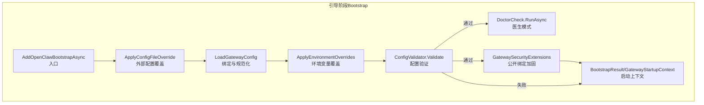
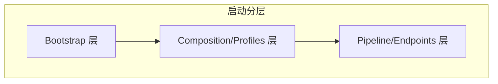
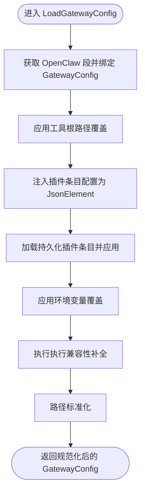
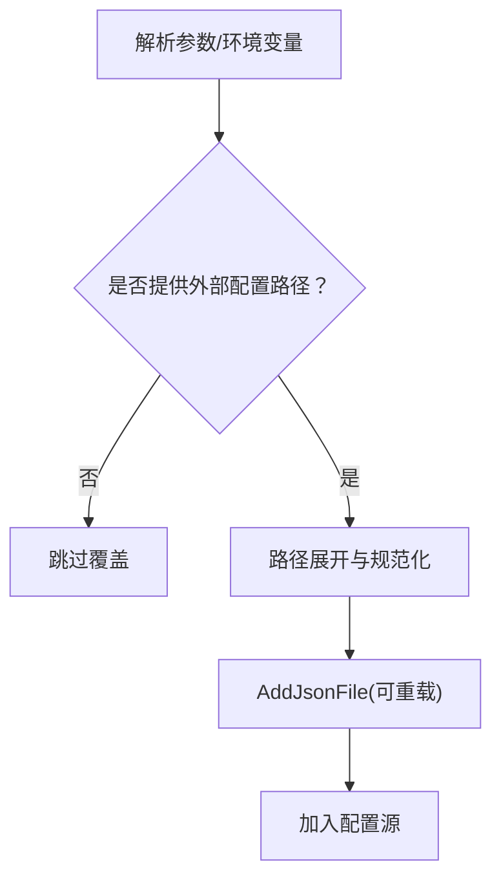
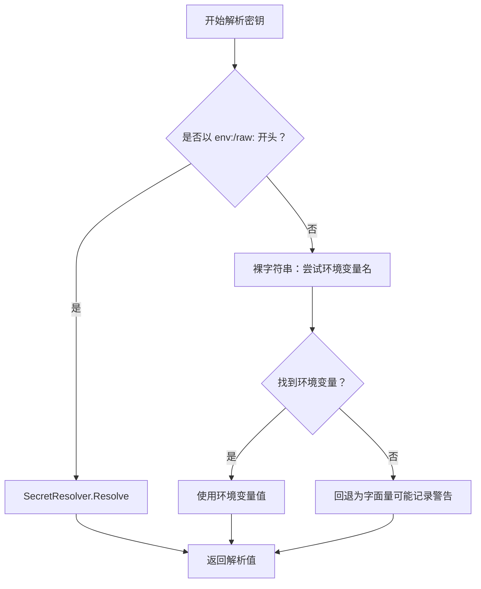
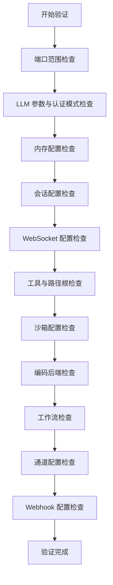
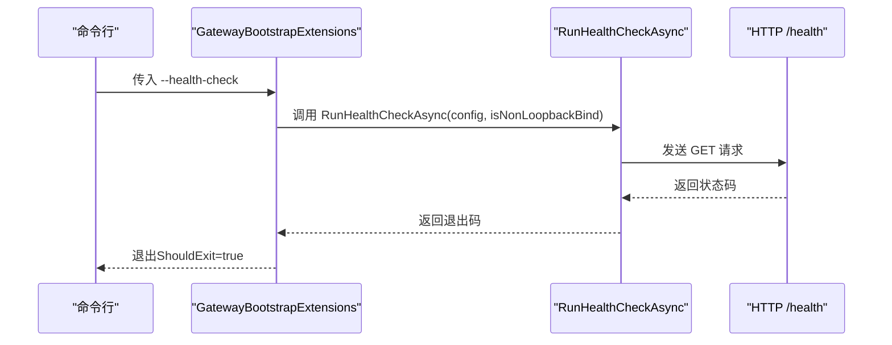
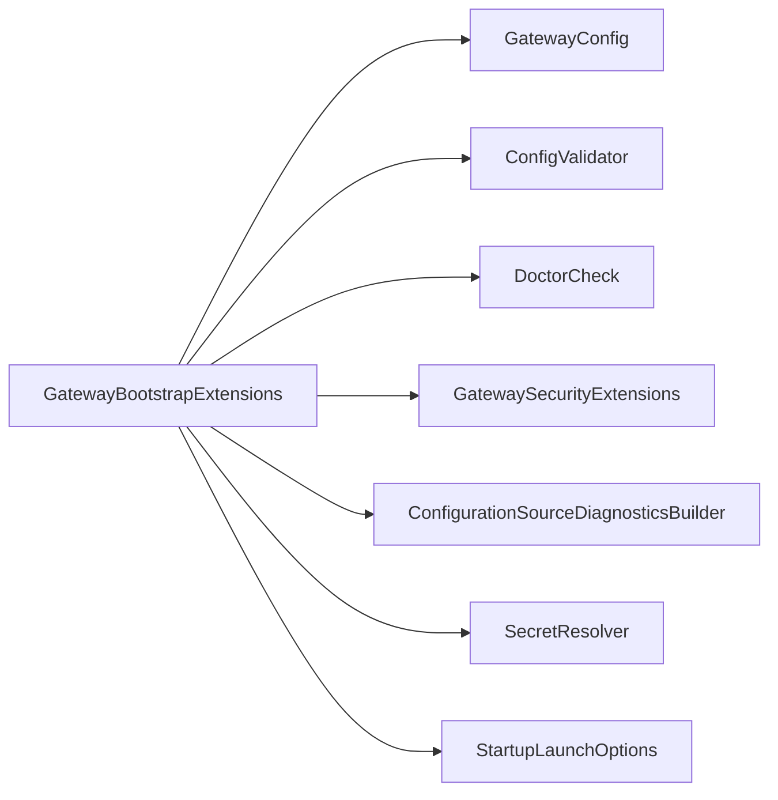

# 引导阶段（Bootstrap）

<cite>
**本文引用的文件**
- [GatewayBootstrapExtensions.cs](file://src/OpenClaw.Gateway/Bootstrap/GatewayBootstrapExtensions.cs)
- [ConfigurationSourceDiagnosticsBuilder.cs](file://src/OpenClaw.Gateway/Bootstrap/ConfigurationSourceDiagnosticsBuilder.cs)
- [StartupLaunchOptions.cs](file://src/OpenClaw.Gateway/Bootstrap/StartupLaunchOptions.cs)
- [BootstrapResult.cs](file://src/OpenClaw.Gateway/Bootstrap/BootstrapResult.cs)
- [GatewayStartupContext.cs](file://src/OpenClaw.Gateway/Bootstrap/GatewayStartupContext.cs)
- [GatewayConfig.cs](file://src/OpenClaw.Core/Models/GatewayConfig.cs)
- [ConfigValidator.cs](file://src/OpenClaw.Core/Validation/ConfigValidator.cs)
- [DoctorCheck.cs](file://src/OpenClaw.Core/Validation/DoctorCheck.cs)
- [SecretResolver.cs](file://src/OpenClaw.Core/Security/SecretResolver.cs)
- [GatewayBootstrapExtensionsTests.cs](file://src/OpenClaw.Tests/GatewayBootstrapExtensionsTests.cs)
- [architecture-startup-refactor.md](file://docs/architecture-startup-refactor.md)
- [openclaw-gateway-startup-layers.md](file://docs/openclaw-gateway-startup-layers.md)
</cite>

## 目录
1. [引言](#引言)
2. [项目结构](#项目结构)
3. [核心组件](#核心组件)
4. [架构总览](#架构总览)
5. [详细组件分析](#详细组件分析)
6. [依赖关系分析](#依赖关系分析)
7. [性能考量](#性能考量)
8. [故障排查指南](#故障排查指南)
9. [结论](#结论)
10. [附录](#附录)

## 引言
本文件聚焦 OpenClaw.NET 网关的引导阶段（Bootstrap），系统性阐述启动时的配置加载、命令行与环境变量解析、配置验证与安全检查、配置源诊断、健康检查与医生模式等关键流程。重点围绕 GatewayBootstrapExtensions 中的配置加载管线，包括 ApplyConfigFileOverride、LoadGatewayConfig、ApplyEnvironmentOverrides 等方法，并解释配置文件覆盖机制、路径展开、密钥解析、运行时模式选择、公开绑定加固策略等实现细节。

## 项目结构
引导阶段位于 OpenClaw.Gateway 的 Bootstrap 子目录，核心入口为 AddOpenClawBootstrapAsync 扩展方法，负责：
- 解析命令行参数与外部配置文件覆盖
- 绑定并规范化 GatewayConfig
- 应用环境变量覆盖与显式密钥解析
- 进行可选特性兼容性校验
- 健康检查与医生模式
- 公开绑定安全加固
- 生成启动上下文并返回结果

图表来源
- [GatewayBootstrapExtensions.cs:18-135](file://src/OpenClaw.Gateway/Bootstrap/GatewayBootstrapExtensions.cs#L18-L135)

章节来源
- [GatewayBootstrapExtensions.cs:1-421](file://src/OpenClaw.Gateway/Bootstrap/GatewayBootstrapExtensions.cs#L1-L421)
- [architecture-startup-refactor.md:1-33](file://docs/architecture-startup-refactor.md#L1-L33)

## 核心组件
- 配置加载与绑定：LoadGatewayConfig 负责从 IConfiguration 获取 OpenClaw 段落并绑定到 GatewayConfig，随后应用工具根路径覆盖、插件配置注入、环境变量覆盖、执行兼容性补全、路径标准化等步骤。
- 外部配置覆盖：ApplyConfigFileOverride 支持通过命令行 --config 或环境变量 OPENCLAW_CONFIG_PATH 指定额外 JSON 配置文件，支持路径展开与绝对路径规范化。
- 环境变量覆盖：ApplyEnvironmentOverrides 将 MODEL_PROVIDER_* 与 OPENCLAW_AUTH_TOKEN 映射到配置；同时对密钥进行 SecretResolver 解析，支持 env:、raw: 与裸字符串回退。
- 配置验证：ConfigValidator.Validate 提供全面的配置合法性检查，包括端口、LLM、内存、会话、WebSocket、工具、沙箱、编码后端、工作流、通道、Webhook 等。
- 医生模式：DoctorCheck.RunAsync 输出自诊断报告，结合本地设置状态与运行时模式，帮助快速定位阻塞性问题。
- 健康检查：RunHealthCheckAsync 通过本地回环访问 /health 探针，支持携带 Bearer 令牌。
- 公开绑定加固：在非回环绑定场景下强制更严格的安全策略，如要求 AuthToken、限制 raw: 密钥引用、限制 Canvas/插件桥等。

章节来源
- [GatewayBootstrapExtensions.cs:143-159](file://src/OpenClaw.Gateway/Bootstrap/GatewayBootstrapExtensions.cs#L143-L159)
- [GatewayBootstrapExtensions.cs:173-182](file://src/OpenClaw.Gateway/Bootstrap/GatewayBootstrapExtensions.cs#L173-L182)
- [GatewayBootstrapExtensions.cs:211-217](file://src/OpenClaw.Gateway/Bootstrap/GatewayBootstrapExtensions.cs#L211-L217)
- [ConfigValidator.cs:35-405](file://src/OpenClaw.Core/Validation/ConfigValidator.cs#L35-L405)
- [DoctorCheck.cs:11-37](file://src/OpenClaw.Core/Validation/DoctorCheck.cs#L11-L37)
- [GatewayBootstrapExtensions.cs:402-419](file://src/OpenClaw.Gateway/Bootstrap/GatewayBootstrapExtensions.cs#L402-L419)

## 架构总览
引导阶段采用“分层”设计，将启动流程拆分为三层：
- Bootstrap：加载配置覆盖、绑定 GatewayConfig、应用环境覆盖、解析显式密钥、解析运行时模式、处理 --health-check 与 --doctor、执行公开绑定加固。
- Composition/Profiles：注册服务、构建运行时对象、加载插件/提供者/技能、启动工作者。
- Pipeline/Endpoints：应用转发头、CORS、WebSocket、通道与工作者启动/关闭、路由映射。

图表来源
- [architecture-startup-refactor.md:1-33](file://docs/architecture-startup-refactor.md#L1-L33)

章节来源
- [architecture-startup-refactor.md:1-33](file://docs/architecture-startup-refactor.md#L1-L33)

## 详细组件分析

### 配置加载与绑定（LoadGatewayConfig）
该方法完成以下关键步骤：
- 从 IConfiguration 获取 OpenClaw 段并绑定到 GatewayConfig
- 应用工具根路径覆盖（AllowedReadRoots/AllowedWriteRoots）
- 注入插件条目配置（OpenClaw:Plugins:Entries:*:Config）为 JsonElement
- 加载持久化的插件条目并应用到配置
- 应用环境变量覆盖（MODEL_PROVIDER_*、OPENCLAW_AUTH_TOKEN）
- 执行执行兼容性补全（OpenSandbox 后端与工具路由）
- 路径标准化（可选路径展开与规范化）

图表来源
- [GatewayBootstrapExtensions.cs:143-159](file://src/OpenClaw.Gateway/Bootstrap/GatewayBootstrapExtensions.cs#L143-L159)
- [GatewayBootstrapExtensions.cs:264-281](file://src/OpenClaw.Gateway/Bootstrap/GatewayBootstrapExtensions.cs#L264-L281)
- [GatewayBootstrapExtensions.cs:219-252](file://src/OpenClaw.Gateway/Bootstrap/GatewayBootstrapExtensions.cs#L219-L252)
- [GatewayBootstrapExtensions.cs:391-400](file://src/OpenClaw.Gateway/Bootstrap/GatewayBootstrapExtensions.cs#L391-L400)

章节来源
- [GatewayBootstrapExtensions.cs:143-159](file://src/OpenClaw.Gateway/Bootstrap/GatewayBootstrapExtensions.cs#L143-L159)

### 外部配置文件覆盖（ApplyConfigFileOverride）
- 支持两种来源：命令行 --config=path 或环境变量 OPENCLAW_CONFIG_PATH
- 路径展开：支持 ~ 用户目录与环境变量替换
- 绝对路径规范化
- 使用 reloadOnChange: true 实时重载

图表来源
- [GatewayBootstrapExtensions.cs:173-182](file://src/OpenClaw.Gateway/Bootstrap/GatewayBootstrapExtensions.cs#L173-L182)
- [GatewayBootstrapExtensions.cs:200-209](file://src/OpenClaw.Gateway/Bootstrap/GatewayBootstrapExtensions.cs#L200-L209)
- [StartupLaunchOptions.cs:57-71](file://src/OpenClaw.Gateway/Bootstrap/StartupLaunchOptions.cs#L57-L71)

章节来源
- [GatewayBootstrapExtensions.cs:173-182](file://src/OpenClaw.Gateway/Bootstrap/GatewayBootstrapExtensions.cs#L173-L182)
- [GatewayBootstrapExtensions.cs:200-209](file://src/OpenClaw.Gateway/Bootstrap/GatewayBootstrapExtensions.cs#L200-L209)
- [StartupLaunchOptions.cs:57-71](file://src/OpenClaw.Gateway/Bootstrap/StartupLaunchOptions.cs#L57-L71)

### 环境变量覆盖与密钥解析（ApplyEnvironmentOverrides + SecretResolver）
- MODEL_PROVIDER_KEY、MODEL_PROVIDER_MODEL、MODEL_PROVIDER_ENDPOINT 作为兼容性覆盖优先于配置文件中的值
- OPENCLAW_AUTH_TOKEN 直接覆盖 AuthToken
- 密钥解析规则：
  - env:VARNAME：严格读取环境变量
  - raw:LITERAL：原始字面量（生产不推荐）
  - 裸字符串：先尝试作为环境变量名，不存在则回退为字面量
- 配置源诊断中对密钥来源进行标注与脱敏显示

图表来源
- [GatewayBootstrapExtensions.cs:211-217](file://src/OpenClaw.Gateway/Bootstrap/GatewayBootstrapExtensions.cs#L211-L217)
- [GatewayBootstrapExtensions.cs:377-389](file://src/OpenClaw.Gateway/Bootstrap/GatewayBootstrapExtensions.cs#L377-L389)
- [SecretResolver.cs:24-54](file://src/OpenClaw.Core/Security/SecretResolver.cs#L24-L54)
- [ConfigurationSourceDiagnosticsBuilder.cs:51-86](file://src/OpenClaw.Gateway/Bootstrap/ConfigurationSourceDiagnosticsBuilder.cs#L51-L86)

章节来源
- [GatewayBootstrapExtensions.cs:211-217](file://src/OpenClaw.Gateway/Bootstrap/GatewayBootstrapExtensions.cs#L211-L217)
- [GatewayBootstrapExtensions.cs:377-389](file://src/OpenClaw.Gateway/Bootstrap/GatewayBootstrapExtensions.cs#L377-L389)
- [SecretResolver.cs:24-54](file://src/OpenClaw.Core/Security/SecretResolver.cs#L24-L54)
- [ConfigurationSourceDiagnosticsBuilder.cs:51-86](file://src/OpenClaw.Gateway/Bootstrap/ConfigurationSourceDiagnosticsBuilder.cs#L51-L86)

### 配置验证与安全检查
- 配置验证：ConfigValidator.Validate 覆盖端口、LLM、内存、会话、WebSocket、工具、沙箱、编码后端、工作流、通道、Webhook 等领域，发现错误立即返回
- 可选特性兼容性：ValidateOptionalFeatureCompatibility 检查 OpenSandbox 构建开关与配置一致性
- 公开绑定安全：非回环绑定时强制要求 AuthToken；对 Canvas、插件桥、原始密钥引用、不安全本地工具等进行限制或警告

图表来源
- [ConfigValidator.cs:35-405](file://src/OpenClaw.Core/Validation/ConfigValidator.cs#L35-L405)

章节来源
- [ConfigValidator.cs:35-405](file://src/OpenClaw.Core/Validation/ConfigValidator.cs#L35-L405)
- [GatewayBootstrapExtensions.cs:161-171](file://src/OpenClaw.Gateway/Bootstrap/GatewayBootstrapExtensions.cs#L161-L171)

### 健康检查与医生模式
- 健康检查：RunHealthCheckAsync 访问本地回环 /health，支持携带 Bearer 令牌，超时短路
- 医生模式：DoctorCheck.RunAsync 构建诊断报告，输出文本化诊断，区分阻塞性与警告项

图表来源
- [GatewayBootstrapExtensions.cs:38-46](file://src/OpenClaw.Gateway/Bootstrap/GatewayBootstrapExtensions.cs#L38-L46)
- [GatewayBootstrapExtensions.cs:402-419](file://src/OpenClaw.Gateway/Bootstrap/GatewayBootstrapExtensions.cs#L402-L419)

章节来源
- [GatewayBootstrapExtensions.cs:38-46](file://src/OpenClaw.Gateway/Bootstrap/GatewayBootstrapExtensions.cs#L38-L46)
- [GatewayBootstrapExtensions.cs:402-419](file://src/OpenClaw.Gateway/Bootstrap/GatewayBootstrapExtensions.cs#L402-L419)
- [DoctorCheck.cs:11-37](file://src/OpenClaw.Core/Validation/DoctorCheck.cs#L11-L37)

### 公开绑定加固与安全策略
- 非回环绑定必须设置 AuthToken
- 禁止在公开绑定上使用 raw: 密钥引用
- Canvas 在公开绑定上默认禁用命令转发，除非显式允许
- 插件桥（动态原生/MCP）在公开绑定上默认受限，除非显式允许
- 不安全本地工具（如 shell/write_file）在公开绑定上默认受限，除非显式允许

章节来源
- [GatewayBootstrapExtensions.cs:48-63](file://src/OpenClaw.Gateway/Bootstrap/GatewayBootstrapExtensions.cs#L48-L63)
- [GatewayBootstrapExtensions.cs:120-121](file://src/OpenClaw.Gateway/Bootstrap/GatewayBootstrapExtensions.cs#L120-L121)

### 配置源诊断系统
- ConfigurationSourceDiagnosticsBuilder.Build 逐项追踪配置项的最终生效值与来源
- 支持环境变量 MODEL_PROVIDER_* 的兼容性覆盖标注
- 对密钥来源进行描述与脱敏显示（含 secret reference 类型说明）

章节来源
- [ConfigurationSourceDiagnosticsBuilder.cs:13-29](file://src/OpenClaw.Gateway/Bootstrap/ConfigurationSourceDiagnosticsBuilder.cs#L13-L29)
- [ConfigurationSourceDiagnosticsBuilder.cs:31-86](file://src/OpenClaw.Gateway/Bootstrap/ConfigurationSourceDiagnosticsBuilder.cs#L31-L86)
- [ConfigurationSourceDiagnosticsBuilder.cs:115-158](file://src/OpenClaw.Gateway/Bootstrap/ConfigurationSourceDiagnosticsBuilder.cs#L115-L158)

### 运行时模式解析与工具沙箱兼容性
- 运行时模式（auto/aot/jit）由 RuntimeModeResolver 解析
- 工具沙箱兼容性：当启用 OpenSandbox 时自动补全执行配置与工具路由
- 测试用例验证 OpenSandbox 构建开关与配置的一致性

章节来源
- [GatewayBootstrapExtensions.cs:86-105](file://src/OpenClaw.Gateway/Bootstrap/GatewayBootstrapExtensions.cs#L86-L105)
- [GatewayBootstrapExtensions.cs:219-252](file://src/OpenClaw.Gateway/Bootstrap/GatewayBootstrapExtensions.cs#L219-L252)
- [GatewayBootstrapExtensionsTests.cs:33-55](file://src/OpenClaw.Tests/GatewayBootstrapExtensionsTests.cs#L33-L55)

## 依赖关系分析
- 入口扩展方法 AddOpenClawBootstrapAsync 依赖：
  - IConfiguration（配置源）
  - ConfigValidator（配置验证）
  - DoctorCheck（医生模式）
  - GatewaySecurityExtensions（公开绑定加固）
  - SecretResolver（密钥解析）
  - ConfigurationSourceDiagnosticsBuilder（配置源诊断）
- 内部方法 LoadGatewayConfig 依赖：
  - GatewayConfig（配置模型）
  - PluginAdminSettingsService（插件条目持久化）
  - ToolSandboxPolicy（工具沙箱策略）
  - ConfigPathResolver（路径解析）
  - SecretResolver（密钥解析）

图表来源
- [GatewayBootstrapExtensions.cs:18-135](file://src/OpenClaw.Gateway/Bootstrap/GatewayBootstrapExtensions.cs#L18-L135)
- [GatewayConfig.cs:9-80](file://src/OpenClaw.Core/Models/GatewayConfig.cs#L9-L80)
- [ConfigValidator.cs:14-14](file://src/OpenClaw.Core/Validation/ConfigValidator.cs#L14-L14)
- [DoctorCheck.cs:9-9](file://src/OpenClaw.Core/Validation/DoctorCheck.cs#L9-L9)
- [ConfigurationSourceDiagnosticsBuilder.cs:11-11](file://src/OpenClaw.Gateway/Bootstrap/ConfigurationSourceDiagnosticsBuilder.cs#L11-L11)
- [SecretResolver.cs:14-14](file://src/OpenClaw.Core/Security/SecretResolver.cs#L14-L14)
- [StartupLaunchOptions.cs:5-6](file://src/OpenClaw.Gateway/Bootstrap/StartupLaunchOptions.cs#L5-L6)

章节来源
- [GatewayBootstrapExtensions.cs:18-135](file://src/OpenClaw.Gateway/Bootstrap/GatewayBootstrapExtensions.cs#L18-L135)

## 性能考量
- 配置加载：外部 JSON 文件使用 reloadOnChange: true，适合开发环境热更新；生产建议避免频繁变更以减少 IO。
- 健康检查：短超时（2 秒）避免阻塞启动。
- 路径展开与规范化：仅在必要时进行，避免重复计算。
- 医生模式：异步构建诊断报告，避免阻塞主流程。

## 故障排查指南
- 配置错误处理
  - 若 ConfigValidator.Validate 返回错误列表，引导阶段会打印诊断并根据 doctor 模式决定是否提前退出。
  - 使用配置源诊断输出（Effective configuration winners）定位具体来源。
- 安全绑定检查
  - 非回环绑定未设置 AuthToken 将直接抛出异常或在 doctor 模式下返回退出码 1。
  - 禁止在公开绑定上使用 raw: 密钥引用；Canvas/插件桥/不安全本地工具需显式允许。
- 工具沙箱兼容性验证
  - OpenSandbox 需要在构建时开启相应功能标志；否则配置会被标记为不兼容。
- 健康检查
  - 通过 --health-check 快速验证 /health 可达性与鉴权状态。

章节来源
- [GatewayBootstrapExtensions.cs:65-84](file://src/OpenClaw.Gateway/Bootstrap/GatewayBootstrapExtensions.cs#L65-L84)
- [GatewayBootstrapExtensions.cs:48-63](file://src/OpenClaw.Gateway/Bootstrap/GatewayBootstrapExtensions.cs#L48-L63)
- [GatewayBootstrapExtensions.cs:107-118](file://src/OpenClaw.Gateway/Bootstrap/GatewayBootstrapExtensions.cs#L107-L118)
- [ConfigurationSourceDiagnosticsBuilder.cs:137-141](file://src/OpenClaw.Gateway/Bootstrap/ConfigurationSourceDiagnosticsBuilder.cs#L137-L141)

## 结论
引导阶段通过严格的配置加载、覆盖与验证流程，确保网关在启动前具备一致、安全且可诊断的运行基线。外部配置覆盖、环境变量解析、密钥安全策略、公开绑定加固与医生/健康检查共同构成完整的启动保障体系。开发者可通过配置源诊断与医生模式快速定位问题，保证生产部署的安全与稳定。

## 附录
- 配置文件优先级与覆盖机制
  - 默认 appsettings → 外部 JSON 文件（--config/OPENCLAW_CONFIG_PATH）→ 环境变量（MODEL_PROVIDER_*、OPENCLAW_AUTH_TOKEN）
  - 路径与密钥支持展开与解析，最终以 ConfigurationSourceDiagnosticsBuilder 渲染来源
- 命令行与环境变量解析规则
  - --config=path 支持等号形式 --config=path 或 --config path
  - OPENCLAW_CONFIG_PATH 与 --config 同时存在时以外部配置路径为准
  - 环境变量 OPENCLAW_WORKSPACE 用于 WorkspaceRoot 的默认值解析
- 运行时模式与工具沙箱
  - Runtime.Mode 与 Runtime.Orchestrator 由 ConfigValidator 校验
  - OpenSandbox 自动补全执行配置与工具路由，需构建标志匹配

章节来源
- [GatewayBootstrapExtensions.cs:173-182](file://src/OpenClaw.Gateway/Bootstrap/GatewayBootstrapExtensions.cs#L173-L182)
- [GatewayBootstrapExtensions.cs:200-209](file://src/OpenClaw.Gateway/Bootstrap/GatewayBootstrapExtensions.cs#L200-L209)
- [GatewayBootstrapExtensions.cs:211-217](file://src/OpenClaw.Gateway/Bootstrap/GatewayBootstrapExtensions.cs#L211-L217)
- [GatewayBootstrapExtensions.cs:219-252](file://src/OpenClaw.Gateway/Bootstrap/GatewayBootstrapExtensions.cs#L219-L252)
- [StartupLaunchOptions.cs:57-71](file://src/OpenClaw.Gateway/Bootstrap/StartupLaunchOptions.cs#L57-L71)
- [openclaw-gateway-startup-layers.md:30-40](file://docs/openclaw-gateway-startup-layers.md#L30-L40)