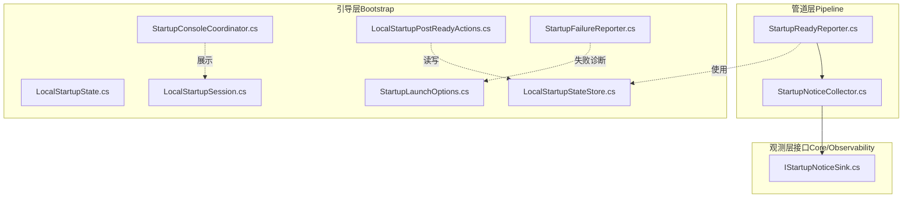
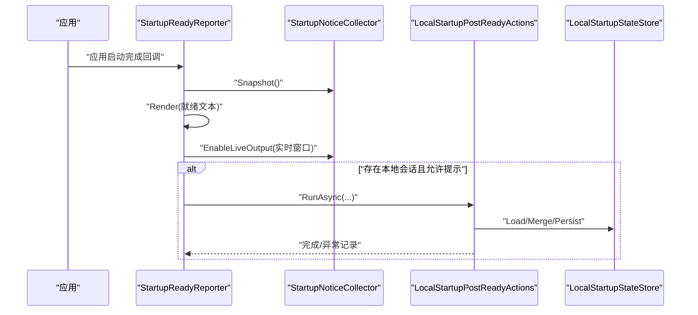
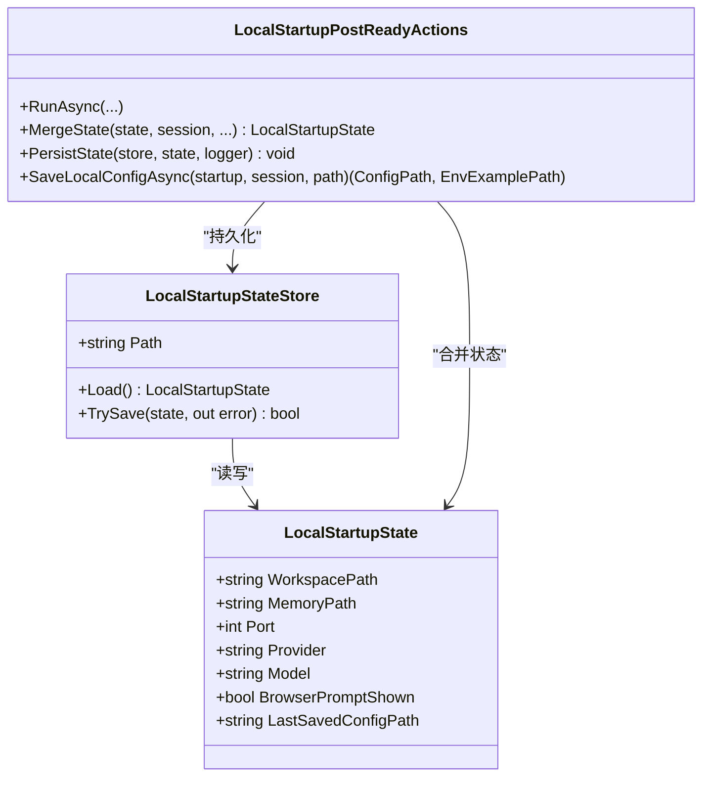
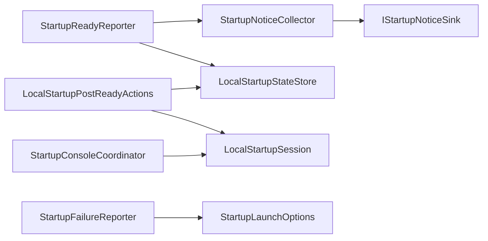

# 管道阶段（Pipeline）

<cite>
**本文引用的文件**
- [StartupReadyReporter.cs](file://src/OpenClaw.Gateway/Pipeline/StartupReadyReporter.cs)
- [StartupNoticeCollector.cs](file://src/OpenClaw.Gateway/Pipeline/StartupNoticeCollector.cs)
- [StartupConsoleCoordinator.cs](file://src/OpenClaw.Gateway/Bootstrap/StartupConsoleCoordinator.cs)
- [LocalStartupState.cs](file://src/OpenClaw.Gateway/Bootstrap/LocalStartupState.cs)
- [LocalStartupStateStore.cs](file://src/OpenClaw.Gateway/Bootstrap/LocalStartupStateStore.cs)
- [LocalStartupPostReadyActions.cs](file://src/OpenClaw.Gateway/Bootstrap/LocalStartupPostReadyActions.cs)
- [StartupFailureReporter.cs](file://src/OpenClaw.Gateway/Bootstrap/StartupFailureReporter.cs)
- [StartupLaunchOptions.cs](file://src/OpenClaw.Gateway/Bootstrap/StartupLaunchOptions.cs)
- [LocalStartupSession.cs](file://src/OpenClaw.Gateway/Bootstrap/LocalStartupSession.cs)
- [IStartupNoticeSink.cs](file://src/OpenClaw.Core/Observability/IStartupNoticeSink.cs)
- [StartupReadyReporterTests.cs](file://src/OpenClaw.Tests/StartupReadyReporterTests.cs)
- [StartupConsoleCoordinatorTests.cs](file://src/OpenClaw.Tests/StartupConsoleCoordinatorTests.cs)
</cite>

## 目录
1. [简介](#简介)
2. [项目结构](#项目结构)
3. [核心组件](#核心组件)
4. [架构总览](#架构总览)
5. [组件详解](#组件详解)
6. [依赖关系分析](#依赖关系分析)
7. [性能与可靠性考量](#性能与可靠性考量)
8. [故障排查指南](#故障排查指南)
9. [结论](#结论)
10. [附录](#附录)

## 简介
本章节面向 OpenClaw.NET 的“管道阶段”，系统性阐述启动流程中的关键职责与协作机制，包括：
- 启动进度报告与就绪通知
- 启动状态与健康状态报告
- 控制台交互式协调（用户提示、输入处理、进度展示）
- 本地启动状态管理（持久化、合并、恢复）
- 启动失败诊断与建议修复路径
- 启动管道监控、状态查询与故障恢复通知

目标是帮助开发者与运维人员快速理解并高效使用启动管道的各项能力。

## 项目结构
管道阶段相关代码主要分布在以下模块：
- 管道层（Pipeline）：负责在应用启动完成后输出就绪信息、汇总启动通知，并开启实时输出窗口
- 引导层（Bootstrap）：负责控制台协调、本地启动状态管理、启动后动作、失败报告、启动参数解析等
- 观测层接口（Core/Observability）：定义启动通知收集器的接口契约

图表来源
- [StartupReadyReporter.cs:1-151](file://src/OpenClaw.Gateway/Pipeline/StartupReadyReporter.cs#L1-L151)
- [StartupNoticeCollector.cs:1-72](file://src/OpenClaw.Gateway/Pipeline/StartupNoticeCollector.cs#L1-L72)
- [StartupConsoleCoordinator.cs:1-53](file://src/OpenClaw.Gateway/Bootstrap/StartupConsoleCoordinator.cs#L1-L53)
- [LocalStartupState.cs:1-13](file://src/OpenClaw.Gateway/Bootstrap/LocalStartupState.cs#L1-L13)
- [LocalStartupStateStore.cs:1-27](file://src/OpenClaw.Gateway/Bootstrap/LocalStartupStateStore.cs#L1-L27)
- [LocalStartupPostReadyActions.cs:1-122](file://src/OpenClaw.Gateway/Bootstrap/LocalStartupPostReadyActions.cs#L1-L122)
- [StartupFailureReporter.cs:1-332](file://src/OpenClaw.Gateway/Bootstrap/StartupFailureReporter.cs#L1-L332)
- [StartupLaunchOptions.cs:1-122](file://src/OpenClaw.Gateway/Bootstrap/StartupLaunchOptions.cs#L1-L122)
- [LocalStartupSession.cs:1-12](file://src/OpenClaw.Gateway/Bootstrap/LocalStartupSession.cs#L1-L12)
- [IStartupNoticeSink.cs:1-20](file://src/OpenClaw.Core/Observability/IStartupNoticeSink.cs#L1-L20)

章节来源
- [StartupReadyReporter.cs:1-151](file://src/OpenClaw.Gateway/Pipeline/StartupReadyReporter.cs#L1-L151)
- [StartupNoticeCollector.cs:1-72](file://src/OpenClaw.Gateway/Pipeline/StartupNoticeCollector.cs#L1-L72)
- [StartupConsoleCoordinator.cs:1-53](file://src/OpenClaw.Gateway/Bootstrap/StartupConsoleCoordinator.cs#L1-L53)
- [LocalStartupState.cs:1-13](file://src/OpenClaw.Gateway/Bootstrap/LocalStartupState.cs#L1-L13)
- [LocalStartupStateStore.cs:1-27](file://src/OpenClaw.Gateway/Bootstrap/LocalStartupStateStore.cs#L1-L27)
- [LocalStartupPostReadyActions.cs:1-122](file://src/OpenClaw.Gateway/Bootstrap/LocalStartupPostReadyActions.cs#L1-L122)
- [StartupFailureReporter.cs:1-332](file://src/OpenClaw.Gateway/Bootstrap/StartupFailureReporter.cs#L1-L332)
- [StartupLaunchOptions.cs:1-122](file://src/OpenClaw.Gateway/Bootstrap/StartupLaunchOptions.cs#L1-L122)
- [LocalStartupSession.cs:1-12](file://src/OpenClaw.Gateway/Bootstrap/LocalStartupSession.cs#L1-L12)
- [IStartupNoticeSink.cs:1-20](file://src/OpenClaw.Core/Observability/IStartupNoticeSink.cs#L1-L20)

## 核心组件
- 启动就绪报告器（StartupReadyReporter）
  - 在应用启动完成后输出就绪文本，包含监听地址、UI 链接、健康端点、MCP/WebSocket 端点、下一步命令等
  - 汇总 StartupNoticeCollector 中的启动通知，支持实时输出窗口
  - 可从启动参数或本地状态中解析已知配置路径，用于生成后续诊断与验证命令
- 启动通知收集器（StartupNoticeCollector）
  - 实现 IStartupNoticeSink 接口，聚合重复消息并统计次数
  - 支持启用“实时输出窗口”，在指定时间内将新增消息即时打印到控制台
  - 提供快照接口以供就绪报告器渲染
- 控制台协调器（StartupConsoleCoordinator）
  - 输出启动阶段标识、环境与配置源摘要
  - 基于 ConfigurationManager 与 GatewayConfig 渲染“有效配置赢家”诊断视图
  - 支持会话覆盖模式（如 quickstart）的标注
- 本地启动状态（LocalStartupState）与存储（LocalStartupStateStore）
  - 记录工作区、内存路径、端口、模型提供方与模型、浏览器提示是否已展示、最后保存的配置路径等
  - 提供原子 JSON 文件读写，确保并发安全与一致性
- 启动后动作（LocalStartupPostReadyActions）
  - 在就绪后执行交互式动作：打开浏览器、询问是否保存本地配置、持久化状态
  - 合并当前会话与现有状态，避免覆盖关键字段
- 启动失败报告器（StartupFailureReporter）
  - 对常见启动错误进行分类与诊断，输出标题、摘要、详情与建议修复步骤
  - 针对鉴权令牌缺失、端口占用、模型提供方配置错误、存储路径不可写等场景给出精准建议
- 启动参数（StartupLaunchOptions）
  - 解析命令行参数，识别 doctor、health-check、quickstart、config 等标志位
  - 判断是否可交互提示、是否抑制保存提示、是否建议 quickstart
- 启动会话（LocalStartupSession）
  - 表示一次本地启动的会话上下文，包含端口、提供方、模型、工作区、内存路径、密钥引用等

章节来源
- [StartupReadyReporter.cs:11-151](file://src/OpenClaw.Gateway/Pipeline/StartupReadyReporter.cs#L11-L151)
- [StartupNoticeCollector.cs:7-72](file://src/OpenClaw.Gateway/Pipeline/StartupNoticeCollector.cs#L7-L72)
- [StartupConsoleCoordinator.cs:6-53](file://src/OpenClaw.Gateway/Bootstrap/StartupConsoleCoordinator.cs#L6-L53)
- [LocalStartupState.cs:3-13](file://src/OpenClaw.Gateway/Bootstrap/LocalStartupState.cs#L3-L13)
- [LocalStartupStateStore.cs:5-27](file://src/OpenClaw.Gateway/Bootstrap/LocalStartupStateStore.cs#L5-L27)
- [LocalStartupPostReadyActions.cs:7-122](file://src/OpenClaw.Gateway/Bootstrap/LocalStartupPostReadyActions.cs#L7-L122)
- [StartupFailureReporter.cs:5-332](file://src/OpenClaw.Gateway/Bootstrap/StartupFailureReporter.cs#L5-L332)
- [StartupLaunchOptions.cs:5-122](file://src/OpenClaw.Gateway/Bootstrap/StartupLaunchOptions.cs#L5-L122)
- [LocalStartupSession.cs:3-12](file://src/OpenClaw.Gateway/Bootstrap/LocalStartupSession.cs#L3-L12)

## 架构总览
启动管道在应用生命周期的关键节点协同工作：应用启动完成后，就绪报告器拉取通知收集器的快照，渲染就绪文本并开启实时输出；同时，若满足条件则异步执行启动后动作，包括浏览器打开与配置保存；失败时由失败报告器输出结构化诊断。

图表来源
- [StartupReadyReporter.cs:18-50](file://src/OpenClaw.Gateway/Pipeline/StartupReadyReporter.cs#L18-L50)
- [StartupNoticeCollector.cs:16-32](file://src/OpenClaw.Gateway/Pipeline/StartupNoticeCollector.cs#L16-L32)
- [LocalStartupPostReadyActions.cs:9-62](file://src/OpenClaw.Gateway/Bootstrap/LocalStartupPostReadyActions.cs#L9-L62)
- [LocalStartupStateStore.cs:16-25](file://src/OpenClaw.Gateway/Bootstrap/LocalStartupStateStore.cs#L16-L25)

## 组件详解

### StartupReadyReporter：就绪报告与通知聚合
- 职责
  - 应用启动完成后输出就绪文本，包含监听地址、UI/健康/MCP/WebSocket 端点
  - 汇总 StartupNoticeCollector 的快照，渲染“启动时的通知”
  - 启用实时输出窗口，在限定时间内将新增通知即时打印
  - 根据启动参数或本地状态解析已知配置路径，输出后续诊断与验证命令
- 关键行为
  - 将绑定地址格式化为 URI 友好的形式，处理回环与通配符地址
  - 在端口无效时不显示 URL，避免误导
  - 支持将通知头与消息写入任意 TextWriter，便于测试与集成
- 与 StartupNoticeCollector 的协作
  - 通过服务容器获取 Collector 并调用 Snapshot 获取聚合后的通知列表
  - 调用 EnableLiveOutput 开启实时输出，窗口时长固定为 5 秒
- 与 LocalStartupState 的关联
  - 通过 LocalStartupStateStore 加载上次保存的配置路径，用于生成“下一步命令”

章节来源
- [StartupReadyReporter.cs:11-151](file://src/OpenClaw.Gateway/Pipeline/StartupReadyReporter.cs#L11-L151)
- [StartupNoticeCollector.cs:16-32](file://src/OpenClaw.Gateway/Pipeline/StartupNoticeCollector.cs#L16-L32)
- [LocalStartupStateStore.cs:16-25](file://src/OpenClaw.Gateway/Bootstrap/LocalStartupStateStore.cs#L16-L25)

### StartupNoticeCollector：启动通知收集与实时输出
- 职责
  - 实现 IStartupNoticeSink，接收来自各组件的启动通知
  - 聚合重复消息并统计出现次数，避免冗余输出
  - 在启用实时输出窗口期间，按时间窗口将新增消息即时打印
- 数据结构
  - 使用有序列表维护消息序列，使用字典映射消息到索引，实现 O(1) 查找与更新
  - 内部线程安全，使用锁保护共享状态
- 实时输出窗口
  - 设置窗口截止时间与是否已写入头部
  - 在窗口内首次写入时自动输出“启动时的通知”标题

章节来源
- [StartupNoticeCollector.cs:7-72](file://src/OpenClaw.Gateway/Pipeline/StartupNoticeCollector.cs#L7-L72)
- [IStartupNoticeSink.cs:3-20](file://src/OpenClaw.Core/Observability/IStartupNoticeSink.cs#L3-L20)

### StartupConsoleCoordinator：控制台交互式协调
- 职责
  - 输出启动阶段标识与环境信息
  - 列出所有 JSON 配置源，去重并标注会话覆盖模式
  - 基于配置源与有效配置渲染“有效配置赢家”诊断视图
- 输入处理
  - 仅处理 JSON 类型的配置源，忽略非 JSON 源
  - 会话覆盖模式通过 LocalStartupSession 的 Mode 字段体现
- 输出设计
  - 使用 TextWriter 支持重定向与测试
  - Flush 保证输出及时可见

章节来源
- [StartupConsoleCoordinator.cs:6-53](file://src/OpenClaw.Gateway/Bootstrap/StartupConsoleCoordinator.cs#L6-L53)
- [LocalStartupSession.cs:3-12](file://src/OpenClaw.Gateway/Bootstrap/LocalStartupSession.cs#L3-L12)

### LocalStartupState 与 LocalStartupStateStore：本地启动状态管理
- LocalStartupState
  - 记录工作区路径、内存路径、端口、提供方、模型、浏览器提示是否已展示、最后保存的配置路径
- LocalStartupStateStore
  - 默认路径解析至用户主目录下的本地状态文件
  - 提供 Load/TrySave 方法，内部使用原子 JSON 文件写入，失败时返回错误字符串
- 状态合并与持久化
  - LocalStartupPostReadyActions.MergeState 合并会话与现有状态，避免覆盖关键字段
  - PersistState 在保存失败时记录警告日志

图表来源
- [LocalStartupState.cs:3-13](file://src/OpenClaw.Gateway/Bootstrap/LocalStartupState.cs#L3-L13)
- [LocalStartupStateStore.cs:5-27](file://src/OpenClaw.Gateway/Bootstrap/LocalStartupStateStore.cs#L5-L27)
- [LocalStartupPostReadyActions.cs:64-122](file://src/OpenClaw.Gateway/Bootstrap/LocalStartupPostReadyActions.cs#L64-L122)

章节来源
- [LocalStartupState.cs:3-13](file://src/OpenClaw.Gateway/Bootstrap/LocalStartupState.cs#L3-L13)
- [LocalStartupStateStore.cs:5-27](file://src/OpenClaw.Gateway/Bootstrap/LocalStartupStateStore.cs#L5-L27)
- [LocalStartupPostReadyActions.cs:64-122](file://src/OpenClaw.Gateway/Bootstrap/LocalStartupPostReadyActions.cs#L64-L122)

### LocalStartupPostReadyActions：启动后交互与配置保存
- 职责
  - 在就绪后异步执行：打开浏览器、询问是否保存本地配置、持久化状态
  - 合并会话与现有状态，避免覆盖关键字段
- 流程
  - 先加载并合并状态，再持久化
  - 若未展示过浏览器提示，则询问用户是否打开 Chat UI
  - 若未抑制保存提示，则询问是否保存配置，保存成功后更新状态并持久化
- 保存逻辑
  - 自动生成随机认证令牌（若未配置）
  - 生成配置文件与环境示例文件路径
  - 返回保存结果路径，便于后续展示

章节来源
- [LocalStartupPostReadyActions.cs:9-122](file://src/OpenClaw.Gateway/Bootstrap/LocalStartupPostReadyActions.cs#L9-L122)

### StartupFailureReporter：启动失败诊断与修复建议
- 职责
  - 对启动异常进行分类分析，输出结构化报告
  - 针对常见问题（鉴权令牌缺失、端口占用、提供方配置错误、存储路径不可写）给出精准建议
- 分类策略
  - 基于异常消息特征匹配，结合配置上下文（环境名、绑定地址、端口、存储路径等）
  - 提供“下一步操作”建议，必要时建议使用 quickstart 或 doctor 模式
- 输出内容
  - 标题、摘要、详情列表、建议修复步骤
  - 支持写入任意 TextWriter，便于集成到不同输出介质

章节来源
- [StartupFailureReporter.cs:5-332](file://src/OpenClaw.Gateway/Bootstrap/StartupFailureReporter.cs#L5-L332)

### StartupLaunchOptions：启动参数解析与策略
- 职责
  - 解析命令行参数，识别 doctor、health-check、quickstart、config 等标志位
  - 判断是否可交互提示、是否抑制保存提示、是否建议 quickstart
- 参数校验
  - quickstart 不能与 doctor/health-check/config 等模式共用
  - quickstart 需要交互终端支持
- 便捷属性
  - ExternalConfigPath：外部配置路径（命令行或环境变量）
  - SuppressSavePrompt：当存在外部配置时抑制保存提示
  - ShouldSuggestQuickstart：在可提示且未请求 doctor/health-check 时建议 quickstart

章节来源
- [StartupLaunchOptions.cs:5-122](file://src/OpenClaw.Gateway/Bootstrap/StartupLaunchOptions.cs#L5-L122)

## 依赖关系分析
- StartupReadyReporter 依赖 StartupNoticeCollector（通过服务容器获取）与 LocalStartupStateStore（解析已知配置路径）
- StartupNoticeCollector 实现 IStartupNoticeSink 接口，作为观测层的统一入口
- LocalStartupPostReadyActions 依赖 LocalStartupStateStore 进行状态读写，并与 LocalStartupSession 合并状态
- StartupConsoleCoordinator 依赖 ConfigurationManager 与 GatewayConfig 渲染配置诊断视图
- StartupFailureReporter 依赖 StartupLaunchOptions 与运行环境信息进行诊断

图表来源
- [StartupReadyReporter.cs:22-29](file://src/OpenClaw.Gateway/Pipeline/StartupReadyReporter.cs#L22-L29)
- [StartupNoticeCollector.cs:7-22](file://src/OpenClaw.Gateway/Pipeline/StartupNoticeCollector.cs#L7-L22)
- [IStartupNoticeSink.cs:3-6](file://src/OpenClaw.Core/Observability/IStartupNoticeSink.cs#L3-L6)
- [LocalStartupStateStore.cs:16-25](file://src/OpenClaw.Gateway/Bootstrap/LocalStartupStateStore.cs#L16-L25)
- [LocalStartupPostReadyActions.cs:27-28](file://src/OpenClaw.Gateway/Bootstrap/LocalStartupPostReadyActions.cs#L27-L28)
- [LocalStartupSession.cs:3-12](file://src/OpenClaw.Gateway/Bootstrap/LocalStartupSession.cs#L3-L12)
- [StartupConsoleCoordinator.cs:15-36](file://src/OpenClaw.Gateway/Bootstrap/StartupConsoleCoordinator.cs#L15-L36)
- [StartupFailureReporter.cs:8-17](file://src/OpenClaw.Gateway/Bootstrap/StartupFailureReporter.cs#L8-L17)
- [StartupLaunchOptions.cs:57-71](file://src/OpenClaw.Gateway/Bootstrap/StartupLaunchOptions.cs#L57-L71)

章节来源
- [StartupReadyReporter.cs:22-29](file://src/OpenClaw.Gateway/Pipeline/StartupReadyReporter.cs#L22-L29)
- [StartupNoticeCollector.cs:7-22](file://src/OpenClaw.Gateway/Pipeline/StartupNoticeCollector.cs#L7-L22)
- [IStartupNoticeSink.cs:3-6](file://src/OpenClaw.Core/Observability/IStartupNoticeSink.cs#L3-L6)
- [LocalStartupStateStore.cs:16-25](file://src/OpenClaw.Gateway/Bootstrap/LocalStartupStateStore.cs#L16-L25)
- [LocalStartupPostReadyActions.cs:27-28](file://src/OpenClaw.Gateway/Bootstrap/LocalStartupPostReadyActions.cs#L27-L28)
- [LocalStartupSession.cs:3-12](file://src/OpenClaw.Gateway/Bootstrap/LocalStartupSession.cs#L3-L12)
- [StartupConsoleCoordinator.cs:15-36](file://src/OpenClaw.Gateway/Bootstrap/StartupConsoleCoordinator.cs#L15-L36)
- [StartupFailureReporter.cs:8-17](file://src/OpenClaw.Gateway/Bootstrap/StartupFailureReporter.cs#L8-L17)
- [StartupLaunchOptions.cs:57-71](file://src/OpenClaw.Gateway/Bootstrap/StartupLaunchOptions.cs#L57-L71)

## 性能与可靠性考量
- 实时输出窗口
  - StartupReadyReporter 为实时输出设置固定窗口（5 秒），避免无限增长的输出缓冲
  - StartupNoticeCollector 在窗口期内仅写入一次头部，减少重复开销
- 线程安全
  - StartupNoticeCollector 使用锁保护内部状态，确保多线程下聚合与实时输出的一致性
- 原子写入
  - LocalStartupStateStore 使用原子 JSON 文件写入，避免部分写入导致的状态损坏
- 异常隔离
  - StartupReadyReporter 在输出就绪文本时捕获异常并记录警告，不影响应用启动主流程
  - LocalStartupPostReadyActions 在执行后动作时捕获异常并记录警告，保证后续流程继续执行

[本节为通用指导，不直接分析具体文件]

## 故障排查指南
- 启动失败诊断
  - 使用 StartupFailureReporter.Render 或 Write 输出结构化报告，包含标题、摘要、详情与建议修复步骤
  - 常见问题定位
    - 非回环绑定需鉴权令牌：检查 OPENCLAW_AUTH_TOKEN 或改为回环绑定
    - 端口被占用：停止占用进程或修改端口
    - 模型提供方配置错误：检查 PROVIDER/ENDPOINT/API_KEY 配置
    - 存储路径不可写：确认路径存在且可写，必要时调整权限或路径
- 启动管道监控
  - 通过 StartupNoticeCollector 的 Snapshot 获取启动通知快照，用于诊断与可视化
  - 通过 StartupReadyReporter.Render 获取就绪文本，包含 UI/健康/MCP/WebSocket 端点
- 状态查询与恢复
  - 使用 LocalStartupStateStore.Load 获取当前本地启动状态
  - 使用 LocalStartupPostReadyActions.MergeState 合并会话与现有状态，避免覆盖关键字段
  - 使用 LocalStartupPostReadyActions.PersistState 持久化状态，失败时查看日志警告
- 交互式启动恢复
  - 在可提示环境下，可通过 StartupLaunchOptions.ShouldSuggestQuickstart 判断是否建议使用 quickstart
  - 使用 StartupConsoleCoordinator 输出配置源与有效配置诊断，辅助定位配置冲突

章节来源
- [StartupFailureReporter.cs:20-50](file://src/OpenClaw.Gateway/Bootstrap/StartupFailureReporter.cs#L20-L50)
- [StartupReadyReporter.cs:52-117](file://src/OpenClaw.Gateway/Pipeline/StartupReadyReporter.cs#L52-L117)
- [StartupNoticeCollector.cs:16-22](file://src/OpenClaw.Gateway/Pipeline/StartupNoticeCollector.cs#L16-L22)
- [LocalStartupStateStore.cs:16-25](file://src/OpenClaw.Gateway/Bootstrap/LocalStartupStateStore.cs#L16-L25)
- [LocalStartupPostReadyActions.cs:64-84](file://src/OpenClaw.Gateway/Bootstrap/LocalStartupPostReadyActions.cs#L64-L84)
- [StartupConsoleCoordinator.cs:15-36](file://src/OpenClaw.Gateway/Bootstrap/StartupConsoleCoordinator.cs#L15-L36)
- [StartupLaunchOptions.cs:53-55](file://src/OpenClaw.Gateway/Bootstrap/StartupLaunchOptions.cs#L53-L55)

## 结论
OpenClaw.NET 的管道阶段通过“就绪报告器 + 通知收集器 + 控制台协调器 + 本地状态管理 + 失败报告器”的组合，实现了：
- 启动完成检测与就绪通知
- 启动健康状态与通知的可视化呈现
- 交互式启动协调与本地配置保存
- 本地启动状态的可靠持久化与恢复
- 结构化的启动失败诊断与修复建议

该设计既保证了启动过程的可观测性与可诊断性，又提供了良好的用户体验与容错能力。

[本节为总结性内容，不直接分析具体文件]

## 附录

### 使用指南与最佳实践
- 启动就绪与通知
  - 在应用启动完成后调用 StartupReadyReporter.Register，即可输出就绪文本并开启实时通知窗口
  - 通过 IStartupNoticeSink.Record 发送启动通知，StartupNoticeCollector 会自动聚合与实时输出
- 控制台协调
  - 使用 StartupConsoleCoordinator.WritePhase 输出阶段标识
  - 使用 WriteConfigurationSummary 输出配置源与有效配置诊断，辅助定位配置冲突
- 本地启动状态
  - 使用 LocalStartupStateStore.Load 获取状态，使用 MergeState 合并会话状态，使用 PersistState 持久化
  - 在执行启动后动作前先加载并合并状态，避免覆盖关键字段
- 启动失败诊断
  - 在捕获异常时调用 StartupFailureReporter.Write/Render 输出结构化报告
  - 结合 StartupLaunchOptions 的标志位决定是否建议 quickstart 或 doctor 模式

章节来源
- [StartupReadyReporter.cs:11-50](file://src/OpenClaw.Gateway/Pipeline/StartupReadyReporter.cs#L11-L50)
- [StartupNoticeCollector.cs:34-70](file://src/OpenClaw.Gateway/Pipeline/StartupNoticeCollector.cs#L34-L70)
- [StartupConsoleCoordinator.cs:8-37](file://src/OpenClaw.Gateway/Bootstrap/StartupConsoleCoordinator.cs#L8-L37)
- [LocalStartupStateStore.cs:16-25](file://src/OpenClaw.Gateway/Bootstrap/LocalStartupStateStore.cs#L16-L25)
- [LocalStartupPostReadyActions.cs:64-84](file://src/OpenClaw.Gateway/Bootstrap/LocalStartupPostReadyActions.cs#L64-L84)
- [StartupFailureReporter.cs:7-18](file://src/OpenClaw.Gateway/Bootstrap/StartupFailureReporter.cs#L7-L18)
- [StartupLaunchOptions.cs:57-71](file://src/OpenClaw.Gateway/Bootstrap/StartupLaunchOptions.cs#L57-L71)