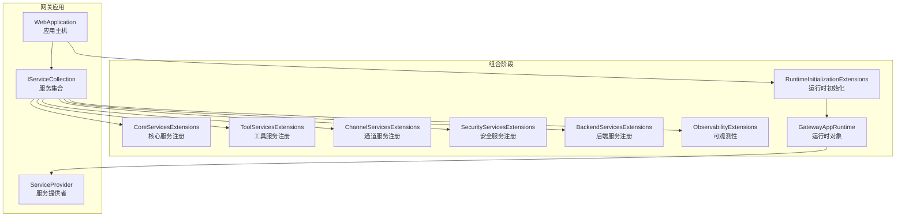
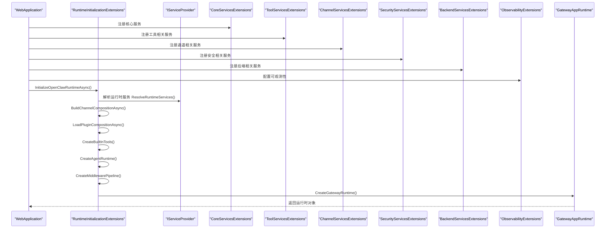
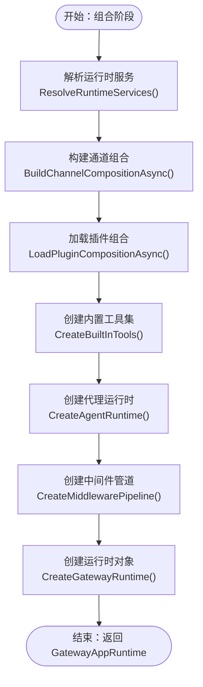
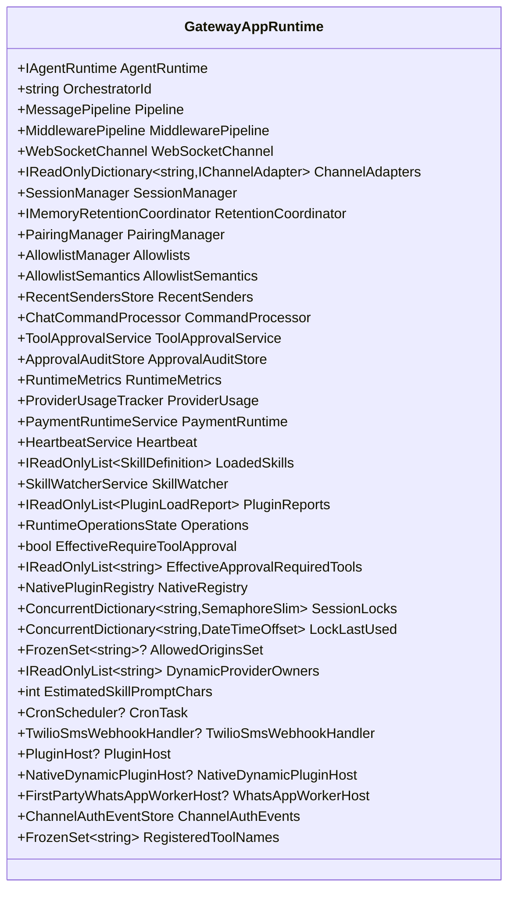
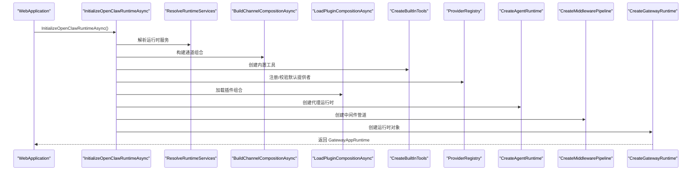
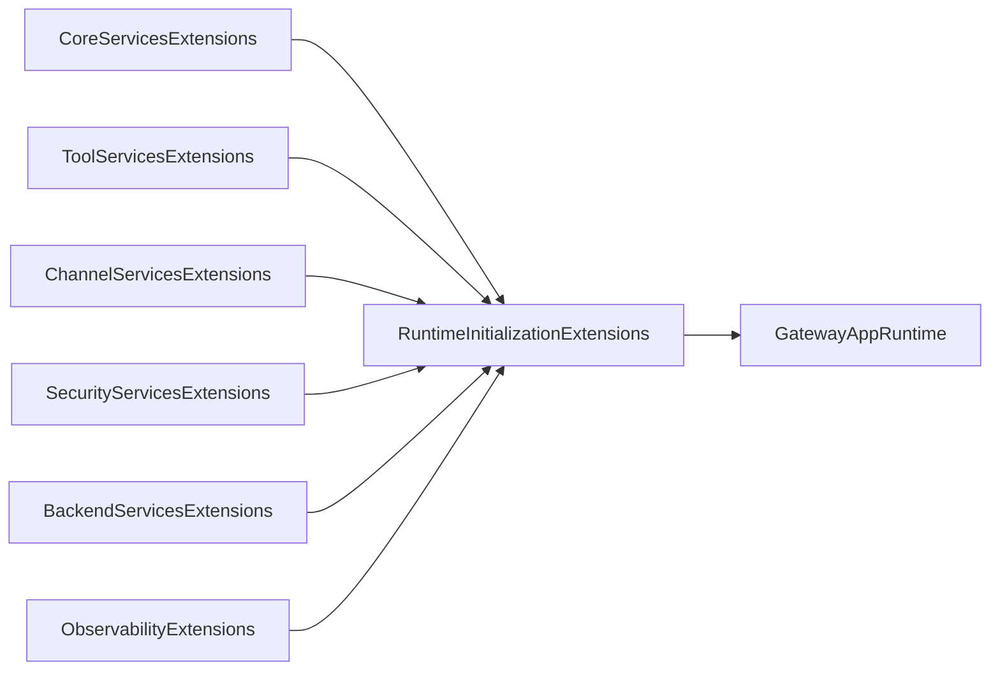

# 组合阶段（Composition）

<cite>
**本文引用的文件**
- [RuntimeInitializationExtensions.cs](file://src/OpenClaw.Gateway/Composition/RuntimeInitializationExtensions.cs)
- [RuntimeInitializationExtensions.RuntimeFactories.cs](file://src/OpenClaw.Gateway/Composition/RuntimeInitializationExtensions.RuntimeFactories.cs)
- [RuntimeInitializationExtensions.CompositionStages.cs](file://src/OpenClaw.Gateway/Composition/RuntimeInitializationExtensions.CompositionStages.cs)
- [CoreServicesExtensions.cs](file://src/OpenClaw.Gateway/Composition/CoreServicesExtensions.cs)
- [ToolServicesExtensions.cs](file://src/OpenClaw.Gateway/Composition/ToolServicesExtensions.cs)
- [ChannelServicesExtensions.cs](file://src/OpenClaw.Gateway/Composition/ChannelServicesExtensions.cs)
- [SecurityServicesExtensions.cs](file://src/OpenClaw.Gateway/Composition/SecurityServicesExtensions.cs)
- [BackendServicesExtensions.cs](file://src/OpenClaw.Gateway/Composition/BackendServicesExtensions.cs)
- [ObservabilityExtensions.cs](file://src/OpenClaw.Gateway/Composition/ObservabilityExtensions.cs)
- [GatewayAppRuntime.cs](file://src/OpenClaw.Gateway/Composition/GatewayAppRuntime.cs)
</cite>

## 目录
1. [引言](#引言)
2. [项目结构](#项目结构)
3. [核心组件](#核心组件)
4. [架构总览](#架构总览)
5. [详细组件分析](#详细组件分析)
6. [依赖关系分析](#依赖关系分析)
7. [性能考量](#性能考量)
8. [故障排查指南](#故障排查指南)
9. [结论](#结论)
10. [附录](#附录)

## 引言
本文件系统化阐述 OpenClaw.NET 在网关侧的“组合阶段（Composition）”实现，聚焦以下目标：
- 服务注册：如何在启动时将核心与扩展服务注册到依赖注入容器
- 依赖注入配置：服务生命周期、作用域与替换策略
- 组件装配与初始化：从服务解析到运行时对象构建的完整流水线
- RuntimeInitializationExtensions 的服务初始化流程：RuntimeFactories、CompositionStages 等关键组件
- 核心服务扩展、工具服务扩展、通道服务扩展的注册机制
- 服务生命周期管理、依赖解析、循环依赖检测等技术细节
- 服务注册顺序、条件注册、可选服务处理等实现策略
- AOT 兼容性考虑、服务替换机制、插件集成等高级主题

## 项目结构
组合阶段位于网关工程的 Composition 子目录，围绕 WebApplication 启动流程，通过一系列扩展方法完成服务注册与运行时装配。

图表来源
- [CoreServicesExtensions.cs:38-249](file://src/OpenClaw.Gateway/Composition/CoreServicesExtensions.cs#L38-L249)
- [ToolServicesExtensions.cs:8-21](file://src/OpenClaw.Gateway/Composition/ToolServicesExtensions.cs#L8-L21)
- [ChannelServicesExtensions.cs:8-96](file://src/OpenClaw.Gateway/Composition/ChannelServicesExtensions.cs#L8-L96)
- [SecurityServicesExtensions.cs:11-84](file://src/OpenClaw.Gateway/Composition/SecurityServicesExtensions.cs#L11-L84)
- [BackendServicesExtensions.cs:10-43](file://src/OpenClaw.Gateway/Composition/BackendServicesExtensions.cs#L10-L43)
- [ObservabilityExtensions.cs:7-13](file://src/OpenClaw.Gateway/Composition/ObservabilityExtensions.cs#L7-L13)
- [RuntimeInitializationExtensions.cs:35-242](file://src/OpenClaw.Gateway/Composition/RuntimeInitializationExtensions.cs#L35-L242)
- [GatewayAppRuntime.cs:21-63](file://src/OpenClaw.Gateway/Composition/GatewayAppRuntime.cs#L21-L63)

章节来源
- [CoreServicesExtensions.cs:38-249](file://src/OpenClaw.Gateway/Composition/CoreServicesExtensions.cs#L38-L249)
- [RuntimeInitializationExtensions.cs:35-242](file://src/OpenClaw.Gateway/Composition/RuntimeInitializationExtensions.cs#L35-L242)

## 核心组件
- 运行时初始化器（RuntimeInitializationExtensions）
  - 负责解析运行时服务、构建通道与插件组合、注册内置工具、加载技能、创建代理运行时、装配中间件与管道、启动集成服务并产出 GatewayAppRuntime
- 运行时工厂（RuntimeFactories）
  - 提供 CreateGatewayRuntime、CreateBuiltInTools、CreateHooks、ResolveApprovalMode、CreateAgentRuntime、CreateMiddlewarePipeline、StartNativeEventBridges 等工厂方法
- 组合阶段（CompositionStages）
  - 提供 ResolveRuntimeServices、BuildChannelCompositionAsync、LoadPluginCompositionAsync、CollectPluginSkillRoots、CreateTwilioResources、注册桥接与原生动态插件的通道/命令/提供者、诊断收集与报告合并等
- 运行时对象（GatewayAppRuntime）
  - 封装运行时所需的所有核心组件与状态，作为最终装配产物对外暴露

章节来源
- [RuntimeInitializationExtensions.cs:35-242](file://src/OpenClaw.Gateway/Composition/RuntimeInitializationExtensions.cs#L35-L242)
- [RuntimeInitializationExtensions.RuntimeFactories.cs:25-377](file://src/OpenClaw.Gateway/Composition/RuntimeInitializationExtensions.RuntimeFactories.cs#L25-L377)
- [RuntimeInitializationExtensions.CompositionStages.cs:26-610](file://src/OpenClaw.Gateway/Composition/RuntimeInitializationExtensions.CompositionStages.cs#L26-L610)
- [GatewayAppRuntime.cs:21-63](file://src/OpenClaw.Gateway/Composition/GatewayAppRuntime.cs#L21-L63)

## 架构总览
组合阶段以“阶段化装配”的方式组织，分为“服务注册阶段”和“运行时装配阶段”，后者在前者基础上进行复杂对象构建与集成。

图表来源
- [RuntimeInitializationExtensions.cs:35-242](file://src/OpenClaw.Gateway/Composition/RuntimeInitializationExtensions.cs#L35-L242)
- [CoreServicesExtensions.cs:38-249](file://src/OpenClaw.Gateway/Composition/CoreServicesExtensions.cs#L38-L249)
- [ToolServicesExtensions.cs:8-21](file://src/OpenClaw.Gateway/Composition/ToolServicesExtensions.cs#L8-L21)
- [ChannelServicesExtensions.cs:8-96](file://src/OpenClaw.Gateway/Composition/ChannelServicesExtensions.cs#L8-L96)
- [SecurityServicesExtensions.cs:11-84](file://src/OpenClaw.Gateway/Composition/SecurityServicesExtensions.cs#L11-L84)
- [BackendServicesExtensions.cs:10-43](file://src/OpenClaw.Gateway/Composition/BackendServicesExtensions.cs#L10-L43)
- [ObservabilityExtensions.cs:7-13](file://src/OpenClaw.Gateway/Composition/ObservabilityExtensions.cs#L7-L13)
- [GatewayAppRuntime.cs:21-63](file://src/OpenClaw.Gateway/Composition/GatewayAppRuntime.cs#L21-L63)

## 详细组件分析

### 服务注册与生命周期管理
- 核心服务注册（CoreServicesExtensions）
  - 注册支付、审计、会话、内存、模型配置、执行服务、自动化、计划执行验证、任务调度、媒体缓存、文本转语音、多模态、沙箱路由、进程执行、心跳、脉搏、保留清理、可观测性追踪等
  - 条件注册：根据配置选择 SQLite 或文件存储；根据治理配置选择 HTTP 边车或空实现
  - 可选服务：沙箱、外部 CLI 审计与事件、合同治理等按需注入
- 工具服务注册（ToolServicesExtensions）
  - 注册原生插件注册表与 MCP 服务器工具注册表
- 通道服务注册（ChannelServicesExtensions）
  - 条件注册各通道适配器与 Webhook 处理器，支持 WhatsApp、Telegram、Teams、Slack、Discord、Signal 等
- 安全服务注册（SecurityServicesExtensions）
  - 注册审批、配对、运营审计、插件健康、合同治理、事件存储、外部 CLI 审计与事件等
- 后端服务注册（BackendServicesExtensions）
  - 注册数据保护密钥持久化目录、连接账户保护与服务、后端凭证解析、编码后端注册与协调
- 观测性（ObservabilityExtensions）
  - 添加遥测与控制台日志提供程序

章节来源
- [CoreServicesExtensions.cs:38-249](file://src/OpenClaw.Gateway/Composition/CoreServicesExtensions.cs#L38-L249)
- [ToolServicesExtensions.cs:8-21](file://src/OpenClaw.Gateway/Composition/ToolServicesExtensions.cs#L8-L21)
- [ChannelServicesExtensions.cs:8-96](file://src/OpenClaw.Gateway/Composition/ChannelServicesExtensions.cs#L8-L96)
- [SecurityServicesExtensions.cs:11-84](file://src/OpenClaw.Gateway/Composition/SecurityServicesExtensions.cs#L11-L84)
- [BackendServicesExtensions.cs:10-43](file://src/OpenClaw.Gateway/Composition/BackendServicesExtensions.cs#L10-L43)
- [ObservabilityExtensions.cs:7-13](file://src/OpenClaw.Gateway/Composition/ObservabilityExtensions.cs#L7-L13)

### 组合阶段（CompositionStages）
- ResolveRuntimeServices
  - 从 ServiceProvider 获取运行时所需的核心服务集合，统一封装为 RuntimeServices
- BuildChannelCompositionAsync
  - 基于配置与运行时状态构建通道适配器字典，支持 Twilio、WhatsApp（桥接/工作器）、Telegram、Teams、Slack、Discord、Signal、Cron 等
- LoadPluginCompositionAsync
  - 加载桥接插件与原生动态插件，注册其提供的工具、通道、命令与 LLM 提供者，并收集兼容性诊断与动态提供者归属
- CollectPluginSkillRoots
  - 汇总桥接与原生动态插件的技能根目录，供后续技能加载使用
- CreateTwilioResources
  - 创建 Twilio SMS 通道与 Webhook 处理器，校验签名与公共基地址配置
- 插件注册管线
  - RegisterBridgeChannels/Commands/Providers：桥接插件
  - RegisterNativeDynamicChannels/Commands/Providers：原生动态插件
  - 重复 ID 与保留命令名等冲突检测与诊断记录

图表来源
- [RuntimeInitializationExtensions.CompositionStages.cs:26-131](file://src/OpenClaw.Gateway/Composition/RuntimeInitializationExtensions.CompositionStages.cs#L26-L131)
- [RuntimeInitializationExtensions.CompositionStages.cs:171-237](file://src/OpenClaw.Gateway/Composition/RuntimeInitializationExtensions.CompositionStages.cs#L171-L237)
- [RuntimeInitializationExtensions.RuntimeFactories.cs:25-101](file://src/OpenClaw.Gateway/Composition/RuntimeInitializationExtensions.RuntimeFactories.cs#L25-L101)

章节来源
- [RuntimeInitializationExtensions.CompositionStages.cs:26-131](file://src/OpenClaw.Gateway/Composition/RuntimeInitializationExtensions.CompositionStages.cs#L26-L131)
- [RuntimeInitializationExtensions.CompositionStages.cs:171-237](file://src/OpenClaw.Gateway/Composition/RuntimeInitializationExtensions.CompositionStages.cs#L171-L237)

### 运行时工厂（RuntimeFactories）
- CreateGatewayRuntime
  - 将运行时所需的各类服务与状态聚合到 GatewayAppRuntime，包括代理运行时、管道、中间件、通道适配器、会话管理、技能监视器、插件报告、操作状态等
- CreateBuiltInTools
  - 基于配置与运行时状态创建内置工具集，含文件操作、会话管理、消息、浏览器工具、外部 CLI、Fractal 内存工具、支付工具、Canvas 工具等
- CreateHooks
  - 组装审计、自主性、合约范围等钩子，并合并插件提供的钩子
- ResolveApprovalMode
  - 基于自治模式与插件配置计算是否需要工具审批及审批白名单
- CreateAgentRuntime
  - 通过工厂选择器选择具体代理运行时工厂，传入工具、记忆、指标、LLM 执行、技能、工作区路径、钩子、治理等上下文
- CreateMiddlewarePipeline
  - 组装速率限制与令牌预算中间件
- StartNativeEventBridges
  - 启动 Home Assistant 与 MQTT 事件桥接

图表来源
- [GatewayAppRuntime.cs:21-63](file://src/OpenClaw.Gateway/Composition/GatewayAppRuntime.cs#L21-L63)

章节来源
- [RuntimeInitializationExtensions.RuntimeFactories.cs:25-377](file://src/OpenClaw.Gateway/Composition/RuntimeInitializationExtensions.RuntimeFactories.cs#L25-L377)
- [GatewayAppRuntime.cs:21-63](file://src/OpenClaw.Gateway/Composition/GatewayAppRuntime.cs#L21-L63)

### 运行时初始化流程（InitializeOpenClawRuntimeAsync）
- 应用严格绑定策略、记录启动通知、评估浏览器可用性
- 解析运行时服务、构建通道组合、创建内置工具、注册 MCP 工具
- 初始化 LLM 提供者（内置优先，失败则等待插件提供者），校验默认提供者可用性
- 加载插件组合（桥接与原生动态），合并技能根目录，加载技能并注入“加载技能/读取资源”工具
- 创建钩子、解析审批模式、创建代理运行时、装配中间件与管道、启动技能监视器与自动化
- 合并插件报告、注册异步清理、调用运行时配置文件回调、启动 Tailscale 与 mDNS 集成服务
- 产出 GatewayAppRuntime 并注册到关闭协调器

图表来源
- [RuntimeInitializationExtensions.cs:35-242](file://src/OpenClaw.Gateway/Composition/RuntimeInitializationExtensions.cs#L35-L242)

章节来源
- [RuntimeInitializationExtensions.cs:35-242](file://src/OpenClaw.Gateway/Composition/RuntimeInitializationExtensions.cs#L35-L242)

### 服务注册顺序与条件注册
- 顺序原则
  - 先注册基础能力（核心、安全、可观测性），再注册工具与通道，最后进行运行时装配
  - 通道与插件组合在运行时装配前完成，确保后续工具与提供者注册有前置依赖
- 条件注册
  - 通道：仅当配置启用时注册对应通道与 Webhook 处理器
  - 工具：根据运行时状态（如浏览器可用性）与配置（如外部 CLI、Fractal 内存、支付）决定是否注册
  - 存储：根据配置选择文件、SQLite 或 mempalace（JIT 动态原生）提供者
- 可选服务
  - 沙箱、外部 CLI 审计/事件、合同治理、多模态/语音服务等按需注入

章节来源
- [ChannelServicesExtensions.cs:8-96](file://src/OpenClaw.Gateway/Composition/ChannelServicesExtensions.cs#L8-L96)
- [CoreServicesExtensions.cs:38-249](file://src/OpenClaw.Gateway/Composition/CoreServicesExtensions.cs#L38-L249)
- [RuntimeInitializationExtensions.RuntimeFactories.cs:103-195](file://src/OpenClaw.Gateway/Composition/RuntimeInitializationExtensions.RuntimeFactories.cs#L103-L195)

### 依赖解析与循环依赖检测
- 依赖解析
  - 通过 IServiceProvider.GetRequiredService/GetServices 获取运行时服务，避免硬编码构造
  - 使用 Frozen/Concurrent 集合保证并发安全与只读语义
- 循环依赖检测
  - 通道适配器注册时检测重复 ID，插件命令注册时检测保留名与重复名，记录诊断信息
  - 提供者注册时检测重复 ID，避免覆盖默认注册

章节来源
- [RuntimeInitializationExtensions.CompositionStages.cs:281-460](file://src/OpenClaw.Gateway/Composition/RuntimeInitializationExtensions.CompositionStages.cs#L281-L460)

### 服务生命周期管理
- 单例（Singleton）：配置、运行时度量、内存存储、会话管理、消息管道、执行服务、可观测性追踪等
- 有宿主服务（HostedService）：脉搏、保留清理、自动化协调、提示缓存预热、嵌入回填等
- 数据保护密钥持久化：基于内存存储路径创建写入权限检查
- 关闭协调：注册异步清理（MCP 注册表、Tailscale、mDNS），在应用停止时统一释放

章节来源
- [CoreServicesExtensions.cs:92-248](file://src/OpenClaw.Gateway/Composition/CoreServicesExtensions.cs#L92-L248)
- [BackendServicesExtensions.cs:27-29](file://src/OpenClaw.Gateway/Composition/BackendServicesExtensions.cs#L27-L29)
- [RuntimeInitializationExtensions.cs:195-241](file://src/OpenClaw.Gateway/Composition/RuntimeInitializationExtensions.cs#L195-L241)

### AOT 兼容性考虑
- JIT 专用能力（如 mempalace 内存提供者）在 AOT 下不可用，需通过原生动态插件加载
- 当请求 mempalace 提供者但未启用动态原生插件时，抛出明确错误提示
- 运行时工厂与组合阶段尽量使用反射外的注册与解析方式，减少 AOT 不利影响

章节来源
- [CoreServicesExtensions.cs:333-380](file://src/OpenClaw.Gateway/Composition/CoreServicesExtensions.cs#L333-L380)

### 服务替换机制与插件集成
- 服务替换
  - LLM 提供者可通过插件桥接或原生动态插件注册为动态提供者，支持覆盖默认注册
  - 插件报告与诊断合并，便于运行时观察兼容性问题
- 插件集成
  - 桥接插件：通过桥接通道/命令/提供者接入
  - 原生动态插件：在启动时加载，提供工具、通道、命令与提供者
  - MCP 工具注册：在启动时集中注册，统一由运行时使用

章节来源
- [RuntimeInitializationExtensions.CompositionStages.cs:171-237](file://src/OpenClaw.Gateway/Composition/RuntimeInitializationExtensions.CompositionStages.cs#L171-L237)
- [ToolServicesExtensions.cs:10-18](file://src/OpenClaw.Gateway/Composition/ToolServicesExtensions.cs#L10-L18)

## 依赖关系分析
组合阶段内部模块间存在清晰的职责边界与依赖方向：

图表来源
- [CoreServicesExtensions.cs:38-249](file://src/OpenClaw.Gateway/Composition/CoreServicesExtensions.cs#L38-L249)
- [ToolServicesExtensions.cs:8-21](file://src/OpenClaw.Gateway/Composition/ToolServicesExtensions.cs#L8-L21)
- [ChannelServicesExtensions.cs:8-96](file://src/OpenClaw.Gateway/Composition/ChannelServicesExtensions.cs#L8-L96)
- [SecurityServicesExtensions.cs:11-84](file://src/OpenClaw.Gateway/Composition/SecurityServicesExtensions.cs#L11-L84)
- [BackendServicesExtensions.cs:10-43](file://src/OpenClaw.Gateway/Composition/BackendServicesExtensions.cs#L10-L43)
- [ObservabilityExtensions.cs:7-13](file://src/OpenClaw.Gateway/Composition/ObservabilityExtensions.cs#L7-L13)
- [RuntimeInitializationExtensions.cs:35-242](file://src/OpenClaw.Gateway/Composition/RuntimeInitializationExtensions.cs#L35-L242)
- [GatewayAppRuntime.cs:21-63](file://src/OpenClaw.Gateway/Composition/GatewayAppRuntime.cs#L21-L63)

章节来源
- [RuntimeInitializationExtensions.cs:35-242](file://src/OpenClaw.Gateway/Composition/RuntimeInitializationExtensions.cs#L35-L242)

## 性能考量
- 服务懒加载与单例复用：核心服务多为单例，避免重复初始化开销
- 并发安全集合：使用 Frozen/Concurrent 集合降低锁竞争
- 中间件链路优化：速率限制与令牌预算中间件在消息入口处快速决策
- 技能加载与热重载：技能监视器与延迟技能提供器，支持热更新场景
- 事件桥接异步启动：Home Assistant 与 MQTT 事件桥接采用异步启动并错误传播

## 故障排查指南
- 默认 LLM 提供者不可用
  - 现象：启动时报错提示默认提供者不可用
  - 排查：确认内置初始化是否成功；若失败，等待插件提供者注册或手动注册
  - 参考路径：[RuntimeInitializationExtensions.cs:81-114](file://src/OpenClaw.Gateway/Composition/RuntimeInitializationExtensions.cs#L81-L114)
- 通道 ID 冲突
  - 现象：插件注册通道时被跳过并记录诊断
  - 排查：检查插件是否重复注册相同通道 ID
  - 参考路径：[RuntimeInitializationExtensions.CompositionStages.cs:281-299](file://src/OpenClaw.Gateway/Composition/RuntimeInitializationExtensions.CompositionStages.cs#L281-L299)
- 命令名称冲突或保留
  - 现象：动态命令注册结果为保留或重复
  - 排查：修改命令名称或检查内置命令命名空间
  - 参考路径：[RuntimeInitializationExtensions.CompositionStages.cs:321-394](file://src/OpenClaw.Gateway/Composition/RuntimeInitializationExtensions.CompositionStages.cs#L321-L394)
- 提供者 ID 冲突
  - 现象：动态提供者注册被跳过并记录诊断
  - 排查：确保提供者 ID 唯一
  - 参考路径：[RuntimeInitializationExtensions.CompositionStages.cs:396-460](file://src/OpenClaw.Gateway/Composition/RuntimeInitializationExtensions.CompositionStages.cs#L396-L460)
- mempalace 提供者不可用
  - 现象：请求 mempalace 提供者但未启用动态原生插件
  - 排查：启用动态原生插件并加载相应插件
  - 参考路径：[CoreServicesExtensions.cs:341-346](file://src/OpenClaw.Gateway/Composition/CoreServicesExtensions.cs#L341-L346)

章节来源
- [RuntimeInitializationExtensions.cs:81-114](file://src/OpenClaw.Gateway/Composition/RuntimeInitializationExtensions.cs#L81-L114)
- [RuntimeInitializationExtensions.CompositionStages.cs:281-299](file://src/OpenClaw.Gateway/Composition/RuntimeInitializationExtensions.CompositionStages.cs#L281-L299)
- [RuntimeInitializationExtensions.CompositionStages.cs:321-394](file://src/OpenClaw.Gateway/Composition/RuntimeInitializationExtensions.CompositionStages.cs#L321-L394)
- [RuntimeInitializationExtensions.CompositionStages.cs:396-460](file://src/OpenClaw.Gateway/Composition/RuntimeInitializationExtensions.CompositionStages.cs#L396-L460)
- [CoreServicesExtensions.cs:341-346](file://src/OpenClaw.Gateway/Composition/CoreServicesExtensions.cs#L341-L346)

## 结论
组合阶段通过“服务注册 + 组合装配 + 运行时构建”的三层结构，实现了 OpenClaw.NET 网关侧的高内聚、低耦合与强扩展性。RuntimeInitializationExtensions 将复杂装配过程模块化，配合 RuntimeFactories 与 CompositionStages，既保证了启动流程的可控性，也为插件生态与 AOT 场景提供了灵活的扩展点。

## 附录
- 关键类型与职责
  - RuntimeServices：封装运行时所需的核心服务集合
  - ChannelComposition：封装通道适配器与特定通道处理器
  - PluginComposition：封装桥接与原生动态插件的工具、通道、命令、提供者与诊断
  - GatewayAppRuntime：运行时装配产物，承载全部运行时能力

章节来源
- [RuntimeInitializationExtensions.CompositionStages.cs:544-608](file://src/OpenClaw.Gateway/Composition/RuntimeInitializationExtensions.CompositionStages.cs#L544-L608)
- [GatewayAppRuntime.cs:21-63](file://src/OpenClaw.Gateway/Composition/GatewayAppRuntime.cs#L21-L63)