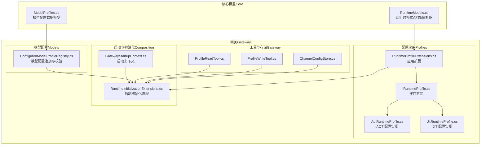
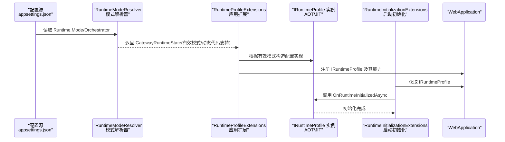
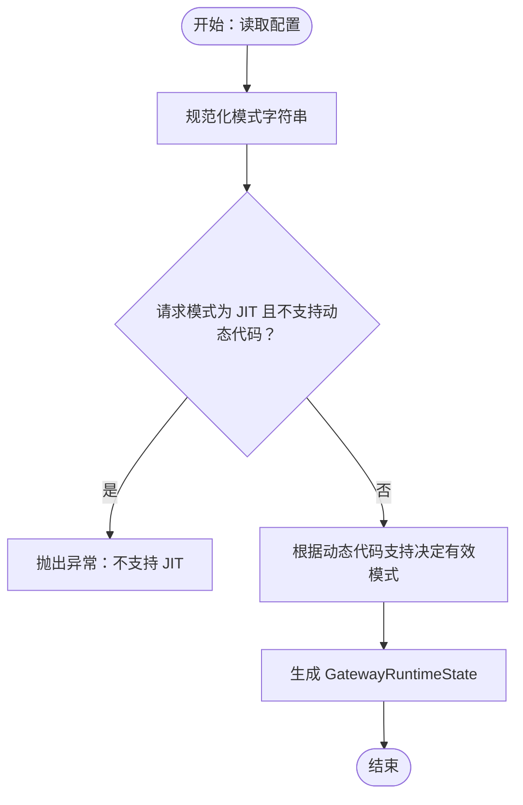
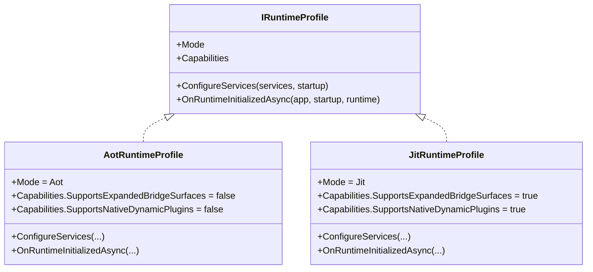
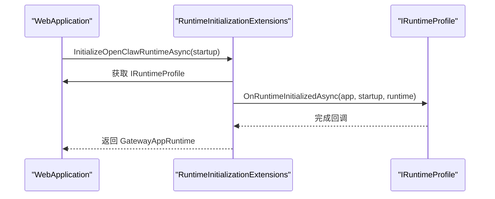
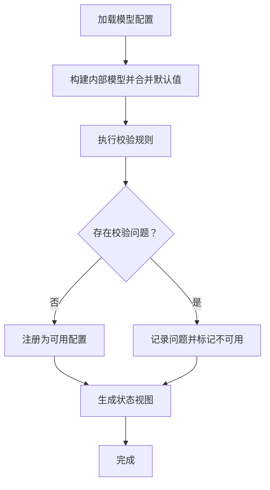
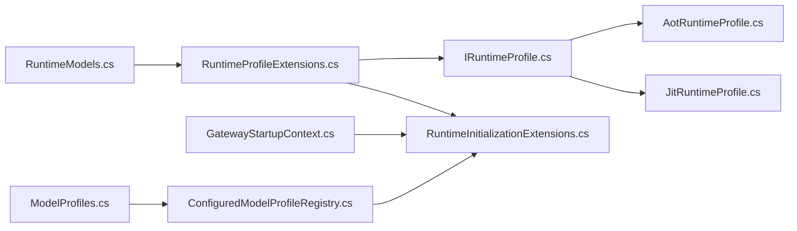

# 配置阶段（配置文件与运行时模式）

<cite>
**本文引用的文件**
- [AotRuntimeProfile.cs](file://src/OpenClaw.Gateway/Profiles/AotRuntimeProfile.cs)
- [JitRuntimeProfile.cs](file://src/OpenClaw.Gateway/Profiles/JitRuntimeProfile.cs)
- [IRuntimeProfile.cs](file://src/OpenClaw.Gateway/Profiles/IRuntimeProfile.cs)
- [RuntimeProfileExtensions.cs](file://src/OpenClaw.Gateway/Profiles/RuntimeProfileExtensions.cs)
- [RuntimeInitializationExtensions.cs](file://src/OpenClaw.Gateway/Composition/RuntimeInitializationExtensions.cs)
- [RuntimeModels.cs](file://src/OpenClaw.Core/Models/RuntimeModels.cs)
- [GatewayStartupContext.cs](file://src/OpenClaw.Gateway/Bootstrap/GatewayStartupContext.cs)
- [ConfiguredModelProfileRegistry.cs](file://src/OpenClaw.Gateway/Models/ConfiguredModelProfileRegistry.cs)
- [ModelProfiles.cs](file://src/OpenClaw.Core/Models/ModelProfiles.cs)
- [ConfigValidator.cs](file://src/OpenClaw.Core/Validation/ConfigValidator.cs)
- [ProfileReadTool.cs](file://src/OpenClaw.Gateway/Tools/ProfileReadTool.cs)
- [ProfileWriteTool.cs](file://src/OpenClaw.Gateway/Tools/ProfileWriteTool.cs)
- [ChannelConfigStore.cs](file://src/OpenClaw.Gateway/Channels/ChannelConfigStore.cs)
- [appsettings.json](file://src/OpenClaw.Gateway/appsettings.json)
- [appsettings.Production.json](file://src/OpenClaw.Gateway/appsettings.Production.json)
</cite>

## 目录
1. [引言](#引言)
2. [项目结构](#项目结构)
3. [核心组件](#核心组件)
4. [架构总览](#架构总览)
5. [详细组件分析](#详细组件分析)
6. [依赖关系分析](#依赖关系分析)
7. [性能考量](#性能考量)
8. [故障排查指南](#故障排查指南)
9. [结论](#结论)
10. [附录](#附录)

## 引言
本文件聚焦 OpenClaw.NET 的“配置阶段”，系统性阐述以下主题：
- 运行时配置选择：如何根据请求模式与环境能力确定有效运行模式（AOT 或 JIT）。
- 性能配置优化：在不同运行模式下对功能能力与初始化流程的影响。
- AOT/JIT 模式切换：两种运行时模式的差异、适用场景与权衡。
- 配置应用机制：通过扩展方法将运行时配置注入到服务容器，并在运行时初始化后生效。
- 模型配置文件管理：模型配置的注册、校验、状态报告与默认值推断。
- 配置验证与热更新：配置校验规则、持久化与变更后的处理建议。
- 实用指南：不同部署场景下的配置推荐、AOT 编译优化与 JIT 选择策略。

## 项目结构
配置阶段涉及的关键目录与文件：
- 运行时配置与模式解析：位于 Core 层的运行时模型与解析器。
- 运行时配置应用：位于 Gateway 的 Profiles 子系统，负责将运行时模式映射为具体能力与服务配置。
- 运行时初始化：在 Gateway 启动流程中调用扩展方法完成服务装配与运行时回调。
- 模型配置文件：位于 Gateway 的模型配置注册器，负责构建与校验模型配置。
- 配置工具与存储：提供用户画像读写工具与通道配置持久化能力。

图表来源
- [RuntimeModels.cs:1-69](file://src/OpenClaw.Core/Models/RuntimeModels.cs#L1-L69)
- [IRuntimeProfile.cs:1-18](file://src/OpenClaw.Gateway/Profiles/IRuntimeProfile.cs#L1-L18)
- [AotRuntimeProfile.cs:1-22](file://src/OpenClaw.Gateway/Profiles/AotRuntimeProfile.cs#L1-L22)
- [JitRuntimeProfile.cs:1-21](file://src/OpenClaw.Gateway/Profiles/JitRuntimeProfile.cs#L1-L21)
- [RuntimeProfileExtensions.cs:1-22](file://src/OpenClaw.Gateway/Profiles/RuntimeProfileExtensions.cs#L1-L22)
- [RuntimeInitializationExtensions.cs:1-245](file://src/OpenClaw.Gateway/Composition/RuntimeInitializationExtensions.cs#L1-L245)
- [GatewayStartupContext.cs:1-15](file://src/OpenClaw.Gateway/Bootstrap/GatewayStartupContext.cs#L1-L15)
- [ConfiguredModelProfileRegistry.cs:1-497](file://src/OpenClaw.Gateway/Models/ConfiguredModelProfileRegistry.cs#L1-L497)
- [ModelProfiles.cs:1-169](file://src/OpenClaw.Core/Models/ModelProfiles.cs#L1-L169)
- [ProfileReadTool.cs:1-72](file://src/OpenClaw.Gateway/Tools/ProfileReadTool.cs#L1-L72)
- [ProfileWriteTool.cs:1-76](file://src/OpenClaw.Gateway/Tools/ProfileWriteTool.cs#L1-L76)
- [ChannelConfigStore.cs:37-76](file://src/OpenClaw.Gateway/Channels/ChannelConfigStore.cs#L37-L76)

章节来源
- [RuntimeModels.cs:1-69](file://src/OpenClaw.Core/Models/RuntimeModels.cs#L1-L69)
- [RuntimeProfileExtensions.cs:1-22](file://src/OpenClaw.Gateway/Profiles/RuntimeProfileExtensions.cs#L1-L22)
- [RuntimeInitializationExtensions.cs:1-245](file://src/OpenClaw.Gateway/Composition/RuntimeInitializationExtensions.cs#L1-L245)

## 核心组件
- 运行时模式与状态
  - 枚举定义运行时模式（AOT/JIT），并提供运行时配置对象与状态对象，以及模式解析器用于从配置与环境能力推导有效模式。
- 运行时配置应用
  - 通过扩展方法将运行时配置注入服务容器，按有效模式实例化对应配置实现，并注册其能力。
- 运行时初始化
  - 在启动流程中获取已注册的运行时配置实现，并在运行时初始化完成后执行回调。
- 模型配置注册与校验
  - 将配置文件中的模型配置转换为内部模型，进行校验与默认值推断，生成状态视图与可用性信息。
- 工具与存储
  - 提供用户画像读写工具与通道配置持久化能力，支持配置变更后的读取与恢复。

章节来源
- [RuntimeModels.cs:1-69](file://src/OpenClaw.Core/Models/RuntimeModels.cs#L1-L69)
- [RuntimeProfileExtensions.cs:1-22](file://src/OpenClaw.Gateway/Profiles/RuntimeProfileExtensions.cs#L1-L22)
- [RuntimeInitializationExtensions.cs:1-245](file://src/OpenClaw.Gateway/Composition/RuntimeInitializationExtensions.cs#L1-L245)
- [ConfiguredModelProfileRegistry.cs:1-497](file://src/OpenClaw.Gateway/Models/ConfiguredModelProfileRegistry.cs#L1-L497)

## 架构总览
运行时配置选择与应用的总体流程如下：

图表来源
- [RuntimeModels.cs:29-59](file://src/OpenClaw.Core/Models/RuntimeModels.cs#L29-L59)
- [RuntimeProfileExtensions.cs:8-21](file://src/OpenClaw.Gateway/Profiles/RuntimeProfileExtensions.cs#L8-L21)
- [RuntimeInitializationExtensions.cs:193-217](file://src/OpenClaw.Gateway/Composition/RuntimeInitializationExtensions.cs#L193-L217)

## 详细组件分析

### 运行时配置选择与模式解析
- 模式来源
  - 配置项包含运行时模式（auto/aot/jit）与编排器（native/maf）。模式解析器会规范化输入并结合运行时是否支持动态代码，推导出有效模式。
- 有效性约束
  - 当请求模式为 JIT 且运行时不支持动态代码时，解析器抛出异常，防止无效配置导致运行失败。
- 状态输出
  - 解析结果包含请求模式、有效模式与动态代码支持状态，便于启动日志与后续逻辑判断。

图表来源
- [RuntimeModels.cs:29-59](file://src/OpenClaw.Core/Models/RuntimeModels.cs#L29-L59)

章节来源
- [RuntimeModels.cs:11-59](file://src/OpenClaw.Core/Models/RuntimeModels.cs#L11-L59)

### 运行时配置应用机制（RuntimeProfileExtensions）
- 扩展方法
  - 根据启动上下文中的有效运行时模式，构造对应的配置实现（AOT/JIT），注册到服务容器，并调用其 ConfigureServices 完成服务装配。
- 能力声明
  - 每个配置实现声明其支持的功能能力（如桥接面扩展、原生动态插件支持），影响后续组件装配与运行行为。

图表来源
- [IRuntimeProfile.cs:7-17](file://src/OpenClaw.Gateway/Profiles/IRuntimeProfile.cs#L7-L17)
- [AotRuntimeProfile.cs:7-21](file://src/OpenClaw.Gateway/Profiles/AotRuntimeProfile.cs#L7-L21)
- [JitRuntimeProfile.cs:7-21](file://src/OpenClaw.Gateway/Profiles/JitRuntimeProfile.cs#L7-L21)

章节来源
- [RuntimeProfileExtensions.cs:8-21](file://src/OpenClaw.Gateway/Profiles/RuntimeProfileExtensions.cs#L8-L21)
- [IRuntimeProfile.cs:11-17](file://src/OpenClaw.Gateway/Profiles/IRuntimeProfile.cs#L11-L17)

### 运行时初始化与生命周期回调
- 生命周期
  - 启动流程中获取已注册的运行时配置实现，随后调用其 OnRuntimeInitializedAsync，允许在运行时完全初始化后再进行特定操作。
- 集成点
  - 在初始化流程中可访问配置、插件、通道适配器、技能等资源，并在此阶段启动额外集成服务（如 Tailscale、mDNS）。

图表来源
- [RuntimeInitializationExtensions.cs:193-217](file://src/OpenClaw.Gateway/Composition/RuntimeInitializationExtensions.cs#L193-L217)

章节来源
- [RuntimeInitializationExtensions.cs:35-244](file://src/OpenClaw.Gateway/Composition/RuntimeInitializationExtensions.cs#L35-L244)

### 模型配置文件管理与校验
- 配置注册
  - 从配置文件读取模型配置列表，构建内部模型，合并默认值与预设信息，生成可用性状态与兼容性提示。
- 校验规则
  - 校验必填字段、认证方式、端点与密钥组合、回退配置一致性等；若未显式配置模型集，则自动生成隐式默认配置。
- 状态视图
  - 提供模型配置状态列表，包含可用性、回退配置、兼容性提示等信息，便于诊断与运维。

图表来源
- [ConfiguredModelProfileRegistry.cs:91-158](file://src/OpenClaw.Gateway/Models/ConfiguredModelProfileRegistry.cs#L91-L158)
- [ConfigValidator.cs:635-719](file://src/OpenClaw.Core/Validation/ConfigValidator.cs#L635-L719)

章节来源
- [ConfiguredModelProfileRegistry.cs:13-497](file://src/OpenClaw.Gateway/Models/ConfiguredModelProfileRegistry.cs#L13-L497)
- [ModelProfiles.cs:3-169](file://src/OpenClaw.Core/Models/ModelProfiles.cs#L3-L169)
- [ConfigValidator.cs:635-719](file://src/OpenClaw.Core/Validation/ConfigValidator.cs#L635-L719)

### 配置热更新与持久化
- 用户画像工具
  - 提供读取与写入用户画像的工具，支持在运行时更新用户偏好、项目与事实等信息。
- 通道配置存储
  - 将通道配置序列化到磁盘，支持容器重启后恢复；同时提供删除以回退到默认配置的能力。
- 建议实践
  - 对于需要热更新的配置，优先采用持久化存储或外部配置中心；对运行时敏感的配置（如运行模式）建议在重启后生效，避免运行时切换带来的不确定性。

章节来源
- [ProfileReadTool.cs:8-72](file://src/OpenClaw.Gateway/Tools/ProfileReadTool.cs#L8-L72)
- [ProfileWriteTool.cs:10-76](file://src/OpenClaw.Gateway/Tools/ProfileWriteTool.cs#L10-L76)
- [ChannelConfigStore.cs:37-76](file://src/OpenClaw.Gateway/Channels/ChannelConfigStore.cs#L37-L76)

## 依赖关系分析
- 组件耦合
  - 运行时配置扩展依赖启动上下文中的运行时状态；运行时初始化扩展依赖已注册的运行时配置实现。
  - 模型配置注册器依赖配置文件、预设目录与提供者注册表，形成松耦合的数据驱动结构。
- 外部依赖
  - 运行时模式解析依赖运行时特性检测；模型配置校验依赖内置提供者清单与端点规范化器。

图表来源
- [RuntimeModels.cs:1-69](file://src/OpenClaw.Core/Models/RuntimeModels.cs#L1-L69)
- [RuntimeProfileExtensions.cs:1-22](file://src/OpenClaw.Gateway/Profiles/RuntimeProfileExtensions.cs#L1-L22)
- [IRuntimeProfile.cs:1-18](file://src/OpenClaw.Gateway/Profiles/IRuntimeProfile.cs#L1-L18)
- [AotRuntimeProfile.cs:1-22](file://src/OpenClaw.Gateway/Profiles/AotRuntimeProfile.cs#L1-L22)
- [JitRuntimeProfile.cs:1-21](file://src/OpenClaw.Gateway/Profiles/JitRuntimeProfile.cs#L1-L21)
- [RuntimeInitializationExtensions.cs:1-245](file://src/OpenClaw.Gateway/Composition/RuntimeInitializationExtensions.cs#L1-L245)
- [GatewayStartupContext.cs:1-15](file://src/OpenClaw.Gateway/Bootstrap/GatewayStartupContext.cs#L1-L15)
- [ModelProfiles.cs:1-169](file://src/OpenClaw.Core/Models/ModelProfiles.cs#L1-L169)
- [ConfiguredModelProfileRegistry.cs:1-497](file://src/OpenClaw.Gateway/Models/ConfiguredModelProfileRegistry.cs#L1-L497)

章节来源
- [RuntimeInitializationExtensions.cs:1-245](file://src/OpenClaw.Gateway/Composition/RuntimeInitializationExtensions.cs#L1-L245)

## 性能考量
- AOT 模式
  - 不支持动态代码，适合容器化与边缘部署，启动时间短、内存占用低、二进制体积小。
  - 功能受限：不支持扩展桥接面与原生动态插件，需通过静态装配满足需求。
- JIT 模式
  - 支持动态代码，具备更强的扩展能力（桥接面扩展、原生动态插件），适合开发调试与高扩展场景。
  - 性能开销：启动时间略长、内存占用较高，需确保运行时具备动态代码支持。
- 选择建议
  - 生产容器部署优先 AOT；需要动态扩展或本地开发调试时选择 JIT；若运行时不支持动态代码，自动回退至 AOT。

## 故障排查指南
- 运行时模式错误
  - 现象：请求模式为 JIT 但运行时不支持动态代码。
  - 排查：检查运行时构建类型与目标平台；确认配置中运行时模式设置。
  - 参考路径：[RuntimeModels.cs:36-40](file://src/OpenClaw.Core/Models/RuntimeModels.cs#L36-L40)
- 模型配置校验失败
  - 现象：模型配置不可用，状态视图中标记问题。
  - 排查：核对必填字段、认证方式与端点/密钥组合；检查回退配置一致性。
  - 参考路径：[ConfigValidator.cs:635-719](file://src/OpenClaw.Core/Validation/ConfigValidator.cs#L635-L719)
- 用户画像读写异常
  - 现象：读取或写入用户画像失败。
  - 排查：确认工具执行上下文、存储权限与序列化格式。
  - 参考路径：[ProfileReadTool.cs:30-65](file://src/OpenClaw.Gateway/Tools/ProfileReadTool.cs#L30-L65)，[ProfileWriteTool.cs:23-54](file://src/OpenClaw.Gateway/Tools/ProfileWriteTool.cs#L23-L54)
- 通道配置持久化失败
  - 现象：保存或删除通道配置失败。
  - 排查：检查磁盘权限、目录存在性与 JSON 序列化异常。
  - 参考路径：[ChannelConfigStore.cs:58-76](file://src/OpenClaw.Gateway/Channels/ChannelConfigStore.cs#L58-L76)

章节来源
- [RuntimeModels.cs:36-40](file://src/OpenClaw.Core/Models/RuntimeModels.cs#L36-L40)
- [ConfigValidator.cs:635-719](file://src/OpenClaw.Core/Validation/ConfigValidator.cs#L635-L719)
- [ProfileReadTool.cs:30-65](file://src/OpenClaw.Gateway/Tools/ProfileReadTool.cs#L30-L65)
- [ProfileWriteTool.cs:23-54](file://src/OpenClaw.Gateway/Tools/ProfileWriteTool.cs#L23-L54)
- [ChannelConfigStore.cs:58-76](file://src/OpenClaw.Gateway/Channels/ChannelConfigStore.cs#L58-L76)

## 结论
- 配置阶段的核心在于“正确选择运行时模式并在启动流程中应用相应能力”，并通过模型配置注册器实现配置的标准化与可观测性。
- AOT 与 JIT 各有侧重：前者强调稳定性与性能，后者强调灵活性与扩展性。
- 建议在生产环境中优先采用 AOT，并通过严格的配置校验与持久化策略保障运行时稳定。

## 附录
- 配置文件示例位置
  - 开发与生产配置文件示例路径：
    - [appsettings.json](file://src/OpenClaw.Gateway/appsettings.json)
    - [appsettings.Production.json](file://src/OpenClaw.Gateway/appsettings.Production.json)
- 关键实现参考路径
  - 运行时模式与解析：[RuntimeModels.cs:11-59](file://src/OpenClaw.Core/Models/RuntimeModels.cs#L11-L59)
  - 运行时配置应用：[RuntimeProfileExtensions.cs:8-21](file://src/OpenClaw.Gateway/Profiles/RuntimeProfileExtensions.cs#L8-L21)
  - 运行时初始化回调：[RuntimeInitializationExtensions.cs:193-217](file://src/OpenClaw.Gateway/Composition/RuntimeInitializationExtensions.cs#L193-L217)
  - 模型配置注册与校验：[ConfiguredModelProfileRegistry.cs:91-158](file://src/OpenClaw.Gateway/Models/ConfiguredModelProfileRegistry.cs#L91-L158)，[ModelProfiles.cs:3-169](file://src/OpenClaw.Core/Models/ModelProfiles.cs#L3-L169)
  - 用户画像工具：[ProfileReadTool.cs:8-72](file://src/OpenClaw.Gateway/Tools/ProfileReadTool.cs#L8-L72)，[ProfileWriteTool.cs:10-76](file://src/OpenClaw.Gateway/Tools/ProfileWriteTool.cs#L10-L76)
  - 通道配置存储：[ChannelConfigStore.cs:37-76](file://src/OpenClaw.Gateway/Channels/ChannelConfigStore.cs#L37-L76)