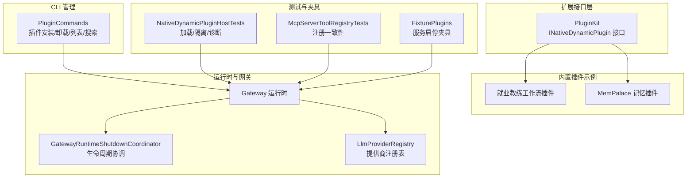
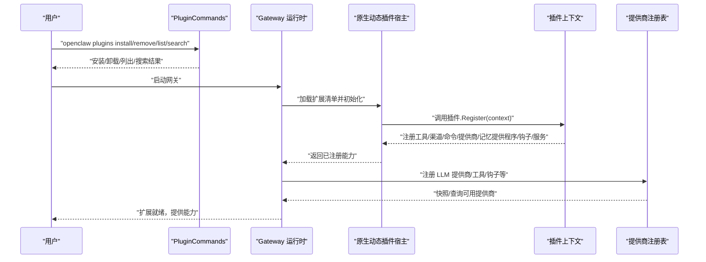
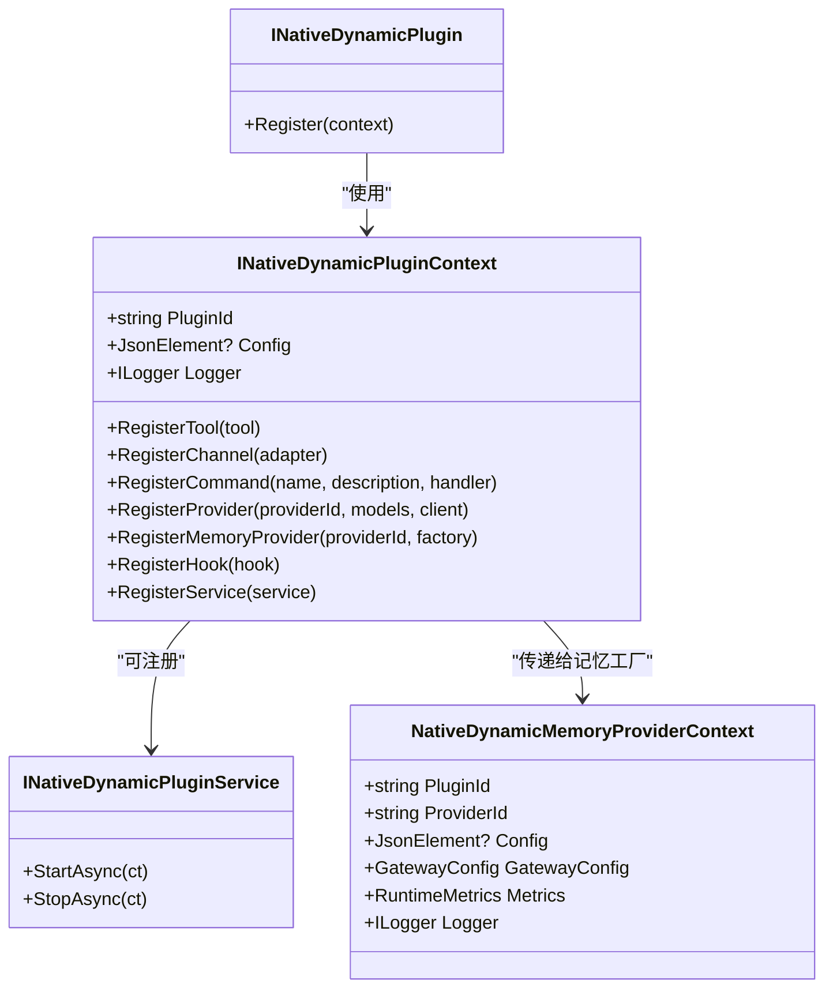
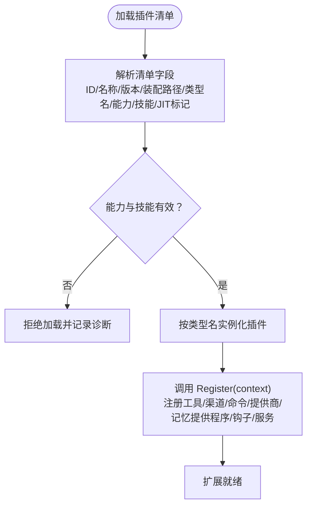
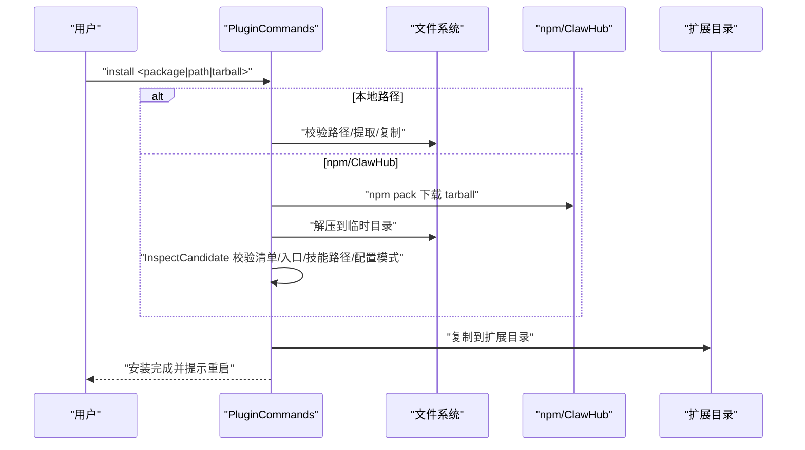
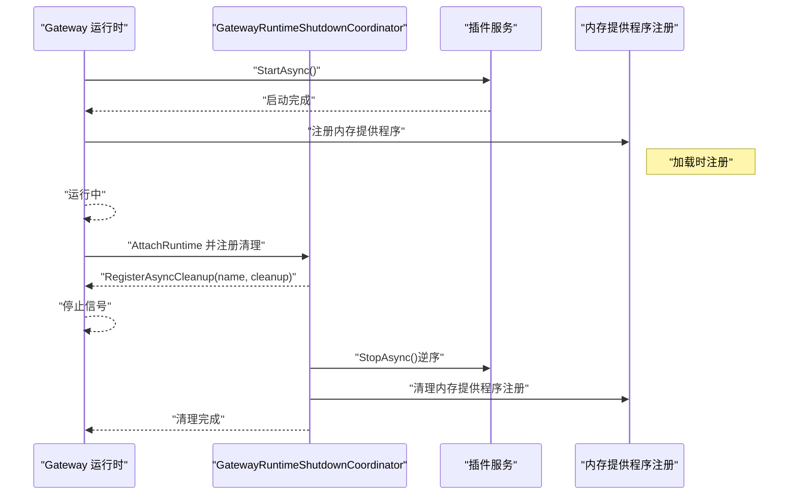
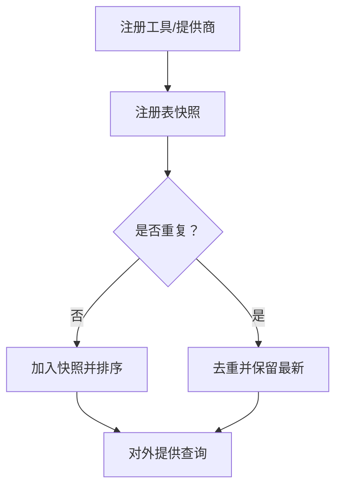
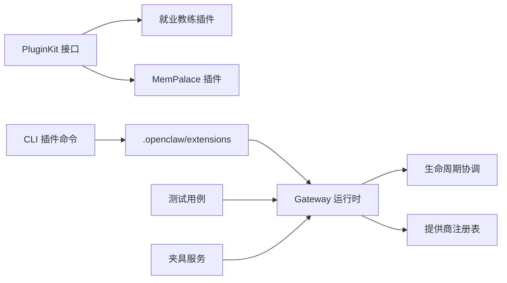

# 扩展点设计

<cite>
**本文引用的文件**
- [INativeDynamicPlugin.cs](file://src/OpenClaw.PluginKit/INativeDynamicPlugin.cs)
- [openclaw.native-plugin.json（就业教练工作流）](file://src/OpenClaw.Plugins.EmploymentCoachWorkflow/openclaw.native-plugin.json)
- [openclaw.native-plugin.json（MemPalace 记忆提供程序）](file://src/OpenClaw.Plugins.Mempalace/openclaw.native-plugin.json)
- [EmploymentCoachWorkflowPlugin.cs](file://src/OpenClaw.Plugins.EmploymentCoachWorkflow/EmploymentCoachWorkflowPlugin.cs)
- [MempalaceMemoryPlugin.cs](file://src/OpenClaw.Plugins.Mempalace/MempalaceMemoryPlugin.cs)
- [PluginCommands.cs](file://src/OpenClaw.Cli/PluginCommands.cs)
- [NativeDynamicPluginHostTests.cs](file://src/OpenClaw.Tests/NativeDynamicPluginHostTests.cs)
- [McpServerToolRegistryTests.cs](file://src/OpenClaw.Tests/McpServerToolRegistryTests.cs)
- [GatewayRuntimeShutdownCoordinator.cs](file://src/OpenClaw.Gateway/Pipeline/GatewayRuntimeShutdownCoordinator.cs)
- [LlmProviderRegistry.cs](file://src/OpenClaw.Gateway/LlmProviderRegistry.cs)
- [FixturePlugins.cs](file://src/OpenClaw.TestPluginFixtures/FixturePlugins.cs)
</cite>

## 目录
1. [简介](#简介)
2. [项目结构](#项目结构)
3. [核心组件](#核心组件)
4. [架构总览](#架构总览)
5. [详细组件分析](#详细组件分析)
6. [依赖关系分析](#依赖关系分析)
7. [性能考量](#性能考量)
8. [故障排查指南](#故障排查指南)
9. [结论](#结论)
10. [附录](#附录)

## 简介
本文件面向 OpenClaw.NET 的扩展点设计，系统化阐述其可扩展性架构与实现机制，覆盖以下主题：
- 插件系统：原生动态插件与 JS/Node 桥接插件两类扩展入口
- 工具接口：通过上下文注册工具、命令、钩子等能力
- 渠道适配器：支持多渠道接入与事件桥接
- 自定义后端：LLM 提供商、执行后端、记忆提供程序等扩展点
- 注册流程、生命周期管理与版本兼容性保障
- 扩展开发最佳实践、接口设计原则与安全考虑
- 开发示例、调试方法与性能优化建议
- 发布、测试与维护的完整工作流程

## 项目结构
OpenClaw.NET 将扩展能力分布在多个工程中，形成清晰的分层与职责划分：
- PluginKit：定义原生动态插件接口与上下文，统一扩展点契约
- Plugins：内置示例插件，演示如何注册工具、记忆提供程序等
- CLI：提供插件安装、卸载、列表与搜索等管理命令
- Gateway：运行时承载扩展加载、生命周期协调与服务注册
- Tests：覆盖插件加载、内存提供程序注册、生命周期清理等关键场景

图表来源
- [INativeDynamicPlugin.cs:11-46](file://src/OpenClaw.PluginKit/INativeDynamicPlugin.cs#L11-L46)
- [EmploymentCoachWorkflowPlugin.cs:5-11](file://src/OpenClaw.Plugins.EmploymentCoachWorkflow/EmploymentCoachWorkflowPlugin.cs#L5-L11)
- [MempalaceMemoryPlugin.cs:6-43](file://src/OpenClaw.Plugins.Mempalace/MempalaceMemoryPlugin.cs#L6-L43)
- [PluginCommands.cs:14-792](file://src/OpenClaw.Cli/PluginCommands.cs#L14-L792)
- [GatewayRuntimeShutdownCoordinator.cs:8-38](file://src/OpenClaw.Gateway/Pipeline/GatewayRuntimeShutdownCoordinator.cs#L8-L38)
- [LlmProviderRegistry.cs:76-90](file://src/OpenClaw.Gateway/LlmProviderRegistry.cs#L76-L90)
- [NativeDynamicPluginHostTests.cs:100-203](file://src/OpenClaw.Tests/NativeDynamicPluginHostTests.cs#L100-L203)
- [McpServerToolRegistryTests.cs:366-405](file://src/OpenClaw.Tests/McpServerToolRegistryTests.cs#L366-L405)
- [FixturePlugins.cs:64-79](file://src/OpenClaw.TestPluginFixtures/FixturePlugins.cs#L64-L79)

章节来源
- [INativeDynamicPlugin.cs:11-46](file://src/OpenClaw.PluginKit/INativeDynamicPlugin.cs#L11-L46)
- [PluginCommands.cs:14-792](file://src/OpenClaw.Cli/PluginCommands.cs#L14-L792)

## 核心组件
- 原生动态插件接口族：定义插件注册上下文与能力边界，支持注册工具、渠道、命令、提供商、记忆提供程序、钩子和服务等
- 插件清单与元数据：通过 JSON 清单声明插件 ID、名称、版本、装配路径、类型名、能力与技能目录等
- CLI 插件管理：封装 npm/ClawHub 安装、本地源安装、卸载、列表与搜索流程，并进行安装前检查与信任评估
- 运行时生命周期：在网关启动/停止阶段协调扩展资源的加载与释放
- 提供商注册表：集中管理 LLM 提供商注册项，支持快照与查询

章节来源
- [INativeDynamicPlugin.cs:11-46](file://src/OpenClaw.PluginKit/INativeDynamicPlugin.cs#L11-L46)
- [openclaw.native-plugin.json（就业教练工作流）:1-11](file://src/OpenClaw.Plugins.EmploymentCoachWorkflow/openclaw.native-plugin.json#L1-L11)
- [openclaw.native-plugin.json（MemPalace 记忆提供程序）:1-10](file://src/OpenClaw.Plugins.Mempalace/openclaw.native-plugin.json#L1-L10)
- [PluginCommands.cs:14-792](file://src/OpenClaw.Cli/PluginCommands.cs#L14-L792)
- [GatewayRuntimeShutdownCoordinator.cs:8-38](file://src/OpenClaw.Gateway/Pipeline/GatewayRuntimeShutdownCoordinator.cs#L8-L38)
- [LlmProviderRegistry.cs:76-90](file://src/OpenClaw.Gateway/LlmProviderRegistry.cs#L76-L90)

## 架构总览
下图展示从 CLI 到运行时的扩展加载与注册主路径，以及生命周期协调与提供商注册的关系。

图表来源
- [PluginCommands.cs:14-792](file://src/OpenClaw.Cli/PluginCommands.cs#L14-L792)
- [INativeDynamicPlugin.cs:11-46](file://src/OpenClaw.PluginKit/INativeDynamicPlugin.cs#L11-L46)
- [LlmProviderRegistry.cs:76-90](file://src/OpenClaw.Gateway/LlmProviderRegistry.cs#L76-L90)

## 详细组件分析

### 原生动态插件接口与上下文
- INativeDynamicPlugin：插件实现需实现 Register 方法，在其中通过上下文注册各类扩展能力
- INativeDynamicPluginContext：提供插件标识、配置、日志、注册工具、渠道、命令、提供商、记忆提供程序、钩子和服务的能力
- INativeDynamicPluginService：可选的服务生命周期接口，支持异步启动/停止
- NativeDynamicMemoryProviderContext：用于记忆提供程序工厂的上下文参数集合

图表来源
- [INativeDynamicPlugin.cs:11-46](file://src/OpenClaw.PluginKit/INativeDynamicPlugin.cs#L11-L46)

章节来源
- [INativeDynamicPlugin.cs:11-46](file://src/OpenClaw.PluginKit/INativeDynamicPlugin.cs#L11-L46)

### 插件清单与示例插件
- 清单字段：插件 ID、名称、版本、装配路径、类型名、能力数组、技能目录、仅 JIT 模式等
- 示例插件：
  - 就业教练工作流插件：空实现，演示最小化注册入口
  - MemPalace 记忆插件：注册记忆提供程序与相关工具，展示上下文工厂模式

图表来源
- [openclaw.native-plugin.json（就业教练工作流）:1-11](file://src/OpenClaw.Plugins.EmploymentCoachWorkflow/openclaw.native-plugin.json#L1-L11)
- [openclaw.native-plugin.json（MemPalace 记忆提供程序）:1-10](file://src/OpenClaw.Plugins.Mempalace/openclaw.native-plugin.json#L1-L10)
- [EmploymentCoachWorkflowPlugin.cs:5-11](file://src/OpenClaw.Plugins.EmploymentCoachWorkflow/EmploymentCoachWorkflowPlugin.cs#L5-L11)
- [MempalaceMemoryPlugin.cs:6-43](file://src/OpenClaw.Plugins.Mempalace/MempalaceMemoryPlugin.cs#L6-L43)

章节来源
- [openclaw.native-plugin.json（就业教练工作流）:1-11](file://src/OpenClaw.Plugins.EmploymentCoachWorkflow/openclaw.native-plugin.json#L1-L11)
- [openclaw.native-plugin.json（MemPalace 记忆提供程序）:1-10](file://src/OpenClaw.Plugins.Mempalace/openclaw.native-plugin.json#L1-L10)
- [EmploymentCoachWorkflowPlugin.cs:5-11](file://src/OpenClaw.Plugins.EmploymentCoachWorkflow/EmploymentCoachWorkflowPlugin.cs#L5-L11)
- [MempalaceMemoryPlugin.cs:6-43](file://src/OpenClaw.Plugins.Mempalace/MempalaceMemoryPlugin.cs#L6-L43)

### CLI 插件管理命令
- 安装：支持从 npm/ClawHub 或本地路径安装；下载 tarball、解压、校验清单、决定目标目录、安装依赖、输出重启提示
- 卸载：删除扩展目录并提示重启
- 列表：扫描扩展目录，打印清单信息、信任级别、声明表面与诊断
- 搜索：查询 npm 包并输出结果
- 安装前检查：入口文件发现、清单与包信息解析、技能路径合法性、配置模式验证、信任级别判定

图表来源
- [PluginCommands.cs:14-792](file://src/OpenClaw.Cli/PluginCommands.cs#L14-L792)

章节来源
- [PluginCommands.cs:14-792](file://src/OpenClaw.Cli/PluginCommands.cs#L14-L792)

### 生命周期管理与版本兼容性
- 生命周期：网关运行时协调扩展的加载与清理；测试覆盖了服务启停写入文件、重复释放无异常、内存提供程序注册清理等
- 版本兼容性：清单声明版本与能力；安装前检查确保技能路径合法、入口文件存在；AOT/JIT 模式限制与诊断
- 资源清理：关闭时按逆序执行异步清理回调，确保资源有序释放

图表来源
- [GatewayRuntimeShutdownCoordinator.cs:8-38](file://src/OpenClaw.Gateway/Pipeline/GatewayRuntimeShutdownCoordinator.cs#L8-L38)
- [NativeDynamicPluginHostTests.cs:125-158](file://src/OpenClaw.Tests/NativeDynamicPluginHostTests.cs#L125-L158)
- [FixturePlugins.cs:64-79](file://src/OpenClaw.TestPluginFixtures/FixturePlugins.cs#L64-L79)

章节来源
- [GatewayRuntimeShutdownCoordinator.cs:8-38](file://src/OpenClaw.Gateway/Pipeline/GatewayRuntimeShutdownCoordinator.cs#L8-L38)
- [NativeDynamicPluginHostTests.cs:125-158](file://src/OpenClaw.Tests/NativeDynamicPluginHostTests.cs#L125-L158)
- [FixturePlugins.cs:64-79](file://src/OpenClaw.TestPluginFixtures/FixturePlugins.cs#L64-L79)

### 提供商注册与工具注册一致性
- LLM 提供商注册表：支持尝试获取、快照导出与去重排序，便于统一管理与查询
- 工具注册一致性：测试验证同一工具多次注册不会导致重复或异常释放

图表来源
- [LlmProviderRegistry.cs:76-90](file://src/OpenClaw.Gateway/LlmProviderRegistry.cs#L76-L90)
- [McpServerToolRegistryTests.cs:366-405](file://src/OpenClaw.Tests/McpServerToolRegistryTests.cs#L366-L405)

章节来源
- [LlmProviderRegistry.cs:76-90](file://src/OpenClaw.Gateway/LlmProviderRegistry.cs#L76-L90)
- [McpServerToolRegistryTests.cs:366-405](file://src/OpenClaw.Tests/McpServerToolRegistryTests.cs#L366-L405)

## 依赖关系分析
- 接口与实现：PluginKit 定义契约，具体插件实现遵循上下文注册规范
- CLI 与运行时：CLI 负责安装与管理，运行时负责加载与生命周期协调
- 测试与夹具：通过夹具模拟服务启停，验证清理逻辑；通过测试用例覆盖加载、隔离与诊断

图表来源
- [INativeDynamicPlugin.cs:11-46](file://src/OpenClaw.PluginKit/INativeDynamicPlugin.cs#L11-L46)
- [PluginCommands.cs:14-792](file://src/OpenClaw.Cli/PluginCommands.cs#L14-L792)
- [GatewayRuntimeShutdownCoordinator.cs:8-38](file://src/OpenClaw.Gateway/Pipeline/GatewayRuntimeShutdownCoordinator.cs#L8-L38)
- [LlmProviderRegistry.cs:76-90](file://src/OpenClaw.Gateway/LlmProviderRegistry.cs#L76-L90)
- [NativeDynamicPluginHostTests.cs:100-203](file://src/OpenClaw.Tests/NativeDynamicPluginHostTests.cs#L100-L203)
- [FixturePlugins.cs:64-79](file://src/OpenClaw.TestPluginFixtures/FixturePlugins.cs#L64-L79)

章节来源
- [INativeDynamicPlugin.cs:11-46](file://src/OpenClaw.PluginKit/INativeDynamicPlugin.cs#L11-L46)
- [PluginCommands.cs:14-792](file://src/OpenClaw.Cli/PluginCommands.cs#L14-L792)
- [GatewayRuntimeShutdownCoordinator.cs:8-38](file://src/OpenClaw.Gateway/Pipeline/GatewayRuntimeShutdownCoordinator.cs#L8-L38)
- [LlmProviderRegistry.cs:76-90](file://src/OpenClaw.Gateway/LlmProviderRegistry.cs#L76-L90)
- [NativeDynamicPluginHostTests.cs:100-203](file://src/OpenClaw.Tests/NativeDynamicPluginHostTests.cs#L100-L203)
- [FixturePlugins.cs:64-79](file://src/OpenClaw.TestPluginFixtures/FixturePlugins.cs#L64-L79)

## 性能考量
- 加载策略：优先使用清单声明能力与技能目录，避免全盘扫描；对入口文件与技能路径进行合法性校验，减少运行期开销
- 注册去重：提供商注册表对重复条目进行去重与排序，降低查询成本
- 清理顺序：逆序执行清理回调，确保资源释放的确定性与高效性
- 日志与指标：通过上下文注入日志与运行时指标，便于定位性能瓶颈

## 故障排查指南
- 安装失败：检查 npm 可用性、tarball 解压与复制过程；查看诊断信息与错误计数
- 入口文件缺失：确认 openclaw.plugin.json 或 package.json 中的 openclaw.extensions 声明正确
- 技能路径越界：确保技能目录解析在插件根目录内
- AOT/JIT 模式限制：若插件声明仅 JIT，且运行于 AOT 模式，将被阻止加载并记录诊断
- 重复释放：测试覆盖了重复释放不抛异常，确保稳定性

章节来源
- [PluginCommands.cs:511-660](file://src/OpenClaw.Cli/PluginCommands.cs#L511-L660)
- [NativeDynamicPluginHostTests.cs:100-203](file://src/OpenClaw.Tests/NativeDynamicPluginHostTests.cs#L100-L203)
- [McpServerToolRegistryTests.cs:366-405](file://src/OpenClaw.Tests/McpServerToolRegistryTests.cs#L366-L405)

## 结论
OpenClaw.NET 的扩展点设计以 PluginKit 为核心契约，结合 CLI 管理与运行时生命周期协调，形成了从安装、加载到注册与清理的完整链路。通过清单声明、安装前检查与信任评估，确保扩展的安全性与兼容性；通过提供商注册表与一致性测试，保障扩展能力的稳定交付。内置示例插件展示了工具、渠道与记忆提供程序的注册范式，为第三方开发者提供了清晰的参考路径。

## 附录
- 扩展开发最佳实践
  - 使用清单明确声明能力与技能目录，避免运行期路径解析失败
  - 在 Register 中一次性完成所有注册，避免遗漏
  - 对外暴露的命令与工具应具备清晰的描述与参数约束
  - 记忆提供程序工厂应支持并发访问与懒加载
- 接口设计原则
  - 上下文最小可用：仅暴露必要的注册方法与只读属性
  - 生命周期明确：服务接口提供 StartAsync/StopAsync
  - 可观测性：通过日志与指标上下文增强可观测性
- 安全考虑
  - 严格限制装配路径与技能目录在插件根目录内
  - AOT/JIT 模式与能力声明匹配，防止运行时错误
  - 安装前信任评估与诊断报告，辅助决策
- 发布、测试与维护工作流程
  - 发布：遵循清单版本号与能力声明；提供最小可运行示例
  - 测试：覆盖加载、注册一致性、生命周期清理与越界路径检测
  - 维护：持续关注兼容性变更与诊断报告，及时修复