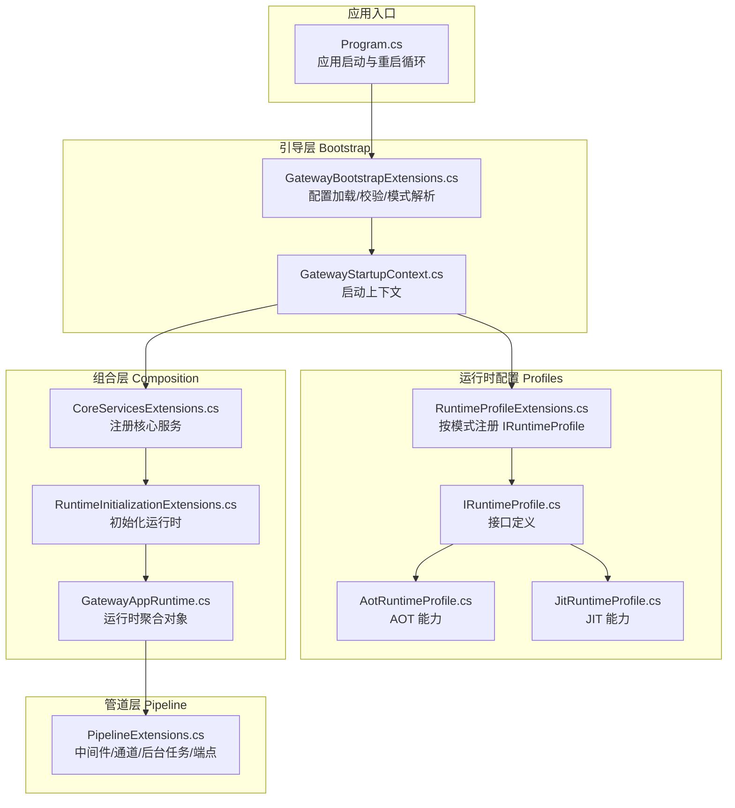
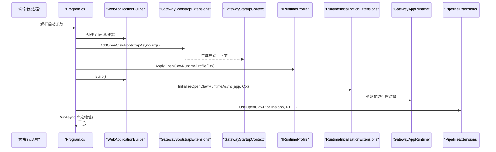
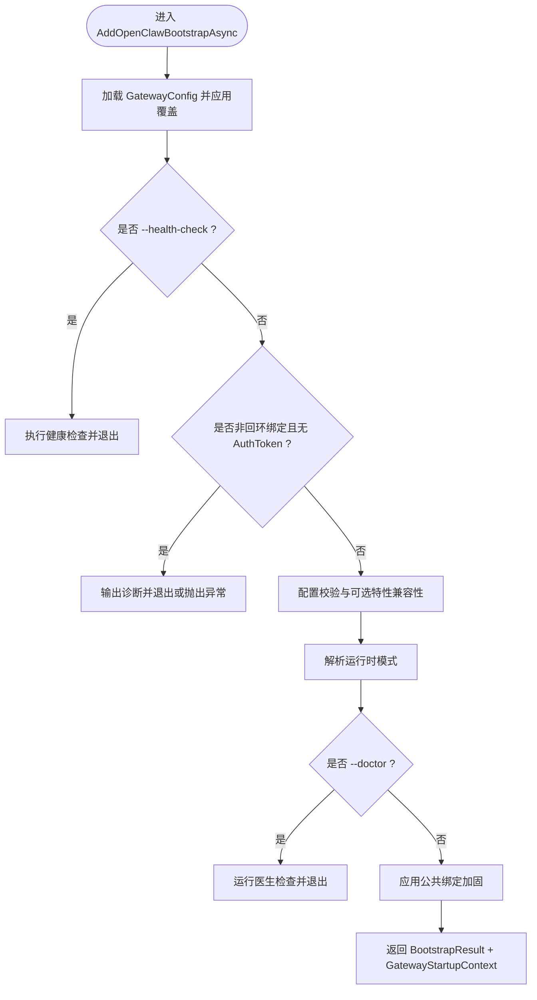
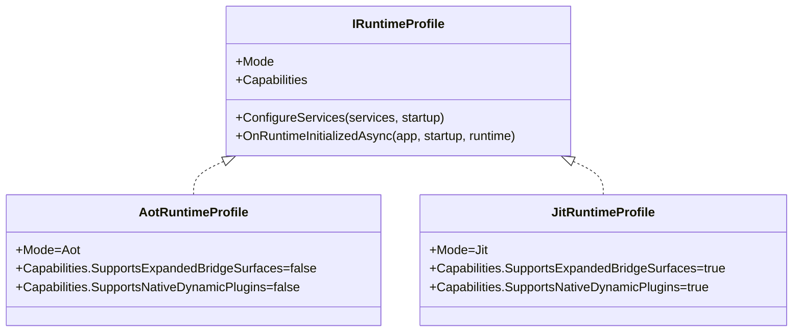
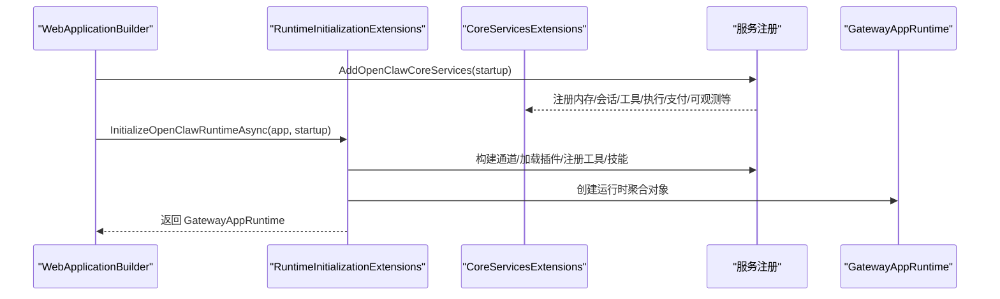
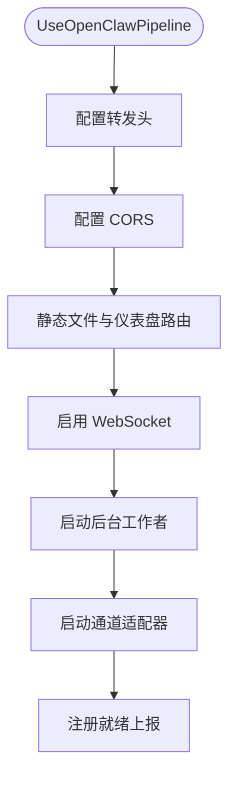
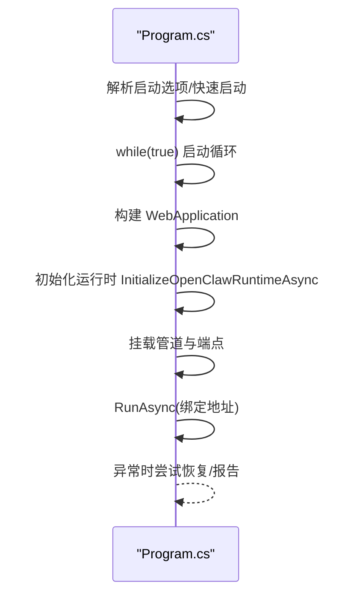
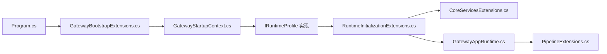

# 架构设计

<cite>
**本文引用的文件**
- [Program.cs](file://src/OpenClaw.Gateway/Program.cs)
- [GatewayBootstrapExtensions.cs](file://src/OpenClaw.Gateway/Bootstrap/GatewayBootstrapExtensions.cs)
- [GatewayStartupContext.cs](file://src/OpenClaw.Gateway/Bootstrap/GatewayStartupContext.cs)
- [RuntimeProfileExtensions.cs](file://src/OpenClaw.Gateway/Profiles/RuntimeProfileExtensions.cs)
- [IRuntimeProfile.cs](file://src/OpenClaw.Gateway/Profiles/IRuntimeProfile.cs)
- [AotRuntimeProfile.cs](file://src/OpenClaw.Gateway/Profiles/AotRuntimeProfile.cs)
- [JitRuntimeProfile.cs](file://src/OpenClaw.Gateway/Profiles/JitRuntimeProfile.cs)
- [RuntimeInitializationExtensions.cs](file://src/OpenClaw.Gateway/Composition/RuntimeInitializationExtensions.cs)
- [CoreServicesExtensions.cs](file://src/OpenClaw.Gateway/Composition/CoreServicesExtensions.cs)
- [PipelineExtensions.cs](file://src/OpenClaw.Gateway/Pipeline/PipelineExtensions.cs)
- [GatewayAppRuntime.cs](file://src/OpenClaw.Gateway/Composition/GatewayAppRuntime.cs)
</cite>

## 目录
1. [引言](#引言)
2. [项目结构](#项目结构)
3. [核心组件](#核心组件)
4. [架构总览](#架构总览)
5. [详细组件分析](#详细组件分析)
6. [依赖分析](#依赖分析)
7. [性能考虑](#性能考虑)
8. [故障排查指南](#故障排查指南)
9. [结论](#结论)
10. [附录](#附录)

## 引言
本架构设计文档面向 OpenClaw.NET 的三层启动架构：Bootstrap（引导）、Composition（组合）、Profiles（运行时配置与能力）与 Pipeline（管道）。文档系统化阐述各阶段职责、组件交互与数据流；解释运行时模式选择机制（AOT vs JIT）及其对功能与安全的影响；梳理组件间依赖、接口设计与扩展点；并给出系统边界图、组件分解图、横切关注点（安全、可观测、灾难恢复）以及技术栈与兼容性要求。

## 项目结构
OpenClaw.Gateway 是应用入口与核心编排模块，采用“三层启动 + 管道”的分层组织方式：
- Bootstrap：解析配置、校验环境、决定运行时模式、生成启动上下文。
- Composition：注册核心服务、构建运行时对象、加载插件与工具、装配消息管道与中间件。
- Profiles：根据运行时模式（AOT/JIT）注入能力与行为。
- Pipeline：在应用生命周期内挂载中间件、通道适配器、后台工作者与端点映射。

**图表来源**
- [Program.cs:14-97](file://src/OpenClaw.Gateway/Program.cs#L14-L97)
- [GatewayBootstrapExtensions.cs:18-135](file://src/OpenClaw.Gateway/Bootstrap/GatewayBootstrapExtensions.cs#L18-L135)
- [GatewayStartupContext.cs:6-14](file://src/OpenClaw.Gateway/Bootstrap/GatewayStartupContext.cs#L6-L14)
- [RuntimeProfileExtensions.cs:8-21](file://src/OpenClaw.Gateway/Profiles/RuntimeProfileExtensions.cs#L8-L21)
- [IRuntimeProfile.cs:11-17](file://src/OpenClaw.Gateway/Profiles/IRuntimeProfile.cs#L11-L17)
- [AotRuntimeProfile.cs:7-21](file://src/OpenClaw.Gateway/Profiles/AotRuntimeProfile.cs#L7-L21)
- [JitRuntimeProfile.cs:7-21](file://src/OpenClaw.Gateway/Profiles/JitRuntimeProfile.cs#L7-L21)
- [CoreServicesExtensions.cs:38-249](file://src/OpenClaw.Gateway/Composition/CoreServicesExtensions.cs#L38-L249)
- [RuntimeInitializationExtensions.cs:35-242](file://src/OpenClaw.Gateway/Composition/RuntimeInitializationExtensions.cs#L35-L242)
- [GatewayAppRuntime.cs:21-63](file://src/OpenClaw.Gateway/Composition/GatewayAppRuntime.cs#L21-L63)
- [PipelineExtensions.cs:18-86](file://src/OpenClaw.Gateway/Pipeline/PipelineExtensions.cs#L18-L86)

**章节来源**
- [Program.cs:14-124](file://src/OpenClaw.Gateway/Program.cs#L14-L124)
- [GatewayBootstrapExtensions.cs:18-421](file://src/OpenClaw.Gateway/Bootstrap/GatewayBootstrapExtensions.cs#L18-L421)
- [GatewayStartupContext.cs:6-14](file://src/OpenClaw.Gateway/Bootstrap/GatewayStartupContext.cs#L6-L14)
- [RuntimeProfileExtensions.cs:8-21](file://src/OpenClaw.Gateway/Profiles/RuntimeProfileExtensions.cs#L8-L21)
- [IRuntimeProfile.cs:11-17](file://src/OpenClaw.Gateway/Profiles/IRuntimeProfile.cs#L11-L17)
- [AotRuntimeProfile.cs:7-21](file://src/OpenClaw.Gateway/Profiles/AotRuntimeProfile.cs#L7-L21)
- [JitRuntimeProfile.cs:7-21](file://src/OpenClaw.Gateway/Profiles/JitRuntimeProfile.cs#L7-L21)
- [CoreServicesExtensions.cs:38-424](file://src/OpenClaw.Gateway/Composition/CoreServicesExtensions.cs#L38-L424)
- [RuntimeInitializationExtensions.cs:35-245](file://src/OpenClaw.Gateway/Composition/RuntimeInitializationExtensions.cs#L35-L245)
- [GatewayAppRuntime.cs:21-63](file://src/OpenClaw.Gateway/Composition/GatewayAppRuntime.cs#L21-L63)
- [PipelineExtensions.cs:18-218](file://src/OpenClaw.Gateway/Pipeline/PipelineExtensions.cs#L18-L218)

## 核心组件
- 应用入口 Program：负责命令行参数解析、快速启动恢复、启动循环与错误恢复、监听器启动。
- 引导扩展 GatewayBootstrapExtensions：配置文件覆盖、健康检查、配置校验、运行时模式解析、启动上下文生成。
- 启动上下文 GatewayStartupContext：承载配置、运行时状态、绑定地址类型、工作区路径等。
- 运行时配置 Profiles：通过 IRuntimeProfile 抽象 AOT/JIT 两种模式的能力差异，并在注册阶段注入。
- 组合扩展 CoreServicesExtensions/RuntimeInitializationExtensions：注册核心服务、初始化运行时、加载插件与工具、装配消息与中间件管道。
- 运行时聚合 GatewayAppRuntime：汇聚 AgentRuntime、消息管道、通道适配器、会话管理、支付、指标、技能观察者等。
- 管道扩展 PipelineExtensions：挂载 CORS/转发头、静态资源与仪表盘、WebSocket、后台工作者、通道适配器、就绪上报。

**章节来源**
- [Program.cs:14-124](file://src/OpenClaw.Gateway/Program.cs#L14-L124)
- [GatewayBootstrapExtensions.cs:18-135](file://src/OpenClaw.Gateway/Bootstrap/GatewayBootstrapExtensions.cs#L18-L135)
- [GatewayStartupContext.cs:6-14](file://src/OpenClaw.Gateway/Bootstrap/GatewayStartupContext.cs#L6-L14)
- [RuntimeProfileExtensions.cs:8-21](file://src/OpenClaw.Gateway/Profiles/RuntimeProfileExtensions.cs#L8-L21)
- [IRuntimeProfile.cs:11-17](file://src/OpenClaw.Gateway/Profiles/IRuntimeProfile.cs#L11-L17)
- [AotRuntimeProfile.cs:7-21](file://src/OpenClaw.Gateway/Profiles/AotRuntimeProfile.cs#L7-L21)
- [JitRuntimeProfile.cs:7-21](file://src/OpenClaw.Gateway/Profiles/JitRuntimeProfile.cs#L7-L21)
- [CoreServicesExtensions.cs:38-249](file://src/OpenClaw.Gateway/Composition/CoreServicesExtensions.cs#L38-L249)
- [RuntimeInitializationExtensions.cs:35-242](file://src/OpenClaw.Gateway/Composition/RuntimeInitializationExtensions.cs#L35-L242)
- [GatewayAppRuntime.cs:21-63](file://src/OpenClaw.Gateway/Composition/GatewayAppRuntime.cs#L21-L63)
- [PipelineExtensions.cs:18-86](file://src/OpenClaw.Gateway/Pipeline/PipelineExtensions.cs#L18-L86)

## 架构总览
三层启动与管道的整体流程如下：

**图表来源**
- [Program.cs:50-97](file://src/OpenClaw.Gateway/Program.cs#L50-L97)
- [GatewayBootstrapExtensions.cs:18-135](file://src/OpenClaw.Gateway/Bootstrap/GatewayBootstrapExtensions.cs#L18-L135)
- [RuntimeProfileExtensions.cs:8-21](file://src/OpenClaw.Gateway/Profiles/RuntimeProfileExtensions.cs#L8-L21)
- [RuntimeInitializationExtensions.cs:35-242](file://src/OpenClaw.Gateway/Composition/RuntimeInitializationExtensions.cs#L35-L242)
- [PipelineExtensions.cs:18-86](file://src/OpenClaw.Gateway/Pipeline/PipelineExtensions.cs#L18-L86)

## 详细组件分析

### 引导层（Bootstrap）
职责
- 配置文件与环境变量合并、工具链覆盖、插件条目配置注入。
- 健康检查模式、医生模式、非回环绑定安全加固。
- 运行时模式解析（请求值/有效值/动态代码支持），生成启动上下文。

关键流程
- 配置加载与诊断输出。
- 安全约束（非回环绑定需鉴权令牌）。
- 运行时模式解析与医生模式处理。
- 返回 BootstrapResult，驱动后续组合与初始化。

**图表来源**
- [GatewayBootstrapExtensions.cs:18-135](file://src/OpenClaw.Gateway/Bootstrap/GatewayBootstrapExtensions.cs#L18-L135)
- [GatewayBootstrapExtensions.cs:402-419](file://src/OpenClaw.Gateway/Bootstrap/GatewayBootstrapExtensions.cs#L402-L419)

**章节来源**
- [GatewayBootstrapExtensions.cs:18-135](file://src/OpenClaw.Gateway/Bootstrap/GatewayBootstrapExtensions.cs#L18-L135)
- [GatewayBootstrapExtensions.cs:402-419](file://src/OpenClaw.Gateway/Bootstrap/GatewayBootstrapExtensions.cs#L402-L419)
- [GatewayStartupContext.cs:6-14](file://src/OpenClaw.Gateway/Bootstrap/GatewayStartupContext.cs#L6-L14)

### 运行时配置与模式（Profiles）
职责
- 通过 IRuntimeProfile 抽象 AOT/JIT 两种模式，定义能力集合（桥接面扩展、原生动态插件支持）。
- 在注册阶段按有效模式注入对应实现。

要点
- AOT 模式：不支持扩展桥接面与原生动态插件。
- JIT 模式：支持扩展桥接面与原生动态插件。
- 通过 ApplyOpenClawRuntimeProfile 注册单例并调用其 ConfigureServices/OnRuntimeInitializedAsync。

**图表来源**
- [IRuntimeProfile.cs:11-17](file://src/OpenClaw.Gateway/Profiles/IRuntimeProfile.cs#L11-L17)
- [AotRuntimeProfile.cs:7-21](file://src/OpenClaw.Gateway/Profiles/AotRuntimeProfile.cs#L7-L21)
- [JitRuntimeProfile.cs:7-21](file://src/OpenClaw.Gateway/Profiles/JitRuntimeProfile.cs#L7-L21)
- [RuntimeProfileExtensions.cs:8-21](file://src/OpenClaw.Gateway/Profiles/RuntimeProfileExtensions.cs#L8-L21)

**章节来源**
- [IRuntimeProfile.cs:7-17](file://src/OpenClaw.Gateway/Profiles/IRuntimeProfile.cs#L7-L17)
- [AotRuntimeProfile.cs:7-21](file://src/OpenClaw.Gateway/Profiles/AotRuntimeProfile.cs#L7-L21)
- [JitRuntimeProfile.cs:7-21](file://src/OpenClaw.Gateway/Profiles/JitRuntimeProfile.cs#L7-L21)
- [RuntimeProfileExtensions.cs:8-21](file://src/OpenClaw.Gateway/Profiles/RuntimeProfileExtensions.cs#L8-L21)

### 组合层（Composition）
职责
- 注册核心服务（内存、会话、工具、执行后端、支付、可观测、自动化、计划-执行-验证等）。
- 初始化运行时：构建通道组合、加载插件与工具、创建 AgentRuntime、装配中间件与消息管道、启动技能观察者与定时任务。
- 与 Profiles 协作，在运行时初始化后执行模式特定钩子。

关键点
- 内存存储支持 file/sqlite/mempalace（动态原生），mempalace 需启用 JIT 动态原生能力。
- 工具与技能加载、钩子与审批策略、事件与审计日志、多提供商注册与烟雾探测。
- 与外部集成（Tailscale、mDNS）在运行时启动。

**图表来源**
- [CoreServicesExtensions.cs:38-249](file://src/OpenClaw.Gateway/Composition/CoreServicesExtensions.cs#L38-L249)
- [RuntimeInitializationExtensions.cs:35-242](file://src/OpenClaw.Gateway/Composition/RuntimeInitializationExtensions.cs#L35-L242)
- [GatewayAppRuntime.cs:21-63](file://src/OpenClaw.Gateway/Composition/GatewayAppRuntime.cs#L21-L63)

**章节来源**
- [CoreServicesExtensions.cs:38-424](file://src/OpenClaw.Gateway/Composition/CoreServicesExtensions.cs#L38-L424)
- [RuntimeInitializationExtensions.cs:35-245](file://src/OpenClaw.Gateway/Composition/RuntimeInitializationExtensions.cs#L35-L245)
- [GatewayAppRuntime.cs:21-63](file://src/OpenClaw.Gateway/Composition/GatewayAppRuntime.cs#L21-L63)

### 管道层（Pipeline）
职责
- 中间件：转发头、CORS、静态资源与仪表盘路由。
- 运行时：启动后台工作者（会话、通道、定时任务、心跳、学习、自动化、治理等）、启动通道适配器。
- 端点：映射 OpenAPI、网关端点、MCP、A2A。

**图表来源**
- [PipelineExtensions.cs:18-86](file://src/OpenClaw.Gateway/Pipeline/PipelineExtensions.cs#L18-L86)

**章节来源**
- [PipelineExtensions.cs:18-218](file://src/OpenClaw.Gateway/Pipeline/PipelineExtensions.cs#L18-L218)

### 应用入口（Program）
职责
- 参数解析与快速启动恢复。
- 启动循环：构建、初始化运行时、挂载管道与端点、启动监听器。
- 启动失败时的交互式恢复与失败报告。

**图表来源**
- [Program.cs:14-124](file://src/OpenClaw.Gateway/Program.cs#L14-L124)

**章节来源**
- [Program.cs:14-124](file://src/OpenClaw.Gateway/Program.cs#L14-L124)

## 依赖分析
- 组件耦合
  - Program 依赖 Bootstrap 生成启动上下文，再由 Composition 初始化运行时，最后由 Pipeline 挂载中间件与端点。
  - Profiles 通过运行时模式影响 Composition 的能力注入与运行时行为。
- 外部依赖
  - 配置系统（IConfiguration）、DI 容器（IServiceCollection/ServiceProvider）、HTTP 客户端工厂、JSON 上下文链。
- 循环依赖
  - 未见直接循环依赖；运行时对象 GatewayAppRuntime 作为聚合容器，避免了跨层直接互相引用。

**图表来源**
- [Program.cs:50-97](file://src/OpenClaw.Gateway/Program.cs#L50-L97)
- [GatewayBootstrapExtensions.cs:18-135](file://src/OpenClaw.Gateway/Bootstrap/GatewayBootstrapExtensions.cs#L18-L135)
- [RuntimeProfileExtensions.cs:8-21](file://src/OpenClaw.Gateway/Profiles/RuntimeProfileExtensions.cs#L8-L21)
- [RuntimeInitializationExtensions.cs:35-242](file://src/OpenClaw.Gateway/Composition/RuntimeInitializationExtensions.cs#L35-L242)
- [CoreServicesExtensions.cs:38-249](file://src/OpenClaw.Gateway/Composition/CoreServicesExtensions.cs#L38-L249)
- [GatewayAppRuntime.cs:21-63](file://src/OpenClaw.Gateway/Composition/GatewayAppRuntime.cs#L21-L63)
- [PipelineExtensions.cs:18-86](file://src/OpenClaw.Gateway/Pipeline/PipelineExtensions.cs#L18-L86)

**章节来源**
- [Program.cs:50-97](file://src/OpenClaw.Gateway/Program.cs#L50-L97)
- [GatewayBootstrapExtensions.cs:18-135](file://src/OpenClaw.Gateway/Bootstrap/GatewayBootstrapExtensions.cs#L18-L135)
- [RuntimeProfileExtensions.cs:8-21](file://src/OpenClaw.Gateway/Profiles/RuntimeProfileExtensions.cs#L8-L21)
- [RuntimeInitializationExtensions.cs:35-242](file://src/OpenClaw.Gateway/Composition/RuntimeInitializationExtensions.cs#L35-L242)
- [CoreServicesExtensions.cs:38-249](file://src/OpenClaw.Gateway/Composition/CoreServicesExtensions.cs#L38-L249)
- [GatewayAppRuntime.cs:21-63](file://src/OpenClaw.Gateway/Composition/GatewayAppRuntime.cs#L21-L63)
- [PipelineExtensions.cs:18-86](file://src/OpenClaw.Gateway/Pipeline/PipelineExtensions.cs#L18-L86)

## 性能考虑
- 启动阶段
  - 配置加载与校验应尽量减少磁盘访问与网络探测；健康检查与医生模式用于快速定位问题，避免不必要的全量初始化。
- 运行时
  - 通道适配器与后台工作者数量与 CPU 核数相关，限制最大并发以避免资源争用。
  - 消息管道使用写入器队列，必要时进行背压与拥塞控制。
- 执行后端
  - 工具执行路由与进程服务应结合超时与重试策略，避免阻塞主消息线程。
- 观测与指标
  - 使用运行时指标与使用追踪，定期采样关键路径，避免高开销日志影响吞吐。

## 故障排查指南
- 启动失败恢复
  - 程序在未标记“已启动”前捕获异常，尝试交互式恢复（快速启动、建议 Quickstart），若无法处理则输出失败报告并退出。
- 健康检查
  - 支持 --health-check 模式，短超时请求本地健康端点，便于反向代理与编排系统探测。
- 医生模式
  - 支持 --doctor 模式，集中执行多项诊断并返回状态码，便于 CI/CD 自动化检测。
- 非回环绑定安全
  - 非回环绑定必须设置鉴权令牌，否则在医生模式下会明确提示并退出。

**章节来源**
- [Program.cs:99-122](file://src/OpenClaw.Gateway/Program.cs#L99-L122)
- [GatewayBootstrapExtensions.cs:38-84](file://src/OpenClaw.Gateway/Bootstrap/GatewayBootstrapExtensions.cs#L38-L84)
- [GatewayBootstrapExtensions.cs:402-419](file://src/OpenClaw.Gateway/Bootstrap/GatewayBootstrapExtensions.cs#L402-L419)

## 结论
OpenClaw.NET 的三层启动架构清晰地分离了“配置与模式解析”、“服务注册与运行时装配”、“管道与端点挂载”。通过 Profiles 将 AOT/JIT 的能力差异显式化，使系统在不同部署形态下具备一致的启动与运行体验。配合 Pipeline 的中间件与后台工作者，系统实现了从配置到监听器的完整生命周期管理。横切关注点（安全、可观测、灾难恢复）贯穿各层，确保生产可用性与可维护性。

## 附录

### 系统边界与组件分解
- 边界
  - 外部：客户端（浏览器/SDK/CLI）、渠道适配器（邮件/WhatsApp/Teams 等）、LLM 提供商、支付提供商、外部 CLI。
  - 内部：Gateway（引导/组合/管道）、AgentRuntime（MAF）、内存与会话存储、工具与技能生态、支付与合规。
- 组件分解
  - 引导层：配置加载、模式解析、安全加固、启动上下文。
  - 组合层：核心服务注册、运行时初始化、插件与工具加载、消息与中间件管道。
  - 管道层：中间件、静态资源、后台工作者、通道适配器、端点映射。

### 运行时模式选择与影响
- AOT 模式
  - 不支持扩展桥接面与原生动态插件；适合严格沙箱与最小化部署。
- JIT 模式
  - 支持扩展桥接面与原生动态插件；适合需要动态能力与桥接生态的场景。
- 选择依据
  - 生产安全优先选 AOT；需要动态能力与桥接生态选 JIT。

### 横切关注点
- 安全
  - 非回环绑定鉴权、CORS 白名单、转发头信任、URL 安全校验、输入净化、白名单策略。
- 监控
  - 运行时指标、工具使用追踪、提供方用量追踪、启动通知收集、健康检查。
- 灾难恢复
  - 启动失败恢复（快速启动）、失败报告、优雅关闭协调、异步清理（Tailscale、mDNS、MCP 注册表）。

### 技术栈与兼容性
- 框架与运行时
  - ASP.NET Core（WebApplicationBuilder/Slim）、Microsoft.Extensions.*、JSON System.Text.Json。
- 配置与序列化
  - IConfiguration、JsonContext 链（Gateway/Core/A2A）。
- 第三方与生态
  - LLM 提供商注册与烟雾探测、支付提供商（Stripe Link）、外部 CLI 连接器。
- 兼容性
  - 运行时模式与动态原生能力的编译开关（例如 OpenSandbox 开关）。