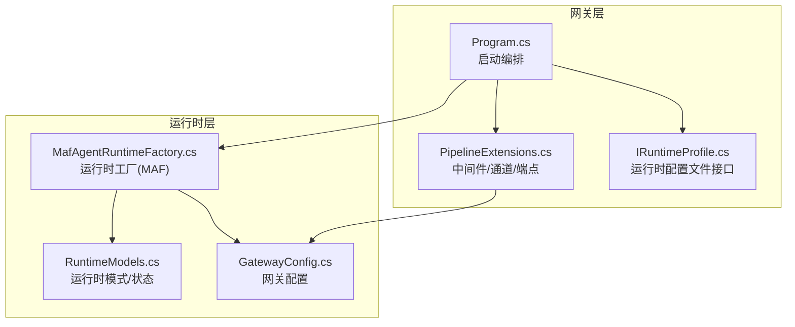
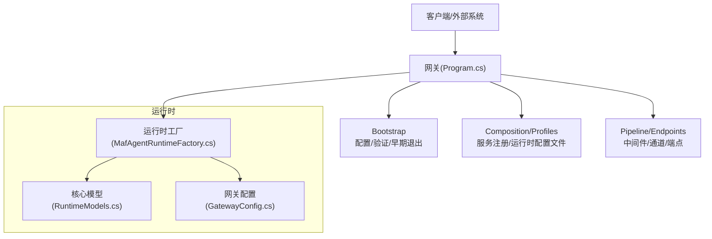
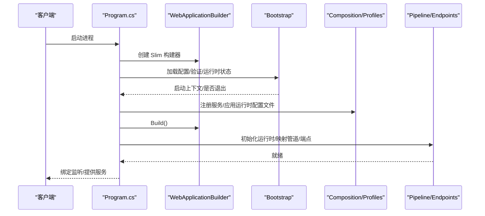
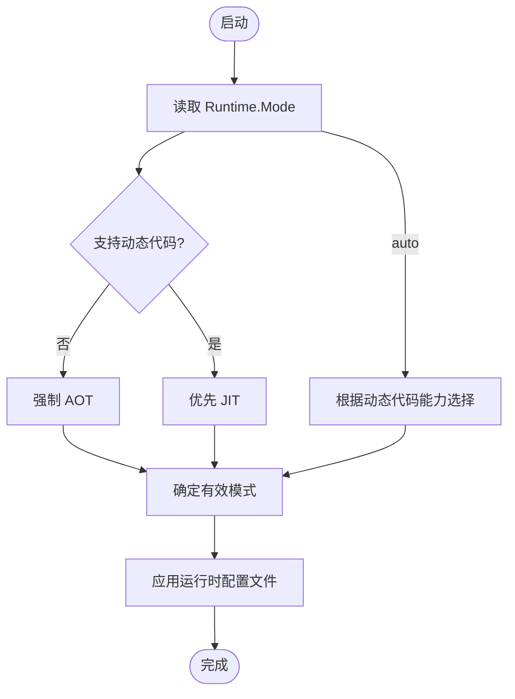
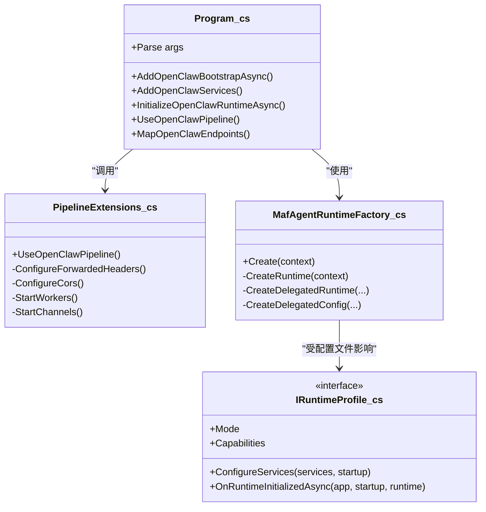
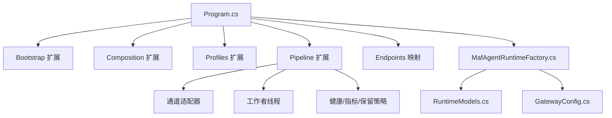

# 架构设计

<cite>
**本文引用的文件**
- [README.md](file://README.md)
- [QUICKSTART.md](file://QUICKSTART.md)
- [architecture-startup-refactor.md](file://docs/architecture-startup-refactor.md)
- [Program.cs](file://src/OpenClaw.Gateway/Program.cs)
- [PipelineExtensions.cs](file://src/OpenClaw.Gateway/Pipeline/PipelineExtensions.cs)
- [IRuntimeProfile.cs](file://src/OpenClaw.Gateway/Profiles/IRuntimeProfile.cs)
- [MafAgentRuntimeFactory.cs](file://src/OpenClaw.Agent/MafAgentRuntimeFactory.cs)
- [RuntimeModels.cs](file://src/OpenClaw.Core/Models/RuntimeModels.cs)
- [GatewayConfig.cs](file://src/OpenClaw.Core/Models/GatewayConfig.cs)
</cite>

## 目录
1. [引言](#引言)
2. [项目结构](#项目结构)
3. [核心组件](#核心组件)
4. [架构总览](#架构总览)
5. [详细组件分析](#详细组件分析)
6. [依赖关系分析](#依赖关系分析)
7. [性能考量](#性能考量)
8. [故障排查指南](#故障排查指南)
9. [结论](#结论)
10. [附录](#附录)

## 引言
本架构文档面向 OpenClaw.NET 的设计与实现，聚焦于高层设计、架构模式与系统边界；系统采用“网关 + 运行时”的双层模型：网关负责接入面（HTTP/WebSocket/通道/端点）、安全与可观测性；运行时负责推理、工具执行、记忆与技能加载。系统支持两种运行模式：AOT（裁剪友好、低内存占用）与 JIT（动态能力更广），并通过可插拔的“运行时配置文件”在不同模式下启用不同的能力集。

启动流程分为三个阶段：Bootstrap（配置加载与早期退出）、Composition/Profiles（服务注册与运行时配置文件应用）、Pipeline/Endpoints（中间件、通道与端点映射）。运行时模型中，MAF（Microsoft Agent Framework）作为可选编排后端，但默认仍以原生运行时为主。

## 项目结构
- 网关入口位于 src/OpenClaw.Gateway/Program.cs，统一编排启动、服务注册、运行时初始化、管道与端点映射。
- 启动分层文档位于 docs/architecture-startup-refactor.md，明确各层职责与迁移路径。
- 运行时配置模型位于 src/OpenClaw.Core/Models，包含运行时模式、网关配置等。
- 运行时工厂（含 MAF 支持）位于 src/OpenClaw.Agent/MafAgentRuntimeFactory.cs。
- 管道与中间件位于 src/OpenClaw.Gateway/Pipeline/PipelineExtensions.cs。
- 运行时配置文件接口位于 src/OpenClaw.Gateway/Profiles/IRuntimeProfile.cs。

**图表来源**
- [Program.cs:1-124](file://src/OpenClaw.Gateway/Program.cs#L1-L124)
- [PipelineExtensions.cs:1-218](file://src/OpenClaw.Gateway/Pipeline/PipelineExtensions.cs#L1-L218)
- [IRuntimeProfile.cs:1-18](file://src/OpenClaw.Gateway/Profiles/IRuntimeProfile.cs#L1-L18)
- [MafAgentRuntimeFactory.cs:1-166](file://src/OpenClaw.Agent/MafAgentRuntimeFactory.cs#L1-L166)
- [RuntimeModels.cs:1-69](file://src/OpenClaw.Core/Models/RuntimeModels.cs#L1-L69)
- [GatewayConfig.cs:1-800](file://src/OpenClaw.Core/Models/GatewayConfig.cs#L1-L800)

**章节来源**
- [README.md:145-196](file://README.md#L145-L196)
- [architecture-startup-refactor.md:1-57](file://docs/architecture-startup-refactor.md#L1-L57)
- [Program.cs:1-124](file://src/OpenClaw.Gateway/Program.cs#L1-L124)

## 核心组件
- 网关启动器（Program.cs）
  - 负责解析启动参数、环境、快速启动恢复、构建 WebApplicationBuilder、注册服务、初始化运行时、映射管道与端点，并监听绑定地址。
- 运行时配置模型（RuntimeModels.cs）
  - 定义运行时模式枚举（AOT/JIT）、运行时配置（Mode/Orchestrator）与运行时状态（EffectiveMode/DynamicCodeSupported）。
- 网关配置（GatewayConfig.cs）
  - 覆盖 LLM、内存、安全、工具、通道、插件、技能、支付、Webhook 等全量配置项，是运行时与网关行为的权威来源。
- 运行时配置文件接口（IRuntimeProfile.cs）
  - 描述按有效运行时模式选择的能力集（桥接扩展表面、原生动态插件支持），以及服务注册与运行时初始化钩子。
- 运行时工厂（MafAgentRuntimeFactory.cs）
  - 在 MAF 可用的构建产物中，提供基于 MAF 的代理运行时工厂，支持委托工具与配置派生。

**章节来源**
- [Program.cs:14-98](file://src/OpenClaw.Gateway/Program.cs#L14-L98)
- [RuntimeModels.cs:5-69](file://src/OpenClaw.Core/Models/RuntimeModels.cs#L5-L69)
- [GatewayConfig.cs:9-800](file://src/OpenClaw.Core/Models/GatewayConfig.cs#L9-L800)
- [IRuntimeProfile.cs:7-18](file://src/OpenClaw.Gateway/Profiles/IRuntimeProfile.cs#L7-L18)
- [MafAgentRuntimeFactory.cs:9-166](file://src/OpenClaw.Agent/MafAgentRuntimeFactory.cs#L9-L166)

## 架构总览
系统采用“三层启动 + 双层运行”的架构：
- 三层启动：Bootstrap（配置/验证/早期退出）、Composition/Profiles（服务注册/运行时配置文件）、Pipeline/Endpoints（中间件/通道/端点）。
- 双层运行：网关负责接入与治理，运行时负责推理与执行；运行时支持 AOT/JIT 两种模式，MAF 作为可选编排后端。

**图表来源**
- [README.md:145-196](file://README.md#L145-L196)
- [architecture-startup-refactor.md:3-24](file://docs/architecture-startup-refactor.md#L3-L24)
- [Program.cs:47-98](file://src/OpenClaw.Gateway/Program.cs#L47-L98)
- [MafAgentRuntimeFactory.cs:31-164](file://src/OpenClaw.Agent/MafAgentRuntimeFactory.cs#L31-L164)
- [RuntimeModels.cs:20-59](file://src/OpenClaw.Core/Models/RuntimeModels.cs#L20-L59)
- [GatewayConfig.cs:9-800](file://src/OpenClaw.Core/Models/GatewayConfig.cs#L9-L800)

## 详细组件分析

### 启动流程（Bootstrap/Composition/Profiles/Pipeline）
- Bootstrap
  - 解析启动参数、加载配置、应用环境覆盖与密钥解析、计算运行时状态（AOT/JIT）、处理 --doctor/--health-check 等早期退出场景、非回环绑定的安全加固。
- Composition/Profiles
  - 分组注册核心/通道/工具/后端/安全/MCP/A2A 等服务；根据已解析的有效运行时模式应用配置文件，决定桥接扩展表面与动态插件支持。
- Pipeline/Endpoints
  - 配置转发头/CORS、静态资源、WebSocket、工作线程与通道适配器启动、健康/指标/保留策略等端点映射。

**图表来源**
- [architecture-startup-refactor.md:5-24](file://docs/architecture-startup-refactor.md#L5-L24)
- [Program.cs:47-98](file://src/OpenClaw.Gateway/Program.cs#L47-L98)

**章节来源**
- [architecture-startup-refactor.md:1-57](file://docs/architecture-startup-refactor.md#L1-L57)
- [Program.cs:47-98](file://src/OpenClaw.Gateway/Program.cs#L47-L98)

### 运行时模型（AOT/JIT）
- 模式选择
  - 通过 GatewayConfig.Runtime.Mode 决定（auto/aot/jit），结合运行时动态代码能力自动调整；当请求 jit 但不支持动态代码时抛出异常。
- 行为差异
  - aot：保持裁剪友好与低内存占用，适合主流部署；jit：支持更广的桥接表面与原生动态插件。
- 编排后端
  - 默认 native；MAF 仅在 MAF-enabled 构建中可用，且需显式配置。

**图表来源**
- [RuntimeModels.cs:29-59](file://src/OpenClaw.Core/Models/RuntimeModels.cs#L29-L59)
- [GatewayConfig.cs:11-18](file://src/OpenClaw.Core/Models/GatewayConfig.cs#L11-L18)

**章节来源**
- [README.md:58-71](file://README.md#L58-L71)
- [RuntimeModels.cs:29-59](file://src/OpenClaw.Core/Models/RuntimeModels.cs#L29-L59)
- [GatewayConfig.cs:11-18](file://src/OpenClaw.Core/Models/GatewayConfig.cs#L11-L18)

### 组件交互关系
- 网关入口（Program.cs）协调三阶段启动与运行时初始化。
- 管道扩展（PipelineExtensions.cs）负责中间件、通道与工作者启动。
- 运行时工厂（MafAgentRuntimeFactory.cs）在 MAF 构建中提供运行时实例，并支持委托工具与配置派生。
- 运行时配置文件接口（IRuntimeProfile.cs）定义按模式启用的能力集与生命周期钩子。

**图表来源**
- [Program.cs:47-98](file://src/OpenClaw.Gateway/Program.cs#L47-L98)
- [PipelineExtensions.cs:16-86](file://src/OpenClaw.Gateway/Pipeline/PipelineExtensions.cs#L16-L86)
- [MafAgentRuntimeFactory.cs:9-166](file://src/OpenClaw.Agent/MafAgentRuntimeFactory.cs#L9-L166)
- [IRuntimeProfile.cs:11-17](file://src/OpenClaw.Gateway/Profiles/IRuntimeProfile.cs#L11-L17)

**章节来源**
- [Program.cs:47-98](file://src/OpenClaw.Gateway/Program.cs#L47-L98)
- [PipelineExtensions.cs:16-86](file://src/OpenClaw.Gateway/Pipeline/PipelineExtensions.cs#L16-L86)
- [MafAgentRuntimeFactory.cs:9-166](file://src/OpenClaw.Agent/MafAgentRuntimeFactory.cs#L9-L166)
- [IRuntimeProfile.cs:11-17](file://src/OpenClaw.Gateway/Profiles/IRuntimeProfile.cs#L11-L17)

### 运行时配置文件（Profiles）
- 能力集
  - SupportsExpandedBridgeSurfaces：是否启用扩展桥接表面（如 registerChannel/registerCommand/registerProvider/api.on）。
  - SupportsNativeDynamicPlugins：是否允许原生动态插件。
- 生命周期
  - ConfigureServices：在 builder.Build 前后注册服务。
  - OnRuntimeInitializedAsync：在运行时构建完成后进行初始化。

**章节来源**
- [IRuntimeProfile.cs:7-17](file://src/OpenClaw.Gateway/Profiles/IRuntimeProfile.cs#L7-L17)

### 管道与中间件（Pipeline/Endpoints）
- 中间件
  - 转发头、CORS、静态文件、WebSocket、速率限制、会话管理等。
- 通道与工作者
  - 启动通道适配器、工作者线程、心跳、审批、学习服务等。
- 端点映射
  - 诊断、OpenAI 兼容、UI/控制、WebSocket、Webhook 等路由。

**章节来源**
- [PipelineExtensions.cs:16-218](file://src/OpenClaw.Gateway/Pipeline/PipelineExtensions.cs#L16-L218)

## 依赖关系分析
- 启动阶段依赖
  - Program.cs 依赖 Bootstrap/Composition/Profiles/Pipeline/Endpoints 的扩展方法与运行时工厂。
- 运行时依赖
  - 运行时工厂依赖运行时模式与网关配置；网关配置贯穿所有模块。
- 外部集成
  - 安全（认证/授权/跨域/转发头）、通道（Telegram/Twilio/WhatsApp/Teams/Slack/Discord/Signal/飞书/钉钉/企业微信）、支付（Stripe Link/Mock）、本地推理（Ollama/llama.cpp）等。

**图表来源**
- [Program.cs:47-98](file://src/OpenClaw.Gateway/Program.cs#L47-L98)
- [PipelineExtensions.cs:16-218](file://src/OpenClaw.Gateway/Pipeline/PipelineExtensions.cs#L16-L218)
- [MafAgentRuntimeFactory.cs:31-164](file://src/OpenClaw.Agent/MafAgentRuntimeFactory.cs#L31-L164)
- [RuntimeModels.cs:20-59](file://src/OpenClaw.Core/Models/RuntimeModels.cs#L20-L59)
- [GatewayConfig.cs:9-800](file://src/OpenClaw.Core/Models/GatewayConfig.cs#L9-L800)

**章节来源**
- [README.md:31-40](file://README.md#L31-L40)
- [GatewayConfig.cs:534-800](file://src/OpenClaw.Core/Models/GatewayConfig.cs#L534-L800)

## 性能考量
- AOT 模式
  - 更高的裁剪友好度与更低的内存占用，适合大规模容器化与边缘部署。
- JIT 模式
  - 动态能力更强，适合需要扩展桥接表面与原生动态插件的场景。
- 并行工具执行
  - 工具配置支持并行执行，提升多工具场景吞吐。
- 会话与速率限制
  - 通过会话级令牌预算、消息速率限制与连接数限制控制资源消耗。
- 本地推理与缓存
  - 本地推理配置与提示缓存可降低外部依赖开销。

**章节来源**
- [README.md:58-71](file://README.md#L58-L71)
- [GatewayConfig.cs:412-457](file://src/OpenClaw.Core/Models/GatewayConfig.cs#L412-L457)
- [GatewayConfig.cs:121-148](file://src/OpenClaw.Core/Models/GatewayConfig.cs#L121-L148)

## 故障排查指南
- 启动失败与快速恢复
  - Program.cs 提供交互式启动恢复与失败报告，支持快速启动建议与诊断输出。
- 运行时模式错误
  - 当请求 JIT 但不支持动态代码时抛出异常；检查构建产物与运行时能力。
- 公网绑定安全
  - 非回环绑定需设置认证令牌与安全策略；违反严格公共绑定配置将拒绝启动。
- 观测性与诊断
  - 使用 /health、/metrics、/doctor 等端点进行健康检查与诊断。

**章节来源**
- [Program.cs:99-123](file://src/OpenClaw.Gateway/Program.cs#L99-L123)
- [RuntimeModels.cs:36-40](file://src/OpenClaw.Core/Models/RuntimeModels.cs#L36-L40)
- [README.md:277-318](file://README.md#L277-L318)

## 结论
OpenClaw.NET 通过清晰的三层启动与双层运行架构，在保证 .NET 原生部署优势的同时，提供了灵活的运行时模式选择与可扩展的生态兼容路径。AOT/JIT 的双轨运行模式满足从主流部署到动态能力的广泛需求；MAF 的可选编排为高级场景提供支撑。通过严格的配置模型、安全加固与可观测性，系统在生产环境中具备良好的可运维性与可扩展性。

## 附录
- 快速开始与运行模式参考见 [QUICKSTART.md:101-125](file://QUICKSTART.md#L101-L125)。
- 启动分层与迁移说明见 [architecture-startup-refactor.md:35-57](file://docs/architecture-startup-refactor.md#L35-L57)。
- 系统上下文与运行时关系见 [README.md:145-196](file://README.md#L145-L196)。