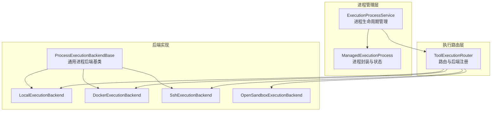
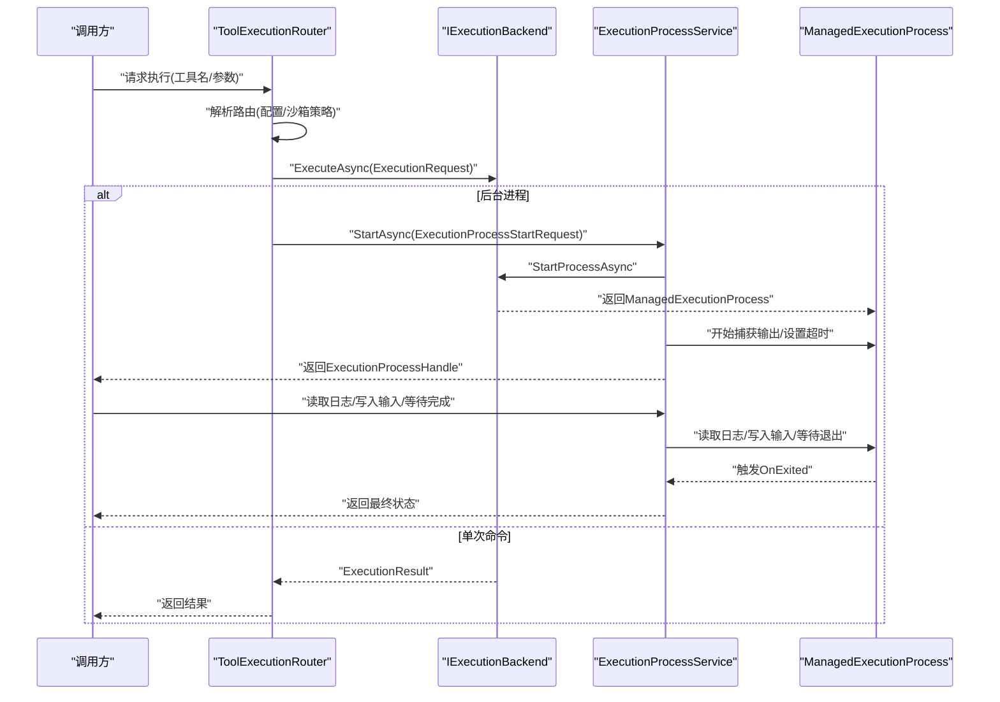
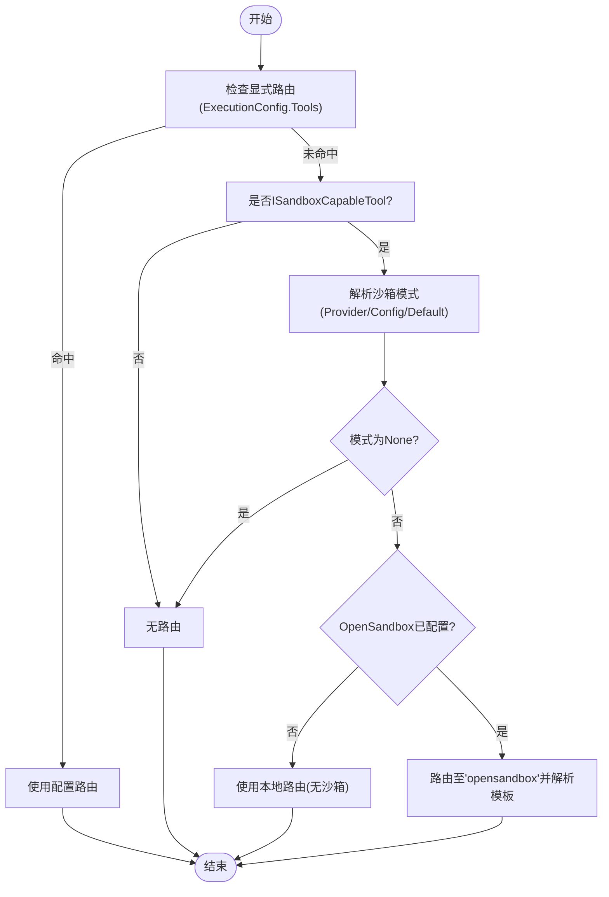
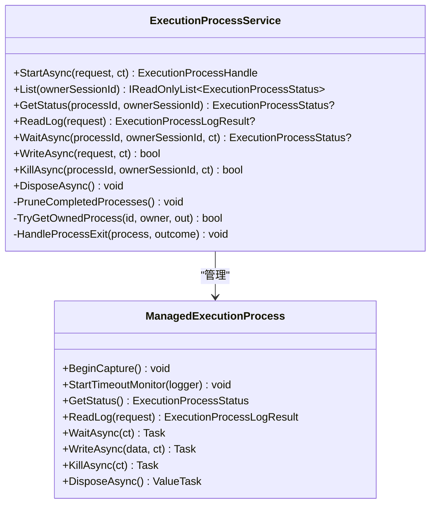
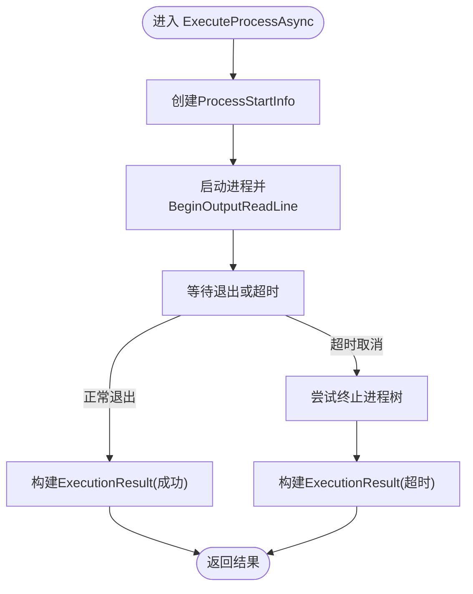
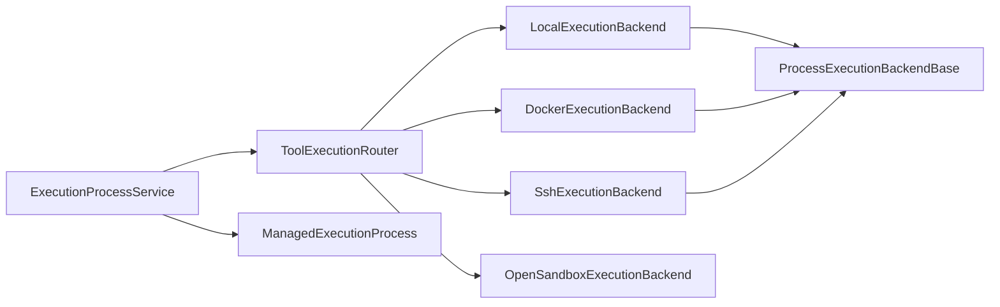

# 后端服务层

<cite>
**本文引用的文件**
- [ToolExecutionRouter.cs](file://src/OpenClaw.Agent/Execution/ToolExecutionRouter.cs)
- [ExecutionProcessService.cs](file://src/OpenClaw.Agent/Execution/ExecutionProcessService.cs)
- [ProcessExecutionBackendBase.cs](file://src/OpenClaw.Agent/Execution/ProcessExecutionBackendBase.cs)
- [LocalExecutionBackend.cs](file://src/OpenClaw.Agent/Execution/LocalExecutionBackend.cs)
- [DockerExecutionBackend.cs](file://src/OpenClaw.Agent/Execution/DockerExecutionBackend.cs)
- [SshExecutionBackend.cs](file://src/OpenClaw.Agent/Execution/SshExecutionBackend.cs)
- [OpenSandboxExecutionBackend.cs](file://src/OpenClaw.Agent/Execution/OpenSandboxExecutionBackend.cs)
- [IExecutionBackend.cs](file://src/OpenClaw.Core/Abstractions/IExecutionBackend.cs)
- [ExecutionModels.cs](file://src/OpenClaw.Core/Models/ExecutionModels.cs)
- [GatewayConfig.cs](file://src/OpenClaw.Core/Models/GatewayConfig.cs)
- [SandboxConfig.cs](file://src/OpenClaw.Core/Models/SandboxConfig.cs)
- [ISandboxCapableTool.cs](file://src/OpenClaw.Core/Abstractions/ISandboxCapableTool.cs)
</cite>

## 目录
1. [简介](#简介)
2. [项目结构](#项目结构)
3. [核心组件](#核心组件)
4. [架构总览](#架构总览)
5. [详细组件分析](#详细组件分析)
6. [依赖关系分析](#依赖关系分析)
7. [性能考量](#性能考量)
8. [故障排查指南](#故障排查指南)
9. [结论](#结论)
10. [附录](#附录)

## 简介
本文件面向 OpenClaw.NET 的后端服务层，系统性阐述工具执行路由与进程管理机制，覆盖本地执行、Docker 执行、SSH 执行以及 OpenSandbox 沙箱执行四种后端类型。文档重点包括：
- 后端注册与选择：基于配置驱动的路由解析与回退策略
- 工具执行路由：按工具名与沙箱策略动态决定后端与模板
- 进程生命周期管理：后台长任务的启动、监控、日志读取、输入写入与终止
- 配置体系：ExecutionConfig、ExecutionBackendProfileConfig、SandboxConfig 的作用域与优先级
- 资源与安全：工作区限制、超时控制、隔离能力与 PTY 支持
- 故障处理：超时、回退、异常与历史清理

## 项目结构
后端服务层位于 OpenClaw.Agent 的 Execution 命名空间中，围绕 ToolExecutionRouter（路由）与 ExecutionProcessService（进程服务）两大核心展开，并通过多种 IExecutionBackend 实现类提供具体执行能力。

图表来源
- [ToolExecutionRouter.cs:20-63](file://src/OpenClaw.Agent/Execution/ToolExecutionRouter.cs#L20-L63)
- [ExecutionProcessService.cs:278-377](file://src/OpenClaw.Agent/Execution/ExecutionProcessService.cs#L278-L377)
- [ProcessExecutionBackendBase.cs:8-44](file://src/OpenClaw.Agent/Execution/ProcessExecutionBackendBase.cs#L8-L44)
- [LocalExecutionBackend.cs:6-25](file://src/OpenClaw.Agent/Execution/LocalExecutionBackend.cs#L6-L25)
- [DockerExecutionBackend.cs:6-20](file://src/OpenClaw.Agent/Execution/DockerExecutionBackend.cs#L6-L20)
- [SshExecutionBackend.cs:6-20](file://src/OpenClaw.Agent/Execution/SshExecutionBackend.cs#L6-L20)
- [OpenSandboxExecutionBackend.cs:7-20](file://src/OpenClaw.Agent/Execution/OpenSandboxExecutionBackend.cs#L7-L20)

章节来源
- [ToolExecutionRouter.cs:1-253](file://src/OpenClaw.Agent/Execution/ToolExecutionRouter.cs#L1-L253)
- [ExecutionProcessService.cs:1-522](file://src/OpenClaw.Agent/Execution/ExecutionProcessService.cs#L1-L522)

## 核心组件
- ToolExecutionRouter：负责根据工具名与沙箱策略解析执行后端；支持配置化路由与回退；可解析“process”“shell”等特殊路由。
- ExecutionProcessService：管理后台长任务的生命周期，包括启动、状态查询、日志读取、输入写入、终止与历史清理。
- ProcessExecutionBackendBase：统一的进程型后端基类，封装 ProcessStartInfo 构造、一次性命令执行与后台进程启动。
- 具体后端实现：
  - LocalExecutionBackend：本地进程执行，支持 PTY（非 Windows），可校验工作区根目录。
  - DockerExecutionBackend：通过 docker CLI 在容器内执行命令。
  - SshExecutionBackend：通过 ssh 远程执行命令，支持私钥与工作目录切换。
  - OpenSandboxExecutionBackend：委托 IToolSandbox 执行，用于沙箱化工具调用。
- 抽象与模型：
  - IExecutionBackend：统一的执行接口。
  - ExecutionModels：ExecutionConfig、ExecutionBackendProfileConfig、ExecutionToolRouteConfig、ExecutionRequest/Result、ExecutionProcess* 等数据模型。
  - SandboxConfig：沙箱提供方、模板与 TTL 解析、沙箱模式决策。

章节来源
- [IExecutionBackend.cs:1-13](file://src/OpenClaw.Core/Abstractions/IExecutionBackend.cs#L1-L13)
- [ExecutionModels.cs:1-179](file://src/OpenClaw.Core/Models/ExecutionModels.cs#L1-L179)
- [GatewayConfig.cs:1-800](file://src/OpenClaw.Core/Models/GatewayConfig.cs#L1-L800)
- [SandboxConfig.cs:1-168](file://src/OpenClaw.Core/Models/SandboxConfig.cs#L1-L168)

## 架构总览
下图展示从工具调用到后端执行的整体流程，包括路由解析、后端选择、回退策略与进程管理。

图表来源
- [ToolExecutionRouter.cs:114-157](file://src/OpenClaw.Agent/Execution/ToolExecutionRouter.cs#L114-L157)
- [ExecutionProcessService.cs:301-377](file://src/OpenClaw.Agent/Execution/ExecutionProcessService.cs#L301-L377)
- [ProcessExecutionBackendBase.cs:23-44](file://src/OpenClaw.Agent/Execution/ProcessExecutionBackendBase.cs#L23-L44)

## 详细组件分析

### 组件一：工具执行路由与后端注册（ToolExecutionRouter）
- 注册机制
  - 默认注册“local”后端；遍历 ExecutionConfig.Profiles，按类型注册 Docker、SSH、OpenSandbox 后端；若存在 IToolSandbox，则额外注册名为 “opensandbox” 的后端。
  - 后端名称大小写不敏感，便于配置灵活。
- 路由解析
  - TryResolveRoute：优先匹配 ExecutionConfig.Tools 中的显式路由；否则对实现了 ISandboxCapableTool 的工具，依据 SandboxConfig 与工具默认沙箱模式计算有效模式；当启用 OpenSandbox 且模式为 Require/Prefer 时，将路由至 “opensandbox”，并填充模板。
  - ResolveBackendForProcess：针对“process”“shell”等内置路由，优先使用配置路由，否则根据沙箱模式与模板解析默认后端。
- 回退策略
  - ExecuteAsync：若指定 fallbackBackend 且允许本地回退（或非本地），在主后端失败时自动尝试回退后端，并包装 ExecutionResult 标记 FallbackUsed。
- 工作区要求
  - RequiresWorkspace：当后端类型为 Docker 或 SSH 时，要求工作区；Local 后端可通过工作区根目录校验与限制。

图表来源
- [ToolExecutionRouter.cs:65-112](file://src/OpenClaw.Agent/Execution/ToolExecutionRouter.cs#L65-L112)
- [SandboxConfig.cs:86-122](file://src/OpenClaw.Core/Models/SandboxConfig.cs#L86-L122)

章节来源
- [ToolExecutionRouter.cs:1-253](file://src/OpenClaw.Agent/Execution/ToolExecutionRouter.cs#L1-L253)
- [ISandboxCapableTool.cs:1-13](file://src/OpenClaw.Core/Abstractions/ISandboxCapableTool.cs#L1-L13)
- [SandboxConfig.cs:1-168](file://src/OpenClaw.Core/Models/SandboxConfig.cs#L1-L168)

### 组件二：进程生命周期管理（ExecutionProcessService）
- 角色与职责
  - 接收 ExecutionProcessStartRequest，解析后端与沙箱模式，确保后端支持后台进程与 PTY（如请求）。
  - 启动后将 ManagedExecutionProcess 加入内存字典，设置超时监控与退出回调，记录运行事件与指标。
- 关键操作
  - StartAsync：校验沙箱要求与后端能力，构造标准化请求，调用后端 StartProcessAsync，注册事件与指标。
  - List/GetStatus/ReadLog/WaitAsync/WriteAsync/KillAsync：提供进程状态、日志分页读取、等待退出、写入输入与终止。
  - DisposeAsync：优雅关闭时记录孤儿进程并释放资源。
- 历史清理
  - PruneCompletedProcesses：保留最近最多 N 个已完成进程的历史，超过保留窗口则异步释放并计数。

图表来源
- [ExecutionProcessService.cs:278-522](file://src/OpenClaw.Agent/Execution/ExecutionProcessService.cs#L278-L522)
- [ExecutionProcessService.cs:17-276](file://src/OpenClaw.Agent/Execution/ExecutionProcessService.cs#L17-L276)

章节来源
- [ExecutionProcessService.cs:1-522](file://src/OpenClaw.Agent/Execution/ExecutionProcessService.cs#L1-L522)

### 组件三：进程型后端基类（ProcessExecutionBackendBase）
- 统一能力
  - Capabilities：默认支持一次性命令与进程，部分后端支持 PTY 与交互式输入。
  - ExecuteAsync：通过 ExecuteProcessAsync 统一封装进程启动、输出捕获、超时与退出码收集。
  - StartProcessAsync：创建 ProcessStartInfo，启动进程并返回 ManagedExecutionProcess。
- 通用流程
  - 构造 ProcessStartInfo（重定向标准流、禁用 shell 执行等）
  - 启动进程，开始异步读取 stdout/stderr
  - 可选超时取消，必要时强制终止进程树
  - 返回 ExecutionResult（含耗时、是否超时）

图表来源
- [ProcessExecutionBackendBase.cs:61-128](file://src/OpenClaw.Agent/Execution/ProcessExecutionBackendBase.cs#L61-L128)

章节来源
- [ProcessExecutionBackendBase.cs:1-142](file://src/OpenClaw.Agent/Execution/ProcessExecutionBackendBase.cs#L1-L142)

### 组件四：本地执行后端（LocalExecutionBackend）
- 特性
  - Name = "local"，Capabilities.SupportsPty 非 Windows 平台启用。
  - 通过 CreateProcessStartInfo 设置 FileName、Arguments、Environment 与 WorkingDirectory。
  - 工作区校验：当 RequireWorkspace 为真时，限制工作目录必须位于配置的 WorkspaceRoot 或 Profile.WorkspaceRoot 下，防止越权访问。
- 超时与环境
  - 使用后端 Profile.TimeoutSeconds 控制执行超时。

章节来源
- [LocalExecutionBackend.cs:1-99](file://src/OpenClaw.Agent/Execution/LocalExecutionBackend.cs#L1-L99)
- [ExecutionModels.cs:26-41](file://src/OpenClaw.Core/Models/ExecutionModels.cs#L26-L41)

### 组件五：Docker 执行后端（DockerExecutionBackend）
- 特性
  - 通过 docker CLI 执行命令，镜像来自 request.Template 或 Profile.Image。
  - 支持工作目录映射（-w）、环境变量注入（-e）、容器自动清理（–rm）。
- 限制
  - 必须提供镜像，否则抛出异常。

章节来源
- [DockerExecutionBackend.cs:1-66](file://src/OpenClaw.Agent/Execution/DockerExecutionBackend.cs#L1-L66)
- [ExecutionModels.cs:26-41](file://src/OpenClaw.Core/Models/ExecutionModels.cs#L26-L41)

### 组件六：SSH 执行后端（SshExecutionBackend）
- 牺牲
  - 通过 ssh 远程执行命令，支持自定义端口、私钥路径、用户名与主机。
  - 自动拼接远程命令，支持工作目录切换与环境变量注入。
- 限制
  - 必须提供 Host 与 Username，否则抛出异常。

章节来源
- [SshExecutionBackend.cs:1-63](file://src/OpenClaw.Agent/Execution/SshExecutionBackend.cs#L1-L63)
- [ExecutionModels.cs:26-41](file://src/OpenClaw.Core/Models/ExecutionModels.cs#L26-L41)

### 组件七：OpenSandbox 执行后端（OpenSandboxExecutionBackend）
- 特性
  - 委托 IToolSandbox.ExecuteAsync 执行，适用于沙箱化工具调用。
  - 使用内部超时控制（_timeoutSeconds），超时返回 TimedOut 结果。
- 适用场景
  - 当路由解析为 “opensandbox” 时，由该后端承接执行请求。

章节来源
- [OpenSandboxExecutionBackend.cs:1-69](file://src/OpenClaw.Agent/Execution/OpenSandboxExecutionBackend.cs#L1-L69)
- [SandboxConfig.cs:1-168](file://src/OpenClaw.Core/Models/SandboxConfig.cs#L1-L168)

## 依赖关系分析
- 路由层依赖
  - ToolExecutionRouter 依赖 GatewayConfig（ExecutionConfig、SandboxConfig）、工具接口 ITool 与 ISandboxCapableTool、后端集合。
- 后端实现依赖
  - Local/Docker/Ssh 基于 ProcessExecutionBackendBase；OpenSandbox 基于 IToolSandbox。
- 进程服务依赖
  - ExecutionProcessService 依赖 ToolExecutionRouter 与后端实现，维护进程字典与运行事件。

图表来源
- [ToolExecutionRouter.cs:16-62](file://src/OpenClaw.Agent/Execution/ToolExecutionRouter.cs#L16-L62)
- [ExecutionProcessService.cs:278-377](file://src/OpenClaw.Agent/Execution/ExecutionProcessService.cs#L278-L377)
- [ProcessExecutionBackendBase.cs:8-17](file://src/OpenClaw.Agent/Execution/ProcessExecutionBackendBase.cs#L8-L17)

章节来源
- [ToolExecutionRouter.cs:1-253](file://src/OpenClaw.Agent/Execution/ToolExecutionRouter.cs#L1-L253)
- [ExecutionProcessService.cs:1-522](file://src/OpenClaw.Agent/Execution/ExecutionProcessService.cs#L1-L522)

## 性能考量
- 超时控制
  - 后端统一采用超时令牌控制，避免僵尸进程与资源占用。
- 日志与输出
  - 异步读取 stdout/stderr，避免阻塞；日志分页读取减少内存压力。
- 历史清理
  - 完成进程按时间窗口与数量上限清理，降低内存占用。
- 并行与隔离
  - Docker/SSH 提供更强隔离；Local 在非 Windows 平台支持 PTY，提升交互体验。
- 指标与可观测性
  - 进程启动/完成/失败/超时/被杀计数与保留进程数统计，便于容量规划与问题定位。

## 故障排查指南
- 后端不可用
  - 现象：抛出“后端未配置/不支持后台进程”异常。
  - 排查：确认 ExecutionConfig.Profiles 中后端已启用；对于“process”路由，确保后端实现 IExecutionProcessBackend。
- 工作区拒绝
  - 现象：Local 后端提示工作目录越权。
  - 排查：检查 Tooling.WorkspaceRoot 与 Profile.WorkspaceRoot；确认 RequireWorkspace 与实际工作目录关系。
- Docker/SSH 缺少必需配置
  - 现象：抛出“缺少镜像/主机/用户名”异常。
  - 排查：完善 ExecutionBackendProfileConfig 的 Image、Host、Username 等字段。
- 超时与回退
  - 现象：ExecutionResult.TimedOut = true。
  - 排查：调整 Profile.TimeoutSeconds；必要时配置 FallbackBackend 并允许本地回退。
- PTY 不可用
  - 现象：请求 PTY 但后端不支持。
  - 排查：确认后端 Capabilities.SupportsPty；非 Windows 平台 Local 后端默认支持。

章节来源
- [ToolExecutionRouter.cs:114-157](file://src/OpenClaw.Agent/Execution/ToolExecutionRouter.cs#L114-L157)
- [LocalExecutionBackend.cs:53-83](file://src/OpenClaw.Agent/Execution/LocalExecutionBackend.cs#L53-L83)
- [DockerExecutionBackend.cs:22-27](file://src/OpenClaw.Agent/Execution/DockerExecutionBackend.cs#L22-L27)
- [SshExecutionBackend.cs:22-26](file://src/OpenClaw.Agent/Execution/SshExecutionBackend.cs#L22-L26)
- [ExecutionProcessService.cs:301-377](file://src/OpenClaw.Agent/Execution/ExecutionProcessService.cs#L301-L377)

## 结论
后端服务层通过“配置驱动的路由 + 统一的进程管理”实现了对本地、Docker、SSH 与 OpenSandbox 的一体化执行能力。其设计强调：
- 易扩展：新增后端只需实现 IExecutionBackend 或继承 ProcessExecutionBackendBase
- 可观测：完善的运行事件、指标与历史清理
- 安全可控：工作区限制、超时与回退策略
- 交互友好：后台进程的 PTY 支持与日志分页读取

## 附录

### 配置要点速查
- ExecutionConfig
  - Enabled：是否启用执行路由
  - DefaultBackend：默认后端名称
  - Profiles：后端配置字典（类型、工作目录、环境、镜像、主机、端口、用户名、私钥、超时、工作区根）
  - Tools：工具到后端的显式路由（Backend/FallbackBackend/RequireWorkspace）
- SandboxConfig
  - Provider：沙箱提供方（如 OpenSandbox）
  - Endpoint/ApiKey：OpenSandbox 连接信息
  - DefaultTTL：默认 TTL
  - Tools：工具级沙箱模式与模板

章节来源
- [ExecutionModels.cs:8-52](file://src/OpenClaw.Core/Models/ExecutionModels.cs#L8-L52)
- [GatewayConfig.cs:28-28](file://src/OpenClaw.Core/Models/GatewayConfig.cs#L28-L28)
- [SandboxConfig.cs:3-27](file://src/OpenClaw.Core/Models/SandboxConfig.cs#L3-L27)