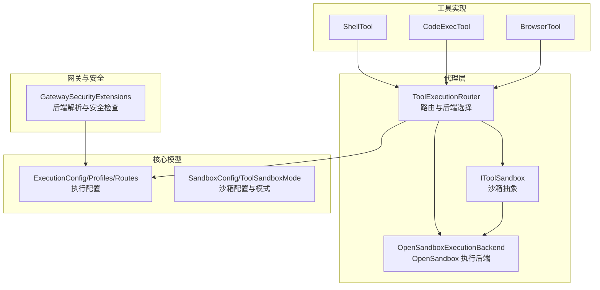
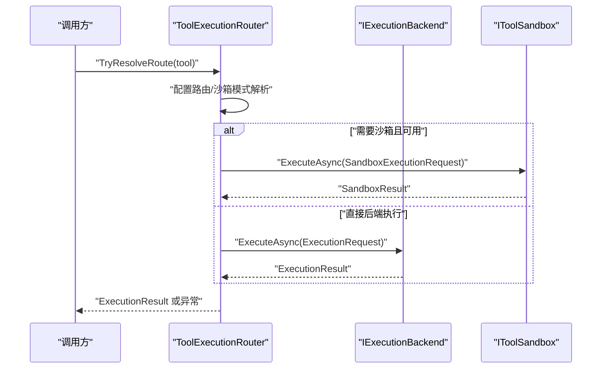
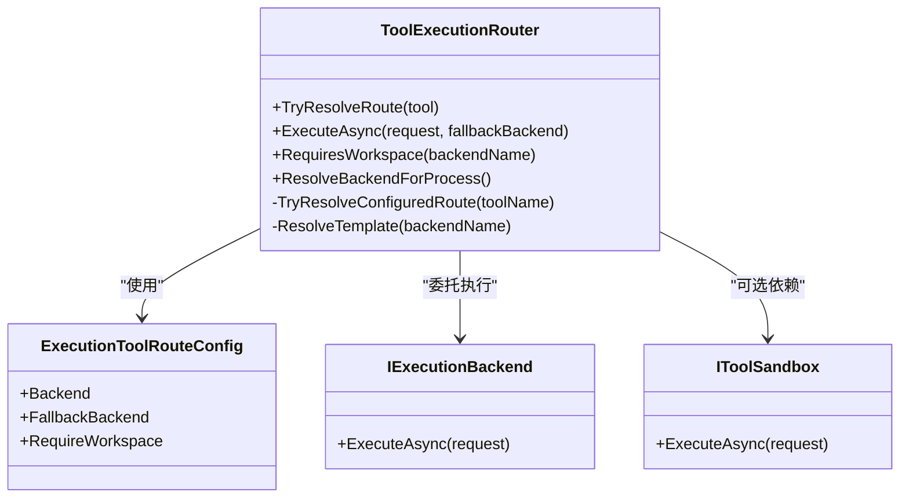
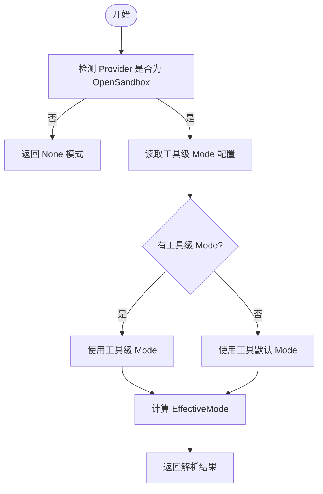
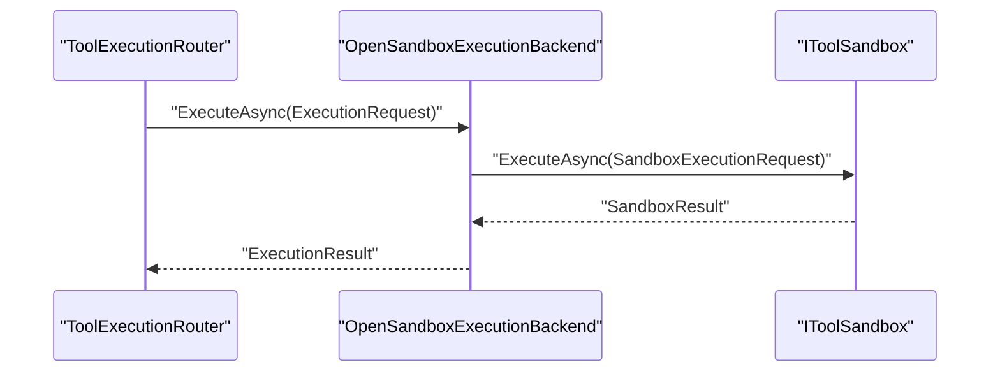
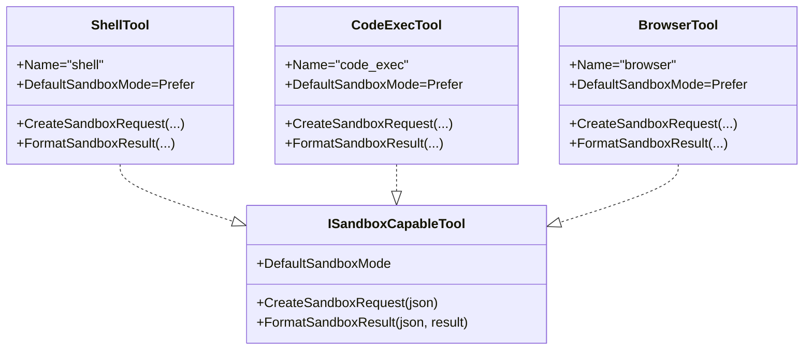
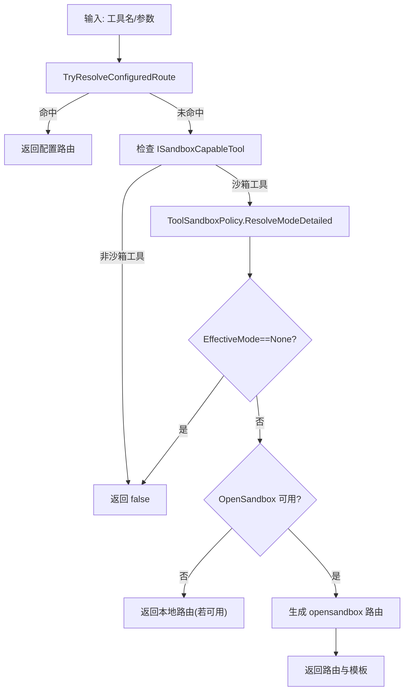
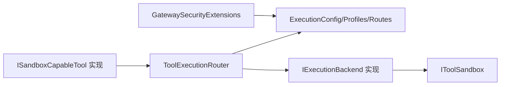

# 工具路由

<cite>
**本文引用的文件**
- [ToolExecutionRouter.cs](file://src/OpenClaw.Agent/Execution/ToolExecutionRouter.cs)
- [IToolSandbox.cs](file://src/OpenClaw.Core/Abstractions/IToolSandbox.cs)
- [SandboxConfig.cs](file://src/OpenClaw.Core/Models/SandboxConfig.cs)
- [ExecutionModels.cs](file://src/OpenClaw.Core/Models/ExecutionModels.cs)
- [ISandboxCapableTool.cs](file://src/OpenClaw.Core/Abstractions/ISandboxCapableTool.cs)
- [ShellTool.cs](file://src/OpenClaw.Agent/Tools/ShellTool.cs)
- [CodeExecTool.cs](file://src/OpenClaw.Agent/Tools/CodeExecTool.cs)
- [BrowserTool.cs](file://src/OpenClaw.Agent/Tools/BrowserTool.cs)
- [GatewaySecurityExtensions.cs](file://src/OpenClaw.Gateway/Extensions/GatewaySecurityExtensions.cs)
- [OpenSandboxExecutionBackend.cs](file://src/OpenClaw.Agent/Execution/OpenSandboxExecutionBackend.cs)
- [OpenSandboxToolSandboxTests.cs](file://src/OpenClaw.Tests/OpenSandboxToolSandboxTests.cs)
- [OpenClawToolExecutorTests.cs](file://src/OpenClaw.Tests/OpenClawToolExecutorTests.cs)
- [sandboxing.md](file://docs/sandboxing.md)
</cite>

## 目录
1. [简介](#简介)
2. [项目结构](#项目结构)
3. [核心组件](#核心组件)
4. [架构总览](#架构总览)
5. [详细组件分析](#详细组件分析)
6. [依赖关系分析](#依赖关系分析)
7. [性能考量](#性能考量)
8. [故障排查指南](#故障排查指南)
9. [结论](#结论)
10. [附录](#附录)

## 简介
本文件系统性阐述工具路由与执行子系统的决策机制、工具分类与执行后端选择策略，解释工具沙箱机制、权限控制与安全隔离，并给出配置要点、性能优化建议与扩展点。文档包含架构图与路由决策流程图，帮助读者从高层到代码级全面理解工具路由的设计与实现。

## 项目结构
工具路由相关代码主要分布在以下模块：
- 路由与执行后端：OpenClaw.Agent.Execution
- 沙箱抽象与策略：OpenClaw.Core.Abstractions 与 OpenClaw.Core.Models
- 典型工具实现：OpenClaw.Agent.Tools（如 shell/code_exec/browser）
- 安全与网关集成：OpenClaw.Gateway.Extensions
- 文档与测试：docs 与 OpenClaw.Tests

图表来源
- [ToolExecutionRouter.cs:1-253](file://src/OpenClaw.Agent/Execution/ToolExecutionRouter.cs#L1-L253)
- [ExecutionModels.cs:1-179](file://src/OpenClaw.Core/Models/ExecutionModels.cs#L1-L179)
- [SandboxConfig.cs:1-168](file://src/OpenClaw.Core/Models/SandboxConfig.cs#L1-L168)
- [ISandboxCapableTool.cs:1-14](file://src/OpenClaw.Core/Abstractions/ISandboxCapableTool.cs#L1-L14)
- [ShellTool.cs:1-193](file://src/OpenClaw.Agent/Tools/ShellTool.cs#L1-L193)
- [CodeExecTool.cs:1-200](file://src/OpenClaw.Agent/Tools/CodeExecTool.cs#L1-L200)
- [BrowserTool.cs:1-200](file://src/OpenClaw.Agent/Tools/BrowserTool.cs#L1-L200)
- [GatewaySecurityExtensions.cs:290-317](file://src/OpenClaw.Gateway/Extensions/GatewaySecurityExtensions.cs#L290-L317)
- [OpenSandboxExecutionBackend.cs:1-38](file://src/OpenClaw.Agent/Execution/OpenSandboxExecutionBackend.cs#L1-L38)

章节来源
- [ToolExecutionRouter.cs:1-253](file://src/OpenClaw.Agent/Execution/ToolExecutionRouter.cs#L1-L253)
- [ExecutionModels.cs:1-179](file://src/OpenClaw.Core/Models/ExecutionModels.cs#L1-L179)
- [SandboxConfig.cs:1-168](file://src/OpenClaw.Core/Models/SandboxConfig.cs#L1-L168)

## 核心组件
- 工具路由器：根据配置与工具能力解析执行后端与沙箱模式，支持回退后端与工作区要求判定。
- 执行后端：本地、Docker、SSH、OpenSandbox 四类后端；OpenSandbox 后端通过 IToolSandbox 抽象对接。
- 沙箱策略：全局 Provider 与工具级 Mode/TTL/Template 解析，决定是否沙箱化及如何沙箱化。
- 工具接口：ISandboxCapableTool 提供默认沙箱模式与沙箱请求构造/结果格式化。
- 网关安全：在路由解析之外进行后端解析与安全加固判断。

章节来源
- [ToolExecutionRouter.cs:7-112](file://src/OpenClaw.Agent/Execution/ToolExecutionRouter.cs#L7-L112)
- [IToolSandbox.cs:1-12](file://src/OpenClaw.Core/Abstractions/IToolSandbox.cs#L1-L12)
- [SandboxConfig.cs:48-167](file://src/OpenClaw.Core/Models/SandboxConfig.cs#L48-L167)
- [ISandboxCapableTool.cs:1-14](file://src/OpenClaw.Core/Abstractions/ISandboxCapableTool.cs#L1-L14)
- [GatewaySecurityExtensions.cs:294-315](file://src/OpenClaw.Gateway/Extensions/GatewaySecurityExtensions.cs#L294-L315)

## 架构总览
工具路由的总体流程：
- 输入：工具名、参数、会话上下文
- 决策：按配置路由 → 沙箱模式解析 → OpenSandbox 可用性检查 → 回退策略
- 执行：调用对应后端执行或通过 IToolSandbox 执行
- 输出：统一的 ExecutionResult 结果封装

图表来源
- [ToolExecutionRouter.cs:65-112](file://src/OpenClaw.Agent/Execution/ToolExecutionRouter.cs#L65-L112)
- [OpenSandboxExecutionBackend.cs:22-38](file://src/OpenClaw.Agent/Execution/OpenSandboxExecutionBackend.cs#L22-L38)
- [IToolSandbox.cs:7-9](file://src/OpenClaw.Core/Abstractions/IToolSandbox.cs#L7-L9)

## 详细组件分析

### 组件A：工具路由器（ToolExecutionRouter）
职责与行为：
- 初始化后端注册表：本地、Docker、SSH、OpenSandbox（可选）
- 配置驱动路由：按工具名查找 ExecutionToolRouteConfig
- 沙箱能力路由：对 ISandboxCapableTool 解析 ToolSandboxMode，必要时生成 opensandbox 路由
- 回退策略：当主后端失败且存在回退后端时自动切换
- 过程式工具路由：针对 process 的特殊解析逻辑
- 工作区需求：基于后端类型判断是否需要工作区

图表来源
- [ToolExecutionRouter.cs:7-112](file://src/OpenClaw.Agent/Execution/ToolExecutionRouter.cs#L7-L112)
- [ExecutionModels.cs:47-52](file://src/OpenClaw.Core/Models/ExecutionModels.cs#L47-L52)
- [IToolSandbox.cs:5-11](file://src/OpenClaw.Core/Abstractions/IToolSandbox.cs#L5-L11)

章节来源
- [ToolExecutionRouter.cs:20-63](file://src/OpenClaw.Agent/Execution/ToolExecutionRouter.cs#L20-L63)
- [ToolExecutionRouter.cs:65-112](file://src/OpenClaw.Agent/Execution/ToolExecutionRouter.cs#L65-L112)
- [ToolExecutionRouter.cs:114-157](file://src/OpenClaw.Agent/Execution/ToolExecutionRouter.cs#L114-L157)
- [ToolExecutionRouter.cs:164-203](file://src/OpenClaw.Agent/Execution/ToolExecutionRouter.cs#L164-L203)
- [ToolExecutionRouter.cs:205-231](file://src/OpenClaw.Agent/Execution/ToolExecutionRouter.cs#L205-L231)
- [ToolExecutionRouter.cs:233-251](file://src/OpenClaw.Agent/Execution/ToolExecutionRouter.cs#L233-L251)

### 组件B：沙箱策略与配置（SandboxConfig、ToolSandboxPolicy）
- Provider 与工具级 Mode/TTL/Template 解析
- 默认模式与工具默认模式的合并策略
- 是否强制沙箱化（Require）的判定
- OpenSandbox 提供商可用性检测

图表来源
- [SandboxConfig.cs:48-122](file://src/OpenClaw.Core/Models/SandboxConfig.cs#L48-L122)

章节来源
- [SandboxConfig.cs:48-167](file://src/OpenClaw.Core/Models/SandboxConfig.cs#L48-L167)

### 组件C：执行后端与 OpenSandbox 后端
- IExecutionBackend 接口定义统一执行入口
- OpenSandboxExecutionBackend 将 ExecutionRequest 转换为 SandboxExecutionRequest 并调用 IToolSandbox
- 支持超时控制与回退执行

图表来源
- [OpenSandboxExecutionBackend.cs:22-38](file://src/OpenClaw.Agent/Execution/OpenSandboxExecutionBackend.cs#L22-L38)
- [IToolSandbox.cs:7-9](file://src/OpenClaw.Core/Abstractions/IToolSandbox.cs#L7-L9)

章节来源
- [OpenSandboxExecutionBackend.cs:1-38](file://src/OpenClaw.Agent/Execution/OpenSandboxExecutionBackend.cs#L1-L38)
- [IToolSandbox.cs:1-12](file://src/OpenClaw.Core/Abstractions/IToolSandbox.cs#L1-L12)

### 组件D：工具分类与沙箱能力
- ShellTool：默认沙箱模式 Prefer，支持本地与沙箱两种执行路径
- CodeExecTool：默认沙箱模式 Prefer，支持 Docker/进程两种后端
- BrowserTool：默认沙箱模式 Prefer，提供 URL 安全校验与网络限制脚本

图表来源
- [ISandboxCapableTool.cs:5-12](file://src/OpenClaw.Core/Abstractions/ISandboxCapableTool.cs#L5-L12)
- [ShellTool.cs:11-21](file://src/OpenClaw.Agent/Tools/ShellTool.cs#L11-L21)
- [CodeExecTool.cs:16-54](file://src/OpenClaw.Agent/Tools/CodeExecTool.cs#L16-L54)
- [BrowserTool.cs:17-21](file://src/OpenClaw.Agent/Tools/BrowserTool.cs#L17-L21)

章节来源
- [ShellTool.cs:1-193](file://src/OpenClaw.Agent/Tools/ShellTool.cs#L1-L193)
- [CodeExecTool.cs:1-200](file://src/OpenClaw.Agent/Tools/CodeExecTool.cs#L1-L200)
- [BrowserTool.cs:1-200](file://src/OpenClaw.Agent/Tools/BrowserTool.cs#L1-L200)

### 组件E：路由决策流程（含安全与回退）
- 配置驱动：优先匹配 Execution.Tools 中的工具路由
- 沙箱模式：对沙箱工具解析 EffectiveMode，必要时生成 opensandbox 路由
- 回退策略：主后端失败时尝试回退后端（允许本地回退需显式允许）
- 特殊处理：process 工具可回退到 shell 的后端配置
- 网关安全：在路由解析之外进行后端解析与公共绑定加固

图表来源
- [ToolExecutionRouter.cs:65-112](file://src/OpenClaw.Agent/Execution/ToolExecutionRouter.cs#L65-L112)
- [ToolExecutionRouter.cs:236-251](file://src/OpenClaw.Agent/Execution/ToolExecutionRouter.cs#L236-L251)
- [SandboxConfig.cs:48-122](file://src/OpenClaw.Core/Models/SandboxConfig.cs#L48-L122)

章节来源
- [ToolExecutionRouter.cs:65-112](file://src/OpenClaw.Agent/Execution/ToolExecutionRouter.cs#L65-L112)
- [GatewaySecurityExtensions.cs:294-315](file://src/OpenClaw.Gateway/Extensions/GatewaySecurityExtensions.cs#L294-L315)

## 依赖关系分析
- 路由器依赖配置与后端注册表，间接依赖工具能力接口
- OpenSandbox 后端依赖 IToolSandbox 抽象
- 工具实现依赖路由器提供的沙箱请求构造与结果格式化
- 网关扩展在路由之外进行后端解析与安全加固

图表来源
- [ToolExecutionRouter.cs:16-63](file://src/OpenClaw.Agent/Execution/ToolExecutionRouter.cs#L16-L63)
- [ExecutionModels.cs:8-20](file://src/OpenClaw.Core/Models/ExecutionModels.cs#L8-L20)
- [ISandboxCapableTool.cs:5-12](file://src/OpenClaw.Core/Abstractions/ISandboxCapableTool.cs#L5-L12)
- [GatewaySecurityExtensions.cs:294-315](file://src/OpenClaw.Gateway/Extensions/GatewaySecurityExtensions.cs#L294-L315)

章节来源
- [ToolExecutionRouter.cs:16-63](file://src/OpenClaw.Agent/Execution/ToolExecutionRouter.cs#L16-L63)
- [ExecutionModels.cs:8-20](file://src/OpenClaw.Core/Models/ExecutionModels.cs#L8-L20)
- [GatewaySecurityExtensions.cs:294-315](file://src/OpenClaw.Gateway/Extensions/GatewaySecurityExtensions.cs#L294-L315)

## 性能考量
- 超时控制：OpenSandbox 后端与后端配置均支持超时秒数，避免长时间阻塞
- 回退策略：主后端失败时自动回退，减少整体失败率
- 输出截断：典型工具对 stdout/stderr 输出进行上限控制，防止内存膨胀
- 运行时复用：OpenSandbox 租约按 sessionId:toolName 复用，降低创建成本
- 网络限制：浏览器工具内置 URL 安全校验与网络限制脚本，减少无效请求

章节来源
- [OpenSandboxExecutionBackend.cs:26-28](file://src/OpenClaw.Agent/Execution/OpenSandboxExecutionBackend.cs#L26-L28)
- [ExecutionModels.cs:26-41](file://src/OpenClaw.Core/Models/ExecutionModels.cs#L26-L41)
- [ShellTool.cs:22-84](file://src/OpenClaw.Agent/Tools/ShellTool.cs#L22-L84)
- [sandboxing.md:152-157](file://docs/sandboxing.md#L152-L157)

## 故障排查指南
- 路由未命中：确认 Execution.Tools 中是否配置了目标工具的 Backend/FallbackBackend
- 沙箱不可用：检查 Sandbox.Provider 是否为 OpenSandbox，且 Endpoint 可达
- 回退失败：确认 AllowLocalFallback 设置与回退后端可用性
- 过程式工具问题：process 路由可能回退到 shell 的后端配置，检查 shell 路由
- 安全加固：公共绑定场景下，Require 模式且 OpenSandbox 可用才视为安全

章节来源
- [ToolExecutionRouter.cs:114-157](file://src/OpenClaw.Agent/Execution/ToolExecutionRouter.cs#L114-L157)
- [ToolExecutionRouter.cs:164-203](file://src/OpenClaw.Agent/Execution/ToolExecutionRouter.cs#L164-L203)
- [GatewaySecurityExtensions.cs:294-315](file://src/OpenClaw.Gateway/Extensions/GatewaySecurityExtensions.cs#L294-L315)
- [sandboxing.md:142-151](file://docs/sandboxing.md#L142-L151)

## 结论
工具路由系统以配置驱动为核心，结合工具沙箱能力与安全策略，实现了灵活、可扩展且安全的执行后端选择。通过统一的路由器与抽象后端，系统既能满足本地开发需求，也能通过 OpenSandbox 实现强隔离与安全运行。配套的安全加固与回退策略进一步提升了鲁棒性与可运维性。

## 附录

### 配置要点与扩展点
- 执行配置（ExecutionConfig/Profiles/Routes）：定义后端类型、工作目录、环境变量、镜像、主机/端口、超时等
- 沙箱配置（SandboxConfig/ToolSandboxMode）：定义 Provider、工具级 Mode/TTL/Template
- 工具扩展：实现 ISandboxCapableTool，提供默认沙箱模式与沙箱请求构造/结果格式化
- 后端扩展：实现 IExecutionBackend，注册到 ToolExecutionRouter

章节来源
- [ExecutionModels.cs:8-52](file://src/OpenClaw.Core/Models/ExecutionModels.cs#L8-L52)
- [SandboxConfig.cs:3-27](file://src/OpenClaw.Core/Models/SandboxConfig.cs#L3-L27)
- [ISandboxCapableTool.cs:5-12](file://src/OpenClaw.Core/Abstractions/ISandboxCapableTool.cs#L5-L12)
- [ToolExecutionRouter.cs:28-62](file://src/OpenClaw.Agent/Execution/ToolExecutionRouter.cs#L28-L62)

### 测试参考
- OpenSandbox 集成测试：验证租约创建、续期、执行与释放流程
- 工具执行器测试：验证沙箱工具在不同模式下的执行结果

章节来源
- [OpenSandboxToolSandboxTests.cs:1-35](file://src/OpenClaw.Tests/OpenSandboxToolSandboxTests.cs#L1-L35)
- [OpenClawToolExecutorTests.cs:77-115](file://src/OpenClaw.Tests/OpenClawToolExecutorTests.cs#L77-L115)