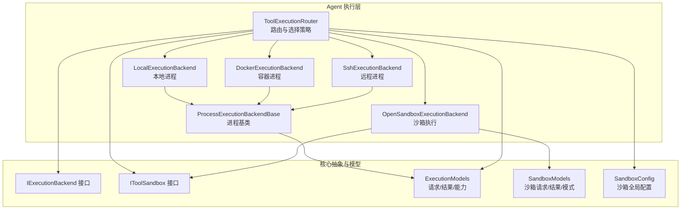
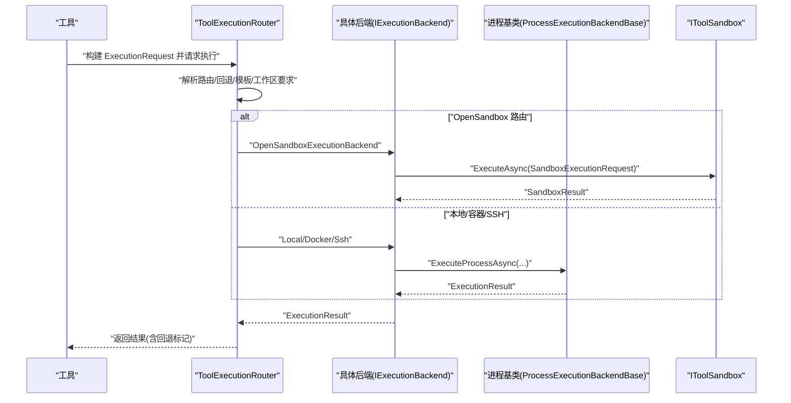
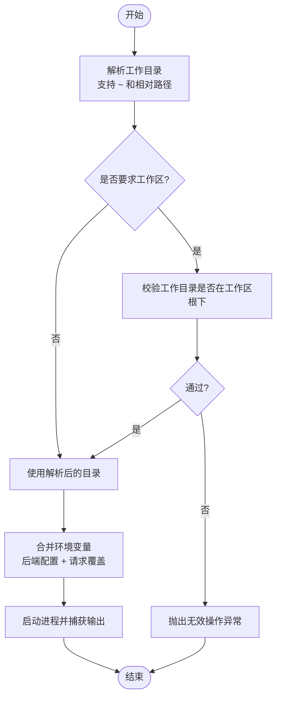
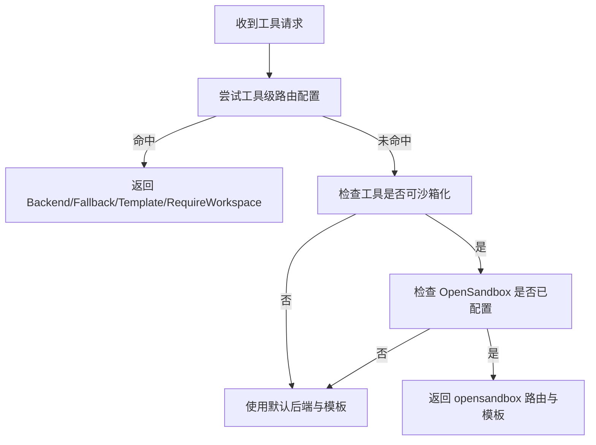
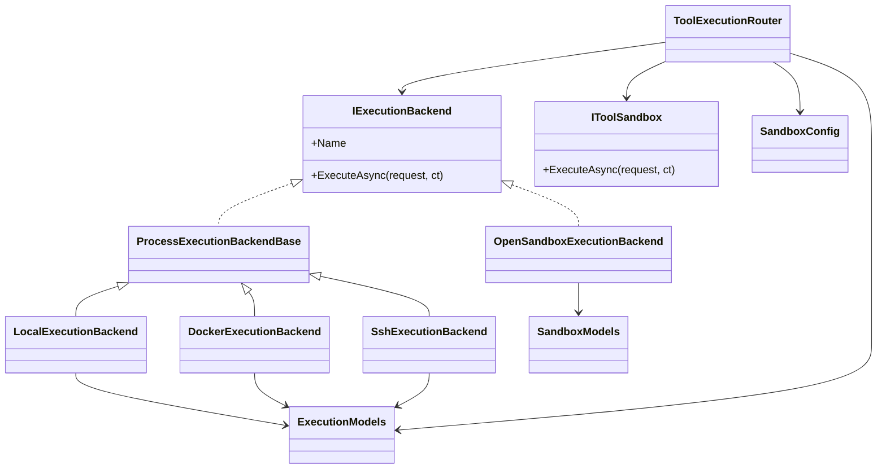

# 执行后端

<cite>
**本文引用的文件**
- [LocalExecutionBackend.cs](file://src/OpenClaw.Agent/Execution/LocalExecutionBackend.cs)
- [DockerExecutionBackend.cs](file://src/OpenClaw.Agent/Execution/DockerExecutionBackend.cs)
- [SshExecutionBackend.cs](file://src/OpenClaw.Agent/Execution/SshExecutionBackend.cs)
- [OpenSandboxExecutionBackend.cs](file://src/OpenClaw.Agent/Execution/OpenSandboxExecutionBackend.cs)
- [ProcessExecutionBackendBase.cs](file://src/OpenClaw.Agent/Execution/ProcessExecutionBackendBase.cs)
- [ToolExecutionRouter.cs](file://src/OpenClaw.Agent/Execution/ToolExecutionRouter.cs)
- [IExecutionBackend.cs](file://src/OpenClaw.Core/Abstractions/IExecutionBackend.cs)
- [IToolSandbox.cs](file://src/OpenClaw.Core/Abstractions/IToolSandbox.cs)
- [ExecutionModels.cs](file://src/OpenClaw.Core/Models/ExecutionModels.cs)
- [SandboxModels.cs](file://src/OpenClaw.Core/Models/SandboxModels.cs)
- [SandboxConfig.cs](file://src/OpenClaw.Core/Models/SandboxConfig.cs)
- [SetupCommand.cs](file://src/OpenClaw.Cli/SetupCommand.cs)
- [ConfigValidator.cs](file://src/OpenClaw.Core/Validation/ConfigValidator.cs)
</cite>

## 目录
1. [简介](#简介)
2. [项目结构](#项目结构)
3. [核心组件](#核心组件)
4. [架构总览](#架构总览)
5. [详细组件分析](#详细组件分析)
6. [依赖关系分析](#依赖关系分析)
7. [性能与资源特性](#性能与资源特性)
8. [故障排查指南](#故障排查指南)
9. [结论](#结论)
10. [附录](#附录)

## 简介
本文件系统性地文档化了执行后端子系统的实现与使用方法，涵盖本地执行、Docker 执行、SSH 执行以及 OpenSandbox 执行后端。内容包括：
- 各后端的实现原理与配置要点
- 执行后端的选择策略、模板/镜像与工作目录约束
- 资源分配与安全隔离机制
- 各后端的优缺点、适用场景与性能特征
- 架构图与典型执行流程示例

## 项目结构
执行后端位于 Agent 层的 Execution 命名空间中，通过统一接口与路由器进行编排，并与核心模型、沙箱抽象协同工作。

**图表来源**
- [ToolExecutionRouter.cs:1-253](file://src/OpenClaw.Agent/Execution/ToolExecutionRouter.cs#L1-L253)
- [LocalExecutionBackend.cs:1-99](file://src/OpenClaw.Agent/Execution/LocalExecutionBackend.cs#L1-L99)
- [DockerExecutionBackend.cs:1-66](file://src/OpenClaw.Agent/Execution/DockerExecutionBackend.cs#L1-L66)
- [SshExecutionBackend.cs:1-63](file://src/OpenClaw.Agent/Execution/SshExecutionBackend.cs#L1-L63)
- [OpenSandboxExecutionBackend.cs:1-69](file://src/OpenClaw.Agent/Execution/OpenSandboxExecutionBackend.cs#L1-L69)
- [ProcessExecutionBackendBase.cs:1-142](file://src/OpenClaw.Agent/Execution/ProcessExecutionBackendBase.cs#L1-L142)
- [IExecutionBackend.cs:1-13](file://src/OpenClaw.Core/Abstractions/IExecutionBackend.cs#L1-L13)
- [IToolSandbox.cs:1-12](file://src/OpenClaw.Core/Abstractions/IToolSandbox.cs#L1-L12)
- [ExecutionModels.cs:1-179](file://src/OpenClaw.Core/Models/ExecutionModels.cs#L1-L179)
- [SandboxModels.cs:1-28](file://src/OpenClaw.Core/Models/SandboxModels.cs#L1-L28)
- [SandboxConfig.cs:1-47](file://src/OpenClaw.Core/Models/SandboxConfig.cs#L1-L47)

**章节来源**
- [ToolExecutionRouter.cs:1-253](file://src/OpenClaw.Agent/Execution/ToolExecutionRouter.cs#L1-L253)
- [ExecutionModels.cs:1-179](file://src/OpenClaw.Core/Models/ExecutionModels.cs#L1-L179)

## 核心组件
- 统一接口 IExecutionBackend：定义后端名称与异步执行方法，确保所有后端具备一致的调用契约。
- 进程基类 ProcessExecutionBackendBase：封装通用的进程启动、输出捕获、超时控制与终止逻辑；派生类仅需提供 ProcessStartInfo 即可。
- 路由器 ToolExecutionRouter：根据工具、配置与沙箱策略解析后端路由，支持回退后端与模板解析。
- 具体后端实现：
  - LocalExecutionBackend：本地进程执行，支持工作目录与工作区限制。
  - DockerExecutionBackend：通过 docker CLI 在容器内执行命令。
  - SshExecutionBackend：通过 ssh 远程执行命令。
  - OpenSandboxExecutionBackend：委托 IToolSandbox 执行，支持超时与结果转换。
- 沙箱抽象 IToolSandbox：定义沙箱执行契约，OpenSandboxExecutionBackend 将请求转发给它。
- 模型与配置：
  - ExecutionModels：ExecutionConfig、ExecutionBackendProfileConfig、ExecutionRequest/Result、ExecutionBackendCapabilities 等。
  - SandboxModels：SandboxExecutionRequest、SandboxResult、ToolSandboxMode。
  - SandboxConfig：全局沙箱提供方与工具级沙箱配置。

**章节来源**
- [IExecutionBackend.cs:1-13](file://src/OpenClaw.Core/Abstractions/IExecutionBackend.cs#L1-L13)
- [ProcessExecutionBackendBase.cs:1-142](file://src/OpenClaw.Agent/Execution/ProcessExecutionBackendBase.cs#L1-L142)
- [ToolExecutionRouter.cs:1-253](file://src/OpenClaw.Agent/Execution/ToolExecutionRouter.cs#L1-L253)
- [LocalExecutionBackend.cs:1-99](file://src/OpenClaw.Agent/Execution/LocalExecutionBackend.cs#L1-L99)
- [DockerExecutionBackend.cs:1-66](file://src/OpenClaw.Agent/Execution/DockerExecutionBackend.cs#L1-L66)
- [SshExecutionBackend.cs:1-63](file://src/OpenClaw.Agent/Execution/SshExecutionBackend.cs#L1-L63)
- [OpenSandboxExecutionBackend.cs:1-69](file://src/OpenClaw.Agent/Execution/OpenSandboxExecutionBackend.cs#L1-L69)
- [IToolSandbox.cs:1-12](file://src/OpenClaw.Core/Abstractions/IToolSandbox.cs#L1-L12)
- [ExecutionModels.cs:1-179](file://src/OpenClaw.Core/Models/ExecutionModels.cs#L1-L179)
- [SandboxModels.cs:1-28](file://src/OpenClaw.Core/Models/SandboxModels.cs#L1-L28)
- [SandboxConfig.cs:1-47](file://src/OpenClaw.Core/Models/SandboxConfig.cs#L1-L47)

## 架构总览
下图展示从工具到后端的执行路径、回退策略与沙箱集成点。

**图表来源**
- [ToolExecutionRouter.cs:114-157](file://src/OpenClaw.Agent/Execution/ToolExecutionRouter.cs#L114-L157)
- [OpenSandboxExecutionBackend.cs:22-67](file://src/OpenClaw.Agent/Execution/OpenSandboxExecutionBackend.cs#L22-L67)
- [ProcessExecutionBackendBase.cs:61-128](file://src/OpenClaw.Agent/Execution/ProcessExecutionBackendBase.cs#L61-L128)
- [IToolSandbox.cs:5-10](file://src/OpenClaw.Core/Abstractions/IToolSandbox.cs#L5-L10)

## 详细组件分析

### 本地执行后端（LocalExecutionBackend）
- 实现原理
  - 继承进程基类，重写 CreateProcessStartInfo，使用当前系统进程宿主直接运行命令。
  - 支持工作目录与工作区根目录校验，拒绝越权目录访问。
  - 通过 capabilities 描述支持交互输入、PTY（非 Windows）等能力。
- 关键行为
  - 工作目录解析：支持 ~、~/ 路径与相对路径解析。
  - 工作区限制：当请求要求工作区时，强制工作目录必须在工作区根之下。
  - 环境变量合并：先应用后端配置，再叠加请求中的环境变量。
- 配置要点
  - 可设置 WorkingDirectory、Environment、WorkspaceRoot、TimeoutSeconds。
- 安全与隔离
  - 与主机共享文件系统与网络，无额外隔离层。
- 性能与适用场景
  - 启动快、开销低，适合本地开发、调试与轻量任务。
  - 不适合需要严格隔离或跨平台一致性的场景。

**图表来源**
- [LocalExecutionBackend.cs:53-83](file://src/OpenClaw.Agent/Execution/LocalExecutionBackend.cs#L53-L83)

**章节来源**
- [LocalExecutionBackend.cs:1-99](file://src/OpenClaw.Agent/Execution/LocalExecutionBackend.cs#L1-L99)
- [ProcessExecutionBackendBase.cs:1-142](file://src/OpenClaw.Agent/Execution/ProcessExecutionBackendBase.cs#L1-L142)
- [ExecutionModels.cs:88-94](file://src/OpenClaw.Core/Models/ExecutionModels.cs#L88-L94)

### Docker 执行后端（DockerExecutionBackend）
- 实现原理
  - 通过 docker CLI 运行容器，传入 -w、-e、--rm 等参数，最终以请求命令与参数作为容器入口。
  - 镜像来源：优先使用请求模板（Template），否则使用后端配置的 Image。
- 关键行为
  - 必须提供镜像，否则抛出异常。
  - 支持工作目录映射与环境变量注入。
- 配置要点
  - Type=Docker，Image 或请求 Template；WorkingDirectory、Environment、TimeoutSeconds。
- 安全与隔离
  - 容器隔离，网络与文件系统受限于容器运行时策略。
- 性能与适用场景
  - 启动较慢但隔离强，适合需要稳定运行环境与依赖隔离的任务。

**章节来源**
- [DockerExecutionBackend.cs:1-66](file://src/OpenClaw.Agent/Execution/DockerExecutionBackend.cs#L1-L66)
- [ExecutionModels.cs:26-41](file://src/OpenClaw.Core/Models/ExecutionModels.cs#L26-L41)

### SSH 执行后端（SshExecutionBackend）
- 实现原理
  - 通过 ssh 命令连接远端主机，拼接远程命令字符串，支持工作目录切换与环境变量注入。
  - 支持指定私钥路径与端口。
- 关键行为
  - Host 与 Username 必填，否则抛出异常。
  - 对包含空格的参数进行必要转义与引号包裹。
- 配置要点
  - Type=ssh，Host、Username、PrivateKeyPath、Port、WorkingDirectory、Environment、TimeoutSeconds。
- 安全与隔离
  - 依赖 SSH 认证与远端主机策略；网络隔离取决于目标主机。
- 性能与适用场景
  - 适合在受控服务器上执行，避免本地环境差异；网络延迟影响整体性能。

**章节来源**
- [SshExecutionBackend.cs:1-63](file://src/OpenClaw.Agent/Execution/SshExecutionBackend.cs#L1-L63)
- [ExecutionModels.cs:26-41](file://src/OpenClaw.Core/Models/ExecutionModels.cs#L26-L41)

### OpenSandbox 执行后端（OpenSandboxExecutionBackend）
- 实现原理
  - 不直接管理进程，而是将请求委托给 IToolSandbox.ExecuteAsync，完成沙箱内的命令执行。
  - 内置超时控制（基于构造参数或配置），并将沙箱结果转换为标准 ExecutionResult。
- 关键行为
  - 超时触发时返回 TimedOut=true 的结果。
  - 未配置 IToolSandbox 时不注册该后端。
- 配置要点
  - Type=opensandbox；TimeoutSeconds；模板（Template）由上层策略解析。
- 安全与隔离
  - 由 OpenSandbox 提供的沙箱运行时负责隔离与网络策略。
- 性能与适用场景
  - 适合对安全性与隔离性有高要求的生产场景；启动与网络取决于沙箱服务。

**章节来源**
- [OpenSandboxExecutionBackend.cs:1-69](file://src/OpenClaw.Agent/Execution/OpenSandboxExecutionBackend.cs#L1-L69)
- [IToolSandbox.cs:1-12](file://src/OpenClaw.Core/Abstractions/IToolSandbox.cs#L1-L12)
- [SandboxModels.cs:10-26](file://src/OpenClaw.Core/Models/SandboxModels.cs#L10-L26)

### 进程基类（ProcessExecutionBackendBase）
- 实现原理
  - 统一封装进程生命周期：启动、输出捕获、超时取消、进程树终止。
  - 支持 StartProcessAsync 以交互方式启动进程（可选 PTY）。
- 关键行为
  - ExecuteProcessAsync：统一处理超时、输出缓冲、退出码与耗时统计。
  - StartProcessAsync：返回托管进程句柄，便于后续输入/日志拉取。
- 安全与隔离
  - 无额外隔离，依赖底层操作系统权限与策略。
- 性能与适用场景
  - 为本地、Docker、SSH 后端提供统一的进程管理能力。

**章节来源**
- [ProcessExecutionBackendBase.cs:1-142](file://src/OpenClaw.Agent/Execution/ProcessExecutionBackendBase.cs#L1-L142)

### 执行路由与选择策略（ToolExecutionRouter）
- 路由解析
  - 优先解析工具级别的路由配置（ExecutionConfig.Tools），否则根据工具能力与沙箱策略决定是否走 OpenSandbox。
  - 支持为特定工具配置回退后端（FallbackBackend），并限定不允许回退到 local 的条件。
- 模板与工作区
  - 解析后端模板（镜像/模板 URI），并判断是否需要工作区（Docker/SSH）。
- 默认后端
  - 当无显式路由时，使用默认后端与对应模板。
- 进程后端识别
  - 识别哪些后端支持交互式进程（IExecutionProcessBackend）与是否为“隔离进程后端”（除 opensandbox 与 local 外）。

**图表来源**
- [ToolExecutionRouter.cs:65-112](file://src/OpenClaw.Agent/Execution/ToolExecutionRouter.cs#L65-L112)
- [ToolExecutionRouter.cs:164-203](file://src/OpenClaw.Agent/Execution/ToolExecutionRouter.cs#L164-L203)

**章节来源**
- [ToolExecutionRouter.cs:1-253](file://src/OpenClaw.Agent/Execution/ToolExecutionRouter.cs#L1-L253)
- [ExecutionModels.cs:8-20](file://src/OpenClaw.Core/Models/ExecutionModels.cs#L8-L20)

## 依赖关系分析
- 组件耦合
  - ToolExecutionRouter 依赖 IExecutionBackend 与 IToolSandbox，面向接口编程，便于扩展新后端。
  - Local/Docker/Ssh 后端继承 ProcessExecutionBackendBase，复用进程管理逻辑。
  - OpenSandbox 后端依赖 IToolSandbox，不直接管理进程。
- 外部依赖
  - Docker 后端依赖 docker CLI；SSH 后端依赖 ssh 客户端。
  - OpenSandbox 后端依赖外部沙箱服务（Endpoint）。
- 配置驱动
  - ExecutionConfig 与 ExecutionBackendProfileConfig 决定后端可用性、默认行为与模板来源。

**图表来源**
- [IExecutionBackend.cs:1-13](file://src/OpenClaw.Core/Abstractions/IExecutionBackend.cs#L1-L13)
- [IToolSandbox.cs:1-12](file://src/OpenClaw.Core/Abstractions/IToolSandbox.cs#L1-L12)
- [ProcessExecutionBackendBase.cs:1-142](file://src/OpenClaw.Agent/Execution/ProcessExecutionBackendBase.cs#L1-L142)
- [LocalExecutionBackend.cs:1-99](file://src/OpenClaw.Agent/Execution/LocalExecutionBackend.cs#L1-L99)
- [DockerExecutionBackend.cs:1-66](file://src/OpenClaw.Agent/Execution/DockerExecutionBackend.cs#L1-L66)
- [SshExecutionBackend.cs:1-63](file://src/OpenClaw.Agent/Execution/SshExecutionBackend.cs#L1-L63)
- [OpenSandboxExecutionBackend.cs:1-69](file://src/OpenClaw.Agent/Execution/OpenSandboxExecutionBackend.cs#L1-L69)
- [ToolExecutionRouter.cs:1-253](file://src/OpenClaw.Agent/Execution/ToolExecutionRouter.cs#L1-L253)
- [ExecutionModels.cs:1-179](file://src/OpenClaw.Core/Models/ExecutionModels.cs#L1-L179)
- [SandboxModels.cs:1-28](file://src/OpenClaw.Core/Models/SandboxModels.cs#L1-L28)
- [SandboxConfig.cs:1-47](file://src/OpenClaw.Core/Models/SandboxConfig.cs#L1-L47)

**章节来源**
- [ToolExecutionRouter.cs:1-253](file://src/OpenClaw.Agent/Execution/ToolExecutionRouter.cs#L1-L253)
- [ExecutionModels.cs:1-179](file://src/OpenClaw.Core/Models/ExecutionModels.cs#L1-L179)

## 性能与资源特性
- 启动与延迟
  - 本地执行最短；Docker/SSH 延迟受容器启动与网络连接影响；OpenSandbox 延迟受沙箱服务响应影响。
- 资源占用
  - 本地执行占用最小；Docker/SSH/Opensandbox 受各自运行时资源限制影响。
- 隔离强度
  - 本地无隔离；Docker 提供容器级隔离；OpenSandbox 提供更严格的沙箱隔离与网络策略；SSH 受远端主机策略影响。
- 可靠性
  - 本地执行易受主机环境影响；Docker/SSH/Opensandbox 更稳定，但依赖外部服务可用性。

[本节为通用性能讨论，无需列出章节来源]

## 故障排查指南
- 常见错误与定位
  - 未配置后端：执行时抛出“后端未配置”异常。
  - Docker/SSH 缺少必要参数：如 Docker 未提供镜像、SSH 缺少 Host/Username。
  - 本地工作区越界：工作目录不在工作区根下时被拒绝。
  - OpenSandbox 超时：超过超时时间返回 TimedOut=true。
- 配置校验
  - 沙箱提供方为 OpenSandbox 时，必须设置 Endpoint。
  - 开启沙箱模式的工具必须提供 Template。
  - TTL 必须为正数。
- CLI 配置辅助
  - CLI 提供后端初始化命令，自动写入 Docker/SSH 后端配置并建议启用 shell 工具路由（若允许）。

**章节来源**
- [ToolExecutionRouter.cs:114-157](file://src/OpenClaw.Agent/Execution/ToolExecutionRouter.cs#L114-L157)
- [LocalExecutionBackend.cs:62-82](file://src/OpenClaw.Agent/Execution/LocalExecutionBackend.cs#L62-L82)
- [DockerExecutionBackend.cs:24-26](file://src/OpenClaw.Agent/Execution/DockerExecutionBackend.cs#L24-L26)
- [SshExecutionBackend.cs:24-25](file://src/OpenClaw.Agent/Execution/SshExecutionBackend.cs#L24-L25)
- [OpenSandboxExecutionBackend.cs:54-66](file://src/OpenClaw.Agent/Execution/OpenSandboxExecutionBackend.cs#L54-L66)
- [ConfigValidator.cs:160-187](file://src/OpenClaw.Core/Validation/ConfigValidator.cs#L160-L187)
- [SetupCommand.cs:283-344](file://src/OpenClaw.Cli/SetupCommand.cs#L283-L344)

## 结论
- 选择策略建议
  - 本地执行：开发调试、低延迟、无隔离需求。
  - Docker 执行：需要稳定运行环境与依赖隔离。
  - SSH 执行：在受控服务器上执行，规避本地环境差异。
  - OpenSandbox 执行：对安全隔离与网络策略有强需求的生产场景。
- 配置最佳实践
  - 明确工具路由与回退策略，合理设置模板与 TTL。
  - 为 Docker/SSH/Opensandbox 设置合适的超时与工作目录。
  - 使用 CLI 初始化后端配置，确保外部依赖可用性提示。

[本节为总结性内容，无需列出章节来源]

## 附录

### 配置项速查
- 执行配置（ExecutionConfig）
  - Enabled：是否启用执行路由
  - DefaultBackend：默认后端名称
  - Profiles：后端配置字典
  - Tools：工具到后端的路由映射
- 后端配置（ExecutionBackendProfileConfig）
  - Type：后端类型（local/docker/ssh/opensandbox）
  - Enabled：是否启用
  - WorkingDirectory：工作目录
  - Environment：环境变量
  - Endpoint/ApiKey：可选的外部服务凭据
  - Image：Docker 镜像或模板
  - Host/Port/Username/PrivateKeyPath：SSH 连接参数
  - TimeoutSeconds：超时秒数
  - WorkspaceRoot：本地工作区根（用于本地后端工作区限制）
- 沙箱配置（SandboxConfig）
  - Provider：沙箱提供方（None/OpenSandbox）
  - Endpoint：OpenSandbox 服务地址
  - ApiKey：可选 API Key（支持 env:NAME 与 raw:VALUE）
  - DefaultTTL：默认存活时间
  - Tools：工具级沙箱配置（Mode/Template/TTL）

**章节来源**
- [ExecutionModels.cs:8-60](file://src/OpenClaw.Core/Models/ExecutionModels.cs#L8-L60)
- [SandboxConfig.cs:1-47](file://src/OpenClaw.Core/Models/SandboxConfig.cs#L1-L47)