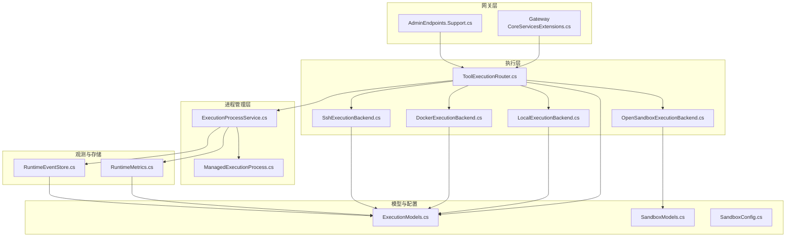
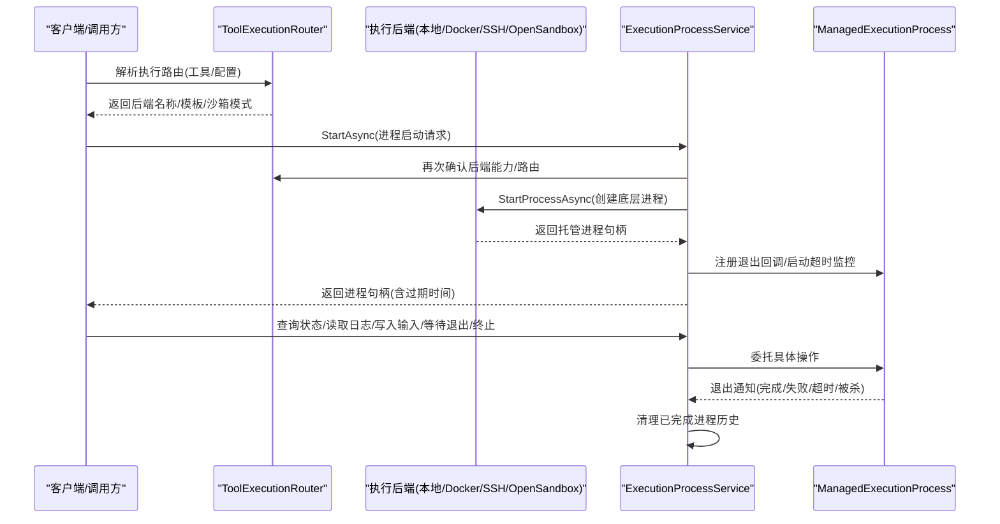
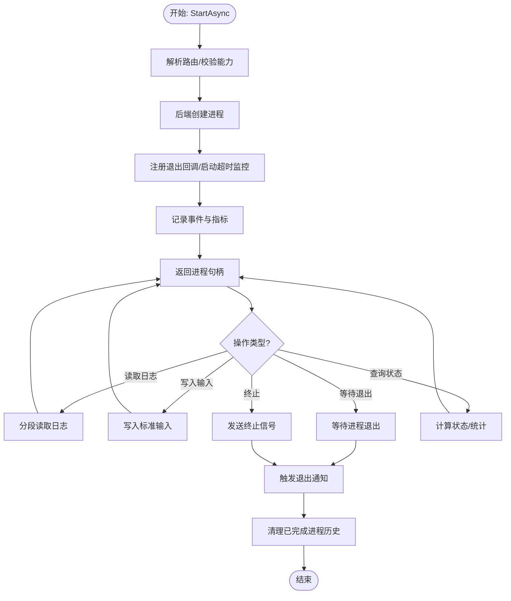
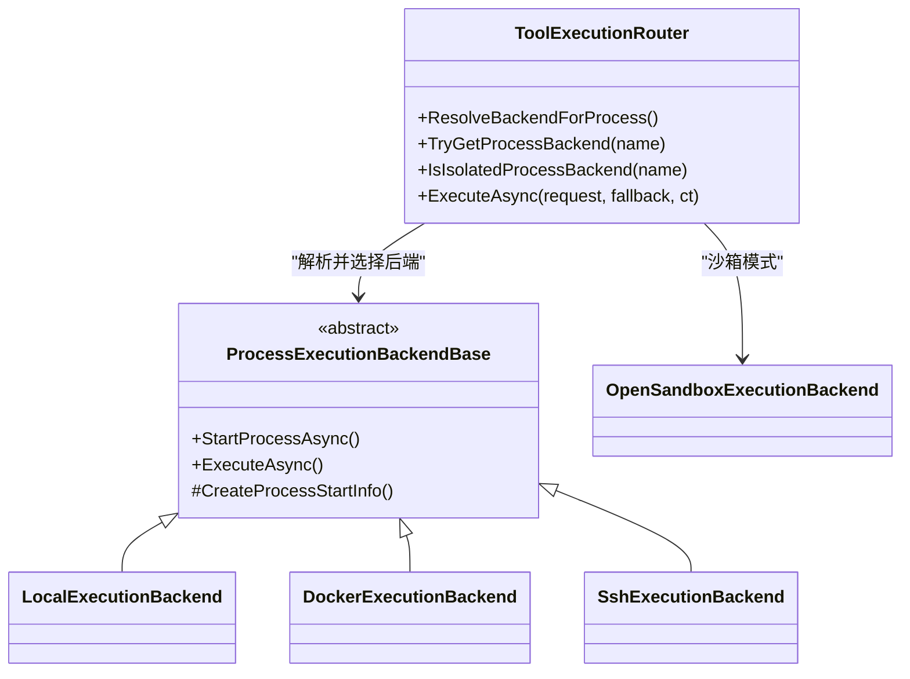
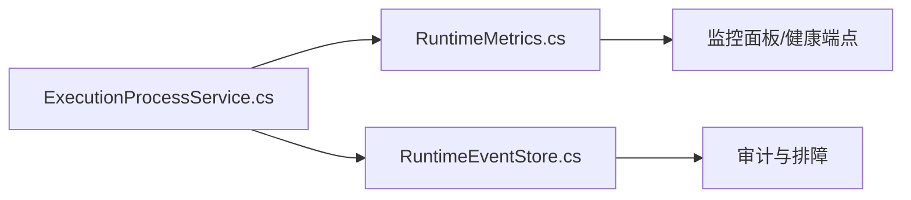
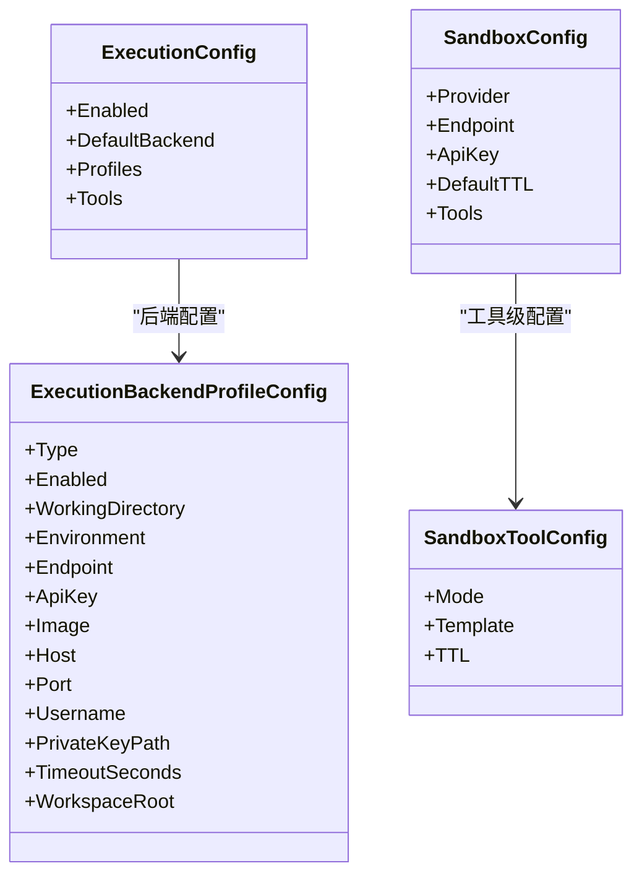
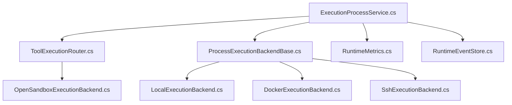
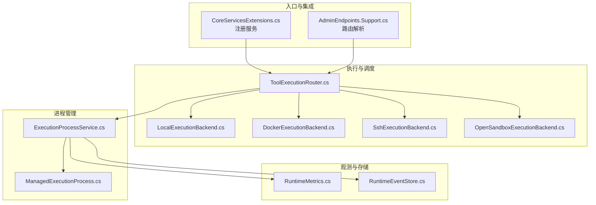

# 进程管理

<cite>
**本文引用的文件**
- [ExecutionProcessService.cs](file://src/OpenClaw.Agent/Execution/ExecutionProcessService.cs)
- [ToolExecutionRouter.cs](file://src/OpenClaw.Agent/Execution/ToolExecutionRouter.cs)
- [ProcessExecutionBackendBase.cs](file://src/OpenClaw.Agent/Execution/ProcessExecutionBackendBase.cs)
- [LocalExecutionBackend.cs](file://src/OpenClaw.Agent/Execution/LocalExecutionBackend.cs)
- [DockerExecutionBackend.cs](file://src/OpenClaw.Agent/Execution/DockerExecutionBackend.cs)
- [SshExecutionBackend.cs](file://src/OpenClaw.Agent/Execution/SshExecutionBackend.cs)
- [OpenSandboxExecutionBackend.cs](file://src/OpenClaw.Agent/Execution/OpenSandboxExecutionBackend.cs)
- [ExecutionModels.cs](file://src/OpenClaw.Core/Models/ExecutionModels.cs)
- [SandboxModels.cs](file://src/OpenClaw.Core/Models/SandboxModels.cs)
- [SandboxConfig.cs](file://src/OpenClaw.Core/Models/SandboxConfig.cs)
- [RuntimeMetrics.cs](file://src/OpenClaw.Core/Observability/RuntimeMetrics.cs)
- [RuntimeEventStore.cs](file://src/OpenClaw.Gateway/RuntimeEventStore.cs)
- [CoreServicesExtensions.cs](file://src/OpenClaw.Gateway/Composition/CoreServicesExtensions.cs)
- [AdminEndpoints.Support.cs](file://src/OpenClaw.Gateway/Endpoints/AdminEndpoints.Support.cs)
- [ProcessToolTests.cs](file://src/OpenClaw.Tests/ProcessToolTests.cs)
</cite>

## 目录
1. [简介](#简介)
2. [项目结构](#项目结构)
3. [核心组件](#核心组件)
4. [架构总览](#架构总览)
5. [详细组件分析](#详细组件分析)
6. [依赖关系分析](#依赖关系分析)
7. [性能考量](#性能考量)
8. [故障排查指南](#故障排查指南)
9. [结论](#结论)
10. [附录](#附录)

## 简介
本文件系统化阐述进程管理子系统的生命周期管理、进程池调度与资源监控机制，覆盖进程启动、停止、重启与异常处理策略，并文档化配置参数、性能指标与故障恢复机制。文档提供架构图与监控面板示例，帮助开发者与运维人员快速理解与使用。

## 项目结构
进程管理相关代码主要分布在以下模块：
- 执行路由与后端：ToolExecutionRouter、各 ExecutionBackend 实现
- 进程服务与托管：ExecutionProcessService、ManagedExecutionProcess
- 模型与配置：ExecutionModels、SandboxModels、SandboxConfig
- 观测性与事件：RuntimeMetrics、RuntimeEventStore
- 网关集成：CoreServicesExtensions、AdminEndpoints.Support

**图表来源**
- [CoreServicesExtensions.cs:157-183](file://src/OpenClaw.Gateway/Composition/CoreServicesExtensions.cs#L157-L183)
- [ToolExecutionRouter.cs:1-253](file://src/OpenClaw.Agent/Execution/ToolExecutionRouter.cs#L1-L253)
- [ExecutionProcessService.cs:278-522](file://src/OpenClaw.Agent/Execution/ExecutionProcessService.cs#L278-L522)
- [RuntimeMetrics.cs:10-312](file://src/OpenClaw.Core/Observability/RuntimeMetrics.cs#L10-L312)
- [RuntimeEventStore.cs:8-87](file://src/OpenClaw.Gateway/RuntimeEventStore.cs#L8-L87)
- [ExecutionModels.cs:1-179](file://src/OpenClaw.Core/Models/ExecutionModels.cs#L1-L179)
- [SandboxModels.cs:1-28](file://src/OpenClaw.Core/Models/SandboxModels.cs#L1-L28)
- [SandboxConfig.cs:1-47](file://src/OpenClaw.Core/Models/SandboxConfig.cs#L1-L47)

**章节来源**
- [CoreServicesExtensions.cs:157-183](file://src/OpenClaw.Gateway/Composition/CoreServicesExtensions.cs#L157-L183)
- [ToolExecutionRouter.cs:1-253](file://src/OpenClaw.Agent/Execution/ToolExecutionRouter.cs#L1-L253)
- [ExecutionProcessService.cs:278-522](file://src/OpenClaw.Agent/Execution/ExecutionProcessService.cs#L278-L522)
- [RuntimeMetrics.cs:10-312](file://src/OpenClaw.Core/Observability/RuntimeMetrics.cs#L10-L312)
- [RuntimeEventStore.cs:8-87](file://src/OpenClaw.Gateway/RuntimeEventStore.cs#L8-L87)
- [ExecutionModels.cs:1-179](file://src/OpenClaw.Core/Models/ExecutionModels.cs#L1-L179)
- [SandboxModels.cs:1-28](file://src/OpenClaw.Core/Models/SandboxModels.cs#L1-L28)
- [SandboxConfig.cs:1-47](file://src/OpenClaw.Core/Models/SandboxConfig.cs#L1-L47)

## 核心组件
- 执行路由与调度：ToolExecutionRouter 负责根据工具与配置解析执行后端，支持本地、Docker、SSH、OpenSandbox，并可按需回退。
- 进程服务与生命周期：ExecutionProcessService 提供进程启动、状态查询、日志读取、输入写入、等待退出与终止；内部维护进程字典并进行历史清理。
- 托管进程：ManagedExecutionProcess 封装底层 Process，负责捕获输出、超时监控、退出通知与资源释放。
- 后端实现：ProcessExecutionBackendBase 及其派生类封装不同执行后端的进程创建与执行细节。
- 观测与事件：RuntimeMetrics 提供进程相关计数器与仪表盘可用的快照；RuntimeEventStore 记录运行时事件供审计与排障。
- 配置模型：ExecutionModels 定义执行配置、请求/结果、进程句柄与状态等；SandboxModels/SandboxConfig 描述沙箱模式与模板。

**章节来源**
- [ToolExecutionRouter.cs:164-203](file://src/OpenClaw.Agent/Execution/ToolExecutionRouter.cs#L164-L203)
- [ExecutionProcessService.cs:301-377](file://src/OpenClaw.Agent/Execution/ExecutionProcessService.cs#L301-L377)
- [ProcessExecutionBackendBase.cs:8-142](file://src/OpenClaw.Agent/Execution/ProcessExecutionBackendBase.cs#L8-L142)
- [RuntimeMetrics.cs:31-127](file://src/OpenClaw.Core/Observability/RuntimeMetrics.cs#L31-L127)
- [RuntimeEventStore.cs:28-85](file://src/OpenClaw.Gateway/RuntimeEventStore.cs#L28-L85)
- [ExecutionModels.cs:8-179](file://src/OpenClaw.Core/Models/ExecutionModels.cs#L8-L179)
- [SandboxModels.cs:1-28](file://src/OpenClaw.Core/Models/SandboxModels.cs#L1-L28)
- [SandboxConfig.cs:1-47](file://src/OpenClaw.Core/Models/SandboxConfig.cs#L1-L47)

## 架构总览
下图展示从网关到执行后端再到进程服务的整体调用链路与职责边界。

**图表来源**
- [ToolExecutionRouter.cs:164-203](file://src/OpenClaw.Agent/Execution/ToolExecutionRouter.cs#L164-L203)
- [ExecutionProcessService.cs:301-377](file://src/OpenClaw.Agent/Execution/ExecutionProcessService.cs#L301-L377)
- [ProcessExecutionBackendBase.cs:23-44](file://src/OpenClaw.Agent/Execution/ProcessExecutionBackendBase.cs#L23-L44)
- [RuntimeEventStore.cs:28-47](file://src/OpenClaw.Gateway/RuntimeEventStore.cs#L28-L47)

## 详细组件分析

### 组件一：进程生命周期管理
- 启动流程：路由解析 → 能力校验 → 后端创建 → 注册退出回调 → 启动超时监控 → 记录事件与指标。
- 状态查询：Running/Completed/Killed/Failed/TimedOut，包含退出码、时延、输出字节统计。
- 日志读取：分段偏移读取 stdout/stderr，支持最大字符限制。
- 输入写入：向标准输入写入数据并刷新。
- 等待退出：阻塞直到进程结束或取消。
- 终止：发送 kill 并等待退出。
- 历史清理：定期清理超时或超出保留数量的历史进程，避免内存膨胀。

**图表来源**
- [ExecutionProcessService.cs:301-377](file://src/OpenClaw.Agent/Execution/ExecutionProcessService.cs#L301-L377)
- [ExecutionProcessService.cs:395-430](file://src/OpenClaw.Agent/Execution/ExecutionProcessService.cs#L395-L430)
- [ExecutionProcessService.cs:491-520](file://src/OpenClaw.Agent/Execution/ExecutionProcessService.cs#L491-L520)

**章节来源**
- [ExecutionProcessService.cs:17-276](file://src/OpenClaw.Agent/Execution/ExecutionProcessService.cs#L17-L276)
- [ExecutionProcessService.cs:379-430](file://src/OpenClaw.Agent/Execution/ExecutionProcessService.cs#L379-L430)
- [ExecutionProcessService.cs:491-520](file://src/OpenClaw.Agent/Execution/ExecutionProcessService.cs#L491-L520)

### 组件二：进程池调度与后端适配
- 路由解析：优先工具级配置，其次沙箱模式，最后默认后端；支持回退后端。
- 后端能力：本地(Docker/SSH/OpenSandbox)均实现 IExecutionProcessBackend 或 IExecutionBackend，统一对外接口。
- 工作目录与工作区：本地后端可强制工作区限制，防止越权访问。
- 超时控制：统一通过 ProcessExecutionBackendBase 的执行流程实现超时与终止。

**图表来源**
- [ToolExecutionRouter.cs:164-203](file://src/OpenClaw.Agent/Execution/ToolExecutionRouter.cs#L164-L203)
- [ProcessExecutionBackendBase.cs:8-142](file://src/OpenClaw.Agent/Execution/ProcessExecutionBackendBase.cs#L8-L142)
- [LocalExecutionBackend.cs:6-99](file://src/OpenClaw.Agent/Execution/LocalExecutionBackend.cs#L6-L99)
- [DockerExecutionBackend.cs:6-66](file://src/OpenClaw.Agent/Execution/DockerExecutionBackend.cs#L6-L66)
- [SshExecutionBackend.cs:6-63](file://src/OpenClaw.Agent/Execution/SshExecutionBackend.cs#L6-L63)
- [OpenSandboxExecutionBackend.cs:7-69](file://src/OpenClaw.Agent/Execution/OpenSandboxExecutionBackend.cs#L7-L69)

**章节来源**
- [ToolExecutionRouter.cs:65-203](file://src/OpenClaw.Agent/Execution/ToolExecutionRouter.cs#L65-L203)
- [ProcessExecutionBackendBase.cs:19-128](file://src/OpenClaw.Agent/Execution/ProcessExecutionBackendBase.cs#L19-L128)
- [LocalExecutionBackend.cs:53-83](file://src/OpenClaw.Agent/Execution/LocalExecutionBackend.cs#L53-L83)
- [DockerExecutionBackend.cs:22-64](file://src/OpenClaw.Agent/Execution/DockerExecutionBackend.cs#L22-L64)
- [SshExecutionBackend.cs:22-62](file://src/OpenClaw.Agent/Execution/SshExecutionBackend.cs#L22-L62)
- [OpenSandboxExecutionBackend.cs:22-67](file://src/OpenClaw.Agent/Execution/OpenSandboxExecutionBackend.cs#L22-L67)

### 组件三：资源监控与可观测性
- 指标体系：进程启动/完成/失败/被杀/超时计数，保留进程数等。
- 快照导出：用于健康检查与监控面板。
- 运行时事件：以 JSONL 形式持久化，支持按会话/通道/发送者/组件/动作筛选查询。

**图表来源**
- [ExecutionProcessService.cs:468-489](file://src/OpenClaw.Agent/Execution/ExecutionProcessService.cs#L468-L489)
- [RuntimeMetrics.cs:147-181](file://src/OpenClaw.Core/Observability/RuntimeMetrics.cs#L147-L181)
- [RuntimeEventStore.cs:28-85](file://src/OpenClaw.Gateway/RuntimeEventStore.cs#L28-L85)

**章节来源**
- [RuntimeMetrics.cs:31-127](file://src/OpenClaw.Core/Observability/RuntimeMetrics.cs#L31-L127)
- [RuntimeEventStore.cs:28-85](file://src/OpenClaw.Gateway/RuntimeEventStore.cs#L28-L85)
- [ExecutionProcessService.cs:468-489](file://src/OpenClaw.Agent/Execution/ExecutionProcessService.cs#L468-L489)

### 组件四：配置参数与沙箱策略
- 执行配置：启用开关、默认后端、后端配置(类型/工作目录/环境/镜像/主机/凭据/超时/工作区根)、工具路由。
- 沙箱配置：提供者、端点、密钥、默认TTL、工具级TTL与模板映射。
- 沙箱模式：None/Prefer/Require，影响路由决策与能力要求。

**图表来源**
- [ExecutionModels.cs:8-41](file://src/OpenClaw.Core/Models/ExecutionModels.cs#L8-L41)
- [SandboxConfig.cs:3-27](file://src/OpenClaw.Core/Models/SandboxConfig.cs#L3-L27)

**章节来源**
- [ExecutionModels.cs:8-60](file://src/OpenClaw.Core/Models/ExecutionModels.cs#L8-L60)
- [SandboxConfig.cs:1-47](file://src/OpenClaw.Core/Models/SandboxConfig.cs#L1-L47)

## 依赖关系分析
- 组件耦合：ExecutionProcessService 依赖 ToolExecutionRouter 与各后端实现；后端实现依赖 ProcessExecutionBackendBase 抽象；RuntimeMetrics 与 RuntimeEventStore 作为横切关注点被注入。
- 外部依赖：Process 类、Docker/SSH 命令、OpenSandbox 接口。
- 回退策略：当指定后端不支持后台进程或沙箱模式冲突时，路由提供回退逻辑。

**图表来源**
- [ExecutionProcessService.cs:283-299](file://src/OpenClaw.Agent/Execution/ExecutionProcessService.cs#L283-L299)
- [ToolExecutionRouter.cs:20-63](file://src/OpenClaw.Agent/Execution/ToolExecutionRouter.cs#L20-L63)
- [ProcessExecutionBackendBase.cs:8-17](file://src/OpenClaw.Agent/Execution/ProcessExecutionBackendBase.cs#L8-L17)
- [LocalExecutionBackend.cs:6-25](file://src/OpenClaw.Agent/Execution/LocalExecutionBackend.cs#L6-L25)
- [DockerExecutionBackend.cs:6-17](file://src/OpenClaw.Agent/Execution/DockerExecutionBackend.cs#L6-L17)
- [SshExecutionBackend.cs:6-17](file://src/OpenClaw.Agent/Execution/SshExecutionBackend.cs#L6-L17)
- [OpenSandboxExecutionBackend.cs:7-18](file://src/OpenClaw.Agent/Execution/OpenSandboxExecutionBackend.cs#L7-L18)
- [RuntimeMetrics.cs:10-312](file://src/OpenClaw.Core/Observability/RuntimeMetrics.cs#L10-L312)
- [RuntimeEventStore.cs:8-26](file://src/OpenClaw.Gateway/RuntimeEventStore.cs#L8-L26)

**章节来源**
- [ToolExecutionRouter.cs:164-203](file://src/OpenClaw.Agent/Execution/ToolExecutionRouter.cs#L164-L203)
- [ExecutionProcessService.cs:301-377](file://src/OpenClaw.Agent/Execution/ExecutionProcessService.cs#L301-L377)

## 性能考量
- 进程历史保留：最多保留固定数量与时间窗口内的已完成进程，避免内存与句柄泄漏。
- 输出缓冲：使用线程安全的 StringBuilder 与锁保护，降低并发读写竞争。
- 超时监控：独立任务基于 TaskCompletionSource 与 CTS 实现非阻塞超时检测。
- 指标与快照：使用 Interlocked/Volatile 实现无锁读取，适合高并发场景。
- I/O 限流：日志读取支持最大字符限制，防止一次性拉取过大内容。

**章节来源**
- [ExecutionProcessService.cs:280-281](file://src/OpenClaw.Agent/Execution/ExecutionProcessService.cs#L280-L281)
- [ExecutionProcessService.cs:491-520](file://src/OpenClaw.Agent/Execution/ExecutionProcessService.cs#L491-L520)
- [ProcessExecutionBackendBase.cs:19-128](file://src/OpenClaw.Agent/Execution/ProcessExecutionBackendBase.cs#L19-L128)
- [RuntimeMetrics.cs:129-181](file://src/OpenClaw.Core/Observability/RuntimeMetrics.cs#L129-L181)

## 故障排查指南
- 启动失败
  - 沙箱模式冲突：当工具要求沙箱且 OpenSandbox 不支持后台进程时，会抛出异常提示更换后端或禁用该表面。
  - 后端不可用：指定后端未配置或不支持后台进程，抛出异常。
  - 工作区拒绝：本地后端在 RequireWorkspace=true 时，若工作目录越权则拒绝执行。
- 进程异常
  - 超时：超时后自动终止并上报“timed_out”事件与指标。
  - 被终止：显式 KillAsync 导致“killed”，并更新指标。
  - 退出码非零：标记为“failed”，并更新失败计数。
- 事件与审计
  - 使用 RuntimeEventStore 查询最近事件，按会话/通道/发送者/组件/动作过滤。
  - 健康端点可读取 RuntimeMetrics 快照，辅助定位异常峰值。

**章节来源**
- [ExecutionProcessService.cs:306-335](file://src/OpenClaw.Agent/Execution/ExecutionProcessService.cs#L306-L335)
- [LocalExecutionBackend.cs:53-83](file://src/OpenClaw.Agent/Execution/LocalExecutionBackend.cs#L53-L83)
- [RuntimeEventStore.cs:51-85](file://src/OpenClaw.Gateway/RuntimeEventStore.cs#L51-L85)
- [RuntimeMetrics.cs:147-152](file://src/OpenClaw.Core/Observability/RuntimeMetrics.cs#L147-L152)

## 结论
该进程管理子系统通过清晰的路由与后端抽象、完善的生命周期管理与可观测性，实现了对多后端进程的统一调度与监控。结合配置化的沙箱策略与严格的权限控制，既保证了灵活性，也确保了安全性与稳定性。

## 附录

### A. 进程管理架构图

**图表来源**
- [CoreServicesExtensions.cs:157-183](file://src/OpenClaw.Gateway/Composition/CoreServicesExtensions.cs#L157-L183)
- [AdminEndpoints.Support.cs:1581-1611](file://src/OpenClaw.Gateway/Endpoints/AdminEndpoints.Support.cs#L1581-L1611)
- [ToolExecutionRouter.cs:1-253](file://src/OpenClaw.Agent/Execution/ToolExecutionRouter.cs#L1-L253)
- [ExecutionProcessService.cs:278-522](file://src/OpenClaw.Agent/Execution/ExecutionProcessService.cs#L278-L522)
- [RuntimeMetrics.cs:10-312](file://src/OpenClaw.Core/Observability/RuntimeMetrics.cs#L10-L312)
- [RuntimeEventStore.cs:8-87](file://src/OpenClaw.Gateway/RuntimeEventStore.cs#L8-L87)

### B. 监控面板示例字段
- 进程相关指标
  - ProcessStarts：进程启动总数
  - ProcessCompletions：正常完成数
  - ProcessFailures：失败数
  - ProcessKills：被终止数
  - ProcessTimeouts：超时数
  - ProcessHistoryEvictions：历史清理数
  - RetainedProcesses：当前保留进程数
- 其他关键指标
  - ActiveSessions：活跃会话数
  - SandboxLeaseCreates/Reuses/Recoveries：沙箱租约统计
  - RetentionSweepRuns/Failures：保留策略运行统计
  - PulseRuns/PulseErrors：心跳/脉冲运行统计

**章节来源**
- [RuntimeMetrics.cs:90-127](file://src/OpenClaw.Core/Observability/RuntimeMetrics.cs#L90-L127)
- [RuntimeMetrics.cs:189-250](file://src/OpenClaw.Core/Observability/RuntimeMetrics.cs#L189-L250)

### C. 关键测试参考
- 进程服务保留有限历史上限的行为验证，确保在大量短生命周期进程下的稳定性。

**章节来源**
- [ProcessToolTests.cs:245-268](file://src/OpenClaw.Tests/ProcessToolTests.cs#L245-L268)