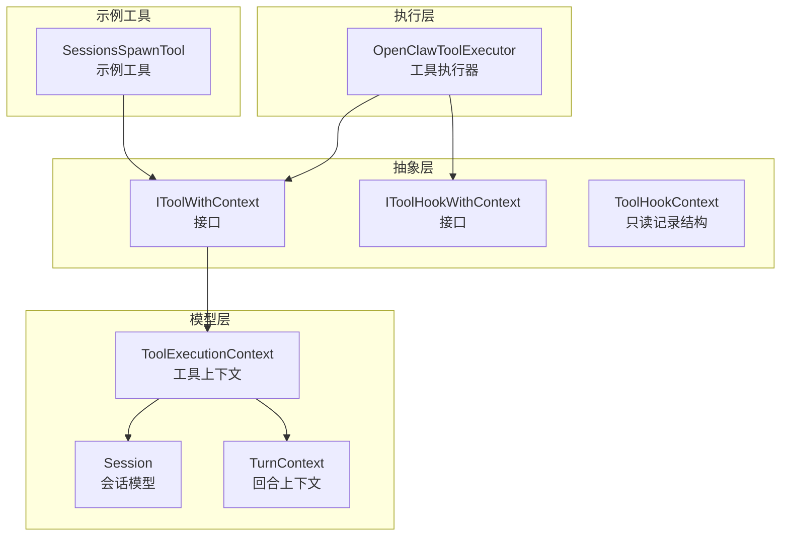
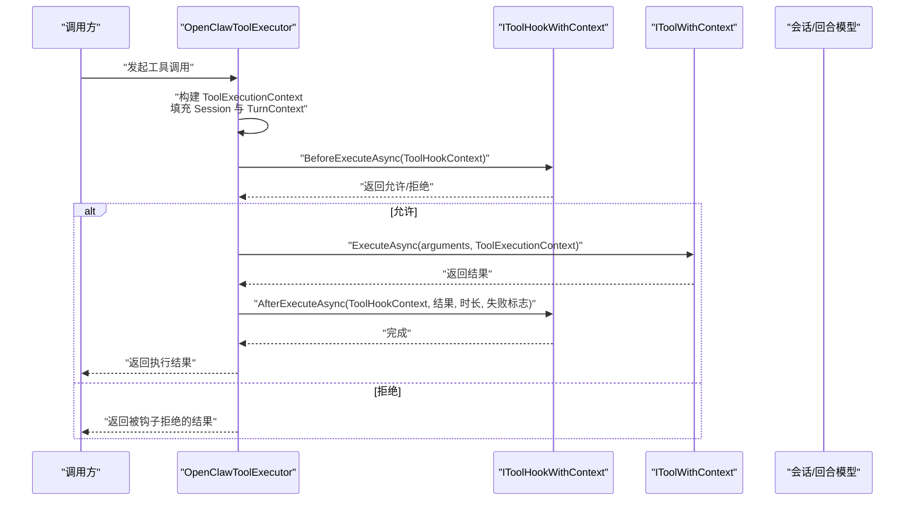
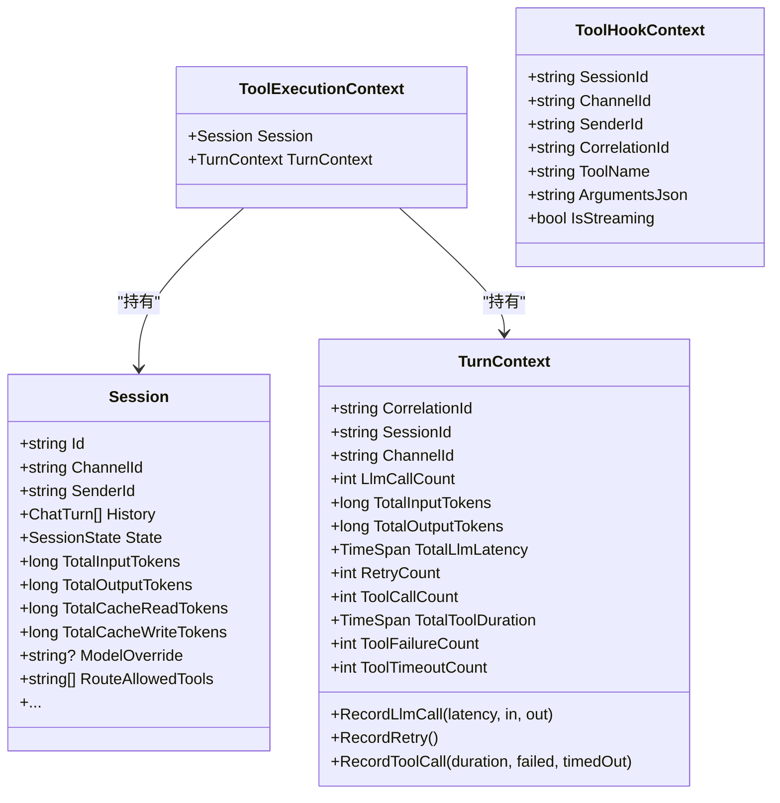
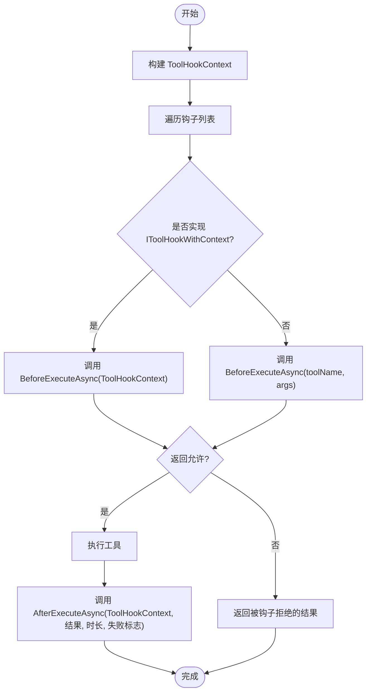
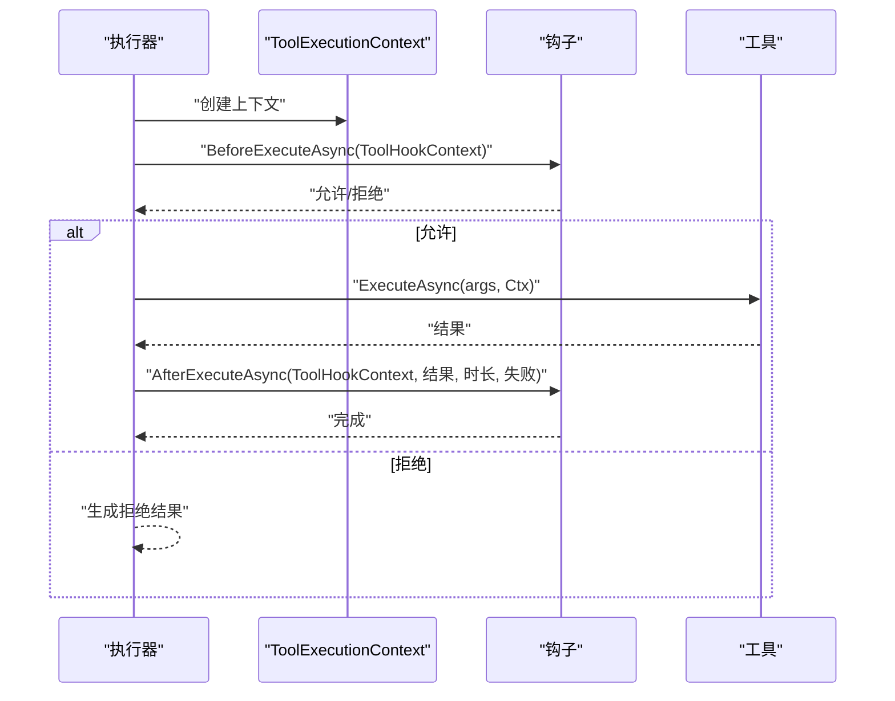
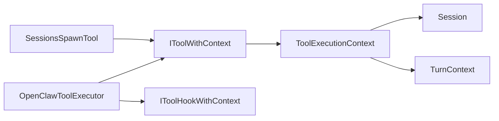

# 工具上下文管理

<cite>
**本文档引用的文件**
- [IToolWithContext.cs](file://src/OpenClaw.Core/Abstractions/IToolWithContext.cs)
- [IToolHookWithContext.cs](file://src/OpenClaw.Core/Abstractions/IToolHookWithContext.cs)
- [ToolHookContext.cs](file://src/OpenClaw.Core/Abstractions/ToolHookContext.cs)
- [Session.cs](file://src/OpenClaw.Core/Models/Session.cs)
- [TurnContext.cs](file://src/OpenClaw.Core/Observability/TurnContext.cs)
- [OpenClawToolExecutor.cs](file://src/OpenClaw.Agent/OpenClawToolExecutor.cs)
- [SessionsSpawnTool.cs](file://src/OpenClaw.Gateway/Tools/SessionsSpawnTool.cs)
</cite>

## 目录
1. [简介](#简介)
2. [项目结构](#项目结构)
3. [核心组件](#核心组件)
4. [架构总览](#架构总览)
5. [详细组件分析](#详细组件分析)
6. [依赖关系分析](#依赖关系分析)
7. [性能考虑](#性能考虑)
8. [故障排除指南](#故障排除指南)
9. [结论](#结论)
10. [附录](#附录)

## 简介
本文件系统性地文档化了工具上下文管理系统的设计与实现，重点涵盖以下方面：
- 工具上下文的创建、传递与管理机制
- IToolWithContext 接口设计与上下文钩子（IToolHookWithContext）的作用
- 上下文数据结构（ToolExecutionContext、ToolHookContext）与生命周期管理
- 状态保持与跨组件协作方式
- 架构图、使用示例与最佳实践

该系统通过统一的上下文载体将会话信息（Session）与请求级指标（TurnContext）注入到工具执行链路中，确保工具在执行时具备必要的会话语境与可观测性元数据。

## 项目结构
围绕工具上下文管理的核心代码分布在以下模块：
- 抽象层：定义上下文接口与数据结构
- 模型层：会话与回合级上下文模型
- 执行层：工具执行器负责上下文构建与传递
- 示例工具：展示如何在具体工具中使用上下文

**图表来源**
- [IToolWithContext.cs:6-15](file://src/OpenClaw.Core/Abstractions/IToolWithContext.cs#L6-L15)
- [IToolHookWithContext.cs:7-12](file://src/OpenClaw.Core/Abstractions/IToolHookWithContext.cs#L7-L12)
- [ToolHookContext.cs:6-17](file://src/OpenClaw.Core/Abstractions/ToolHookContext.cs#L6-L17)
- [Session.cs:15-135](file://src/OpenClaw.Core/Models/Session.cs#L15-L135)
- [TurnContext.cs:12-75](file://src/OpenClaw.Core/Observability/TurnContext.cs#L12-L75)
- [OpenClawToolExecutor.cs:976-998](file://src/OpenClaw.Agent/OpenClawToolExecutor.cs#L976-L998)
- [SessionsSpawnTool.cs:30-56](file://src/OpenClaw.Gateway/Tools/SessionsSpawnTool.cs#L30-L56)

**章节来源**
- [IToolWithContext.cs:1-16](file://src/OpenClaw.Core/Abstractions/IToolWithContext.cs#L1-L16)
- [IToolHookWithContext.cs:1-13](file://src/OpenClaw.Core/Abstractions/IToolHookWithContext.cs#L1-L13)
- [ToolHookContext.cs:1-18](file://src/OpenClaw.Core/Abstractions/ToolHookContext.cs#L1-L18)
- [Session.cs:1-135](file://src/OpenClaw.Core/Models/Session.cs#L1-L135)
- [TurnContext.cs:1-76](file://src/OpenClaw.Core/Observability/TurnContext.cs#L1-L76)
- [OpenClawToolExecutor.cs:976-998](file://src/OpenClaw.Agent/OpenClawToolExecutor.cs#L976-L998)
- [SessionsSpawnTool.cs:30-56](file://src/OpenClaw.Gateway/Tools/SessionsSpawnTool.cs#L30-L56)

## 核心组件
- 工具上下文接口与数据结构
  - IToolWithContext：扩展 ITool 的上下文感知工具接口，提供带上下文的异步执行方法
  - ToolExecutionContext：封装会话与回合上下文，作为上下文载体
  - ToolHookContext：用于上下文钩子的只读上下文，包含会话标识、渠道、发送者、关联ID、工具名、参数与流式标记等
- 执行器与钩子
  - OpenClawToolExecutor：负责构建上下文、路由工具执行、调用钩子、记录指标与审计日志
  - IToolHookWithContext：可选的上下文钩子接口，支持在工具执行前后接收会话与关联ID等元数据

这些组件共同构成上下文驱动的工具执行管线，确保工具在执行时具备一致的会话语境与可观测性元数据。

**章节来源**
- [IToolWithContext.cs:6-15](file://src/OpenClaw.Core/Abstractions/IToolWithContext.cs#L6-L15)
- [IToolHookWithContext.cs:7-12](file://src/OpenClaw.Core/Abstractions/IToolHookWithContext.cs#L7-L12)
- [ToolHookContext.cs:6-17](file://src/OpenClaw.Core/Abstractions/ToolHookContext.cs#L6-L17)
- [OpenClawToolExecutor.cs:30-100](file://src/OpenClaw.Agent/OpenClawToolExecutor.cs#L30-L100)

## 架构总览
工具上下文管理的执行流程如下：

**图表来源**
- [OpenClawToolExecutor.cs:318-344](file://src/OpenClaw.Agent/OpenClawToolExecutor.cs#L318-L344)
- [OpenClawToolExecutor.cs:584-597](file://src/OpenClaw.Agent/OpenClawToolExecutor.cs#L584-L597)
- [OpenClawToolExecutor.cs:976-998](file://src/OpenClaw.Agent/OpenClawToolExecutor.cs#L976-L998)
- [IToolHookWithContext.cs:9-11](file://src/OpenClaw.Core/Abstractions/IToolHookWithContext.cs#L9-L11)
- [IToolWithContext.cs:12-15](file://src/OpenClaw.Core/Abstractions/IToolWithContext.cs#L12-L15)

## 详细组件分析

### 组件一：上下文数据结构
- ToolExecutionContext
  - 字段：Session（会话）、TurnContext（回合上下文）
  - 作用：作为 IToolWithContext 的执行上下文载体，贯穿工具执行全链路
- ToolHookContext
  - 字段：SessionId、ChannelId、SenderId、CorrelationId、ToolName、ArgumentsJson、IsStreaming
  - 作用：向上下文钩子提供会话与请求级元数据，便于审计、追踪与策略控制
- Session
  - 字段：会话标识、渠道、发送者、历史、状态、令牌用量、合同策略等
  - 作用：承载工具执行的会话语境，支持路由、配额、策略与治理
- TurnContext
  - 字段：CorrelationId、SessionId、ChannelId、LLM/工具指标计数器
  - 作用：提供请求级关联ID与并发安全的度量收集

**图表来源**
- [IToolWithContext.cs:6-10](file://src/OpenClaw.Core/Abstractions/IToolWithContext.cs#L6-L10)
- [ToolHookContext.cs:6-17](file://src/OpenClaw.Core/Abstractions/ToolHookContext.cs#L6-L17)
- [Session.cs:15-135](file://src/OpenClaw.Core/Models/Session.cs#L15-L135)
- [TurnContext.cs:12-75](file://src/OpenClaw.Core/Observability/TurnContext.cs#L12-L75)

**章节来源**
- [IToolWithContext.cs:6-10](file://src/OpenClaw.Core/Abstractions/IToolWithContext.cs#L6-L10)
- [ToolHookContext.cs:6-17](file://src/OpenClaw.Core/Abstractions/ToolHookContext.cs#L6-L17)
- [Session.cs:15-135](file://src/OpenClaw.Core/Models/Session.cs#L15-L135)
- [TurnContext.cs:12-75](file://src/OpenClaw.Core/Observability/TurnContext.cs#L12-L75)

### 组件二：上下文钩子与工具钩子
- IToolHookWithContext
  - BeforeExecuteAsync：在工具执行前接收 ToolHookContext，可用于鉴权、策略检查或审计
  - AfterExecuteAsync：在工具执行后接收结果、耗时与失败标志，用于审计与统计
- IToolHook
  - BeforeExecuteAsync：传统钩子接口，不携带上下文
  - AfterExecuteAsync：传统钩子接口，不携带上下文
- 执行器集成
  - 执行器在调用工具前，优先尝试调用 IToolHookWithContext；若未实现，则回退到 IToolHook
  - 执行完成后，同样按顺序调用 AfterExecuteAsync

**图表来源**
- [OpenClawToolExecutor.cs:318-344](file://src/OpenClaw.Agent/OpenClawToolExecutor.cs#L318-L344)
- [OpenClawToolExecutor.cs:584-597](file://src/OpenClaw.Agent/OpenClawToolExecutor.cs#L584-L597)
- [IToolHookWithContext.cs:9-11](file://src/OpenClaw.Core/Abstractions/IToolHookWithContext.cs#L9-L11)

**章节来源**
- [IToolHookWithContext.cs:7-12](file://src/OpenClaw.Core/Abstractions/IToolHookWithContext.cs#L7-L12)
- [OpenClawToolExecutor.cs:318-344](file://src/OpenClaw.Agent/OpenClawToolExecutor.cs#L318-L344)
- [OpenClawToolExecutor.cs:584-597](file://src/OpenClaw.Agent/OpenClawToolExecutor.cs#L584-L597)

### 组件三：上下文传递与生命周期
- 创建阶段
  - 执行器根据当前会话与回合上下文构造 ToolExecutionContext
  - 同时构建 ToolHookContext 供钩子使用
- 传递阶段
  - 若工具实现 IToolWithContext，则以 ToolExecutionContext 作为参数传入
  - 钩子在 BeforeExecute/AfterExecute 中接收 ToolHookContext
- 生命周期
  - 上下文随单次工具调用存在，不跨请求持久化
  - 会话与回合指标在 TurnContext 中累积，支持并发安全更新

**图表来源**
- [OpenClawToolExecutor.cs:976-998](file://src/OpenClaw.Agent/OpenClawToolExecutor.cs#L976-L998)
- [OpenClawToolExecutor.cs:318-344](file://src/OpenClaw.Agent/OpenClawToolExecutor.cs#L318-L344)
- [OpenClawToolExecutor.cs:584-597](file://src/OpenClaw.Agent/OpenClawToolExecutor.cs#L584-L597)

**章节来源**
- [OpenClawToolExecutor.cs:976-998](file://src/OpenClaw.Agent/OpenClawToolExecutor.cs#L976-L998)
- [OpenClawToolExecutor.cs:318-344](file://src/OpenClaw.Agent/OpenClawToolExecutor.cs#L318-L344)
- [OpenClawToolExecutor.cs:584-597](file://src/OpenClaw.Agent/OpenClawToolExecutor.cs#L584-L597)

### 组件四：示例工具与最佳实践
- 示例工具：SessionsSpawnTool 展示了如何在工具内部使用 ToolExecutionContext 获取会话与回合上下文，进行业务逻辑处理
- 最佳实践
  - 工具应尽量通过 IToolWithContext 访问上下文，避免直接依赖全局状态
  - 在钩子中仅使用 ToolHookContext 提供的必要字段，避免耦合具体工具实现
  - 对敏感参数进行脱敏处理，确保审计日志与监控数据的安全性
  - 使用 TurnContext 记录工具调用指标，便于性能分析与成本控制

**章节来源**
- [SessionsSpawnTool.cs:30-56](file://src/OpenClaw.Gateway/Tools/SessionsSpawnTool.cs#L30-L56)
- [OpenClawToolExecutor.cs:165-166](file://src/OpenClaw.Agent/OpenClawToolExecutor.cs#L165-L166)
- [TurnContext.cs:49-65](file://src/OpenClaw.Core/Observability/TurnContext.cs#L49-L65)

## 依赖关系分析
- 耦合关系
  - IToolWithContext 依赖 ToolExecutionContext
  - ToolExecutionContext 依赖 Session 与 TurnContext
  - OpenClawToolExecutor 同时依赖 IToolWithContext 与 IToolHookWithContext
  - 示例工具（如 SessionsSpawnTool）依赖 IToolWithContext
- 内聚性
  - 上下文相关逻辑集中在抽象层与执行器，工具实现保持轻量
- 外部依赖
  - 执行器通过钩子与治理服务、审计日志、指标系统集成，形成松耦合扩展点

**图表来源**
- [IToolWithContext.cs:6-15](file://src/OpenClaw.Core/Abstractions/IToolWithContext.cs#L6-L15)
- [OpenClawToolExecutor.cs:976-998](file://src/OpenClaw.Agent/OpenClawToolExecutor.cs#L976-L998)
- [SessionsSpawnTool.cs:30-56](file://src/OpenClaw.Gateway/Tools/SessionsSpawnTool.cs#L30-L56)

**章节来源**
- [IToolWithContext.cs:6-15](file://src/OpenClaw.Core/Abstractions/IToolWithContext.cs#L6-L15)
- [OpenClawToolExecutor.cs:976-998](file://src/OpenClaw.Agent/OpenClawToolExecutor.cs#L976-L998)
- [SessionsSpawnTool.cs:30-56](file://src/OpenClaw.Gateway/Tools/SessionsSpawnTool.cs#L30-L56)

## 性能考虑
- 并发安全
  - TurnContext 使用原子操作更新指标，支持并发工具执行场景下的安全计数
- 超时与取消
  - 执行器在调用工具时结合超时与取消令牌，避免长时间阻塞
- 流式输出
  - 对流式工具，执行器在收集结果的同时进行脱敏与分发，控制内存占用
- 指标与审计
  - 执行器在工具执行前后记录指标与审计事件，便于后续优化与合规审计

[本节为通用指导，无需特定文件来源]

## 故障排除指南
- 工具未实现 IToolWithContext
  - 现象：工具无法访问会话与回合上下文
  - 处理：为工具实现 IToolWithContext 或在执行器中回退到标准 ITool 接口
- 钩子抛出异常
  - 现象：BeforeExecute/AfterExecute 异常导致执行中断
  - 处理：在钩子实现中捕获异常并记录日志，确保不影响主流程
- 上下文为空或字段缺失
  - 现象：ToolHookContext 或 ToolExecutionContext 字段为空
  - 处理：检查执行器上下文构建逻辑，确保必填字段已正确填充
- 超时与取消
  - 现象：工具执行超时或被取消
  - 处理：调整超时配置或检查工具实现中的阻塞操作

**章节来源**
- [OpenClawToolExecutor.cs:340-343](file://src/OpenClaw.Agent/OpenClawToolExecutor.cs#L340-L343)
- [OpenClawToolExecutor.cs:483-530](file://src/OpenClaw.Agent/OpenClawToolExecutor.cs#L483-L530)
- [OpenClawToolExecutor.cs:982-987](file://src/OpenClaw.Agent/OpenClawToolExecutor.cs#L982-L987)

## 结论
工具上下文管理系统通过统一的上下文载体与钩子机制，实现了对工具执行过程的可观测、可审计与可扩展。IToolWithContext 与 ToolExecutionContext 为工具提供了稳定的会话语境，而 IToolHookWithContext 则为策略控制与审计提供了入口。执行器在生命周期各阶段正确传递与使用上下文，确保系统在复杂场景下仍能保持一致性与可靠性。

[本节为总结，无需特定文件来源]

## 附录
- 使用示例路径
  - [IToolWithContext 接口定义:12-15](file://src/OpenClaw.Core/Abstractions/IToolWithContext.cs#L12-L15)
  - [ToolExecutionContext 数据结构:6-10](file://src/OpenClaw.Core/Abstractions/IToolWithContext.cs#L6-L10)
  - [ToolHookContext 数据结构:6-17](file://src/OpenClaw.Core/Abstractions/ToolHookContext.cs#L6-L17)
  - [OpenClawToolExecutor 上下文构建与传递:976-998](file://src/OpenClaw.Agent/OpenClawToolExecutor.cs#L976-L998)
  - [示例工具 SessionsSpawnTool:30-56](file://src/OpenClaw.Gateway/Tools/SessionsSpawnTool.cs#L30-L56)

[本节为补充信息，无需特定文件来源]