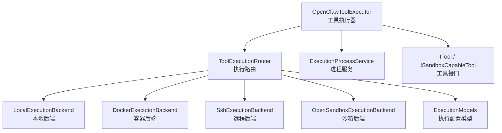
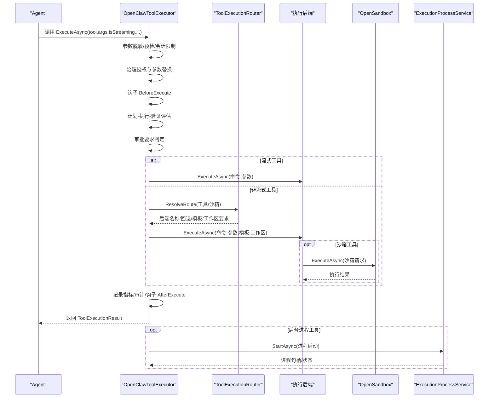
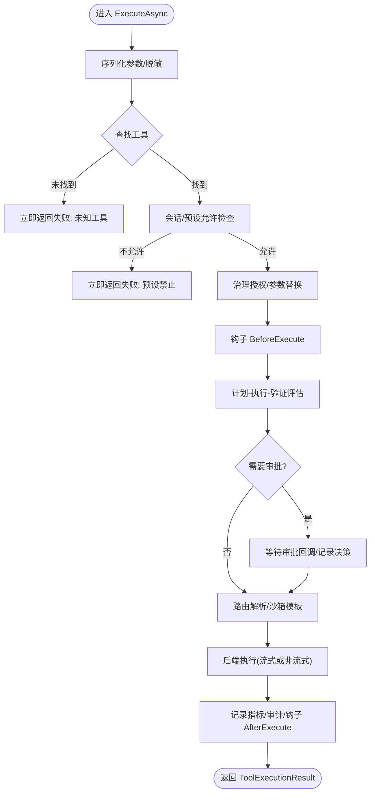
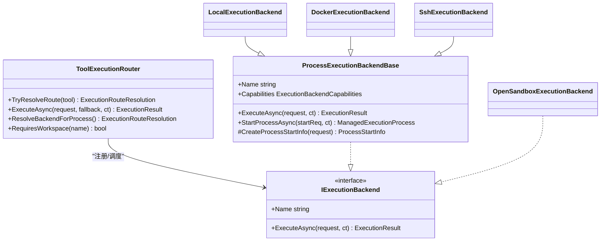
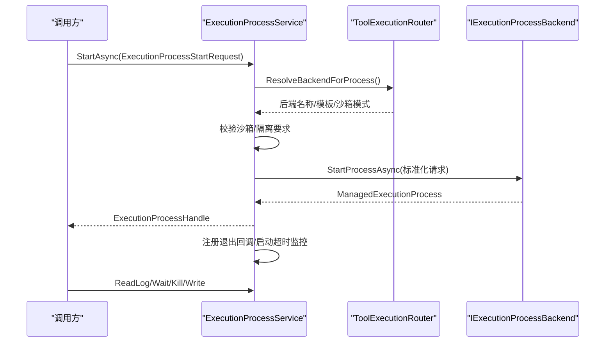
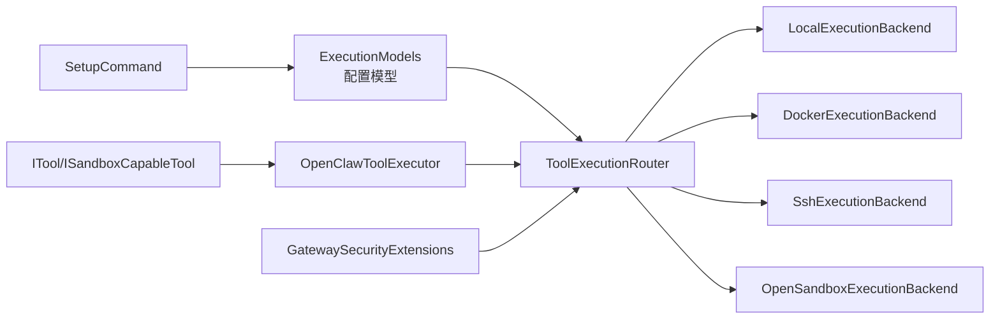

# 工具执行引擎

<cite>
**本文档引用的文件**
- [OpenClawToolExecutor.cs](file://src/OpenClaw.Agent/OpenClawToolExecutor.cs)
- [ToolExecutionRouter.cs](file://src/OpenClaw.Agent/Execution/ToolExecutionRouter.cs)
- [LocalExecutionBackend.cs](file://src/OpenClaw.Agent/Execution/LocalExecutionBackend.cs)
- [DockerExecutionBackend.cs](file://src/OpenClaw.Agent/Execution/DockerExecutionBackend.cs)
- [SshExecutionBackend.cs](file://src/OpenClaw.Agent/Execution/SshExecutionBackend.cs)
- [OpenSandboxExecutionBackend.cs](file://src/OpenClaw.Agent/Execution/OpenSandboxExecutionBackend.cs)
- [ProcessExecutionBackendBase.cs](file://src/OpenClaw.Agent/Execution/ProcessExecutionBackendBase.cs)
- [ExecutionProcessService.cs](file://src/OpenClaw.Agent/Execution/ExecutionProcessService.cs)
- [ITool.cs](file://src/OpenClaw.Core/Abstractions/ITool.cs)
- [IExecutionBackend.cs](file://src/OpenClaw.Core/Abstractions/IExecutionBackend.cs)
- [ISandboxCapableTool.cs](file://src/OpenClaw.Core/Abstractions/ISandboxCapableTool.cs)
- [ExecutionModels.cs](file://src/OpenClaw.Core/Models/ExecutionModels.cs)
- [OpenClawToolExecutorTests.cs](file://src/OpenClaw.Tests/OpenClawToolExecutorTests.cs)
- [ProcessToolTests.cs](file://src/OpenClaw.Tests/ProcessToolTests.cs)
- [SetupCommand.cs](file://src/OpenClaw.Cli/SetupCommand.cs)
- [GatewaySecurityExtensions.cs](file://src/OpenClaw.Gateway/Extensions/GatewaySecurityExtensions.cs)
- [SandboxConfig.cs](file://src/OpenClaw.Core/Models/SandboxConfig.cs)
- [sandboxing.md](file://docs/sandboxing.md)
</cite>

## 目录
1. [简介](#简介)
2. [项目结构](#项目结构)
3. [核心组件](#核心组件)
4. [架构总览](#架构总览)
5. [详细组件分析](#详细组件分析)
6. [依赖关系分析](#依赖关系分析)
7. [性能考虑](#性能考虑)
8. [故障排除指南](#故障排除指南)
9. [结论](#结论)

## 简介
本文件系统性阐述 OpenClaw 工具执行引擎的设计与实现，重点围绕 OpenClawToolExecutor 的核心工作机制、工具调用流程与执行后端管理展开。文档覆盖本地执行、Docker 容器执行、SSH 远程执行与 OpenSandbox 沙箱执行四种后端实现，解释执行进程管理、资源分配与错误处理机制，并提供架构图、执行流程示例与性能优化建议。

## 项目结构
工具执行引擎位于 OpenClaw.Agent 命名空间下，核心入口为 OpenClawToolExecutor，路由与后端由 ToolExecutionRouter 统一调度，具体执行后端包括本地、Docker、SSH 与 OpenSandbox 四类，统一通过 IExecutionBackend 接口抽象。执行进程生命周期由 ExecutionProcessService 管理，工具接口由 ITool 与 ISandboxCapableTool 抽象定义，配置模型集中在 ExecutionModels 中。

图表来源
- [OpenClawToolExecutor.cs:30-100](file://src/OpenClaw.Agent/OpenClawToolExecutor.cs#L30-L100)
- [ToolExecutionRouter.cs:7-63](file://src/OpenClaw.Agent/Execution/ToolExecutionRouter.cs#L7-L63)
- [LocalExecutionBackend.cs:6-25](file://src/OpenClaw.Agent/Execution/LocalExecutionBackend.cs#L6-L25)
- [DockerExecutionBackend.cs:6-19](file://src/OpenClaw.Agent/Execution/DockerExecutionBackend.cs#L6-L19)
- [SshExecutionBackend.cs:6-17](file://src/OpenClaw.Agent/Execution/SshExecutionBackend.cs#L6-L17)
- [OpenSandboxExecutionBackend.cs:7-20](file://src/OpenClaw.Agent/Execution/OpenSandboxExecutionBackend.cs#L7-L20)
- [ExecutionProcessService.cs:278-377](file://src/OpenClaw.Agent/Execution/ExecutionProcessService.cs#L278-L377)
- [ITool.cs:6-16](file://src/OpenClaw.Core/Abstractions/ITool.cs#L6-L16)
- [ISandboxCapableTool.cs:5-12](file://src/OpenClaw.Core/Abstractions/ISandboxCapableTool.cs#L5-L12)
- [ExecutionModels.cs:8-60](file://src/OpenClaw.Core/Models/ExecutionModels.cs#L8-L60)

章节来源
- [OpenClawToolExecutor.cs:30-100](file://src/OpenClaw.Agent/OpenClawToolExecutor.cs#L30-L100)
- [ToolExecutionRouter.cs:7-63](file://src/OpenClaw.Agent/Execution/ToolExecutionRouter.cs#L7-L63)
- [ExecutionModels.cs:8-60](file://src/OpenClaw.Core/Models/ExecutionModels.cs#L8-L60)

## 核心组件
- OpenClawToolExecutor：负责工具声明、权限治理、审批流程、超时控制、流式执行与结果归档，统一协调工具执行与后端路由。
- ToolExecutionRouter：根据配置解析工具到后端的路由，支持显式路由、沙箱模式与回退策略。
- 执行后端：LocalExecutionBackend、DockerExecutionBackend、SshExecutionBackend、OpenSandboxExecutionBackend，均实现 IExecutionBackend 或 IExecutionProcessBackend。
- ExecutionProcessService：管理后台长运行进程的生命周期、日志截取、输入写入与超时监控。
- 工具接口：ITool 提供最小化工具契约；ISandboxCapableTool 支持沙箱能力与模板化请求。

章节来源
- [OpenClawToolExecutor.cs:30-100](file://src/OpenClaw.Agent/OpenClawToolExecutor.cs#L30-L100)
- [ToolExecutionRouter.cs:7-63](file://src/OpenClaw.Agent/Execution/ToolExecutionRouter.cs#L7-L63)
- [ExecutionProcessService.cs:278-377](file://src/OpenClaw.Agent/Execution/ExecutionProcessService.cs#L278-L377)
- [ITool.cs:6-16](file://src/OpenClaw.Core/Abstractions/ITool.cs#L6-L16)
- [ISandboxCapableTool.cs:5-12](file://src/OpenClaw.Core/Abstractions/ISandboxCapableTool.cs#L5-L12)

## 架构总览
下图展示从工具调用到后端执行的整体流程，包括治理授权、审批决策、路由选择与执行结果返回。

图表来源
- [OpenClawToolExecutor.cs:134-630](file://src/OpenClaw.Agent/OpenClawToolExecutor.cs#L134-L630)
- [ToolExecutionRouter.cs:114-157](file://src/OpenClaw.Agent/Execution/ToolExecutionRouter.cs#L114-L157)
- [OpenSandboxExecutionBackend.cs:22-67](file://src/OpenClaw.Agent/Execution/OpenSandboxExecutionBackend.cs#L22-L67)
- [ExecutionProcessService.cs:301-377](file://src/OpenClaw.Agent/Execution/ExecutionProcessService.cs#L301-L377)

## 详细组件分析

### OpenClawToolExecutor 核心机制
- 工具声明与热重载：维护工具字典与声明数组，支持原子替换 MCP 工具以实现热更新。
- 会话与预设过滤：根据会话允许列表与工具预设决定是否允许执行。
- 治理授权与参数替换：调用 IToolGovernanceService 进行授权决策，支持红acted 参数与替换参数。
- 审批流程：结合配置、预设与动作描述符综合判定是否需要审批，支持回调与指纹校验。
- 流式与非流式执行：IStreamingTool 使用流式收集；普通工具走路由后端执行。
- 超时与异常处理：统一捕获取消、超时与沙箱异常，分类失败码并记录度量与审计。
- 钩子与审计：BeforeExecute/AfterExecute 钩子贯穿执行前后，记录审计条目。

图表来源
- [OpenClawToolExecutor.cs:134-630](file://src/OpenClaw.Agent/OpenClawToolExecutor.cs#L134-L630)

章节来源
- [OpenClawToolExecutor.cs:134-630](file://src/OpenClaw.Agent/OpenClawToolExecutor.cs#L134-L630)

### 执行后端管理与路由
- ToolExecutionRouter：构建后端注册表（local/dockerssh/opensandbox），支持按工具显式路由、沙箱模式解析与回退策略。
- 后端能力：各后端报告能力（单次命令、进程、PTY、交互输入）；ProcessExecutionBackendBase 统一封装进程生命周期。
- 工作区约束：对 Docker/SSH 后端要求工作区根目录，确保执行在受控路径内进行。
- OpenSandbox：作为独立后端，直接委托 IToolSandbox 执行，支持超时控制与回退。

图表来源
- [ToolExecutionRouter.cs:7-63](file://src/OpenClaw.Agent/Execution/ToolExecutionRouter.cs#L7-L63)
- [ProcessExecutionBackendBase.cs:8-46](file://src/OpenClaw.Agent/Execution/ProcessExecutionBackendBase.cs#L8-L46)
- [LocalExecutionBackend.cs:6-25](file://src/OpenClaw.Agent/Execution/LocalExecutionBackend.cs#L6-L25)
- [DockerExecutionBackend.cs:6-19](file://src/OpenClaw.Agent/Execution/DockerExecutionBackend.cs#L6-L19)
- [SshExecutionBackend.cs:6-17](file://src/OpenClaw.Agent/Execution/SshExecutionBackend.cs#L6-L17)
- [OpenSandboxExecutionBackend.cs:7-20](file://src/OpenClaw.Agent/Execution/OpenSandboxExecutionBackend.cs#L7-L20)

章节来源
- [ToolExecutionRouter.cs:65-203](file://src/OpenClaw.Agent/Execution/ToolExecutionRouter.cs#L65-L203)
- [ProcessExecutionBackendBase.cs:8-142](file://src/OpenClaw.Agent/Execution/ProcessExecutionBackendBase.cs#L8-L142)
- [LocalExecutionBackend.cs:27-98](file://src/OpenClaw.Agent/Execution/LocalExecutionBackend.cs#L27-L98)
- [DockerExecutionBackend.cs:19-65](file://src/OpenClaw.Agent/Execution/DockerExecutionBackend.cs#L19-L65)
- [SshExecutionBackend.cs:19-62](file://src/OpenClaw.Agent/Execution/SshExecutionBackend.cs#L19-L62)
- [OpenSandboxExecutionBackend.cs:22-67](file://src/OpenClaw.Agent/Execution/OpenSandboxExecutionBackend.cs#L22-L67)

### 执行进程管理
- ExecutionProcessService：集中管理后台进程，提供启动、状态查询、日志截取、输入写入与终止。
- 生命周期策略：定时清理已完成进程，保留最近的有限历史；支持超时监控与事件上报。
- 安全约束：对 process 工具的沙箱需求进行严格校验，避免不安全后端被用于长任务。

图表来源
- [ExecutionProcessService.cs:301-430](file://src/OpenClaw.Agent/Execution/ExecutionProcessService.cs#L301-L430)
- [ToolExecutionRouter.cs:164-203](file://src/OpenClaw.Agent/Execution/ToolExecutionRouter.cs#L164-L203)

章节来源
- [ExecutionProcessService.cs:278-522](file://src/OpenClaw.Agent/Execution/ExecutionProcessService.cs#L278-L522)
- [ToolExecutionRouter.cs:164-203](file://src/OpenClaw.Agent/Execution/ToolExecutionRouter.cs#L164-L203)

### 本地执行（Local）
- 特性：支持单次命令与进程，非 Windows 平台支持 PTY 与交互输入。
- 工作区保护：当 RequireWorkspace=true 时，强制工作目录位于配置的 WorkspaceRoot 下，防止越权访问。
- 环境变量：合并后端与请求级环境变量，优先级后者更高。

章节来源
- [LocalExecutionBackend.cs:17-98](file://src/OpenClaw.Agent/Execution/LocalExecutionBackend.cs#L17-L98)
- [ProcessExecutionBackendBase.cs:19-46](file://src/OpenClaw.Agent/Execution/ProcessExecutionBackendBase.cs#L19-L46)

### Docker 容器执行
- 特性：通过 docker CLI 启动一次性容器，自动挂载工作目录与环境变量。
- 图像要求：必须提供镜像名称，否则抛出配置错误。
- 资源隔离：容器内执行，避免污染宿主机。

章节来源
- [DockerExecutionBackend.cs:17-65](file://src/OpenClaw.Agent/Execution/DockerExecutionBackend.cs#L17-L65)
- [ExecutionModels.cs:26-41](file://src/OpenClaw.Core/Models/ExecutionModels.cs#L26-L41)

### SSH 远程执行
- 特性：通过 ssh 命令在远端主机执行命令，支持自定义端口、私钥与工作目录。
- 环境变量：在远端命令前注入环境变量，必要时对含空格值进行转义。
- 安全性：需正确配置 Host/Username，建议使用密钥认证。

章节来源
- [SshExecutionBackend.cs:17-62](file://src/OpenClaw.Agent/Execution/SshExecutionBackend.cs#L17-L62)
- [ExecutionModels.cs:26-41](file://src/OpenClaw.Core/Models/ExecutionModels.cs#L26-L41)

### OpenSandbox 沙箱执行
- 特性：委托 IToolSandbox 执行，支持超时控制与租约复用（sessionId:toolName）。
- 模板与 TTL：从沙箱策略解析模板与租期，支持按工具覆盖。
- 回退策略：当沙箱不可用时可回退至本地执行（取决于路由与配置）。

章节来源
- [OpenSandboxExecutionBackend.cs:22-67](file://src/OpenClaw.Agent/Execution/OpenSandboxExecutionBackend.cs#L22-L67)
- [SandboxConfig.cs:3-27](file://src/OpenClaw.Core/Models/SandboxConfig.cs#L3-L27)
- [sandboxing.md:133-157](file://docs/sandboxing.md#L133-L157)

### 工具接口与沙箱能力
- ITool：最小化工具契约，仅包含名称、描述、参数模式与执行方法。
- ISandboxCapableTool：支持沙箱工具，提供默认沙箱模式、沙箱请求构造与结果格式化。

章节来源
- [ITool.cs:6-16](file://src/OpenClaw.Core/Abstractions/ITool.cs#L6-L16)
- [ISandboxCapableTool.cs:5-12](file://src/OpenClaw.Core/Abstractions/ISandboxCapableTool.cs#L5-L12)

## 依赖关系分析
- 路由与后端：ToolExecutionRouter 动态构建后端字典，支持扩展新后端类型。
- 配置驱动：ExecutionConfig/ExecutionBackendProfileConfig/ExecutionToolRouteConfig 决定路由与能力。
- 工具与沙箱：ISandboxCapableTool 与 ToolSandboxPolicy 共同决定沙箱模式与模板。
- CLI 与网关：CLI SetupCommand 与 GatewaySecurityExtensions 协助配置后端与工具路由。

图表来源
- [ExecutionModels.cs:8-60](file://src/OpenClaw.Core/Models/ExecutionModels.cs#L8-L60)
- [ToolExecutionRouter.cs:20-63](file://src/OpenClaw.Agent/Execution/ToolExecutionRouter.cs#L20-L63)
- [SetupCommand.cs:283-324](file://src/OpenClaw.Cli/SetupCommand.cs#L283-L324)
- [GatewaySecurityExtensions.cs:294-316](file://src/OpenClaw.Gateway/Extensions/GatewaySecurityExtensions.cs#L294-L316)

章节来源
- [ExecutionModels.cs:8-60](file://src/OpenClaw.Core/Models/ExecutionModels.cs#L8-L60)
- [ToolExecutionRouter.cs:20-63](file://src/OpenClaw.Agent/Execution/ToolExecutionRouter.cs#L20-L63)
- [SetupCommand.cs:283-324](file://src/OpenClaw.Cli/SetupCommand.cs#L283-L324)
- [GatewaySecurityExtensions.cs:294-316](file://src/OpenClaw.Gateway/Extensions/GatewaySecurityExtensions.cs#L294-L316)

## 性能考虑
- 超时与回退：为所有后端设置合理超时，Docker/SSH/沙箱场景建议开启回退至 local，避免阻塞。
- 进程回收：ExecutionProcessService 定期清理已完成进程，避免内存与句柄泄漏。
- 日志截取：流式工具建议分块读取与限流，避免大输出导致内存峰值。
- 沙箱租期：合理设置 TTL，平衡安全性与性能；对多步浏览器自动化建议复用租约。
- 资源隔离：Docker/SSH 后端在高并发场景下注意镜像拉取与网络延迟开销。

## 故障排除指南
- 未知工具：确认工具已注册且名称匹配大小写，检查热重载后的声明同步。
- 预设禁止：核对 ResolvedToolPreset 与会话允许列表，调整预设或会话配置。
- 治理拒绝：查看治理决策原因与策略 ID，必要时调整策略或启用替换参数。
- 审批缺失：若需要审批但无审批通道，可在浏览器表面启用交互审批或临时关闭审批要求。
- 超时与取消：检查工具耗时与后端超时设置，必要时增加 Tooling.ToolTimeoutSeconds。
- 沙箱不可用：确认 OpenSandbox 可达性与凭据配置，必要时回退至本地执行。
- 工作区越界：Docker/SSH 后端要求工作区根目录，确保工作目录在受控范围内。

章节来源
- [OpenClawToolExecutor.cs:483-530](file://src/OpenClaw.Agent/OpenClawToolExecutor.cs#L483-L530)
- [OpenClawToolExecutorTests.cs:14-52](file://src/OpenClaw.Tests/OpenClawToolExecutorTests.cs#L14-L52)
- [sandboxing.md:133-157](file://docs/sandboxing.md#L133-L157)

## 结论
OpenClaw 工具执行引擎通过“配置驱动的路由 + 多后端抽象 + 进程生命周期管理”的设计，在保证安全与可观测性的前提下，提供了灵活、可扩展的工具执行能力。本地、Docker、SSH 与 OpenSandbox 后端覆盖了从开发机到生产环境的多种部署形态；ExecutionProcessService 则为后台长任务提供了稳健的运行时支撑。建议在生产环境中结合治理策略、审批流程与合理的超时配置，持续优化执行性能与稳定性。