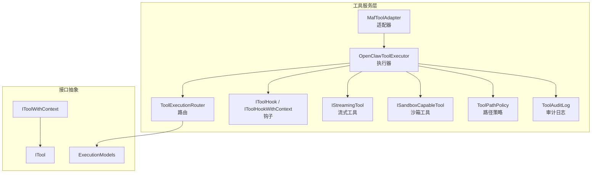
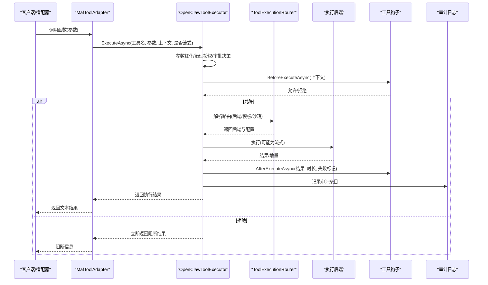
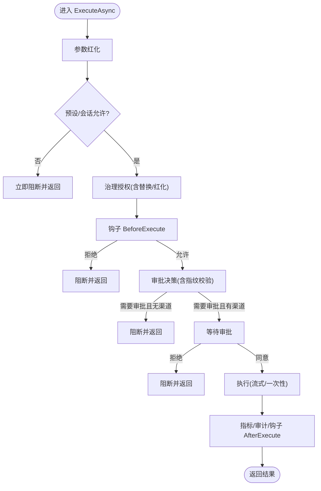
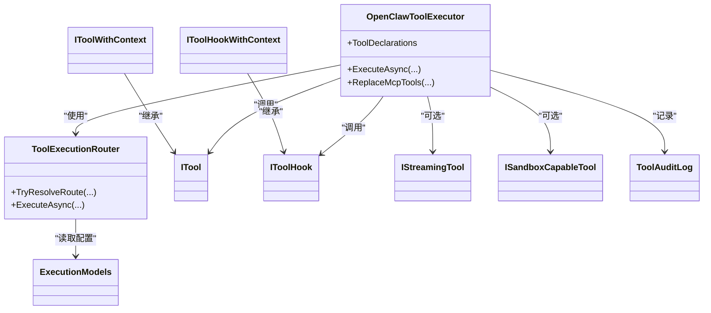

# 工具服务层

<cite>
**本文引用的文件**
- [OpenClawToolExecutor.cs](file://src/OpenClaw.Agent/OpenClawToolExecutor.cs)
- [MafToolAdapter.cs](file://src/OpenClaw.Agent/MafToolAdapter.cs)
- [ITool.cs](file://src/OpenClaw.Core/Abstractions/ITool.cs)
- [IToolWithContext.cs](file://src/OpenClaw.Core/Abstractions/IToolWithContext.cs)
- [IToolHook.cs](file://src/OpenClaw.Core/Abstractions/IToolHook.cs)
- [IToolHookWithContext.cs](file://src/OpenClaw.Core/Abstractions/IToolHookWithContext.cs)
- [IStreamingTool.cs](file://src/OpenClaw.Core/Abstractions/IStreamingTool.cs)
- [ISandboxCapableTool.cs](file://src/OpenClaw.Core/Abstractions/ISandboxCapableTool.cs)
- [ToolExecutionRouter.cs](file://src/OpenClaw.Agent/Execution/ToolExecutionRouter.cs)
- [ExecutionModels.cs](file://src/OpenClaw.Core/Models/ExecutionModels.cs)
- [ToolingPolicyModels.cs](file://src/OpenClaw.Core/Models/ToolingPolicyModels.cs)
- [ToolAuditLog.cs](file://src/OpenClaw.Core/Observability/ToolAuditLog.cs)
- [ToolPathPolicy.cs](file://src/OpenClaw.Core/Security/ToolPathPolicy.cs)
- [FileReadTool.cs](file://src/OpenClaw.Agent/Tools/FileReadTool.cs)
- [ShellTool.cs](file://src/OpenClaw.Agent/Tools/ShellTool.cs)
- [ToolServicesExtensions.cs](file://src/OpenClaw.Gateway/Composition/ToolServicesExtensions.cs)
</cite>

## 目录
1. [简介](#简介)
2. [项目结构](#项目结构)
3. [核心组件](#核心组件)
4. [架构总览](#架构总览)
5. [详细组件分析](#详细组件分析)
6. [依赖关系分析](#依赖关系分析)
7. [性能考量](#性能考量)
8. [故障排查指南](#故障排查指南)
9. [结论](#结论)
10. [附录](#附录)

## 简介
本文件系统性梳理 OpenClaw.NET 的工具服务层，聚焦以下主题：
- 工具执行器的注册机制与热重载能力
- 工具上下文管理与会话/回合生命周期
- 工具执行生命周期：从参数校验到结果归档
- 工具接口设计、参数验证与结果处理
- 工具配置选项、权限控制与审计日志
- 工具服务架构图与典型执行流程示例

目标是帮助开发者与运维人员快速理解工具服务层的职责边界、扩展点与最佳实践。

## 项目结构
工具服务层主要分布在以下模块：
- 执行器与适配器：OpenClawToolExecutor、MafToolAdapter
- 接口抽象：ITool、IToolWithContext、IToolHook、IToolHookWithContext、IStreamingTool、ISandboxCapableTool
- 执行路由：ToolExecutionRouter 及执行模型（ExecutionModels）
- 策略与配置：ToolingPolicyModels、ToolPathPolicy
- 观测与审计：ToolAuditLog
- 典型工具实现：FileReadTool、ShellTool
- 网关集成：ToolServicesExtensions

图表来源
- [OpenClawToolExecutor.cs:30-100](file://src/OpenClaw.Agent/OpenClawToolExecutor.cs#L30-L100)
- [MafToolAdapter.cs:9-30](file://src/OpenClaw.Agent/MafToolAdapter.cs#L9-L30)
- [ToolExecutionRouter.cs:7-63](file://src/OpenClaw.Agent/Execution/ToolExecutionRouter.cs#L7-L63)
- [ITool.cs:6-16](file://src/OpenClaw.Core/Abstractions/ITool.cs#L6-L16)
- [IToolWithContext.cs:12-15](file://src/OpenClaw.Core/Abstractions/IToolWithContext.cs#L12-L15)
- [IToolHook.cs:8-22](file://src/OpenClaw.Core/Abstractions/IToolHook.cs#L8-L22)
- [IToolHookWithContext.cs:7-12](file://src/OpenClaw.Core/Abstractions/IToolHookWithContext.cs#L7-L12)
- [IStreamingTool.cs:7-10](file://src/OpenClaw.Core/Abstractions/IStreamingTool.cs#L7-L10)
- [ISandboxCapableTool.cs:5-12](file://src/OpenClaw.Core/Abstractions/ISandboxCapableTool.cs#L5-L12)
- [ExecutionModels.cs:8-20](file://src/OpenClaw.Core/Models/ExecutionModels.cs#L8-L20)
- [ToolPathPolicy.cs:5-136](file://src/OpenClaw.Core/Security/ToolPathPolicy.cs#L5-L136)
- [ToolAuditLog.cs:39-114](file://src/OpenClaw.Core/Observability/ToolAuditLog.cs#L39-L114)

章节来源
- [OpenClawToolExecutor.cs:30-100](file://src/OpenClaw.Agent/OpenClawToolExecutor.cs#L30-L100)
- [MafToolAdapter.cs:9-30](file://src/OpenClaw.Agent/MafToolAdapter.cs#L9-L30)
- [ToolExecutionRouter.cs:7-63](file://src/OpenClaw.Agent/Execution/ToolExecutionRouter.cs#L7-L63)
- [ITool.cs:6-16](file://src/OpenClaw.Core/Abstractions/ITool.cs#L6-L16)
- [IToolWithContext.cs:12-15](file://src/OpenClaw.Core/Abstractions/IToolWithContext.cs#L12-L15)
- [IToolHook.cs:8-22](file://src/OpenClaw.Core/Abstractions/IToolHook.cs#L8-L22)
- [IToolHookWithContext.cs:7-12](file://src/OpenClaw.Core/Abstractions/IToolHookWithContext.cs#L7-L12)
- [IStreamingTool.cs:7-10](file://src/OpenClaw.Core/Abstractions/IStreamingTool.cs#L7-L10)
- [ISandboxCapableTool.cs:5-12](file://src/OpenClaw.Core/Abstractions/ISandboxCapableTool.cs#L5-L12)
- [ExecutionModels.cs:8-20](file://src/OpenClaw.Core/Models/ExecutionModels.cs#L8-L20)
- [ToolPathPolicy.cs:5-136](file://src/OpenClaw.Core/Security/ToolPathPolicy.cs#L5-L136)
- [ToolAuditLog.cs:39-114](file://src/OpenClaw.Core/Observability/ToolAuditLog.cs#L39-L114)

## 核心组件
- 工具执行器（OpenClawToolExecutor）：统一编排工具生命周期，负责参数红化、治理授权、审批决策、钩子拦截、沙箱替换、超时与异常处理、指标与审计记录。
- 工具适配器（MafToolAdapter）：将外部框架函数调用桥接至执行器，注入会话与回合上下文，支持流式事件写入。
- 执行路由（ToolExecutionRouter）：根据配置与工具特性解析后端路由，支持本地、Docker、SSH、OpenSandbox 等后端，并提供回退策略。
- 钩子（IToolHook/IToolHookWithContext）：在执行前后进行拦截与观察，支持按上下文的细粒度控制。
- 流式工具（IStreamingTool）：支持增量输出的工具接口。
- 沙箱工具（ISandboxCapableTool）：声明默认沙箱模式并提供沙箱请求构造与结果格式化。
- 审计日志（ToolAuditLog）：线程安全的 JSON Lines 审计记录，仅记录字节量等非敏感元数据。
- 路径策略（ToolPathPolicy）：文件读写路径白名单与解析逻辑（当前工具中以注释形式存在，部分工具仍可复用其路径解析能力）。

章节来源
- [OpenClawToolExecutor.cs:30-100](file://src/OpenClaw.Agent/OpenClawToolExecutor.cs#L30-L100)
- [MafToolAdapter.cs:9-30](file://src/OpenClaw.Agent/MafToolAdapter.cs#L9-L30)
- [ToolExecutionRouter.cs:7-63](file://src/OpenClaw.Agent/Execution/ToolExecutionRouter.cs#L7-L63)
- [IToolHook.cs:8-22](file://src/OpenClaw.Core/Abstractions/IToolHook.cs#L8-L22)
- [IToolHookWithContext.cs:7-12](file://src/OpenClaw.Core/Abstractions/IToolHookWithContext.cs#L7-L12)
- [IStreamingTool.cs:7-10](file://src/OpenClaw.Core/Abstractions/IStreamingTool.cs#L7-L10)
- [ISandboxCapableTool.cs:5-12](file://src/OpenClaw.Core/Abstractions/ISandboxCapableTool.cs#L5-L12)
- [ToolAuditLog.cs:39-114](file://src/OpenClaw.Core/Observability/ToolAuditLog.cs#L39-L114)
- [ToolPathPolicy.cs:5-136](file://src/OpenClaw.Core/Security/ToolPathPolicy.cs#L5-L136)

## 架构总览
下图展示工具服务层的关键交互：适配器接收外部调用，执行器统一编排，路由决定后端，钩子与沙箱参与执行前后处理，审计与指标贯穿全程。

图表来源
- [MafToolAdapter.cs:31-61](file://src/OpenClaw.Agent/MafToolAdapter.cs#L31-L61)
- [OpenClawToolExecutor.cs:134-630](file://src/OpenClaw.Agent/OpenClawToolExecutor.cs#L134-L630)
- [ToolExecutionRouter.cs:114-157](file://src/OpenClaw.Agent/Execution/ToolExecutionRouter.cs#L114-L157)
- [IToolHook.cs:16-21](file://src/OpenClaw.Core/Abstractions/IToolHook.cs#L16-L21)
- [ToolAuditLog.cs:72-95](file://src/OpenClaw.Core/Observability/ToolAuditLog.cs#L72-L95)

## 详细组件分析

### 组件一：工具执行器（OpenClawToolExecutor）
- 注册机制与热重载
  - 构造时基于工具集合建立名称到实例的字典，并生成工具声明列表。
  - 提供原子替换方法，支持在运行时热更新 MCP 工具集合，保证并发安全与声明同步。
- 上下文管理
  - 通过会话（Session）、回合上下文（TurnContext）与工具钩子上下文（ToolHookContext）传递关联 ID、通道、发送者等元数据。
- 生命周期编排
  - 参数红化 → 预设/会话允许性检查 → 治理授权（含参数替换/红化）→ 钩子拦截 → 审批决策（含指纹校验）→ 沙箱/替换参数 → 执行（流式或一次性）→ 指标与审计 → 钩子收尾 → 返回结果。
- 异常与超时处理
  - 统一捕获取消、超时、沙箱异常与一般异常，分类失败码与阻断状态，记录指标与日志。
- 关键流程图（简化）

图表来源
- [OpenClawToolExecutor.cs:134-630](file://src/OpenClaw.Agent/OpenClawToolExecutor.cs#L134-L630)

章节来源
- [OpenClawToolExecutor.cs:30-100](file://src/OpenClaw.Agent/OpenClawToolExecutor.cs#L30-L100)
- [OpenClawToolExecutor.cs:119-132](file://src/OpenClaw.Agent/OpenClawToolExecutor.cs#L119-L132)
- [OpenClawToolExecutor.cs:134-630](file://src/OpenClaw.Agent/OpenClawToolExecutor.cs#L134-L630)

### 组件二：工具适配器（MafToolAdapter）
- 将外部框架函数调用桥接至执行器，自动注入当前会话与回合上下文。
- 在流式场景下，向事件写入器推送“开始/增量/完成”事件，便于前端实时渲染。
- 收集工具调用并写回执行上下文，便于后续统计与追踪。

章节来源
- [MafToolAdapter.cs:9-30](file://src/OpenClaw.Agent/MafToolAdapter.cs#L9-L30)
- [MafToolAdapter.cs:31-61](file://src/OpenClaw.Agent/MafToolAdapter.cs#L31-L61)

### 组件三：执行路由（ToolExecutionRouter）
- 后端类型：local、docker、ssh、opensandbox；默认 local。
- 路由解析优先级：显式工具路由 > 工具沙箱能力 > 默认后端；支持回退后端与工作区要求。
- 进程后端隔离判定：除 opensandbox 外，其他启用的后端若实现进程后端接口则视为隔离。
- 过程后端解析：针对 process/shell 工具提供专用解析，必要时回退到默认后端。

章节来源
- [ToolExecutionRouter.cs:7-63](file://src/OpenClaw.Agent/Execution/ToolExecutionRouter.cs#L7-L63)
- [ToolExecutionRouter.cs:114-157](file://src/OpenClaw.Agent/Execution/ToolExecutionRouter.cs#L114-L157)
- [ToolExecutionRouter.cs:164-203](file://src/OpenClaw.Agent/Execution/ToolExecutionRouter.cs#L164-L203)
- [ExecutionModels.cs:8-20](file://src/OpenClaw.Core/Models/ExecutionModels.cs#L8-L20)
- [ExecutionModels.cs:47-52](file://src/OpenClaw.Core/Models/ExecutionModels.cs#L47-L52)

### 组件四：工具接口与行为规范
- ITool：最小接口，包含名称、描述、参数 Schema 与异步执行。
- IToolWithContext：在 ITool 基础上增加上下文参数，便于工具访问会话与回合元数据。
- IStreamingTool：支持增量输出的工具接口。
- ISandboxCapableTool：声明默认沙箱模式并提供沙箱请求构造与结果格式化。

章节来源
- [ITool.cs:6-16](file://src/OpenClaw.Core/Abstractions/ITool.cs#L6-L16)
- [IToolWithContext.cs:12-15](file://src/OpenClaw.Core/Abstractions/IToolWithContext.cs#L12-L15)
- [IStreamingTool.cs:7-10](file://src/OpenClaw.Core/Abstractions/IStreamingTool.cs#L7-L10)
- [ISandboxCapableTool.cs:5-12](file://src/OpenClaw.Core/Abstractions/ISandboxCapableTool.cs#L5-L12)

### 组件五：钩子与上下文（IToolHook / IToolHookWithContext）
- IToolHook：在执行前/后分别拦截，返回 false 即可阻断执行。
- IToolHookWithContext：提供更丰富的上下文（会话、通道、发送者、关联 ID、是否流式等），便于精细化控制。

章节来源
- [IToolHook.cs:8-22](file://src/OpenClaw.Core/Abstractions/IToolHook.cs#L8-L22)
- [IToolHookWithContext.cs:7-12](file://src/OpenClaw.Core/Abstractions/IToolHookWithContext.cs#L7-L12)

### 组件六：审计与指标
- ToolAuditLog：线程安全追加写入 JSON Lines 文件，记录时间戳、工具名、会话/通道/发送者、耗时、失败/超时、治理决策与字节数等。
- 指标：工具调用次数、超时次数、失败次数、执行时长分布等。

章节来源
- [ToolAuditLog.cs:39-114](file://src/OpenClaw.Core/Observability/ToolAuditLog.cs#L39-L114)
- [OpenClawToolExecutor.cs:536-555](file://src/OpenClaw.Agent/OpenClawToolExecutor.cs#L536-L555)

### 组件七：配置与策略
- 工具集/预设配置：允许/拒绝工具与前缀、审批必需工具、自治模式等。
- 执行配置：后端类型、工作目录、环境变量、镜像、SSH 凭据、超时、默认后端等。
- 路径策略：文件读写根目录白名单与路径解析（当前工具中以注释形式存在，部分工具仍可复用其路径解析能力）。

章节来源
- [ToolingPolicyModels.cs:3-44](file://src/OpenClaw.Core/Models/ToolingPolicyModels.cs#L3-L44)
- [ExecutionModels.cs:8-20](file://src/OpenClaw.Core/Models/ExecutionModels.cs#L8-L20)
- [ExecutionModels.cs:26-41](file://src/OpenClaw.Core/Models/ExecutionModels.cs#L26-L41)
- [ToolPathPolicy.cs:5-136](file://src/OpenClaw.Core/Security/ToolPathPolicy.cs#L5-L136)

### 组件八：典型工具实现
- FileReadTool：读取文件内容，限制最大行数，进行路径合法性与读取权限校验。
- ShellTool：本地命令执行，带超时与输出截断，支持沙箱模式下的命令包装与结果格式化。

章节来源
- [FileReadTool.cs:9-66](file://src/OpenClaw.Agent/Tools/FileReadTool.cs#L9-L66)
- [ShellTool.cs:11-193](file://src/OpenClaw.Agent/Tools/ShellTool.cs#L11-L193)

### 组件九：网关集成与服务注册
- ToolServicesExtensions：在网关启动阶段注册原生插件与 MCP 服务器工具注册器，作为工具源之一。

章节来源
- [ToolServicesExtensions.cs:8-21](file://src/OpenClaw.Gateway/Composition/ToolServicesExtensions.cs#L8-L21)

## 依赖关系分析
- 执行器依赖
  - 路由器：用于解析后端与模板
  - 钩子：执行前后拦截
  - 治理服务：授权与记录结果
  - 沙箱：参数替换与执行
  - 审计与指标：记录与观测
- 路由器依赖
  - 执行配置：后端类型、镜像、凭据、超时等
  - 沙箱策略：工具沙箱模式与模板解析
- 工具实现依赖
  - 配置与策略：路径白名单、只读模式、Shell 开关等
  - 沙箱能力：ISandboxCapableTool

图表来源
- [OpenClawToolExecutor.cs:30-100](file://src/OpenClaw.Agent/OpenClawToolExecutor.cs#L30-L100)
- [ToolExecutionRouter.cs:7-63](file://src/OpenClaw.Agent/Execution/ToolExecutionRouter.cs#L7-L63)
- [ITool.cs:6-16](file://src/OpenClaw.Core/Abstractions/ITool.cs#L6-L16)
- [IToolWithContext.cs:12-15](file://src/OpenClaw.Core/Abstractions/IToolWithContext.cs#L12-L15)
- [IToolHook.cs:8-22](file://src/OpenClaw.Core/Abstractions/IToolHook.cs#L8-L22)
- [IToolHookWithContext.cs:7-12](file://src/OpenClaw.Core/Abstractions/IToolHookWithContext.cs#L7-L12)
- [IStreamingTool.cs:7-10](file://src/OpenClaw.Core/Abstractions/IStreamingTool.cs#L7-L10)
- [ISandboxCapableTool.cs:5-12](file://src/OpenClaw.Core/Abstractions/ISandboxCapableTool.cs#L5-L12)
- [ToolAuditLog.cs:39-114](file://src/OpenClaw.Core/Observability/ToolAuditLog.cs#L39-L114)
- [ExecutionModels.cs:8-20](file://src/OpenClaw.Core/Models/ExecutionModels.cs#L8-L20)

## 性能考量
- 超时控制：执行器与流式执行均设置超时，避免长时间占用资源。
- 输出截断：Shell 工具对标准输出/错误流进行字节数限制，防止内存与带宽压力。
- 指标采集：记录工具调用次数、超时次数、执行时长与失败原因，便于容量规划与问题定位。
- 路由回退：当首选后端不可用时，自动回退到备用后端，提升可用性。
- 原子热重载：工具表更新采用锁保护与批量重建，避免并发竞态。

章节来源
- [OpenClawToolExecutor.cs:483-530](file://src/OpenClaw.Agent/OpenClawToolExecutor.cs#L483-L530)
- [ShellTool.cs:22-84](file://src/OpenClaw.Agent/Tools/ShellTool.cs#L22-L84)
- [ToolExecutionRouter.cs:119-156](file://src/OpenClaw.Agent/Execution/ToolExecutionRouter.cs#L119-L156)

## 故障排查指南
- 治理授权失败
  - 现象：返回阻断状态与失败码，审计记录包含治理决策。
  - 排查：检查治理侧车可用性、策略配置与参数替换/红化结果。
- 审批未通过
  - 现象：需要审批但无审批通道或用户拒绝。
  - 排查：确认会话表面是否支持交互审批，或调整配置关闭审批要求。
- 超时与沙箱异常
  - 现象：超时或沙箱执行失败，失败码区分不同场景。
  - 排查：增大超时、检查沙箱模板与权限、查看后端日志。
- 钩子拦截
  - 现象：BeforeExecute 返回 false 导致阻断。
  - 排查：检查钩子实现与上下文参数，确认拦截条件。
- 审计与日志
  - 使用 ToolAuditLog 的最近快照接口与 JSON Lines 文件定位问题。

章节来源
- [OpenClawToolExecutor.cs:214-305](file://src/OpenClaw.Agent/OpenClawToolExecutor.cs#L214-L305)
- [OpenClawToolExecutor.cs:388-433](file://src/OpenClaw.Agent/OpenClawToolExecutor.cs#L388-L433)
- [OpenClawToolExecutor.cs:483-530](file://src/OpenClaw.Agent/OpenClawToolExecutor.cs#L483-L530)
- [ToolAuditLog.cs:72-114](file://src/OpenClaw.Core/Observability/ToolAuditLog.cs#L72-L114)

## 结论
工具服务层通过执行器统一编排、路由灵活扩展、钩子与治理双轨控制、审计与指标可观测，形成高内聚、低耦合的工具执行体系。其热重载与流式支持进一步增强了运行时灵活性与用户体验。建议在生产环境中结合治理策略、审批流程与审计日志，持续优化工具集与后端配置。

## 附录
- 工具接口设计要点
  - 参数 Schema 必须严格定义，便于治理与审批系统进行参数校验与风险评估。
  - 对于变更敏感的工具，建议实现动作描述符（IToolActionDescriptorProvider）或使用策略解析，确保审批指纹一致性。
- 权限控制与审计
  - 通过预设/会话允许集与路径策略控制工具与文件系统的访问范围。
  - 审计日志仅记录非敏感元数据，避免泄露原始参数与结果。
- 执行流程示例
  - 适配器触发 → 执行器参数红化与治理 → 钩子拦截 → 审批决策 → 路由选择 → 执行 → 指标与审计 → 钩子收尾 → 返回结果。