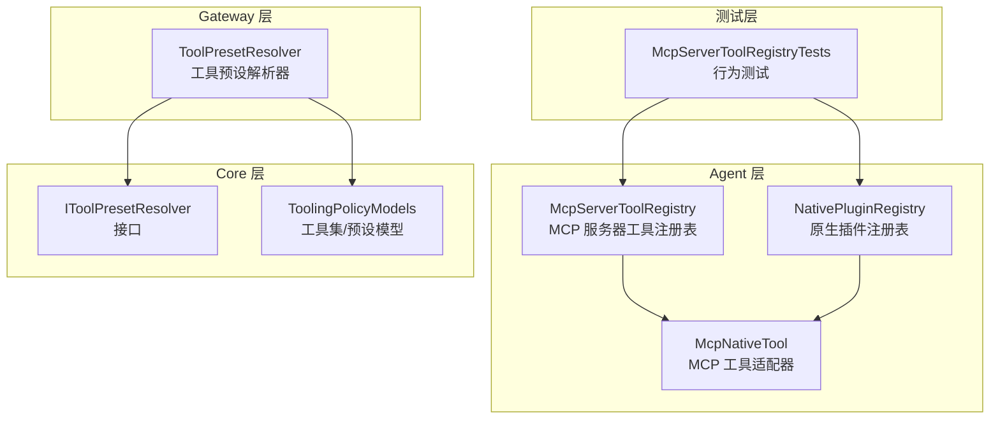
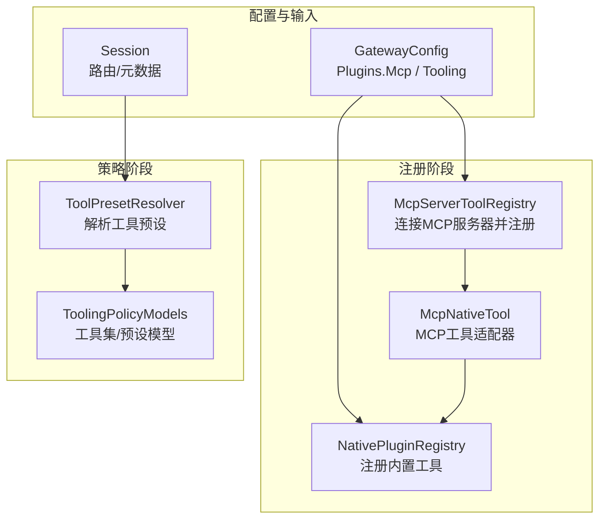
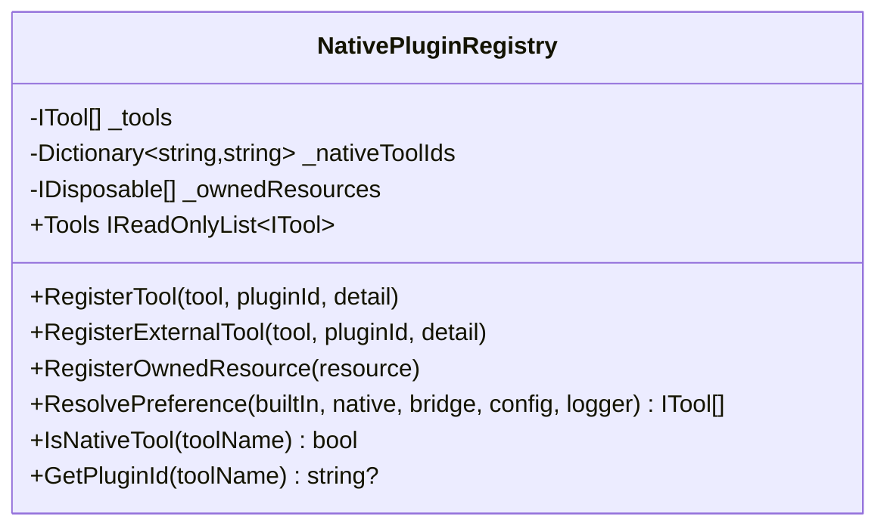
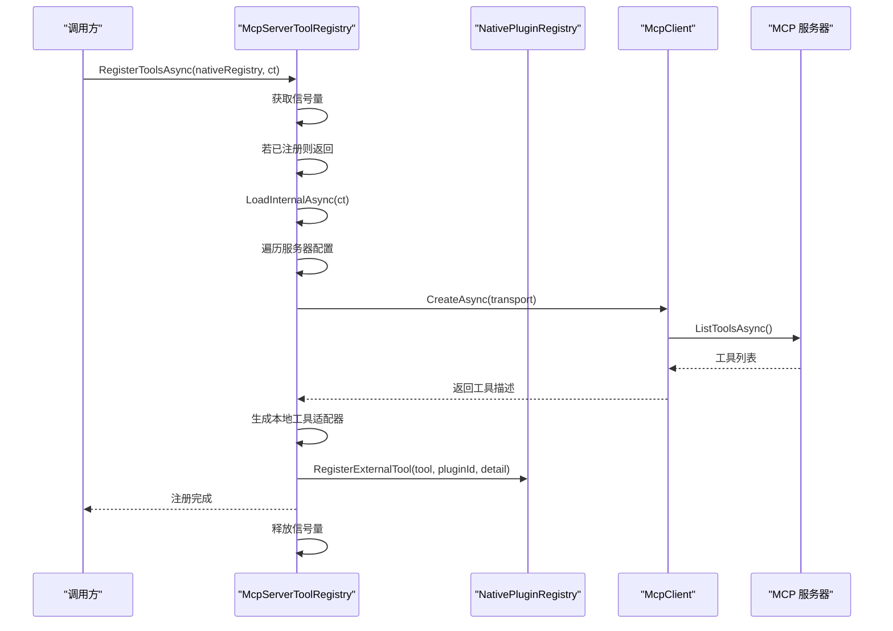
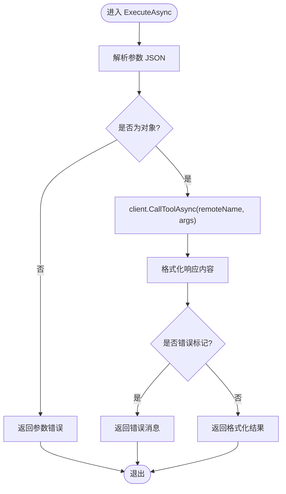
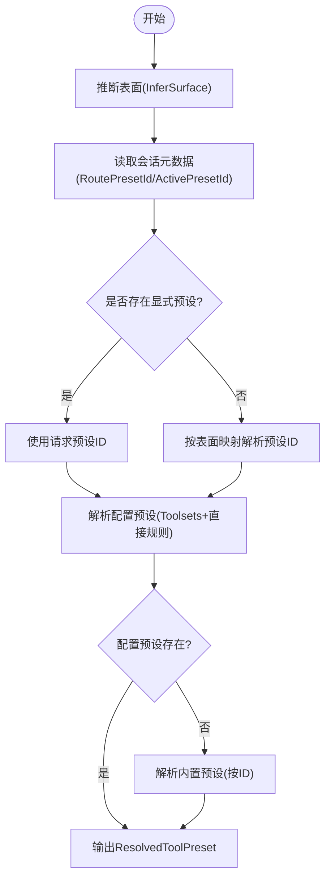
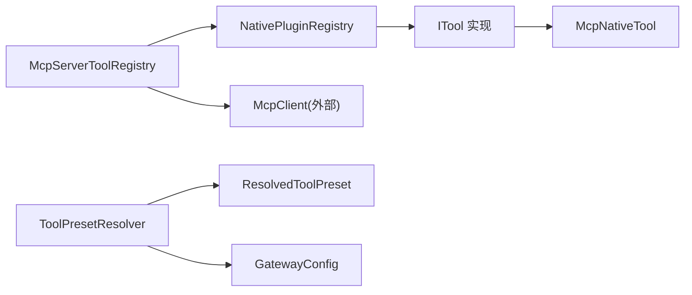

# 工具注册系统

<cite>
**本文档引用的文件**
- [McpServerToolRegistry.cs](file://src/OpenClaw.Agent/Plugins/McpServerToolRegistry.cs)
- [NativePluginRegistry.cs](file://src/OpenClaw.Agent/Plugins/NativePluginRegistry.cs)
- [McpNativeTool.cs](file://src/OpenClaw.Agent/Tools/McpNativeTool.cs)
- [ToolPresetResolver.cs](file://src/OpenClaw.Gateway/ToolPresetResolver.cs)
- [IToolPresetResolver.cs](file://src/OpenClaw.Core/Abstractions/IToolPresetResolver.cs)
- [ToolingPolicyModels.cs](file://src/OpenClaw.Core/Models/ToolingPolicyModels.cs)
- [McpServerToolRegistryTests.cs](file://src/OpenClaw.Tests/McpServerToolRegistryTests.cs)
- [McpConfigStore.cs](file://src/OpenClaw.Gateway/Mcp/McpConfigStore.cs)
</cite>

## 目录
1. [简介](#简介)
2. [项目结构](#项目结构)
3. [核心组件](#核心组件)
4. [架构总览](#架构总览)
5. [详细组件分析](#详细组件分析)
6. [依赖关系分析](#依赖关系分析)
7. [性能考虑](#性能考虑)
8. [故障排除指南](#故障排除指南)
9. [结论](#结论)

## 简介
本文件系统性阐述工具注册系统的实现与使用，重点覆盖两类工具注册表：
- 原生插件注册表：负责构建与管理内置 C# 工具（如文件操作、网络请求、数据库访问等）。
- MCP 服务器工具注册表：负责从外部 MCP 服务器发现工具，并将其桥接为本地可用的工具。

同时，文档解释工具发现、索引与检索算法，工具预设解析、能力描述与元数据管理机制，并提供架构图、流程示例与性能优化策略，帮助开发者快速理解与扩展该系统。

## 项目结构
围绕工具注册系统的关键目录与文件如下：
- Agent 层（工具实现与注册）
  - Plugins：原生插件注册表、MCP 工具注册表
  - Tools：具体工具实现（含 McpNativeTool）
- Gateway 层（策略与预设解析）
  - ToolPresetResolver：工具预设解析器
- Core 层（抽象与模型）
  - Abstractions：IToolPresetResolver 接口
  - Models：工具集与预设模型定义
- 测试层（验证行为与边界条件）

**图表来源**
- [McpServerToolRegistry.cs:16-369](file://src/OpenClaw.Agent/Plugins/McpServerToolRegistry.cs#L16-L369)
- [NativePluginRegistry.cs:13-265](file://src/OpenClaw.Agent/Plugins/NativePluginRegistry.cs#L13-L265)
- [McpNativeTool.cs:9-118](file://src/OpenClaw.Agent/Tools/McpNativeTool.cs#L9-L118)
- [ToolPresetResolver.cs:6-280](file://src/OpenClaw.Gateway/ToolPresetResolver.cs#L6-L280)
- [IToolPresetResolver.cs:5-9](file://src/OpenClaw.Core/Abstractions/IToolPresetResolver.cs#L5-L9)
- [ToolingPolicyModels.cs:3-44](file://src/OpenClaw.Core/Models/ToolingPolicyModels.cs#L3-L44)
- [McpServerToolRegistryTests.cs:21-405](file://src/OpenClaw.Tests/McpServerToolRegistryTests.cs#L21-L405)

**章节来源**
- [McpServerToolRegistry.cs:16-369](file://src/OpenClaw.Agent/Plugins/McpServerToolRegistry.cs#L16-L369)
- [NativePluginRegistry.cs:13-265](file://src/OpenClaw.Agent/Plugins/NativePluginRegistry.cs#L13-L265)
- [ToolPresetResolver.cs:6-280](file://src/OpenClaw.Gateway/ToolPresetResolver.cs#L6-L280)
- [IToolPresetResolver.cs:5-9](file://src/OpenClaw.Core/Abstractions/IToolPresetResolver.cs#L5-L9)
- [ToolingPolicyModels.cs:3-44](file://src/OpenClaw.Core/Models/ToolingPolicyModels.cs#L3-L44)
- [McpServerToolRegistryTests.cs:21-405](file://src/OpenClaw.Tests/McpServerToolRegistryTests.cs#L21-L405)

## 核心组件
- 原生插件注册表（NativePluginRegistry）
  - 负责根据配置实例化并注册内置工具，支持重复名称覆盖与资源托管。
  - 提供工具偏好解析（优先原生或桥接），并输出去重后的工具集合。
- MCP 服务器工具注册表（McpServerToolRegistry）
  - 连接配置的 MCP 服务器，调用工具列表接口，生成本地工具适配器并注册到原生注册表。
  - 支持并发加载、超时控制、环境变量与头部解析、资源释放与幂等注册。
- MCP 工具适配器（McpNativeTool）
  - 将 MCP 工具调用桥接到本地 ITool 接口，处理参数序列化、响应格式化与错误包装。
- 工具预设解析器（ToolPresetResolver）
  - 基于会话信息与配置，推导表面（surface）、选择预设 ID，并应用工具集规则与直接规则，得到允许工具集合与审批要求。
- 预设与工具集模型（ToolingPolicyModels）
  - 定义工具集（ToolsetConfig）、工具预设（ToolPresetConfig）、已解析预设（ResolvedToolPreset）与工具动作描述（ToolActionDescriptor）等数据结构。

**章节来源**
- [NativePluginRegistry.cs:13-265](file://src/OpenClaw.Agent/Plugins/NativePluginRegistry.cs#L13-L265)
- [McpServerToolRegistry.cs:16-369](file://src/OpenClaw.Agent/Plugins/McpServerToolRegistry.cs#L16-L369)
- [McpNativeTool.cs:9-118](file://src/OpenClaw.Agent/Tools/McpNativeTool.cs#L9-L118)
- [ToolPresetResolver.cs:6-280](file://src/OpenClaw.Gateway/ToolPresetResolver.cs#L6-L280)
- [ToolingPolicyModels.cs:3-44](file://src/OpenClaw.Core/Models/ToolingPolicyModels.cs#L3-L44)

## 架构总览
下图展示工具注册系统在运行时的交互关系与职责划分：

**图表来源**
- [McpServerToolRegistry.cs:16-369](file://src/OpenClaw.Agent/Plugins/McpServerToolRegistry.cs#L16-L369)
- [NativePluginRegistry.cs:13-265](file://src/OpenClaw.Agent/Plugins/NativePluginRegistry.cs#L13-L265)
- [McpNativeTool.cs:9-118](file://src/OpenClaw.Agent/Tools/McpNativeTool.cs#L9-L118)
- [ToolPresetResolver.cs:6-280](file://src/OpenClaw.Gateway/ToolPresetResolver.cs#L6-L280)
- [ToolingPolicyModels.cs:3-44](file://src/OpenClaw.Core/Models/ToolingPolicyModels.cs#L3-L44)

## 详细组件分析

### 原生插件注册表（NativePluginRegistry）
- 职责
  - 按配置启用并注册内置工具（如 web 搜索、文件读写、图像生成、数据库、MQTT、Notion 等）。
  - 处理重复工具名冲突（记录警告并替换旧实现）。
  - 管理“拥有资源”（Owned Resources），统一在关闭时释放。
  - 提供工具偏好解析（prefer=native/bridge 与 per-tool overrides）。
- 关键数据结构
  - 工具列表与名称到插件 ID 的映射字典。
- 性能与健壮性
  - 注册过程避免重复工具名；偏好解析通过哈希表实现 O(1) 查找。
  - 资源释放采用 try-catch 并记录日志，防止异常中断关闭流程。

**图表来源**
- [NativePluginRegistry.cs:13-265](file://src/OpenClaw.Agent/Plugins/NativePluginRegistry.cs#L13-L265)

**章节来源**
- [NativePluginRegistry.cs:13-265](file://src/OpenClaw.Agent/Plugins/NativePluginRegistry.cs#L13-L265)

### MCP 服务器工具注册表（McpServerToolRegistry）
- 职责
  - 依据配置连接 MCP 服务器（支持 http 与 stdio 传输），调用工具列表接口，生成本地 McpNativeTool 实例并注册到原生注册表。
  - 提供并发安全的加载与注册（信号量保护），支持多次调用幂等注册。
  - 解析工具名前缀、描述与输入模式（JSON Schema 文本）。
  - 管理客户端生命周期与资源释放。
- 关键流程
  - 加载内部流程：遍历服务器配置 → 创建传输 → 创建客户端 → 列举工具 → 生成本地适配器 → 记录客户端与工具。
  - 注册流程：将 DiscoveredMcpTool 中的 ITool 注册到原生注册表。
- 错误处理
  - 对未启用的服务器跳过；对失败的客户端连接进行清理；对无效工具名抛出异常；对禁用但字段缺失的服务器不报错。

**图表来源**
- [McpServerToolRegistry.cs:41-138](file://src/OpenClaw.Agent/Plugins/McpServerToolRegistry.cs#L41-L138)
- [NativePluginRegistry.cs:106-107](file://src/OpenClaw.Agent/Plugins/NativePluginRegistry.cs#L106-L107)

**章节来源**
- [McpServerToolRegistry.cs:16-369](file://src/OpenClaw.Agent/Plugins/McpServerToolRegistry.cs#L16-L369)
- [McpServerToolRegistryTests.cs:25-194](file://src/OpenClaw.Tests/McpServerToolRegistryTests.cs#L25-L194)

### MCP 工具适配器（McpNativeTool）
- 职责
  - 将 MCP 工具调用桥接为本地 ITool.ExecuteAsync。
  - 参数校验与 JSON 解析，响应内容格式化（文本块、嵌入资源、结构化内容等）。
  - 错误包装：参数非法、调用异常、取消等场景均返回可读错误消息。
- 数据流
  - 输入 JSON → 解析为字典 → 调用 client.CallToolAsync → 格式化响应内容 → 返回字符串结果。

**图表来源**
- [McpNativeTool.cs:20-99](file://src/OpenClaw.Agent/Tools/McpNativeTool.cs#L20-L99)

**章节来源**
- [McpNativeTool.cs:9-118](file://src/OpenClaw.Agent/Tools/McpNativeTool.cs#L9-L118)

### 工具预设解析（ToolPresetResolver）
- 职责
  - 根据会话（ChannelId、RoutePresetId、元数据）推断表面（surface），选择预设 ID。
  - 优先解析配置预设；若不存在，则回退到内置预设（如 cli、web、telegram、automation、readonly 等）。
  - 应用工具集（Toolset）与直接规则（Allow/Deny/Prefix）计算允许工具集合与需要审批的工具集合。
- 关键算法
  - 表面推断：通道别名映射与绑定表。
  - 预设选择：会话请求优先于元数据，再回退到按表面映射。
  - 规则合并：先应用工具集，再应用直接规则；支持前缀匹配的批量允许/拒绝。
- 输出
  - ResolvedToolPreset：包含预设 ID、描述、表面、自主模式、是否需要审批、允许工具集合、需要审批工具集合。

**图表来源**
- [ToolPresetResolver.cs:68-101](file://src/OpenClaw.Gateway/ToolPresetResolver.cs#L68-L101)
- [ToolPresetResolver.cs:155-189](file://src/OpenClaw.Gateway/ToolPresetResolver.cs#L155-L189)
- [ToolPresetResolver.cs:221-278](file://src/OpenClaw.Gateway/ToolPresetResolver.cs#L221-L278)

**章节来源**
- [ToolPresetResolver.cs:6-280](file://src/OpenClaw.Gateway/ToolPresetResolver.cs#L6-L280)
- [IToolPresetResolver.cs:5-9](file://src/OpenClaw.Core/Abstractions/IToolPresetResolver.cs#L5-L9)
- [ToolingPolicyModels.cs:3-44](file://src/OpenClaw.Core/Models/ToolingPolicyModels.cs#L3-L44)

## 依赖关系分析
- 组件耦合
  - McpServerToolRegistry 依赖 McpClient 与传输层（HTTP/STDIO），并通过 NativePluginRegistry 注册工具。
  - McpNativeTool 依赖 McpClient 与序列化上下文，向 NativePluginRegistry 暴露 ITool 接口。
  - ToolPresetResolver 依赖 GatewayConfig 与 SessionMetadataStore，输出 ResolvedToolPreset。
- 外部依赖
  - MCP 协议客户端与传输（HTTP/STDIO）。
  - 配置文件加载（McpConfigStore）用于动态读取 MCP 服务器配置。
- 循环依赖
  - 无循环依赖：注册表与解析器通过接口与模型解耦。

**图表来源**
- [McpServerToolRegistry.cs:16-369](file://src/OpenClaw.Agent/Plugins/McpServerToolRegistry.cs#L16-L369)
- [NativePluginRegistry.cs:13-265](file://src/OpenClaw.Agent/Plugins/NativePluginRegistry.cs#L13-L265)
- [McpNativeTool.cs:9-118](file://src/OpenClaw.Agent/Tools/McpNativeTool.cs#L9-L118)
- [ToolPresetResolver.cs:6-280](file://src/OpenClaw.Gateway/ToolPresetResolver.cs#L6-L280)

**章节来源**
- [McpServerToolRegistry.cs:16-369](file://src/OpenClaw.Agent/Plugins/McpServerToolRegistry.cs#L16-L369)
- [NativePluginRegistry.cs:13-265](file://src/OpenClaw.Agent/Plugins/NativePluginRegistry.cs#L13-L265)
- [ToolPresetResolver.cs:6-280](file://src/OpenClaw.Gateway/ToolPresetResolver.cs#L6-L280)

## 性能考虑
- 并发与锁
  - 使用信号量保护加载与注册流程，避免重复加载与竞态；并发调用 LoadAsync 只执行一次实际加载。
- 资源管理
  - 客户端与工具在关闭时统一释放；Owned Resources 防止泄漏。
- 算法复杂度
  - 原生工具偏好解析：基于哈希表查找，整体近似 O(A+B)，A/B 为原生与桥接工具数量。
  - 预设解析：工具集与直接规则应用为线性扫描，允许/拒绝前缀匹配为 O(N*M)，N 为工具数，M 为前缀数。
- I/O 与超时
  - 服务器启动与请求超时可配置，避免阻塞；禁用服务器跳过处理。
- 缓存与复用
  - 已加载工具缓存于内存，后续注册调用直接返回；MCP 工具列表仅在首次加载时拉取。

**章节来源**
- [McpServerToolRegistry.cs:20-369](file://src/OpenClaw.Agent/Plugins/McpServerToolRegistry.cs#L20-L369)
- [McpServerToolRegistryTests.cs:197-223](file://src/OpenClaw.Tests/McpServerToolRegistryTests.cs#L197-L223)
- [NativePluginRegistry.cs:137-233](file://src/OpenClaw.Agent/Plugins/NativePluginRegistry.cs#L137-L233)
- [ToolPresetResolver.cs:191-219](file://src/OpenClaw.Gateway/ToolPresetResolver.cs#L191-L219)

## 故障排除指南
- MCP 服务器连接失败
  - 确认传输类型与必要字段（URL/命令）正确；检查超时设置；查看日志中的错误信息。
  - 参考测试用例中对无效传输与缺失字段的断言行为。
- 工具名为空或重复
  - MCP 服务器返回空工具名将触发异常；原生注册表遇到重复工具名会发出警告并替换。
- 预设解析异常
  - 检查会话 RoutePresetId 与元数据 ActivePresetId；确认配置预设与内置预设 ID 是否正确。
- 资源释放问题
  - 确保在关闭流程中调用 Dispose/DisposeAsync；重复调用不会抛出异常。
- 配置文件读取
  - MCP 配置文件读取失败会记录警告并返回空；当 Enabled=false 时返回空字典。

**章节来源**
- [McpServerToolRegistryTests.cs:225-294](file://src/OpenClaw.Tests/McpServerToolRegistryTests.cs#L225-L294)
- [McpServerToolRegistry.cs:156-168](file://src/OpenClaw.Agent/Plugins/McpServerToolRegistry.cs#L156-L168)
- [NativePluginRegistry.cs:76-98](file://src/OpenClaw.Agent/Plugins/NativePluginRegistry.cs#L76-L98)
- [McpConfigStore.cs:53-77](file://src/OpenClaw.Gateway/Mcp/McpConfigStore.cs#L53-L77)

## 结论
工具注册系统通过原生插件注册表与 MCP 服务器工具注册表实现了统一的工具发现、索引与检索机制。配合工具预设解析器与策略模型，系统能够灵活地按会话表面与配置生成允许工具集合与审批策略。通过并发控制、资源管理与错误处理，系统在保证稳定性的同时具备良好的可扩展性与可维护性。