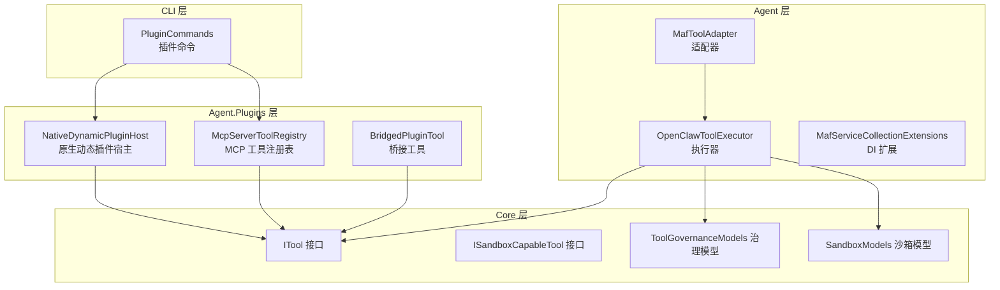
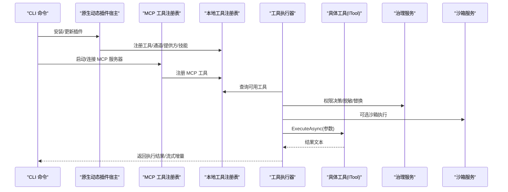
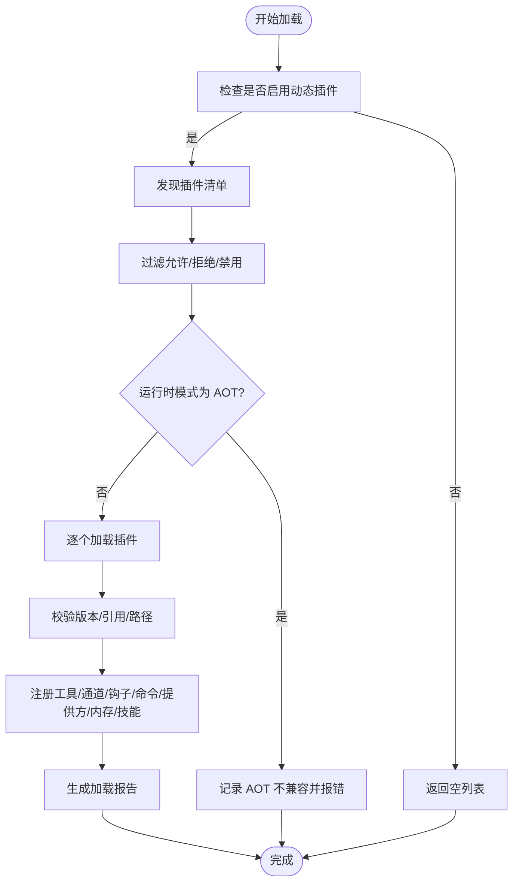
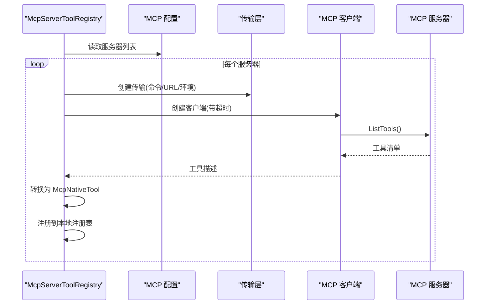
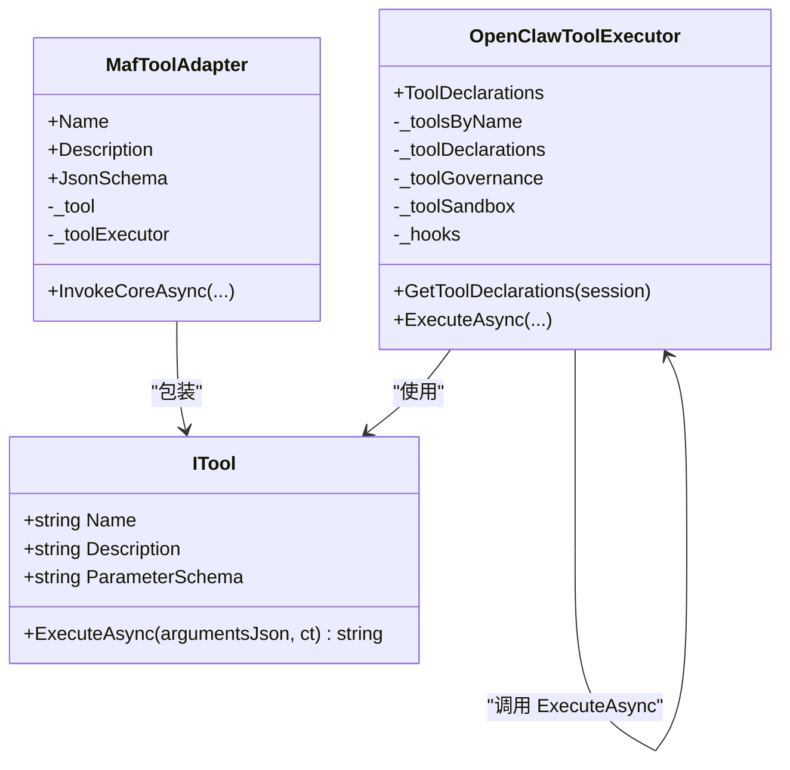
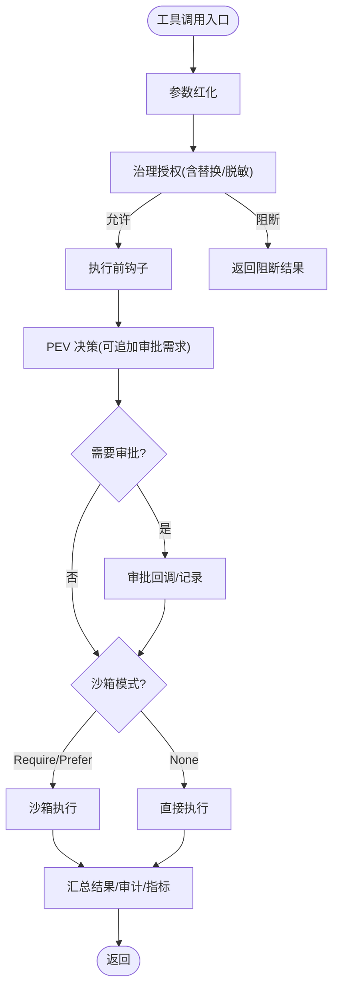
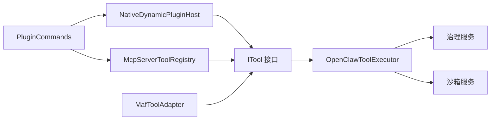

# 插件工具集成

<cite>
**本文引用的文件**
- [MafToolAdapter.cs](file://src/OpenClaw.Agent/MafToolAdapter.cs)
- [OpenClawToolExecutor.cs](file://src/OpenClaw.Agent/OpenClawToolExecutor.cs)
- [MafServiceCollectionExtensions.cs](file://src/OpenClaw.Agent/MafServiceCollectionExtensions.cs)
- [McpNativeTool.cs](file://src/OpenClaw.Agent/Tools/McpNativeTool.cs)
- [ITool.cs](file://src/OpenClaw.Core/Abstractions/ITool.cs)
- [ISandboxCapableTool.cs](file://src/OpenClaw.Core/Abstractions/ISandboxCapableTool.cs)
- [ToolGovernanceModels.cs](file://src/OpenClaw.Core/Models/ToolGovernanceModels.cs)
- [SandboxModels.cs](file://src/OpenClaw.Core/Models/SandboxModels.cs)
- [NativeDynamicPluginHost.cs](file://src/OpenClaw.Agent/Plugins/NativeDynamicPluginHost.cs)
- [McpServerToolRegistry.cs](file://src/OpenClaw.Agent/Plugins/McpServerToolRegistry.cs)
- [BridgedPluginTool.cs](file://src/OpenClaw.Agent/Plugins/BridgedPluginTool.cs)
- [PluginCommands.cs](file://src/OpenClaw.Cli/PluginCommands.cs)
</cite>

## 目录
1. [简介](#简介)
2. [项目结构](#项目结构)
3. [核心组件](#核心组件)
4. [架构总览](#架构总览)
5. [详细组件分析](#详细组件分析)
6. [依赖关系分析](#依赖关系分析)
7. [性能考量](#性能考量)
8. [故障排查指南](#故障排查指南)
9. [结论](#结论)
10. [附录](#附录)

## 简介
本文件面向“插件工具集成系统”，系统支持两类工具来源：
- 原生插件（动态加载的 .NET 插件）
- MCP 服务器工具（通过模型上下文协议桥接外部工具）

文档重点覆盖：
- 注册机制与适配器模式
- 生命周期管理（发现、加载、热重载、销毁）
- 工具发现、加载与调用流程
- 配置项、能力评估与版本兼容性
- 架构图、注册流程示例与扩展开发指南

## 项目结构
围绕插件工具集成的核心模块包括：
- Agent 层：工具执行器、适配器、服务扩展
- Core 层：抽象接口、治理与沙箱模型
- Agent.Plugins：原生动态插件宿主、MCP 工具注册表、桥接工具
- CLI：插件安装/卸载/搜索/列举命令

图表来源
- [MafToolAdapter.cs:1-63](file://src/OpenClaw.Agent/MafToolAdapter.cs#L1-L63)
- [OpenClawToolExecutor.cs:1-1059](file://src/OpenClaw.Agent/OpenClawToolExecutor.cs#L1-L1059)
- [MafServiceCollectionExtensions.cs:1-107](file://src/OpenClaw.Agent/MafServiceCollectionExtensions.cs#L1-L107)
- [ITool.cs:1-17](file://src/OpenClaw.Core/Abstractions/ITool.cs#L1-L17)
- [ISandboxCapableTool.cs:1-14](file://src/OpenClaw.Core/Abstractions/ISandboxCapableTool.cs#L1-L14)
- [ToolGovernanceModels.cs:1-150](file://src/OpenClaw.Core/Models/ToolGovernanceModels.cs#L1-L150)
- [SandboxModels.cs:1-28](file://src/OpenClaw.Core/Models/SandboxModels.cs#L1-L28)
- [NativeDynamicPluginHost.cs:1-908](file://src/OpenClaw.Agent/Plugins/NativeDynamicPluginHost.cs#L1-L908)
- [McpServerToolRegistry.cs:1-369](file://src/OpenClaw.Agent/Plugins/McpServerToolRegistry.cs#L1-L369)
- [BridgedPluginTool.cs:1-41](file://src/OpenClaw.Agent/Plugins/BridgedPluginTool.cs#L1-L41)
- [PluginCommands.cs:1-792](file://src/OpenClaw.Cli/PluginCommands.cs#L1-L792)

章节来源
- [MafServiceCollectionExtensions.cs:1-107](file://src/OpenClaw.Agent/MafServiceCollectionExtensions.cs#L1-L107)
- [NativeDynamicPluginHost.cs:1-908](file://src/OpenClaw.Agent/Plugins/NativeDynamicPluginHost.cs#L1-L908)
- [McpServerToolRegistry.cs:1-369](file://src/OpenClaw.Agent/Plugins/McpServerToolRegistry.cs#L1-L369)
- [PluginCommands.cs:1-792](file://src/OpenClaw.Cli/PluginCommands.cs#L1-L792)

## 核心组件
- ITool 抽象：最小化接口，仅包含名称、描述、参数模式与异步执行方法，便于 AOT 裁剪。
- OpenClawToolExecutor：统一的工具执行入口，负责权限治理、审批、钩子、超时、沙箱、审计与指标。
- MafToolAdapter：将 ITool 适配为 Microsoft Agent Framework 的 AIFunction，实现参数模式透传与流式事件写入。
- NativeDynamicPluginHost：动态加载原生 .NET 插件，解析清单、校验版本兼容、收集工具/通道/提供方/技能等表面。
- McpServerToolRegistry：连接 MCP 服务器，枚举工具并注册为本地 ITool。
- BridgedPluginTool：桥接 Node.js 插件进程中的工具调用。
- ToolGovernanceModels：治理动作、风险等级、决策上下文与结果模型。
- SandboxModels：沙箱模式、执行请求与结果模型。

章节来源
- [ITool.cs:1-17](file://src/OpenClaw.Core/Abstractions/ITool.cs#L1-L17)
- [OpenClawToolExecutor.cs:1-1059](file://src/OpenClaw.Agent/OpenClawToolExecutor.cs#L1-L1059)
- [MafToolAdapter.cs:1-63](file://src/OpenClaw.Agent/MafToolAdapter.cs#L1-L63)
- [NativeDynamicPluginHost.cs:1-908](file://src/OpenClaw.Agent/Plugins/NativeDynamicPluginHost.cs#L1-L908)
- [McpServerToolRegistry.cs:1-369](file://src/OpenClaw.Agent/Plugins/McpServerToolRegistry.cs#L1-L369)
- [BridgedPluginTool.cs:1-41](file://src/OpenClaw.Agent/Plugins/BridgedPluginTool.cs#L1-L41)
- [ToolGovernanceModels.cs:1-150](file://src/OpenClaw.Core/Models/ToolGovernanceModels.cs#L1-L150)
- [SandboxModels.cs:1-28](file://src/OpenClaw.Core/Models/SandboxModels.cs#L1-L28)

## 架构总览
下图展示从“插件发现/加载”到“工具调用”的端到端路径，以及治理与沙箱控制点。

图表来源
- [PluginCommands.cs:1-792](file://src/OpenClaw.Cli/PluginCommands.cs#L1-L792)
- [NativeDynamicPluginHost.cs:1-908](file://src/OpenClaw.Agent/Plugins/NativeDynamicPluginHost.cs#L1-L908)
- [McpServerToolRegistry.cs:1-369](file://src/OpenClaw.Agent/Plugins/McpServerToolRegistry.cs#L1-L369)
- [OpenClawToolExecutor.cs:1-1059](file://src/OpenClaw.Agent/OpenClawToolExecutor.cs#L1-L1059)

## 详细组件分析

### 组件一：原生动态插件宿主（NativeDynamicPluginHost）
职责与特性：
- 发现与加载：扫描工作区与用户目录下的 openclaw.native-plugin.json 清单，解析程序集路径与类型名。
- 兼容性校验：检查最小宿主版本、插件 API 主版本、装配引用的 PluginKit 版本。
- 运行时模式限制：在 AOT 模式下禁止动态加载，确保安全边界。
- 注册与回滚：收集工具、通道、钩子、命令、LLM 提供方、内存提供方与技能根目录；失败时尽力清理。
- 报告与诊断：生成插件加载报告与结构化日志诊断信息。

图表来源
- [NativeDynamicPluginHost.cs:1-908](file://src/OpenClaw.Agent/Plugins/NativeDynamicPluginHost.cs#L1-L908)

章节来源
- [NativeDynamicPluginHost.cs:1-908](file://src/OpenClaw.Agent/Plugins/NativeDynamicPluginHost.cs#L1-L908)

### 组件二：MCP 服务器工具注册表（McpServerToolRegistry）
职责与特性：
- 连接 MCP 服务器：根据配置选择 stdio/http 传输，建立客户端并限定启动/请求超时。
- 工具发现：调用 ListTools 获取远程工具清单，转换为本地 ITool 实例（McPNativeTool）。
- 命名规范：可按服务器 ID 生成前缀，避免命名冲突。
- 注册与释放：将工具注册到本地注册表；Dispose 时安全关闭所有客户端。

图表来源
- [McpServerToolRegistry.cs:1-369](file://src/OpenClaw.Agent/Plugins/McpServerToolRegistry.cs#L1-L369)
- [McpNativeTool.cs:1-118](file://src/OpenClaw.Agent/Tools/McpNativeTool.cs#L1-L118)

章节来源
- [McpServerToolRegistry.cs:1-369](file://src/OpenClaw.Agent/Plugins/McpServerToolRegistry.cs#L1-L369)
- [McpNativeTool.cs:1-118](file://src/OpenClaw.Agent/Tools/McpNativeTool.cs#L1-L118)

### 组件三：工具执行器与适配器（OpenClawToolExecutor / MafToolAdapter）
职责与特性：
- OpenClawToolExecutor
  - 工具声明：基于 ITool 列表生成 AI 工具声明，支持会话预设筛选。
  - 执行管线：参数红化、治理授权、审批策略、PEV 决策、钩子、超时、沙箱、审计与指标。
  - 流式支持：对 IStreamingTool 支持 onDelta 回调。
  - 替换/阻断：治理可要求替换参数或直接阻断。
- MafToolAdapter
  - 将 ITool 适配为 AIFunction，透传参数模式与名称/描述。
  - 在流式场景中向 Agent 流事件写入工具开始/增量/完成事件。

图表来源
- [OpenClawToolExecutor.cs:1-1059](file://src/OpenClaw.Agent/OpenClawToolExecutor.cs#L1-L1059)
- [MafToolAdapter.cs:1-63](file://src/OpenClaw.Agent/MafToolAdapter.cs#L1-L63)
- [ITool.cs:1-17](file://src/OpenClaw.Core/Abstractions/ITool.cs#L1-L17)

章节来源
- [OpenClawToolExecutor.cs:1-1059](file://src/OpenClaw.Agent/OpenClawToolExecutor.cs#L1-L1059)
- [MafToolAdapter.cs:1-63](file://src/OpenClaw.Agent/MafToolAdapter.cs#L1-L63)

### 组件四：治理与沙箱（ToolGovernanceModels / ISandboxCapableTool / SandboxModels）
- 治理动作：Allow/Deny/RequireApproval/Redact/AuditOnly；风险等级 Low/Medium/High/Critical。
- 决策上下文：包含会话、通道、调用 ID、工具名、参数、动作描述符与能力特征。
- 沙箱模式：None/Prefer/Require；支持命令、工作目录、环境变量、参数、租约与模板。

图表来源
- [ToolGovernanceModels.cs:1-150](file://src/OpenClaw.Core/Models/ToolGovernanceModels.cs#L1-L150)
- [SandboxModels.cs:1-28](file://src/OpenClaw.Core/Models/SandboxModels.cs#L1-L28)
- [ISandboxCapableTool.cs:1-14](file://src/OpenClaw.Core/Abstractions/ISandboxCapableTool.cs#L1-L14)
- [OpenClawToolExecutor.cs:1-1059](file://src/OpenClaw.Agent/OpenClawToolExecutor.cs#L1-L1059)

章节来源
- [ToolGovernanceModels.cs:1-150](file://src/OpenClaw.Core/Models/ToolGovernanceModels.cs#L1-L150)
- [SandboxModels.cs:1-28](file://src/OpenClaw.Core/Models/SandboxModels.cs#L1-L28)
- [ISandboxCapableTool.cs:1-14](file://src/OpenClaw.Core/Abstractions/ISandboxCapableTool.cs#L1-L14)
- [OpenClawToolExecutor.cs:1-1059](file://src/OpenClaw.Agent/OpenClawToolExecutor.cs#L1-L1059)

### 组件五：桥接工具（BridgedPluginTool）
- 用于桥接 Node.js 插件进程中的工具调用，封装插件 ID、工具名、参数模式与可选标记。
- 执行时委托给桥接进程，返回结果文本。

章节来源
- [BridgedPluginTool.cs:1-41](file://src/OpenClaw.Agent/Plugins/BridgedPluginTool.cs#L1-L41)

### 组件六：插件命令（PluginCommands）
- 支持安装（npm/tarball/本地）、卸载、列举、搜索。
- 安装流程：下载/解压 -> 校验清单/入口 -> 复制到扩展目录 -> 可选安装依赖 -> 输出提示。
- 列举/搜索：基于插件发现与清单解析，输出信任级别与兼容性摘要。

章节来源
- [PluginCommands.cs:1-792](file://src/OpenClaw.Cli/PluginCommands.cs#L1-L792)

## 依赖关系分析
- 组件耦合
  - OpenClawToolExecutor 强依赖 ITool、治理服务、沙箱服务、钩子集合与审计/指标。
  - NativeDynamicPluginHost 与 McpServerToolRegistry 分别向本地注册表注入 ITool。
  - MafToolAdapter 仅依赖 ITool 与执行器，保持低耦合。
- 外部依赖
  - MCP 协议客户端与传输（stdio/http）。
  - npm 与 tar 解包用于 JS 插件安装。
- 循环依赖
  - 未见循环依赖迹象；各组件通过接口与注册表解耦。

图表来源
- [OpenClawToolExecutor.cs:1-1059](file://src/OpenClaw.Agent/OpenClawToolExecutor.cs#L1-L1059)
- [ITool.cs:1-17](file://src/OpenClaw.Core/Abstractions/ITool.cs#L1-L17)
- [NativeDynamicPluginHost.cs:1-908](file://src/OpenClaw.Agent/Plugins/NativeDynamicPluginHost.cs#L1-L908)
- [McpServerToolRegistry.cs:1-369](file://src/OpenClaw.Agent/Plugins/McpServerToolRegistry.cs#L1-L369)
- [MafToolAdapter.cs:1-63](file://src/OpenClaw.Agent/MafToolAdapter.cs#L1-L63)
- [PluginCommands.cs:1-792](file://src/OpenClaw.Cli/PluginCommands.cs#L1-L792)

章节来源
- [OpenClawToolExecutor.cs:1-1059](file://src/OpenClaw.Agent/OpenClawToolExecutor.cs#L1-L1059)
- [NativeDynamicPluginHost.cs:1-908](file://src/OpenClaw.Agent/Plugins/NativeDynamicPluginHost.cs#L1-L908)
- [McpServerToolRegistry.cs:1-369](file://src/OpenClaw.Agent/Plugins/McpServerToolRegistry.cs#L1-L369)
- [MafToolAdapter.cs:1-63](file://src/OpenClaw.Agent/MafToolAdapter.cs#L1-L63)
- [PluginCommands.cs:1-792](file://src/OpenClaw.Cli/PluginCommands.cs#L1-L792)

## 性能考量
- 工具执行超时：统一的工具超时控制，避免长时间阻塞。
- 流式处理：对 IStreamingTool 支持增量回调，降低首字节延迟。
- 指标与审计：记录工具耗时、失败次数、字节数与治理决策耗时，便于性能分析。
- 治理与沙箱：在安全与合规前提下可能引入额外开销，建议按需启用 Require 模式。

## 故障排查指南
- 动态插件加载失败
  - 检查清单路径与程序集路径是否在插件根内。
  - 核对最小宿主版本与插件 API 主版本是否匹配。
  - 查看加载报告与结构化日志诊断。
- MCP 工具不可用
  - 确认传输配置（命令/URL/环境变量/头部）正确且可解析。
  - 检查服务器启动超时与请求超时设置。
- 工具调用被阻断
  - 查看治理决策原因与动作（Allow/Deny/RequireApproval/Redact）。
  - 若治理返回替换参数，确认 JSON 合法性。
- 沙箱执行异常
  - 检查沙箱模式与命令/参数/工作目录配置。
  - 关注沙箱异常类型与失败码，结合下一步建议进行修复。

章节来源
- [NativeDynamicPluginHost.cs:1-908](file://src/OpenClaw.Agent/Plugins/NativeDynamicPluginHost.cs#L1-L908)
- [McpServerToolRegistry.cs:1-369](file://src/OpenClaw.Agent/Plugins/McpServerToolRegistry.cs#L1-L369)
- [OpenClawToolExecutor.cs:1-1059](file://src/OpenClaw.Agent/OpenClawToolExecutor.cs#L1-L1059)

## 结论
该插件工具集成系统以 ITool 为核心抽象，通过适配器与执行器实现统一的工具生命周期管理，并以治理与沙箱保障安全可控。原生动态插件与 MCP 服务器工具分别满足本地 .NET 扩展与跨语言生态集成的需求。配套的 CLI 命令与诊断报告提升了运维效率与可观测性。

## 附录

### 插件配置选项与能力评估
- 原生动态插件
  - 清单字段：插件 ID、类型名、程序集路径、最小宿主版本、插件 API 版本、能力列表、技能目录等。
  - 能力评估：根据清单与技能目录计算请求能力，结合运行时模式判定是否允许加载。
- MCP 服务器
  - 配置项：启用开关、服务器 ID/名称、传输类型（stdio/http）、命令/URL、环境变量/头部、超时等。
  - 工具命名：支持按服务器 ID 生成前缀，避免冲突。
- 治理与沙箱
  - 治理：启用/禁用、提供者、侧车基地址、决策/结果端点、超时、失败策略、风险工具策略等。
  - 沙箱：模式（None/Prefer/Require）、命令、工作目录、环境、参数、租约与模板。

章节来源
- [NativeDynamicPluginHost.cs:1-908](file://src/OpenClaw.Agent/Plugins/NativeDynamicPluginHost.cs#L1-L908)
- [McpServerToolRegistry.cs:1-369](file://src/OpenClaw.Agent/Plugins/McpServerToolRegistry.cs#L1-L369)
- [ToolGovernanceModels.cs:1-150](file://src/OpenClaw.Core/Models/ToolGovernanceModels.cs#L1-L150)
- [SandboxModels.cs:1-28](file://src/OpenClaw.Core/Models/SandboxModels.cs#L1-L28)

### 版本兼容性
- 最小宿主版本：插件清单可声明最低宿主版本，宿主启动时进行比较。
- 插件 API 主版本：插件引用的 PluginKit 主版本必须与宿主一致。
- 运行时模式：AOT 模式下禁止动态加载原生插件，避免 JIT 违规。

章节来源
- [NativeDynamicPluginHost.cs:1-908](file://src/OpenClaw.Agent/Plugins/NativeDynamicPluginHost.cs#L1-L908)

### 扩展开发指南
- 开发原生插件
  - 编写 openclaw.native-plugin.json 清单，指定类型名与程序集路径。
  - 实现 INativeDynamicPlugin.Register，在注册上下文中注册工具/通道/钩子/命令/提供方/内存/技能。
  - 注意能力声明与运行时模式兼容。
- 开发 MCP 工具
  - 实现 MCP 服务器，提供 ListTools 与 CallTool。
  - 在客户端配置传输与认证，确保超时与安全设置合理。
- 开发 JS 插件
  - 使用 CLI 安装/更新插件，确保入口文件与清单有效。
  - 通过桥接工具调用 Node.js 插件中的工具。

章节来源
- [PluginCommands.cs:1-792](file://src/OpenClaw.Cli/PluginCommands.cs#L1-L792)
- [NativeDynamicPluginHost.cs:1-908](file://src/OpenClaw.Agent/Plugins/NativeDynamicPluginHost.cs#L1-L908)
- [McpServerToolRegistry.cs:1-369](file://src/OpenClaw.Agent/Plugins/McpServerToolRegistry.cs#L1-L369)
- [BridgedPluginTool.cs:1-41](file://src/OpenClaw.Agent/Plugins/BridgedPluginTool.cs#L1-L41)