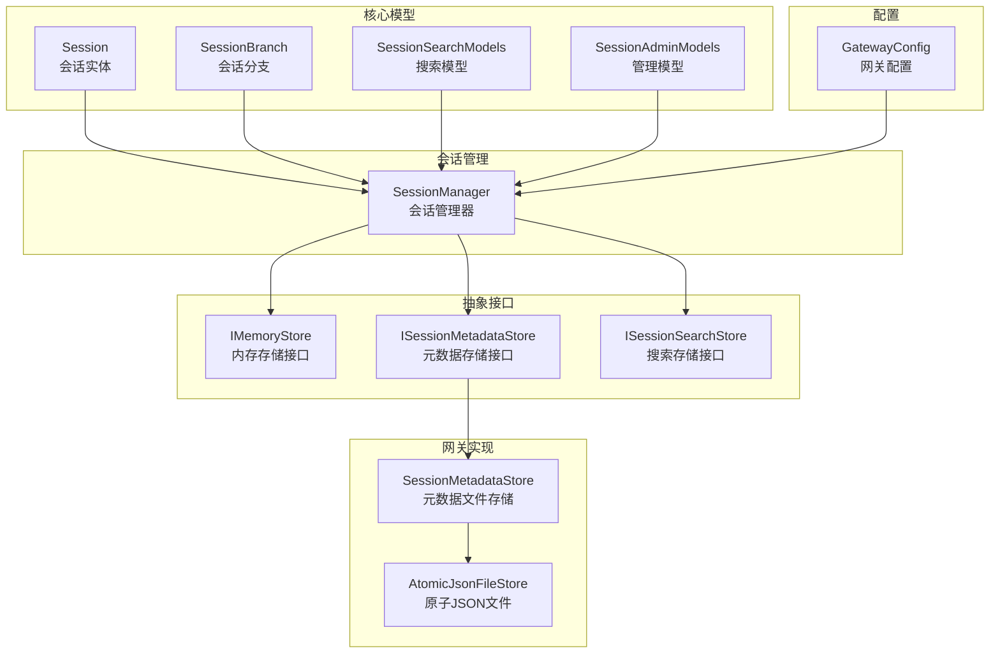
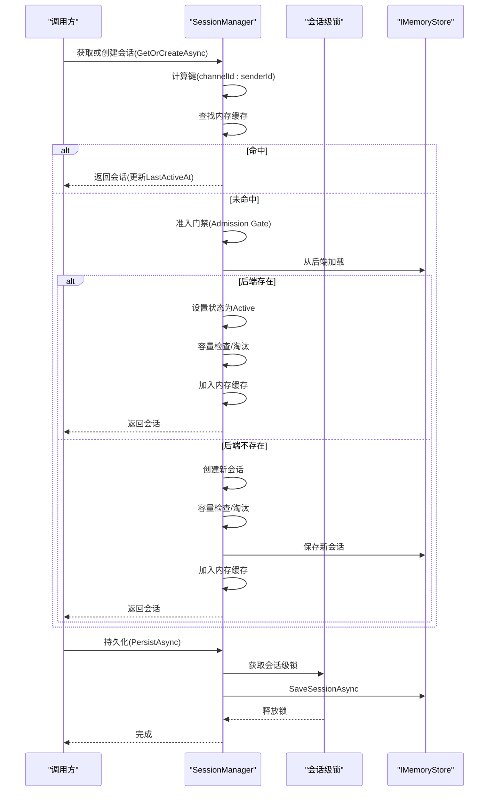
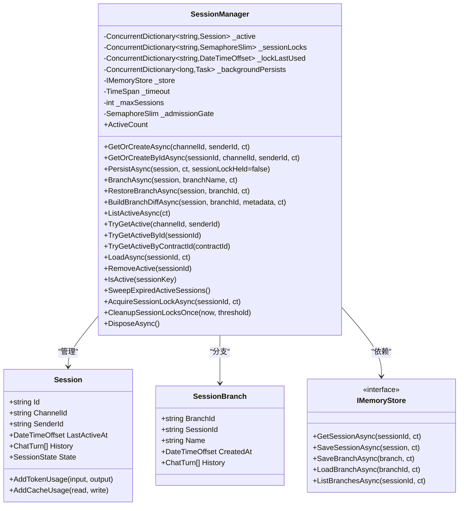
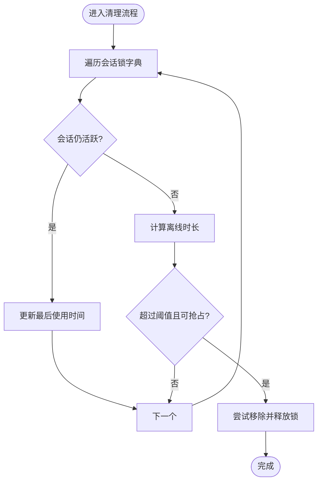
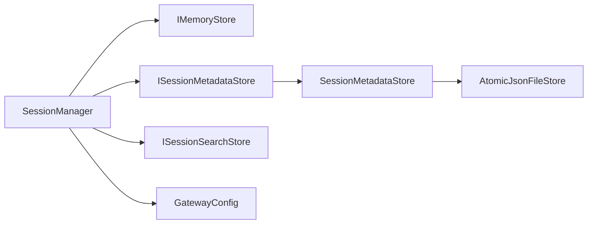

# 会话管理服务

<cite>
**本文档引用的文件**
- [SessionManager.cs](file://src/OpenClaw.Core/Sessions/SessionManager.cs)
- [Session.cs](file://src/OpenClaw.Core/Models/Session.cs)
- [SessionBranch.cs](file://src/OpenClaw.Core/Models/SessionBranch.cs)
- [SessionSearchModels.cs](file://src/OpenClaw.Core/Models/SessionSearchModels.cs)
- [SessionAdminModels.cs](file://src/OpenClaw.Core/Models/SessionAdminModels.cs)
- [ISessionMetadataStore.cs](file://src/OpenClaw.Core/Abstractions/ISessionMetadataStore.cs)
- [ISessionSearchStore.cs](file://src/OpenClaw.Core/Abstractions/ISessionSearchStore.cs)
- [SessionMetadataStore.cs](file://src/OpenClaw.Gateway/SessionMetadataStore.cs)
- [AtomicJsonFileStore.cs](file://src/OpenClaw.Gateway/AtomicJsonFileStore.cs)
- [GatewayConfig.cs](file://src/OpenClaw.Core/Models/GatewayConfig.cs)
- [SessionManagerTests.cs](file://src/OpenClaw.Tests/SessionManagerTests.cs)
</cite>

## 目录
1. [简介](#简介)
2. [项目结构](#项目结构)
3. [核心组件](#核心组件)
4. [架构总览](#架构总览)
5. [详细组件分析](#详细组件分析)
6. [依赖关系分析](#依赖关系分析)
7. [性能考量](#性能考量)
8. [故障排查指南](#故障排查指南)
9. [结论](#结论)
10. [附录](#附录)

## 简介
本文件系统性阐述会话管理服务的设计与实现，重点覆盖以下方面：
- 会话生命周期管理：从创建、激活、暂停到过期与清理的完整流程
- 状态持久化：基于内存缓存与后端存储的双层持久化策略
- 搜索功能：会话检索与命中摘要能力
- 会话存储接口设计：抽象与实现分离，支持多种存储后端
- 会话清理策略：基于超时与容量的主动清理与被动淘汰
- 并发控制机制：准入门禁、会话级锁与全局锁清理
- 配置选项：会话超时、并发限制、预算控制等
- 性能考虑与扩展点：零分配序列化、指数退避重试、后台最佳努力持久化
- 典型使用场景：多通道并发、定时任务、Webhook、对话分支与恢复

## 项目结构
会话管理服务位于 OpenClaw.Core 模块中，围绕会话模型与管理器展开，并通过抽象接口与网关侧实现解耦。

**图表来源**
- [SessionManager.cs](file://src/OpenClaw.Core/Sessions/SessionManager.cs)
- [Session.cs](file://src/OpenClaw.Core/Models/Session.cs)
- [SessionBranch.cs](file://src/OpenClaw.Core/Models/SessionBranch.cs)
- [SessionSearchModels.cs](file://src/OpenClaw.Core/Models/SessionSearchModels.cs)
- [SessionAdminModels.cs](file://src/OpenClaw.Core/Models/SessionAdminModels.cs)
- [ISessionMetadataStore.cs](file://src/OpenClaw.Core/Abstractions/ISessionMetadataStore.cs)
- [ISessionSearchStore.cs](file://src/OpenClaw.Core/Abstractions/ISessionSearchStore.cs)
- [SessionMetadataStore.cs](file://src/OpenClaw.Gateway/SessionMetadataStore.cs)
- [AtomicJsonFileStore.cs](file://src/OpenClaw.Gateway/AtomicJsonFileStore.cs)
- [GatewayConfig.cs](file://src/OpenClaw.Core/Models/GatewayConfig.cs)

**章节来源**
- [SessionManager.cs](file://src/OpenClaw.Core/Sessions/SessionManager.cs)
- [GatewayConfig.cs](file://src/OpenClaw.Core/Models/GatewayConfig.cs)

## 核心组件
- 会话实体与状态
  - Session：承载会话标识、渠道、发送者、历史记录、状态、计数器、策略与委托信息等
  - SessionState：活动、暂停、过期三种状态
  - ChatTurn/ToolInvocation：单轮对话与工具调用的结构化记录
- 会话分支
  - SessionBranch：保存指定时间点的历史快照，支持分支创建、恢复与差异比较
- 搜索与管理模型
  - SessionSearchQuery/SessionSearchHit/SessionSearchResult：文本、时间范围、渠道/发送者过滤的搜索能力
  - SessionSummary/PagedSessionList/SessionListQuery：管理端分页列表与筛选条件
- 存储抽象
  - IMemoryStore（未在本文档直接展示）：会话与分支的读写接口
  - ISessionMetadataStore：会话元数据（星标、标签、待办）的增删改查
  - ISessionSearchStore：会话搜索接口
- 网关实现
  - SessionMetadataStore：基于原子JSON文件的元数据持久化
  - AtomicJsonFileStore：原子写入与加载工具

**章节来源**
- [Session.cs](file://src/OpenClaw.Core/Models/Session.cs)
- [SessionBranch.cs](file://src/OpenClaw.Core/Models/SessionBranch.cs)
- [SessionSearchModels.cs](file://src/OpenClaw.Core/Models/SessionSearchModels.cs)
- [SessionAdminModels.cs](file://src/OpenClaw.Core/Models/SessionAdminModels.cs)
- [ISessionMetadataStore.cs](file://src/OpenClaw.Core/Abstractions/ISessionMetadataStore.cs)
- [ISessionSearchStore.cs](file://src/OpenClaw.Core/Abstractions/ISessionSearchStore.cs)
- [SessionMetadataStore.cs](file://src/OpenClaw.Gateway/SessionMetadataStore.cs)
- [AtomicJsonFileStore.cs](file://src/OpenClaw.Gateway/AtomicJsonFileStore.cs)

## 架构总览
会话管理采用“内存优先 + 后端持久化”的双层架构：
- 内存层：ConcurrentDictionary 缓存活跃会话，提供快速读取与并发控制
- 存储层：IMemoryStore 抽象对接不同后端（文件、SQLite、外部存储）
- 元数据层：ISessionMetadataStore 提供星标、标签、待办等非历史类元数据
- 清理层：基于超时的主动清理与基于并发上限的被动淘汰

**图表来源**
- [SessionManager.cs](file://src/OpenClaw.Core/Sessions/SessionManager.cs)

**章节来源**
- [SessionManager.cs](file://src/OpenClaw.Core/Sessions/SessionManager.cs)

## 详细组件分析

### SessionManager 实现原理与状态管理
- 并发模型
  - 准入门禁：确保在高并发下仅一次创建新会话，避免重复实例
  - 会话级信号量：每个 sessionId 对应一个 SemaphoreSlim，保证同一会话内的操作串行化
  - 全局锁最后使用时间表：用于清理孤儿锁，防止内存泄漏
- 生命周期管理
  - 创建：GetOrCreateAsync / GetOrCreateByIdAsync
  - 激活：LastActiveAt 更新；从后端恢复时设置为 Active
  - 暂停/过期：由外部状态变更或清理策略触发
  - 移除：RemoveActive 从内存移除，不删除后端数据
- 持久化策略
  - 显式持久化：带重试的指数退避；失败记录日志并抛出异常
  - 最佳努力持久化：后台队列异步尝试，失败静默记录
- 清理策略
  - 主动清理：SweepExpiredActiveSessions 按超时剔除并标记为 Expired
  - 被动淘汰：EnsureCapacityForAdmission 在达到并发上限时先清理过期，再按最久未活跃淘汰
- 分支与差异
  - BranchAsync/RestoreBranchAsync 支持命名分支快照与恢复
  - BuildBranchDiffAsync 计算共享前缀与差异摘要
- 查询与诊断
  - ListActive/TryGetActive/TryGetActiveById/TryGetActiveByContractId 提供内存态查询
  - ActiveCount/IsActive 用于监控与告警

**图表来源**
- [SessionManager.cs](file://src/OpenClaw.Core/Sessions/SessionManager.cs)
- [Session.cs](file://src/OpenClaw.Core/Models/Session.cs)
- [SessionBranch.cs](file://src/OpenClaw.Core/Models/SessionBranch.cs)

**章节来源**
- [SessionManager.cs](file://src/OpenClaw.Core/Sessions/SessionManager.cs)

### 会话状态管理机制
- 状态流转
  - 新建：默认 Active
  - 恢复：从后端加载时统一设为 Active
  - 过期：SweepExpiredActiveSessions 标记为 Expired 并异步持久化
  - 暂停：由外部逻辑设置为 Paused（例如管理员干预）
- 计数与成本
  - TotalInputTokens/TotalOutputTokens/TotalCacheReadTokens/TotalCacheWriteTokens 使用原子计数
  - 可结合 TokenCostRateResolver 进行成本估算与预算控制

**章节来源**
- [Session.cs](file://src/OpenClaw.Core/Models/Session.cs)
- [GatewayConfig.cs](file://src/OpenClaw.Core/Models/GatewayConfig.cs)

### 会话存储接口设计
- IMemoryStore（抽象接口）
  - 会话：GetSessionAsync/SaveSessionAsync
  - 分支：SaveBranchAsync/LoadBranchAsync/ListBranchesAsync/DeleteBranchAsync
  - 备注：接口定义未在本文档直接展示，但被 SessionManager 严格依赖
- ISessionMetadataStore
  - Get/Set/GetAll：提供会话元数据的增删改查
- ISessionSearchStore
  - SearchSessionsAsync：提供会话检索能力

**章节来源**
- [ISessionMetadataStore.cs](file://src/OpenClaw.Core/Abstractions/ISessionMetadataStore.cs)
- [ISessionSearchStore.cs](file://src/OpenClaw.Core/Abstractions/ISessionSearchStore.cs)

### 元数据与搜索实现
- 元数据存储
  - SessionMetadataStore：以原子JSON文件方式持久化，支持并发安全的增删改
  - AtomicJsonFileStore：提供 TryLoad/TryWriteAtomic 原子写入与错误处理
- 搜索模型
  - SessionSearchQuery：文本、时间范围、渠道/发送者过滤
  - SessionSearchHit/SessionSearchResult：返回命中的会话与片段

**章节来源**
- [SessionMetadataStore.cs](file://src/OpenClaw.Gateway/SessionMetadataStore.cs)
- [AtomicJsonFileStore.cs](file://src/OpenClaw.Gateway/AtomicJsonFileStore.cs)
- [SessionSearchModels.cs](file://src/OpenClaw.Core/Models/SessionSearchModels.cs)

### 并发控制与锁清理
- 准入门禁：Admission Gate 保护会话创建过程，避免重复实例
- 会话级锁：AcquireSessionLockAsync 返回可释放的租约，确保同一会话内串行化
- 锁清理：CleanupSessionLocksOnce 扫描孤儿锁并释放，防止资源泄露
- 释放：DisposeAsync 统一释放后台持久化任务、会话锁与存储资源

**图表来源**
- [SessionManager.cs](file://src/OpenClaw.Core/Sessions/SessionManager.cs)

**章节来源**
- [SessionManager.cs](file://src/OpenClaw.Core/Sessions/SessionManager.cs)

### 典型使用场景
- 多通道并发：GetOrCreateAsync 通过 channel:sender 键区分用户，支持高并发
- 定时任务与 Webhook：GetOrCreateByIdAsync 提供稳定会话名，独立于渠道/发送者
- 对话分支：BranchAsync/RestoreBranchAsync 支持探索不同路径与回溯
- 管理与审计：SessionSummary/PagedSessionList 与元数据接口配合，支持分页与筛选

**章节来源**
- [SessionManager.cs](file://src/OpenClaw.Core/Sessions/SessionManager.cs)
- [SessionAdminModels.cs](file://src/OpenClaw.Core/Models/SessionAdminModels.cs)

## 依赖关系分析
- 组件耦合
  - SessionManager 依赖 IMemoryStore（抽象）、ISessionMetadataStore、ISessionSearchStore
  - 网关侧通过 SessionMetadataStore 实现元数据持久化
- 外部依赖
  - 日志与指标：ILogger/RuntimeMetrics（在构造函数参数中可见）
  - 配置：GatewayConfig 提供会话超时、并发上限、预算控制等参数
- 循环依赖
  - 无直接循环依赖，接口与实现清晰分离

**图表来源**
- [SessionManager.cs](file://src/OpenClaw.Core/Sessions/SessionManager.cs)
- [ISessionMetadataStore.cs](file://src/OpenClaw.Core/Abstractions/ISessionMetadataStore.cs)
- [ISessionSearchStore.cs](file://src/OpenClaw.Core/Abstractions/ISessionSearchStore.cs)
- [SessionMetadataStore.cs](file://src/OpenClaw.Gateway/SessionMetadataStore.cs)
- [AtomicJsonFileStore.cs](file://src/OpenClaw.Gateway/AtomicJsonFileStore.cs)
- [GatewayConfig.cs](file://src/OpenClaw.Core/Models/GatewayConfig.cs)

**章节来源**
- [SessionManager.cs](file://src/OpenClaw.Core/Sessions/SessionManager.cs)
- [GatewayConfig.cs](file://src/OpenClaw.Core/Models/GatewayConfig.cs)

## 性能考量
- 内存与并发
  - 内存缓存：ConcurrentDictionary 提供高并发读取；容量上限通过 EnsureCapacityForAdmission 控制
  - 会话级锁：避免跨会话干扰，同时降低锁竞争
- 序列化与 I/O
  - Session 使用源生成器进行零分配序列化，降低 GC 压力
  - 持久化采用指数退避重试，失败时记录日志并尽快重试
- 后台持久化
  - QueueBestEffortPersist 将持久化放入后台队列，避免阻塞主流程
- 搜索与元数据
  - 元数据采用原子JSON文件，避免并发写冲突；建议合理设置目录权限与磁盘空间

[本节为通用性能指导，无需特定文件引用]

## 故障排查指南
- 并发创建异常
  - 症状：多个并发请求同时创建同一会话
  - 排查：确认 Admission Gate 是否被正确释放；参考测试用例验证
- 会话锁泄漏
  - 症状：长时间运行后出现内存增长
  - 排查：调用 CleanupSessionLocksOnce 或 DisposeAsync；检查是否遗漏释放租约
- 持久化失败
  - 症状：会话状态未落盘
  - 排查：查看日志中的警告/错误；确认存储后端可用性与权限
- 过期清理不生效
  - 症状：会话长期占用内存
  - 排查：确认 SessionTimeoutMinutes 配置；定期调用 SweepExpiredActiveSessions
- 测试参考
  - 单元测试覆盖了并发创建、过期清理、容量限制、取消令牌等场景

**章节来源**
- [SessionManagerTests.cs](file://src/OpenClaw.Tests/SessionManagerTests.cs)
- [SessionManager.cs](file://src/OpenClaw.Core/Sessions/SessionManager.cs)

## 结论
会话管理服务通过清晰的抽象与高效的实现，提供了高并发、可扩展、可观测的会话生命周期管理能力。其双层持久化策略、严格的并发控制与完善的清理机制，使其适用于多通道、多场景的复杂部署。建议在生产环境中结合配置参数与监控指标，持续优化会话超时、并发上限与存储后端性能。

[本节为总结性内容，无需特定文件引用]

## 附录

### 配置选项速览
- 会话超时：SessionTimeoutMinutes（分钟）
- 并发上限：MaxConcurrentSessions
- 会话令牌预算：SessionTokenBudget（0 表示不限制）
- 估计令牌准入控制：EnableEstimatedTokenAdmissionControl
- 每分钟速率限制：SessionRateLimitPerMinute
- 优雅关闭等待：GracefulShutdownSeconds
- 成本率配置：TokenCostRates/TokenCostRateDetails

**章节来源**
- [GatewayConfig.cs](file://src/OpenClaw.Core/Models/GatewayConfig.cs)