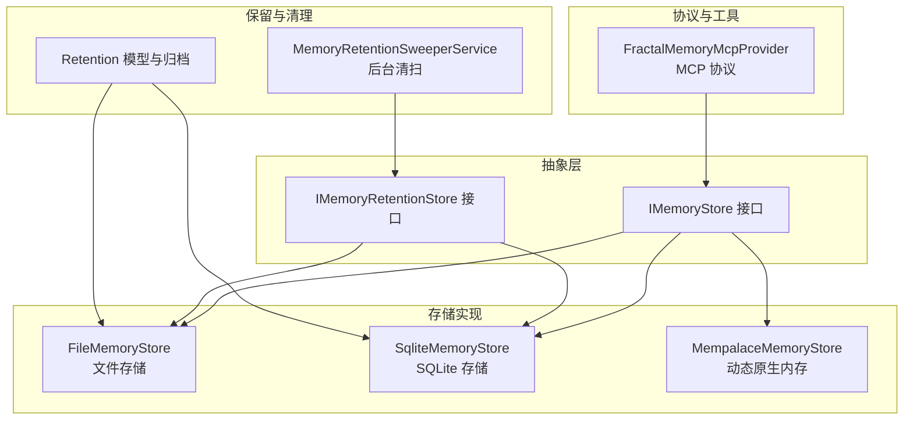
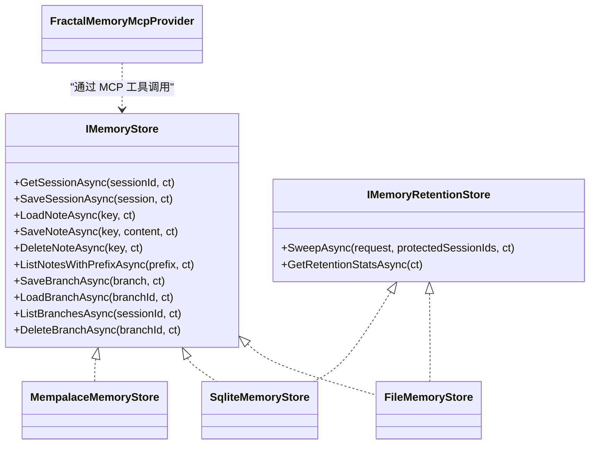
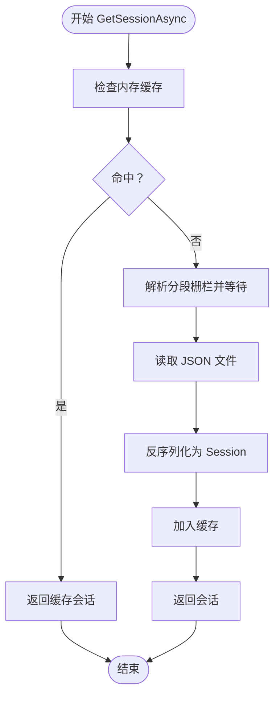
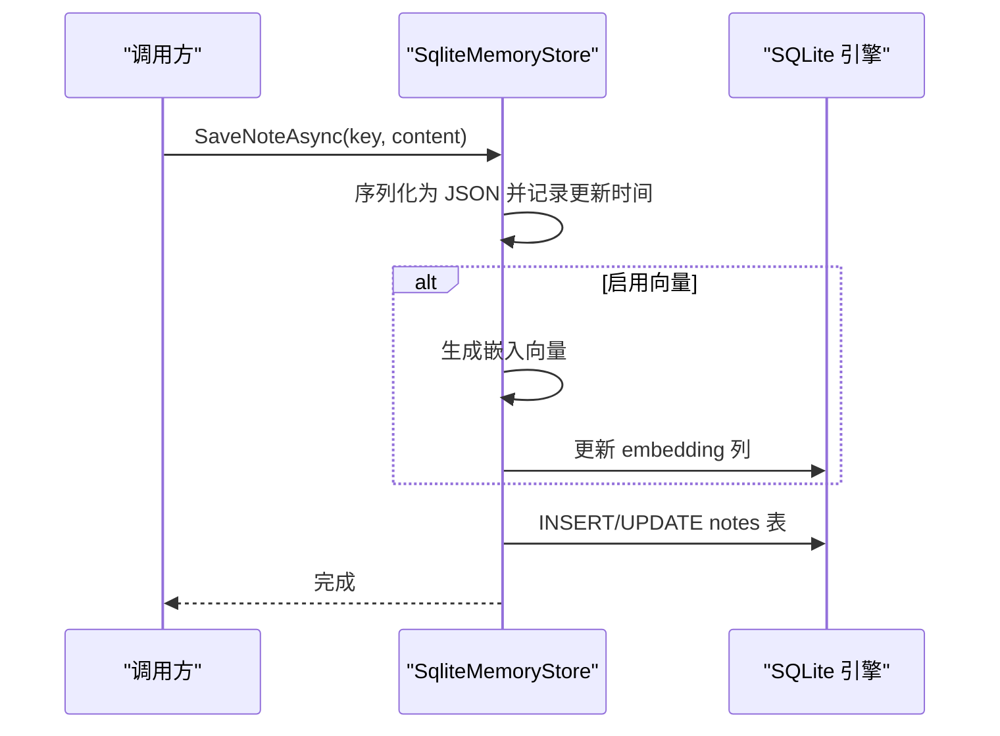
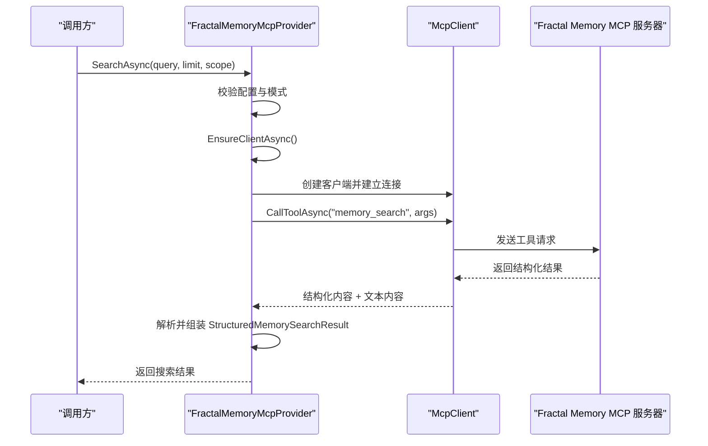
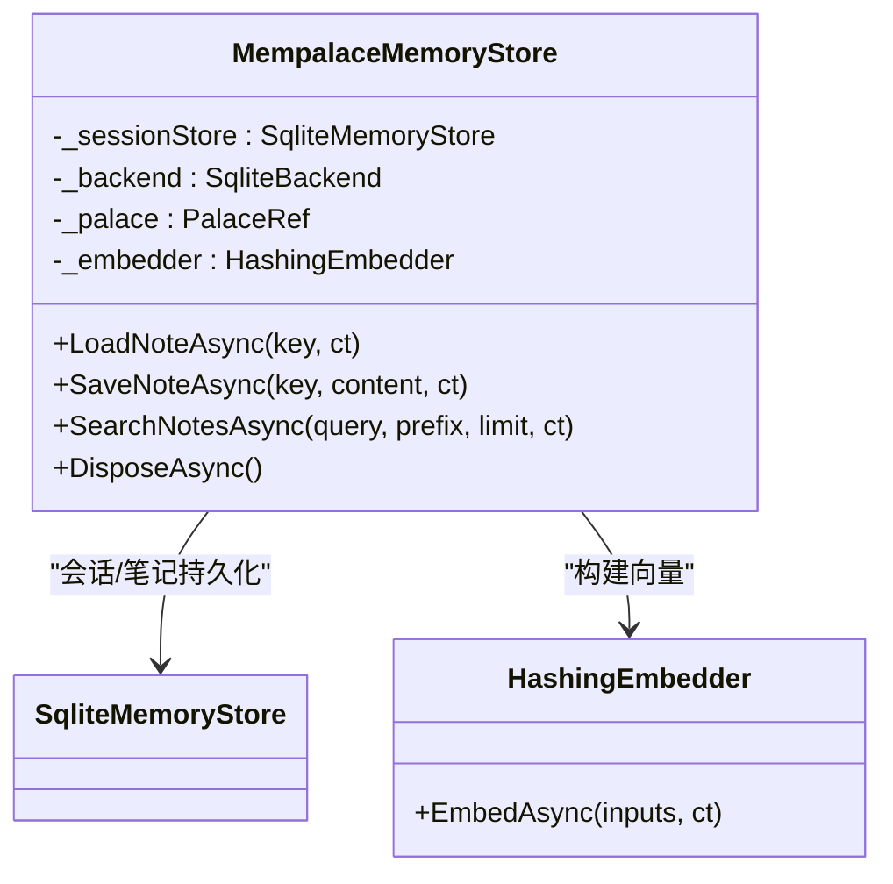
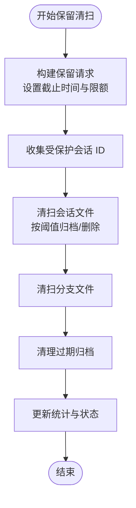

# 内存存储服务

<cite>
**本文档引用的文件**
- [IMemoryStore.cs](file://src/OpenClaw.Core/Abstractions/IMemoryStore.cs)
- [FileMemoryStore.cs](file://src/OpenClaw.Core/Memory/FileMemoryStore.cs)
- [SqliteMemoryStore.cs](file://src/OpenClaw.Core/Memory/SqliteMemoryStore.cs)
- [FractalMemoryMcpProvider.cs](file://src/OpenClaw.Agent/Memory/FractalMemoryMcpProvider.cs)
- [MempalaceMemoryStore.cs](file://src/OpenClaw.Plugins.Mempalace/MempalaceMemoryStore.cs)
- [MempalaceMemoryPlugin.cs](file://src/OpenClaw.Plugins.Mempalace/MempalaceMemoryPlugin.cs)
- [MemoryRetentionArchive.cs](file://src/OpenClaw.Core/Memory/MemoryRetentionArchive.cs)
- [IMemoryRetentionStore.cs](file://src/OpenClaw.Core/Abstractions/IMemoryRetentionStore.cs)
- [MemoryRetentionModels.cs](file://src/OpenClaw.Core/Models/MemoryRetentionModels.cs)
- [MemoryRetentionSweeperService.cs](file://src/OpenClaw.Gateway/Extensions/MemoryRetentionSweeperService.cs)
- [GatewayConfig.cs](file://src/OpenClaw.Core/Models/GatewayConfig.cs)
</cite>

## 目录
1. [简介](#简介)
2. [项目结构](#项目结构)
3. [核心组件](#核心组件)
4. [架构总览](#架构总览)
5. [详细组件分析](#详细组件分析)
6. [依赖关系分析](#依赖关系分析)
7. [性能考虑](#性能考虑)
8. [故障排查指南](#故障排查指南)
9. [结论](#结论)
10. [附录](#附录)

## 简介
本文件系统性地文档化了内存存储服务的设计与实现，覆盖接口抽象、文件存储与 SQLite 存储的实现差异、内存保留策略、缓存机制与数据持久化、配置选项、性能优化与扩展机制，并重点阐述 FractalMemoryMcpProvider 的 MCP 协议支持与动态原生内存存储（MemPalace）的实现原理。文档提供架构图、配置示例与最佳实践，帮助开发者在不同场景下选择合适的存储后端并进行性能调优。

## 项目结构
内存存储相关的核心代码分布在以下模块：
- 抽象层：定义统一的内存存储接口与可选的保留能力接口
- 文件存储：基于本地文件系统的实现，带内存缓存与索引
- SQLite 存储：基于 SQLite 的实现，支持全文检索与向量嵌入
- MCP 提供者：通过 Model Context Protocol 与外部 Fractal Memory 服务器交互
- 动态原生插件：MemPalace 原生内存与知识图谱的集成
- 保留与清理：归档、清理过期数据与后台清扫服务

图表来源
- [IMemoryStore.cs:9-23](file://src/OpenClaw.Core/Abstractions/IMemoryStore.cs#L9-L23)
- [FileMemoryStore.cs:32-76](file://src/OpenClaw.Core/Memory/FileMemoryStore.cs#L32-L76)
- [SqliteMemoryStore.cs:12-44](file://src/OpenClaw.Core/Memory/SqliteMemoryStore.cs#L12-L44)
- [MempalaceMemoryStore.cs:15-57](file://src/OpenClaw.Plugins.Mempalace/MempalaceMemoryStore.cs#L15-L57)
- [FractalMemoryMcpProvider.cs:13-30](file://src/OpenClaw.Agent/Memory/FractalMemoryMcpProvider.cs#L13-L30)
- [MemoryRetentionSweeperService.cs:22-63](file://src/OpenClaw.Gateway/Extensions/MemoryRetentionSweeperService.cs#L22-L63)
- [MemoryRetentionModels.cs:7-82](file://src/OpenClaw.Core/Models/MemoryRetentionModels.cs#L7-L82)

章节来源
- [IMemoryStore.cs:9-23](file://src/OpenClaw.Core/Abstractions/IMemoryStore.cs#L9-L23)
- [FileMemoryStore.cs:32-76](file://src/OpenClaw.Core/Memory/FileMemoryStore.cs#L32-L76)
- [SqliteMemoryStore.cs:12-44](file://src/OpenClaw.Core/Memory/SqliteMemoryStore.cs#L12-L44)
- [MempalaceMemoryStore.cs:15-57](file://src/OpenClaw.Plugins.Mempalace/MempalaceMemoryStore.cs#L15-L57)
- [FractalMemoryMcpProvider.cs:13-30](file://src/OpenClaw.Agent/Memory/FractalMemoryMcpProvider.cs#L13-L30)
- [MemoryRetentionSweeperService.cs:22-63](file://src/OpenClaw.Gateway/Extensions/MemoryRetentionSweeperService.cs#L22-L63)
- [MemoryRetentionModels.cs:7-82](file://src/OpenClaw.Core/Models/MemoryRetentionModels.cs#L7-L82)

## 核心组件
- IMemoryStore：定义会话、笔记与分支的读写、列表与删除等操作，是所有存储实现的基础契约。
- FileMemoryStore：以 JSON 文件形式持久化会话与分支，笔记以 Markdown 文件保存；内置内存缓存与并发加载栅栏，支持迁移与损坏隔离。
- SqliteMemoryStore：使用 SQLite 表存储会话与笔记，支持 FTS5 全文检索与可选向量嵌入；提供更丰富的查询与统计能力。
- FractalMemoryMcpProvider：通过 MCP 协议与外部 Fractal Memory 服务器通信，提供搜索、打开、最近更新、导出、交接等结构化记忆能力。
- MempalaceMemoryStore：动态原生内存插件，结合 MemPalace 向量集合与知识图谱，提供高性能检索与语义组织。
- 保留与清扫：Retention 接口、模型与后台服务，支持按时间阈值归档与清理，统计持久化实体数量。

章节来源
- [IMemoryStore.cs:9-23](file://src/OpenClaw.Core/Abstractions/IMemoryStore.cs#L9-L23)
- [FileMemoryStore.cs:32-76](file://src/OpenClaw.Core/Memory/FileMemoryStore.cs#L32-L76)
- [SqliteMemoryStore.cs:12-44](file://src/OpenClaw.Core/Memory/SqliteMemoryStore.cs#L12-L44)
- [FractalMemoryMcpProvider.cs:13-30](file://src/OpenClaw.Agent/Memory/FractalMemoryMcpProvider.cs#L13-L30)
- [MempalaceMemoryStore.cs:15-57](file://src/OpenClaw.Plugins.Mempalace/MempalaceMemoryStore.cs#L15-L57)
- [IMemoryRetentionStore.cs:9-17](file://src/OpenClaw.Core/Abstractions/IMemoryRetentionStore.cs#L9-L17)
- [MemoryRetentionModels.cs:7-82](file://src/OpenClaw.Core/Models/MemoryRetentionModels.cs#L7-L82)

## 架构总览
内存存储服务采用“接口抽象 + 多后端实现 + 可选保留能力”的分层设计。上层业务仅依赖抽象接口，运行时根据配置选择具体实现。SQLite 实现提供更强的检索与统计能力；文件实现适合本地优先与简单部署；MCP 提供者用于对接外部记忆系统；动态原生插件将向量与知识图谱能力内嵌到运行时。

图表来源
- [IMemoryStore.cs:9-23](file://src/OpenClaw.Core/Abstractions/IMemoryStore.cs#L9-L23)
- [FileMemoryStore.cs:32-76](file://src/OpenClaw.Core/Memory/FileMemoryStore.cs#L32-L76)
- [SqliteMemoryStore.cs:12-44](file://src/OpenClaw.Core/Memory/SqliteMemoryStore.cs#L12-L44)
- [MempalaceMemoryStore.cs:15-57](file://src/OpenClaw.Plugins.Mempalace/MempalaceMemoryStore.cs#L15-L57)
- [IMemoryRetentionStore.cs:9-17](file://src/OpenClaw.Core/Abstractions/IMemoryRetentionStore.cs#L9-L17)

## 详细组件分析

### IMemoryStore 接口设计
- 职责：统一会话、笔记与分支的 CRUD 与检索能力，确保不同后端的一致行为。
- 设计要点：方法签名采用 ValueTask，支持异步取消；分支操作独立于会话，便于多分支并行管理。
- 扩展性：通过新增接口（如 IMemoryRetentionStore）保持对 IMemoryStore 的无侵入扩展。

章节来源
- [IMemoryStore.cs:9-23](file://src/OpenClaw.Core/Abstractions/IMemoryStore.cs#L9-L23)

### 文件存储实现（FileMemoryStore）
- 数据持久化：会话与分支以 JSON 文件保存，笔记以 Markdown 文件保存；键名经 URL 安全 Base64 编码，防止路径穿越。
- 内存缓存：使用 MemoryCache 缓存会话对象，支持大小限制；并发加载通过分段信号量栅栏避免重复 IO。
- 搜索与索引：维护笔记键索引，支持前缀列表与基于文本的模糊匹配；支持全文检索与向量相似度混合排序（由上层调用决定）。
- 归档与清理：支持按时间阈值归档与批量清理，错误与损坏文件隔离处理。
- 性能特性：顺序扫描、原子写入、临时文件回滚、损坏文件移动至隔离区。

图表来源
- [FileMemoryStore.cs:78-170](file://src/OpenClaw.Core/Memory/FileMemoryStore.cs#L78-L170)

章节来源
- [FileMemoryStore.cs:32-76](file://src/OpenClaw.Core/Memory/FileMemoryStore.cs#L32-L76)
- [FileMemoryStore.cs:78-170](file://src/OpenClaw.Core/Memory/FileMemoryStore.cs#L78-L170)
- [FileMemoryStore.cs:225-262](file://src/OpenClaw.Core/Memory/FileMemoryStore.cs#L225-L262)
- [FileMemoryStore.cs:279-326](file://src/OpenClaw.Core/Memory/FileMemoryStore.cs#L279-L326)
- [FileMemoryStore.cs:351-405](file://src/OpenClaw.Core/Memory/FileMemoryStore.cs#L351-L405)
- [FileMemoryStore.cs:570-612](file://src/OpenClaw.Core/Memory/FileMemoryStore.cs#L570-L612)

### SQLite 存储实现（SqliteMemoryStore）
- 数据持久化：使用 WAL 模式、外键约束与索引优化；会话与分支表结构清晰，更新时间戳用于保留策略。
- 全文检索：可选启用 FTS5 虚拟表与触发器，自动同步笔记内容；支持 bm25 排序与前缀过滤。
- 向量嵌入：可选启用嵌入列，通过外部嵌入生成器计算并存储向量，支持向量相似度与 FTS 的混合评分。
- 查询能力：支持前缀列表、关键词搜索、时间范围筛选与分页；分支查询按更新时间倒序。
- 性能特性：参数化 SQL、连接池共享模式、触发器自动同步、向量列懒更新。

图表来源
- [SqliteMemoryStore.cs:237-282](file://src/OpenClaw.Core/Memory/SqliteMemoryStore.cs#L237-L282)

章节来源
- [SqliteMemoryStore.cs:12-44](file://src/OpenClaw.Core/Memory/SqliteMemoryStore.cs#L12-L44)
- [SqliteMemoryStore.cs:54-148](file://src/OpenClaw.Core/Memory/SqliteMemoryStore.cs#L54-L148)
- [SqliteMemoryStore.cs:237-282](file://src/OpenClaw.Core/Memory/SqliteMemoryStore.cs#L237-L282)
- [SqliteMemoryStore.cs:319-490](file://src/OpenClaw.Core/Memory/SqliteMemoryStore.cs#L319-L490)
- [SqliteMemoryStore.cs:654-732](file://src/OpenClaw.Core/Memory/SqliteMemoryStore.cs#L654-L732)

### MCP 协议支持（FractalMemoryMcpProvider）
- 运行模式：通过 STDIO 传输启动外部 MCP 服务器进程，工作目录与环境变量可配置；支持仓库根路径解析与警告提示。
- 工具调用：封装 memory_search、memory_open、memory_recent、memory_export、memory_handoff_create、memory_validate、memory_index_refresh 等工具，统一参数标准化与响应解析。
- 错误处理：针对超时、进程异常、JSON 解析失败等情况提供友好错误消息与日志记录。
- 配置要求：必须启用 Fractal 模式且配置有效的 MCP 命令；仓库根不存在或缺少配置文件时给出明确提示。

图表来源
- [FractalMemoryMcpProvider.cs:70-95](file://src/OpenClaw.Agent/Memory/FractalMemoryMcpProvider.cs#L70-L95)
- [FractalMemoryMcpProvider.cs:222-277](file://src/OpenClaw.Agent/Memory/FractalMemoryMcpProvider.cs#L222-L277)
- [FractalMemoryMcpProvider.cs:279-330](file://src/OpenClaw.Agent/Memory/FractalMemoryMcpProvider.cs#L279-L330)

章节来源
- [FractalMemoryMcpProvider.cs:13-30](file://src/OpenClaw.Agent/Memory/FractalMemoryMcpProvider.cs#L13-L30)
- [FractalMemoryMcpProvider.cs:70-95](file://src/OpenClaw.Agent/Memory/FractalMemoryMcpProvider.cs#L70-L95)
- [FractalMemoryMcpProvider.cs:222-277](file://src/OpenClaw.Agent/Memory/FractalMemoryMcpProvider.cs#L222-L277)
- [FractalMemoryMcpProvider.cs:279-330](file://src/OpenClaw.Agent/Memory/FractalMemoryMcpProvider.cs#L279-L330)

### 动态原生内存存储（MempalaceMemoryStore）
- 架构组成：组合 SqliteMemoryStore（会话与笔记持久化）、MemPalace 向量集合（语义检索）、知识图谱（空间与语义关系）。
- 检索策略：优先使用向量集合查询，回退到 Sqlite 笔记搜索；支持按前缀过滤与元数据更新时间排序。
- 知识图谱：记录记忆的物理位置（翼/房间/抽屉）与层级关系，便于后续推理与导航。
- 生命周期：延迟初始化向量集合与知识图谱，线程安全；统一 Dispose 流程。

图表来源
- [MempalaceMemoryStore.cs:15-57](file://src/OpenClaw.Plugins.Mempalace/MempalaceMemoryStore.cs#L15-L57)
- [MempalaceMemoryStore.cs:70-124](file://src/OpenClaw.Plugins.Mempalace/MempalaceMemoryStore.cs#L70-L124)
- [MempalaceMemoryStore.cs:129-176](file://src/OpenClaw.Plugins.Mempalace/MempalaceMemoryStore.cs#L129-L176)

章节来源
- [MempalaceMemoryStore.cs:15-57](file://src/OpenClaw.Plugins.Mempalace/MempalaceMemoryStore.cs#L15-L57)
- [MempalaceMemoryStore.cs:70-124](file://src/OpenClaw.Plugins.Mempalace/MempalaceMemoryStore.cs#L70-L124)
- [MempalaceMemoryStore.cs:129-176](file://src/OpenClaw.Plugins.Mempalace/MempalaceMemoryStore.cs#L129-L176)
- [MempalaceMemoryPlugin.cs:6-19](file://src/OpenClaw.Plugins.Mempalace/MempalaceMemoryPlugin.cs#L6-L19)

### 内存保留策略与清理
- 保留模型：请求、结果与运行状态模型定义清晰的时间阈值、归档路径与统计字段。
- 清扫服务：周期性或手动触发，构建受保护会话集合（活跃会话与特定标签），按阈值归档与删除，支持干跑模式。
- 归档机制：按日期分层存储，支持过期清理与空目录回收。
- 统计与可观测：清扫服务更新指标与状态，便于监控与诊断。

图表来源
- [MemoryRetentionSweeperService.cs:143-199](file://src/OpenClaw.Gateway/Extensions/MemoryRetentionSweeperService.cs#L143-L199)
- [MemoryRetentionSweeperService.cs:201-241](file://src/OpenClaw.Gateway/Extensions/MemoryRetentionSweeperService.cs#L201-L241)
- [MemoryRetentionArchive.cs:7-77](file://src/OpenClaw.Core/Memory/MemoryRetentionArchive.cs#L7-L77)

章节来源
- [MemoryRetentionModels.cs:7-82](file://src/OpenClaw.Core/Models/MemoryRetentionModels.cs#L7-L82)
- [IMemoryRetentionStore.cs:9-17](file://src/OpenClaw.Core/Abstractions/IMemoryRetentionStore.cs#L9-L17)
- [MemoryRetentionSweeperService.cs:22-63](file://src/OpenClaw.Gateway/Extensions/MemoryRetentionSweeperService.cs#L22-L63)
- [MemoryRetentionSweeperService.cs:143-199](file://src/OpenClaw.Gateway/Extensions/MemoryRetentionSweeperService.cs#L143-L199)
- [MemoryRetentionArchive.cs:7-77](file://src/OpenClaw.Core/Memory/MemoryRetentionArchive.cs#L7-L77)

## 依赖关系分析
- 松耦合：上层仅依赖 IMemoryStore；保留能力通过 IMemoryRetentionStore 可选实现。
- 外部依赖：SQLite 使用 Microsoft.Data.Sqlite；MCP 使用 ModelContextProtocol；MemPalace 使用 MemPalace.* 命名空间。
- 循环依赖：未见直接循环；保留服务通过类型断言检测是否支持保留能力。

图表来源
- [IMemoryStore.cs:9-23](file://src/OpenClaw.Core/Abstractions/IMemoryStore.cs#L9-L23)
- [FileMemoryStore.cs:32-76](file://src/OpenClaw.Core/Memory/FileMemoryStore.cs#L32-L76)
- [SqliteMemoryStore.cs:12-44](file://src/OpenClaw.Core/Memory/SqliteMemoryStore.cs#L12-L44)
- [FractalMemoryMcpProvider.cs:13-30](file://src/OpenClaw.Agent/Memory/FractalMemoryMcpProvider.cs#L13-L30)
- [MempalaceMemoryStore.cs:15-57](file://src/OpenClaw.Plugins.Mempalace/MempalaceMemoryStore.cs#L15-L57)

章节来源
- [IMemoryStore.cs:9-23](file://src/OpenClaw.Core/Abstractions/IMemoryStore.cs#L9-L23)
- [FileMemoryStore.cs:32-76](file://src/OpenClaw.Core/Memory/FileMemoryStore.cs#L32-L76)
- [SqliteMemoryStore.cs:12-44](file://src/OpenClaw.Core/Memory/SqliteMemoryStore.cs#L12-L44)
- [FractalMemoryMcpProvider.cs:13-30](file://src/OpenClaw.Agent/Memory/FractalMemoryMcpProvider.cs#L13-L30)
- [MempalaceMemoryStore.cs:15-57](file://src/OpenClaw.Plugins.Mempalace/MempalaceMemoryStore.cs#L15-L57)

## 性能考虑
- 文件存储
  - 内存缓存：合理设置最大缓存会话数，平衡内存占用与命中率。
  - 加载并发：分段栅栏减少重复加载，避免热点会话争用。
  - 原子写入：临时文件 + 原子重命名，保证一致性与崩溃恢复。
  - 损坏隔离：损坏文件移动到隔离区，不影响其他数据读取。
- SQLite 存储
  - WAL 模式与 NORMAL 同步：提升并发写入吞吐。
  - FTS5 触发器：自动同步笔记变更，降低应用侧复杂度。
  - 向量嵌入：按需生成，避免每次写入都计算向量。
- MCP 与动态原生
  - MCP：合理设置超时与重试；进程生命周期管理；工作目录与环境变量正确配置。
  - MemPalace：延迟初始化集合与知识图谱；向量维度与哈希嵌入策略影响检索质量与性能。

[本节为通用指导，无需列出具体文件来源]

## 故障排查指南
- 文件存储
  - 损坏文件：查看 QuarantineCorruptionException 与隔离文件命名规则，定位问题会话或笔记。
  - 读取失败：确认编码键与文件存在性；检查权限与磁盘空间。
- SQLite 存储
  - FTS5 启用失败：确认 SQLite 版本与扩展可用性；回退到基础搜索。
  - 向量生成异常：检查嵌入生成器可用性与网络访问；记录警告日志。
- MCP 提供者
  - 进程启动失败：检查 McpCommand 是否可执行、工作目录是否存在；查看 Win32 异常信息。
  - 工具调用错误：核对参数标准化与响应解析逻辑；关注超时与取消异常。
- 保留清扫
  - 清扫中断：检查运行状态与并发门控；确认受保护会话集合构建是否正确。
  - 归档清理失败：查看错误列表与文件枚举异常；确认归档路径权限。

章节来源
- [FileMemoryStore.cs:191-223](file://src/OpenClaw.Core/Memory/FileMemoryStore.cs#L191-L223)
- [SqliteMemoryStore.cs:170-178](file://src/OpenClaw.Core/Memory/SqliteMemoryStore.cs#L170-L178)
- [FractalMemoryMcpProvider.cs:262-277](file://src/OpenClaw.Agent/Memory/FractalMemoryMcpProvider.cs#L262-L277)
- [MemoryRetentionSweeperService.cs:123-141](file://src/OpenClaw.Gateway/Extensions/MemoryRetentionSweeperService.cs#L123-L141)

## 结论
内存存储服务通过统一接口与多种后端实现，满足从本地优先到企业级检索的不同需求。文件存储适合轻量部署与快速迭代；SQLite 提供强大的全文与向量能力；MCP 与动态原生插件则打通外部记忆系统与知识图谱。配合完善的保留策略与后台清扫服务，系统在可用性、性能与可维护性之间取得良好平衡。

[本节为总结性内容，无需列出具体文件来源]

## 附录

### 配置示例与最佳实践
- 基础配置（GatewayConfig.Memory）
  - Provider：选择 "file"、"sqlite" 或 "mempalace"
  - StoragePath：文件存储根目录
  - MaxCachedSessions：文件存储最大缓存会话数
  - Sqlite：启用 FTS 与向量嵌入的开关
  - Mempalace：基座路径、集合名称、嵌入维度、默认分区等
  - Fractal：启用、模式、MCP 命令、仓库根、自动上下文模式、写入权限
  - Retention：启用、清扫间隔、会话/分支 TTL、归档路径与保留天数、每轮最大项数
- 最佳实践
  - 生产环境建议使用 SQLite + FTS5 + 向量嵌入，提高检索质量与性能
  - 文件存储适用于开发与小规模部署，注意缓存大小与磁盘 IO
  - MCP 模式需要稳定的外部服务器与正确的命令配置
  - 启用保留清扫并设置合理的 TTL 与归档策略，定期检查清理日志

章节来源
- [GatewayConfig.cs:175-200](file://src/OpenClaw.Core/Models/GatewayConfig.cs#L175-L200)
- [MemoryRetentionSweeperService.cs:201-219](file://src/OpenClaw.Gateway/Extensions/MemoryRetentionSweeperService.cs#L201-L219)