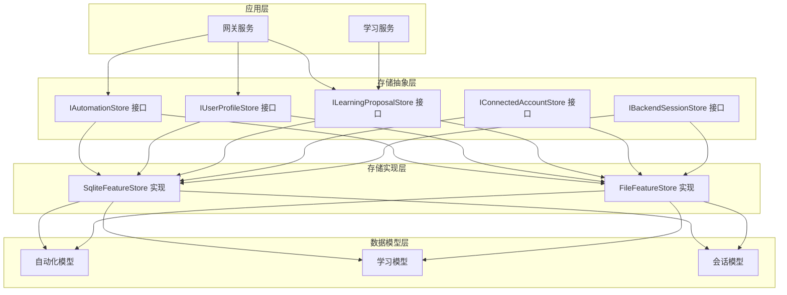
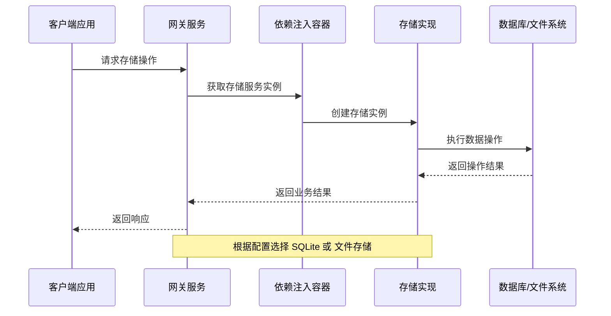
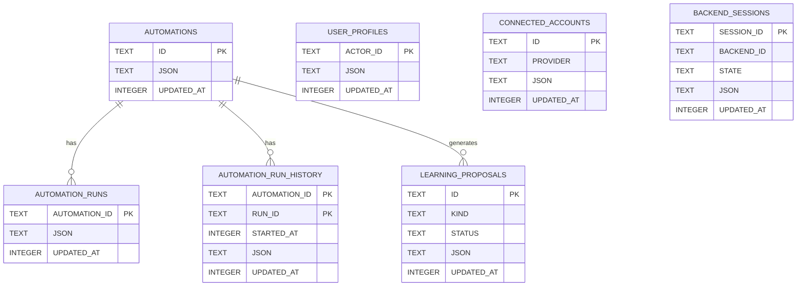
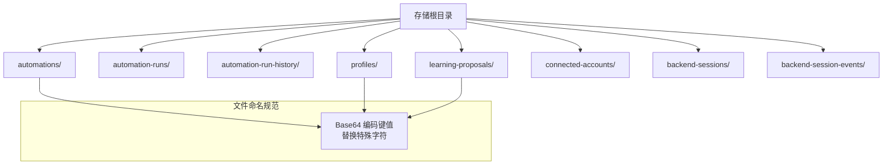
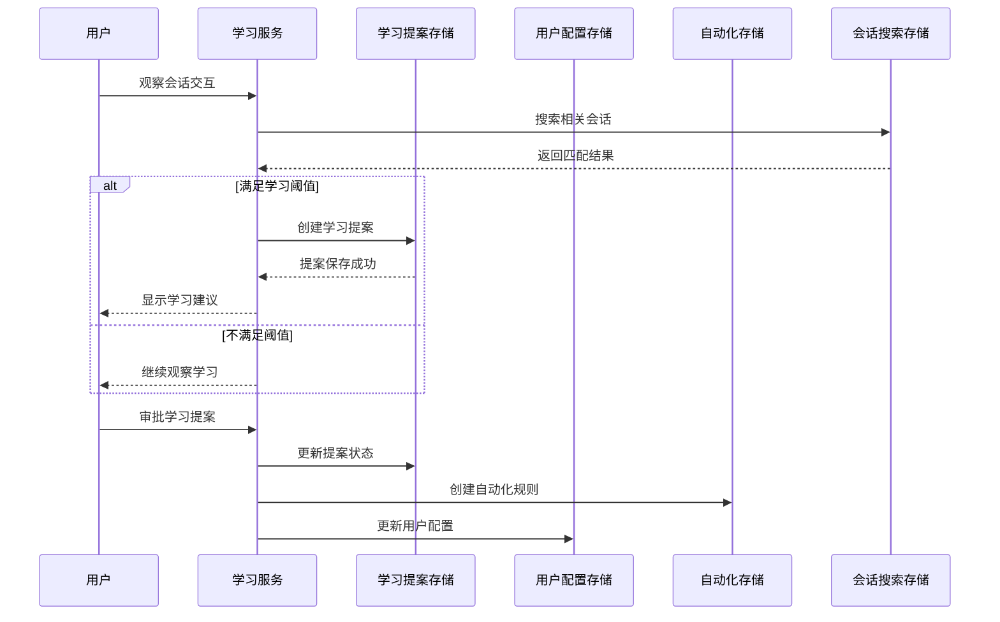
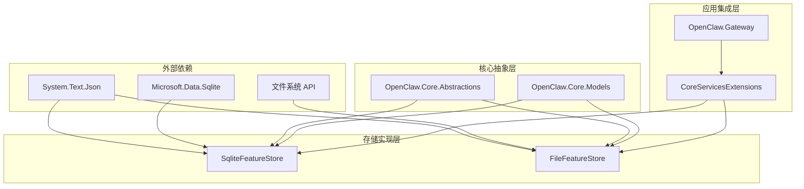
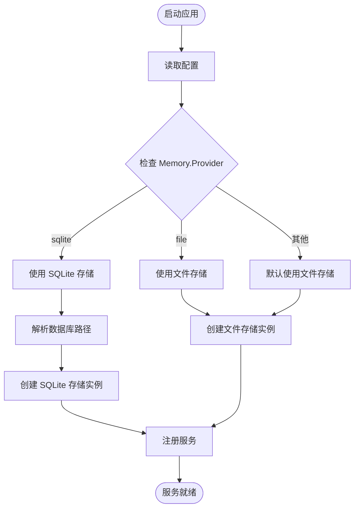
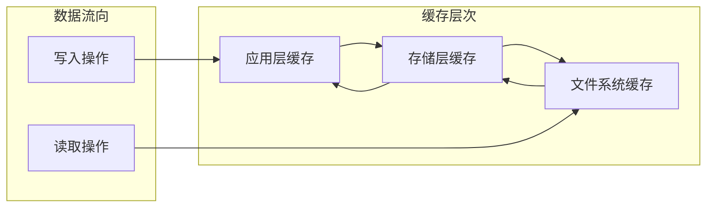

# 功能存储服务

<cite>
**本文档引用的文件**
- [SqliteFeatureStore.cs](file://src/OpenClaw.Core/Features/SqliteFeatureStore.cs)
- [FileFeatureStore.cs](file://src/OpenClaw.Core/Features/FileFeatureStore.cs)
- [IAutomationStore.cs](file://src/OpenClaw.Core/Abstractions/IAutomationStore.cs)
- [IUserProfileStore.cs](file://src/OpenClaw.Core/Abstractions/IUserProfileStore.cs)
- [ILearningProposalStore.cs](file://src/OpenClaw.Core/Abstractions/ILearningProposalStore.cs)
- [CodingBackendAbstractions.cs](file://src/OpenClaw.Core/Abstractions/CodingBackendAbstractions.cs)
- [LearningService.cs](file://src/OpenClaw.Gateway/LearningService.cs)
- [CoreServicesExtensions.cs](file://src/OpenClaw.Gateway/Composition/CoreServicesExtensions.cs)
- [GatewayConfig.cs](file://src/OpenClaw.Core/Models/GatewayConfig.cs)
- [LearningModels.cs](file://src/OpenClaw.Core/Models/LearningModels.cs)
- [AutomationModels.cs](file://src/OpenClaw.Core/Models/AutomationModels.cs)
- [Session.cs](file://src/OpenClaw.Core/Models/Session.cs)
- [FeatureFallbackServices.cs](file://src/OpenClaw.Gateway/Composition/FeatureFallbackServices.cs)
- [IntegrationApiFacade.cs](file://src/OpenClaw.Gateway/Composition/IntegrationApiFacade.cs)
- [AdminEndpoints.Memory.cs](file://src/OpenClaw.Gateway/Endpoints/AdminEndpoints.Memory.cs)
- [MaintenanceCoordinator.cs](file://src/OpenClaw.Core/Setup/MaintenanceCoordinator.cs)
</cite>

## 目录
1. [简介](#简介)
2. [项目结构](#项目结构)
3. [核心组件](#核心组件)
4. [架构概览](#架构概览)
5. [详细组件分析](#详细组件分析)
6. [依赖关系分析](#依赖关系分析)
7. [性能考虑](#性能考虑)
8. [故障排除指南](#故障排除指南)
9. [结论](#结论)
10. [附录](#附录)

## 简介

功能存储服务是 OpenClaw 智能体平台的核心基础设施，负责管理自动化规则、用户配置、学习提案等关键功能数据。该服务提供了两种存储后端：SQLite 关系数据库和文件系统存储，支持在不同部署场景下的灵活选择。

本服务主要处理以下核心功能：
- 自动化存储：管理自动化规则定义、运行状态和历史记录
- 用户配置存储：维护用户档案和偏好设置
- 学习提案存储：跟踪学习建议的状态和生命周期
- 连接账户存储：管理外部服务连接信息
- 后端会话存储：维护与外部系统的会话状态

## 项目结构

功能存储服务采用分层架构设计，通过抽象接口定义统一的数据访问契约，具体实现根据配置选择不同的存储后端。

**图表来源**
- [CoreServicesExtensions.cs:263-282](file://src/OpenClaw.Gateway/Composition/CoreServicesExtensions.cs#L263-L282)
- [SqliteFeatureStore.cs:8-480](file://src/OpenClaw.Core/Features/SqliteFeatureStore.cs#L8-L480)
- [FileFeatureStore.cs:8-272](file://src/OpenClaw.Core/Features/FileFeatureStore.cs#L8-L272)

**章节来源**
- [CoreServicesExtensions.cs:263-282](file://src/OpenClaw.Gateway/Composition/CoreServicesExtensions.cs#L263-L282)
- [GatewayConfig.cs:175-201](file://src/OpenClaw.Core/Models/GatewayConfig.cs#L175-L201)

## 核心组件

功能存储服务由多个核心组件构成，每个组件都有明确的职责分工：

### 存储接口层
- **IAutomationStore**：自动化规则的完整生命周期管理
- **IUserProfileStore**：用户档案和配置信息管理
- **ILearningProposalStore**：学习提案的状态跟踪和生命周期管理
- **IConnectedAccountStore**：外部服务连接账户管理
- **IBackendSessionStore**：后端系统会话状态管理

### 存储实现层
- **SqliteFeatureStore**：基于 SQLite 的关系型存储实现
- **FileFeatureStore**：基于文件系统的存储实现

### 数据模型层
- **自动化模型**：包括自动化定义、运行状态、运行记录
- **学习模型**：涵盖学习提案、技能草案、配置更新
- **会话模型**：用户会话、聊天轮次、工具调用

**章节来源**
- [IAutomationStore.cs:5-18](file://src/OpenClaw.Core/Abstractions/IAutomationStore.cs#L5-L18)
- [IUserProfileStore.cs:5-12](file://src/OpenClaw.Core/Abstractions/IUserProfileStore.cs#L5-L12)
- [ILearningProposalStore.cs:5-14](file://src/OpenClaw.Core/Abstractions/ILearningProposalStore.cs#L5-L14)
- [CodingBackendAbstractions.cs:5-21](file://src/OpenClaw.Core/Abstractions/CodingBackendAbstractions.cs#L5-L21)

## 架构概览

功能存储服务采用依赖注入和工厂模式，通过配置驱动的方式选择合适的存储后端。系统支持运行时切换存储类型，确保了部署的灵活性。

**图表来源**
- [CoreServicesExtensions.cs:263-282](file://src/OpenClaw.Gateway/Composition/CoreServicesExtensions.cs#L263-L282)
- [MaintenanceCoordinator.cs:782-793](file://src/OpenClaw.Core/Setup/MaintenanceCoordinator.cs#L782-L793)

## 详细组件分析

### SQLite 特性存储实现

SqliteFeatureStore 提供了完整的功能存储解决方案，支持复杂查询和事务处理。

#### 数据库架构设计

**图表来源**
- [SqliteFeatureStore.cs:33-96](file://src/OpenClaw.Core/Features/SqliteFeatureStore.cs#L33-L96)

#### 核心功能特性

1. **原子性操作**：所有写入操作都在单个事务中执行，确保数据一致性
2. **索引优化**：为常用查询字段建立索引，提升查询性能
3. **时间戳管理**：自动跟踪数据的最后更新时间
4. **JSON 序列化**：使用 System.Text.Json 进行高效的数据序列化

#### 性能优化策略

- **连接池管理**：使用共享缓存模式优化 SQLite 连接
- **批量操作**：支持批量查询和批量更新操作
- **内存映射**：利用 SQLite 的内存映射功能提升大文件处理效率

**章节来源**
- [SqliteFeatureStore.cs:8-480](file://src/OpenClaw.Core/Features/SqliteFeatureStore.cs#L8-L480)

### 文件特性存储实现

FileFeatureStore 提供轻量级的文件系统存储方案，适合小型部署和开发环境。

#### 文件组织结构

**图表来源**
- [FileFeatureStore.cs:19-39](file://src/OpenClaw.Core/Features/FileFeatureStore.cs#L19-L39)

#### 核心功能特性

1. **简单可靠**：基于标准文件系统，部署简单
2. **人类可读**：JSON 文件格式便于调试和手动修改
3. **自动清理**：支持运行历史的自动清理和归档
4. **键值编码**：对特殊字符进行安全编码，避免文件系统兼容性问题

#### 性能考虑

- **文件系统限制**：大量小文件可能影响文件系统性能
- **并发控制**：需要适当的文件锁定机制防止并发冲突
- **磁盘空间**：定期清理历史数据以控制磁盘使用

**章节来源**
- [FileFeatureStore.cs:8-272](file://src/OpenClaw.Core/Features/FileFeatureStore.cs#L8-L272)

### 学习服务集成

学习服务作为功能存储的主要消费者，负责处理智能体的学习和自动化建议流程。

**图表来源**
- [LearningService.cs:55-83](file://src/OpenClaw.Gateway/LearningService.cs#L55-L83)
- [LearningService.cs:88-200](file://src/OpenClaw.Gateway/LearningService.cs#L88-L200)

#### 学习提案生命周期

| 状态 | 描述 | 典型操作 |
|------|------|----------|
| Pending | 待审批 | 创建、合并重复提案 |
| Approved | 已批准 | 生成自动化规则、更新配置 |
| Rejected | 已拒绝 | 记录拒绝原因、通知用户 |
| RolledBack | 已回滚 | 撤销已应用的变更 |

**章节来源**
- [LearningService.cs:14-53](file://src/OpenClaw.Gateway/LearningService.cs#L14-L53)
- [LearningModels.cs:23-29](file://src/OpenClaw.Core/Models/LearningModels.cs#L23-L29)

## 依赖关系分析

功能存储服务的依赖关系体现了清晰的关注点分离和模块化设计。

**图表来源**
- [SqliteFeatureStore.cs:1-5](file://src/OpenClaw.Core/Features/SqliteFeatureStore.cs#L1-L5)
- [FileFeatureStore.cs:1-5](file://src/OpenClaw.Core/Features/FileFeatureStore.cs#L1-L5)

### 配置驱动的存储选择

系统通过配置文件动态选择存储后端，支持运行时切换。

**图表来源**
- [CoreServicesExtensions.cs:263-293](file://src/OpenClaw.Gateway/Composition/CoreServicesExtensions.cs#L263-L293)
- [MaintenanceCoordinator.cs:782-793](file://src/OpenClaw.Core/Setup/MaintenanceCoordinator.cs#L782-L793)

**章节来源**
- [CoreServicesExtensions.cs:263-293](file://src/OpenClaw.Gateway/Composition/CoreServicesExtensions.cs#L263-L293)
- [GatewayConfig.cs:175-201](file://src/OpenClaw.Core/Models/GatewayConfig.cs#L175-L201)

## 性能考虑

功能存储服务在设计时充分考虑了不同场景下的性能需求。

### SQLite 存储性能优化

1. **连接管理**
   - 使用共享缓存模式减少连接开销
   - 连接字符串优化配置参数

2. **查询优化**
   - 为高频查询字段建立索引
   - 使用参数化查询防止 SQL 注入
   - 优化复杂查询的执行计划

3. **事务处理**
   - 批量操作使用事务提高性能
   - 合理的事务边界设计

### 文件存储性能优化

1. **文件系统优化**
   - 批量文件操作减少系统调用
   - 临时文件写入避免数据丢失
   - 文件锁定机制防止并发冲突

2. **内存管理**
   - 大文件读取使用流式处理
   - JSON 序列化使用 UTF-8 编码

### 缓存策略

## 故障排除指南

### 常见问题诊断

#### 存储权限问题
- **症状**：启动时抛出 IO 异常
- **原因**：存储路径无写权限或磁盘空间不足
- **解决**：检查文件系统权限和磁盘空间

#### 数据库连接问题
- **症状**：SQLite 操作失败
- **原因**：数据库文件损坏或被其他进程占用
- **解决**：重启服务或修复数据库文件

#### 并发访问冲突
- **症状**：文件操作异常或数据不一致
- **原因**：多进程同时访问同一文件
- **解决**：实现适当的文件锁定机制

### 监控和日志

系统提供详细的日志记录，包括：
- 存储操作的执行时间和结果
- 错误和异常的详细信息
- 性能指标和统计信息

**章节来源**
- [GatewayConfig.cs:175-201](file://src/OpenClaw.Core/Models/GatewayConfig.cs#L175-L201)

## 结论

功能存储服务通过抽象接口和多种存储实现，为 OpenClaw 平台提供了灵活、可靠的基础设施。SQLite 实现适合生产环境的高性能需求，而文件存储实现则简化了开发和测试场景。

### 主要优势

1. **灵活性**：支持多种存储后端，适应不同部署需求
2. **可扩展性**：模块化设计便于功能扩展和维护
3. **可靠性**：完善的错误处理和恢复机制
4. **性能**：针对不同场景的优化策略

### 最佳实践建议

1. **生产环境推荐**：使用 SQLite 存储实现
2. **开发环境**：可以使用文件存储简化部署
3. **数据备份**：定期备份重要数据
4. **监控告警**：建立完善的监控和告警机制

## 附录

### 配置选项参考

| 配置项 | 类型 | 默认值 | 描述 |
|--------|------|--------|------|
| Memory.Provider | string | "file" | 存储提供者类型 |
| Memory.StoragePath | string | "./memory" | 存储根目录 |
| Memory.Sqlite.DbPath | string | "./memory/openclaw.db" | SQLite 数据库文件路径 |
| Memory.Sqlite.EnableFts | bool | true | 是否启用全文搜索 |
| Memory.Retention.Enabled | bool | false | 是否启用数据保留策略 |

### API 接口定义

#### 自动化存储接口
- `ListAutomationsAsync()` - 列出所有自动化规则
- `GetAutomationAsync()` - 获取指定自动化规则
- `SaveAutomationAsync()` - 保存自动化规则
- `DeleteAutomationAsync()` - 删除自动化规则

#### 用户配置存储接口
- `ListProfilesAsync()` - 列出所有用户配置
- `GetProfileAsync()` - 获取指定用户配置
- `SaveProfileAsync()` - 保存用户配置
- `DeleteProfileAsync()` - 删除用户配置

#### 学习提案存储接口
- `ListProposalsAsync()` - 列出学习提案
- `GetProposalAsync()` - 获取学习提案
- `SaveProposalAsync()` - 保存学习提案

**章节来源**
- [IAutomationStore.cs:5-18](file://src/OpenClaw.Core/Abstractions/IAutomationStore.cs#L5-L18)
- [IUserProfileStore.cs:5-12](file://src/OpenClaw.Core/Abstractions/IUserProfileStore.cs#L5-L12)
- [ILearningProposalStore.cs:5-14](file://src/OpenClaw.Core/Abstractions/ILearningProposalStore.cs#L5-L14)
- [GatewayConfig.cs:175-227](file://src/OpenClaw.Core/Models/GatewayConfig.cs#L175-L227)