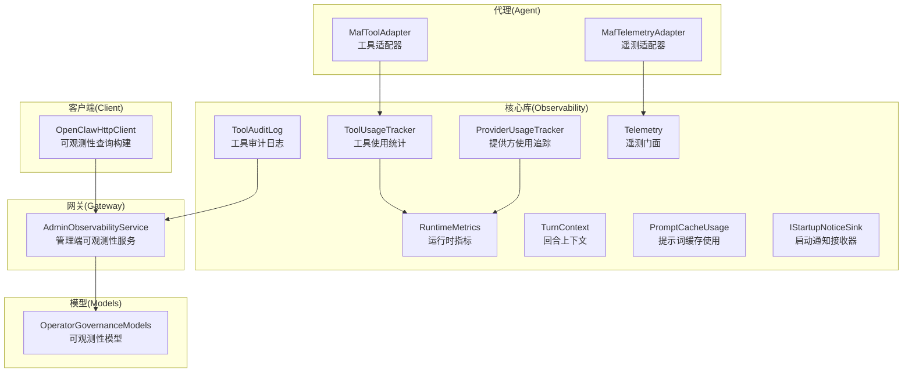
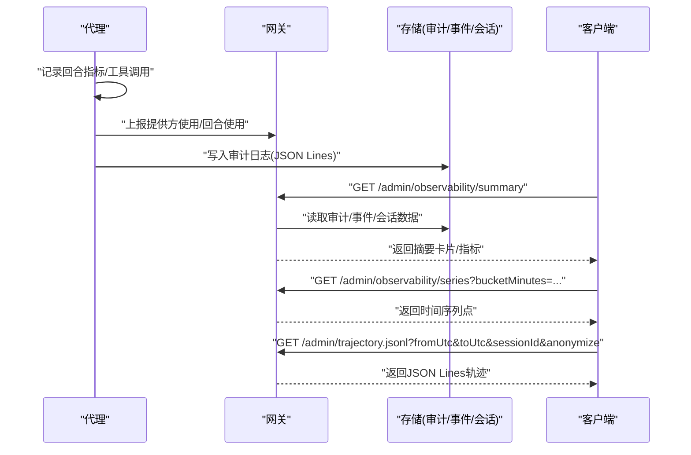
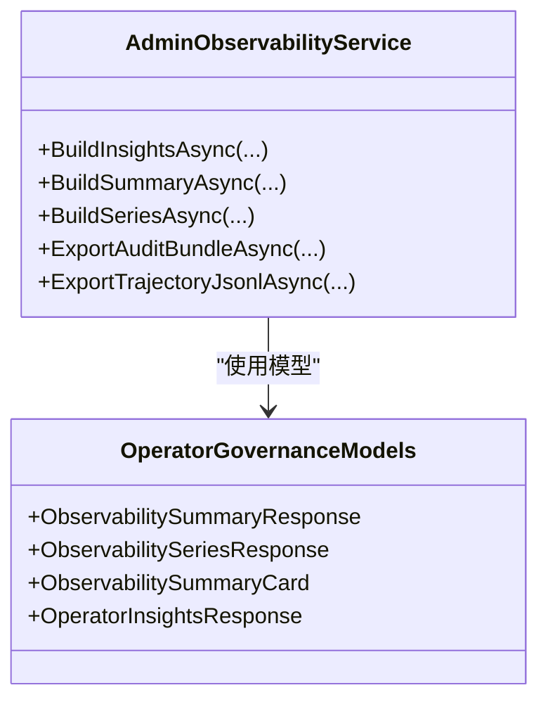
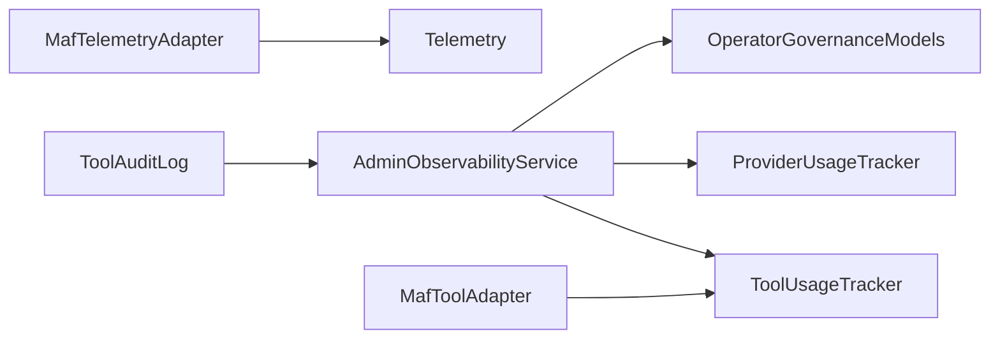

# 可观测性服务

<cite>
**本文引用的文件**
- [RuntimeMetrics.cs](file://src/OpenClaw.Core/Observability/RuntimeMetrics.cs)
- [ProviderUsageTracker.cs](file://src/OpenClaw.Core/Observability/ProviderUsageTracker.cs)
- [ToolUsageTracker.cs](file://src/OpenClaw.Core/Observability/ToolUsageTracker.cs)
- [ToolAuditLog.cs](file://src/OpenClaw.Core/Observability/ToolAuditLog.cs)
- [IStartupNoticeSink.cs](file://src/OpenClaw.Core/Observability/IStartupNoticeSink.cs)
- [PromptCacheUsage.cs](file://src/OpenClaw.Core/Observability/PromptCacheUsage.cs)
- [TurnContext.cs](file://src/OpenClaw.Core/Observability/TurnContext.cs)
- [Telemetry.cs](file://src/OpenClaw.Core/Observability/Telemetry.cs)
- [AdminObservabilityService.cs](file://src/OpenClaw.Gateway/AdminObservabilityService.cs)
- [MafTelemetryAdapter.cs](file://src/OpenClaw.Agent/MafTelemetryAdapter.cs)
- [MafToolAdapter.cs](file://src/OpenClaw.Agent/MafToolAdapter.cs)
- [OpenClawHttpClient.cs](file://src/OpenClaw.Client/OpenClawHttpClient.cs)
- [OperatorGovernanceModels.cs](file://src/OpenClaw.Core/Models/OperatorGovernanceModels.cs)
</cite>

## 目录
1. [简介](#简介)
2. [项目结构](#项目结构)
3. [核心组件](#核心组件)
4. [架构总览](#架构总览)
5. [详细组件分析](#详细组件分析)
6. [依赖关系分析](#依赖关系分析)
7. [性能考量](#性能考量)
8. [故障排查指南](#故障排查指南)
9. [结论](#结论)
10. [附录](#附录)

## 简介
本文件系统化梳理了 Kingcrab 项目的可观测性服务，覆盖运行时指标采集、提供方使用追踪、工具使用统计、审计日志、启动通知收集与性能监控机制。文档还提供了可观测性配置要点、指标格式与报告方式，并给出架构图与监控最佳实践，帮助运维与开发人员快速理解与使用该能力。

## 项目结构
可观测性相关代码主要分布在以下模块：
- 核心库（OpenClaw.Core）：定义运行时指标、使用追踪、审计日志、启动通知、提示词缓存使用提取等基础能力。
- 网关（OpenClaw.Gateway）：提供管理端可观测性聚合服务，支持摘要卡片、时间序列、轨迹导出与审计打包导出。
- 代理（OpenClaw.Agent）：桥接遥测与会话上下文，注入分布式追踪标签。
- 客户端（OpenClaw.Client）：提供前端查询可观测性数据的接口构造方法。
- 模型（OpenClaw.Core.Models）：定义可观测性响应模型与指标点结构。

**图表来源**
- [RuntimeMetrics.cs:10-312](file://src/OpenClaw.Core/Observability/RuntimeMetrics.cs#L10-L312)
- [ProviderUsageTracker.cs:7-176](file://src/OpenClaw.Core/Observability/ProviderUsageTracker.cs#L7-L176)
- [ToolUsageTracker.cs:5-59](file://src/OpenClaw.Core/Observability/ToolUsageTracker.cs#L5-L59)
- [ToolAuditLog.cs:39-125](file://src/OpenClaw.Core/Observability/ToolAuditLog.cs#L39-L125)
- [TurnContext.cs:12-76](file://src/OpenClaw.Core/Observability/TurnContext.cs#L12-L76)
- [PromptCacheUsage.cs:5-55](file://src/OpenClaw.Core/Observability/PromptCacheUsage.cs#L5-L55)
- [IStartupNoticeSink.cs:3-20](file://src/OpenClaw.Core/Observability/IStartupNoticeSink.cs#L3-L20)
- [Telemetry.cs:9-54](file://src/OpenClaw.Core/Observability/Telemetry.cs#L9-L54)
- [AdminObservabilityService.cs:16-1124](file://src/OpenClaw.Gateway/AdminObservabilityService.cs#L16-L1124)
- [MafTelemetryAdapter.cs:7-25](file://src/OpenClaw.Agent/MafTelemetryAdapter.cs#L7-L25)
- [MafToolAdapter.cs:9-63](file://src/OpenClaw.Agent/MafToolAdapter.cs#L9-L63)
- [OpenClawHttpClient.cs:1462-1490](file://src/OpenClaw.Client/OpenClawHttpClient.cs#L1462-L1490)
- [OperatorGovernanceModels.cs:344-449](file://src/OpenClaw.Core/Models/OperatorGovernanceModels.cs#L344-L449)

**章节来源**
- [RuntimeMetrics.cs:10-312](file://src/OpenClaw.Core/Observability/RuntimeMetrics.cs#L10-L312)
- [AdminObservabilityService.cs:16-1124](file://src/OpenClaw.Gateway/AdminObservabilityService.cs#L16-L1124)

## 核心组件
- 运行时指标（RuntimeMetrics）
  - 提供轻量级无锁计数器与仪表盘，涵盖请求、LLM 调用、令牌用量、工具调用、超时与失败、会话与保留进程、提示词缓存命中/写入、脉搏运行状态等。
  - 支持快照序列化用于健康检查与监控告警。
- 提供方使用追踪（ProviderUsageTracker）
  - 基于并发字典记录每个 provider/model 的请求、重试、错误、输入/输出令牌及缓存读写令牌。
  - 维护最近回合使用条目队列，支持按会话检索最新缓存统计。
- 工具使用统计（ToolUsageTracker）
  - 记录工具调用次数、失败与超时，以及累计耗时（毫秒），支持快照排序与导出。
- 工具审计日志（ToolAuditLog）
  - JSON Lines 追加式审计，记录工具执行关键元信息（时间戳、会话/通道/发送者、关联 ID、耗时、治理结果等），默认不记录原始参数与结果，避免敏感信息泄露。
- 回合上下文（TurnContext）
  - 聚合单次用户回合内的 LLM 与工具指标，支持分布式追踪 CorrelationId，线程安全。
- 提示词缓存使用（PromptCacheUsage）
  - 从 UsageDetails 中提取缓存读取与写入令牌，支持合并计算。
- 启动通知接收器（IStartupNoticeSink）
  - 启动阶段通知的可插拔接收器，默认空实现。
- 遥测门面（Telemetry）
  - 提供集中式 ActivitySource 与 Meter，注册工具执行时长直方图、速率限制超限计数器与审批队列深度可观测仪表。

**章节来源**
- [RuntimeMetrics.cs:10-312](file://src/OpenClaw.Core/Observability/RuntimeMetrics.cs#L10-L312)
- [ProviderUsageTracker.cs:7-176](file://src/OpenClaw.Core/Observability/ProviderUsageTracker.cs#L7-L176)
- [ToolUsageTracker.cs:5-59](file://src/OpenClaw.Core/Observability/ToolUsageTracker.cs#L5-L59)
- [ToolAuditLog.cs:39-125](file://src/OpenClaw.Core/Observability/ToolAuditLog.cs#L39-L125)
- [TurnContext.cs:12-76](file://src/OpenClaw.Core/Observability/TurnContext.cs#L12-L76)
- [PromptCacheUsage.cs:5-55](file://src/OpenClaw.Core/Observability/PromptCacheUsage.cs#L5-L55)
- [IStartupNoticeSink.cs:3-20](file://src/OpenClaw.Core/Observability/IStartupNoticeSink.cs#L3-L20)
- [Telemetry.cs:9-54](file://src/OpenClaw.Core/Observability/Telemetry.cs#L9-L54)

## 架构总览
可观测性由“采集—聚合—存储—查询—展示”构成闭环：
- 采集层：在代理与网关中埋点，记录回合指标、工具调用、提供方使用与审计事件。
- 聚合层：网关服务对多源数据进行汇总、分桶与统计。
- 存储层：审计日志采用 JSON Lines 文件；其他指标通过内存快照或持久化存储。
- 查询层：提供摘要卡片、时间序列与轨迹导出接口。
- 展示层：前端页面消费查询结果，生成可视化卡片与图表。

**图表来源**
- [AdminObservabilityService.cs:117-227](file://src/OpenClaw.Gateway/AdminObservabilityService.cs#L117-L227)
- [OpenClawHttpClient.cs:1462-1490](file://src/OpenClaw.Client/OpenClawHttpClient.cs#L1462-L1490)
- [ToolAuditLog.cs:39-125](file://src/OpenClaw.Core/Observability/ToolAuditLog.cs#L39-L125)

## 详细组件分析

### 运行时指标（RuntimeMetrics）
- 数据结构与复杂度
  - 所有计数器基于原子操作，快照为值类型结构体，避免分配，适合 AOT 场景。
  - 时间复杂度：增量/读取均为 O(1)，快照遍历 O(n)。
- 关键指标类别
  - 请求与 LLM：总请求数、LLM 调用次数、输入/输出令牌、重试与错误、超时。
  - 工具：调用次数、失败与超时。
  - 会话与容量：会话驱逐、容量拒绝、令牌准入拒绝。
  - 浏览器与桥接：取消重置、桥接鉴权失败与重启尝试/失败。
  - 进程与沙箱：进程启动/完成/失败/超时/驱逐、租约创建/复用/恢复。
  - 内存与保留：召回搜索/命中、压缩次数、保留清理运行次数/失败/归档/删除/跳过受保护会话。
  - 审计与事件：操作员审计写入失败、运行时事件写入失败。
  - 提示词缓存：读取/写入、预热运行/跳过/失败。
  - 脉搏：运行/跳过/告警/抑制/错误，最后运行时长。
  - 仪表盘：活跃会话、断路器状态、保留进程数量、保留任务最近一次运行时间/时长/成功标志。
- 性能特性
  - 使用 Interlocked/Volatile 实现无锁读写，适合高并发场景。
  - 快照一次性读取所有原子值，避免并发读取不一致。

**章节来源**
- [RuntimeMetrics.cs:10-312](file://src/OpenClaw.Core/Observability/RuntimeMetrics.cs#L10-L312)

### 提供方使用追踪（ProviderUsageTracker）
- 功能要点
  - 以 (ProviderId, ModelId) 为键聚合请求、重试、错误与令牌用量。
  - 支持缓存读写令牌统计。
  - 维护最近回合使用队列，限制最大长度，支持按会话检索最新缓存统计。
- 复杂度
  - 记录与快照均为 O(n)（n 为不同提供方/模型组合数）。
- 典型用途
  - 生成成本估算、路由健康度统计、令牌预算控制。

**章节来源**
- [ProviderUsageTracker.cs:7-176](file://src/OpenClaw.Core/Observability/ProviderUsageTracker.cs#L7-L176)

### 工具使用统计（ToolUsageTracker）
- 功能要点
  - 记录工具调用次数、失败与超时，累计耗时（毫秒）。
  - 使用双精度位模式存储累计耗时，保证线程安全累加。
- 输出
  - 快照按调用次数降序排列，便于识别热点工具。

**章节来源**
- [ToolUsageTracker.cs:5-59](file://src/OpenClaw.Core/Observability/ToolUsageTracker.cs#L5-L59)

### 工具审计日志（ToolAuditLog）
- 设计原则
  - 追加式 JSON Lines，避免大对象序列化带来的内存压力。
  - 默认不记录原始参数与结果，仅记录字节数，降低敏感信息泄露风险。
  - 提供最近条目缓冲，便于快速查看。
- 错误处理
  - 初始化目录失败或写入失败均记录警告，不影响主流程。
- 典型字段
  - 时间戳、工具名、会话/通道/发送者、关联 ID、耗时、失败/超时标记、治理决策与评分等。

**章节来源**
- [ToolAuditLog.cs:39-125](file://src/OpenClaw.Core/Observability/ToolAuditLog.cs#L39-L125)

### 回合上下文（TurnContext）
- 作用
  - 将一次用户回合内的 LLM 与工具指标统一聚合，便于串联日志与追踪。
  - 自动继承分布式追踪 CorrelationId，或回退到 GUID 片段。
- 并发安全
  - LLM 指标串行更新，工具指标并发更新，均使用原子操作。

**章节来源**
- [TurnContext.cs:12-76](file://src/OpenClaw.Core/Observability/TurnContext.cs#L12-L76)

### 提示词缓存使用（PromptCacheUsage）
- 从 UsageDetails 中提取缓存读取与写入令牌，支持合并多个来源。

**章节来源**
- [PromptCacheUsage.cs:5-55](file://src/OpenClaw.Core/Observability/PromptCacheUsage.cs#L5-L55)

### 启动通知接收器（IStartupNoticeSink）
- 接口设计简洁，支持空实现，便于在不同环境选择是否启用。

**章节来源**
- [IStartupNoticeSink.cs:3-20](file://src/OpenClaw.Core/Observability/IStartupNoticeSink.cs#L3-L20)

### 遥测门面（Telemetry）
- 提供 ActivitySource 与 Meter，注册工具执行时长直方图、速率限制超限计数器与审批队列深度可观测仪表。
- 代理侧通过适配器注入会话与渠道等标签，便于跨服务追踪。

**章节来源**
- [Telemetry.cs:9-54](file://src/OpenClaw.Core/Observability/Telemetry.cs#L9-L54)
- [MafTelemetryAdapter.cs:7-25](file://src/OpenClaw.Agent/MafTelemetryAdapter.cs#L7-L25)

### 管理端可观测性服务（AdminObservabilityService）
- 摘要卡片
  - 包含审批决策、自动化失败、提供方错误、死信、通道漂移、操作员动作等卡片。
- 时间序列
  - 按分钟桶聚合，输出审批待定、自动化运行/失败、提供方错误/重试、运行时告警/错误、死信、活跃会话、通道漂移、操作员动作等。
- 轨迹导出
  - 导出消息、工具调用/结果、证据包、治理记录等，支持匿名化与证据/治理开关。
- 审计打包导出
  - 生成包含清单与多文件的 ZIP 包，支持治理记录可选包含。

**图表来源**
- [AdminObservabilityService.cs:16-1124](file://src/OpenClaw.Gateway/AdminObservabilityService.cs#L16-L1124)
- [OperatorGovernanceModels.cs:344-449](file://src/OpenClaw.Core/Models/OperatorGovernanceModels.cs#L344-L449)

**章节来源**
- [AdminObservabilityService.cs:117-380](file://src/OpenClaw.Gateway/AdminObservabilityService.cs#L117-L380)
- [OperatorGovernanceModels.cs:344-449](file://src/OpenClaw.Core/Models/OperatorGovernanceModels.cs#L344-L449)

### 代理与遥测集成
- 遥测适配器
  - 在代理侧启动 Activity，设置会话、渠道、运行模式等标签，便于跨服务追踪。
- 工具适配器
  - 在工具执行前后触发流事件，配合工具使用统计与审计日志。

**章节来源**
- [MafTelemetryAdapter.cs:7-25](file://src/OpenClaw.Agent/MafTelemetryAdapter.cs#L7-L25)
- [MafToolAdapter.cs:31-62](file://src/OpenClaw.Agent/MafToolAdapter.cs#L31-L62)

### 客户端查询构建
- 提供构建摘要、时间序列与轨迹导出 URI 的方法，支持时间范围与桶大小参数校验。

**章节来源**
- [OpenClawHttpClient.cs:1462-1490](file://src/OpenClaw.Client/OpenClawHttpClient.cs#L1462-L1490)

## 依赖关系分析
- 组件耦合
  - AdminObservabilityService 依赖运行时状态、工具使用追踪、会话存储与策略服务，耦合度较高但职责清晰。
  - ToolAuditLog 与 ProviderUsageTracker/ToolUsageTracker 作为数据采集点，彼此独立。
- 外部依赖
  - 遥测依赖 OpenTelemetry（ActivitySource、Meter），通过扩展注册直方图与计数器。
- 循环依赖
  - 未发现循环依赖迹象。

**图表来源**
- [AdminObservabilityService.cs:16-1124](file://src/OpenClaw.Gateway/AdminObservabilityService.cs#L16-L1124)
- [ToolUsageTracker.cs:5-59](file://src/OpenClaw.Core/Observability/ToolUsageTracker.cs#L5-L59)
- [ProviderUsageTracker.cs:7-176](file://src/OpenClaw.Core/Observability/ProviderUsageTracker.cs#L7-L176)
- [ToolAuditLog.cs:39-125](file://src/OpenClaw.Core/Observability/ToolAuditLog.cs#L39-L125)
- [MafTelemetryAdapter.cs:7-25](file://src/OpenClaw.Agent/MafTelemetryAdapter.cs#L7-L25)
- [MafToolAdapter.cs:9-63](file://src/OpenClaw.Agent/MafToolAdapter.cs#L9-L63)
- [Telemetry.cs:9-54](file://src/OpenClaw.Core/Observability/Telemetry.cs#L9-L54)
- [OperatorGovernanceModels.cs:344-449](file://src/OpenClaw.Core/Models/OperatorGovernanceModels.cs#L344-L449)

**章节来源**
- [AdminObservabilityService.cs:16-1124](file://src/OpenClaw.Gateway/AdminObservabilityService.cs#L16-L1124)
- [Telemetry.cs:9-54](file://src/OpenClaw.Core/Observability/Telemetry.cs#L9-L54)

## 性能考量
- 原子操作与无锁设计
  - RuntimeMetrics、ProviderUsageTracker、ToolUsageTracker、TurnContext 均采用 Interlocked/Volatile，减少锁竞争，适合高并发。
- 序列化优化
  - RuntimeMetrics 快照为结构体，避免堆分配；ToolAuditLog 使用 JSON Lines，避免大对象序列化。
- 内存与存储
  - 最近回合队列与最近审计缓冲限制容量，防止无限增长。
- 指标粒度
  - 建议根据业务规模调整时间序列桶大小与导出范围，避免过大响应导致内存压力。

[本节为通用性能建议，无需特定文件引用]

## 故障排查指南
- 审计日志写入失败
  - 现象：记录时出现警告，文件写入被禁用。
  - 排查：检查路径权限、磁盘空间、目录创建异常。
  - 参考：ToolAuditLog 初始化与写入逻辑。
- 时间序列导出过大
  - 现象：响应体积过大导致内存压力。
  - 排查：缩短时间范围、增大桶大小、限制会话筛选。
  - 参考：AdminObservabilityService 时间序列构建与客户端查询参数。
- 审计打包导出缺失治理数据
  - 现象：导出包缺少治理记录。
  - 排查：确认 includeGovernance 参数与治理服务可用性。
  - 参考：AdminObservabilityService 导出逻辑。
- 遥测未生效
  - 现象：无工具执行时长直方图或计数器。
  - 排查：确认已注册 Meter 与导出器，检查适配器是否正确设置标签。

**章节来源**
- [ToolAuditLog.cs:39-125](file://src/OpenClaw.Core/Observability/ToolAuditLog.cs#L39-L125)
- [AdminObservabilityService.cs:170-227](file://src/OpenClaw.Gateway/AdminObservabilityService.cs#L170-L227)
- [OpenClawHttpClient.cs:1462-1490](file://src/OpenClaw.Client/OpenClawHttpClient.cs#L1462-L1490)
- [Telemetry.cs:9-54](file://src/OpenClaw.Core/Observability/Telemetry.cs#L9-L54)

## 结论
本可观测性体系以轻量、无锁、可扩展为核心设计目标，覆盖运行时指标、提供方与工具使用统计、审计日志与启动通知，并通过网关统一聚合与导出，满足生产环境的监控与合规需求。建议结合业务场景合理配置时间序列粒度与导出范围，持续关注审计日志与治理数据的隐私与安全。

[本节为总结，无需特定文件引用]

## 附录

### 可观测性配置选项与报告方式
- 配置项
  - 审计日志文件路径：ToolAuditLog 构造函数接受路径参数，初始化时自动创建目录。
  - 时间序列桶大小：最小 5 分钟，最大 1440 分钟（1 天），客户端与服务端均有校验。
  - 轨迹导出：支持 fromUtc/toUtc、sessionId、anonymize 开关。
- 报告方式
  - 摘要卡片：包含审批、自动化、提供方错误、死信、通道漂移、操作员动作等。
  - 时间序列：按分钟桶聚合多项指标。
  - 轨迹导出：JSON Lines，包含消息、工具调用/结果、证据包、治理记录。
  - 审计打包：ZIP 包含清单与多文件，支持治理记录可选包含。

**章节来源**
- [ToolAuditLog.cs:47-70](file://src/OpenClaw.Core/Observability/ToolAuditLog.cs#L47-L70)
- [AdminObservabilityService.cs:170-227](file://src/OpenClaw.Gateway/AdminObservabilityService.cs#L170-L227)
- [OpenClawHttpClient.cs:1462-1490](file://src/OpenClaw.Client/OpenClawHttpClient.cs#L1462-L1490)
- [OperatorGovernanceModels.cs:344-449](file://src/OpenClaw.Core/Models/OperatorGovernanceModels.cs#L344-L449)

### 指标格式与命名规范
- 指标命名
  - openclaw.tool.execution.duration：工具执行时长直方图（毫秒）。
  - openclaw.ratelimit.exceeded：速率限制超限计数器。
  - openclaw.approval.queue.depth：审批队列深度可观测仪表。
- 快照结构
  - RuntimeMetrics.Snapshot：包含各类计数器与仪表盘值。
  - ProviderUsageSnapshot：包含提供方/模型维度的请求、重试、错误与令牌统计。
  - ToolUsageSnapshot：包含工具维度的调用、失败、超时与平均耗时。

**章节来源**
- [Telemetry.cs:28-52](file://src/OpenClaw.Core/Observability/Telemetry.cs#L28-L52)
- [RuntimeMetrics.cs:192-250](file://src/OpenClaw.Core/Observability/RuntimeMetrics.cs#L192-L250)
- [ProviderUsageTracker.cs:148-161](file://src/OpenClaw.Core/Observability/ProviderUsageTracker.cs#L148-L161)
- [ToolUsageTracker.cs:28-41](file://src/OpenClaw.Core/Observability/ToolUsageTracker.cs#L28-L41)

### 监控最佳实践
- 指标选择
  - 关注提供方错误/重试、工具失败/超时、会话容量与令牌准入拒绝、保留清理与脉搏运行状态。
- 告警阈值
  - 建议针对错误率、超时率、审批队列深度与脉搏告警设置分级阈值。
- 日志与审计
  - 审计日志默认不记录敏感载荷，必要时通过单独的红化摘要记录。
- 导出与归档
  - 审计打包导出应定期归档，遵守组织保留策略；轨迹导出支持匿名化以满足合规要求。

[本节为通用最佳实践，无需特定文件引用]