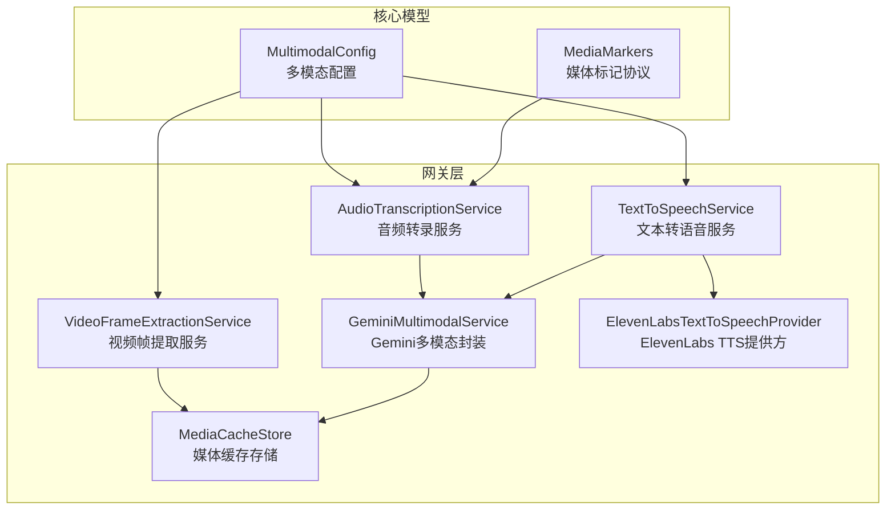
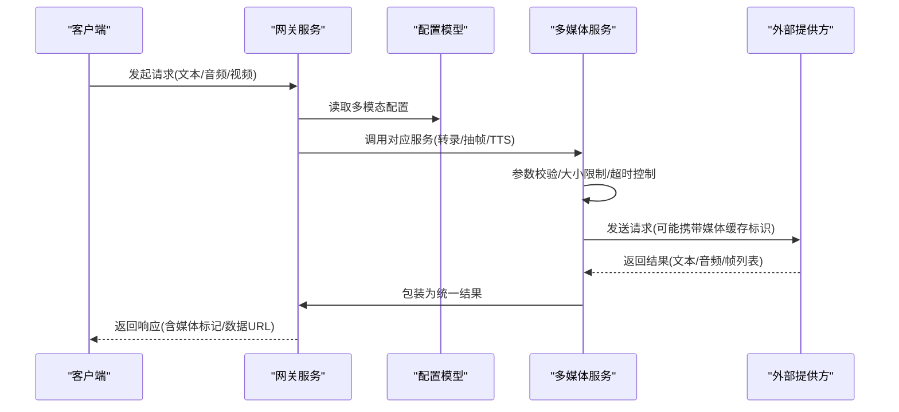
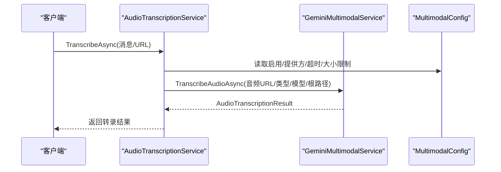
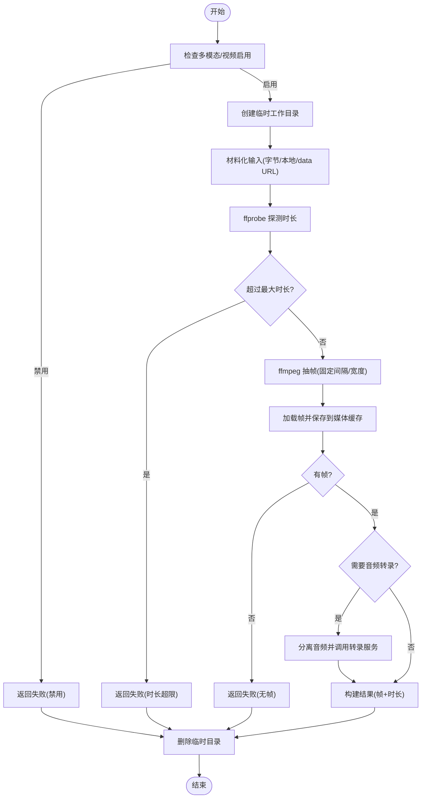
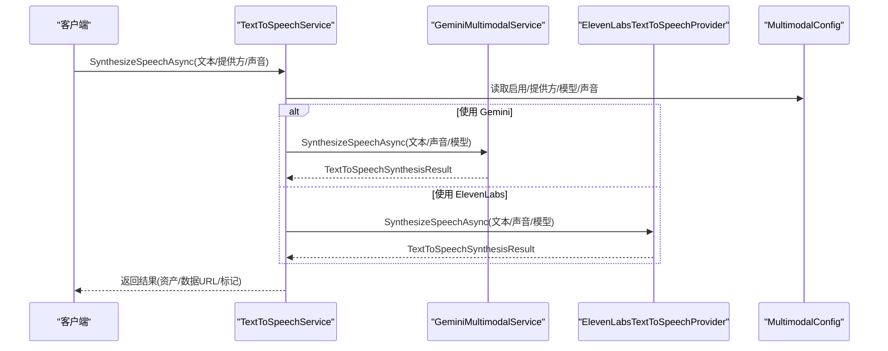
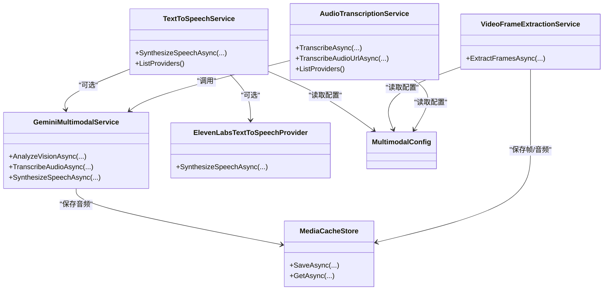

# 多媒体服务

<cite>
**本文引用的文件**   
- [AudioTranscriptionService.cs](file://src/OpenClaw.Gateway/AudioTranscriptionService.cs)
- [VideoFrameExtractionService.cs](file://src/OpenClaw.Gateway/VideoFrameExtractionService.cs)
- [TextToSpeechService.cs](file://src/OpenClaw.Gateway/TextToSpeechService.cs)
- [GeminiMultimodalService.cs](file://src/OpenClaw.Gateway/GeminiMultimodalService.cs)
- [ElevenLabsTextToSpeechProvider.cs](file://src/OpenClaw.Gateway/ElevenLabsTextToSpeechProvider.cs)
- [MediaCacheStore.cs](file://src/OpenClaw.Gateway/MediaCacheStore.cs)
- [MultimodalModels.cs](file://src/OpenClaw.Core/Models/MultimodalModels.cs)
- [MediaMarkers.cs](file://src/OpenClaw.Core/Models/MediaMarkers.cs)
- [Program.cs](file://src/OpenClaw.Gateway/Program.cs)
</cite>

## 目录
1. [简介](#简介)
2. [项目结构](#项目结构)
3. [核心组件](#核心组件)
4. [架构总览](#架构总览)
5. [详细组件分析](#详细组件分析)
6. [依赖关系分析](#依赖关系分析)
7. [性能考虑](#性能考虑)
8. [故障排查指南](#故障排查指南)
9. [结论](#结论)
10. [附录](#附录)

## 简介
本文件面向多媒体服务的使用者与维护者，系统性阐述音频转录、视频帧提取与文本转语音三大能力的实现与使用方式。内容涵盖：
- 配置项与参数说明（含默认值与限制）
- 处理流程与数据流
- 性能优化与质量控制策略
- 错误处理与降级机制
- 集成方式与资源管理
- 常见问题定位与排障建议

## 项目结构
多媒体相关能力集中在网关层（OpenClaw.Gateway），通过统一的配置模型（MultimodalConfig）进行开关与参数控制，并以服务接口形式对外提供能力。

**图表来源**
- [AudioTranscriptionService.cs:31-82](file://src/OpenClaw.Gateway/AudioTranscriptionService.cs#L31-L82)
- [VideoFrameExtractionService.cs:40-105](file://src/OpenClaw.Gateway/VideoFrameExtractionService.cs#L40-L105)
- [TextToSpeechService.cs:36-64](file://src/OpenClaw.Gateway/TextToSpeechService.cs#L36-L64)
- [GeminiMultimodalService.cs:11-31](file://src/OpenClaw.Gateway/GeminiMultimodalService.cs#L11-L31)
- [ElevenLabsTextToSpeechProvider.cs:9-21](file://src/OpenClaw.Gateway/ElevenLabsTextToSpeechProvider.cs#L9-L21)
- [MediaCacheStore.cs:6-40](file://src/OpenClaw.Gateway/MediaCacheStore.cs#L6-L40)
- [MultimodalModels.cs:3-15](file://src/OpenClaw.Core/Models/MultimodalModels.cs#L3-L15)
- [MediaMarkers.cs:22-47](file://src/OpenClaw.Core/Models/MediaMarkers.cs#L22-L47)

**章节来源**
- [Program.cs:42-98](file://src/OpenClaw.Gateway/Program.cs#L42-L98)
- [MultimodalModels.cs:3-118](file://src/OpenClaw.Core/Models/MultimodalModels.cs#L3-L118)

## 核心组件
- 音频转录服务：负责将音频消息转写为文本，支持超时控制、大小限制与提供方选择。
- 视频帧提取服务：对本地或内联视频进行探测、抽帧、可选音频转录，并返回带时间戳的帧列表。
- 文本转语音服务：将文本合成为音频资产，支持多种提供方与实时会话桥接。
- 多模态封装（Gemini）：统一调用 Gemini 的视觉理解、音频转录与语音合成能力。
- 第三方提供方（ElevenLabs）：提供基于外部 API 的 TTS 能力。
- 媒体缓存存储：统一保存二进制媒体与元数据，生成稳定标识用于复用与回放。
- 配置模型：集中定义启用开关、提供方、模型、阈值与失败模式等。
- 媒体标记协议：在消息中嵌入媒体引用标记，便于渲染与后续处理。

**章节来源**
- [AudioTranscriptionService.cs:31-170](file://src/OpenClaw.Gateway/AudioTranscriptionService.cs#L31-L170)
- [VideoFrameExtractionService.cs:40-426](file://src/OpenClaw.Gateway/VideoFrameExtractionService.cs#L40-L426)
- [TextToSpeechService.cs:36-101](file://src/OpenClaw.Gateway/TextToSpeechService.cs#L36-L101)
- [GeminiMultimodalService.cs:11-455](file://src/OpenClaw.Gateway/GeminiMultimodalService.cs#L11-L455)
- [ElevenLabsTextToSpeechProvider.cs:9-98](file://src/OpenClaw.Gateway/ElevenLabsTextToSpeechProvider.cs#L9-L98)
- [MediaCacheStore.cs:6-68](file://src/OpenClaw.Gateway/MediaCacheStore.cs#L6-L68)
- [MultimodalModels.cs:3-118](file://src/OpenClaw.Core/Models/MultimodalModels.cs#L3-L118)
- [MediaMarkers.cs:22-164](file://src/OpenClaw.Core/Models/MediaMarkers.cs#L22-L164)

## 架构总览
多媒体服务采用“配置驱动 + 提供方插件 + 统一封装”的架构。服务层根据配置选择具体提供方，统一处理输入校验、资源限制与输出格式；底层通过媒体缓存持久化中间产物，降低重复计算与网络开销。

**图表来源**
- [Program.cs:64-98](file://src/OpenClaw.Gateway/Program.cs#L64-L98)
- [MultimodalModels.cs:3-118](file://src/OpenClaw.Core/Models/MultimodalModels.cs#L3-L118)
- [AudioTranscriptionService.cs:47-123](file://src/OpenClaw.Gateway/AudioTranscriptionService.cs#L47-L123)
- [VideoFrameExtractionService.cs:59-105](file://src/OpenClaw.Gateway/VideoFrameExtractionService.cs#L59-L105)
- [TextToSpeechService.cs:47-64](file://src/OpenClaw.Gateway/TextToSpeechService.cs#L47-L64)

## 详细组件分析

### 音频转录服务
职责与特性
- 输入验证：仅接受音频类型的消息或 URL，否则抛出异常。
- 提供方解析：支持显式指定或默认“gemini”，并进行大小与超时限制。
- 结果包装：返回文本、提供方、媒体类型与字节数等信息。
- 降级策略：当配置为“degrade”时，异常转为可恢复状态并记录日志。

**图表来源**
- [AudioTranscriptionService.cs:47-123](file://src/OpenClaw.Gateway/AudioTranscriptionService.cs#L47-L123)
- [GeminiMultimodalService.cs:62-99](file://src/OpenClaw.Gateway/GeminiMultimodalService.cs#L62-L99)

关键点
- 超时控制：内部创建与传入取消令牌关联的 CTS，按配置秒数设置上限。
- 文件根路径：自动收集媒体缓存与工作目录根路径，限制本地文件访问范围。
- 失败模式：支持严格/失败/降级三种模式，降级时返回空结果或继续执行。

**章节来源**
- [AudioTranscriptionService.cs:47-170](file://src/OpenClaw.Gateway/AudioTranscriptionService.cs#L47-L170)
- [GeminiMultimodalService.cs:62-99](file://src/OpenClaw.Gateway/GeminiMultimodalService.cs#L62-L99)

### 视频帧提取服务
职责与特性
- 输入材料化：支持字节流、本地文件 URI、data URL；远程 URL 明确不被接受。
- 探测与限制：使用 ffprobe 获取时长，结合最大时长与大小限制进行快速拒绝。
- 抽帧与缩放：使用 ffmpeg 按固定间隔抽取帧，按宽度等比缩放，限制最大帧数。
- 可选音频转录：从视频分离音频并调用音频转录服务，返回联合结果。
- 清理与降级：工作目录在 finally 中清理；失败模式决定抛出异常或返回可恢复结果。

**图表来源**
- [VideoFrameExtractionService.cs:59-105](file://src/OpenClaw.Gateway/VideoFrameExtractionService.cs#L59-L105)
- [VideoFrameExtractionService.cs:107-145](file://src/OpenClaw.Gateway/VideoFrameExtractionService.cs#L107-L145)
- [VideoFrameExtractionService.cs:147-192](file://src/OpenClaw.Gateway/VideoFrameExtractionService.cs#L147-L192)
- [VideoFrameExtractionService.cs:194-215](file://src/OpenClaw.Gateway/VideoFrameExtractionService.cs#L194-L215)
- [VideoFrameExtractionService.cs:217-267](file://src/OpenClaw.Gateway/VideoFrameExtractionService.cs#L217-L267)

关键点
- 远程视频 URL 不被接受：必须使用本地文件 URI 或 data URL。
- ffmpeg/ffprobe 路径可配置，默认名称依赖 PATH；失败时抛出异常或按降级策略返回。
- 帧数据同时以 data URL 与缓存资产两种形式返回，便于不同场景消费。

**章节来源**
- [VideoFrameExtractionService.cs:59-426](file://src/OpenClaw.Gateway/VideoFrameExtractionService.cs#L59-L426)

### 文本转语音服务
职责与特性
- 提供方选择：支持显式请求或全局配置，默认“gemini”；ElevenLabs 作为可选提供方。
- 输出格式：统一返回媒体资产、数据 URL 与标记，便于消息渲染。
- 实时会话桥接：通过 WebSocket 将客户端与提供方实时连接，支持多模态交互。

**图表来源**
- [TextToSpeechService.cs:47-64](file://src/OpenClaw.Gateway/TextToSpeechService.cs#L47-L64)
- [GeminiMultimodalService.cs:101-130](file://src/OpenClaw.Gateway/GeminiMultimodalService.cs#L101-L130)
- [ElevenLabsTextToSpeechProvider.cs:25-77](file://src/OpenClaw.Gateway/ElevenLabsTextToSpeechProvider.cs#L25-L77)

关键点
- 标记注入：结果中包含 AUDIO_URL 标记，便于渲染器直接播放。
- 声音与模型：ElevenLabs 支持通过请求覆盖全局配置；Gemini 则由服务层统一处理。

**章节来源**
- [TextToSpeechService.cs:36-101](file://src/OpenClaw.Gateway/TextToSpeechService.cs#L36-L101)
- [ElevenLabsTextToSpeechProvider.cs:9-98](file://src/OpenClaw.Gateway/ElevenLabsTextToSpeechProvider.cs#L9-L98)
- [GeminiMultimodalService.cs:101-130](file://src/OpenClaw.Gateway/GeminiMultimodalService.cs#L101-L130)

### 媒体缓存存储
职责与特性
- 统一保存：将二进制媒体与 JSON 元数据写入磁盘，生成稳定 ID。
- 类型推断：根据媒体类型或文件名推断扩展名，确保可读性。
- 查询能力：按 ID 读取元数据，实现幂等与复用。

**章节来源**
- [MediaCacheStore.cs:6-68](file://src/OpenClaw.Gateway/MediaCacheStore.cs#L6-L68)

### 媒体标记协议
职责与特性
- 解析：从文本中提取多种媒体标记（图片、视频、音频、文档、Telegram 文件 ID 等）。
- 分离：返回标记集合与剩余文本，便于后续处理。

**章节来源**
- [MediaMarkers.cs:22-164](file://src/OpenClaw.Core/Models/MediaMarkers.cs#L22-L164)

## 依赖关系分析
- 服务间耦合：音频转录与视频抽帧均依赖媒体缓存；TTS 可同时对接 Gemini 与 ElevenLabs。
- 配置耦合：所有服务均依赖 MultimodalConfig，包括启用开关、提供方、模型、阈值与失败模式。
- 外部依赖：视频处理依赖 ffmpeg/ffprobe；Gemini 依赖 Google API Key；ElevenLabs 依赖 API Key 与端点。

**图表来源**
- [AudioTranscriptionService.cs:31-82](file://src/OpenClaw.Gateway/AudioTranscriptionService.cs#L31-L82)
- [VideoFrameExtractionService.cs:40-105](file://src/OpenClaw.Gateway/VideoFrameExtractionService.cs#L40-L105)
- [TextToSpeechService.cs:36-64](file://src/OpenClaw.Gateway/TextToSpeechService.cs#L36-L64)
- [GeminiMultimodalService.cs:11-31](file://src/OpenClaw.Gateway/GeminiMultimodalService.cs#L11-L31)
- [ElevenLabsTextToSpeechProvider.cs:9-21](file://src/OpenClaw.Gateway/ElevenLabsTextToSpeechProvider.cs#L9-L21)
- [MediaCacheStore.cs:6-40](file://src/OpenClaw.Gateway/MediaCacheStore.cs#L6-L40)
- [MultimodalModels.cs:3-15](file://src/OpenClaw.Core/Models/MultimodalModels.cs#L3-L15)

## 性能考虑
- 资源限制
  - 音频/视频大小限制：避免大文件导致内存与网络压力过大。
  - 视频时长限制：防止长时间视频引发抽帧与转录成本过高。
  - 最大帧数与帧间隔：平衡质量与性能，避免过度抽帧。
- 超时控制
  - 音频转录与视频处理均内置超时，防止阻塞影响整体吞吐。
- 缓存与复用
  - 媒体缓存减少重复下载与编码，提高二次渲染效率。
- 失败模式
  - “degrade”模式可在外部依赖不稳定时保证系统可用性，但需关注降级带来的质量损失。

[本节为通用指导，无需特定文件来源]

## 故障排查指南
常见问题与定位思路
- 配置未启用
  - 症状：调用抛出“已禁用”异常。
  - 排查：确认 MultimodalConfig 对应模块 Enabled=true。
- 提供方不可用
  - 症状：未知提供方或 API Key 缺失。
  - 排查：核对 Provider 名称与密钥配置，确保环境变量或配置项有效。
- 输入不合法
  - 症状：音频/视频输入为空、URL 不支持或文件不在允许根路径下。
  - 排查：检查输入类型、data URL 是否 base64、本地文件是否在允许根路径内。
- 处理失败
  - 症状：ffmpeg/ffprobe 执行失败或超时。
  - 排查：确认可执行文件存在且可执行；查看日志中的退出码与输出；检查磁盘空间与权限。
- 失败模式
  - 症状：视频处理抛异常或降级返回。
  - 排查：根据 FailureMode 决定行为；必要时调整为“degrade”以保障稳定性。

**章节来源**
- [AudioTranscriptionService.cs:49-58](file://src/OpenClaw.Gateway/AudioTranscriptionService.cs#L49-L58)
- [VideoFrameExtractionService.cs:61-73](file://src/OpenClaw.Gateway/VideoFrameExtractionService.cs#L61-L73)
- [VideoFrameExtractionService.cs:269-281](file://src/OpenClaw.Gateway/VideoFrameExtractionService.cs#L269-L281)
- [GeminiMultimodalService.cs:132-144](file://src/OpenClaw.Gateway/GeminiMultimodalService.cs#L132-L144)
- [ElevenLabsTextToSpeechProvider.cs:27-41](file://src/OpenClaw.Gateway/ElevenLabsTextToSpeechProvider.cs#L27-L41)

## 结论
该多媒体服务通过清晰的配置模型与可插拔的提供方设计，实现了音频转录、视频帧提取与文本转语音的统一接入。配合媒体缓存与失败降级策略，在保证质量的同时兼顾了性能与稳定性。建议在生产环境中：
- 明确各模块启用开关与阈值，避免不必要的资源消耗。
- 在视频处理链路中优先使用本地文件与 data URL，减少网络抖动。
- 合理设置失败模式，确保系统在外部依赖异常时仍可提供基础能力。

[本节为总结性内容，无需特定文件来源]

## 附录

### 配置项与默认值（摘自配置模型）
- 多模态总开关与路径
  - Enabled: true
  - MediaCachePath: ./memory/media-cache
  - LiveProvider: gemini
  - VisionProvider: gemini
  - VisionModel: gemini-2.5-flash
- 音频转录
  - Enabled: true
  - Provider: gemini
  - Model: gemini-2.5-flash
  - MaxAudioBytes: 25MB
  - TimeoutSeconds: 30
  - InjectAudioMarker: true
  - FailureMode: degrade
- 视频处理
  - Enabled: true
  - FfmpegPath: ffmpeg
  - FfprobePath: ffprobe
  - MaxVideoBytes: 100MB
  - MaxDurationSeconds: 120
  - MaxFrames: 8
  - FrameIntervalSeconds: 5
  - FrameWidth: 768
  - ExtractAudioTranscript: false
  - FailureMode: degrade
- 文本转语音
  - Enabled: true
  - Provider: gemini
  - Model: gemini-2.5-flash-preview-tts
  - VoiceName: Kore
  - VoiceId: null
- Gemini 实时会话
  - Enabled: true
  - Model: gemini-2.0-flash-live-001
  - Endpoint: wss://generativelanguage.googleapis.com/ws/google.ai.generativelanguage.v1beta.GenerativeService.BidiGenerateContent
  - ResponseModalities: ["TEXT"]
  - VoiceName: null
  - InputTranscription: true
  - OutputTranscription: true
- ElevenLabs
  - Enabled: true
  - Endpoint: https://api.elevenlabs.io
  - ApiKey: null
  - VoiceId: JBFqnCBsd6RMkjVDRZzb
  - Model: eleven_multilingual_v2
  - OutputFormat: mp3_44100_128

**章节来源**
- [MultimodalModels.cs:3-118](file://src/OpenClaw.Core/Models/MultimodalModels.cs#L3-L118)