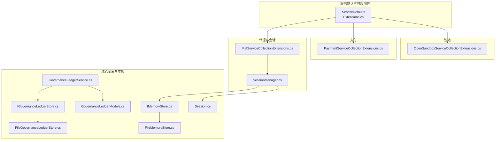
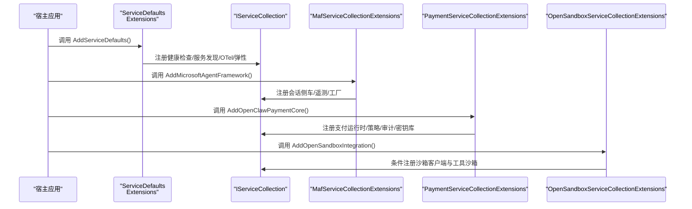
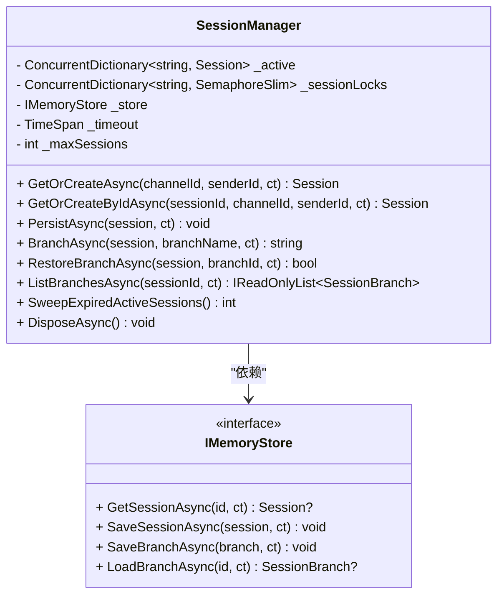
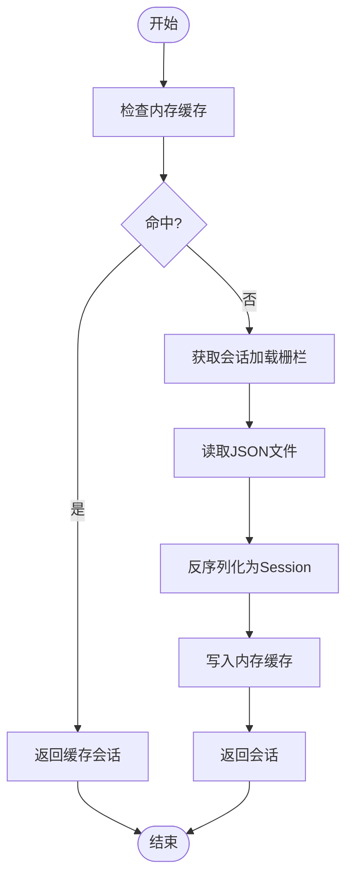
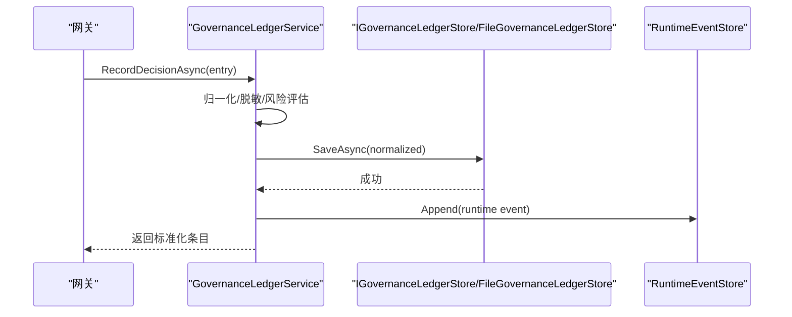
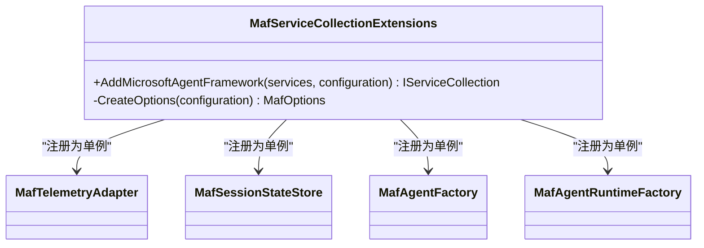
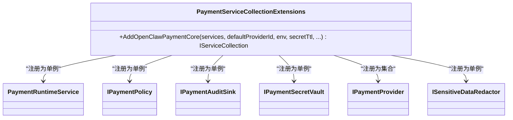
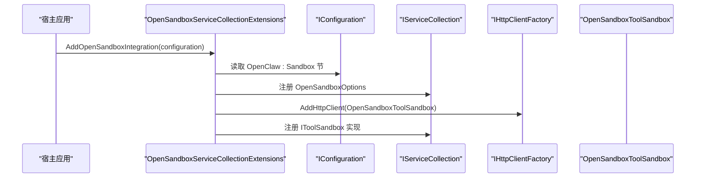
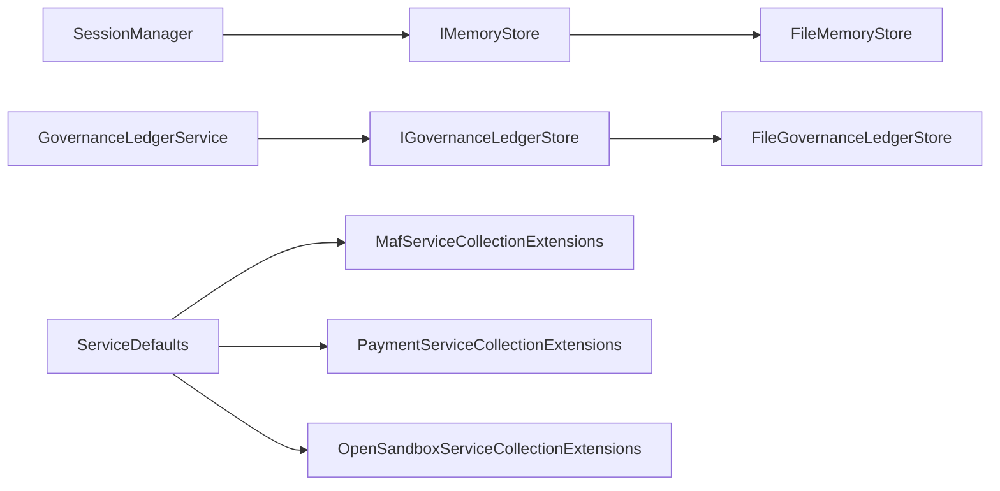

# 核心服务层

<cite>
**本文档引用的文件**
- [MafServiceCollectionExtensions.cs](file://src/OpenClaw.Agent/MafServiceCollectionExtensions.cs)
- [PaymentServiceCollectionExtensions.cs](file://src/OpenClaw.Payments.Core/PaymentServiceCollectionExtensions.cs)
- [OpenSandboxServiceCollectionExtensions.cs](file://src/OpenClawNet.Sandbox.OpenSandbox/OpenSandboxServiceCollectionExtensions.cs)
- [Extensions.cs](file://Kingcrab.ServiceDefaults/Extensions.cs)
- [IGovernanceLedgerStore.cs](file://src/OpenClaw.Core/Abstractions/IGovernanceLedgerStore.cs)
- [SessionManager.cs](file://src/OpenClaw.Core/Sessions/SessionManager.cs)
- [FileMemoryStore.cs](file://src/OpenClaw.Core/Memory/FileMemoryStore.cs)
- [FileGovernanceLedgerStore.cs](file://src/OpenClaw.Core/Features/FileGovernanceLedgerStore.cs)
- [Session.cs](file://src/OpenClaw.Core/Models/Session.cs)
- [GovernanceLedgerModels.cs](file://src/OpenClaw.Core/Models/GovernanceLedgerModels.cs)
- [GovernanceLedgerService.cs](file://src/OpenClaw.Gateway/GovernanceLedgerService.cs)
- [IMemoryStore.cs](file://src/OpenClaw.Core/Abstractions/IMemoryStore.cs)
</cite>

## 目录
1. [简介](#简介)
2. [项目结构](#项目结构)
3. [核心组件](#核心组件)
4. [架构总览](#架构总览)
5. [详细组件分析](#详细组件分析)
6. [依赖分析](#依赖分析)
7. [性能考虑](#性能考虑)
8. [故障排查指南](#故障排查指南)
9. [结论](#结论)
10. [附录](#附录)

## 简介
本文件系统性梳理 OpenClaw.NET 的核心服务层，聚焦于服务注册与依赖注入、生命周期管理、以及关键服务（内存存储、会话管理、治理账本）的实现原理与交互关系。文档同时覆盖配置项、性能特性、扩展点与典型使用场景，帮助开发者快速理解并高效集成核心能力。

## 项目结构
核心服务层主要分布在以下模块：
- 服务默认配置与可观测性：Kingcrab.ServiceDefaults
- 代理框架与会话状态：OpenClaw.Agent
- 支付核心：OpenClaw.Payments.Core
- 沙箱集成：OpenClawNet.Sandbox.OpenSandbox
- 核心抽象与模型：OpenClaw.Core（Abstractions、Models、Sessions、Memory、Features）
- 网关治理服务：OpenClaw.Gateway

图表来源
- [Extensions.cs:18-82](file://Kingcrab.ServiceDefaults/Extensions.cs#L18-L82)
- [MafServiceCollectionExtensions.cs:9-20](file://src/OpenClaw.Agent/MafServiceCollectionExtensions.cs#L9-L20)
- [SessionManager.cs:29-36](file://src/OpenClaw.Core/Sessions/SessionManager.cs#L29-L36)
- [IMemoryStore.cs:9-23](file://src/OpenClaw.Core/Abstractions/IMemoryStore.cs#L9-L23)
- [FileMemoryStore.cs:32-76](file://src/OpenClaw.Core/Memory/FileMemoryStore.cs#L32-L76)
- [IGovernanceLedgerStore.cs:5-11](file://src/OpenClaw.Core/Abstractions/IGovernanceLedgerStore.cs#L5-L11)
- [FileGovernanceLedgerStore.cs:10-23](file://src/OpenClaw.Core/Features/FileGovernanceLedgerStore.cs#L10-L23)
- [GovernanceLedgerService.cs:10-29](file://src/OpenClaw.Gateway/GovernanceLedgerService.cs#L10-L29)
- [Session.cs:15-135](file://src/OpenClaw.Core/Models/Session.cs#L15-L135)

章节来源
- [Extensions.cs:18-82](file://Kingcrab.ServiceDefaults/Extensions.cs#L18-L82)
- [MafServiceCollectionExtensions.cs:9-20](file://src/OpenClaw.Agent/MafServiceCollectionExtensions.cs#L9-L20)
- [SessionManager.cs:29-36](file://src/OpenClaw.Core/Sessions/SessionManager.cs#L29-L36)
- [IMemoryStore.cs:9-23](file://src/OpenClaw.Core/Abstractions/IMemoryStore.cs#L9-L23)
- [FileMemoryStore.cs:32-76](file://src/OpenClaw.Core/Memory/FileMemoryStore.cs#L32-L76)
- [IGovernanceLedgerStore.cs:5-11](file://src/OpenClaw.Core/Abstractions/IGovernanceLedgerStore.cs#L5-L11)
- [FileGovernanceLedgerStore.cs:10-23](file://src/OpenClaw.Core/Features/FileGovernanceLedgerStore.cs#L10-L23)
- [GovernanceLedgerService.cs:10-29](file://src/OpenClaw.Gateway/GovernanceLedgerService.cs#L10-L29)
- [Session.cs:15-135](file://src/OpenClaw.Core/Models/Session.cs#L15-L135)

## 核心组件
- 服务默认与可观测性：统一添加健康检查、服务发现、OpenTelemetry、标准重试与弹性策略。
- 代理框架（MAF）：集中注册会话侧车、遥测适配器、工厂与运行时。
- 支付核心：按环境与策略注册支付运行时、审计、密钥库与策略。
- 沙箱集成：条件化注册 OpenSandbox 工具沙箱与 HTTP 客户端。
- 内存存储：基于文件的会话与笔记持久化，带缓存与并发控制。
- 会话管理：线程安全、容量控制、过期清理、分支快照与恢复。
- 治理账本：记录工具审批决策、撤销与查询，统一归一化与脱敏。

章节来源
- [Extensions.cs:23-47](file://Kingcrab.ServiceDefaults/Extensions.cs#L23-L47)
- [MafServiceCollectionExtensions.cs:9-20](file://src/OpenClaw.Agent/MafServiceCollectionExtensions.cs#L9-L20)
- [PaymentServiceCollectionExtensions.cs:10-41](file://src/OpenClaw.Payments.Core/PaymentServiceCollectionExtensions.cs#L10-L41)
- [OpenSandboxServiceCollectionExtensions.cs:12-48](file://src/OpenClawNet.Sandbox.OpenSandbox/OpenSandboxServiceCollectionExtensions.cs#L12-L48)
- [IMemoryStore.cs:9-23](file://src/OpenClaw.Core/Abstractions/IMemoryStore.cs#L9-L23)
- [SessionManager.cs:13-36](file://src/OpenClaw.Core/Sessions/SessionManager.cs#L13-L36)
- [IGovernanceLedgerStore.cs:5-11](file://src/OpenClaw.Core/Abstractions/IGovernanceLedgerStore.cs#L5-L11)

## 架构总览
核心服务层通过依赖注入在启动阶段完成装配，形成“默认服务 + 业务服务”的分层架构。默认服务负责基础设施（健康检查、OTel、弹性），业务服务负责领域功能（会话、内存、治理、支付、沙箱）。

图表来源
- [Extensions.cs:23-47](file://Kingcrab.ServiceDefaults/Extensions.cs#L23-L47)
- [MafServiceCollectionExtensions.cs:9-20](file://src/OpenClaw.Agent/MafServiceCollectionExtensions.cs#L9-L20)
- [PaymentServiceCollectionExtensions.cs:10-41](file://src/OpenClaw.Payments.Core/PaymentServiceCollectionExtensions.cs#L10-L41)
- [OpenSandboxServiceCollectionExtensions.cs:12-48](file://src/OpenClawNet.Sandbox.OpenSandbox/OpenSandboxServiceCollectionExtensions.cs#L12-L48)

## 详细组件分析

### 会话管理服务（SessionManager）
- 职责：管理活跃会话、自动过期、容量控制、分支快照与恢复、并发锁与后台持久化。
- 关键特性：
  - 基于内存字典与并发安全结构，支持高并发读写。
  - 会话容量限制与最近最少活动淘汰策略。
  - 分支快照与差异计算，支持历史回放与对比。
  - 幂等持久化与指数退避重试，保证最终一致。
- 生命周期：构造时从配置读取超时与最大并发；Dispose 时异步等待后台持久化任务完成并释放资源。

图表来源
- [SessionManager.cs:13-36](file://src/OpenClaw.Core/Sessions/SessionManager.cs#L13-L36)
- [IMemoryStore.cs:9-23](file://src/OpenClaw.Core/Abstractions/IMemoryStore.cs#L9-L23)

章节来源
- [SessionManager.cs:13-624](file://src/OpenClaw.Core/Sessions/SessionManager.cs#L13-L624)
- [Session.cs:15-135](file://src/OpenClaw.Core/Models/Session.cs#L15-L135)

### 内存存储服务（FileMemoryStore）
- 职责：会话与笔记的文件系统持久化，带内存缓存与并发加载栅栏。
- 关键特性：
  - URL 安全编码的文件名，防止路径穿越。
  - 会话加载分片栅栏，避免热点竞争。
  - 笔记索引与搜索，支持前缀过滤与评分排序。
  - 保留策略扫描与归档，支持干跑模式。
- 错误处理：损坏文件隔离到隔离区并抛出特定异常，便于诊断与恢复。

图表来源
- [FileMemoryStore.cs:78-170](file://src/OpenClaw.Core/Memory/FileMemoryStore.cs#L78-L170)

章节来源
- [FileMemoryStore.cs:32-1263](file://src/OpenClaw.Core/Memory/FileMemoryStore.cs#L32-L1263)

### 治理账本服务（GovernanceLedgerService 与 FileGovernanceLedgerStore）
- 职责：记录工具审批决策、撤销与查询；统一归一化字段、风险等级推断、元数据与事件追加。
- 数据模型：治理账本条目、列表查询、撤销请求与响应。
- 存储实现：文件系统后端，安全编码键名，原子写入与临时文件清理。

图表来源
- [GovernanceLedgerService.cs:31-60](file://src/OpenClaw.Gateway/GovernanceLedgerService.cs#L31-L60)
- [IGovernanceLedgerStore.cs:5-11](file://src/OpenClaw.Core/Abstractions/IGovernanceLedgerStore.cs#L5-L11)
- [FileGovernanceLedgerStore.cs:25-30](file://src/OpenClaw.Core/Features/FileGovernanceLedgerStore.cs#L25-L30)
- [GovernanceLedgerModels.cs:54-87](file://src/OpenClaw.Core/Models/GovernanceLedgerModels.cs#L54-L87)

章节来源
- [GovernanceLedgerService.cs:10-554](file://src/OpenClaw.Gateway/GovernanceLedgerService.cs#L10-L554)
- [IGovernanceLedgerStore.cs:5-11](file://src/OpenClaw.Core/Abstractions/IGovernanceLedgerStore.cs#L5-L11)
- [FileGovernanceLedgerStore.cs:10-285](file://src/OpenClaw.Core/Features/FileGovernanceLedgerStore.cs#L10-L285)
- [GovernanceLedgerModels.cs:1-146](file://src/OpenClaw.Core/Models/GovernanceLedgerModels.cs#L1-L146)

### 代理框架与会话侧车（MafServiceCollectionExtensions）
- 职责：注册 MAF 运行时相关单例，包括遥测适配器、会话状态存储、工厂与运行时工厂。
- 配置：从配置节读取代理名称、描述、会话侧车路径、流式开关、A2A 开关与技能清单等。

图表来源
- [MafServiceCollectionExtensions.cs:9-20](file://src/OpenClaw.Agent/MafServiceCollectionExtensions.cs#L9-L20)

章节来源
- [MafServiceCollectionExtensions.cs:7-107](file://src/OpenClaw.Agent/MafServiceCollectionExtensions.cs#L7-L107)

### 支付核心（PaymentServiceCollectionExtensions）
- 职责：按环境与策略注册支付运行时、审计、密钥库、策略与提供商集合。
- 扩展点：可替换默认提供商、调整测试/生产策略、设置密钥 TTL。

图表来源
- [PaymentServiceCollectionExtensions.cs:10-41](file://src/OpenClaw.Payments.Core/PaymentServiceCollectionExtensions.cs#L10-L41)

章节来源
- [PaymentServiceCollectionExtensions.cs:8-43](file://src/OpenClaw.Payments.Core/PaymentServiceCollectionExtensions.cs#L8-L43)

### 沙箱集成（OpenSandboxServiceCollectionExtensions）
- 职责：条件化注册 OpenSandbox 工具沙箱与 HTTP 客户端，解析密钥引用或明文。
- 配置：从配置节读取提供方、端点、API Key 与默认 TTL，并进行安全解析。

图表来源
- [OpenSandboxServiceCollectionExtensions.cs:12-48](file://src/OpenClawNet.Sandbox.OpenSandbox/OpenSandboxServiceCollectionExtensions.cs#L12-L48)

章节来源
- [OpenSandboxServiceCollectionExtensions.cs:10-61](file://src/OpenClawNet.Sandbox.OpenSandbox/OpenSandboxServiceCollectionExtensions.cs#L10-L61)

## 依赖分析
- 组件耦合：
  - SessionManager 依赖 IMemoryStore，实现对会话的持久化与检索。
  - GovernanceLedgerService 依赖 IGovernanceLedgerStore 与运行时事件存储，负责治理记录与事件上报。
  - FileMemoryStore 与 FileGovernanceLedgerStore 分别实现对应接口，采用文件系统作为后端。
- 外部依赖：
  - ServiceDefaults 提供健康检查、服务发现、OTel 与弹性策略。
  - 支付与沙箱通过扩展方法注入，遵循可插拔原则。

图表来源
- [SessionManager.cs:19-21](file://src/OpenClaw.Core/Sessions/SessionManager.cs#L19-L21)
- [IMemoryStore.cs:9-23](file://src/OpenClaw.Core/Abstractions/IMemoryStore.cs#L9-L23)
- [FileMemoryStore.cs:32-76](file://src/OpenClaw.Core/Memory/FileMemoryStore.cs#L32-L76)
- [GovernanceLedgerService.cs:14-28](file://src/OpenClaw.Gateway/GovernanceLedgerService.cs#L14-L28)
- [IGovernanceLedgerStore.cs:5-11](file://src/OpenClaw.Core/Abstractions/IGovernanceLedgerStore.cs#L5-L11)
- [FileGovernanceLedgerStore.cs:10-23](file://src/OpenClaw.Core/Features/FileGovernanceLedgerStore.cs#L10-L23)
- [Extensions.cs:23-47](file://Kingcrab.ServiceDefaults/Extensions.cs#L23-L47)
- [MafServiceCollectionExtensions.cs:9-20](file://src/OpenClaw.Agent/MafServiceCollectionExtensions.cs#L9-L20)
- [PaymentServiceCollectionExtensions.cs:10-41](file://src/OpenClaw.Payments.Core/PaymentServiceCollectionExtensions.cs#L10-L41)
- [OpenSandboxServiceCollectionExtensions.cs:12-48](file://src/OpenClawNet.Sandbox.OpenSandbox/OpenSandboxServiceCollectionExtensions.cs#L12-L48)

章节来源
- [SessionManager.cs:13-624](file://src/OpenClaw.Core/Sessions/SessionManager.cs#L13-L624)
- [IMemoryStore.cs:9-23](file://src/OpenClaw.Core/Abstractions/IMemoryStore.cs#L9-L23)
- [FileMemoryStore.cs:32-1263](file://src/OpenClaw.Core/Memory/FileMemoryStore.cs#L32-L1263)
- [GovernanceLedgerService.cs:10-554](file://src/OpenClaw.Gateway/GovernanceLedgerService.cs#L10-L554)
- [IGovernanceLedgerStore.cs:5-11](file://src/OpenClaw.Core/Abstractions/IGovernanceLedgerStore.cs#L5-L11)
- [FileGovernanceLedgerStore.cs:10-285](file://src/OpenClaw.Core/Features/FileGovernanceLedgerStore.cs#L10-L285)
- [Extensions.cs:18-82](file://Kingcrab.ServiceDefaults/Extensions.cs#L18-L82)
- [MafServiceCollectionExtensions.cs:7-107](file://src/OpenClaw.Agent/MafServiceCollectionExtensions.cs#L7-L107)
- [PaymentServiceCollectionExtensions.cs:8-43](file://src/OpenClaw.Payments.Core/PaymentServiceCollectionExtensions.cs#L8-L43)
- [OpenSandboxServiceCollectionExtensions.cs:10-61](file://src/OpenClawNet.Sandbox.OpenSandbox/OpenSandboxServiceCollectionExtensions.cs#L10-L61)

## 性能考虑
- 会话管理：
  - 使用并发字典与信号量控制并发访问，避免热点竞争。
  - 最大并发限制与最近最少活动淘汰，防止内存膨胀。
  - 后台持久化队列与幂等重试，降低写放大。
- 内存存储：
  - 会话加载分片栅栏与内存缓存，显著降低磁盘 IO。
  - 笔记索引与评分排序，限制返回数量，平衡查询性能。
- 治理账本：
  - 文件系统原子写入与临时文件清理，减少不一致窗口。
  - 风险等级与摘要截断，控制存储与传输开销。
- 默认服务：
  - OTel 仅在指定源启用，避免不必要的追踪开销。
  - 健康检查端点仅在开发环境暴露，降低攻击面。

[本节为通用性能建议，无需具体文件分析]

## 故障排查指南
- 会话持久化失败：
  - 现象：保存会话时抛出异常。
  - 排查：查看指数退避日志与最终失败记录；确认磁盘空间与权限。
- 损坏会话文件：
  - 现象：加载会话抛出特定异常并隔离至隔离区。
  - 排查：检查隔离区文件路径与原始错误；修复或迁移数据。
- 治理账本写入失败：
  - 现象：记录治理决策失败。
  - 排查：确认键名安全编码与目录权限；检查临时文件清理情况。
- 支付运行时异常：
  - 现象：支付调用失败。
  - 排查：核对提供商配置与密钥库；检查策略与审计日志。
- 沙箱集成未生效：
  - 现象：未注册 OpenSandbox 工具沙箱。
  - 排查：确认配置节 Provider 为 OpenSandbox；检查密钥解析与端点可达性。

章节来源
- [SessionManager.cs:147-171](file://src/OpenClaw.Core/Sessions/SessionManager.cs#L147-L171)
- [FileMemoryStore.cs:191-223](file://src/OpenClaw.Core/Memory/FileMemoryStore.cs#L191-L223)
- [GovernanceLedgerService.cs:148-160](file://src/OpenClaw.Gateway/GovernanceLedgerService.cs#L148-L160)
- [PaymentServiceCollectionExtensions.cs:20-41](file://src/OpenClaw.Payments.Core/PaymentServiceCollectionExtensions.cs#L20-L41)
- [OpenSandboxServiceCollectionExtensions.cs:16-32](file://src/OpenClawNet.Sandbox.OpenSandbox/OpenSandboxServiceCollectionExtensions.cs#L16-L32)

## 结论
核心服务层以清晰的分层与可插拔的扩展点，提供了稳定可靠的会话、内存、治理、支付与沙箱能力。通过默认服务与依赖注入，开发者可以快速集成并按需定制，同时获得完善的可观测性与性能保障。

[本节为总结性内容，无需具体文件分析]

## 附录

### 服务注册与生命周期要点
- 默认服务：健康检查、服务发现、OTel、弹性策略在启动阶段统一注册。
- 业务服务：通过扩展方法注册，确保单例生命周期与配置驱动。
- 会话与内存：构造时初始化，Dispose 时优雅关闭后台任务与资源。
- 治理账本：记录与撤销均进行归一化与脱敏，事件追加用于运行时可观测。

章节来源
- [Extensions.cs:23-82](file://Kingcrab.ServiceDefaults/Extensions.cs#L23-L82)
- [MafServiceCollectionExtensions.cs:9-20](file://src/OpenClaw.Agent/MafServiceCollectionExtensions.cs#L9-L20)
- [SessionManager.cs:552-587](file://src/OpenClaw.Core/Sessions/SessionManager.cs#L552-L587)
- [GovernanceLedgerService.cs:334-362](file://src/OpenClaw.Gateway/GovernanceLedgerService.cs#L334-L362)