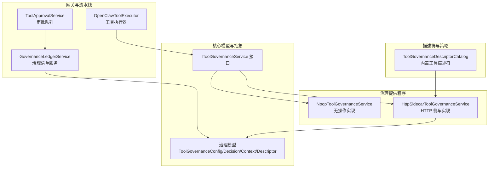
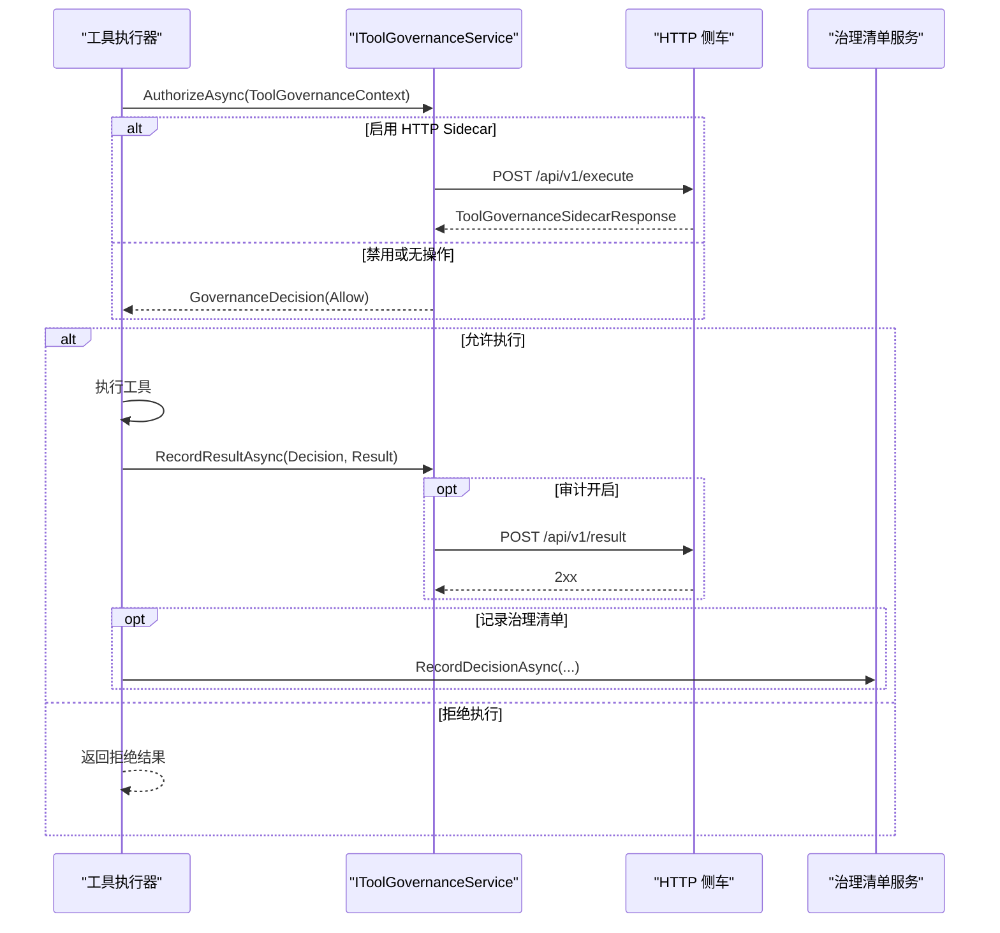
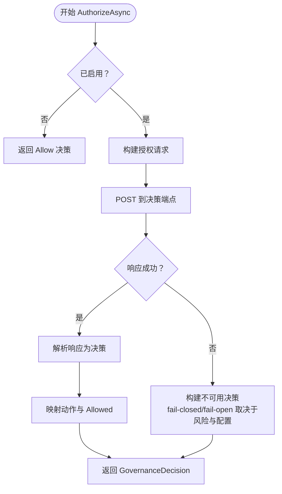
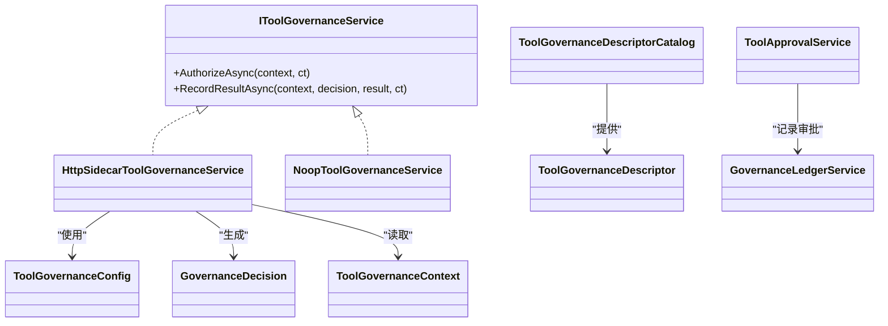
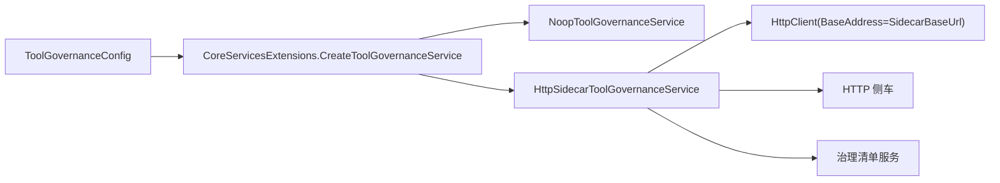

# 治理服务

<cite>
**本文引用的文件**
- [HttpSidecarToolGovernanceService.cs](file://src/OpenClaw.Core/Governance/HttpSidecarToolGovernanceService.cs)
- [NoopToolGovernanceService.cs](file://src/OpenClaw.Core/Governance/NoopToolGovernanceService.cs)
- [ToolGovernanceDescriptorCatalog.cs](file://src/OpenClaw.Core/Governance/ToolGovernanceDescriptorCatalog.cs)
- [IToolGovernanceService.cs](file://src/OpenClaw.Core/Abstractions/IToolGovernanceService.cs)
- [ToolGovernanceModels.cs](file://src/OpenClaw.Core/Models/ToolGovernanceModels.cs)
- [GovernanceLedgerModels.cs](file://src/OpenClaw.Core/Models/GovernanceLedgerModels.cs)
- [GovernanceLedgerService.cs](file://src/OpenClaw.Gateway/GovernanceLedgerService.cs)
- [ToolApprovalService.cs](file://src/OpenClaw.Core/Pipeline/ToolApprovalService.cs)
- [OpenClawToolExecutor.cs](file://src/OpenClaw.Agent/OpenClawToolExecutor.cs)
- [CoreServicesExtensions.cs](file://src/OpenClaw.Gateway/Composition/CoreServicesExtensions.cs)
- [appsettings.json](file://src/OpenClaw.Gateway/appsettings.json)
</cite>

## 目录
1. [简介](#简介)
2. [项目结构](#项目结构)
3. [核心组件](#核心组件)
4. [架构总览](#架构总览)
5. [详细组件分析](#详细组件分析)
6. [依赖关系分析](#依赖关系分析)
7. [性能考量](#性能考量)
8. [故障排查指南](#故障排查指南)
9. [结论](#结论)
10. [附录](#附录)

## 简介
本文件系统性阐述治理服务的设计与实现，覆盖以下主题：
- 工具治理服务的职责与工作流：授权决策、结果审计、失败闭合/开合策略、风险等级与能力评估。
- HTTP sidecar 治理提供程序：与外部治理侧车通信、超时控制、错误处理与回退策略。
- 无操作治理服务：禁用治理时的空实现。
- 治理配置选项：启用开关、提供程序类型、端点、超时、失败策略等。
- 策略实施与审计日志：内置工具描述符目录、治理清单记录、审批流程与超时处理。
- 集成方式、性能考虑与扩展机制：服务注册、默认配置、可扩展点。

## 项目结构
治理相关代码主要分布在以下模块：
- 核心模型与抽象：定义治理决策、上下文、配置、枚举与接口。
- 治理提供程序：HTTP sidecar 实现与无操作实现。
- 描述符目录：内置工具的风险等级、能力与分类。
- 网关治理清单服务：持久化与规范化治理记录、事件注入。
- 审批与工具执行：审批队列、等待与超时、执行器对治理结果的使用。

**图表来源**
- [IToolGovernanceService.cs:1-16](file://src/OpenClaw.Core/Abstractions/IToolGovernanceService.cs#L1-L16)
- [ToolGovernanceModels.cs:24-63](file://src/OpenClaw.Core/Models/ToolGovernanceModels.cs#L24-L63)
- [NoopToolGovernanceService.cs:1-20](file://src/OpenClaw.Core/Governance/NoopToolGovernanceService.cs#L1-L20)
- [HttpSidecarToolGovernanceService.cs:1-236](file://src/OpenClaw.Core/Governance/HttpSidecarToolGovernanceService.cs#L1-L236)
- [ToolGovernanceDescriptorCatalog.cs:1-181](file://src/OpenClaw.Core/Governance/ToolGovernanceDescriptorCatalog.cs#L1-L181)
- [GovernanceLedgerService.cs:1-554](file://src/OpenClaw.Gateway/GovernanceLedgerService.cs#L1-L554)
- [ToolApprovalService.cs:1-265](file://src/OpenClaw.Core/Pipeline/ToolApprovalService.cs#L1-L265)
- [OpenClawToolExecutor.cs:646-678](file://src/OpenClaw.Agent/OpenClawToolExecutor.cs#L646-L678)

**章节来源**
- [ToolGovernanceModels.cs:24-63](file://src/OpenClaw.Core/Models/ToolGovernanceModels.cs#L24-L63)
- [HttpSidecarToolGovernanceService.cs:1-236](file://src/OpenClaw.Core/Governance/HttpSidecarToolGovernanceService.cs#L1-L236)
- [NoopToolGovernanceService.cs:1-20](file://src/OpenClaw.Core/Governance/NoopToolGovernanceService.cs#L1-L20)
- [ToolGovernanceDescriptorCatalog.cs:1-181](file://src/OpenClaw.Core/Governance/ToolGovernanceDescriptorCatalog.cs#L1-L181)
- [GovernanceLedgerService.cs:1-554](file://src/OpenClaw.Gateway/GovernanceLedgerService.cs#L1-L554)
- [ToolApprovalService.cs:1-265](file://src/OpenClaw.Core/Pipeline/ToolApprovalService.cs#L1-L265)
- [OpenClawToolExecutor.cs:646-678](file://src/OpenClaw.Agent/OpenClawToolExecutor.cs#L646-L678)

## 核心组件
- IToolGovernanceService：定义授权与结果审计两个关键方法，作为所有治理提供程序的统一接口。
- ToolGovernanceConfig：治理配置对象，包含启用开关、提供程序类型、端点、超时、失败策略等。
- GovernanceDecision：授权决策结果，包含允许与否、动作、原因、信任分、策略/规则标识、评估耗时、脱敏参数等。
- ToolGovernanceContext：授权上下文，携带会话、通道、用户、追踪ID、调用ID、工具名、参数、动作描述与工具描述符。
- ToolGovernanceDescriptor：工具描述符，包含名称、类别、风险等级、只读、网络/文件系统访问、代码执行、外发数据等能力标记。
- ToolGovernanceDescriptorCatalog：内置工具描述符目录，按工具名映射到风险等级与能力集合，并支持根据动作描述动态提升风险等级或要求审批。
- HttpSidecarToolGovernanceService：HTTP sidecar 提供程序，负责向侧车发起授权请求与结果审计，处理超时、不可用与异常回退。
- NoopToolGovernanceService：无操作提供程序，在禁用治理时直接放行。
- GovernanceLedgerService：治理清单服务，负责记录治理决策、审批、过期与撤销等事件，进行敏感信息脱敏与元数据规范化。
- ToolApprovalService：审批队列，用于监督自治模式下的工具执行审批，支持超时、拒绝与事件记录。
- OpenClawToolExecutor：工具执行器，消费治理决策并将其写入执行结果与遥测标签中。

**章节来源**
- [IToolGovernanceService.cs:1-16](file://src/OpenClaw.Core/Abstractions/IToolGovernanceService.cs#L1-L16)
- [ToolGovernanceModels.cs:24-150](file://src/OpenClaw.Core/Models/ToolGovernanceModels.cs#L24-L150)
- [ToolGovernanceDescriptorCatalog.cs:1-181](file://src/OpenClaw.Core/Governance/ToolGovernanceDescriptorCatalog.cs#L1-L181)
- [HttpSidecarToolGovernanceService.cs:1-236](file://src/OpenClaw.Core/Governance/HttpSidecarToolGovernanceService.cs#L1-L236)
- [NoopToolGovernanceService.cs:1-20](file://src/OpenClaw.Core/Governance/NoopToolGovernanceService.cs#L1-L20)
- [GovernanceLedgerService.cs:1-554](file://src/OpenClaw.Gateway/GovernanceLedgerService.cs#L1-L554)
- [ToolApprovalService.cs:1-265](file://src/OpenClaw.Core/Pipeline/ToolApprovalService.cs#L1-L265)
- [OpenClawToolExecutor.cs:646-678](file://src/OpenClaw.Agent/OpenClawToolExecutor.cs#L646-L678)

## 架构总览
治理服务采用“提供程序接口 + 具体实现 + 描述符目录 + 清单服务”的分层设计。工具执行前由执行器触发授权，授权通过后才进入执行阶段；执行完成后可选择性地进行结果审计。审批队列在需要人工干预时介入，超时则按策略回退。

**图表来源**
- [OpenClawToolExecutor.cs:646-678](file://src/OpenClaw.Agent/OpenClawToolExecutor.cs#L646-L678)
- [HttpSidecarToolGovernanceService.cs:24-155](file://src/OpenClaw.Core/Governance/HttpSidecarToolGovernanceService.cs#L24-L155)
- [GovernanceLedgerService.cs:48-115](file://src/OpenClaw.Gateway/GovernanceLedgerService.cs#L48-L115)

## 详细组件分析

### HTTP Sidecar 治理提供程序
- 授权流程
  - 若未启用，直接返回允许。
  - 构造授权请求（包含会话、通道、用户、追踪ID、调用ID、工具名、类别、风险等级、参数、动作描述与描述符）。
  - 发送 POST 到决策端点，解析响应映射为 GovernanceDecision。
  - 支持动作映射（allow/deny/require_approval/redact/audit_only），并依据 Allowed 字段与策略决定最终是否允许。
- 结果审计
  - 当启用审计且配置了结果端点时，发送执行结果到侧车。
- 失败回退策略
  - 若侧车不可用或超时，根据风险级别与配置决定“失败闭合”或“低风险失败开合”。
- 超时控制
  - 基于配置的 TimeoutMs 创建取消令牌，避免阻塞。
- 端点归一化
  - 决策端点默认 “/api/v1/execute”，结果端点默认 “/api/v1/result”。

**图表来源**
- [HttpSidecarToolGovernanceService.cs:24-107](file://src/OpenClaw.Core/Governance/HttpSidecarToolGovernanceService.cs#L24-L107)
- [ToolGovernanceModels.cs:106-134](file://src/OpenClaw.Core/Models/ToolGovernanceModels.cs#L106-L134)

**章节来源**
- [HttpSidecarToolGovernanceService.cs:24-236](file://src/OpenClaw.Core/Governance/HttpSidecarToolGovernanceService.cs#L24-L236)
- [ToolGovernanceModels.cs:24-150](file://src/OpenClaw.Core/Models/ToolGovernanceModels.cs#L24-L150)

### 无操作治理服务
- 直接返回允许的决策，不进行任何外部调用或持久化。
- 适用于开发调试或明确禁用治理的场景。

**章节来源**
- [NoopToolGovernanceService.cs:1-20](file://src/OpenClaw.Core/Governance/NoopToolGovernanceService.cs#L1-L20)

### 工具描述符目录与风险评估
- 内置工具描述符集合，覆盖文件系统、执行、源码管理、内存、会话、委托、产品力、自动化、浏览器、多模态、外部CLI、支付、日历、邮件、数据库、家庭自动化、IoT、Notion 等类别。
- 风险等级与能力字段：低/中/高/严重；只读、网络访问、文件系统访问、代码执行、外发数据、能力列表等。
- 动态提升：当动作描述要求审批或为变更类操作时，描述符的 RequiresApproval、ReadOnly、RiskLevel 会被相应调整。

**章节来源**
- [ToolGovernanceDescriptorCatalog.cs:66-181](file://src/OpenClaw.Core/Governance/ToolGovernanceDescriptorCatalog.cs#L66-L181)
- [ToolGovernanceModels.cs:65-78](file://src/OpenClaw.Core/Models/ToolGovernanceModels.cs#L65-L78)

### 治理配置选项
- 启用开关与提供程序：Enabled、Provider（none/http_sidecar）。
- 侧车基础地址与端点：SidecarBaseUrl、DecisionEndpoint、ResultEndpoint。
- 超时与审计：TimeoutMs、AuditResults。
- 失败策略：FailClosed、FailOpenReadOnlyLowRisk、RequireGovernanceForHighRiskTools。

默认配置位于网关 appsettings 中，默认 Provider 为 none，确保安全默认。

**章节来源**
- [ToolGovernanceModels.cs:24-36](file://src/OpenClaw.Core/Models/ToolGovernanceModels.cs#L24-L36)
- [appsettings.json:1-20](file://src/OpenClaw.Gateway/appsettings.json#L1-L20)

### 策略实施与审计日志
- 授权动作与决策
  - 动作映射：allow/deny/require_approval/redact/audit_only。
  - 最终允许与否取决于动作与 Allowed 字段。
- 治理清单
  - 记录审批、过期、撤销、授予消费等事件。
  - 对参数摘要进行脱敏与截断，元数据规范化。
  - 事件注入运行时事件存储，便于可观测性。
- 审批流程
  - ToolApprovalService 维护待审批请求队列，支持超时自动拒绝与事件记录。
  - GovernanceLedgerService 将审批结果转化为治理记录。

**图表来源**
- [IToolGovernanceService.cs:1-16](file://src/OpenClaw.Core/Abstractions/IToolGovernanceService.cs#L1-L16)
- [HttpSidecarToolGovernanceService.cs:1-236](file://src/OpenClaw.Core/Governance/HttpSidecarToolGovernanceService.cs#L1-L236)
- [NoopToolGovernanceService.cs:1-20](file://src/OpenClaw.Core/Governance/NoopToolGovernanceService.cs#L1-L20)
- [ToolGovernanceModels.cs:24-150](file://src/OpenClaw.Core/Models/ToolGovernanceModels.cs#L24-L150)
- [ToolGovernanceDescriptorCatalog.cs:1-181](file://src/OpenClaw.Core/Governance/ToolGovernanceDescriptorCatalog.cs#L1-L181)
- [GovernanceLedgerService.cs:1-554](file://src/OpenClaw.Gateway/GovernanceLedgerService.cs#L1-L554)
- [ToolApprovalService.cs:1-265](file://src/OpenClaw.Core/Pipeline/ToolApprovalService.cs#L1-L265)

**章节来源**
- [GovernanceLedgerService.cs:48-228](file://src/OpenClaw.Gateway/GovernanceLedgerService.cs#L48-L228)
- [ToolApprovalService.cs:65-218](file://src/OpenClaw.Core/Pipeline/ToolApprovalService.cs#L65-L218)

### 工具执行与治理集成
- 执行器在授权后执行工具，并将治理决策写入执行结果与遥测标签。
- 便于在仪表盘与日志中追踪治理影响。

**章节来源**
- [OpenClawToolExecutor.cs:646-678](file://src/OpenClaw.Agent/OpenClawToolExecutor.cs#L646-L678)

## 依赖关系分析
- 服务注册
  - CoreServicesExtensions 根据配置创建治理服务实例：禁用或 Provider=none -> 无操作；Provider=http_sidecar -> HTTP 侧车；否则抛出异常。
  - 校验 SidecarBaseUrl 必须为绝对 URL 且协议为 http/https。
- 运行时依赖
  - HTTP 侧车：承担授权决策与结果审计。
  - 治理清单存储：持久化治理记录，支持查询与撤销。
  - 审批队列：在需要人工干预时提供超时与拒绝能力。

**图表来源**
- [CoreServicesExtensions.cs:400-422](file://src/OpenClaw.Gateway/Composition/CoreServicesExtensions.cs#L400-L422)
- [ToolGovernanceModels.cs:24-36](file://src/OpenClaw.Core/Models/ToolGovernanceModels.cs#L24-L36)
- [HttpSidecarToolGovernanceService.cs:14-22](file://src/OpenClaw.Core/Governance/HttpSidecarToolGovernanceService.cs#L14-L22)

**章节来源**
- [CoreServicesExtensions.cs:400-422](file://src/OpenClaw.Gateway/Composition/CoreServicesExtensions.cs#L400-L422)

## 性能考量
- 超时控制：通过 TimeoutMs 控制侧车调用，避免阻塞；超时即回退，降低尾延迟风险。
- 失败回退：高风险或非只读工具失败闭合，低风险只读工具可失败开合，平衡安全与可用。
- 审计异步化：结果审计在后台进行，不影响主执行路径。
- 日志与事件：治理清单服务对敏感信息进行脱敏与截断，减少日志体积与泄露风险。

[本节为通用指导，无需特定文件引用]

## 故障排查指南
- HTTP 侧车不可用
  - 现象：授权返回不可用决策，可能被判定为失败闭合或失败开合。
  - 排查：检查 SidecarBaseUrl 是否为 http/https 绝对地址；确认端点可达；查看超时设置。
- 授权动作异常
  - 现象：侧车返回未知动作字符串。
  - 排查：确认侧车返回的动作字符串符合映射规则（allow/deny/require_approval/redact/audit_only）。
- 审计失败
  - 现象：RecordResultAsync 抛出异常或返回非 2xx。
  - 排查：检查 ResultEndpoint 配置与网络连通性；关注日志警告。
- 审批超时
  - 现象：审批队列超时自动拒绝并记录过期事件。
  - 排查：缩短审批超时或在网关中配置审批通道与权限匹配策略。

**章节来源**
- [HttpSidecarToolGovernanceService.cs:50-107](file://src/OpenClaw.Core/Governance/HttpSidecarToolGovernanceService.cs#L50-L107)
- [GovernanceLedgerService.cs:140-176](file://src/OpenClaw.Gateway/GovernanceLedgerService.cs#L140-L176)
- [ToolApprovalService.cs:156-218](file://src/OpenClaw.Core/Pipeline/ToolApprovalService.cs#L156-L218)

## 结论
该治理服务以接口抽象为核心，提供 HTTP sidecar 与无操作两种实现，结合内置工具描述符目录与治理清单服务，形成从授权、审计到审批与事件记录的完整闭环。通过可配置的失败策略与超时控制，既保障安全又兼顾可用性。建议在生产环境启用 HTTP sidecar 并合理配置失败策略与审计端点，同时配合审批队列与治理清单进行可观测性与合规审计。

[本节为总结，无需特定文件引用]

## 附录

### 配置示例（基于默认 appsettings）
- 禁用治理（默认）
  - Provider: "none"
- 启用 HTTP Sidecar
  - Provider: "http_sidecar"
  - SidecarBaseUrl: "https://your-sidecar.example.com"
  - DecisionEndpoint: "/api/v1/execute"
  - ResultEndpoint: "/api/v1/result"
  - TimeoutMs: 300
  - AuditResults: true
  - FailClosed: true
  - FailOpenReadOnlyLowRisk: false
  - RequireGovernanceForHighRiskTools: true

**章节来源**
- [appsettings.json:1-20](file://src/OpenClaw.Gateway/appsettings.json#L1-L20)
- [ToolGovernanceModels.cs:24-36](file://src/OpenClaw.Core/Models/ToolGovernanceModels.cs#L24-L36)