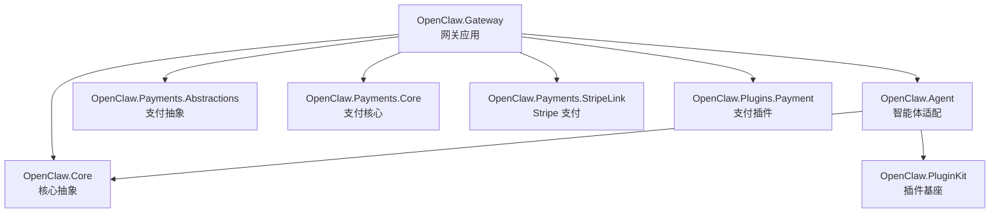
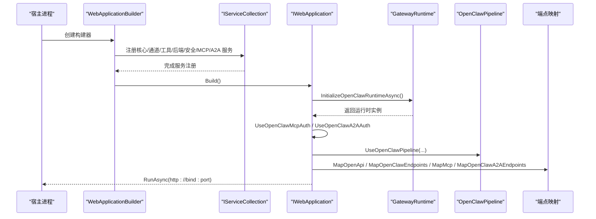
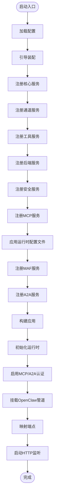
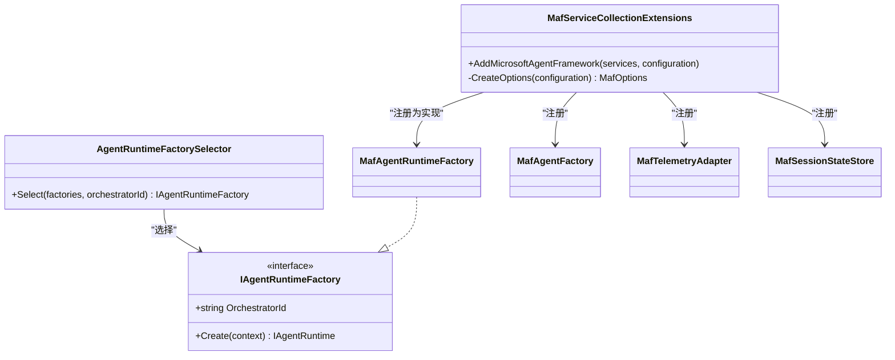
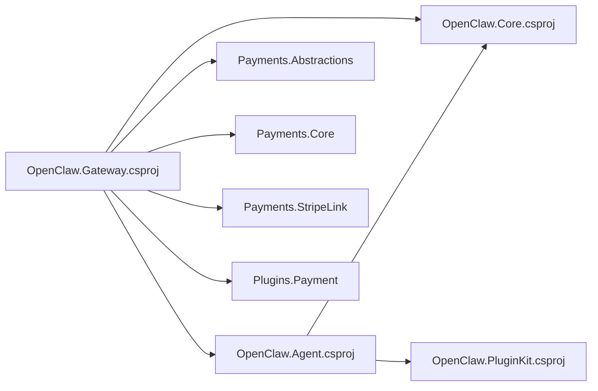

# 组件交互

<cite>
**本文引用的文件**
- [Program.cs](file://src/OpenClaw.Gateway/Program.cs)
- [MafServiceCollectionExtensions.cs](file://src/OpenClaw.Agent/MafServiceCollectionExtensions.cs)
- [OpenClaw.Gateway.csproj](file://src/OpenClaw.Gateway/OpenClaw.Gateway.csproj)
- [OpenClaw.Agent.csproj](file://src/OpenClaw.Agent/OpenClaw.Agent.csproj)
- [OpenClaw.Core.csproj](file://src/OpenClaw.Core/OpenClaw.Core.csproj)
- [IAgentRuntimeFactory.cs](file://src/OpenClaw.Agent/IAgentRuntimeFactory.cs)
</cite>

## 目录
1. [引言](#引言)
2. [项目结构](#项目结构)
3. [核心组件](#核心组件)
4. [架构总览](#架构总览)
5. [详细组件分析](#详细组件分析)
6. [依赖分析](#依赖分析)
7. [性能考虑](#性能考虑)
8. [故障排查指南](#故障排查指南)
9. [结论](#结论)

## 引言
本文件面向 OpenClaw.NET 的组件交互架构，聚焦于服务注册机制、依赖注入模式与生命周期管理，系统性梳理核心服务、后端服务、通道服务、工具服务之间的依赖关系、通信协议与数据流向，并给出组件解耦策略、接口设计原则与扩展点机制。同时，结合现有代码证据，绘制组件交互图与消息传递流程，覆盖服务发现、负载均衡与故障转移等分布式系统特性在当前实现中的体现。

## 项目结构
OpenClaw.NET 采用多项目分层组织：网关层负责启动、配置装配、中间件管线与端点映射；智能体适配层提供运行时工厂与框架集成；核心抽象层提供通用模型、安全与内存等基础能力；通道与支付等子域通过独立项目模块化接入。下图展示与组件交互相关的关键项目与依赖关系。

图表来源
- [OpenClaw.Gateway.csproj:26-34](file://src/OpenClaw.Gateway/OpenClaw.Gateway.csproj#L26-L34)
- [OpenClaw.Agent.csproj:10-26](file://src/OpenClaw.Agent/OpenClaw.Agent.csproj#L10-L26)
- [OpenClaw.Core.csproj:1-24](file://src/OpenClaw.Core/OpenClaw.Core.csproj#L1-L24)

章节来源
- [OpenClaw.Gateway.csproj:26-34](file://src/OpenClaw.Gateway/OpenClaw.Gateway.csproj#L26-L34)
- [OpenClaw.Agent.csproj:10-26](file://src/OpenClaw.Agent/OpenClaw.Agent.csproj#L10-L26)
- [OpenClaw.Core.csproj:1-24](file://src/OpenClaw.Core/OpenClaw.Core.csproj#L1-L24)

## 核心组件
- 网关（Gateway）
  - 职责：应用启动、配置加载、服务注册、中间件管线、端点映射、运行时初始化与 MCP/A2A 集成。
  - 关键入口：程序入口负责启动循环、错误恢复与运行时初始化。
- 智能体适配（Agent）
  - 职责：提供运行时工厂与 Microsoft Agent Framework（MAF）集成，封装会话状态、遥测与工具执行桥接。
  - 关键点：通过扩展方法注册 MAF 运行时相关服务与选项。
- 核心抽象（Core）
  - 职责：定义通用模型、安全策略、内存存储、验证与可观测性等基础能力。
- 通道与支付（Channels/Payments）
  - 职责：通道适配器与支付相关抽象/实现模块化接入网关。

章节来源
- [Program.cs:47-98](file://src/OpenClaw.Gateway/Program.cs#L47-L98)
- [MafServiceCollectionExtensions.cs:9-20](file://src/OpenClaw.Agent/MafServiceCollectionExtensions.cs#L9-L20)

## 架构总览
下图展示从应用启动到运行时初始化、中间件管线与端点映射的整体交互流程，以及 MAF 与 A2A 的集成位置。

图表来源
- [Program.cs:50-98](file://src/OpenClaw.Gateway/Program.cs#L50-L98)

章节来源
- [Program.cs:47-98](file://src/OpenClaw.Gateway/Program.cs#L47-L98)

## 详细组件分析

### 网关启动与服务注册
- 启动循环与恢复
  - 应用进入带恢复的启动循环，若首次启动失败且可恢复，则根据交互式引导尝试修复并重试。
- 服务注册顺序
  - 配置加载 → 引导装配 → 核心服务 → 通道服务 → 工具服务 → 后端服务 → 安全服务 → MCP 服务 → 运行时配置文件 → MAF 集成 → A2A 集成 → 可选 OpenSandbox 集成。
- 中间件与端点
  - 初始化运行时后，启用 MCP/A2A 认证中间件，挂载管道与端点映射，最后启动 HTTP 监听。

图表来源
- [Program.cs:50-98](file://src/OpenClaw.Gateway/Program.cs#L50-L98)

章节来源
- [Program.cs:42-98](file://src/OpenClaw.Gateway/Program.cs#L42-L98)

### MAF 运行时集成
- 服务注册
  - 通过扩展方法向容器注册 MAF 选项、遥测适配器、会话状态存储、智能体工厂与运行时工厂接口实现。
- 配置解析
  - 从配置节读取代理名称、描述、会话侧车路径、流式支持、A2A 开关与路径前缀、版本与公开地址、技能清单等。
- 扩展点
  - 通过接口选择器按 OrchestratorId 选择具体工厂实现，便于扩展不同运行时。

图表来源
- [MafServiceCollectionExtensions.cs:9-20](file://src/OpenClaw.Agent/MafServiceCollectionExtensions.cs#L9-L20)
- [IAgentRuntimeFactory.cs:40-45](file://src/OpenClaw.Agent/IAgentRuntimeFactory.cs#L40-L45)

章节来源
- [MafServiceCollectionExtensions.cs:9-106](file://src/OpenClaw.Agent/MafServiceCollectionExtensions.cs#L9-L106)
- [IAgentRuntimeFactory.cs:40-65](file://src/OpenClaw.Agent/IAgentRuntimeFactory.cs#L40-L65)

### 组件解耦策略与接口设计原则
- 接口隔离
  - 运行时工厂通过接口暴露创建能力，选择器按标识选择实现，避免调用方直接依赖具体实现。
- 松耦合注入
  - 通过扩展方法集中注册 MAF 相关服务，确保配置解析与服务绑定分离。
- 可替换性
  - 不同 OrchestratorId 对应不同工厂实现，便于替换或扩展运行时引擎。

章节来源
- [IAgentRuntimeFactory.cs:40-65](file://src/OpenClaw.Agent/IAgentRuntimeFactory.cs#L40-L65)
- [MafServiceCollectionExtensions.cs:9-20](file://src/OpenClaw.Agent/MafServiceCollectionExtensions.cs#L9-L20)

### 扩展点机制
- 运行时工厂扩展
  - 新增运行时只需实现 IAgentRuntimeFactory 并在容器中注册，选择器自动识别。
- 配置驱动
  - MAF 选项从配置节读取，支持 A2A 技能清单、流式开关等，便于无代码扩展。

章节来源
- [IAgentRuntimeFactory.cs:47-65](file://src/OpenClaw.Agent/IAgentRuntimeFactory.cs#L47-L65)
- [MafServiceCollectionExtensions.cs:22-105](file://src/OpenClaw.Agent/MafServiceCollectionExtensions.cs#L22-L105)

## 依赖分析
- 项目级依赖
  - Gateway 依赖 Core、Agent、支付相关项目与 ServiceDefaults；Agent 依赖 Core 与 PluginKit。
- 包级依赖
  - Gateway 引入 MCP、A2A、MAF、OpenTelemetry 等包；Agent 引入 AI、OpenAI、MQTTnet、ModelContextProtocol 等包。
- 内部可见性
  - Agent 对 Gateway 与测试项目开放内部可见性，便于集成测试与网关内使用。

图表来源
- [OpenClaw.Gateway.csproj:26-34](file://src/OpenClaw.Gateway/OpenClaw.Gateway.csproj#L26-L34)
- [OpenClaw.Agent.csproj:10-26](file://src/OpenClaw.Agent/OpenClaw.Agent.csproj#L10-L26)

章节来源
- [OpenClaw.Gateway.csproj:26-34](file://src/OpenClaw.Gateway/OpenClaw.Gateway.csproj#L26-L34)
- [OpenClaw.Agent.csproj:10-26](file://src/OpenClaw.Agent/OpenClaw.Agent.csproj#L10-L26)

## 性能考虑
- 启动优化
  - 使用 Slim 构建器与最小化包引用，减少启动体积与时间。
- 观测性
  - 集成 OpenTelemetry，便于运行时性能与链路追踪。
- AOT 兼容
  - 多项目声明 AOT 兼容，有助于减小二进制与提升启动性能。

章节来源
- [OpenClaw.Gateway.csproj:2-21](file://src/OpenClaw.Gateway/OpenClaw.Gateway.csproj#L2-L21)
- [OpenClaw.Gateway.csproj:62-67](file://src/OpenClaw.Gateway/OpenClaw.Gateway.csproj#L62-L67)

## 故障排查指南
- 启动失败与恢复
  - 首次启动异常时，进入交互式恢复流程，支持快速修复与重试；若无法处理则输出诊断信息。
- 错误码与退出
  - 根据恢复结果设置退出码，便于外部进程判断后续动作。

章节来源
- [Program.cs:99-122](file://src/OpenClaw.Gateway/Program.cs#L99-L122)

## 结论
OpenClaw.NET 通过清晰的分层与模块化设计，将网关、智能体适配、核心抽象与支付/通道等子域解耦。服务注册集中在网关启动阶段，配合 MAF/A2A 扩展点实现灵活的运行时选择与配置驱动行为。结合可观测性与启动优化，系统具备良好的可维护性与可扩展性。对于分布式特性（服务发现、负载均衡、故障转移），当前代码证据主要体现在启动恢复与端到端流程中，未来可在网关与运行时之间引入更完善的健康检查与重试策略以进一步增强弹性。