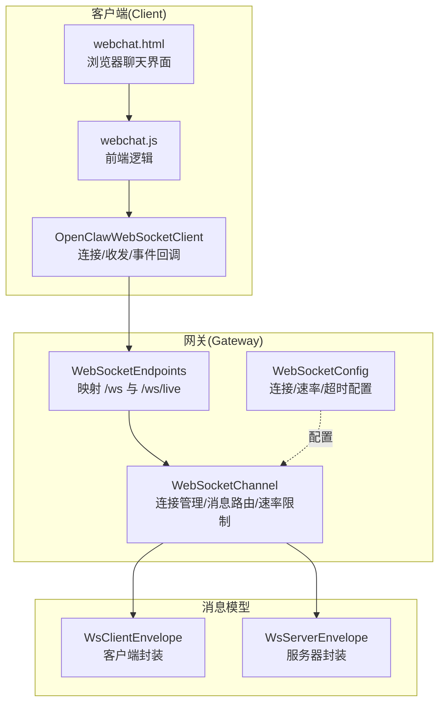
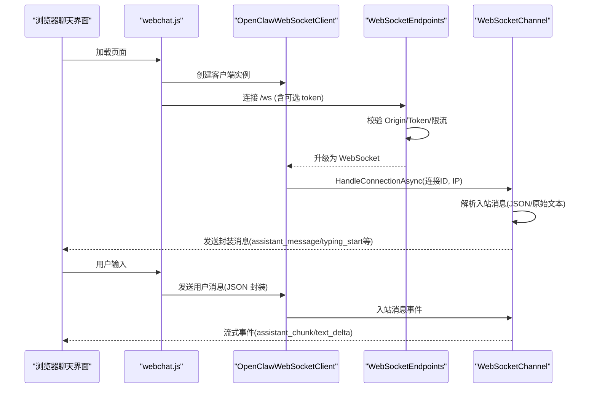
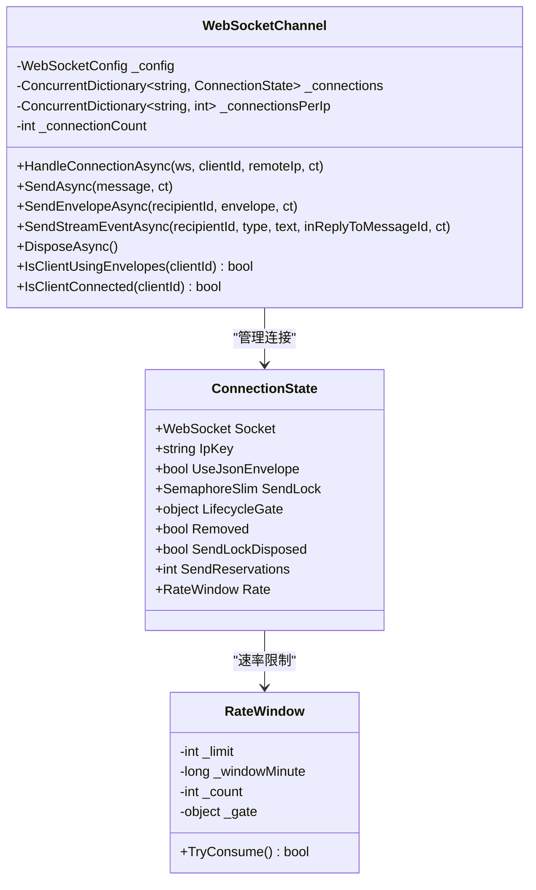
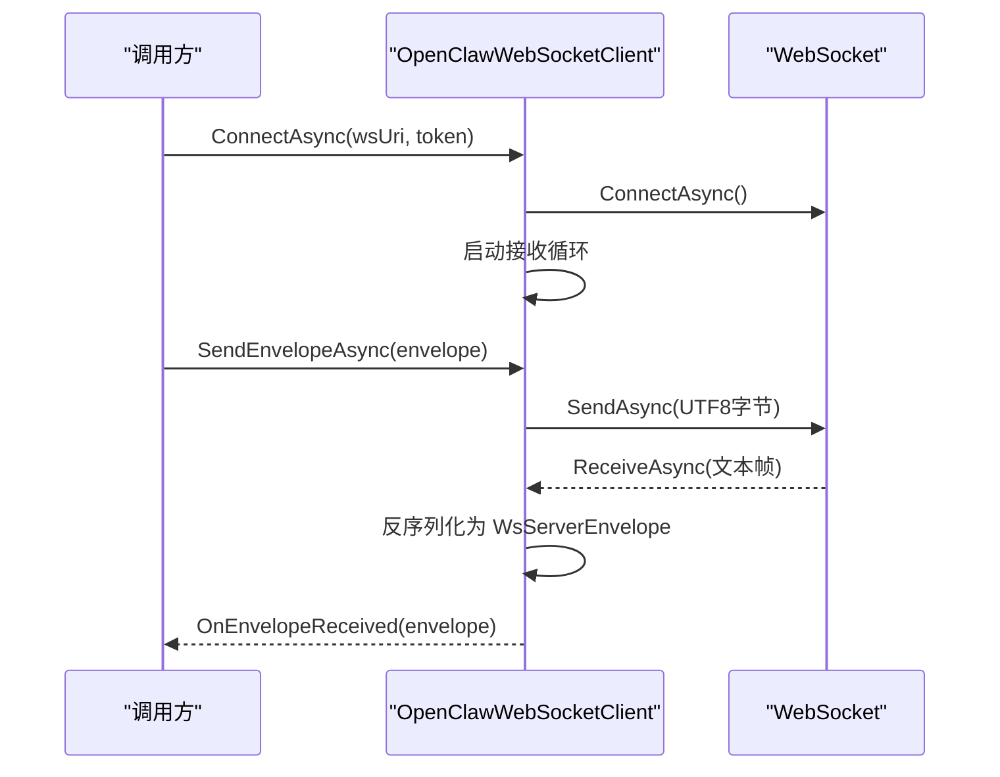
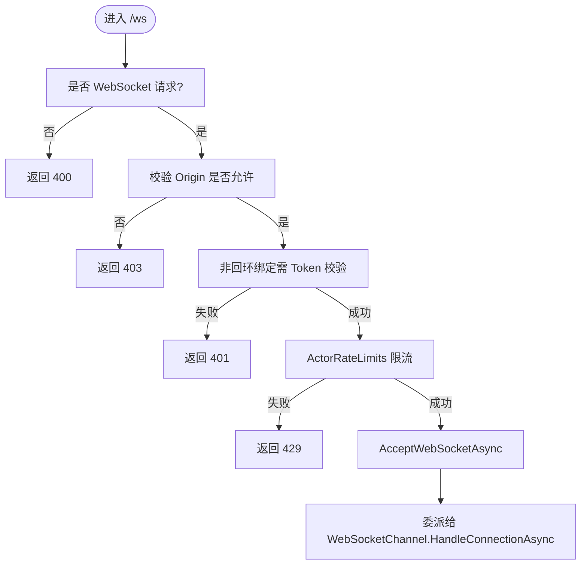
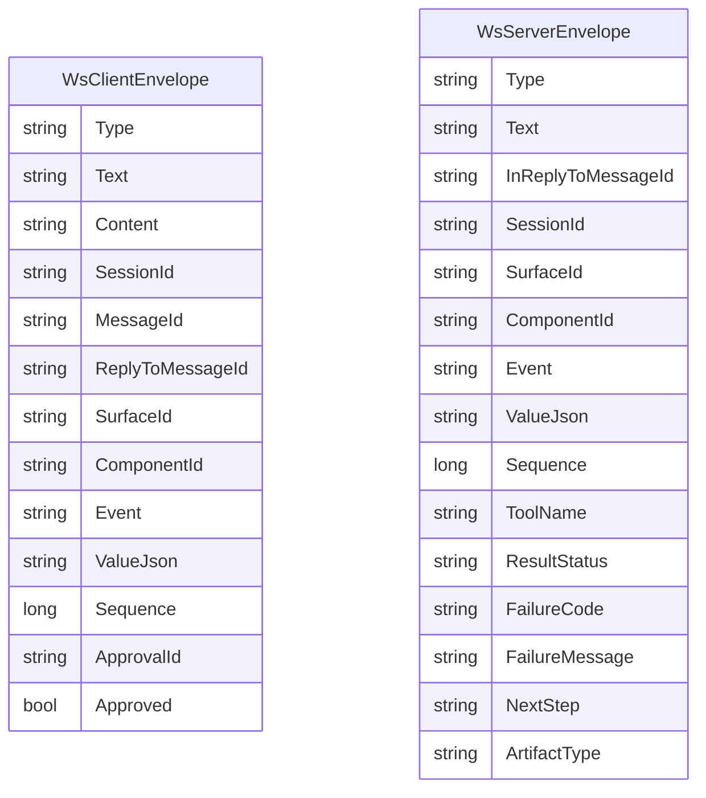
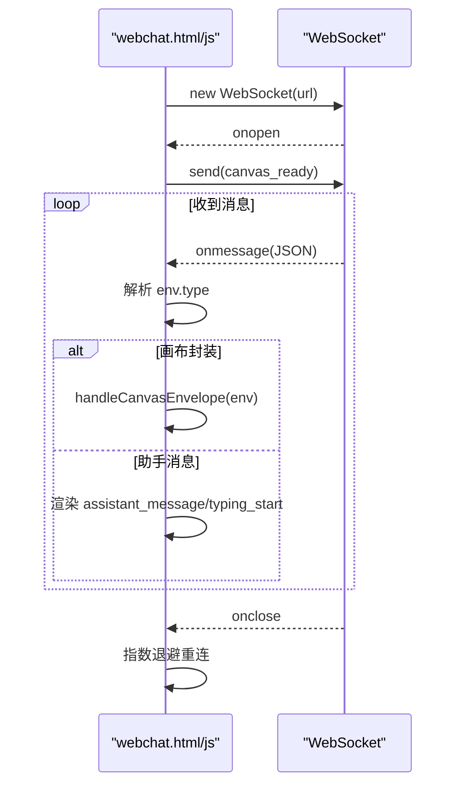
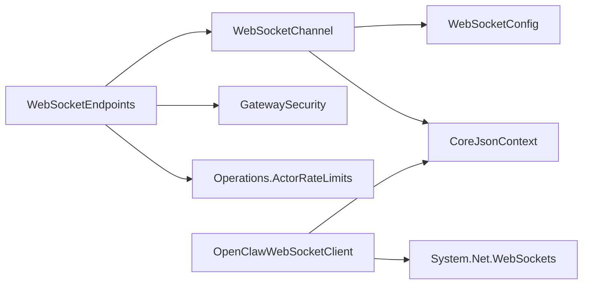

# Web 通道

<cite>
**本文引用的文件列表**
- [WebSocketChannel.cs](file://src/OpenClaw.Channels/WebSocketChannel.cs)
- [OpenClawWebSocketClient.cs](file://src/OpenClaw.Client/OpenClawWebSocketClient.cs)
- [WebSocketEnvelopes.cs](file://src/OpenClaw.Core/Models/WebSocketEnvelopes.cs)
- [WebSocketEndpoints.cs](file://src/OpenClaw.Gateway/Endpoints/WebSocketEndpoints.cs)
- [webchat.html](file://src/OpenClaw.Gateway/wwwroot/webchat.html)
- [webchat.js](file://src/OpenClaw.Gateway/wwwroot/webchat.js)
- [WebSocketConfig.cs](file://src/OpenClaw.Core/Models/GatewayConfig.cs)
- [TestWebSocket.cs](file://src/OpenClaw.Tests/TestWebSocket.cs)
</cite>

## 目录
1. [简介](#简介)
2. [项目结构](#项目结构)
3. [核心组件](#核心组件)
4. [架构总览](#架构总览)
5. [详细组件分析](#详细组件分析)
6. [依赖关系分析](#依赖关系分析)
7. [性能考量](#性能考量)
8. [故障排查指南](#故障排查指南)
9. [结论](#结论)
10. [附录](#附录)

## 简介
本文件系统性地文档化了 Web 通道服务，重点覆盖 WebSocket 通道的实现原理、连接管理、消息传输机制、实时通信协议、消息封装格式与事件处理、配置与连接池管理以及性能优化策略。文档同时提供架构图与实时通信示例，帮助开发者快速理解并集成浏览器聊天界面、WebSocket 端点与消息封装格式。

## 项目结构
Web 通道涉及以下关键模块：
- 通道适配器：负责连接接入、消息解析、速率限制、并发发送控制与连接生命周期管理
- 客户端库：提供浏览器或应用侧的 WebSocket 客户端，支持 JSON 封装消息与事件回调
- 网关端点：暴露 /ws 与 /ws/live 端点，进行请求校验、授权与升级握手
- 消息模型：定义客户端与服务器之间的 JSON 封装消息类型
- 前端聊天界面：内置浏览器聊天页面，演示如何建立连接、发送与接收消息

图表来源
- [WebSocketEndpoints.cs:18-60](file://src/OpenClaw.Gateway/Endpoints/WebSocketEndpoints.cs#L18-L60)
- [WebSocketChannel.cs:16-75](file://src/OpenClaw.Channels/WebSocketChannel.cs#L16-L75)
- [OpenClawWebSocketClient.cs:9-57](file://src/OpenClaw.Client/OpenClawWebSocketClient.cs#L9-L57)
- [WebSocketEnvelopes.cs:7-108](file://src/OpenClaw.Core/Models/WebSocketEnvelopes.cs#L7-L108)
- [webchat.html:4350-4374](file://src/OpenClaw.Gateway/wwwroot/webchat.html#L4350-L4374)
- [webchat.js:828-850](file://src/OpenClaw.Gateway/wwwroot/webchat.js#L828-L850)

章节来源
- [WebSocketEndpoints.cs:13-61](file://src/OpenClaw.Gateway/Endpoints/WebSocketEndpoints.cs#L13-L61)
- [WebSocketChannel.cs:16-75](file://src/OpenClaw.Channels/WebSocketChannel.cs#L16-L75)
- [OpenClawWebSocketClient.cs:9-57](file://src/OpenClaw.Client/OpenClawWebSocketClient.cs#L9-L57)
- [WebSocketEnvelopes.cs:7-108](file://src/OpenClaw.Core/Models/WebSocketEnvelopes.cs#L7-L108)
- [webchat.html:4350-4374](file://src/OpenClaw.Gateway/wwwroot/webchat.html#L4350-L4374)
- [webchat.js:828-850](file://src/OpenClaw.Gateway/wwwroot/webchat.js#L828-L850)

## 核心组件
- WebSocketChannel：通道适配器，负责连接接入、消息解析、速率限制、并发发送控制与连接生命周期管理
- OpenClawWebSocketClient：客户端库，负责连接、发送/接收、错误处理与事件回调
- WebSocketEndpoints：网关端点，负责 /ws 与 /ws/live 的请求校验、授权与升级握手
- WebSocketEnvelopes：消息封装模型，定义客户端与服务器之间的 JSON 封装消息字段
- webchat.html/webchat.js：浏览器聊天界面，演示连接、消息收发与事件处理

章节来源
- [WebSocketChannel.cs:16-75](file://src/OpenClaw.Channels/WebSocketChannel.cs#L16-L75)
- [OpenClawWebSocketClient.cs:9-57](file://src/OpenClaw.Client/OpenClawWebSocketClient.cs#L9-L57)
- [WebSocketEndpoints.cs:13-61](file://src/OpenClaw.Gateway/Endpoints/WebSocketEndpoints.cs#L13-L61)
- [WebSocketEnvelopes.cs:7-108](file://src/OpenClaw.Core/Models/WebSocketEnvelopes.cs#L7-L108)
- [webchat.html:4350-4374](file://src/OpenClaw.Gateway/wwwroot/webchat.html#L4350-L4374)
- [webchat.js:828-850](file://src/OpenClaw.Gateway/wwwroot/webchat.js#L828-L850)

## 架构总览
WebSocket 通道采用“网关端点 + 通道适配器 + 客户端库”的分层设计：
- 网关端点负责安全校验与升级握手，随后将连接委派给通道适配器
- 通道适配器维护每个连接的状态、速率限制与并发发送控制，并将消息转换为统一的内部消息模型
- 客户端库负责连接生命周期、消息收发与事件回调，支持 JSON 封装消息与原始文本消息
- 前端聊天界面通过 /ws 建立连接，接收服务器封装消息并渲染

图表来源
- [WebSocketEndpoints.cs:18-26](file://src/OpenClaw.Gateway/Endpoints/WebSocketEndpoints.cs#L18-L26)
- [WebSocketChannel.cs:76-151](file://src/OpenClaw.Channels/WebSocketChannel.cs#L76-L151)
- [OpenClawWebSocketClient.cs:38-57](file://src/OpenClaw.Client/OpenClawWebSocketClient.cs#L38-L57)
- [webchat.html:4350-4374](file://src/OpenClaw.Gateway/wwwroot/webchat.html#L4350-L4374)
- [webchat.js:828-850](file://src/OpenClaw.Gateway/wwwroot/webchat.js#L828-L850)

## 详细组件分析

### WebSocketChannel 组件
- 连接管理
  - 维护每个连接的 ConnectionState，包括 WebSocket 实例、IP 键、JSON 封装使用标记、发送锁、生命周期门控、移除状态、发送预留计数与速率窗口
  - 支持按 IP 与全局连接数上限控制，防止资源耗尽
- 消息解析与路由
  - 接收完整文本消息，尝试解析为 WsClientEnvelope；若为用户消息则提取文本内容并做长度保护
  - 支持画布交互封装（a2ui_event/a2ui_action）并触发 OnCanvasClientEnvelopeReceived 事件
  - 将解析后的消息封装为 InboundMessage 并触发 OnMessageReceived
- 发送机制
  - 支持两种发送路径：JSON 封装（WsServerEnvelope）与原始文本
  - 发送前进行速率限制检查；对 JSON 封装客户端可发送错误与流式事件
  - 发送过程使用 SemaphoreSlim 保证并发安全，避免竞态
- 生命周期与错误处理
  - 处理接收超时、消息过大、连接关闭等异常场景，必要时主动关闭连接
  - 提供连接移除与资源释放逻辑，确保发送锁在连接移除后安全释放

图表来源
- [WebSocketChannel.cs:16-75](file://src/OpenClaw.Channels/WebSocketChannel.cs#L16-L75)
- [WebSocketChannel.cs:23-65](file://src/OpenClaw.Channels/WebSocketChannel.cs#L23-L65)

章节来源
- [WebSocketChannel.cs:76-151](file://src/OpenClaw.Channels/WebSocketChannel.cs#L76-L151)
- [WebSocketChannel.cs:153-190](file://src/OpenClaw.Channels/WebSocketChannel.cs#L153-L190)
- [WebSocketChannel.cs:192-232](file://src/OpenClaw.Channels/WebSocketChannel.cs#L192-L232)
- [WebSocketChannel.cs:247-296](file://src/OpenClaw.Channels/WebSocketChannel.cs#L247-L296)
- [WebSocketChannel.cs:334-370](file://src/OpenClaw.Channels/WebSocketChannel.cs#L334-L370)
- [WebSocketChannel.cs:372-433](file://src/OpenClaw.Channels/WebSocketChannel.cs#L372-L433)
- [WebSocketChannel.cs:435-510](file://src/OpenClaw.Channels/WebSocketChannel.cs#L435-L510)
- [WebSocketChannel.cs:523-581](file://src/OpenClaw.Channels/WebSocketChannel.cs#L523-L581)
- [WebSocketChannel.cs:583-594](file://src/OpenClaw.Channels/WebSocketChannel.cs#L583-L594)
- [WebSocketChannel.cs:595-641](file://src/OpenClaw.Channels/WebSocketChannel.cs#L595-L641)

### OpenClawWebSocketClient 组件
- 连接与断开
  - 支持设置 Authorization 头，连接成功后启动接收循环
  - 断开时清理发送锁、取消接收任务并安全关闭连接
- 发送与接收
  - 发送前序列化为 JSON 字节并进行大小校验
  - 接收循环聚合多帧文本消息，解析为 WsServerEnvelope 并触发事件回调
- 事件模型
  - OnTextMessage：原始文本消息
  - OnEnvelopeReceived：服务器封装消息
  - OnError：错误通知

图表来源
- [OpenClawWebSocketClient.cs:38-57](file://src/OpenClaw.Client/OpenClawWebSocketClient.cs#L38-L57)
- [OpenClawWebSocketClient.cs:130-156](file://src/OpenClaw.Client/OpenClawWebSocketClient.cs#L130-L156)
- [OpenClawWebSocketClient.cs:158-227](file://src/OpenClaw.Client/OpenClawWebSocketClient.cs#L158-L227)

章节来源
- [OpenClawWebSocketClient.cs:38-117](file://src/OpenClaw.Client/OpenClawWebSocketClient.cs#L38-L117)
- [OpenClawWebSocketClient.cs:130-156](file://src/OpenClaw.Client/OpenClawWebSocketClient.cs#L130-L156)
- [OpenClawWebSocketClient.cs:158-227](file://src/OpenClaw.Client/OpenClawWebSocketClient.cs#L158-L227)

### WebSocketEndpoints 组件
- 端点映射
  - /ws：标准聊天通道，进行 Origin/Token/限流校验后升级为 WebSocket
  - /ws/live：直播会话通道，先接收打开请求，再桥接直播服务
- 校验逻辑
  - Origin 白名单校验，确保跨域安全
  - 非回环绑定时要求有效 Token（支持引导令牌与账户令牌）
  - 基于 ActorRateLimits 的端点级限流

图表来源
- [WebSocketEndpoints.cs:18-26](file://src/OpenClaw.Gateway/Endpoints/WebSocketEndpoints.cs#L18-L26)
- [WebSocketEndpoints.cs:63-94](file://src/OpenClaw.Gateway/Endpoints/WebSocketEndpoints.cs#L63-L94)
- [WebSocketEndpoints.cs:120-149](file://src/OpenClaw.Gateway/Endpoints/WebSocketEndpoints.cs#L120-L149)

章节来源
- [WebSocketEndpoints.cs:18-61](file://src/OpenClaw.Gateway/Endpoints/WebSocketEndpoints.cs#L18-L61)
- [WebSocketEndpoints.cs:63-149](file://src/OpenClaw.Gateway/Endpoints/WebSocketEndpoints.cs#L63-L149)

### WebSocketEnvelopes 模型
- WsClientEnvelope：客户端发送到服务器的消息封装，支持用户消息、画布交互、工具审批决策等
- WsServerEnvelope：服务器发送到客户端的消息封装，支持助手消息、流式片段、工具执行结果、审批状态等
- 两者均包含通用字段（如 Type、Text/Content、SessionId、MessageId、InReplyToMessageId 等），并针对特定场景扩展字段

图表来源
- [WebSocketEnvelopes.cs:7-48](file://src/OpenClaw.Core/Models/WebSocketEnvelopes.cs#L7-L48)
- [WebSocketEnvelopes.cs:53-108](file://src/OpenClaw.Core/Models/WebSocketEnvelopes.cs#L53-L108)

章节来源
- [WebSocketEnvelopes.cs:7-108](file://src/OpenClaw.Core/Models/WebSocketEnvelopes.cs#L7-L108)

### 浏览器聊天界面与 WebSocket 端点
- 界面连接
  - 根据当前页面协议自动选择 ws/wss，拼接 /ws 并附加可选 token 查询参数
  - 连接成功后发送 canvas_ready 并更新界面状态
- 消息处理
  - 解析服务器封装消息，根据 type 分发到不同 UI 处理分支（typing_start/assistant_message 等）
  - 对于画布封装消息，走独立的画布处理流程
- 重连策略
  - 基于指数退避的重连策略，达到最大重连次数后提示刷新重试

图表来源
- [webchat.html:4350-4374](file://src/OpenClaw.Gateway/wwwroot/webchat.html#L4350-L4374)
- [webchat.html:4376-4454](file://src/OpenClaw.Gateway/wwwroot/webchat.html#L4376-L4454)
- [webchat.html:4456-4485](file://src/OpenClaw.Gateway/wwwroot/webchat.html#L4456-L4485)
- [webchat.js:828-850](file://src/OpenClaw.Gateway/wwwroot/webchat.js#L828-L850)
- [webchat.js:852-1023](file://src/OpenClaw.Gateway/wwwroot/webchat.js#L852-L1023)

章节来源
- [webchat.html:4350-4502](file://src/OpenClaw.Gateway/wwwroot/webchat.html#L4350-L4502)
- [webchat.js:828-1028](file://src/OpenClaw.Gateway/wwwroot/webchat.js#L828-L1028)

## 依赖关系分析
- 组件耦合
  - WebSocketEndpoints 依赖 GatewayStartupContext 与 GatewayAppRuntime，以获取安全策略、速率限制与 WebSocketChannel 实例
  - WebSocketChannel 依赖 WebSocketConfig 与 CoreJsonContext 进行速率限制与 JSON 序列化
  - OpenClawWebSocketClient 依赖 CoreJsonContext 与 System.Net.WebSockets
- 外部依赖
  - ASP.NET Core WebSockets 与中间件（KeepAlive、CORS、转发头等）
  - System.Text.Json 用于消息序列化/反序列化
  - ArrayPool<byte> 与内存缓冲区管理

图表来源
- [WebSocketEndpoints.cs:13-61](file://src/OpenClaw.Gateway/Endpoints/WebSocketEndpoints.cs#L13-L61)
- [WebSocketChannel.cs:67-75](file://src/OpenClaw.Channels/WebSocketChannel.cs#L67-L75)
- [OpenClawWebSocketClient.cs:9-21](file://src/OpenClaw.Client/OpenClawWebSocketClient.cs#L9-L21)

章节来源
- [WebSocketEndpoints.cs:13-61](file://src/OpenClaw.Gateway/Endpoints/WebSocketEndpoints.cs#L13-L61)
- [WebSocketChannel.cs:67-75](file://src/OpenClaw.Channels/WebSocketChannel.cs#L67-L75)
- [OpenClawWebSocketClient.cs:9-21](file://src/OpenClaw.Client/OpenClawWebSocketClient.cs#L9-L21)

## 性能考量
- 内存与缓冲
  - 接收循环使用 ArrayPool<byte> 与 ArrayBufferWriter<byte>，动态扩容但受 MaxMessageBytes 限制，避免内存膨胀
  - 发送路径使用 SemaphoreSlim 串行化发送，减少竞争与上下文切换
- 速率限制
  - 每连接每分钟消息数限制，基于时间窗口计数，超过阈值立即拒绝并关闭连接
  - 全局连接数与每 IP 连接数限制，防止资源耗尽
- 超时与健壮性
  - 接收超时控制，超时自动关闭连接
  - 对异常（ObjectDisposedException、WebSocketException、InvalidOperationException）进行捕获与降级处理
- 并发与锁
  - 使用生命周期门控与发送预留计数，确保连接移除时发送锁安全释放
- 前端优化
  - 指数退避重连，避免风暴式重试
  - 画布封装消息与流式事件分离，降低 UI 渲染压力

章节来源
- [WebSocketChannel.cs:435-510](file://src/OpenClaw.Channels/WebSocketChannel.cs#L435-L510)
- [WebSocketChannel.cs:383-433](file://src/OpenClaw.Channels/WebSocketChannel.cs#L383-L433)
- [WebSocketChannel.cs:41-65](file://src/OpenClaw.Channels/WebSocketChannel.cs#L41-L65)
- [WebSocketChannel.cs:334-370](file://src/OpenClaw.Channels/WebSocketChannel.cs#L334-L370)
- [OpenClawWebSocketClient.cs:158-227](file://src/OpenClaw.Client/OpenClawWebSocketClient.cs#L158-L227)
- [webchat.js:1002-1023](file://src/OpenClaw.Gateway/wwwroot/webchat.js#L1002-L1023)

## 故障排查指南
- 连接被拒绝
  - 检查 Origin 是否在允许列表，或与当前 Host/Port 匹配
  - 非回环绑定时确认 Token 是否有效
  - 查看 ActorRateLimits 是否触发 429
- 连接超时
  - 检查 ReceiveTimeoutSeconds 设置，确认客户端是否及时发送数据
- 消息过大
  - 客户端发送前检查消息大小，服务端 MaxMessageBytes 限制为 256KB（默认）
- 速率限制
  - 服务端每连接每分钟消息数限制为 120（默认），超过将被拒绝并关闭
- 断线重连
  - 前端采用指数退避策略，达到最大重连次数后提示刷新
- 测试辅助
  - 使用 TestWebSocket 在单元测试中模拟阻塞接收/发送，验证并发与移除逻辑

章节来源
- [WebSocketEndpoints.cs:63-94](file://src/OpenClaw.Gateway/Endpoints/WebSocketEndpoints.cs#L63-L94)
- [WebSocketEndpoints.cs:120-149](file://src/OpenClaw.Gateway/Endpoints/WebSocketEndpoints.cs#L120-L149)
- [WebSocketConfig.cs:386-393](file://src/OpenClaw.Core/Models/GatewayConfig.cs#L386-L393)
- [WebSocketChannel.cs:435-510](file://src/OpenClaw.Channels/WebSocketChannel.cs#L435-L510)
- [WebSocketChannel.cs:96-112](file://src/OpenClaw.Channels/WebSocketChannel.cs#L96-L112)
- [webchat.js:1002-1023](file://src/OpenClaw.Gateway/wwwroot/webchat.js#L1002-L1023)
- [TestWebSocket.cs:31-44](file://src/OpenClaw.Tests/TestWebSocket.cs#L31-L44)

## 结论
Web 通道通过清晰的分层设计与完善的连接管理、速率限制与错误处理机制，提供了稳定可靠的实时通信能力。结合浏览器聊天界面与 JSON 封装消息，开发者可以快速构建从聊天到画布交互的丰富应用场景。建议在生产环境中合理配置连接数、速率与超时参数，并关注前端的重连策略与 UI 渲染优化。

## 附录
- 配置项参考
  - MaxMessageBytes：单条消息最大字节数（默认 256KB）
  - MaxConnections：最大连接数（默认 1000）
  - MaxConnectionsPerIp：每 IP 最大连接数（默认 50）
  - MessagesPerMinutePerConnection：每连接每分钟消息数（默认 120）
  - ReceiveTimeoutSeconds：接收超时秒数（默认 120）

章节来源
- [WebSocketConfig.cs:386-393](file://src/OpenClaw.Core/Models/GatewayConfig.cs#L386-L393)