# 消息通道

<cite>
**本文档引用的文件**
- [OpenClaw.Channels.csproj](file://src/OpenClaw.Channels/OpenClaw.Channels.csproj)
- [WhatsAppChannel.cs](file://src/OpenClaw.Channels/WhatsAppChannel.cs)
- [TelegramChannel.cs](file://src/OpenClaw.Channels/TelegramChannel.cs)
- [SlackChannel.cs](file://src/OpenClaw.Channels/SlackChannel.cs)
- [TeamsChannel.cs](file://src/OpenClaw.Channels/TeamsChannel.cs)
- [DiscordChannel.cs](file://src/OpenClaw.Channels/DiscordChannel.cs)
- [SignalChannel.cs](file://src/OpenClaw.Channels/SignalChannel.cs)
- [EmailChannel.cs](file://src/OpenClaw.Channels/EmailChannel.cs)
- [CronChannel.cs](file://src/OpenClaw.Channels/CronChannel.cs)
- [DingTalkChannel.cs](file://src/OpenClaw.Channels/DingTalkChannel.cs)
- [FeishuChannel.cs](file://src/OpenClaw.Channels/FeishuChannel.cs)
- [WeComChannel.cs](file://src/OpenClaw.Channels/WeComChannel.cs)
- [TwilioSmsChannel.cs](file://src/OpenClaw.Channels/TwilioSmsChannel.cs)
- [TwilioSmsClient.cs](file://src/OpenClaw.Channels/TwilioSmsClient.cs)
- [FeishuMessageDedup.cs](file://src/OpenClaw.Channels/FeishuMessageDedup.cs)
- [KingcrabChannelConfigs.cs](file://src/OpenClaw.Core/Models/KingcrabChannelConfigs.cs)
- [IChannelAdapter.cs](file://src/OpenClaw.Core/Abstractions/IChannelAdapter.cs)
- [IRestartableChannelAdapter.cs](file://src/OpenClaw.Core/Abstractions/IRestartableChannelAdapter.cs)
- [Messages.cs](file://src/OpenClaw.Core/Models/Messages.cs)
- [MediaMarkerProtocol.cs](file://src/OpenClaw.Core/Models/MediaMarkerProtocol.cs)
- [HttpClientFactory.cs](file://src/OpenClaw.Core/Http/HttpClientFactory.cs)
- [SecretResolver.cs](file://src/OpenClaw.Core/Security/SecretResolver.cs)
- [README.md](file://README.md)
- [WHATSAPP_SETUP.md](file://docs/WHATSAPP_SETUP.md)
- [TEAMS_SETUP.md](file://docs/TEAMS_SETUP.md)
</cite>

## 目录
1. [简介](#简介)
2. [项目结构](#项目结构)
3. [核心组件](#核心组件)
4. [架构总览](#架构总览)
5. [详细组件分析](#详细组件分析)
6. [依赖关系分析](#依赖关系分析)
7. [性能考虑](#性能考虑)
8. [故障排除指南](#故障排除指南)
9. [结论](#结论)
10. [附录](#附录)

## 简介
本文件系统性梳理消息通道适配器的设计与实现，覆盖 WhatsApp、Telegram、Slack、Teams、Discord、Signal、Email、Cron、DingTalk、Feishu、WeCom、Twilio SMS 等消息渠道。文档重点阐述各渠道的消息接收、解析、路由与发送全流程，涵盖认证机制、API 限制、消息格式转换与 webhook 处理，并提供架构图、配置要点与故障排除建议。

## 项目结构
OpenClaw 的消息通道位于独立的类库工程中，统一实现 IChannelAdapter 接口，面向上层网关进行消息的收发与路由。核心文件组织如下：
- 通道适配器：每个渠道一个独立类，实现 IChannelAdapter 或 IRestartableChannelAdapter
- 配置模型：各渠道的 ChannelConfig 定义在核心模型中
- 工具与安全：媒体标记协议、HTTP 客户端工厂、密钥解析器等
- 示例与文档：各渠道的部署与配置文档

```mermaid
graph TB
subgraph "消息通道库"
WC["WhatsAppChannel"]
TG["TelegramChannel"]
SL["SlackChannel"]
TS["TeamsChannel"]
DC["DiscordChannel"]
SG["SignalChannel"]
ML["EmailChannel"]
CR["CronChannel"]
DT["DingTalkChannel"]
FS["FeishuChannel"]
WCm["WeComChannel"]
TW["TwilioSmsChannel"]
end
subgraph "核心抽象与工具"
ICA["IChannelAdapter"]
IRCA["IRestartableChannelAdapter"]
CFG["ChannelConfigs"]
MMP["MediaMarkerProtocol"]
HCF["HttpClientFactory"]
SR["SecretResolver"]
end
WC --> ICA
TG --> ICA
SL --> ICA
TS --> ICA
DC --> ICA
SG --> ICA
ML --> ICA
CR --> ICA
DT --> ICA
FS --> ICA
WCm --> ICA
TW --> ICA
DT --> IRCA
FS --> IRCA
WCm --> IRCA
WC --> CFG
TG --> CFG
SL --> CFG
TS --> CFG
DC --> CFG
SG --> CFG
ML --> CFG
CR --> CFG
DT --> CFG
FS --> CFG
WCm --> CFG
TW --> CFG
WC --> MMP
TG --> MMP
SL --> MMP
DC --> MMP
DT --> MMP
FS --> MMP
WCm --> MMP
TW --> MMP
WC --> HCF
TG --> HCF
SL --> HCF
TS --> HCF
DC --> HCF
DT --> HCF
FS --> HCF
WCm --> HCF
TW --> HCF
WC --> SR
TG --> SR
SL --> SR
TS --> SR
DC --> SR
DT --> SR
FS --> SR
WCm --> SR
TW --> SR
```

图表来源
- [OpenClaw.Channels.csproj:1-14](file://src/OpenClaw.Channels/OpenClaw.Channels.csproj#L1-L14)
- [IChannelAdapter.cs](file://src/OpenClaw.Core/Abstractions/IChannelAdapter.cs)
- [IRestartableChannelAdapter.cs](file://src/OpenClaw.Core/Abstractions/IRestartableChannelAdapter.cs)
- [KingcrabChannelConfigs.cs](file://src/OpenClaw.Core/Models/KingcrabChannelConfigs.cs)
- [MediaMarkerProtocol.cs](file://src/OpenClaw.Core/Models/MediaMarkerProtocol.cs)
- [HttpClientFactory.cs](file://src/OpenClaw.Core/Http/HttpClientFactory.cs)
- [SecretResolver.cs](file://src/OpenClaw.Core/Security/SecretResolver.cs)

章节来源
- [OpenClaw.Channels.csproj:1-14](file://src/OpenClaw.Channels/OpenClaw.Channels.csproj#L1-L14)

## 核心组件
- IChannelAdapter：定义通道适配器的最小接口契约，包括 StartAsync、SendAsync、RaiseInboundAsync、DisposeAsync 以及 OnMessageReceived 事件
- IRestartableChannelAdapter：支持运行时热重载配置并自动重启连接（如 DingTalk、Feishu、WeCom）
- ChannelConfigs：各渠道的配置模型，包含认证参数、行为开关、限流与策略参数
- MediaMarkerProtocol：统一的媒体标记语法与解析，支持 IMAGE_PATH、FILE_PATH、URL 等标记
- HttpClientFactory：集中管理 HTTP 客户端生命周期与共享
- SecretResolver：从环境变量或密钥引用解析敏感配置

章节来源
- [IChannelAdapter.cs](file://src/OpenClaw.Core/Abstractions/IChannelAdapter.cs)
- [IRestartableChannelAdapter.cs](file://src/OpenClaw.Core/Abstractions/IRestartableChannelAdapter.cs)
- [KingcrabChannelConfigs.cs](file://src/OpenClaw.Core/Models/KingcrabChannelConfigs.cs)
- [MediaMarkerProtocol.cs](file://src/OpenClaw.Core/Models/MediaMarkerProtocol.cs)
- [HttpClientFactory.cs](file://src/OpenClaw.Core/Http/HttpClientFactory.cs)
- [SecretResolver.cs](file://src/OpenClaw.Core/Security/SecretResolver.cs)

## 架构总览
消息通道的整体架构分为三层：
- 接收层：各渠道通过 WebSocket、长连接或 HTTP Webhook 接收消息
- 解析与路由层：解析消息内容、执行策略过滤（群聊、白名单、@提及）、构建 InboundMessage 并触发 OnMessageReceived
- 发送层：根据目标渠道选择合适 API（REST 或 WebSocket），处理媒体上传与分片发送，处理速率限制与重试

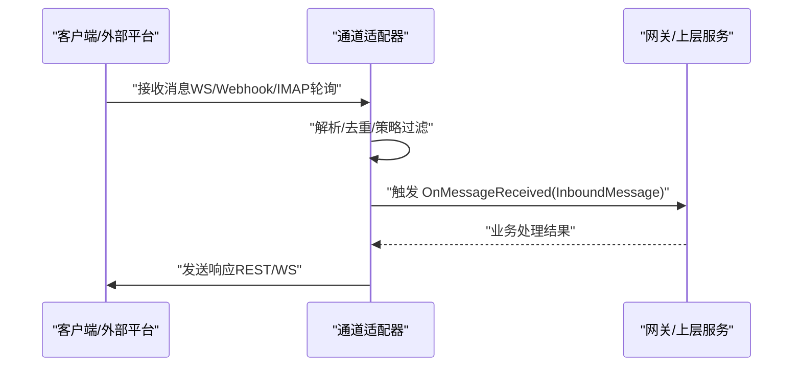

图表来源
- [WhatsAppChannel.cs:72-77](file://src/OpenClaw.Channels/WhatsAppChannel.cs#L72-L77)
- [TelegramChannel.cs:126-138](file://src/OpenClaw.Channels/TelegramChannel.cs#L126-L138)
- [SlackChannel.cs:44-91](file://src/OpenClaw.Channels/SlackChannel.cs#L44-L91)
- [TeamsChannel.cs:63-110](file://src/OpenClaw.Channels/TeamsChannel.cs#L63-L110)
- [DiscordChannel.cs:295-373](file://src/OpenClaw.Channels/DiscordChannel.cs#L295-L373)
- [SignalChannel.cs:316-343](file://src/OpenClaw.Channels/SignalChannel.cs#L316-L343)
- [EmailChannel.cs:112-159](file://src/OpenClaw.Channels/EmailChannel.cs#L112-L159)
- [DingTalkChannel.cs:318-456](file://src/OpenClaw.Channels/DingTalkChannel.cs#L318-L456)
- [FeishuChannel.cs:448-607](file://src/OpenClaw.Channels/FeishuChannel.cs#L448-L607)
- [WeComChannel.cs:380-503](file://src/OpenClaw.Channels/WeComChannel.cs#L380-L503)

## 详细组件分析

### WhatsApp 通道
- 认证与发送
  - 使用官方 Business Cloud API，基于 Bearer Token 认证
  - 支持文本、图片、视频、音频、文档、贴纸，最多一个媒体附件
  - 支持回复上下文（Context）
- 接收与解析
  - 通过网关接收 webhook，解析 JSON 并映射为 InboundMessage
- 限制与注意事项
  - 仅支持一个媒体附件；媒体必须使用 http(s) 绝对 URL
  - 需配置 PhoneNumberId 与 API Token

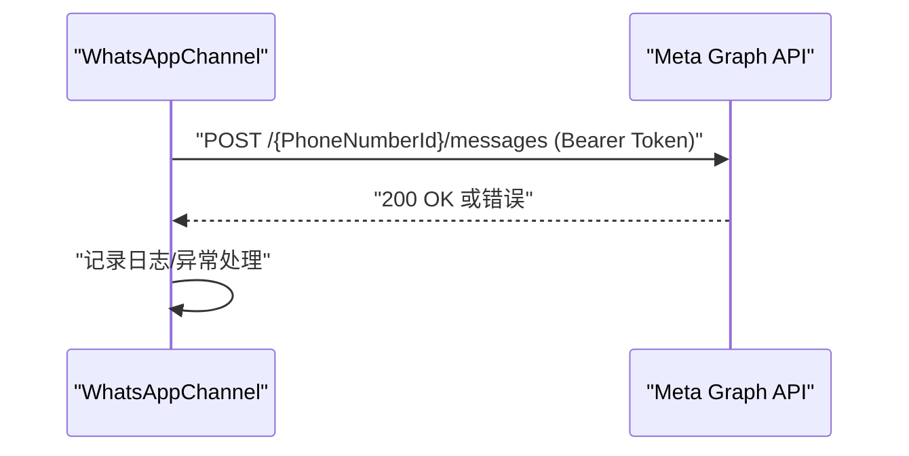

图表来源
- [WhatsAppChannel.cs:40-70](file://src/OpenClaw.Channels/WhatsAppChannel.cs#L40-L70)
- [WhatsAppChannel.cs:85-138](file://src/OpenClaw.Channels/WhatsAppChannel.cs#L85-L138)

章节来源
- [WhatsAppChannel.cs:11-31](file://src/OpenClaw.Channels/WhatsAppChannel.cs#L11-L31)
- [WhatsAppChannel.cs:40-70](file://src/OpenClaw.Channels/WhatsAppChannel.cs#L40-L70)
- [WhatsAppChannel.cs:85-138](file://src/OpenClaw.Channels/WhatsAppChannel.cs#L85-L138)
- [WHATSAPP_SETUP.md](file://docs/WHATSAPP_SETUP.md)

### Telegram 通道
- 认证与发送
  - 使用 Bot Token，支持 sendMessage 与多种媒体方法（sendPhoto、sendVideo 等）
  - 文本长度限制 4096，Caption 限制 1024；超限自动分片
  - 支持 ReplyToMessageId
- 接收与解析
  - 通过网关接收 webhook，解析 JSON 并映射为 InboundMessage
- 限制与注意事项
  - 支持用户名与数字 ID；媒体类型丰富但 Caption 仅部分支持

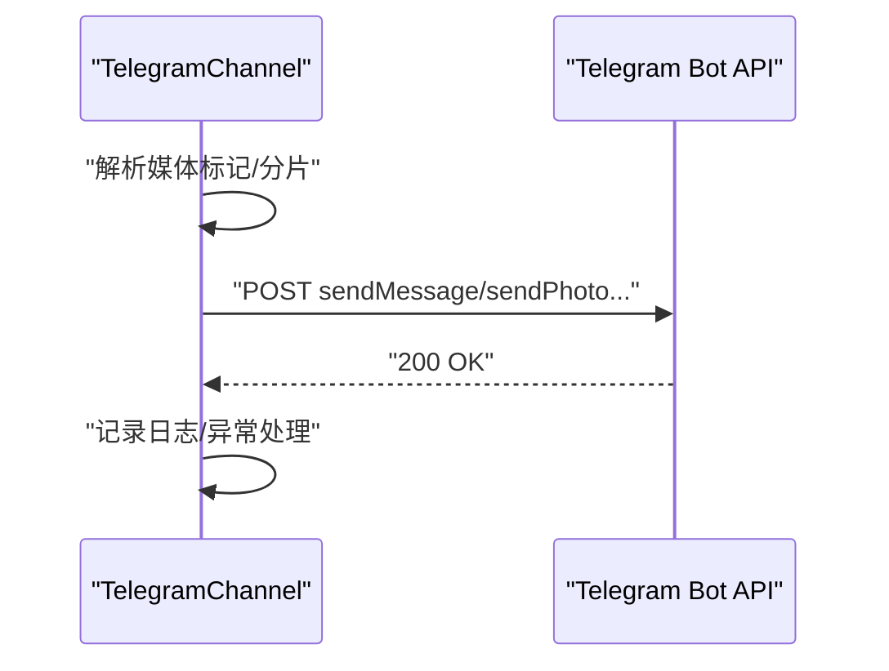

图表来源
- [TelegramChannel.cs:54-124](file://src/OpenClaw.Channels/TelegramChannel.cs#L54-L124)
- [TelegramChannel.cs:126-160](file://src/OpenClaw.Channels/TelegramChannel.cs#L126-L160)

章节来源
- [TelegramChannel.cs:14-44](file://src/OpenClaw.Channels/TelegramChannel.cs#L14-L44)
- [TelegramChannel.cs:54-124](file://src/OpenClaw.Channels/TelegramChannel.cs#L54-L124)
- [TelegramChannel.cs:126-160](file://src/OpenClaw.Channels/TelegramChannel.cs#L126-L160)

### Slack 通道
- 认证与发送
  - 使用 Bearer Token 调用 chat.postMessage
  - 自动处理 429 重试头，解析 API 返回的 ok=false 错误
- 接收与解析
  - 通过 Events API webhook 接收事件，转换为 InboundMessage
- 限制与注意事项
  - 基础 Markdown 到 mrkdwn 的简单转换

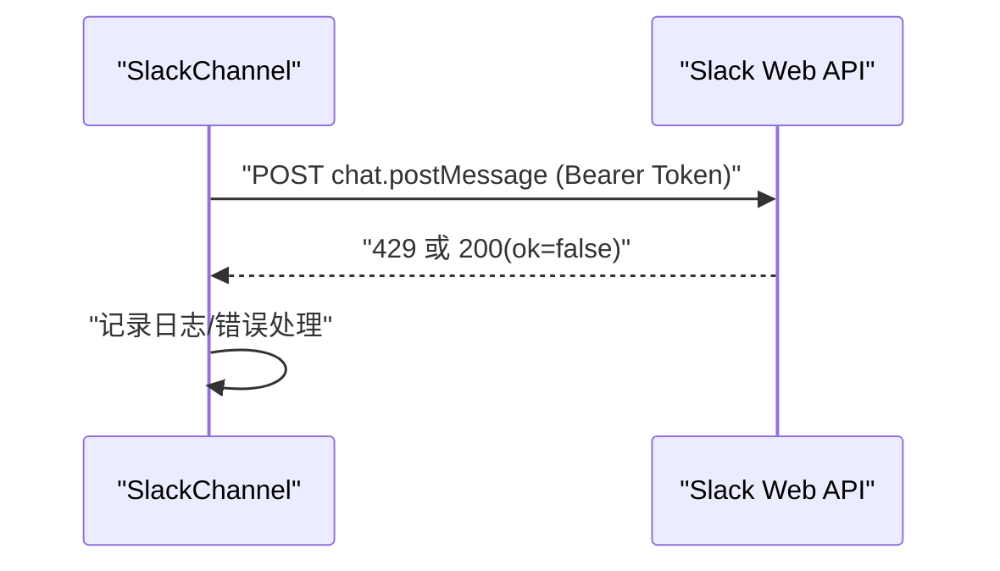

图表来源
- [SlackChannel.cs:44-91](file://src/OpenClaw.Channels/SlackChannel.cs#L44-L91)
- [SlackChannel.cs:96-109](file://src/OpenClaw.Channels/SlackChannel.cs#L96-L109)

章节来源
- [SlackChannel.cs:15-34](file://src/OpenClaw.Channels/SlackChannel.cs#L15-L34)
- [SlackChannel.cs:44-91](file://src/OpenClaw.Channels/SlackChannel.cs#L44-L91)

### Teams 通道
- 认证与发送
  - 使用 Azure Bot Framework OAuth 获取访问令牌，随后通过 Connector API 发送
  - 支持线程回复（ReplyToId），可配置文本分片策略
  - 通过 StoreConversationReference 存储对话引用，支持后续主动消息
- 接收与解析
  - 通过 webhook 接收活动（Activity），解析为 InboundMessage
- 限制与注意事项
  - 需要 AppId、AppPassword、TenantId；首次发送需先收到消息建立引用

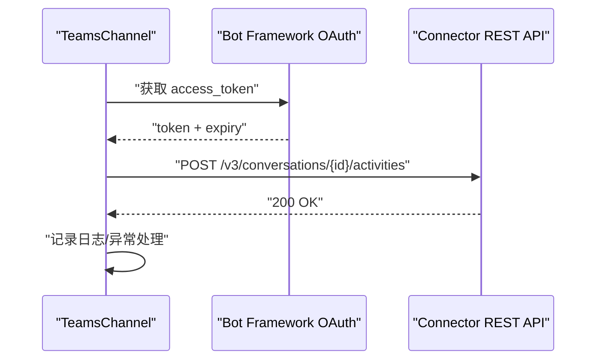

图表来源
- [TeamsChannel.cs:63-110](file://src/OpenClaw.Channels/TeamsChannel.cs#L63-L110)
- [TeamsChannel.cs:138-175](file://src/OpenClaw.Channels/TeamsChannel.cs#L138-L175)

章节来源
- [TeamsChannel.cs:16-52](file://src/OpenClaw.Channels/TeamsChannel.cs#L16-L52)
- [TeamsChannel.cs:63-110](file://src/OpenClaw.Channels/TeamsChannel.cs#L63-L110)
- [TEAMS_SETUP.md](file://docs/TEAMS_SETUP.md)

### Discord 通道
- 认证与发送
  - 使用 Bot Token 调用 REST API 发送消息；支持 2000 字符限制
  - 自动处理 429 重试
- 接收与解析
  - 使用 Gateway WebSocket 接收 MESSAGE_CREATE 事件，解析为 InboundMessage
  - 支持频道/公会白名单、用户白名单、@提及过滤
- 限制与注意事项
  - 需开启消息内容意图；支持分片与断线重连

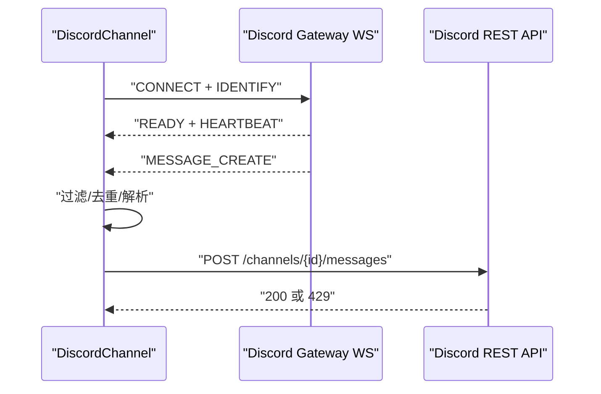

图表来源
- [DiscordChannel.cs:122-161](file://src/OpenClaw.Channels/DiscordChannel.cs#L122-L161)
- [DiscordChannel.cs:279-373](file://src/OpenClaw.Channels/DiscordChannel.cs#L279-L373)
- [DiscordChannel.cs:375-396](file://src/OpenClaw.Channels/DiscordChannel.cs#L375-L396)

章节来源
- [DiscordChannel.cs:16-59](file://src/OpenClaw.Channels/DiscordChannel.cs#L16-L59)
- [DiscordChannel.cs:122-161](file://src/OpenClaw.Channels/DiscordChannel.cs#L122-L161)
- [DiscordChannel.cs:279-373](file://src/OpenClaw.Channels/DiscordChannel.cs#L279-L373)

### Signal 通道
- 认证与发送
  - 支持 signald 与 signal-cli 两种驱动；通过 Unix Domain Socket 或进程 JSON-RPC 发送
  - 支持信任密钥与白名单号码过滤
- 接收与解析
  - signald：订阅账户事件；signal-cli：启动守护进程轮询
  - 仅处理私聊消息（DM-only）
- 限制与注意事项
  - 需要本地 bridge 服务；支持内容日志脱敏

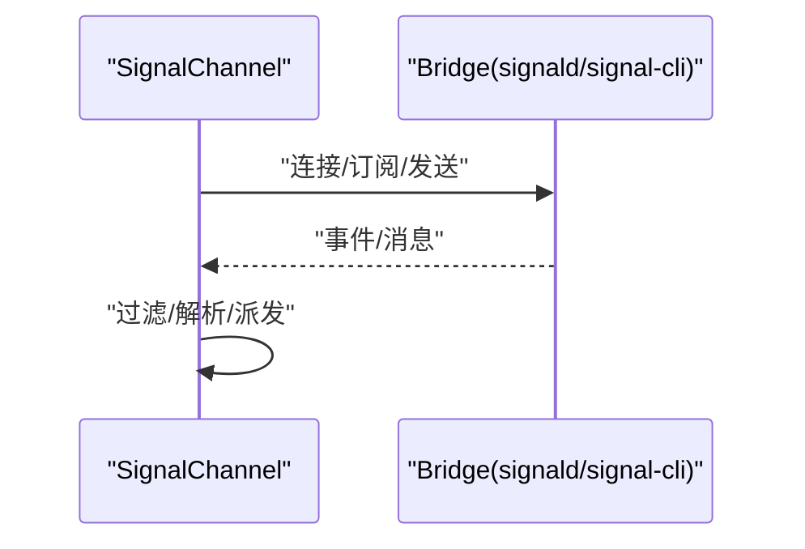

图表来源
- [SignalChannel.cs:40-52](file://src/OpenClaw.Channels/SignalChannel.cs#L40-L52)
- [SignalChannel.cs:83-132](file://src/OpenClaw.Channels/SignalChannel.cs#L83-L132)
- [SignalChannel.cs:190-255](file://src/OpenClaw.Channels/SignalChannel.cs#L190-L255)

章节来源
- [SignalChannel.cs:13-33](file://src/OpenClaw.Channels/SignalChannel.cs#L13-L33)
- [SignalChannel.cs:40-52](file://src/OpenClaw.Channels/SignalChannel.cs#L40-L52)
- [SignalChannel.cs:83-132](file://src/OpenClaw.Channels/SignalChannel.cs#L83-L132)

### Email 通道
- 认证与发送
  - SMTP 发送，支持 TLS/SSL；用户名与密码由 SecretResolver 解析
- 接收与解析
  - IMAP 轮询未读邮件，解析 MIME 内容，转换为 InboundMessage
  - 支持标记已读、限制轮询频率与最大拉取数量
- 限制与注意事项
  - 需配置 IMAP/SMTP 参数与凭据；文件夹名校验

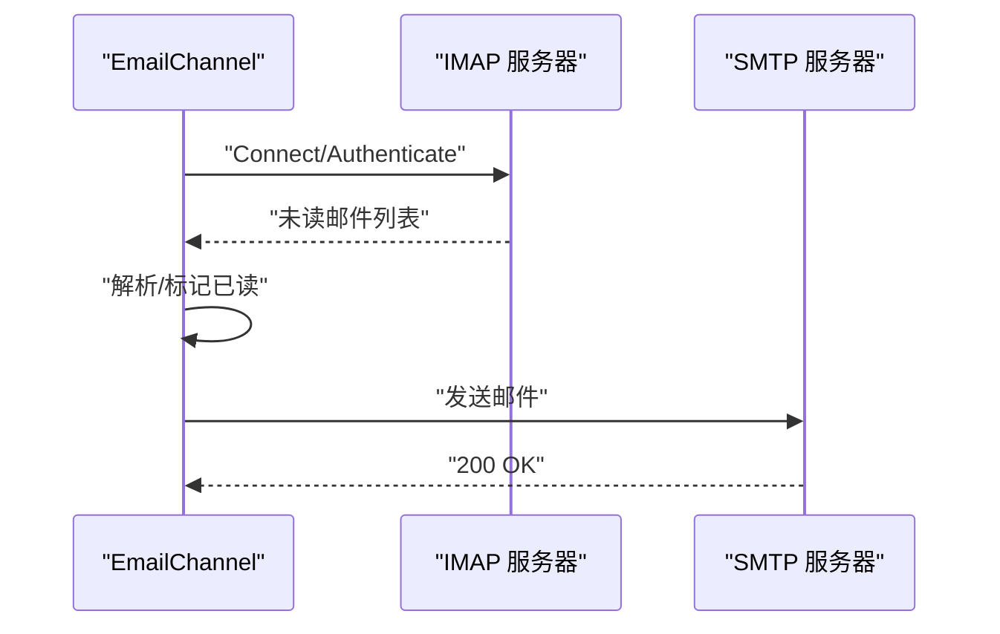

图表来源
- [EmailChannel.cs:30-55](file://src/OpenClaw.Channels/EmailChannel.cs#L30-L55)
- [EmailChannel.cs:112-159](file://src/OpenClaw.Channels/EmailChannel.cs#L112-L159)
- [EmailChannel.cs:57-85](file://src/OpenClaw.Channels/EmailChannel.cs#L57-L85)

章节来源
- [EmailChannel.cs:15-24](file://src/OpenClaw.Channels/EmailChannel.cs#L15-L24)
- [EmailChannel.cs:30-55](file://src/OpenClaw.Channels/EmailChannel.cs#L30-L55)
- [EmailChannel.cs:112-159](file://src/OpenClaw.Channels/EmailChannel.cs#L112-L159)

### Cron 通道
- 用途
  - 默认的定时任务输出通道，将结果写入内存目录并记录摘要
- 行为
  - 自动生成安全文件名；追加 UTF-8 文本

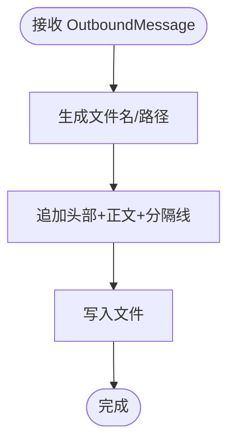

图表来源
- [CronChannel.cs:32-56](file://src/OpenClaw.Channels/CronChannel.cs#L32-L56)

章节来源
- [CronChannel.cs:9-28](file://src/OpenClaw.Channels/CronChannel.cs#L9-L28)
- [CronChannel.cs:32-56](file://src/OpenClaw.Channels/CronChannel.cs#L32-L56)

### DingTalk 通道
- 认证与发送
  - 使用 AppKey/AppSecret 获取 access_token；支持会话级 webhook 与普通消息发送
  - 媒体上传支持图片与文件；文本长度限制 8000 字节
- 接收与解析
  - 通过 Stream WebSocket 接收事件，支持去重、白名单、@提及过滤
  - 支持会话级 webhook 缓存与自动刷新
- 限制与注意事项
  - 支持热重载配置并自动重启；媒体下载至临时目录

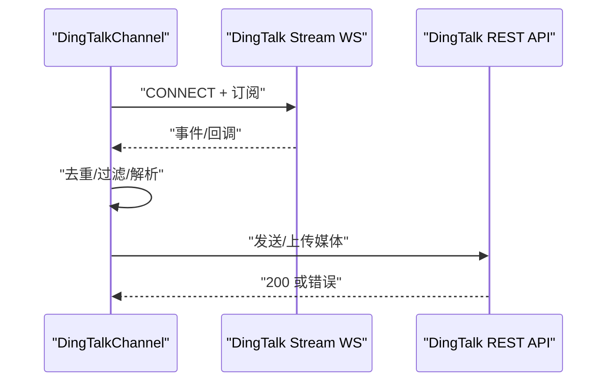

图表来源
- [DingTalkChannel.cs:169-210](file://src/OpenClaw.Channels/DingTalkChannel.cs#L169-L210)
- [DingTalkChannel.cs:278-316](file://src/OpenClaw.Channels/DingTalkChannel.cs#L278-L316)
- [DingTalkChannel.cs:584-638](file://src/OpenClaw.Channels/DingTalkChannel.cs#L584-L638)

章节来源
- [DingTalkChannel.cs:18-66](file://src/OpenClaw.Channels/DingTalkChannel.cs#L18-L66)
- [DingTalkChannel.cs:169-210](file://src/OpenClaw.Channels/DingTalkChannel.cs#L169-L210)
- [DingTalkChannel.cs:278-316](file://src/OpenClaw.Channels/DingTalkChannel.cs#L278-L316)

### Feishu 通道
- 认证与发送
  - 使用 AppId/AppSecret 获取应用级 access_token；支持二进制 pbbp2 协议 WebSocket
  - 媒体下载支持图片/文件/音频/视频/富文本图片
- 接收与解析
  - 通过 WebSocket 接收 im.message.receive_v1 事件，两层去重（内存+磁盘）
  - 支持 @提及过滤与群组策略
- 限制与注意事项
  - 心跳保活；媒体下载到本地临时目录；支持热重载配置

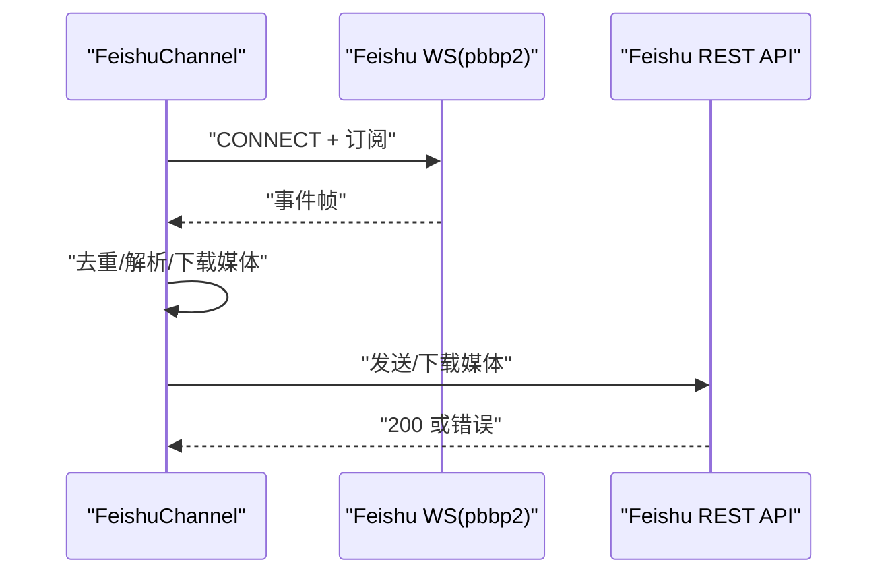

图表来源
- [FeishuChannel.cs:213-262](file://src/OpenClaw.Channels/FeishuChannel.cs#L213-L262)
- [FeishuChannel.cs:341-402](file://src/OpenClaw.Channels/FeishuChannel.cs#L341-L402)
- [FeishuChannel.cs:448-607](file://src/OpenClaw.Channels/FeishuChannel.cs#L448-L607)

章节来源
- [FeishuChannel.cs:15-68](file://src/OpenClaw.Channels/FeishuChannel.cs#L15-L68)
- [FeishuChannel.cs:213-262](file://src/OpenClaw.Channels/FeishuChannel.cs#L213-L262)
- [FeishuChannel.cs:448-607](file://src/OpenClaw.Channels/FeishuChannel.cs#L448-L607)

### WeCom 通道
- 认证与发送
  - WebSocket 长连接接收消息；支持 24 小时内 WebSocket 快速回复
  - 媒体下载支持图片/文件/语音/视频；REST API 发送文本与媒体
- 接收与解析
  - 解析 mixed/纯文本消息；@提及提取；群组策略与白名单过滤
  - 去重与上下文缓存（req_id、时间戳）
- 限制与注意事项
  - 需配置 CorpId/AgentId/CorpSecret；媒体下载依赖 REST API

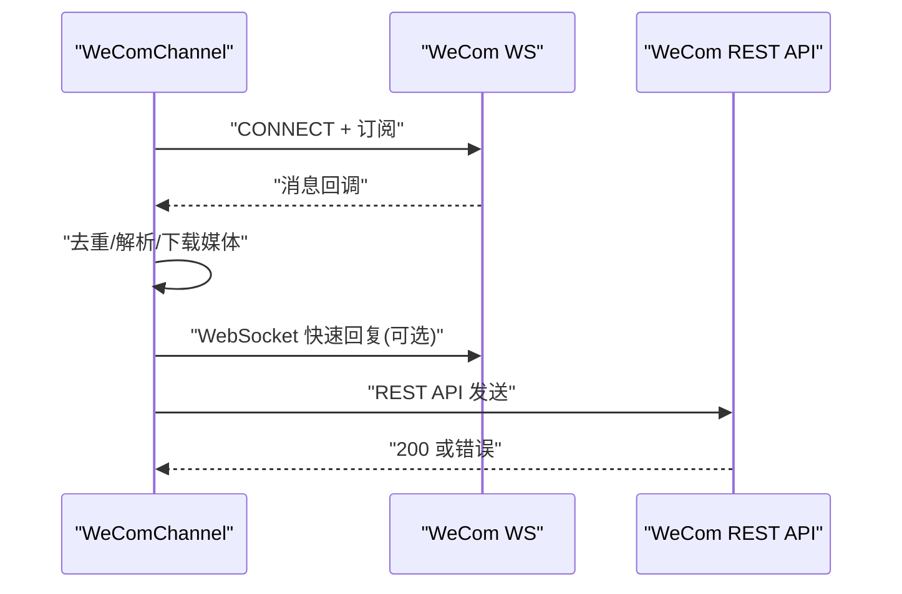

图表来源
- [WeComChannel.cs:207-255](file://src/OpenClaw.Channels/WeComChannel.cs#L207-L255)
- [WeComChannel.cs:379-503](file://src/OpenClaw.Channels/WeComChannel.cs#L379-L503)
- [WeComChannel.cs:744-800](file://src/OpenClaw.Channels/WeComChannel.cs#L744-L800)

章节来源
- [WeComChannel.cs:15-92](file://src/OpenClaw.Channels/WeComChannel.cs#L15-L92)
- [WeComChannel.cs:207-255](file://src/OpenClaw.Channels/WeComChannel.cs#L207-L255)
- [WeComChannel.cs:379-503](file://src/OpenClaw.Channels/WeComChannel.cs#L379-L503)

### Twilio SMS 通道
- 认证与发送
  - 通过 TwilioSmsClient 发送短信；支持联系人白名单与 DoNotText 过滤
- 接收与解析
  - 通过网关接收 inbound 消息并派发给 OnMessageReceived
- 限制与注意事项
  - 仅允许配置的 E.164 号码；需提供认证令牌

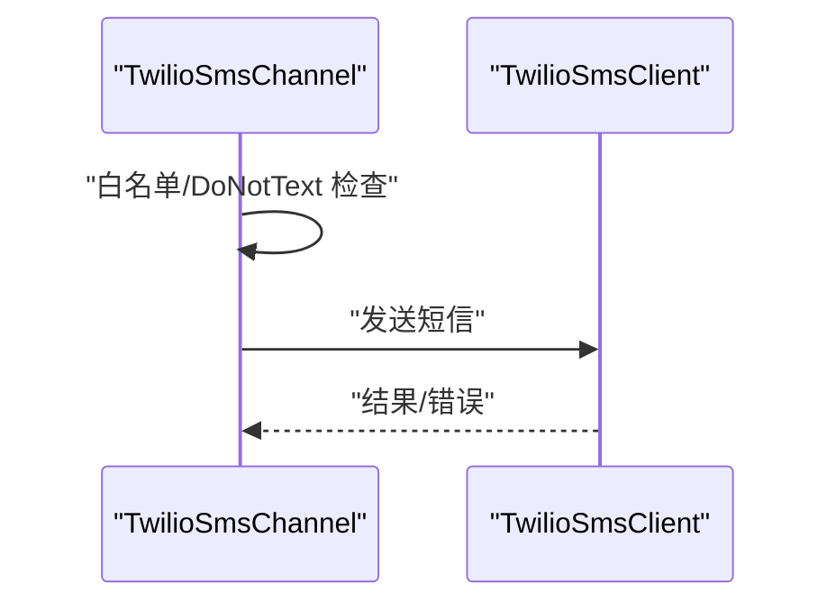

图表来源
- [TwilioSmsChannel.cs:27-40](file://src/OpenClaw.Channels/TwilioSmsChannel.cs#L27-L40)
- [TwilioSmsClient.cs](file://src/OpenClaw.Channels/TwilioSmsClient.cs)

章节来源
- [TwilioSmsChannel.cs:8-19](file://src/OpenClaw.Channels/TwilioSmsChannel.cs#L8-L19)
- [TwilioSmsChannel.cs:27-40](file://src/OpenClaw.Channels/TwilioSmsChannel.cs#L27-L40)

## 依赖关系分析
- 低耦合高内聚：各通道独立实现 IChannelAdapter，内部依赖统一的配置、HTTP 工厂与安全解析器
- 可重启通道：DingTalk、Feishu、WeCom 实现 IRestartableChannelAdapter，支持运行时热重载
- 媒体标记协议：统一的媒体标记语法贯穿所有通道，便于跨渠道一致的媒体处理

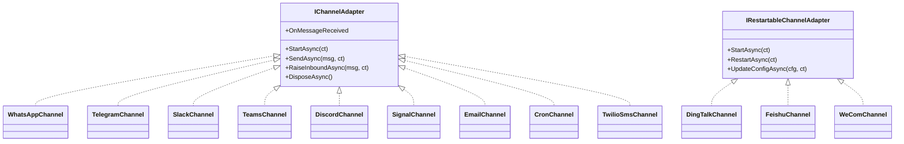

图表来源
- [IChannelAdapter.cs](file://src/OpenClaw.Core/Abstractions/IChannelAdapter.cs)
- [IRestartableChannelAdapter.cs](file://src/OpenClaw.Core/Abstractions/IRestartableChannelAdapter.cs)
- [WhatsAppChannel.cs](file://src/OpenClaw.Channels/WhatsAppChannel.cs#L14)
- [TelegramChannel.cs](file://src/OpenClaw.Channels/TelegramChannel.cs#L18)
- [SlackChannel.cs](file://src/OpenClaw.Channels/SlackChannel.cs#L19)
- [TeamsChannel.cs](file://src/OpenClaw.Channels/TeamsChannel.cs#L21)
- [DiscordChannel.cs](file://src/OpenClaw.Channels/DiscordChannel.cs#L21)
- [SignalChannel.cs](file://src/OpenClaw.Channels/SignalChannel.cs#L17)
- [EmailChannel.cs](file://src/OpenClaw.Channels/EmailChannel.cs#L15)
- [CronChannel.cs](file://src/OpenClaw.Channels/CronChannel.cs#L13)
- [DingTalkChannel.cs](file://src/OpenClaw.Channels/DingTalkChannel.cs#L24)
- [FeishuChannel.cs](file://src/OpenClaw.Channels/FeishuChannel.cs#L21)
- [WeComChannel.cs](file://src/OpenClaw.Channels/WeComChannel.cs#L21)
- [TwilioSmsChannel.cs](file://src/OpenClaw.Channels/TwilioSmsChannel.cs#L8)

章节来源
- [OpenClaw.Channels.csproj:6-12](file://src/OpenClaw.Channels/OpenClaw.Channels.csproj#L6-L12)

## 性能考虑
- 连接池与复用
  - 通道尽量复用 HttpClient，减少连接开销
- 速率限制与退避
  - Slack/Teams/Discord/Email 等均内置退避与重试逻辑
- 媒体处理
  - 优先使用会话级 webhook 或本地临时文件，减少重复下载
- 分片与截断
  - Telegram/Teams/DingTalk/Feishu 等对长文本进行分片或截断，避免 API 限制
- 去重与幂等
  - 多通道采用内存/磁盘双重去重，降低重复处理成本

## 故障排除指南
- 通用问题
  - 配置缺失：检查各渠道的 AppId/Token/BotToken/账号等是否正确配置
  - 密钥解析：确认 SecretResolver 能从引用或环境变量解析到真实值
  - 网络与证书：确保可访问对应 API 域名，TLS/SSL 正确
- 渠道特定
  - WhatsApp：确认 PhoneNumberId 与 API Token；媒体 URL 必须为 http(s) 绝对地址
  - Telegram：检查 chat_id 格式（数字或 @username）；注意 4096/1024 字符限制
  - Slack：关注 429 与 ok=false 错误；必要时调整速率
  - Teams：先收到消息再发送；检查 AppId/AppPassword/TenantId
  - Discord：启用消息内容意图；检查频道/公会/用户白名单
  - Signal：确认 signald/signal-cli 服务可用；仅处理私聊
  - Email：IMAP/SMTP 凭据正确；轮询间隔合理
  - DingTalk/Feishu/WeCom：检查 WebSocket 连接与心跳；媒体下载权限
  - Twilio：号码白名单与 DoNotText 策略

章节来源
- [WhatsAppChannel.cs:27-31](file://src/OpenClaw.Channels/WhatsAppChannel.cs#L27-L31)
- [TelegramChannel.cs:58-62](file://src/OpenClaw.Channels/TelegramChannel.cs#L58-L62)
- [SlackChannel.cs:66-83](file://src/OpenClaw.Channels/SlackChannel.cs#L66-L83)
- [TeamsChannel.cs:46-52](file://src/OpenClaw.Channels/TeamsChannel.cs#L46-L52)
- [DiscordChannel.cs:253-257](file://src/OpenClaw.Channels/DiscordChannel.cs#L253-L257)
- [SignalChannel.cs:31-33](file://src/OpenClaw.Channels/SignalChannel.cs#L31-L33)
- [EmailChannel.cs:89-95](file://src/OpenClaw.Channels/EmailChannel.cs#L89-L95)
- [DingTalkChannel.cs:157-165](file://src/OpenClaw.Channels/DingTalkChannel.cs#L157-L165)
- [FeishuChannel.cs:201-209](file://src/OpenClaw.Channels/FeishuChannel.cs#L201-L209)
- [WeComChannel.cs:187-195](file://src/OpenClaw.Channels/WeComChannel.cs#L187-L195)
- [TwilioSmsChannel.cs:30-36](file://src/OpenClaw.Channels/TwilioSmsChannel.cs#L30-L36)

## 结论
本消息通道体系通过统一的适配器接口与可重启能力，实现了对主流即时通讯平台的一致接入。借助媒体标记协议与去重、限流、白名单等策略，系统在保证稳定性的同时具备良好的扩展性与可观测性。建议在生产环境中结合各渠道的 API 限制与网络条件，合理配置速率、分片与缓存策略，并完善监控与告警。

## 附录
- 配置参考
  - 各渠道配置项集中在核心模型中，包含认证参数、行为开关与策略参数
  - 可通过 SecretResolver 引用环境变量或密钥存储
- 文档与示例
  - 各渠道部署与配置文档详见 docs 目录

章节来源
- [KingcrabChannelConfigs.cs](file://src/OpenClaw.Core/Models/KingcrabChannelConfigs.cs)
- [SecretResolver.cs](file://src/OpenClaw.Core/Security/SecretResolver.cs)
- [README.md](file://README.md)
- [WHATSAPP_SETUP.md](file://docs/WHATSAPP_SETUP.md)
- [TEAMS_SETUP.md](file://docs/TEAMS_SETUP.md)