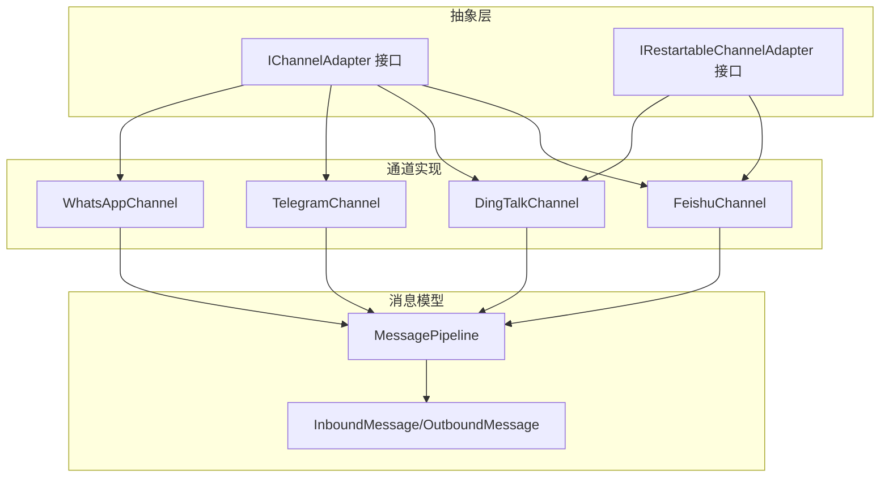
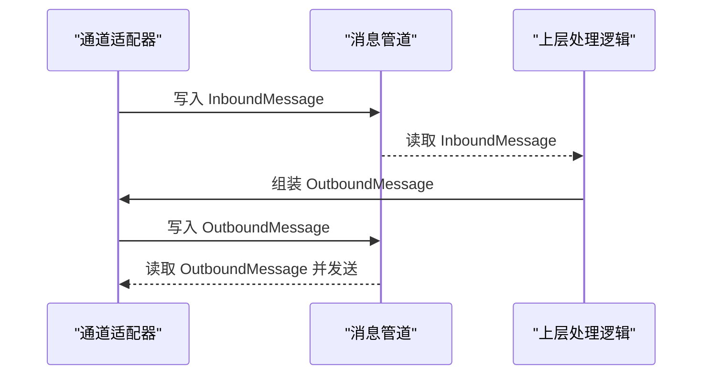
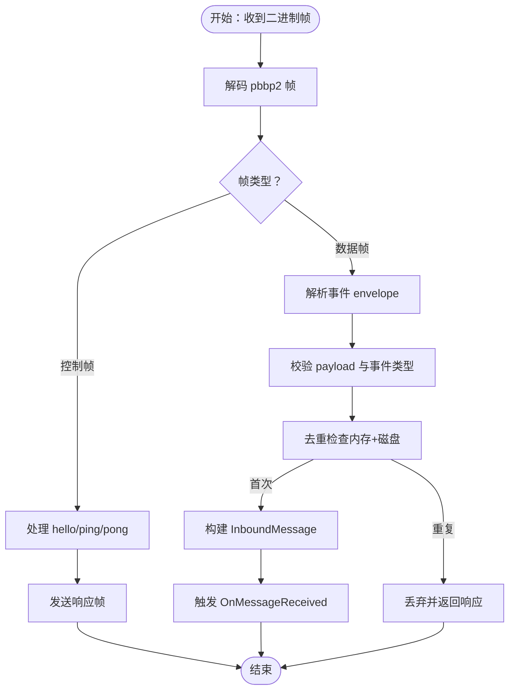
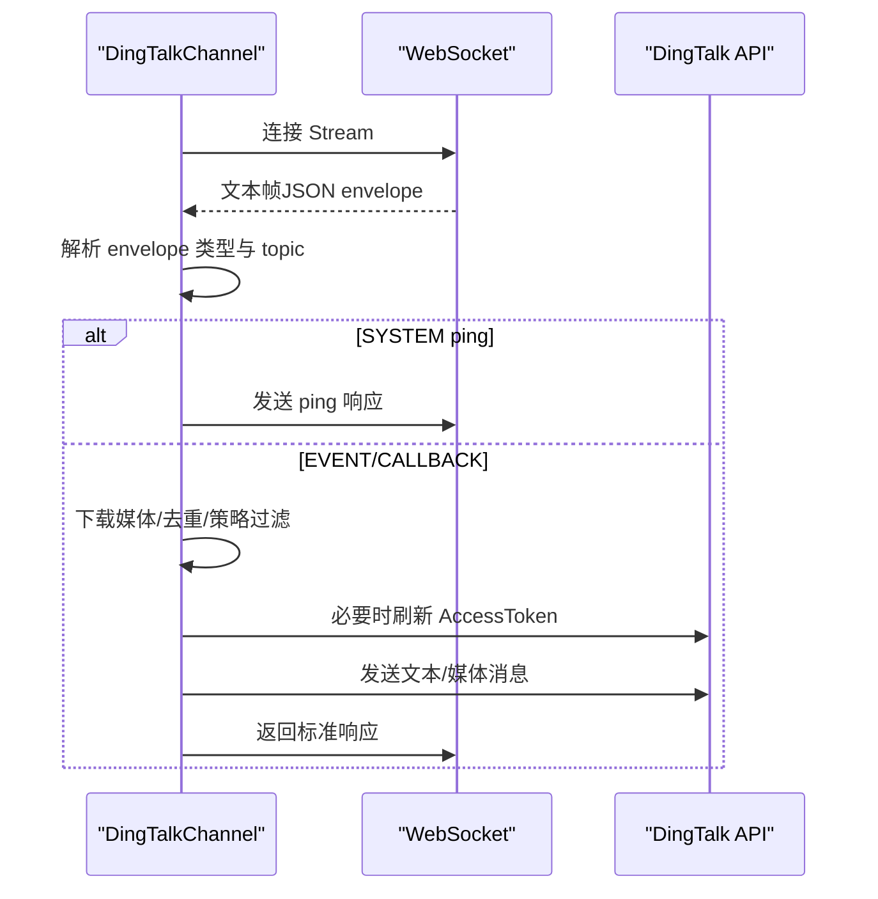
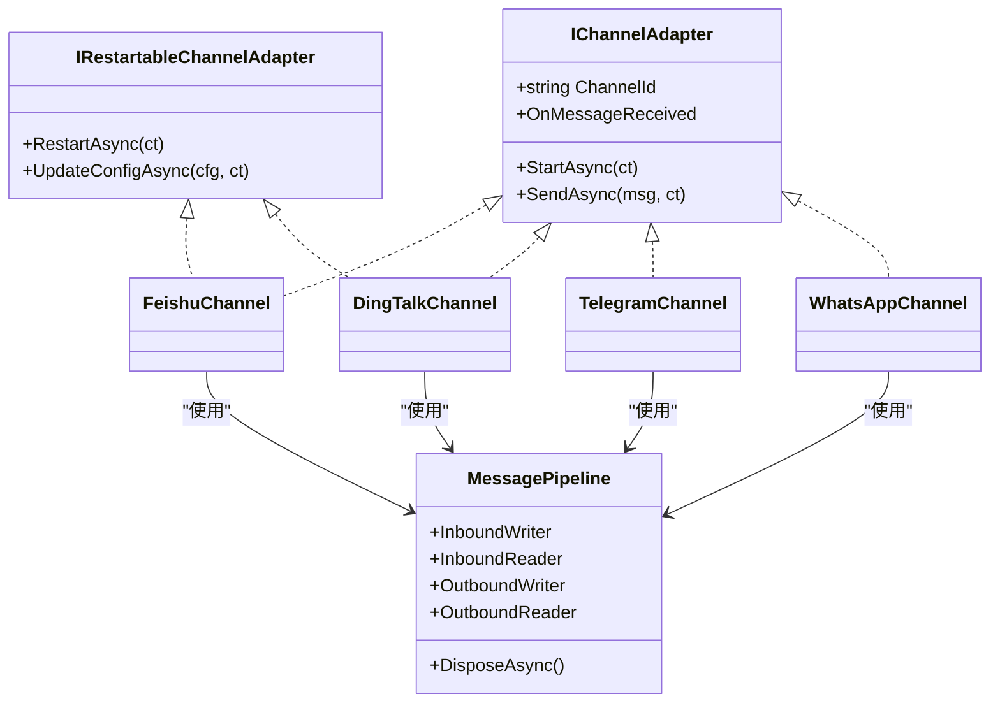

# 通道服务层

<cite>
**本文档引用的文件**
- [IChannelAdapter.cs](file://src/OpenClaw.Core/Abstractions/IChannelAdapter.cs)
- [IRestartableChannelAdapter.cs](file://src/OpenClaw.Core/Abstractions/IRestartableChannelAdapter.cs)
- [MessagePipeline.cs](file://src/OpenClaw.Core/Pipeline/MessagePipeline.cs)
- [Messages.cs](file://src/OpenClaw.Core/Models/Messages.cs)
- [KingcrabChannelConfigs.cs](file://src/OpenClaw.Core/Models/KingcrabChannelConfigs.cs)
- [FeishuChannel.cs](file://src/OpenClaw.Channels/FeishuChannel.cs)
- [DingTalkChannel.cs](file://src/OpenClaw.Channels/DingTalkChannel.cs)
- [TelegramChannel.cs](file://src/OpenClaw.Channels/TelegramChannel.cs)
- [WhatsAppChannel.cs](file://src/OpenClaw.Channels/WhatsAppChannel.cs)
</cite>

## 目录
1. [简介](#简介)
2. [项目结构](#项目结构)
3. [核心组件](#核心组件)
4. [架构总览](#架构总览)
5. [详细组件分析](#详细组件分析)
6. [依赖关系分析](#依赖关系分析)
7. [性能考量](#性能考量)
8. [故障排查指南](#故障排查指南)
9. [结论](#结论)

## 简介
本文件面向 OpenClaw.NET 的通道服务层，系统性阐述通道适配器的注册机制、消息路由与状态管理；解释不同通信渠道的适配原理、消息转换与协议处理；文档化通道配置选项、连接管理与故障恢复机制，并提供通道服务架构图与消息处理流程图，帮助开发者快速理解并扩展新的通道适配器。

## 项目结构
通道服务层由“抽象接口层 + 具体通道实现 + 核心消息管道”三部分组成：
- 抽象接口层：定义通道适配器统一契约，支持可重启能力与事件驱动的消息收发。
- 具体通道实现：覆盖飞书、钉钉、电报、WhatsApp 等主流渠道，分别采用 WebSocket 长连或 HTTP Webhook 方式接入。
- 核心消息管道：基于有界通道的高性能消息管线，负责入站/出站消息的背压与生命周期管理。

图表来源
- [IChannelAdapter.cs:1-22](file://src/OpenClaw.Core/Abstractions/IChannelAdapter.cs#L1-L22)
- [IRestartableChannelAdapter.cs](file://src/OpenClaw.Core/Abstractions/IRestartableChannelAdapter.cs)
- [MessagePipeline.cs:1-56](file://src/OpenClaw.Core/Pipeline/MessagePipeline.cs#L1-L56)
- [Messages.cs:1-62](file://src/OpenClaw.Core/Models/Messages.cs#L1-L62)
- [FeishuChannel.cs:1-800](file://src/OpenClaw.Channels/FeishuChannel.cs#L1-L800)
- [DingTalkChannel.cs:1-800](file://src/OpenClaw.Channels/DingTalkChannel.cs#L1-L800)
- [TelegramChannel.cs:1-338](file://src/OpenClaw.Channels/TelegramChannel.cs#L1-L338)
- [WhatsAppChannel.cs:1-320](file://src/OpenClaw.Channels/WhatsAppChannel.cs#L1-L320)

章节来源
- [IChannelAdapter.cs:1-22](file://src/OpenClaw.Core/Abstractions/IChannelAdapter.cs#L1-L22)
- [MessagePipeline.cs:1-56](file://src/OpenClaw.Core/Pipeline/MessagePipeline.cs#L1-L56)
- [Messages.cs:1-62](file://src/OpenClaw.Core/Models/Messages.cs#L1-L62)

## 核心组件
- 通道适配器接口族
  - IChannelAdapter：定义通道标识、启动、发送与入站事件回调。
  - IRestartableChannelAdapter：扩展可热重启能力，支持运行时配置更新后自动重连。
- 消息模型
  - InboundMessage：标准化入站消息字段，含渠道标识、发件人、会话上下文、媒体信息等。
  - OutboundMessage：标准化出站消息字段，含目标接收者、回复引用消息等。
- 消息管道
  - 基于 System.Threading.Channels 的有界通道，支持背压与优雅关闭，避免高负载下的内存溢出。

章节来源
- [IChannelAdapter.cs:9-22](file://src/OpenClaw.Core/Abstractions/IChannelAdapter.cs#L9-L22)
- [IRestartableChannelAdapter.cs](file://src/OpenClaw.Core/Abstractions/IRestartableChannelAdapter.cs)
- [Messages.cs:6-45](file://src/OpenClaw.Core/Models/Messages.cs#L6-L45)
- [Messages.cs:50-62](file://src/OpenClaw.Core/Models/Messages.cs#L50-L62)
- [MessagePipeline.cs:11-56](file://src/OpenClaw.Core/Pipeline/MessagePipeline.cs#L11-L56)

## 架构总览
通道服务层通过统一接口屏蔽不同渠道的差异，使用消息管道进行解耦，实现“适配器 + 管道 + 路由”的分层设计。所有入站消息经由各通道解析后统一进入入站通道，再由上层工作流处理；出站消息则由上层组装并通过对应通道适配器发送。

图表来源
- [MessagePipeline.cs:11-34](file://src/OpenClaw.Core/Pipeline/MessagePipeline.cs#L11-L34)
- [FeishuChannel.cs:605-607](file://src/OpenClaw.Channels/FeishuChannel.cs#L605-L607)
- [DingTalkChannel.cs:452-456](file://src/OpenClaw.Channels/DingTalkChannel.cs#L452-L456)

## 详细组件分析

### 通道适配器注册机制
- 统一入口
  - 各通道实现 IChannelAdapter；若具备热重启能力则实现 IRestartableChannelAdapter。
  - 通过依赖注入容器注册具体通道实例，结合配置文件启用/禁用与参数化。
- 运行时配置
  - 可通过 UpdateConfigAsync 应用内存级配置覆盖并在不中断服务的情况下触发 RestartAsync。
  - 配置项包括凭证解析（支持环境变量引用）、策略开关（群组策略、@提及过滤）、媒体暴露策略等。

章节来源
- [IChannelAdapter.cs:9-22](file://src/OpenClaw.Core/Abstractions/IChannelAdapter.cs#L9-L22)
- [IRestartableChannelAdapter.cs](file://src/OpenClaw.Core/Abstractions/IRestartableChannelAdapter.cs)
- [FeishuChannel.cs:117-122](file://src/OpenClaw.Channels/FeishuChannel.cs#L117-L122)
- [DingTalkChannel.cs:76-81](file://src/OpenClaw.Channels/DingTalkChannel.cs#L76-L81)

### 消息路由与状态管理
- 入站路由
  - 通道内部解析平台事件/回调，构造 InboundMessage 并通过 OnMessageReceived 事件上报至消息管道。
  - 支持去重（内存+持久化）、@提及门控、群组白名单/禁用策略、最大字符截断等。
- 出站路由
  - 上层根据会话/自动化上下文生成 OutboundMessage，写入出站通道后由对应通道适配器完成发送。
  - 对媒体标记（如图片/文件路径）进行拆解与上传，确保下游工具可直接访问资源。

章节来源
- [FeishuChannel.cs:448-607](file://src/OpenClaw.Channels/FeishuChannel.cs#L448-L607)
- [DingTalkChannel.cs:318-456](file://src/OpenClaw.Channels/DingTalkChannel.cs#L318-L456)
- [Messages.cs:6-45](file://src/OpenClaw.Core/Models/Messages.cs#L6-L45)
- [Messages.cs:50-62](file://src/OpenClaw.Core/Models/Messages.cs#L50-L62)

### 适配原理与协议处理

#### 飞书（Feishu）
- 适配原理
  - 使用 WebSocket 长连接接收事件，REST API 发送消息；支持文本、图片、文件、音频、视频等。
  - 采用二进制帧协议（pbbp2），心跳保活，服务端 ping/pong 协议要求严格。
- 消息转换
  - 将平台事件解析为 InboundMessage，必要时下载媒体到本地临时文件并以标记形式回填文本。
  - 支持富文本帖子（post）内图片批量下载。
- 协议处理
  - 控制帧处理：hello/ping/pong；数据帧处理：事件 envelope 解析与响应。
  - 去重策略：内存 TTL（5 分钟）+ 磁盘持久化（24 小时），基于 message_id 稳定去重。

图表来源
- [FeishuChannel.cs:294-411](file://src/OpenClaw.Channels/FeishuChannel.cs#L294-L411)
- [FeishuChannel.cs:415-446](file://src/OpenClaw.Channels/FeishuChannel.cs#L415-L446)
- [FeishuChannel.cs:448-607](file://src/OpenClaw.Channels/FeishuChannel.cs#L448-L607)

章节来源
- [FeishuChannel.cs:21-800](file://src/OpenClaw.Channels/FeishuChannel.cs#L21-L800)

#### 钉钉（DingTalk）
- 适配原理
  - 使用官方 Stream 模式（WebSocket）接收事件，无需公网 Webhook；支持文本、图片、文件、音频、视频。
  - 通过会话级 webhook 缓存实现更高效的回复路径。
- 消息转换
  - 解析回调数据，合并文本与媒体标记；对回复消息提取 ReplyToMessageId。
  - 媒体下载与上传：支持从本地路径或 URL 获取字节，上传为钉钉媒体并发送。
- 协议处理
  - 流式 envelope 类型识别：SYSTEM（心跳）、EVENT（事件）、CALLBACK（回调）。
  - 响应封装：按消息 ID 返回标准响应结构。

图表来源
- [DingTalkChannel.cs:169-210](file://src/OpenClaw.Channels/DingTalkChannel.cs#L169-L210)
- [DingTalkChannel.cs:278-316](file://src/OpenClaw.Channels/DingTalkChannel.cs#L278-L316)
- [DingTalkChannel.cs:318-456](file://src/OpenClaw.Channels/DingTalkChannel.cs#L318-L456)
- [DingTalkChannel.cs:584-740](file://src/OpenClaw.Channels/DingTalkChannel.cs#L584-L740)

章节来源
- [DingTalkChannel.cs:24-800](file://src/OpenClaw.Channels/DingTalkChannel.cs#L24-L800)

#### 电报（Telegram）
- 适配原理
  - 通过 HTTP Webhook 接收入站消息，适配器本身不维护长连接。
  - 发送采用 Bot API，支持文本分片与媒体发送（图片/视频/音频/文档/贴纸）。
- 消息转换
  - 将媒体标记转换为 Telegram API 请求参数，支持 caption 与分段发送。
  - 对回复消息 ID 进行数值校验与忽略无效值。

章节来源
- [TelegramChannel.cs:18-338](file://src/OpenClaw.Channels/TelegramChannel.cs#L18-L338)

#### WhatsApp
- 适配原理
  - 使用官方 Business Cloud API，通过 HTTP 发送消息；支持文本与多种媒体类型。
- 消息转换
  - 将媒体标记映射为 WhatsApp 支持的媒体类型（image/video/audio/document/sticker），限制单条消息最多一个媒体附件。
  - 支持 caption 与文件名设置。

章节来源
- [WhatsAppChannel.cs:14-320](file://src/OpenClaw.Channels/WhatsAppChannel.cs#L14-L320)

### 通道配置选项与连接管理

#### 飞书（Feishu）
- 启用开关、凭证解析（AppId/AppSecret）、群组策略（open/allowlist/disabled）、@提及门控、媒体 URL 暴露、最大入站字符数等。
- 支持配置热重载：UpdateConfigAsync 触发 RestartAsync 自动重连。

章节来源
- [KingcrabChannelConfigs.cs:13-52](file://src/OpenClaw.Core/Models/KingcrabChannelConfigs.cs#L13-L52)
- [FeishuChannel.cs:117-122](file://src/OpenClaw.Channels/FeishuChannel.cs#L117-L122)

#### 钉钉（DingTalk）
- 启用开关、凭证解析（AppKey/AppSecret/AppId）、群组策略、@提及门控、媒体 URL 暴露、最大入站字符数、轮询间隔等。
- 支持配置热重载与会话级 webhook 缓存。

章节来源
- [KingcrabChannelConfigs.cs:54-78](file://src/OpenClaw.Core/Models/KingcrabChannelConfigs.cs#L54-L78)
- [DingTalkChannel.cs:76-81](file://src/OpenClaw.Channels/DingTalkChannel.cs#L76-L81)

#### 电报（Telegram）
- 机器人令牌解析、聊天 ID 校验、回复消息 ID 数值化、文本/caption 截断限制。

章节来源
- [TelegramChannel.cs:29-44](file://src/OpenClaw.Channels/TelegramChannel.cs#L29-L44)

#### WhatsApp
- 云 API 令牌解析、手机号 ID 配置、媒体链接必须为 http(s) 绝对地址。

章节来源
- [WhatsAppChannel.cs:21-31](file://src/OpenClaw.Channels/WhatsAppChannel.cs#L21-L31)

### 故障恢复机制
- 连接失败与重连
  - 通道实现内置指数退避重连策略，异常退出后自动等待一段时间再次尝试。
- 令牌与凭据失效
  - 通道在发送前检查令牌有效期，必要时刷新；热重启后清理缓存并重新获取。
- 去重与幂等
  - 飞书：内存 TTL + 磁盘持久化双重去重；钉钉：内存去重表（TTL/容量限制）。
- 管道安全关闭
  - 消息管道在释放时尝试清空剩余消息并记录丢弃数量，避免资源泄漏。

章节来源
- [FeishuChannel.cs:213-262](file://src/OpenClaw.Channels/FeishuChannel.cs#L213-L262)
- [FeishuChannel.cs:149-193](file://src/OpenClaw.Channels/FeishuChannel.cs#L149-L193)
- [DingTalkChannel.cs:169-210](file://src/OpenClaw.Channels/DingTalkChannel.cs#L169-L210)
- [DingTalkChannel.cs:105-148](file://src/OpenClaw.Channels/DingTalkChannel.cs#L105-L148)
- [MessagePipeline.cs:35-54](file://src/OpenClaw.Core/Pipeline/MessagePipeline.cs#L35-L54)

## 依赖关系分析
- 低耦合高内聚
  - 通道适配器仅依赖抽象接口与通用模型，不直接依赖上层业务逻辑。
- 外部依赖
  - HTTP 客户端工厂、凭证解析器、JSON 序列化上下文、系统通道库。
- 生命周期
  - 通道适配器与消息管道均实现异步释放接口，确保资源正确回收。

图表来源
- [IChannelAdapter.cs:9-22](file://src/OpenClaw.Core/Abstractions/IChannelAdapter.cs#L9-L22)
- [IRestartableChannelAdapter.cs](file://src/OpenClaw.Core/Abstractions/IRestartableChannelAdapter.cs)
- [MessagePipeline.cs:11-34](file://src/OpenClaw.Core/Pipeline/MessagePipeline.cs#L11-L34)
- [FeishuChannel.cs:21-800](file://src/OpenClaw.Channels/FeishuChannel.cs#L21-L800)
- [DingTalkChannel.cs:24-800](file://src/OpenClaw.Channels/DingTalkChannel.cs#L24-L800)
- [TelegramChannel.cs:18-338](file://src/OpenClaw.Channels/TelegramChannel.cs#L18-L338)
- [WhatsAppChannel.cs:14-320](file://src/OpenClaw.Channels/WhatsAppChannel.cs#L14-L320)

## 性能考量
- 有界通道与背压
  - 通过有界通道限制缓冲区大小，防止突发流量导致 OOM；FullMode 等待模式保障生产者/消费者平衡。
- 异步与零分配
  - 通道适配器广泛使用 ValueTask/ValueTask<T> 与异步 I/O，减少堆分配与 GC 压力。
- 媒体处理优化
  - 飞书/钉钉在入站侧将媒体下载到本地临时文件，便于后续工具直接访问，避免二次网络拉取。
- 令牌与去重
  - 令牌缓存与去重表降低重复请求与无效调用，提升吞吐。

章节来源
- [MessagePipeline.cs:17-28](file://src/OpenClaw.Core/Pipeline/MessagePipeline.cs#L17-L28)
- [FeishuChannel.cs:691-761](file://src/OpenClaw.Channels/FeishuChannel.cs#L691-L761)
- [DingTalkChannel.cs:744-782](file://src/OpenClaw.Channels/DingTalkChannel.cs#L744-L782)

## 故障排查指南
- 无法启动通道
  - 检查 Enabled 开关与凭证解析结果；确认网络可达与令牌有效。
- 频繁重连
  - 查看日志中的重连延迟与异常原因；核对平台限流与证书问题。
- 媒体发送失败
  - 飞书/钉钉需确保媒体键可用且未过期；电报/WhatsApp 需检查媒体 URL 有效性与大小限制。
- 去重误判
  - 飞书：确认磁盘持久化目录可写；钉钉：检查去重表容量与 TTL 设置。
- 管道积压
  - 提升容量或优化上层处理速度；关注背压日志与丢弃计数。

章节来源
- [FeishuChannel.cs:195-209](file://src/OpenClaw.Channels/FeishuChannel.cs#L195-L209)
- [DingTalkChannel.cs:150-165](file://src/OpenClaw.Channels/DingTalkChannel.cs#L150-L165)
- [TelegramChannel.cs:54-124](file://src/OpenClaw.Channels/TelegramChannel.cs#L54-L124)
- [WhatsAppChannel.cs:40-70](file://src/OpenClaw.Channels/WhatsAppChannel.cs#L40-L70)
- [MessagePipeline.cs:46-54](file://src/OpenClaw.Core/Pipeline/MessagePipeline.cs#L46-L54)

## 结论
通道服务层通过统一抽象与消息管道实现了跨渠道的一致性与高性能。飞书与钉钉采用长连接与流式协议，电报与 WhatsApp 采用 HTTP/Webhook，满足不同平台的接入约束。配合热重启、去重与令牌管理等机制，通道层在稳定性与可运维性方面表现良好。建议在新增通道时遵循现有接口与模式，确保一致的可观测性与故障恢复能力。