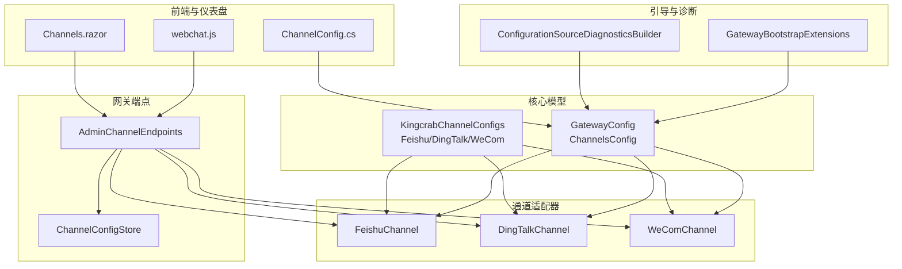
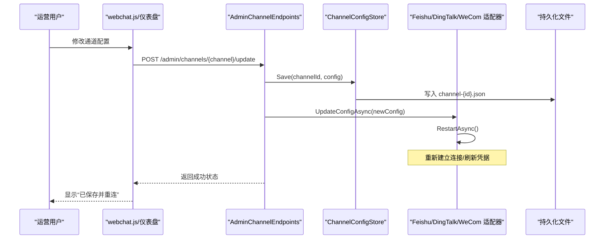
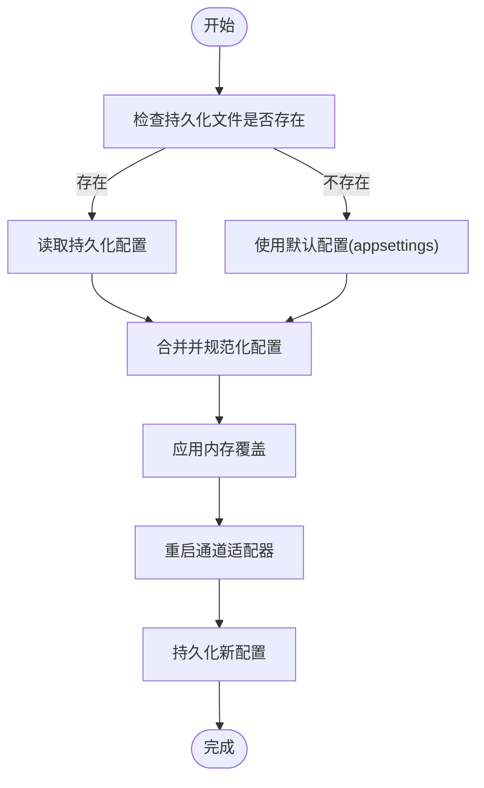
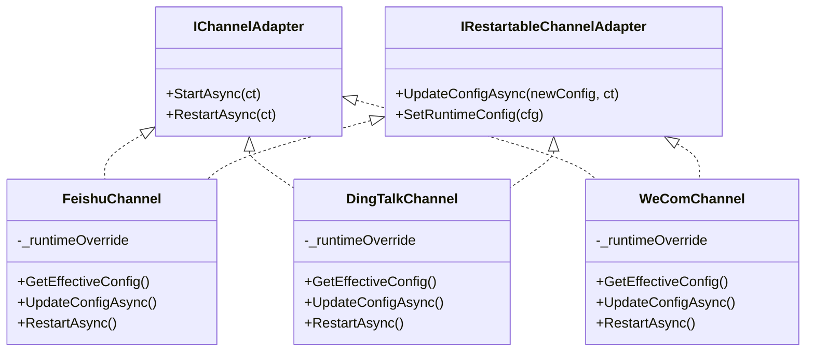
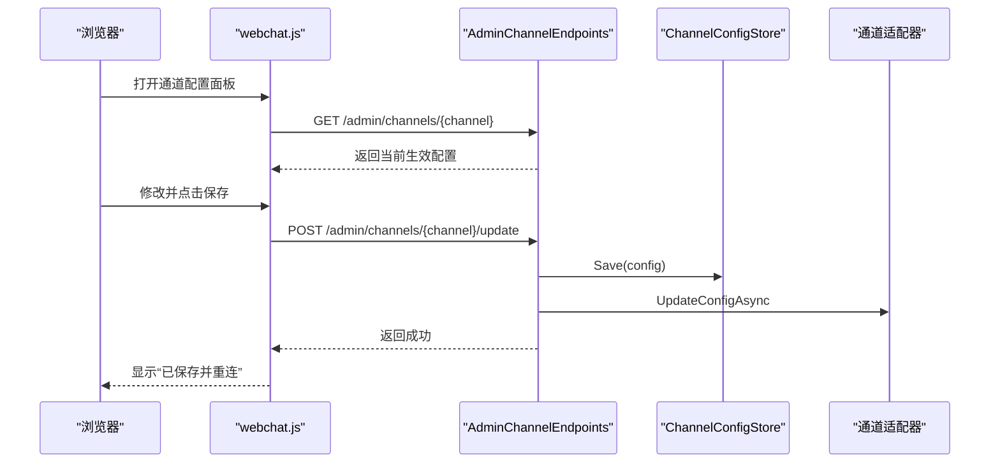
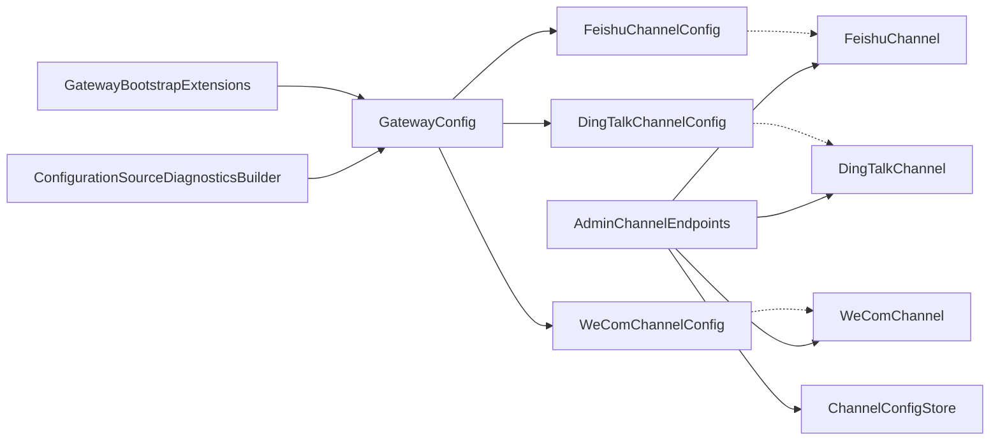

# 通道配置

<cite>
**本文档引用的文件**
- [KingcrabChannelConfigs.cs](file://src/OpenClaw.Core/Models/KingcrabChannelConfigs.cs)
- [GatewayConfig.cs](file://src/OpenClaw.Core/Models/GatewayConfig.cs)
- [FeishuChannel.cs](file://src/OpenClaw.Channels/FeishuChannel.cs)
- [DingTalkChannel.cs](file://src/OpenClaw.Channels/DingTalkChannel.cs)
- [WeComChannel.cs](file://src/OpenClaw.Channels/WeComChannel.cs)
- [AdminChannelEndpoints.cs](file://src/OpenClaw.Gateway/Endpoints/AdminChannelEndpoints.cs)
- [ChannelConfigStore.cs](file://src/OpenClaw.Gateway/Channels/ChannelConfigStore.cs)
- [GatewayBootstrapExtensions.cs](file://src/OpenClaw.Gateway/Bootstrap/GatewayBootstrapExtensions.cs)
- [ConfigurationSourceDiagnosticsBuilder.cs](file://src/OpenClaw.Gateway/Bootstrap/ConfigurationSourceDiagnosticsBuilder.cs)
- [ConfigValidator.cs](file://src/OpenClaw.Core/Validation/ConfigValidator.cs)
- [ChannelReadinessEvaluator.cs](file://src/OpenClaw.Gateway/ChannelReadinessEvaluator.cs)
- [webchat.js](file://src/OpenClaw.Gateway/wwwroot/webchat.js)
- [Channels.razor](file://src/OpenClaw.Dashboard/Pages/Channels.razor)
- [ChannelConfig.cs](file://src/OpenClaw.Dashboard/Models/ChannelConfig.cs)
- [GatewayConfigFile.cs](file://src/OpenClaw.Cli/SetupCommand.cs)
</cite>

## 目录
1. [简介](#简介)
2. [项目结构](#项目结构)
3. [核心组件](#核心组件)
4. [架构总览](#架构总览)
5. [详细组件分析](#详细组件分析)
6. [依赖关系分析](#依赖关系分析)
7. [性能考虑](#性能考虑)
8. [故障排除指南](#故障排除指南)
9. [结论](#结论)
10. [附录](#附录)

## 简介
本文件系统性地文档化了通道配置系统，涵盖数据模型、配置存储与动态更新机制、配置参数与验证规则、默认值设定、配置文件格式、环境变量替换以及热重载流程。重点面向运营与开发人员，提供可操作的最佳实践与常见问题排查方法。

## 项目结构
通道配置相关代码分布在以下模块：
- 核心模型层：定义通道配置数据模型与默认值
- 通道适配器层：实现各通道的生命周期与热重载
- 网关端点层：提供管理端点以读取/更新/回滚通道配置
- 存储层：将覆盖配置持久化到磁盘，确保重启后仍有效
- 引导与诊断层：负责配置文件加载、环境变量替换与来源诊断
- 前端与仪表盘：提供可视化配置界面与通道列表

图表来源
- [GatewayConfig.cs:534-548](file://src/OpenClaw.Core/Models/GatewayConfig.cs#L534-L548)
- [KingcrabChannelConfigs.cs:13-125](file://src/OpenClaw.Core/Models/KingcrabChannelConfigs.cs#L13-L125)
- [FeishuChannel.cs:21-76](file://src/OpenClaw.Channels/FeishuChannel.cs#L21-L76)
- [DingTalkChannel.cs:24-74](file://src/OpenClaw.Channels/DingTalkChannel.cs#L24-L74)
- [WeComChannel.cs:21-99](file://src/OpenClaw.Channels/WeComChannel.cs#L21-L99)
- [AdminChannelEndpoints.cs:18-137](file://src/OpenClaw.Gateway/Endpoints/AdminChannelEndpoints.cs#L18-L137)
- [ChannelConfigStore.cs:16-94](file://src/OpenClaw.Gateway/Channels/ChannelConfigStore.cs#L16-L94)
- [GatewayBootstrapExtensions.cs:173-217](file://src/OpenClaw.Gateway/Bootstrap/GatewayBootstrapExtensions.cs#L173-L217)
- [ConfigurationSourceDiagnosticsBuilder.cs:121-161](file://src/OpenClaw.Gateway/Bootstrap/ConfigurationSourceDiagnosticsBuilder.cs#L121-L161)
- [webchat.js:2129-2343](file://src/OpenClaw.Gateway/wwwroot/webchat.js#L2129-L2343)
- [Channels.razor:1-37](file://src/OpenClaw.Dashboard/Pages/Channels.razor#L1-L37)
- [ChannelConfig.cs:1-15](file://src/OpenClaw.Dashboard/Models/ChannelConfig.cs#L1-L15)

章节来源
- [GatewayConfig.cs:534-548](file://src/OpenClaw.Core/Models/GatewayConfig.cs#L534-L548)
- [KingcrabChannelConfigs.cs:13-125](file://src/OpenClaw.Core/Models/KingcrabChannelConfigs.cs#L13-L125)

## 核心组件
- 数据模型
  - 通道配置根对象 ChannelsConfig，包含各平台通道的子配置
  - Kingcrab 特定通道配置：FeishuChannelConfig、DingTalkChannelConfig、WeComChannelConfig
- 通道适配器
  - FeishuChannel、DingTalkChannel、WeComChannel 实现 IChannelAdapter 与 IRestartableChannelAdapter
  - 支持运行时覆盖配置与热重启
- 管理端点
  - AdminChannelEndpoints 提供统一的通道配置读取、更新与回滚接口
- 配置存储
  - ChannelConfigStore 将覆盖配置持久化到 {StoragePath}/channels/channel-{id}.json
- 引导与诊断
  - GatewayBootstrapExtensions 负责 --config 文件加载与环境变量替换
  - ConfigurationSourceDiagnosticsBuilder 描述配置来源与密钥解析

章节来源
- [AdminChannelEndpoints.cs:18-137](file://src/OpenClaw.Gateway/Endpoints/AdminChannelEndpoints.cs#L18-L137)
- [ChannelConfigStore.cs:16-94](file://src/OpenClaw.Gateway/Channels/ChannelConfigStore.cs#L16-L94)
- [GatewayBootstrapExtensions.cs:173-217](file://src/OpenClaw.Gateway/Bootstrap/GatewayBootstrapExtensions.cs#L173-L217)
- [ConfigurationSourceDiagnosticsBuilder.cs:121-161](file://src/OpenClaw.Gateway/Bootstrap/ConfigurationSourceDiagnosticsBuilder.cs#L121-L161)

## 架构总览
通道配置系统的控制流如下：

图表来源
- [AdminChannelEndpoints.cs:61-90](file://src/OpenClaw.Gateway/Endpoints/AdminChannelEndpoints.cs#L61-L90)
- [ChannelConfigStore.cs:58-72](file://src/OpenClaw.Gateway/Channels/ChannelConfigStore.cs#L58-L72)
- [FeishuChannel.cs:117-122](file://src/OpenClaw.Channels/FeishuChannel.cs#L117-L122)
- [DingTalkChannel.cs:76-81](file://src/OpenClaw.Channels/DingTalkChannel.cs#L76-L81)
- [WeComChannel.cs:105-109](file://src/OpenClaw.Channels/WeComChannel.cs#L105-L109)

## 详细组件分析

### 数据模型与默认值
- ChannelsConfig
  - 统一承载各通道配置，含 AllowlistSemantics 等通用策略
- Kingcrab 通道配置
  - FeishuChannelConfig：启用开关、AppId/AppSecret、分组策略、白名单、入站长度限制、@提及要求、媒体URL暴露等
  - DingTalkChannelConfig：启用开关、AppKey/AppSecret/AppId、机器人编码、分组策略、白名单、入站长度限制、@提及要求、媒体URL暴露、轮询间隔等
  - WeComChannelConfig：启用开关、智能机器人WS凭证、企业APi凭证、分组策略、白名单、入站长度限制、@提及要求等
- 默认值与约束
  - 各字段均有明确默认值与最小/最大限制，如 MaxInboundChars、StreamPollIntervalMs 等
  - 验证规则覆盖枚举取值范围、数值边界与依赖条件

章节来源
- [GatewayConfig.cs:534-548](file://src/OpenClaw.Core/Models/GatewayConfig.cs#L534-L548)
- [KingcrabChannelConfigs.cs:13-125](file://src/OpenClaw.Core/Models/KingcrabChannelConfigs.cs#L13-L125)
- [ConfigValidator.cs:339-355](file://src/OpenClaw.Core/Validation/ConfigValidator.cs#L339-L355)

### 配置存储与热重载
- 存储位置
  - {StoragePath}/channels/channel-{id}.json，随挂载卷持久化
- 加载与回滚
  - 启动时尝试从持久化文件加载覆盖配置
  - 删除持久化文件即回滚至 appsettings 默认值
- 更新流程
  - 管理端点接收新配置 → 持久化 → 应用内存覆盖 → 重启适配器连接

图表来源
- [ChannelConfigStore.cs:36-72](file://src/OpenClaw.Gateway/Channels/ChannelConfigStore.cs#L36-L72)
- [AdminChannelEndpoints.cs:106-136](file://src/OpenClaw.Gateway/Endpoints/AdminChannelEndpoints.cs#L106-L136)

章节来源
- [ChannelConfigStore.cs:16-94](file://src/OpenClaw.Gateway/Channels/ChannelConfigStore.cs#L16-L94)
- [AdminChannelEndpoints.cs:18-137](file://src/OpenClaw.Gateway/Endpoints/AdminChannelEndpoints.cs#L18-L137)

### 通道适配器的热重载机制
- FeishuChannel
  - 支持 SetRuntimeConfig 与 UpdateConfigAsync
  - 重启时刷新凭据、令牌与机器人ID，重建WebSocket
- DingTalkChannel
  - 支持 UpdateConfigAsync，重启时清理会话与去重状态
- WeComChannel
  - 支持 UpdateConfigAsync，重启时清理上下文与去重状态

图表来源
- [FeishuChannel.cs:21-122](file://src/OpenClaw.Channels/FeishuChannel.cs#L21-L122)
- [DingTalkChannel.cs:24-81](file://src/OpenClaw.Channels/DingTalkChannel.cs#L24-L81)
- [WeComChannel.cs:21-109](file://src/OpenClaw.Channels/WeComChannel.cs#L21-L109)

章节来源
- [FeishuChannel.cs:70-122](file://src/OpenClaw.Channels/FeishuChannel.cs#L70-L122)
- [DingTalkChannel.cs:68-81](file://src/OpenClaw.Channels/DingTalkChannel.cs#L68-L81)
- [WeComChannel.cs:94-109](file://src/OpenClaw.Channels/WeComChannel.cs#L94-L109)

### 管理端点与前端交互
- 管理端点
  - GET /admin/channels/{channel}：返回当前生效配置（含凭据回填）
  - POST /admin/channels/{channel}/update：应用覆盖并重启
  - DELETE /admin/channels/{channel}/override：删除持久化覆盖，回滚默认
- 前端
  - webchat.js 提供通道配置面板与保存/恢复逻辑
  - 仪表盘 Channels.razor 展示通道列表与基本状态

图表来源
- [webchat.js:2129-2343](file://src/OpenClaw.Gateway/wwwroot/webchat.js#L2129-L2343)
- [AdminChannelEndpoints.cs:36-90](file://src/OpenClaw.Gateway/Endpoints/AdminChannelEndpoints.cs#L36-L90)

章节来源
- [AdminChannelEndpoints.cs:18-137](file://src/OpenClaw.Gateway/Endpoints/AdminChannelEndpoints.cs#L18-L137)
- [webchat.js:2129-2343](file://src/OpenClaw.Gateway/wwwroot/webchat.js#L2129-L2343)
- [Channels.razor:1-37](file://src/OpenClaw.Dashboard/Pages/Channels.razor#L1-L37)

### 配置文件格式与环境变量替换
- 配置文件
  - 支持通过 --config 参数指定额外 JSON 配置文件，并启用 reloadOnChange
  - 支持嵌套结构与数组，自动转换为 JSON
- 环境变量替换
  - 支持 env: 与 raw: 密钥引用
  - 自动解析 MODEL_PROVIDER_KEY、MODEL_PROVIDER_MODEL、MODEL_PROVIDER_ENDPOINT、OPENCLAW_AUTH_TOKEN 等常用环境变量
- 来源诊断
  - ConfigurationSourceDiagnosticsBuilder 可描述配置项的来源与密钥类型

章节来源
- [GatewayBootstrapExtensions.cs:173-217](file://src/OpenClaw.Gateway/Bootstrap/GatewayBootstrapExtensions.cs#L173-L217)
- [ConfigurationSourceDiagnosticsBuilder.cs:121-161](file://src/OpenClaw.Gateway/Bootstrap/ConfigurationSourceDiagnosticsBuilder.cs#L121-L161)

### 配置验证规则与就绪评估
- 验证规则
  - Teams 等通道的枚举取值、数值边界、启用时的依赖项校验
- 就绪评估
  - ChannelReadinessEvaluator 对各通道进行就绪状态评估，输出缺失需求与修复指引

章节来源
- [ConfigValidator.cs:339-355](file://src/OpenClaw.Core/Validation/ConfigValidator.cs#L339-L355)
- [ChannelReadinessEvaluator.cs:321-419](file://src/OpenClaw.Gateway/ChannelReadinessEvaluator.cs#L321-L419)

## 依赖关系分析

图表来源
- [GatewayConfig.cs:534-548](file://src/OpenClaw.Core/Models/GatewayConfig.cs#L534-L548)
- [KingcrabChannelConfigs.cs:13-125](file://src/OpenClaw.Core/Models/KingcrabChannelConfigs.cs#L13-L125)
- [AdminChannelEndpoints.cs:18-35](file://src/OpenClaw.Gateway/Endpoints/AdminChannelEndpoints.cs#L18-L35)
- [ChannelConfigStore.cs:16-30](file://src/OpenClaw.Gateway/Channels/ChannelConfigStore.cs#L16-L30)
- [GatewayBootstrapExtensions.cs:173-217](file://src/OpenClaw.Gateway/Bootstrap/GatewayBootstrapExtensions.cs#L173-L217)

章节来源
- [GatewayConfig.cs:534-548](file://src/OpenClaw.Core/Models/GatewayConfig.cs#L534-L548)
- [AdminChannelEndpoints.cs:18-35](file://src/OpenClaw.Gateway/Endpoints/AdminChannelEndpoints.cs#L18-L35)

## 性能考虑
- 热重载成本
  - 通道重启涉及凭据刷新与连接重建，建议在低峰时段执行
  - 去重机制减少重复消息处理开销
- 并发与锁
  - 通道重启使用信号量保护，避免并发重启导致资源竞争
- I/O 优化
  - 配置持久化采用原子写入，降低损坏风险

## 故障排除指南
- 常见问题
  - 配置未生效：确认持久化文件是否存在且可读；检查管理端点返回状态
  - 通道无法启动：检查凭据是否完整；查看就绪评估输出
  - 热重载失败：确认 UpdateConfigAsync 是否被调用；检查重启日志
- 排查步骤
  - 使用 GET /admin/channels/{channel} 获取当前生效配置
  - 通过 DELETE /admin/channels/{channel}/override 回滚至默认配置
  - 查看 ConfigurationSourceDiagnosticsBuilder 输出定位密钥来源
- 通道就绪检查
  - 关注 ChannelReadinessEvaluator 的缺失需求与警告提示，按指引完善配置

章节来源
- [AdminChannelEndpoints.cs:92-136](file://src/OpenClaw.Gateway/Endpoints/AdminChannelEndpoints.cs#L92-L136)
- [ConfigurationSourceDiagnosticsBuilder.cs:121-161](file://src/OpenClaw.Gateway/Bootstrap/ConfigurationSourceDiagnosticsBuilder.cs#L121-L161)
- [ChannelReadinessEvaluator.cs:321-419](file://src/OpenClaw.Gateway/ChannelReadinessEvaluator.cs#L321-L419)

## 结论
通道配置系统通过清晰的数据模型、可靠的持久化存储与严格的验证规则，实现了安全、可观测且可热重载的配置管理。结合管理端点与前端界面，运营人员可以高效地调整各通道行为，同时保持系统稳定性。

## 附录

### 配置示例与最佳实践
- 示例路径
  - CLI 初始化生成配置文件与示例环境变量文件
- 最佳实践
  - 使用 env: 引用密钥，避免将明文写入配置文件
  - 在生产环境启用签名验证与JWT校验
  - 通过管理端点进行变更，避免直接修改 appsettings
  - 定期检查就绪评估与诊断输出，及时发现配置问题

章节来源
- [GatewayConfigFile.cs:72-103](file://src/OpenClaw.Cli/SetupCommand.cs#L72-L103)